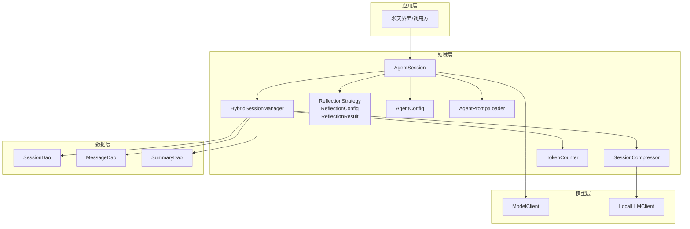
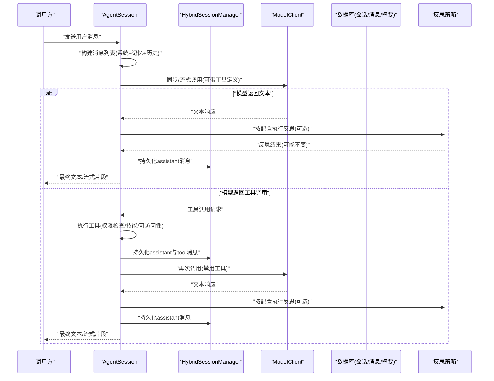
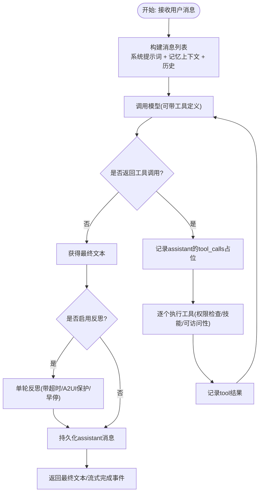
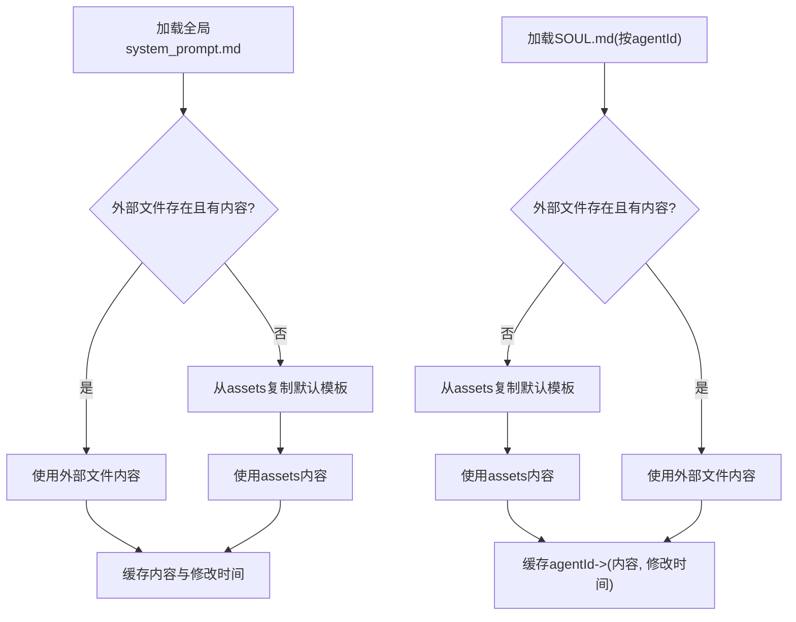
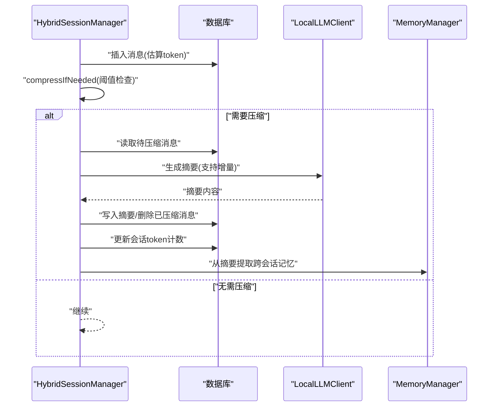
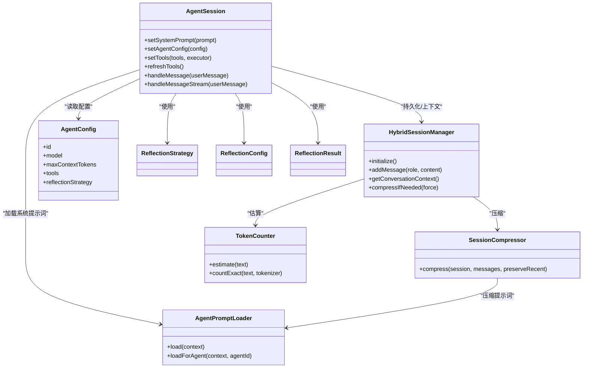

# AI对话系统

<cite>
**本文引用的文件**
- [AgentSession.kt](file://app/src/main/java/ai/openclaw/android/agent/AgentSession.kt)
- [AgentConfig.kt](file://app/src/main/java/ai/openclaw/android/config/AgentConfig.kt)
- [AgentPromptLoader.kt](file://app/src/main/java/ai/openclaw/android/agent/AgentPromptLoader.kt)
- [HybridSessionManager.kt](file://app/src/main/java/ai/openclaw/android/domain/session/HybridSessionManager.kt)
- [SessionCompressor.kt](file://app/src/main/java/ai/openclaw/android/domain/session/SessionCompressor.kt)
- [TokenCounter.kt](file://app/src/main/java/ai/openclaw/android/domain/session/TokenCounter.kt)
- [SessionConfig.kt](file://app/src/main/java/ai/openclaw/android/domain/model/SessionConfig.kt)
- [ReflectionStrategy.kt](file://app/src/main/java/ai/openclaw/android/domain/ReflectionStrategy.kt)
- [CompressionPrompts.kt](file://app/src/main/java/ai/openclaw/android/util/CompressionPrompts.kt)
- [SystemPromptLoader.kt](file://app/src/main/java/ai/openclaw/android/agent/SystemPromptLoader.kt)
</cite>

## 目录
1. [简介](#简介)
2. [项目结构](#项目结构)
3. [核心组件](#核心组件)
4. [架构总览](#架构总览)
5. [详细组件分析](#详细组件分析)
6. [依赖关系分析](#依赖关系分析)
7. [性能考量](#性能考量)
8. [故障排查指南](#故障排查指南)
9. [结论](#结论)
10. [附录](#附录)

## 简介
本技术文档围绕AI对话系统的核心模块展开，重点阐释以下方面：
- AgentSession的实现原理：消息处理、工具调用解析、多轮对话与反思机制、状态管理与错误处理
- AgentConfig的配置项与参数调优建议
- AgentPromptLoader的提示词加载与动态配置能力
- HybridSessionManager的会话压缩与令牌计数策略
- 对话流程的状态管理、错误处理与性能优化
- 使用示例与集成指导
- 扩展与自定义对话行为的方法

## 项目结构
对话系统主要由以下层次构成：
- 应用层：会话入口与UI交互（本仓库中以测试与演示为主）
- 领域层：会话管理、内存检索、工具路由与反思策略
- 数据层：会话、消息、摘要的持久化与检索
- 模型层：本地/远端模型客户端与工具执行器
- 提示词与配置：系统提示词加载器与Agent配置

图表来源
- [AgentSession.kt:35-86](file://app/src/main/java/ai/openclaw/android/agent/AgentSession.kt#L35-L86)
- [HybridSessionManager.kt:31-38](file://app/src/main/java/ai/openclaw/android/domain/session/HybridSessionManager.kt#L31-L38)
- [SessionCompressor.kt:13-17](file://app/src/main/java/ai/openclaw/android/domain/session/SessionCompressor.kt#L13-L17)
- [TokenCounter.kt:3-15](file://app/src/main/java/ai/openclaw/android/domain/session/TokenCounter.kt#L3-L15)
- [AgentConfig.kt:5-15](file://app/src/main/java/ai/openclaw/android/config/AgentConfig.kt#L5-L15)
- [AgentPromptLoader.kt:19-31](file://app/src/main/java/ai/openclaw/android/agent/AgentPromptLoader.kt#L19-L31)

章节来源
- [AgentSession.kt:35-86](file://app/src/main/java/ai/openclaw/android/agent/AgentSession.kt#L35-L86)
- [HybridSessionManager.kt:31-38](file://app/src/main/java/ai/openclaw/android/domain/session/HybridSessionManager.kt#L31-L38)
- [AgentPromptLoader.kt:19-31](file://app/src/main/java/ai/openclaw/android/agent/AgentPromptLoader.kt#L19-L31)

## 核心组件
- AgentSession：负责构建消息、调用模型、执行工具、多轮对话、反思与流式输出；维护历史、令牌估算与持久化钩子
- AgentConfig：描述Agent标识、模型、系统提示词、上下文最大令牌数、工具白名单、路由与反思策略
- AgentPromptLoader：从外部文件/资产加载全局与多Agent的提示词，支持缓存与首次复制默认模板
- HybridSessionManager：统一管理会话生命周期、消息持久化、摘要缓存、记忆注入、会话压缩与跨会话记忆提取
- SessionCompressor：对会话早期消息进行压缩生成摘要，支持LLM与简单策略
- TokenCounter：粗略估算令牌数，支持精确计数接口
- SessionConfig：会话压缩阈值、保留最近消息数、默认自动压缩开关
- ReflectionStrategy/ReflectionConfig/ReflectionResult：反思策略枚举、配置与结果封装
- CompressionPrompts：压缩提示词模板

章节来源
- [AgentSession.kt:299-362](file://app/src/main/java/ai/openclaw/android/agent/AgentSession.kt#L299-L362)
- [AgentConfig.kt:5-21](file://app/src/main/java/ai/openclaw/android/config/AgentConfig.kt#L5-L21)
- [AgentPromptLoader.kt:19-146](file://app/src/main/java/ai/openclaw/android/agent/AgentPromptLoader.kt#L19-146)
- [HybridSessionManager.kt:31-456](file://app/src/main/java/ai/openclaw/android/domain/session/HybridSessionManager.kt#L31-456)
- [SessionCompressor.kt:13-83](file://app/src/main/java/ai/openclaw/android/domain/session/SessionCompressor.kt#L13-83)
- [TokenCounter.kt:3-25](file://app/src/main/java/ai/openclaw/android/domain/session/TokenCounter.kt#L3-25)
- [SessionConfig.kt:6-10](file://app/src/main/java/ai/openclaw/android/domain/model/SessionConfig.kt#L6-10)
- [ReflectionStrategy.kt:18-175](file://app/src/main/java/ai/openclaw/android/domain/ReflectionStrategy.kt#L18-175)
- [CompressionPrompts.kt:5-31](file://app/src/main/java/ai/openclaw/android/util/CompressionPrompts.kt#L5-31)

## 架构总览
下图展示AgentSession与HybridSessionManager、模型客户端、DAO层以及反思策略之间的交互。

图表来源
- [AgentSession.kt:400-556](file://app/src/main/java/ai/openclaw/android/agent/AgentSession.kt#L400-L556)
- [HybridSessionManager.kt:70-110](file://app/src/main/java/ai/openclaw/android/domain/session/HybridSessionManager.kt#L70-L110)
- [ReflectionStrategy.kt:54-92](file://app/src/main/java/ai/openclaw/android/domain/ReflectionStrategy.kt#L54-L92)

## 详细组件分析

### AgentSession：消息处理、工具调用与多轮对话
- 消息构建与注入
  - 构建系统提示词：支持自定义Agent提示词叠加基础提示词，设备能力注入分隔段落
  - 记忆上下文注入：从HybridSessionManager获取“用户的重要记忆”作为system消息
  - 历史管理：维护消息列表，基于令牌估算进行头部裁剪
- 工具调用解析与执行
  - 工具过滤：根据AgentConfig的tools白名单前缀筛选技能工具
  - 权限检查：对技能工具执行前检查权限，必要时通过PermissionManager发起授权请求
  - 执行顺序：先记录assistant的tool_calls占位消息，再逐个执行tool并记录tool结果
- 多轮对话与反思
  - 流式输出：实时发射Token、ToolExecuting、ToolResult、Reflection事件，最后Complete
  - 反思：在非工具调用的最终文本阶段，按ReflectionConfig执行单轮反思，具备超时、A2UI保护与早停机制
- 状态与持久化
  - 历史清空与读取
  - 通过HybridSessionManager钩子持久化用户与助手消息

图表来源
- [AgentSession.kt:400-556](file://app/src/main/java/ai/openclaw/android/agent/AgentSession.kt#L400-L556)
- [AgentSession.kt:560-639](file://app/src/main/java/ai/openclaw/android/agent/AgentSession.kt#L560-L639)
- [AgentSession.kt:643-683](file://app/src/main/java/ai/openclaw/android/agent/AgentSession.kt#L643-L683)
- [ReflectionStrategy.kt:729-789](file://app/src/main/java/ai/openclaw/android/domain/ReflectionStrategy.kt#L729-L789)

章节来源
- [AgentSession.kt:400-556](file://app/src/main/java/ai/openclaw/android/agent/AgentSession.kt#L400-L556)
- [AgentSession.kt:560-639](file://app/src/main/java/ai/openclaw/android/agent/AgentSession.kt#L560-L639)
- [AgentSession.kt:643-683](file://app/src/main/java/ai/openclaw/android/agent/AgentSession.kt#L643-L683)
- [ReflectionStrategy.kt:729-789](file://app/src/main/java/ai/openclaw/android/domain/ReflectionStrategy.kt#L729-L789)

### AgentConfig：配置项与参数调优
- 关键字段
  - id/name：Agent标识与显示名
  - model：模型名称，默认指向特定模型
  - systemPrompt：自定义系统提示词，可叠加基础提示词
  - maxContextTokens：上下文最大令牌数，影响历史裁剪
  - tools：工具白名单，支持“all”全量或前缀过滤
  - routing：关键词路由至目标Agent
  - reflectionStrategy：反思策略，默认关闭
- 调优建议
  - 上下文令牌：根据设备性能与对话长度调整，避免频繁裁剪
  - 工具白名单：仅开放必要技能，降低推理负担
  - 反思策略：默认关闭，仅在高价值场景按需开启

章节来源
- [AgentConfig.kt:5-21](file://app/src/main/java/ai/openclaw/android/config/AgentConfig.kt#L5-L21)

### AgentPromptLoader：提示词加载与动态配置
- 全局提示词
  - 优先读取外部文件，不存在则从assets复制默认模板
  - 支持缓存与文件修改时间校验，避免重复IO
- 多Agent提示词（SOUL.md）
  - 按agentId独立加载，支持缓存与首次复制默认模板
  - 不存在时回退到全局提示词
- 动态编辑
  - 通过文件管理器或adb编辑外部文件，无需重新编译

图表来源
- [AgentPromptLoader.kt:40-86](file://app/src/main/java/ai/openclaw/android/agent/AgentPromptLoader.kt#L40-L86)
- [AgentPromptLoader.kt:107-146](file://app/src/main/java/ai/openclaw/android/agent/AgentPromptLoader.kt#L107-L146)

章节来源
- [AgentPromptLoader.kt:40-86](file://app/src/main/java/ai/openclaw/android/agent/AgentPromptLoader.kt#L40-L86)
- [AgentPromptLoader.kt:107-146](file://app/src/main/java/ai/openclaw/android/agent/AgentPromptLoader.kt#L107-L146)

### HybridSessionManager：会话压缩与令牌计数策略
- 会话生命周期
  - 初始化/恢复：获取最新会话，否则创建新会话
  - 切换/结束：支持按ID切换与结束当前会话
- 消息持久化与令牌计数
  - 插入消息时估算令牌数并更新会话token计数
  - 按SessionConfig阈值触发压缩
- 摘要缓存与记忆注入
  - LRU缓存摘要，减少数据库访问
  - 获取对话上下文时注入“用户的重要记忆”
- 会话压缩
  - performCompression：对早期消息生成摘要，删除已压缩消息，更新token计数
  - generateSummary：支持增量压缩（合并旧摘要与新消息）
  - extractMemoriesFromSummary：从摘要中提取用户偏好/决策/任务等跨会话记忆
- 自动记忆触发
  - 用户消息中检测手动记忆关键词，延迟触发记忆提取

图表来源
- [HybridSessionManager.kt:70-110](file://app/src/main/java/ai/openclaw/android/domain/session/HybridSessionManager.kt#L70-L110)
- [HybridSessionManager.kt:248-299](file://app/src/main/java/ai/openclaw/android/domain/session/HybridSessionManager.kt#L248-L299)
- [HybridSessionManager.kt:345-398](file://app/src/main/java/ai/openclaw/android/domain/session/HybridSessionManager.kt#L345-L398)

章节来源
- [HybridSessionManager.kt:59-65](file://app/src/main/java/ai/openclaw/android/domain/session/HybridSessionManager.kt#L59-L65)
- [HybridSessionManager.kt:70-110](file://app/src/main/java/ai/openclaw/android/domain/session/HybridSessionManager.kt#L70-L110)
- [HybridSessionManager.kt:248-299](file://app/src/main/java/ai/openclaw/android/domain/session/HybridSessionManager.kt#L248-L299)
- [HybridSessionManager.kt:345-398](file://app/src/main/java/ai/openclaw/android/domain/session/HybridSessionManager.kt#L345-L398)

### SessionCompressor与TokenCounter：压缩与计数
- SessionCompressor
  - 当消息数量超过保留数时进行压缩
  - LLM可用时使用压缩提示词生成摘要；不可用时采用简单摘要策略
- TokenCounter
  - 粗略估算：中文字符与非中文字符分别估算，保证最小计数为1
  - 精确计数接口预留，实际调用具体tokenizer

章节来源
- [SessionCompressor.kt:18-60](file://app/src/main/java/ai/openclaw/android/domain/session/SessionCompressor.kt#L18-L60)
- [TokenCounter.kt:8-24](file://app/src/main/java/ai/openclaw/android/domain/session/TokenCounter.kt#L8-L24)

### 反思机制：策略、配置与结果
- 策略枚举
  - NONE：默认关闭
  - LIGHT：轻量反思，单轮检查员角色
- 配置
  - timeoutMs：单轮超时
  - minChangeRate：变化率阈值，低于则早停
  - protectA2UI：是否保护A2UI卡片格式
- 结果
  - refinedContent、changed、changeRate、roundsCompleted、a2uiPreserved
- 工具函数
  - changeRate：基于字符差异计算变化率
  - isA2UIPreserved：检查A2UI标签完整性

章节来源
- [ReflectionStrategy.kt:18-49](file://app/src/main/java/ai/openclaw/android/domain/ReflectionStrategy.kt#L18-L49)
- [ReflectionStrategy.kt:54-92](file://app/src/main/java/ai/openclaw/android/domain/ReflectionStrategy.kt#L54-L92)
- [ReflectionStrategy.kt:129-175](file://app/src/main/java/ai/openclaw/android/domain/ReflectionStrategy.kt#L129-L175)

### 提示词压缩模板
- CompressionPrompts：提供摘要系统提示词与构建压缩提示词的方法

章节来源
- [CompressionPrompts.kt:5-31](file://app/src/main/java/ai/openclaw/android/util/CompressionPrompts.kt#L5-31)

### 已废弃的SystemPromptLoader
- 为兼容性保留，委托给AgentPromptLoader

章节来源
- [SystemPromptLoader.kt:18-42](file://app/src/main/java/ai/openclaw/android/agent/SystemPromptLoader.kt#L18-L42)

## 依赖关系分析
- 组件耦合
  - AgentSession依赖ModelClient、SkillManager、PermissionManager、HybridSessionManager、ReflectionStrategy
  - HybridSessionManager依赖DAO层、TokenCounter、SessionCompressor、MemoryManager、LocalLLMClient
- 外部依赖
  - 数据库：Room DAO（SessionDao、MessageDao、SummaryDao）
  - 本地LLM：LocalLLMClient（用于摘要生成）
- 潜在循环依赖
  - 通过接口与注入避免直接循环，保持低耦合

图表来源
- [AgentSession.kt:35-86](file://app/src/main/java/ai/openclaw/android/agent/AgentSession.kt#L35-L86)
- [HybridSessionManager.kt:31-38](file://app/src/main/java/ai/openclaw/android/domain/session/HybridSessionManager.kt#L31-L38)
- [SessionCompressor.kt:13-17](file://app/src/main/java/ai/openclaw/android/domain/session/SessionCompressor.kt#L13-L17)
- [TokenCounter.kt:3-15](file://app/src/main/java/ai/openclaw/android/domain/session/TokenCounter.kt#L3-L15)
- [AgentConfig.kt:5-21](file://app/src/main/java/ai/openclaw/android/config/AgentConfig.kt#L5-L21)
- [AgentPromptLoader.kt:19-31](file://app/src/main/java/ai/openclaw/android/agent/AgentPromptLoader.kt#L19-L31)
- [ReflectionStrategy.kt:18-92](file://app/src/main/java/ai/openclaw/android/domain/ReflectionStrategy.kt#L18-L92)

章节来源
- [AgentSession.kt:35-86](file://app/src/main/java/ai/openclaw/android/agent/AgentSession.kt#L35-L86)
- [HybridSessionManager.kt:31-38](file://app/src/main/java/ai/openclaw/android/domain/session/HybridSessionManager.kt#L31-L38)
- [SessionCompressor.kt:13-17](file://app/src/main/java/ai/openclaw/android/domain/session/SessionCompressor.kt#L13-L17)
- [TokenCounter.kt:3-15](file://app/src/main/java/ai/openclaw/android/domain/session/TokenCounter.kt#L3-L15)
- [AgentConfig.kt:5-21](file://app/src/main/java/ai/openclaw/android/config/AgentConfig.kt#L5-L21)
- [AgentPromptLoader.kt:19-31](file://app/src/main/java/ai/openclaw/android/agent/AgentPromptLoader.kt#L19-L31)
- [ReflectionStrategy.kt:18-92](file://app/src/main/java/ai/openclaw/android/domain/ReflectionStrategy.kt#L18-L92)

## 性能考量
- 令牌估算与裁剪
  - 历史裁剪基于估算值，避免过度IO与模型调用
  - 建议根据设备性能与对话长度调整maxContextTokens
- 工具调用与权限
  - 工具过滤与权限检查在执行前完成，减少无效调用
  - 技能工具执行在IO线程，避免阻塞主线程
- 流式输出
  - 流式模式实时发射事件，降低首帧延迟
- 会话压缩
  - 增量摘要合并减少重复工作
  - LLM不可用时采用简单摘要策略，保证可用性
- 反思保护
  - 单轮超时、A2UI保护与早停，避免无效消耗

## 故障排查指南
- 模型调用失败
  - 现象：handleMessage返回错误信息
  - 排查：检查ModelClient初始化、网络/模型可用性
- 工具执行异常
  - 现象：ToolResult错误或权限不足
  - 排查：确认工具白名单、权限授予、技能定义
- 会话持久化失败
  - 现象：日志警告“Failed to persist message”
  - 排查：检查DAO层连接、数据库状态
- 提示词加载异常
  - 现象：兜底提示词生效
  - 排查：检查外部文件路径、assets默认模板、文件权限
- 反思未生效
  - 现象：原答案未变更
  - 排查：确认ReflectionConfig策略、超时、A2UI保护与变化率阈值

章节来源
- [AgentSession.kt:413-416](file://app/src/main/java/ai/openclaw/android/agent/AgentSession.kt#L413-L416)
- [AgentSession.kt:383-396](file://app/src/main/java/ai/openclaw/android/agent/AgentSession.kt#L383-L396)
- [AgentPromptLoader.kt:69-72](file://app/src/main/java/ai/openclaw/android/agent/AgentPromptLoader.kt#L69-L72)
- [ReflectionStrategy.kt:725-789](file://app/src/main/java/ai/openclaw/android/domain/ReflectionStrategy.kt#L725-L789)

## 结论
本对话系统通过AgentSession统一调度模型与工具，结合HybridSessionManager实现会话压缩与记忆注入，辅以AgentPromptLoader的动态提示词与ReflectionStrategy的安全反思机制，形成稳定、可扩展且高性能的对话框架。建议在生产环境中：
- 合理设置AgentConfig的上下文与工具白名单
- 使用AgentPromptLoader进行提示词热更新
- 按需开启反思策略，平衡质量与性能
- 通过会话压缩与令牌估算控制成本

## 附录
- 使用示例与集成指导
  - 初始化AgentSession：注入ModelClient、SkillManager、可选PermissionManager与maxContextTokens
  - 设置系统提示词：通过AgentPromptLoader加载并setSystemPrompt
  - 设置AgentConfig：setAgentConfig，按需设置tools白名单与reflectionStrategy
  - 启用设备能力：setDeviceCapabilities以启用格式决策
  - 启用会话管理：setSessionManager(HybridSessionManager)，自动持久化与压缩
  - 发起对话：handleMessage或handleMessageStream
- 扩展与自定义
  - 新增工具：通过SkillManager注册技能，AgentSession会自动刷新工具列表
  - 自定义提示词：在/sdcard/Android/data/.../files目录放置system_prompt.md或agents/<agentId>/SOUL.md
  - 自定义反思：调整ReflectionConfig的timeoutMs、minChangeRate、protectA2UI
  - 自定义压缩：调整SessionConfig的maxTokens与preserveRecentMessages

章节来源
- [AgentSession.kt:66-103](file://app/src/main/java/ai/openclaw/android/agent/AgentSession.kt#L66-L103)
- [AgentSession.kt:271-285](file://app/src/main/java/ai/openclaw/android/agent/AgentSession.kt#L271-L285)
- [AgentSession.kt:334-362](file://app/src/main/java/ai/openclaw/android/agent/AgentSession.kt#L334-L362)
- [AgentPromptLoader.kt:107-146](file://app/src/main/java/ai/openclaw/android/agent/AgentPromptLoader.kt#L107-L146)
- [HybridSessionManager.kt:412-423](file://app/src/main/java/ai/openclaw/android/domain/session/HybridSessionManager.kt#L412-L423)
- [SessionConfig.kt:6-10](file://app/src/main/java/ai/openclaw/android/domain/model/SessionConfig.kt#L6-10)
- [ReflectionStrategy.kt:54-71](file://app/src/main/java/ai/openclaw/android/domain/ReflectionStrategy.kt#L54-L71)