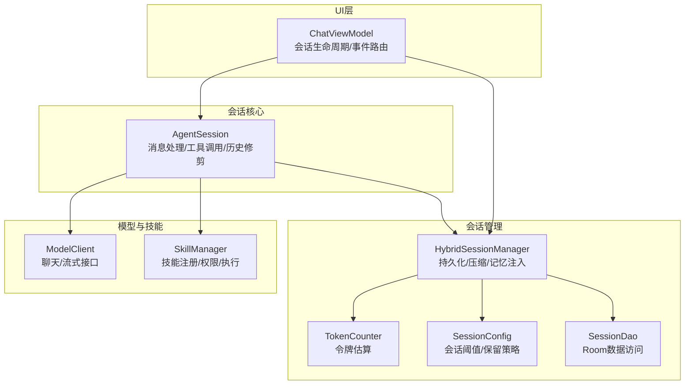
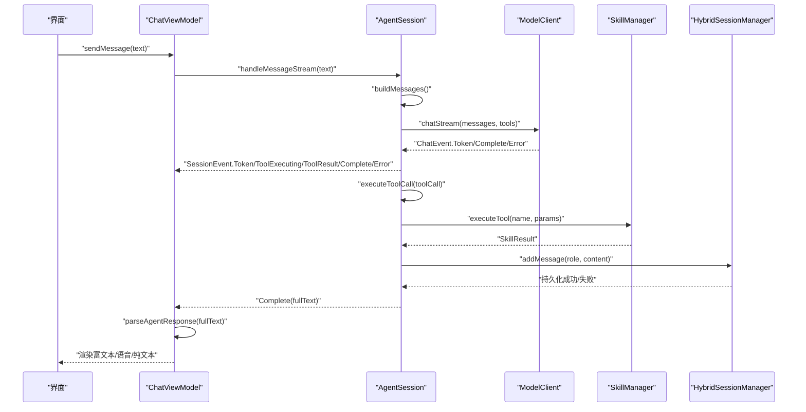
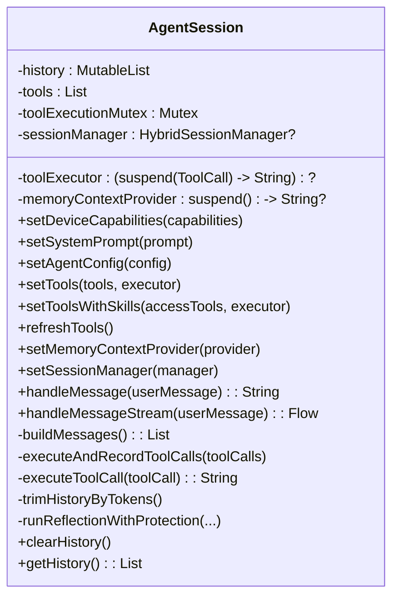
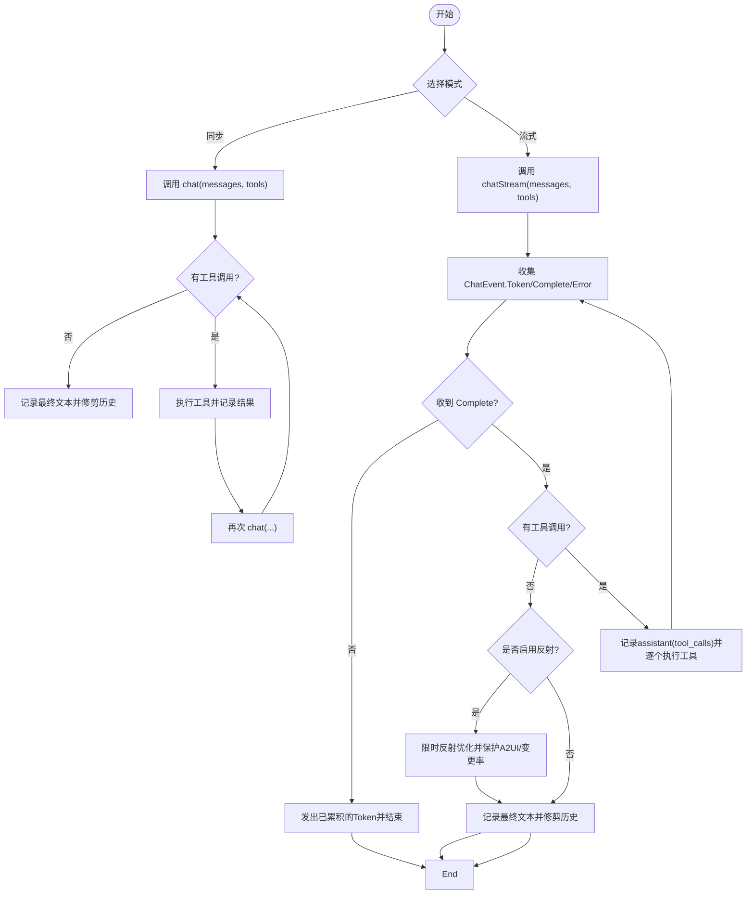
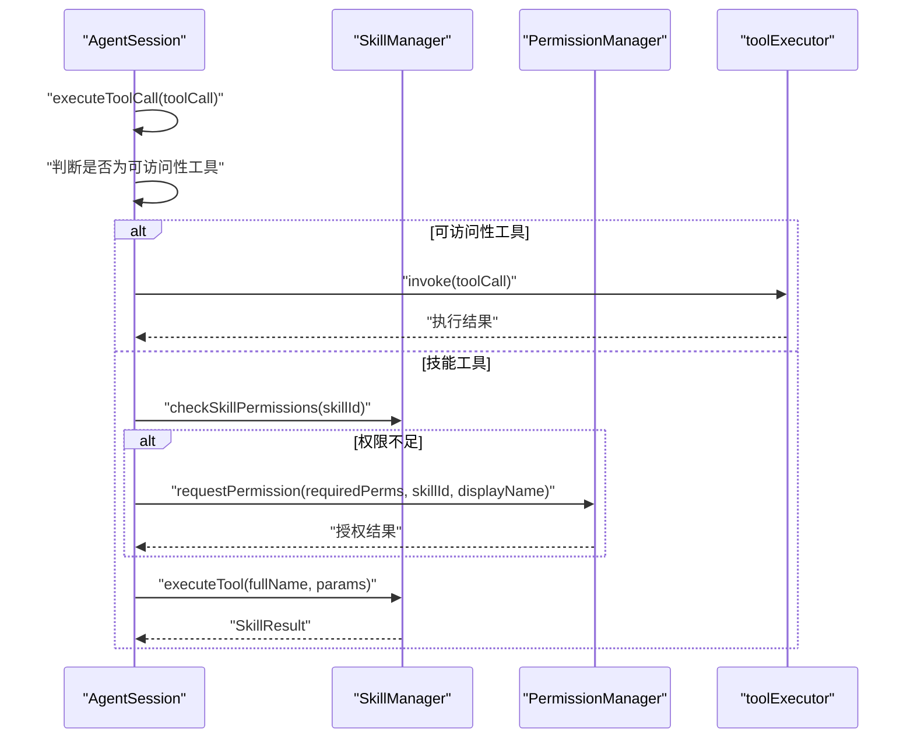
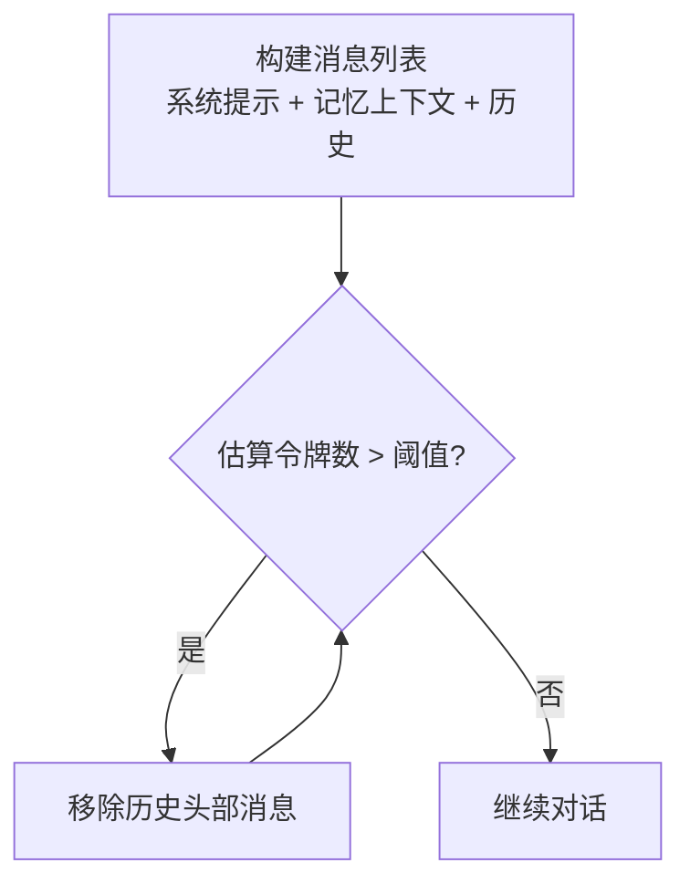
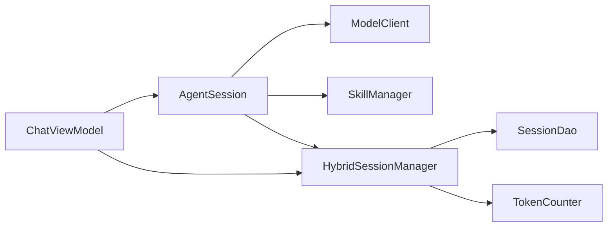

# Agent会话核心

<cite>
**本文引用的文件**
- [AgentSession.kt](file://app/src/main/java/ai/openclaw/android/agent/AgentSession.kt)
- [HybridSessionManager.kt](file://app/src/main/java/ai/openclaw/android/domain/session/HybridSessionManager.kt)
- [TokenCounter.kt](file://app/src/main/java/ai/openclaw/android/domain/session/TokenCounter.kt)
- [SessionConfig.kt](file://app/src/main/java/ai/openclaw/android/domain/model/SessionConfig.kt)
- [SessionDao.kt](file://app/src/main/java/ai/openclaw/android/data/local/SessionDao.kt)
- [AgentResponse.kt](file://app/src/main/java/ai/openclaw/android/domain/AgentResponse.kt)
- [SkillManager.kt](file://app/src/main/java/ai/openclaw/android/skill/SkillManager.kt)
- [ModelClient.kt](file://app/src/main/java/ai/openclaw/android/model/ModelClient.kt)
- [ChatViewModel.kt](file://app/src/main/java/ai/openclaw/android/viewmodel/ChatViewModel.kt)
- [AgentSessionTest.kt](file://app/src/androidTest/java/ai/openclaw/android/agent/AgentSessionTest.kt)
</cite>

## 目录
1. [简介](#简介)
2. [项目结构](#项目结构)
3. [核心组件](#核心组件)
4. [架构总览](#架构总览)
5. [详细组件分析](#详细组件分析)
6. [依赖关系分析](#依赖关系分析)
7. [性能考量](#性能考量)
8. [故障排查指南](#故障排查指南)
9. [结论](#结论)
10. [附录](#附录)

## 简介
本文件面向“Agent会话核心”模块，聚焦于AgentSession类的实现原理与使用实践，涵盖消息处理流程、工具调用解析机制、多轮对话管理与历史记录维护；对比同步与流式两种对话模式的差异与适用场景；阐述会话状态管理、令牌计数策略与历史记录修剪机制；解释工具执行的并发控制与权限检查；并提供会话生命周期管理、错误处理与超时保护的实现细节及配置使用示例路径。

## 项目结构
围绕Agent会话核心的相关代码主要分布在以下包与文件：
- 会话核心：ai.openclaw.android.agent.AgentSession
- 会话管理：ai.openclaw.android.domain.session.HybridSessionManager
- 令牌计数：ai.openclaw.android.domain.session.TokenCounter
- 会话配置：ai.openclaw.android.domain.model.SessionConfig
- 数据访问：ai.openclaw.android.data.local.SessionDao
- 响应模型：ai.openclaw.android.domain.AgentResponse
- 技能管理：ai.openclaw.android.skill.SkillManager
- 模型接口：ai.openclaw.android.model.ModelClient
- UI集成：ai.openclaw.android.viewmodel.ChatViewModel
- 测试用例：ai.openclaw.android.agent.AgentSessionTest

图表来源
- [AgentSession.kt](file://app/src/main/java/ai/openclaw/android/agent/AgentSession.kt)
- [HybridSessionManager.kt](file://app/src/main/java/ai/openclaw/android/domain/session/HybridSessionManager.kt)
- [TokenCounter.kt](file://app/src/main/java/ai/openclaw/android/domain/session/TokenCounter.kt)
- [SessionConfig.kt](file://app/src/main/java/ai/openclaw/android/domain/model/SessionConfig.kt)
- [SessionDao.kt](file://app/src/main/java/ai/openclaw/android/data/local/SessionDao.kt)
- [ModelClient.kt](file://app/src/main/java/ai/openclaw/android/model/ModelClient.kt)
- [SkillManager.kt](file://app/src/main/java/ai/openclaw/android/skill/SkillManager.kt)
- [ChatViewModel.kt](file://app/src/main/java/ai/openclaw/android/viewmodel/ChatViewModel.kt)

章节来源
- [AgentSession.kt](file://app/src/main/java/ai/openclaw/android/agent/AgentSession.kt)
- [HybridSessionManager.kt](file://app/src/main/java/ai/openclaw/android/domain/session/HybridSessionManager.kt)
- [TokenCounter.kt](file://app/src/main/java/ai/openclaw/android/domain/session/TokenCounter.kt)
- [SessionConfig.kt](file://app/src/main/java/ai/openclaw/android/domain/model/SessionConfig.kt)
- [SessionDao.kt](file://app/src/main/java/ai/openclaw/android/data/local/SessionDao.kt)
- [ModelClient.kt](file://app/src/main/java/ai/openclaw/android/model/ModelClient.kt)
- [SkillManager.kt](file://app/src/main/java/ai/openclaw/android/skill/SkillManager.kt)
- [ChatViewModel.kt](file://app/src/main/java/ai/openclaw/android/viewmodel/ChatViewModel.kt)

## 核心组件
- AgentSession：负责构建系统提示与上下文、维护历史、调用模型、解析工具调用、执行工具、流式事件分发、反射优化与历史修剪。
- HybridSessionManager：负责会话持久化、消息写入、令牌计数、会话压缩、摘要缓存、记忆注入与跨会话记忆提取。
- TokenCounter：提供粗略令牌估算，支持精确计数扩展点。
- SessionConfig：定义会话压缩阈值、最近消息保留数量等策略参数。
- SessionDao：Room数据访问接口，支撑会话与消息的增删改查。
- ModelClient：统一的模型调用接口，支持非流式与流式两种模式。
- SkillManager：技能注册、权限检查、工具执行与动态刷新。
- AgentResponse：对模型输出进行结构化解析，支持富文本/语音/混合交付。
- ChatViewModel：UI层会话生命周期管理、事件收集与响应路由。

章节来源
- [AgentSession.kt](file://app/src/main/java/ai/openclaw/android/agent/AgentSession.kt)
- [HybridSessionManager.kt](file://app/src/main/java/ai/openclaw/android/domain/session/HybridSessionManager.kt)
- [TokenCounter.kt](file://app/src/main/java/ai/openclaw/android/domain/session/TokenCounter.kt)
- [SessionConfig.kt](file://app/src/main/java/ai/openclaw/android/domain/model/SessionConfig.kt)
- [SessionDao.kt](file://app/src/main/java/ai/openclaw/android/data/local/SessionDao.kt)
- [ModelClient.kt](file://app/src/main/java/ai/openclaw/android/model/ModelClient.kt)
- [SkillManager.kt](file://app/src/main/java/ai/openclaw/android/skill/SkillManager.kt)
- [AgentResponse.kt](file://app/src/main/java/ai/openclaw/android/domain/AgentResponse.kt)
- [ChatViewModel.kt](file://app/src/main/java/ai/openclaw/android/viewmodel/ChatViewModel.kt)

## 架构总览
AgentSession作为会话编排者，串联模型客户端与技能管理器，并通过HybridSessionManager实现消息持久化与会话压缩。UI层由ChatViewModel驱动，负责事件收集与响应路由。

图表来源
- [ChatViewModel.kt](file://app/src/main/java/ai/openclaw/android/viewmodel/ChatViewModel.kt)
- [AgentSession.kt](file://app/src/main/java/ai/openclaw/android/agent/AgentSession.kt)
- [ModelClient.kt](file://app/src/main/java/ai/openclaw/android/model/ModelClient.kt)
- [SkillManager.kt](file://app/src/main/java/ai/openclaw/android/skill/SkillManager.kt)
- [HybridSessionManager.kt](file://app/src/main/java/ai/openclaw/android/domain/session/HybridSessionManager.kt)

## 详细组件分析

### AgentSession 类
- 职责
  - 维护会话历史与系统提示，构建消息列表。
  - 同步与流式两种对话模式：handleMessage 与 handleMessageStream。
  - 工具调用解析与执行：区分可访问性工具与技能工具，权限检查与并发控制。
  - 历史修剪：基于令牌估算的线性移除策略。
  - 反射优化：在流式模式下对最终回答进行限时、A2UI格式保护与变更率阈值控制。
  - 与HybridSessionManager协作：消息持久化与记忆上下文注入。
- 关键实现要点
  - 工具过滤：支持按前缀白名单限制技能工具暴露。
  - 并发控制：工具执行使用互斥锁，避免竞态。
  - 权限检查：技能工具执行前检查权限，必要时通过PermissionManager发起运行时授权请求。
  - 历史修剪：按字符集权重估算令牌数，超过阈值时从历史头部移除。
  - 反射保护：超时保护、空内容拒绝、A2UI格式保护、低变更率早停。
  - 事件模型：SessionEvent封装Token、ToolExecuting、ToolResult、Complete、Error、ReflectionStart/Complete。

图表来源
- [AgentSession.kt](file://app/src/main/java/ai/openclaw/android/agent/AgentSession.kt)

章节来源
- [AgentSession.kt](file://app/src/main/java/ai/openclaw/android/agent/AgentSession.kt)

### 同步与流式对话模式
- 同步模式（handleMessage）
  - 适合一次性交互、无需实时反馈的场景。
  - 优点：实现简单、易用；缺点：无法感知工具执行过程与中间结果。
- 流式模式（handleMessageStream）
  - 适合需要实时反馈的场景，如打字机效果、工具执行进度提示。
  - 事件类型：Token、ToolExecuting、ToolResult、Complete、Error、ReflectionStart/Complete。
  - 在流式过程中，工具调用的参数解析与执行均在Complete事件后进行，以确保工具调用完整性。

图表来源
- [AgentSession.kt](file://app/src/main/java/ai/openclaw/android/agent/AgentSession.kt)
- [ModelClient.kt](file://app/src/main/java/ai/openclaw/android/model/ModelClient.kt)

章节来源
- [AgentSession.kt](file://app/src/main/java/ai/openclaw/android/agent/AgentSession.kt)
- [ModelClient.kt](file://app/src/main/java/ai/openclaw/android/model/ModelClient.kt)

### 工具调用解析与执行
- 工具分类
  - 可访问性工具：直接通过toolExecutor回调执行。
  - 技能工具：以“技能ID_工具名”的命名空间组织，执行前进行权限检查。
- 解析与匹配
  - 参数解析：将JSON字符串转换为Map。
  - 前缀匹配：优先最长前缀匹配，确保技能ID包含下划线时也能正确解析。
- 并发与权限
  - 并发控制：工具执行使用Mutex，保证串行执行。
  - 权限检查：若权限不足，尝试通过PermissionManager发起授权请求；若仍失败，返回明确提示。

图表来源
- [AgentSession.kt](file://app/src/main/java/ai/openclaw/android/agent/AgentSession.kt)
- [SkillManager.kt](file://app/src/main/java/ai/openclaw/android/skill/SkillManager.kt)

章节来源
- [AgentSession.kt](file://app/src/main/java/ai/openclaw/android/agent/AgentSession.kt)
- [SkillManager.kt](file://app/src/main/java/ai/openclaw/android/skill/SkillManager.kt)

### 多轮对话管理与历史记录维护
- 历史构建
  - 系统提示：内置基础提示与设备能力提示拼接，支持AgentConfig覆盖。
  - 记忆上下文：通过HybridSessionManager注入“用户的重要记忆”。
  - 历史记录：用户消息、助手消息、工具调用与工具结果按顺序维护。
- 历史修剪
  - 令牌估算：CJK字符按权重估算，ASCII字符按权重估算，合计得到近似令牌数。
  - 策略：当历史总令牌数超过阈值且历史长度大于最小保留长度时，从头部移除最早消息，直到满足阈值。
- 会话压缩
  - HybridSessionManager负责定期或达到阈值时进行压缩，生成摘要并删除已压缩消息，同时更新会话令牌计数。

图表来源
- [AgentSession.kt](file://app/src/main/java/ai/openclaw/android/agent/AgentSession.kt)
- [HybridSessionManager.kt](file://app/src/main/java/ai/openclaw/android/domain/session/HybridSessionManager.kt)
- [TokenCounter.kt](file://app/src/main/java/ai/openclaw/android/domain/session/TokenCounter.kt)

章节来源
- [AgentSession.kt](file://app/src/main/java/ai/openclaw/android/agent/AgentSession.kt)
- [HybridSessionManager.kt](file://app/src/main/java/ai/openclaw/android/domain/session/HybridSessionManager.kt)
- [TokenCounter.kt](file://app/src/main/java/ai/openclaw/android/domain/session/TokenCounter.kt)

### 会话状态管理、令牌计数策略与历史记录修剪机制
- 会话状态
  - HybridSessionManager维护当前会话、最后活跃时间、累计令牌数与状态。
  - 支持创建命名会话、切换会话、结束会话与清理。
- 令牌计数
  - TokenCounter提供粗略估算，支持精确计数扩展点。
  - HybridSessionManager在添加消息时计算并累加令牌数，触发压缩。
- 历史修剪
  - AgentSession在每次产生最终文本后进行令牌修剪，确保上下文不超限。
  - HybridSessionManager在压缩阶段删除已压缩消息并更新令牌计数。

章节来源
- [HybridSessionManager.kt](file://app/src/main/java/ai/openclaw/android/domain/session/HybridSessionManager.kt)
- [TokenCounter.kt](file://app/src/main/java/ai/openclaw/android/domain/session/TokenCounter.kt)
- [SessionConfig.kt](file://app/src/main/java/ai/openclaw/android/domain/model/SessionConfig.kt)
- [SessionDao.kt](file://app/src/main/java/ai/openclaw/android/data/local/SessionDao.kt)

### 工具执行的并发控制与权限检查
- 并发控制
  - 使用Mutex确保工具执行串行化，避免竞态条件。
- 权限检查
  - 技能工具执行前检查所需权限，若缺失则尝试运行时授权请求；若仍失败，返回明确提示。

章节来源
- [AgentSession.kt](file://app/src/main/java/ai/openclaw/android/agent/AgentSession.kt)
- [SkillManager.kt](file://app/src/main/java/ai/openclaw/android/skill/SkillManager.kt)

### 会话生命周期管理、错误处理与超时保护
- 生命周期
  - ChatViewModel负责AgentSession与HybridSessionManager的初始化、配置更新与清理。
  - 支持动态切换模型提供商与重载本地模型资源。
- 错误处理
  - ModelClient流式事件包含Error类型，AgentSession将其转化为SessionEvent.Error并上抛。
  - UI层捕获错误并展示友好提示。
- 超时保护
  - 反射阶段使用withTimeoutOrNull限制最大耗时，防止长时间阻塞。
  - 反射保护：空内容拒绝、A2UI格式保护、低变更率早停。

章节来源
- [ChatViewModel.kt](file://app/src/main/java/ai/openclaw/android/viewmodel/ChatViewModel.kt)
- [AgentSession.kt](file://app/src/main/java/ai/openclaw/android/agent/AgentSession.kt)
- [ModelClient.kt](file://app/src/main/java/ai/openclaw/android/model/ModelClient.kt)

### 实际使用示例（代码路径）
- 同步对话（非流式）
  - 示例路径：[ChatViewModel.sendMessage:222-327](file://app/src/main/java/ai/openclaw/android/viewmodel/ChatViewModel.kt#L222-L327)
  - 说明：调用AgentSession.handleMessage，适用于一次性回复场景。
- 流式对话（推荐）
  - 示例路径：[ChatViewModel.sendMessage:222-327](file://app/src/main/java/ai/openclaw/android/viewmodel/ChatViewModel.kt#L222-L327)
  - 说明：订阅AgentSession.handleMessageStream，实时渲染Token与工具执行事件。
- 工具调用与权限
  - 示例路径：[AgentSessionTest.streaming_toolCall_executesToolAndCompletes:82-141](file://app/src/androidTest/java/ai/openclaw/android/agent/AgentSessionTest.kt#L82-L141)
  - 说明：演示工具调用触发、工具执行与最终回复的完整流程。
- 会话配置与系统提示
  - 示例路径：[AgentSession.setSystemPrompt:271-274](file://app/src/main/java/ai/openclaw/android/agent/AgentSession.kt#L271-L274)
  - 示例路径：[AgentSession.setAgentConfig:282-285](file://app/src/main/java/ai/openclaw/android/agent/AgentSession.kt#L282-L285)
  - 说明：动态设置系统提示与Agent配置，影响消息构建与工具过滤。
- 记忆上下文注入
  - 示例路径：[ChatViewModel.setupMemorySubsystem:187-215](file://app/src/main/java/ai/openclaw/android/viewmodel/ChatViewModel.kt#L187-L215)
  - 说明：通过HybridSessionManager.getMemoryContext注入“用户的重要记忆”。

章节来源
- [ChatViewModel.kt](file://app/src/main/java/ai/openclaw/android/viewmodel/ChatViewModel.kt)
- [AgentSessionTest.kt](file://app/src/androidTest/java/ai/openclaw/android/agent/AgentSessionTest.kt)
- [AgentSession.kt](file://app/src/main/java/ai/openclaw/android/agent/AgentSession.kt)

## 依赖关系分析
- 组件耦合
  - AgentSession强依赖ModelClient与SkillManager；弱依赖HybridSessionManager用于持久化与记忆注入。
  - ChatViewModel协调AgentSession与HybridSessionManager，承担UI层会话生命周期。
- 外部依赖
  - Room数据库（SessionDao）用于会话与消息持久化。
  - OkHttp用于网络请求（部分技能工具）。
- 潜在循环依赖
  - 当前设计通过接口解耦，未见明显循环依赖。

图表来源
- [AgentSession.kt](file://app/src/main/java/ai/openclaw/android/agent/AgentSession.kt)
- [HybridSessionManager.kt](file://app/src/main/java/ai/openclaw/android/domain/session/HybridSessionManager.kt)
- [SessionDao.kt](file://app/src/main/java/ai/openclaw/android/data/local/SessionDao.kt)
- [TokenCounter.kt](file://app/src/main/java/ai/openclaw/android/domain/session/TokenCounter.kt)
- [ChatViewModel.kt](file://app/src/main/java/ai/openclaw/android/viewmodel/ChatViewModel.kt)

章节来源
- [AgentSession.kt](file://app/src/main/java/ai/openclaw/android/agent/AgentSession.kt)
- [HybridSessionManager.kt](file://app/src/main/java/ai/openclaw/android/domain/session/HybridSessionManager.kt)
- [SessionDao.kt](file://app/src/main/java/ai/openclaw/android/data/local/SessionDao.kt)
- [TokenCounter.kt](file://app/src/main/java/ai/openclaw/android/domain/session/TokenCounter.kt)
- [ChatViewModel.kt](file://app/src/main/java/ai/openclaw/android/viewmodel/ChatViewModel.kt)

## 性能考量
- 令牌估算
  - CJK字符与ASCII字符分别估算，整体复杂度O(n)，n为消息长度。
- 历史修剪
  - 每轮完成后线性修剪，平均每次O(k)（k为移除条目数），整体开销可控。
- 流式渲染
  - UI层按Token增量渲染，降低首帧延迟，提升交互体验。
- 压缩策略
  - HybridSessionManager在达到阈值时进行压缩，减少数据库压力与上下文长度。

[本节为通用性能讨论，无需特定文件来源]

## 故障排查指南
- 流式无Complete事件
  - 现象：仅收到Token但无Complete，最终可能触发“无响应”错误。
  - 排查：确认模型客户端实现是否正确发出Complete事件。
  - 参考：[AgentSession.handleMessageStream:451-556](file://app/src/main/java/ai/openclaw/android/agent/AgentSession.kt#L451-L556)
- 工具执行失败
  - 现象：ToolResult为空或报错。
  - 排查：检查工具名称匹配、参数解析与权限；查看SkillManager日志。
  - 参考：[AgentSession.executeToolCall:582-639](file://app/src/main/java/ai/openclaw/android/agent/AgentSession.kt#L582-L639)
- 反射优化异常
  - 现象：反射阶段超时或A2UI被破坏。
  - 排查：检查超时配置、模型稳定性与内容格式。
  - 参考：[AgentSession.runReflectionWithProtection:725-789](file://app/src/main/java/ai/openclaw/android/agent/AgentSession.kt#L725-L789)
- 权限不足
  - 现象：技能工具执行返回“需要权限”。
  - 排查：确认运行时权限请求流程与用户授权状态。
  - 参考：[SkillManager.checkSkillPermissions:89-107](file://app/src/main/java/ai/openclaw/android/skill/SkillManager.kt#L89-L107)

章节来源
- [AgentSession.kt](file://app/src/main/java/ai/openclaw/android/agent/AgentSession.kt)
- [SkillManager.kt](file://app/src/main/java/ai/openclaw/android/skill/SkillManager.kt)

## 结论
AgentSession通过清晰的职责划分与事件驱动的流式处理，实现了高可扩展的多轮对话能力。结合HybridSessionManager的会话持久化与压缩机制，以及SkillManager的权限与工具执行体系，整体方案在功能完整性、安全性与性能之间取得良好平衡。建议在生产环境中：
- 明确工具白名单与权限策略，避免过度暴露。
- 合理配置会话阈值与保留策略，确保上下文长度与性能的平衡。
- 在流式场景下充分利用SessionEvent进行实时反馈，提升用户体验。

[本节为总结性内容，无需特定文件来源]

## 附录
- 事件类型定义
  - Token：流式生成的文本片段。
  - ToolExecuting/ToolResult：工具执行开始与结果。
  - Complete：最终文本。
  - Error：错误事件。
  - ReflectionStart/ReflectionComplete：反射阶段开始与结束。
- 响应解析
  - AgentResponse支持TEXT/VOICE/BOTH三种类型，富文本内容通过RichContent承载。
  - 参考：[AgentResponse.kt](file://app/src/main/java/ai/openclaw/android/domain/AgentResponse.kt)

章节来源
- [AgentSession.kt](file://app/src/main/java/ai/openclaw/android/agent/AgentSession.kt)
- [AgentResponse.kt](file://app/src/main/java/ai/openclaw/android/domain/AgentResponse.kt)