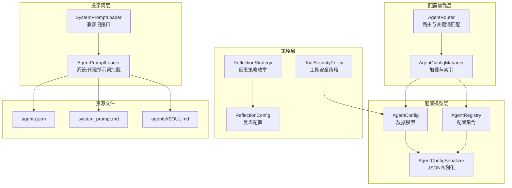
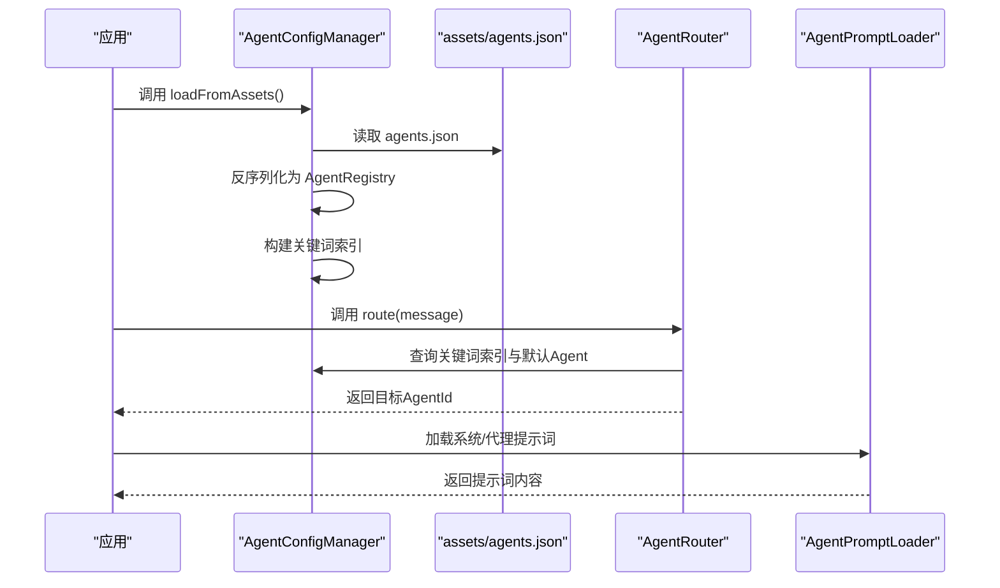
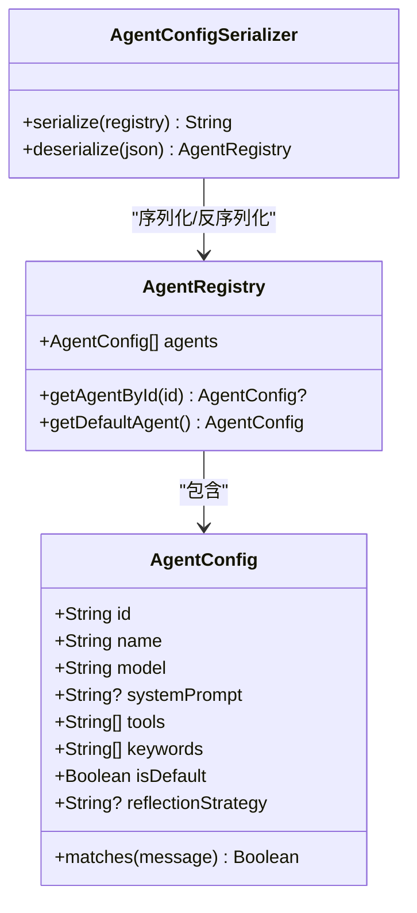
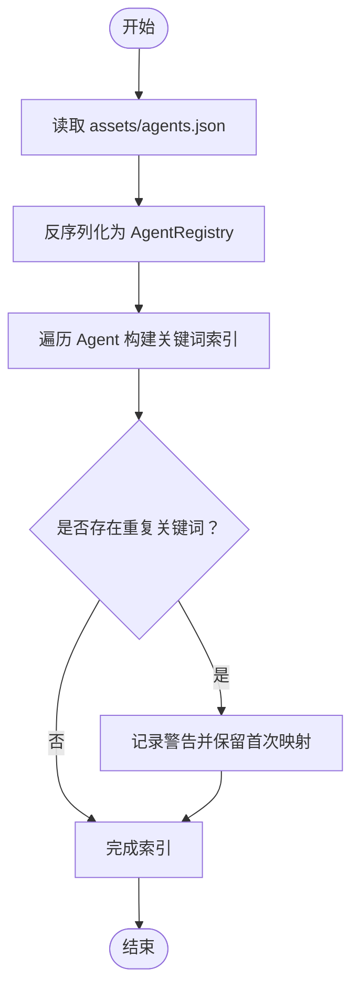
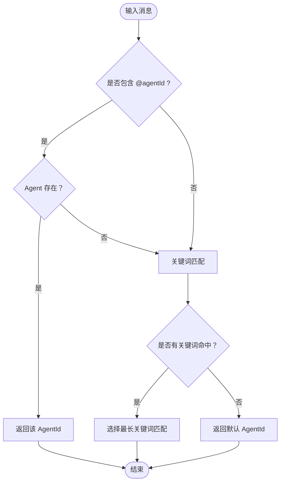
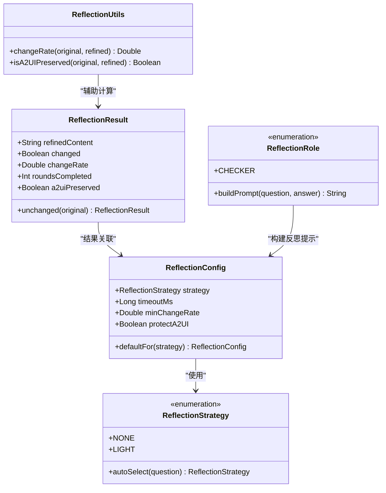
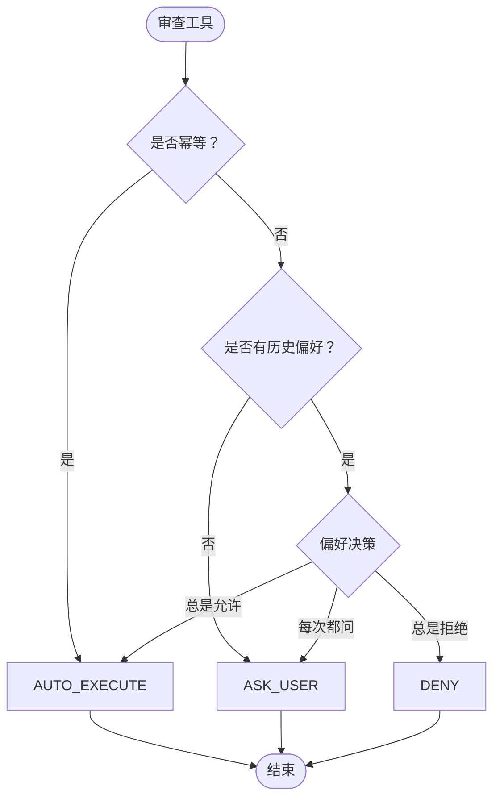
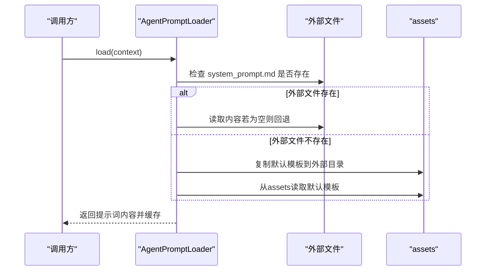
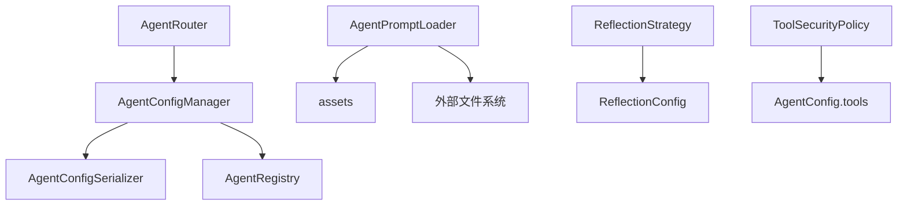

# Agent配置管理

<cite>
**本文引用的文件**
- [AgentConfig.kt](file://app/src/main/java/ai/openclaw/android/data/model/AgentConfig.kt)
- [AgentConfigManager.kt](file://app/src/main/java/ai/openclaw/android/domain/agent/AgentConfigManager.kt)
- [AgentRouter.kt](file://app/src/main/java/ai/openclaw/android/domain/agent/AgentRouter.kt)
- [ReflectionStrategy.kt](file://app/src/main/java/ai/openclaw/android/domain/ReflectionStrategy.kt)
- [ToolSecurityPolicy.kt](file://app/src/main/java/ai/openclaw/android/skill/ToolSecurityPolicy.kt)
- [AgentPromptLoader.kt](file://app/src/main/java/ai/openclaw/android/agent/AgentPromptLoader.kt)
- [SystemPromptLoader.kt](file://app/src/main/java/ai/openclaw/android/agent/SystemPromptLoader.kt)
- [agents.json](file://app/src/main/assets/agents.json)
- [system_prompt.md](file://app/src/main/assets/system_prompt.md)
- [SOUL.md](file://app/src/main/assets/agents/main/SOUL.md)
- [AgentConfigTest.kt](file://app/src/test/java/ai/openclaw/android/data/model/AgentConfigTest.kt)
- [AgentConfigManagerTest.kt](file://app/src/test/java/ai/openclaw/android/domain/agent/AgentConfigManagerTest.kt)
</cite>

## 目录
1. [简介](#简介)
2. [项目结构](#项目结构)
3. [核心组件](#核心组件)
4. [架构总览](#架构总览)
5. [详细组件分析](#详细组件分析)
6. [依赖分析](#依赖分析)
7. [性能考虑](#性能考虑)
8. [故障排查指南](#故障排查指南)
9. [结论](#结论)
10. [附录](#附录)

## 简介
本技术文档聚焦于Agent配置管理模块，系统化阐述Agent配置的数据结构与参数、工具权限控制、最大上下文令牌数、自我反思策略等关键配置项；详解系统提示词的加载与动态更新机制；说明配置文件格式规范与参数校验；解释不同Agent实例的配置差异与继承关系；并提供最佳实践、性能调优建议与常见问题解决方案。

## 项目结构
Agent配置管理相关代码主要分布在以下位置：
- 数据模型与序列化：data/model/AgentConfig.kt
- 配置加载与索引：domain/agent/AgentConfigManager.kt
- 路由与关键词匹配：domain/agent/AgentRouter.kt
- 反思策略与配置：domain/ReflectionStrategy.kt
- 工具安全策略：skill/ToolSecurityPolicy.kt
- 提示词加载器：agent/AgentPromptLoader.kt、agent/SystemPromptLoader.kt
- 配置文件：assets/agents.json、assets/system_prompt.md、assets/agents/<agentId>/SOUL.md
- 单元测试：data/model/AgentConfigTest.kt、domain/agent/AgentConfigManagerTest.kt

图表来源
- [AgentConfig.kt:10-34](file://app/src/main/java/ai/openclaw/android/data/model/AgentConfig.kt#L10-L34)
- [AgentConfigManager.kt:12-87](file://app/src/main/java/ai/openclaw/android/domain/agent/AgentConfigManager.kt#L12-L87)
- [AgentRouter.kt:12-99](file://app/src/main/java/ai/openclaw/android/domain/agent/AgentRouter.kt#L12-L99)
- [AgentPromptLoader.kt:19-284](file://app/src/main/java/ai/openclaw/android/agent/AgentPromptLoader.kt#L19-L284)
- [ReflectionStrategy.kt:18-92](file://app/src/main/java/ai/openclaw/android/domain/ReflectionStrategy.kt#L18-L92)
- [ToolSecurityPolicy.kt:6-72](file://app/src/main/java/ai/openclaw/android/skill/ToolSecurityPolicy.kt#L6-L72)

章节来源
- [AgentConfig.kt:10-56](file://app/src/main/java/ai/openclaw/android/data/model/AgentConfig.kt#L10-L56)
- [AgentConfigManager.kt:12-87](file://app/src/main/java/ai/openclaw/android/domain/agent/AgentConfigManager.kt#L12-L87)
- [AgentRouter.kt:12-99](file://app/src/main/java/ai/openclaw/android/domain/agent/AgentRouter.kt#L12-L99)
- [AgentPromptLoader.kt:19-284](file://app/src/main/java/ai/openclaw/android/agent/AgentPromptLoader.kt#L19-L284)
- [ReflectionStrategy.kt:18-92](file://app/src/main/java/ai/openclaw/android/domain/ReflectionStrategy.kt#L18-L92)
- [ToolSecurityPolicy.kt:6-72](file://app/src/main/java/ai/openclaw/android/skill/ToolSecurityPolicy.kt#L6-L72)

## 核心组件
- AgentConfig：定义单个Agent的标识、显示名、模型、系统提示词、工具过滤、关键词、默认标志、反思策略等字段，并提供消息关键词匹配能力。
- AgentRegistry：包含所有Agent配置的列表，提供按ID查找与默认Agent选择能力。
- AgentConfigSerializer：基于Kotlinx Serialization的JSON序列化/反序列化工具，支持忽略未知字段、默认值编码与美化输出。
- AgentConfigManager：从assets加载agents.json，构建Agent注册表与关键词索引，提供按ID获取Agent、默认Agent、全部Agent、是否存在Agent等查询能力。
- AgentRouter：根据@提及、关键词匹配与默认Agent进行路由决策。
- ReflectionStrategy/ReflectionConfig：定义反思策略枚举、自动选择逻辑与反思配置（超时、变化率阈值、A2UI保护等）。
- ToolSecurityPolicy：定义工具安全策略（自动执行、询问用户、拒绝）与用户审批偏好。
- AgentPromptLoader/SystemPromptLoader：系统提示词与代理“灵魂”提示词的动态加载与缓存机制，支持外部文件优先、首次复制默认模板、缓存失效与强制重载。

章节来源
- [AgentConfig.kt:10-34](file://app/src/main/java/ai/openclaw/android/data/model/AgentConfig.kt#L10-L34)
- [AgentConfig.kt:40-56](file://app/src/main/java/ai/openclaw/android/data/model/AgentConfig.kt#L40-L56)
- [AgentConfigManager.kt:25-86](file://app/src/main/java/ai/openclaw/android/domain/agent/AgentConfigManager.kt#L25-L86)
- [AgentRouter.kt:27-98](file://app/src/main/java/ai/openclaw/android/domain/agent/AgentRouter.kt#L27-L98)
- [ReflectionStrategy.kt:18-92](file://app/src/main/java/ai/openclaw/android/domain/ReflectionStrategy.kt#L18-L92)
- [ToolSecurityPolicy.kt:6-72](file://app/src/main/java/ai/openclaw/android/skill/ToolSecurityPolicy.kt#L6-L72)
- [AgentPromptLoader.kt:40-153](file://app/src/main/java/ai/openclaw/android/agent/AgentPromptLoader.kt#L40-L153)
- [SystemPromptLoader.kt:18-42](file://app/src/main/java/ai/openclaw/android/agent/SystemPromptLoader.kt#L18-L42)

## 架构总览
Agent配置管理采用“模型-加载-路由-策略-提示词”的分层架构：
- 模型层：AgentConfig/AgentRegistry/AgentConfigSerializer负责配置的结构化存储与序列化。
- 加载层：AgentConfigManager负责从assets加载agents.json并建立关键词索引。
- 路由层：AgentRouter根据@提及、关键词与默认Agent进行路由。
- 策略层：ReflectionStrategy/ReflectionConfig与ToolSecurityPolicy分别控制反思与工具执行策略。
- 提示词层：AgentPromptLoader负责系统提示词与代理提示词的动态加载与缓存。

图表来源
- [AgentConfigManager.kt:25-86](file://app/src/main/java/ai/openclaw/android/domain/agent/AgentConfigManager.kt#L25-L86)
- [AgentRouter.kt:27-98](file://app/src/main/java/ai/openclaw/android/domain/agent/AgentRouter.kt#L27-L98)
- [AgentPromptLoader.kt:40-153](file://app/src/main/java/ai/openclaw/android/agent/AgentPromptLoader.kt#L40-L153)

## 详细组件分析

### Agent配置数据结构与参数
- 关键字段
  - id/name：唯一标识与显示名
  - model：模型标识，默认值来自数据模型
  - systemPrompt：自定义系统提示词（可为空，表示使用默认）
  - tools：工具过滤列表，支持“all”不过滤
  - keywords：触发路由的关键词列表
  - isDefault：是否为默认Agent
  - reflectionStrategy：反思策略（字符串形式，可为空）
- 匹配与默认行为
  - AgentConfig提供消息关键词匹配方法，大小写不敏感
  - AgentRegistry提供默认Agent选择：显式标记的默认Agent优先，否则返回第一个Agent

图表来源
- [AgentConfig.kt:10-34](file://app/src/main/java/ai/openclaw/android/data/model/AgentConfig.kt#L10-L34)
- [AgentConfig.kt:40-56](file://app/src/main/java/ai/openclaw/android/data/model/AgentConfig.kt#L40-L56)

章节来源
- [AgentConfig.kt:10-34](file://app/src/main/java/ai/openclaw/android/data/model/AgentConfig.kt#L10-L34)
- [AgentConfig.kt:40-56](file://app/src/main/java/ai/openclaw/android/data/model/AgentConfig.kt#L40-L56)

### 配置加载与索引（AgentConfigManager）
- 加载流程
  - 从assets读取agents.json，使用AgentConfigSerializer反序列化为AgentRegistry
  - 构建关键词索引：keyword → agentId，大小写不敏感，重复关键词记录警告并以首次映射为准
- 查询接口
  - 按ID获取Agent、默认Agent、全部Agent、存在性判断
  - 关键词索引查询接口，供路由层使用

图表来源
- [AgentConfigManager.kt:25-86](file://app/src/main/java/ai/openclaw/android/domain/agent/AgentConfigManager.kt#L25-L86)

章节来源
- [AgentConfigManager.kt:25-86](file://app/src/main/java/ai/openclaw/android/domain/agent/AgentConfigManager.kt#L25-L86)

### 路由与关键词匹配（AgentRouter）
- 路由规则
  - 显式@agentId：消息开头或空白后跟随@agentId，若Agent存在则直接路由
  - 关键词匹配：按关键词长度评分，选最长匹配作为最佳匹配
  - 默认Agent：若无显式@提及且无关键词匹配，则路由至默认Agent
- 辅助功能
  - 提取@提及
  - 查找最佳匹配（不使用默认回退）

图表来源
- [AgentRouter.kt:27-98](file://app/src/main/java/ai/openclaw/android/domain/agent/AgentRouter.kt#L27-L98)

章节来源
- [AgentRouter.kt:27-98](file://app/src/main/java/ai/openclaw/android/domain/agent/AgentRouter.kt#L27-L98)

### 反思策略与配置
- 策略枚举
  - NONE：默认不反思
  - LIGHT：轻量反思（单轮检查员）
- 自动选择
  - 基于问题长度与关键词模式自动选择策略，大部分简单查询默认不反思
- 反思配置
  - 超时限制（毫秒）
  - 最小变化率阈值，低于阈值早停
  - A2UI格式保护，确保反思后仍保持卡片标签完整性
- 工具函数
  - 文本变化率计算（截断到前500字符的轻量Levenshtein距离）
  - A2UI格式完整性检查

图表来源
- [ReflectionStrategy.kt:18-92](file://app/src/main/java/ai/openclaw/android/domain/ReflectionStrategy.kt#L18-L92)
- [ReflectionStrategy.kt:97-174](file://app/src/main/java/ai/openclaw/android/domain/ReflectionStrategy.kt#L97-L174)

章节来源
- [ReflectionStrategy.kt:18-92](file://app/src/main/java/ai/openclaw/android/domain/ReflectionStrategy.kt#L18-L92)
- [ReflectionStrategy.kt:97-174](file://app/src/main/java/ai/openclaw/android/domain/ReflectionStrategy.kt#L97-L174)

### 工具权限控制
- 策略枚举
  - AUTO_EXECUTE：幂等操作自动执行
  - ASK_USER：非幂等操作首次询问用户
  - DENY：用户已拒绝
- 用户审批偏好
  - ALWAYS_APPROVE：总是允许
  - ALWAYS_DENY：总是拒绝
  - ASK_EVERY_TIME：每次都询问
- 审查逻辑
  - 幂等操作直接执行
  - 无历史偏好则首次询问
  - 否则按用户偏好决定策略

图表来源
- [ToolSecurityPolicy.kt:44-71](file://app/src/main/java/ai/openclaw/android/skill/ToolSecurityPolicy.kt#L44-L71)

章节来源
- [ToolSecurityPolicy.kt:6-72](file://app/src/main/java/ai/openclaw/android/skill/ToolSecurityPolicy.kt#L6-L72)

### 系统提示词加载与动态配置
- 加载机制
  - 全局system prompt：优先读取外部文件（/sdcard/.../files/system_prompt.md），不存在则从assets复制默认模板再加载
  - 代理soul prompt：优先读取外部文件（/sdcard/.../files/agents/<agentId>/SOUL.md），不存在则从assets复制默认模板再加载
  - 缓存策略：外部文件未修改则复用缓存；支持强制重载
- 兼容性
  - SystemPromptLoader已废弃，委托给AgentPromptLoader
- 资源文件
  - assets/system_prompt.md：全局系统提示词模板
  - assets/agents/<agentId>/SOUL.md：各Agent的独立提示词模板

图表来源
- [AgentPromptLoader.kt:40-153](file://app/src/main/java/ai/openclaw/android/agent/AgentPromptLoader.kt#L40-L153)

章节来源
- [AgentPromptLoader.kt:40-153](file://app/src/main/java/ai/openclaw/android/agent/AgentPromptLoader.kt#L40-L153)
- [SystemPromptLoader.kt:18-42](file://app/src/main/java/ai/openclaw/android/agent/SystemPromptLoader.kt#L18-L42)
- [system_prompt.md:1-52](file://app/src/main/assets/system_prompt.md#L1-L52)
- [SOUL.md:1-71](file://app/src/main/assets/agents/main/SOUL.md#L1-L71)

### 配置文件格式规范与参数验证
- agents.json
  - 结构：包含agents数组，每个元素为AgentConfig对象
  - 字段：id、name、model、systemPrompt、tools、keywords、isDefault、reflectionStrategy
  - 默认值：序列化器启用encodeDefaults，缺失字段按模型默认值填充
  - 兼容性：ignoreUnknownKeys=true，允许新增字段不破坏解析
- YAML示例（agents/main/config.yaml）
  - 字段：id、name、model、maxContextTokens、tools
  - 用途：演示工具权限与上下文令牌数配置
- 参数验证与边界
  - 工具过滤：支持"all"不过滤；也可指定前缀列表
  - 关键词匹配：大小写不敏感，按关键词长度评分
  - 反思策略：字符串形式，可为空（由上层逻辑转换为枚举）

章节来源
- [agents.json:1-29](file://app/src/main/assets/agents.json#L1-L29)
- [AgentConfig.kt:47-56](file://app/src/main/java/ai/openclaw/android/data/model/AgentConfig.kt#L47-L56)
- [AgentConfigTest.kt:52-92](file://app/src/test/java/ai/openclaw/android/data/model/AgentConfigTest.kt#L52-L92)
- [AgentConfigTest.kt:224-247](file://app/src/test/java/ai/openclaw/android/data/model/AgentConfigTest.kt#L224-L247)

### 不同Agent实例的配置差异与继承关系
- 差异点
  - id/name：唯一标识与显示名
  - model：模型选择
  - systemPrompt：可为空，为空时使用默认系统提示词
  - tools：工具过滤策略
  - keywords：路由关键词
  - isDefault：默认Agent标志
  - reflectionStrategy：反思策略
- 继承关系
  - AgentConfigManager与AgentRouter通过AgentRegistry统一管理多个Agent实例
  - 路由层不直接继承配置，而是通过关键词索引与默认Agent选择实现差异化路由
  - 提示词层支持每Agent独立的SOUL.md，形成“全局模板 + 代理覆盖”的继承式配置

章节来源
- [AgentConfigManager.kt:41-57](file://app/src/main/java/ai/openclaw/android/domain/agent/AgentConfigManager.kt#L41-L57)
- [AgentRouter.kt:79-98](file://app/src/main/java/ai/openclaw/android/domain/agent/AgentRouter.kt#L79-L98)
- [AgentPromptLoader.kt:107-153](file://app/src/main/java/ai/openclaw/android/agent/AgentPromptLoader.kt#L107-L153)

## 依赖分析
- 组件耦合
  - AgentConfigManager依赖AgentConfigSerializer与AgentRegistry
  - AgentRouter依赖AgentConfigManager进行查询
  - AgentPromptLoader依赖assets与外部文件系统
  - ReflectionStrategy与ReflectionConfig相互协作
  - ToolSecurityPolicy与AgentConfig中的tools字段配合实现工具权限控制
- 外部依赖
  - Kotlinx Serialization用于JSON序列化
  - Android AssetManager用于assets读取
  - 文件系统用于外部模板复制与缓存

图表来源
- [AgentConfigManager.kt:25-86](file://app/src/main/java/ai/openclaw/android/domain/agent/AgentConfigManager.kt#L25-L86)
- [AgentRouter.kt:12-99](file://app/src/main/java/ai/openclaw/android/domain/agent/AgentRouter.kt#L12-L99)
- [AgentPromptLoader.kt:19-284](file://app/src/main/java/ai/openclaw/android/agent/AgentPromptLoader.kt#L19-L284)
- [ReflectionStrategy.kt:18-92](file://app/src/main/java/ai/openclaw/android/domain/ReflectionStrategy.kt#L18-L92)
- [ToolSecurityPolicy.kt:6-72](file://app/src/main/java/ai/openclaw/android/skill/ToolSecurityPolicy.kt#L6-L72)

章节来源
- [AgentConfigManager.kt:25-86](file://app/src/main/java/ai/openclaw/android/domain/agent/AgentConfigManager.kt#L25-L86)
- [AgentRouter.kt:12-99](file://app/src/main/java/ai/openclaw/android/domain/agent/AgentRouter.kt#L12-L99)
- [AgentPromptLoader.kt:19-284](file://app/src/main/java/ai/openclaw/android/agent/AgentPromptLoader.kt#L19-L284)
- [ReflectionStrategy.kt:18-92](file://app/src/main/java/ai/openclaw/android/domain/ReflectionStrategy.kt#L18-L92)
- [ToolSecurityPolicy.kt:6-72](file://app/src/main/java/ai/openclaw/android/skill/ToolSecurityPolicy.kt#L6-L72)

## 性能考虑
- 序列化与解析
  - 使用encodeDefaults与ignoreUnknownKeys提升兼容性与稳定性
  - JSON解析在应用初始化阶段一次性完成，避免频繁IO
- 路由与索引
  - 关键词索引构建一次，后续查询为O(k)（k为关键词数量）
  - @提及正则匹配仅在路由入口执行，避免重复编译
- 提示词缓存
  - 外部文件未修改则复用缓存，减少磁盘读取
  - 强制重载接口支持热更新，但应谨慎使用以避免频繁IO
- 反思策略
  - 默认关闭，仅在高价值场景开启
  - 超时与早停阈值防止长文本反思带来的性能损耗
  - A2UI保护避免格式破坏导致的额外处理成本

## 故障排查指南
- agents.json加载失败
  - 现象：返回空列表并记录错误日志
  - 排查：确认assets中agents.json存在且格式正确；检查文件名大小写与路径
- 关键词重复映射
  - 现象：记录重复关键词警告，后续映射以首次为准
  - 排查：检查agents.json中关键词是否重复，避免歧义路由
- 提示词文件为空或缺失
  - 现象：系统回退到默认模板或兜底提示词
  - 排查：确认外部文件路径存在且非空；首次启动会自动复制默认模板
- 路由异常
  - 现象：@提及无效或关键词未命中
  - 排查：确认@语法格式；检查关键词大小写与拼写；确认默认Agent存在
- 反思未生效
  - 现象：默认不反思或反思失败覆盖原答案
  - 排查：确认反思策略配置；检查超时与变化率阈值设置；验证A2UI格式保护

章节来源
- [AgentConfigManager.kt:32-36](file://app/src/main/java/ai/openclaw/android/domain/agent/AgentConfigManager.kt#L32-L36)
- [AgentConfigManager.kt:78-82](file://app/src/main/java/ai/openclaw/android/domain/agent/AgentConfigManager.kt#L78-L82)
- [AgentPromptLoader.kt:59-72](file://app/src/main/java/ai/openclaw/android/agent/AgentPromptLoader.kt#L59-L72)
- [AgentRouter.kt:34-37](file://app/src/main/java/ai/openclaw/android/domain/agent/AgentRouter.kt#L34-L37)
- [ReflectionStrategy.kt:30-37](file://app/src/main/java/ai/openclaw/android/domain/ReflectionStrategy.kt#L30-L37)

## 结论
Agent配置管理模块通过清晰的数据模型、稳健的加载与索引机制、灵活的路由策略、完善的反思与工具安全策略以及可热更新的提示词系统，实现了多Agent系统的可维护性与可扩展性。遵循本文的最佳实践与性能建议，可在保证安全性与稳定性的前提下，获得良好的用户体验与开发效率。

## 附录
- 配置示例与集成指导
  - agents.json：定义多个Agent，设置模型、工具过滤、关键词与默认Agent
  - YAML示例：展示工具权限与上下文令牌数配置
  - 提示词：在assets中提供默认模板，在外部文件夹中进行个性化覆盖
  - 集成步骤：初始化时加载agents.json；根据消息进行路由；按Agent配置执行工具与反思策略；动态加载提示词

章节来源
- [agents.json:1-29](file://app/src/main/assets/agents.json#L1-L29)
- [AgentConfigTest.kt:52-92](file://app/src/test/java/ai/openclaw/android/data/model/AgentConfigTest.kt#L52-L92)
- [AgentConfigManagerTest.kt:72-88](file://app/src/test/java/ai/openclaw/android/domain/agent/AgentConfigManagerTest.kt#L72-L88)
- [AgentPromptLoader.kt:107-153](file://app/src/main/java/ai/openclaw/android/agent/AgentPromptLoader.kt#L107-L153)