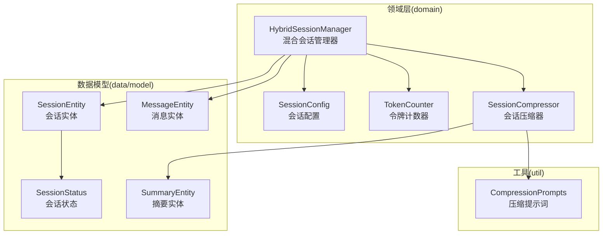
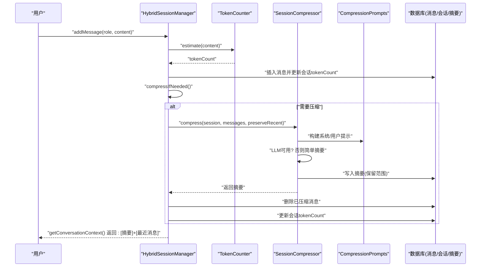
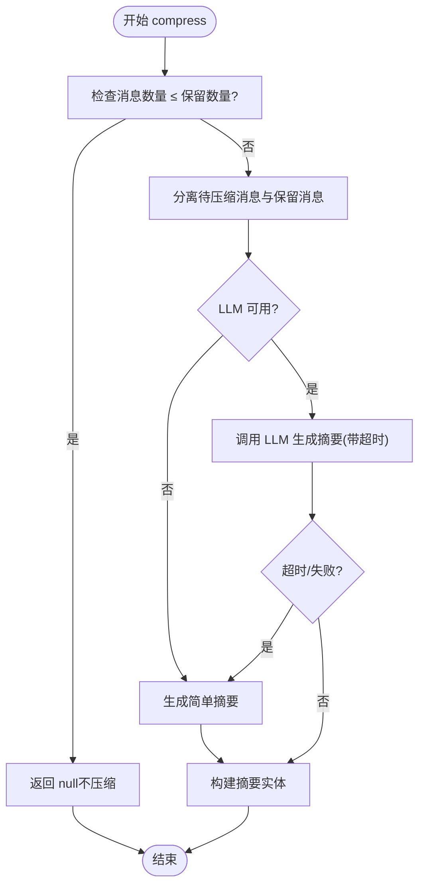
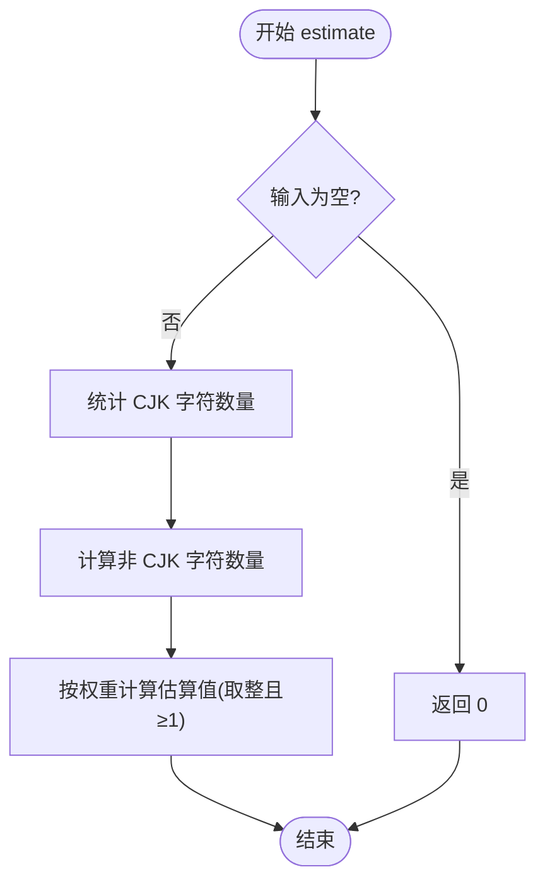
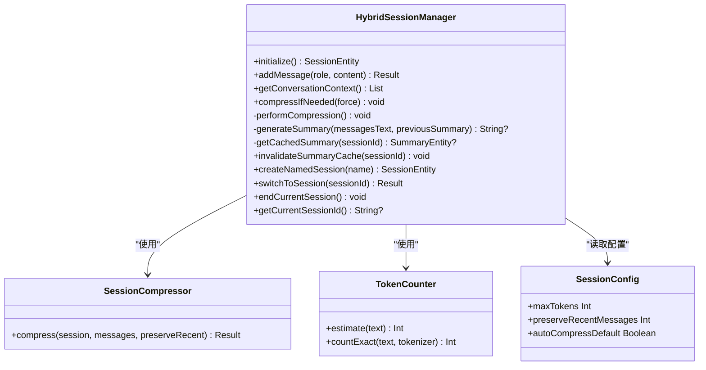
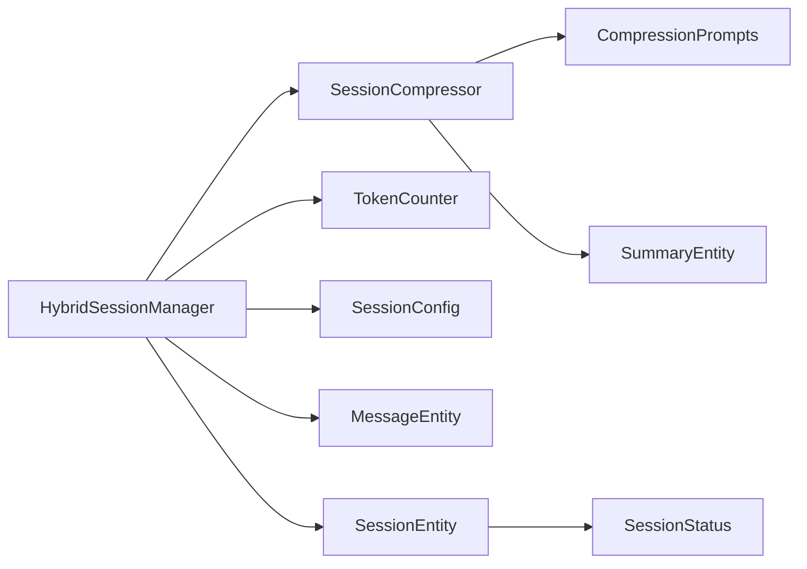

# 会话压缩与优化

<cite>
**本文引用的文件**
- [SessionCompressor.kt](file://app/src/main/java/ai/openclaw/android/domain/session/SessionCompressor.kt)
- [TokenCounter.kt](file://app/src/main/java/ai/openclaw/android/domain/session/TokenCounter.kt)
- [CompressionPrompts.kt](file://app/src/main/java/ai/openclaw/android/util/CompressionPrompts.kt)
- [HybridSessionManager.kt](file://app/src/main/java/ai/openclaw/android/domain/session/HybridSessionManager.kt)
- [SessionConfig.kt](file://app/src/main/java/ai/openclaw/android/domain/model/SessionConfig.kt)
- [MessageEntity.kt](file://app/src/main/java/ai/openclaw/android/data/model/MessageEntity.kt)
- [SummaryEntity.kt](file://app/src/main/java/ai/openclaw/android/data/model/SummaryEntity.kt)
- [SessionEntity.kt](file://app/src/main/java/ai/openclaw/android/data/model/SessionEntity.kt)
- [SessionStatus.kt](file://app/src/main/java/ai/openclaw/android/data/model/SessionStatus.kt)
- [SessionCompressorTest.kt](file://app/src/test/java/ai/openclaw/android/domain/session/SessionCompressorTest.kt)
- [TokenCounterTest.kt](file://app/src/test/java/ai/openclaw/android/domain/session/TokenCounterTest.kt)
</cite>

## 目录
1. [简介](#简介)
2. [项目结构](#项目结构)
3. [核心组件](#核心组件)
4. [架构总览](#架构总览)
5. [详细组件分析](#详细组件分析)
6. [依赖关系分析](#依赖关系分析)
7. [性能考量](#性能考量)
8. [故障排查指南](#故障排查指南)
9. [结论](#结论)
10. [附录](#附录)

## 简介
本技术文档聚焦“会话压缩与优化”模块，围绕以下目标展开：
- 深入解释 SessionCompressor 的压缩算法与策略：历史记录修剪、冗余信息去除、上下文优化。
- 详解 TokenCounter 的令牌估算机制：CJK 字符与 ASCII 字符的不同计算方式。
- 解释压缩阈值设置与动态调整策略。
- 评估压缩对对话质量的影响与权衡。
- 提供压缩效果监控指标与性能基准测试建议。
- 给出压缩配置调优指南与实际应用场景。

## 项目结构
本模块位于应用层 domain/session 与 util 下，配合数据模型与会话管理器协同工作：
- domain/session：会话压缩器、混合会话管理器、令牌计数器、会话配置。
- data/model：消息、会话、摘要的数据模型。
- util：压缩提示词构建工具。
- test：单元测试覆盖压缩器与令牌计数器的行为。

图表来源
- [HybridSessionManager.kt:31-457](file://app/src/main/java/ai/openclaw/android/domain/session/HybridSessionManager.kt#L31-L457)
- [SessionCompressor.kt:13-83](file://app/src/main/java/ai/openclaw/android/domain/session/SessionCompressor.kt#L13-L83)
- [TokenCounter.kt:3-25](file://app/src/main/java/ai/openclaw/android/domain/session/TokenCounter.kt#L3-L25)
- [CompressionPrompts.kt:5-31](file://app/src/main/java/ai/openclaw/android/util/CompressionPrompts.kt#L5-L31)
- [MessageEntity.kt:18-25](file://app/src/main/java/ai/openclaw/android/data/model/MessageEntity.kt#L18-L25)
- [SummaryEntity.kt:7-13](file://app/src/main/java/ai/openclaw/android/data/model/SummaryEntity.kt#L7-L13)
- [SessionEntity.kt:7-14](file://app/src/main/java/ai/openclaw/android/data/model/SessionEntity.kt#L7-L14)
- [SessionStatus.kt:3-7](file://app/src/main/java/ai/openclaw/android/data/model/SessionStatus.kt#L3-L7)

章节来源
- [HybridSessionManager.kt:31-457](file://app/src/main/java/ai/openclaw/android/domain/session/HybridSessionManager.kt#L31-L457)
- [SessionCompressor.kt:13-83](file://app/src/main/java/ai/openclaw/android/domain/session/SessionCompressor.kt#L13-L83)
- [TokenCounter.kt:3-25](file://app/src/main/java/ai/openclaw/android/domain/session/TokenCounter.kt#L3-L25)
- [CompressionPrompts.kt:5-31](file://app/src/main/java/ai/openclaw/android/util/CompressionPrompts.kt#L5-L31)
- [MessageEntity.kt:18-25](file://app/src/main/java/ai/openclaw/android/data/model/MessageEntity.kt#L18-L25)
- [SummaryEntity.kt:7-13](file://app/src/main/java/ai/openclaw/android/data/model/SummaryEntity.kt#L7-L13)
- [SessionEntity.kt:7-14](file://app/src/main/java/ai/openclaw/android/data/model/SessionEntity.kt#L7-L14)
- [SessionStatus.kt:3-7](file://app/src/main/java/ai/openclaw/android/data/model/SessionStatus.kt#L3-L7)

## 核心组件
- 会话压缩器（SessionCompressor）：负责将历史消息压缩为摘要，支持 LLM 生成与简单回退策略；控制保留最近消息数量。
- 令牌计数器（TokenCounter）：提供文本的粗略令牌估算，区分 CJK 与非 CJK 字符的估算权重。
- 压缩提示词（CompressionPrompts）：定义系统提示与用户提示模板，指导 LLM 产出结构化摘要。
- 混合会话管理器（HybridSessionManager）：统一协调消息添加、上下文构建、压缩触发与执行、摘要缓存与记忆注入。
- 会话配置（SessionConfig）：集中定义压缩阈值、保留最近消息数量、是否默认自动压缩等参数。

章节来源
- [SessionCompressor.kt:13-83](file://app/src/main/java/ai/openclaw/android/domain/session/SessionCompressor.kt#L13-L83)
- [TokenCounter.kt:3-25](file://app/src/main/java/ai/openclaw/android/domain/session/TokenCounter.kt#L3-L25)
- [CompressionPrompts.kt:5-31](file://app/src/main/java/ai/openclaw/android/util/CompressionPrompts.kt#L5-L31)
- [HybridSessionManager.kt:31-457](file://app/src/main/java/ai/openclaw/android/domain/session/HybridSessionManager.kt#L31-L457)
- [SessionConfig.kt:6-10](file://app/src/main/java/ai/openclaw/android/domain/model/SessionConfig.kt#L6-L10)

## 架构总览
下图展示从消息添加到上下文构建的端到端流程，以及压缩触发与执行的关键节点。

图表来源
- [HybridSessionManager.kt:70-110](file://app/src/main/java/ai/openclaw/android/domain/session/HybridSessionManager.kt#L70-L110)
- [HybridSessionManager.kt:236-299](file://app/src/main/java/ai/openclaw/android/domain/session/HybridSessionManager.kt#L236-L299)
- [SessionCompressor.kt:18-60](file://app/src/main/java/ai/openclaw/android/domain/session/SessionCompressor.kt#L18-L60)
- [CompressionPrompts.kt:25-31](file://app/src/main/java/ai/openclaw/android/util/CompressionPrompts.kt#L25-L31)

## 详细组件分析

### 会话压缩器（SessionCompressor）
- 输入：会话实体、消息列表、保留最近消息数量。
- 策略：
  - 若消息总数不超过保留数量，直接返回空（不压缩）。
  - 分离待压缩的历史消息与需保留的最近消息。
  - LLM 可用时：构造系统提示与用户提示，调用 LLM 生成摘要；超时或失败回退为简单摘要。
  - LLM 不可用时：生成简单摘要文本。
  - 输出：摘要实体（包含会话ID、摘要内容、压缩时间窗口与压缩时间戳）。
- 回退机制：当 LLM 不可用或超时时，使用简单摘要策略保证功能可用性。

图表来源
- [SessionCompressor.kt:18-60](file://app/src/main/java/ai/openclaw/android/domain/session/SessionCompressor.kt#L18-L60)

章节来源
- [SessionCompressor.kt:13-83](file://app/src/main/java/ai/openclaw/android/domain/session/SessionCompressor.kt#L13-L83)
- [CompressionPrompts.kt:5-31](file://app/src/main/java/ai/openclaw/android/util/CompressionPrompts.kt#L5-L31)

### 令牌计数器（TokenCounter）
- 粗略估算：
  - CJK 字符：按字符粒度估算，结合 Unicode 范围识别。
  - 非 CJK（如英文字母/数字/空格）：按单词粒度估算。
  - 返回值至少为 1，避免空文本导致的零令牌问题。
- 精确计数：
  - 支持传入外部 tokenizer 进行精确统计；若不可用则回退到估算。
- 设计动机：
  - 为会话长度控制提供快速、可预测的令牌预算，便于在本地设备上进行阈值判断与压缩触发。

图表来源
- [TokenCounter.kt:8-15](file://app/src/main/java/ai/openclaw/android/domain/session/TokenCounter.kt#L8-L15)

章节来源
- [TokenCounter.kt:3-25](file://app/src/main/java/ai/openclaw/android/domain/session/TokenCounter.kt#L3-L25)

### 压缩提示词（CompressionPrompts）
- 系统提示：明确摘要目标（关键决策/结论、用户偏好、待办事项）、输出格式与长度限制。
- 用户提示：拼接历史消息为“角色: 内容”的多行文本，引导 LLM 生成结构化摘要。
- 作用：确保 LLM 生成的摘要满足业务需求，便于后续检索与复用。

章节来源
- [CompressionPrompts.kt:5-31](file://app/src/main/java/ai/openclaw/android/util/CompressionPrompts.kt#L5-L31)

### 混合会话管理器（HybridSessionManager）
- 消息添加：估算令牌、持久化消息、更新会话 tokenCount，并触发压缩检查。
- 上下文构建：优先使用摘要缓存，将摘要作为系统消息与最近消息组合返回；同时注入重要记忆。
- 压缩执行：支持增量压缩（合并旧摘要与新对话），删除已压缩消息，更新剩余 tokenCount。
- 摘要缓存：基于 LRU 的摘要缓存，减少数据库访问开销。
- 记忆抽取：从摘要中提取用户偏好、决策、待办等信息，写入记忆系统，形成跨会话知识沉淀。

图表来源
- [HybridSessionManager.kt:31-457](file://app/src/main/java/ai/openclaw/android/domain/session/HybridSessionManager.kt#L31-L457)
- [SessionCompressor.kt:13-83](file://app/src/main/java/ai/openclaw/android/domain/session/SessionCompressor.kt#L13-L83)
- [TokenCounter.kt:3-25](file://app/src/main/java/ai/openclaw/android/domain/session/TokenCounter.kt#L3-L25)
- [SessionConfig.kt:6-10](file://app/src/main/java/ai/openclaw/android/domain/model/SessionConfig.kt#L6-L10)

章节来源
- [HybridSessionManager.kt:31-457](file://app/src/main/java/ai/openclaw/android/domain/session/HybridSessionManager.kt#L31-L457)

### 数据模型与状态
- MessageEntity：承载消息的主键、会话外键、角色、内容、时间戳与 tokenCount。
- SummaryEntity：承载摘要内容、消息范围（起止时间戳）、压缩时间戳。
- SessionEntity：承载会话主键、名称、创建/活跃时间、tokenCount 与状态。
- SessionStatus：ACTIVE、COMPRESSED、ARCHIVED，用于标识会话所处阶段。

章节来源
- [MessageEntity.kt:18-25](file://app/src/main/java/ai/openclaw/android/data/model/MessageEntity.kt#L18-L25)
- [SummaryEntity.kt:7-13](file://app/src/main/java/ai/openclaw/android/data/model/SummaryEntity.kt#L7-L13)
- [SessionEntity.kt:7-14](file://app/src/main/java/ai/openclaw/android/data/model/SessionEntity.kt#L7-L14)
- [SessionStatus.kt:3-7](file://app/src/main/java/ai/openclaw/android/data/model/SessionStatus.kt#L3-L7)

## 依赖关系分析
- 耦合与内聚：
  - HybridSessionManager 对 SessionCompressor、TokenCounter、SessionConfig 的依赖清晰，职责单一，内聚良好。
  - SessionCompressor 依赖 CompressionPrompts 与 LLM 客户端，耦合点集中在提示词与外部推理服务。
- 外部依赖：
  - LLM 推理客户端（LocalLLMClient）：用于生成摘要；不可用时走简单摘要回退。
  - 数据库（Room）：消息、会话、摘要的持久化。
- 潜在循环依赖：未发现循环依赖，模块边界清晰。

图表来源
- [HybridSessionManager.kt:31-457](file://app/src/main/java/ai/openclaw/android/domain/session/HybridSessionManager.kt#L31-L457)
- [SessionCompressor.kt:13-83](file://app/src/main/java/ai/openclaw/android/domain/session/SessionCompressor.kt#L13-L83)
- [TokenCounter.kt:3-25](file://app/src/main/java/ai/openclaw/android/domain/session/TokenCounter.kt#L3-L25)
- [CompressionPrompts.kt:5-31](file://app/src/main/java/ai/openclaw/android/util/CompressionPrompts.kt#L5-L31)
- [MessageEntity.kt:18-25](file://app/src/main/java/ai/openclaw/android/data/model/MessageEntity.kt#L18-L25)
- [SummaryEntity.kt:7-13](file://app/src/main/java/ai/openclaw/android/data/model/SummaryEntity.kt#L7-L13)
- [SessionEntity.kt:7-14](file://app/src/main/java/ai/openclaw/android/data/model/SessionEntity.kt#L7-L14)
- [SessionStatus.kt:3-7](file://app/src/main/java/ai/openclaw/android/data/model/SessionStatus.kt#L3-L7)

## 性能考量
- 令牌估算复杂度：TokenCounter 的估算为 O(n)，其中 n 为文本长度，常数开销小，适合高频调用。
- 压缩触发频率：通过 SessionConfig.maxTokens 控制，避免频繁压缩带来的 I/O 与推理成本。
- 压缩回退策略：LLM 不可用或超时走简单摘要，保障稳定性与响应时间。
- 摘要缓存：HybridSessionManager 使用 LRU 缓存摘要，降低数据库查询压力。
- 上下文构建：优先使用摘要与最近消息，避免加载全量历史，提升推理效率。
- 建议的监控指标（建议项）：
  - 平均/95 分位压缩耗时（含 LLM 推理与数据库写入）。
  - 压缩触发次数与成功率（LLM 成功/回退比例）。
  - 会话 tokenCount 变化趋势与压缩后剩余 token。
  - 上下文长度（消息条数与 tokenCount）与推理延迟的关系。
  - 摘要缓存命中率与数据库查询次数。
- 基准测试建议（建议项）：
  - 使用不同语言混合文本构造消息序列，测量 TokenCounter 估算误差与一致性。
  - 在不同设备上模拟长会话增长，记录压缩触发频率、耗时与内存占用。
  - 对比启用/禁用 LLM 压缩与简单压缩的推理延迟差异。

## 故障排查指南
- 压缩未触发：
  - 检查 SessionConfig.maxTokens 与当前会话 tokenCount 是否达到阈值。
  - 确认 compressIfNeeded 是否在 addMessage 后被调用。
- 压缩结果为空：
  - 当消息数量小于等于保留数量时，返回 null 属于预期行为。
  - 检查 LLM 是否可用与是否发生超时。
- 上下文异常：
  - 确认摘要缓存是否正确更新，必要时调用 invalidateSummaryCache。
  - 检查 getConversationContext 的最近消息数量是否符合配置。
- 单元测试参考：
  - SessionCompressorTest：验证消息不足时不压缩、LLM 不可用时生成简单摘要。
  - TokenCounterTest：验证中英文与混合文本的估算范围与边界条件。

章节来源
- [SessionCompressorTest.kt:50-79](file://app/src/test/java/ai/openclaw/android/domain/session/SessionCompressorTest.kt#L50-L79)
- [TokenCounterTest.kt:9-44](file://app/src/test/java/ai/openclaw/android/domain/session/TokenCounterTest.kt#L9-L44)

## 结论
本模块通过“令牌估算 + 阈值触发 + LLM/回退压缩 + 摘要缓存 + 上下文优化”的组合，实现了在资源受限设备上的高效会话压缩与优化。其设计兼顾了稳定性与性能：在 LLM 不可用时仍可提供基本能力；通过保留最近消息与结构化摘要，平衡了上下文完整性与推理成本。建议在实际部署中结合监控指标持续迭代阈值与保留策略，以获得更佳的用户体验与系统性能。

## 附录

### 压缩阈值与动态调整策略
- 阈值设置：
  - SessionConfig.maxTokens：默认 1800，可根据模型上下文长度与设备性能调整。
  - SessionConfig.preserveRecentMessages：默认 10，用于保留最新上下文，避免关键信息丢失。
  - SessionConfig.autoCompressDefault：默认 true，允许自动压缩。
- 动态调整建议：
  - 根据设备性能与模型大小，逐步提高阈值以减少压缩频率。
  - 针对长对话场景，可适当增加保留消息数量，提升上下文连贯性。
  - 对于多语言混合场景，建议结合 TokenCounter 的估算误差进行校准。

章节来源
- [SessionConfig.kt:6-10](file://app/src/main/java/ai/openclaw/android/domain/model/SessionConfig.kt#L6-L10)
- [HybridSessionManager.kt:70-110](file://app/src/main/java/ai/openclaw/android/domain/session/HybridSessionManager.kt#L70-L110)

### 压缩对对话质量的影响与权衡
- 正面影响：
  - 控制上下文长度，降低推理延迟与资源消耗。
  - 通过结构化摘要保留关键信息，减少冗余重复。
- 风险与权衡：
  - 过度压缩可能导致关键细节丢失，影响连续对话的连贯性。
  - 简单摘要在复杂语义场景下可能损失细节，建议在 LLM 可用时优先使用。
- 建议：
  - 对重要任务型对话，适当提高保留消息数量或降低压缩频率。
  - 引入摘要质量评分（可选）与人工抽检，持续优化提示词与策略。

### 实际应用场景
- 长对话场景：如多轮问答、任务规划、日程安排等，通过压缩维持稳定响应。
- 多语言混合：中文为主时，估算更贴近真实 token 使用，减少误判。
- 资源受限设备：优先启用回退策略，保证基本可用性。