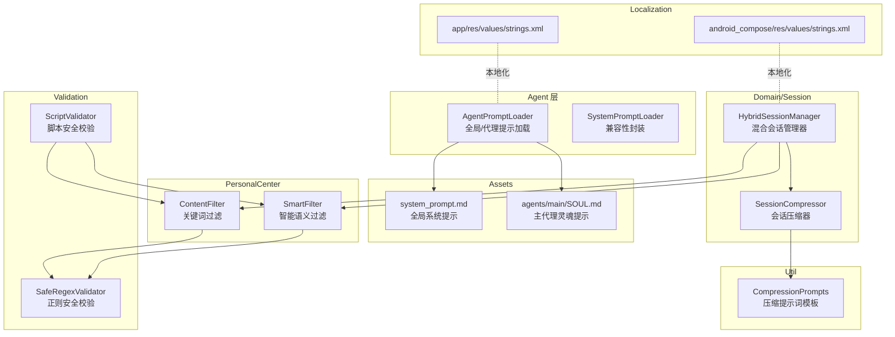
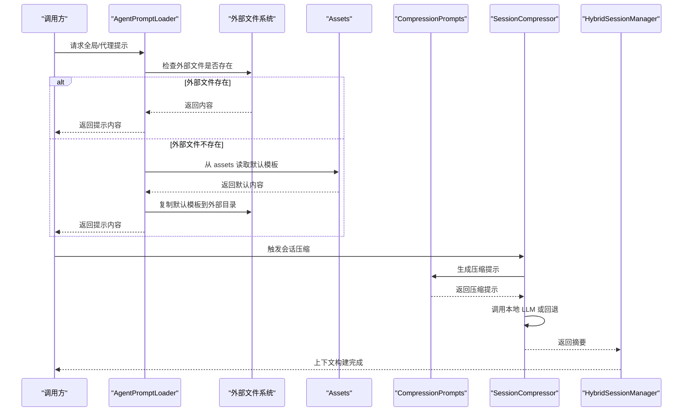
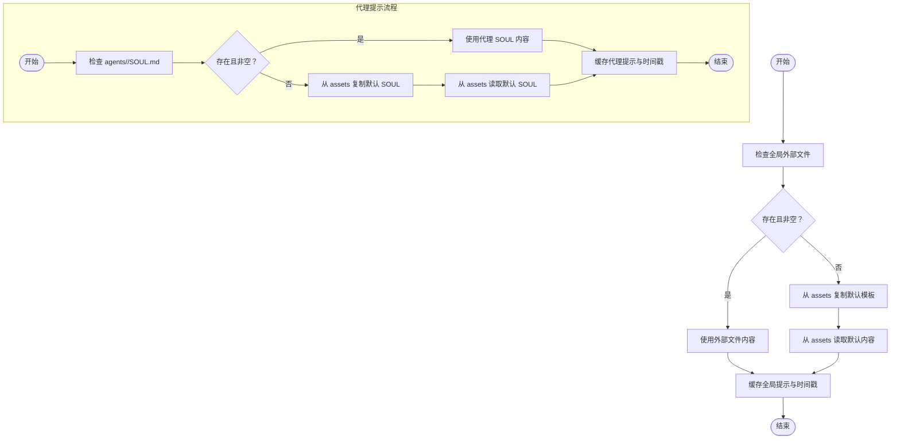
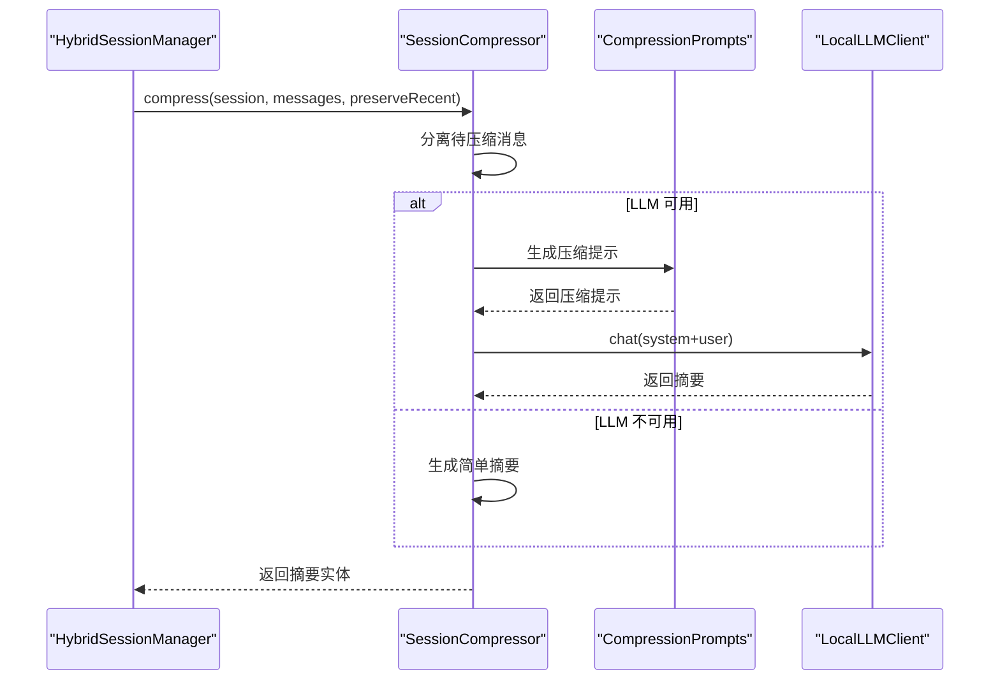
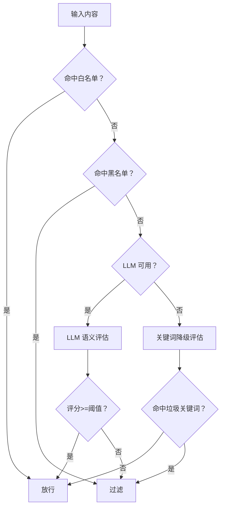
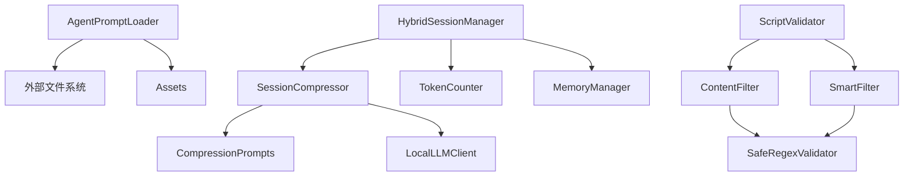

# 提示词处理

<cite>
**本文引用的文件**
- [AgentPromptLoader.kt](file://app/src/main/java/ai/openclaw/android/agent/AgentPromptLoader.kt)
- [SystemPromptLoader.kt](file://app/src/main/java/ai/openclaw/android/agent/SystemPromptLoader.kt)
- [system_prompt.md](file://app/src/main/assets/system_prompt.md)
- [SOUL.md](file://app/src/main/assets/agents/main/SOUL.md)
- [CompressionPrompts.kt](file://app/src/main/java/ai/openclaw/android/util/CompressionPrompts.kt)
- [SessionCompressor.kt](file://app/src/main/java/ai/openclaw/android/domain/session/SessionCompressor.kt)
- [HybridSessionManager.kt](file://app/src/main/java/ai/openclaw/android/domain/session/HybridSessionManager.kt)
- [ContentFilter.kt](file://app/src/main/java/ai/openclaw/android/personalcenter/ContentFilter.kt)
- [SmartFilter.kt](file://app/src/main/java/ai/openclaw/android/personalcenter/SmartFilter.kt)
- [SafeRegexValidator.kt](file://android_compose/src/main/java/org/a2ui/compose/validation/SafeRegexValidator.kt)
- [ScriptValidator.kt](file://script/src/main/java/ai/openclaw/script/ScriptValidator.kt)
- [strings.xml（应用资源）](file://app/src/main/res/values/strings.xml)
- [strings.xml（A2UI Compose 资源）](file://android_compose/src/main/res/values/strings.xml)
</cite>

## 目录
1. [简介](#简介)
2. [项目结构](#项目结构)
3. [核心组件](#核心组件)
4. [架构总览](#架构总览)
5. [详细组件分析](#详细组件分析)
6. [依赖关系分析](#依赖关系分析)
7. [性能考量](#性能考量)
8. [故障排查指南](#故障排查指南)
9. [结论](#结论)
10. [附录](#附录)

## 简介
本技术文档聚焦“提示词处理”模块，围绕 AgentPromptLoader 的提示词加载机制展开，涵盖文件读取、模板替换与动态参数注入的设计思路；系统提示词的结构设计与版本管理策略；压缩提示词的实现原理与优化策略；提示词的安全过滤与内容验证机制；以及国际化支持、多语言适配与本地化策略。同时提供提示词编写指南与最佳实践示例，帮助开发者在不重新编译的情况下灵活调整提示词，并确保安全性与性能。

## 项目结构
提示词处理相关代码主要分布在以下位置：
- agent 层：AgentPromptLoader、SystemPromptLoader（兼容性封装）
- assets：system_prompt.md（全局系统提示）、agents/main/SOUL.md（主代理的灵魂提示）
- util：CompressionPrompts（压缩提示词模板）
- domain/session：SessionCompressor、HybridSessionManager（会话压缩与上下文构建）
- personalcenter：ContentFilter、SmartFilter（内容过滤与智能语义评估）
- android_compose/validation：SafeRegexValidator（正则安全校验）
- script：ScriptValidator（脚本安全校验）
- res/values：strings.xml（应用与组件的本地化字符串）

图表来源
- [AgentPromptLoader.kt:1-284](file://app/src/main/java/ai/openclaw/android/agent/AgentPromptLoader.kt#L1-L284)
- [SystemPromptLoader.kt:1-43](file://app/src/main/java/ai/openclaw/android/agent/SystemPromptLoader.kt#L1-L43)
- [system_prompt.md:1-52](file://app/src/main/assets/system_prompt.md#L1-L52)
- [SOUL.md:1-71](file://app/src/main/assets/agents/main/SOUL.md#L1-L71)
- [CompressionPrompts.kt:1-31](file://app/src/main/java/ai/openclaw/android/util/CompressionPrompts.kt#L1-L31)
- [SessionCompressor.kt:1-83](file://app/src/main/java/ai/openclaw/android/domain/session/SessionCompressor.kt#L1-L83)
- [HybridSessionManager.kt:1-457](file://app/src/main/java/ai/openclaw/android/domain/session/HybridSessionManager.kt#L1-L457)
- [ContentFilter.kt:1-76](file://app/src/main/java/ai/openclaw/android/personalcenter/ContentFilter.kt#L1-L76)
- [SmartFilter.kt:1-152](file://app/src/main/java/ai/openclaw/android/personalcenter/SmartFilter.kt#L1-L152)
- [SafeRegexValidator.kt:1-89](file://android_compose/src/main/java/org/a2ui/compose/validation/SafeRegexValidator.kt#L1-L89)
- [ScriptValidator.kt:37-59](file://script/src/main/java/ai/openclaw/script/ScriptValidator.kt#L37-L59)
- [strings.xml（应用资源）:1-13](file://app/src/main/res/values/strings.xml#L1-L13)
- [strings.xml（A2UI Compose 资源）:1-4](file://android_compose/src/main/res/values/strings.xml#L1-L4)

章节来源
- [AgentPromptLoader.kt:1-284](file://app/src/main/java/ai/openclaw/android/agent/AgentPromptLoader.kt#L1-L284)
- [SystemPromptLoader.kt:1-43](file://app/src/main/java/ai/openclaw/android/agent/SystemPromptLoader.kt#L1-L43)
- [system_prompt.md:1-52](file://app/src/main/assets/system_prompt.md#L1-L52)
- [SOUL.md:1-71](file://app/src/main/assets/agents/main/SOUL.md#L1-L71)
- [CompressionPrompts.kt:1-31](file://app/src/main/java/ai/openclaw/android/util/CompressionPrompts.kt#L1-L31)
- [SessionCompressor.kt:1-83](file://app/src/main/java/ai/openclaw/android/domain/session/SessionCompressor.kt#L1-L83)
- [HybridSessionManager.kt:1-457](file://app/src/main/java/ai/openclaw/android/domain/session/HybridSessionManager.kt#L1-L457)
- [ContentFilter.kt:1-76](file://app/src/main/java/ai/openclaw/android/personalcenter/ContentFilter.kt#L1-L76)
- [SmartFilter.kt:1-152](file://app/src/main/java/ai/openclaw/android/personalcenter/SmartFilter.kt#L1-L152)
- [SafeRegexValidator.kt:1-89](file://android_compose/src/main/java/org/a2ui/compose/validation/SafeRegexValidator.kt#L1-L89)
- [ScriptValidator.kt:37-59](file://script/src/main/java/ai/openclaw/script/ScriptValidator.kt#L37-L59)
- [strings.xml（应用资源）:1-13](file://app/src/main/res/values/strings.xml#L1-L13)
- [strings.xml（A2UI Compose 资源）:1-4](file://android_compose/src/main/res/values/strings.xml#L1-L4)

## 核心组件
- AgentPromptLoader：负责从外部文件与 assets 中加载全局系统提示与代理“灵魂提示”，并提供缓存与首次复制默认模板的能力。
- SystemPromptLoader：为兼容性保留的封装对象，实际委托给 AgentPromptLoader。
- CompressionPrompts：提供压缩场景下的系统提示与消息拼接模板。
- SessionCompressor：在会话压缩阶段使用 CompressionPrompts 生成压缩提示，调用本地 LLM 或回退策略。
- HybridSessionManager：会话上下文构建与压缩触发，将摘要与记忆注入到系统提示中。
- ContentFilter/SmartFilter：内容过滤与智能语义评估，保障输出质量与用户体验。
- SafeRegexValidator/ScriptValidator：正则与脚本安全校验，防止恶意输入与危险模式。
- 国际化与本地化：通过 strings.xml 提供应用与组件的本地化字符串，支撑多语言展示与文案。

章节来源
- [AgentPromptLoader.kt:1-284](file://app/src/main/java/ai/openclaw/android/agent/AgentPromptLoader.kt#L1-L284)
- [SystemPromptLoader.kt:1-43](file://app/src/main/java/ai/openclaw/android/agent/SystemPromptLoader.kt#L1-L43)
- [CompressionPrompts.kt:1-31](file://app/src/main/java/ai/openclaw/android/util/CompressionPrompts.kt#L1-L31)
- [SessionCompressor.kt:1-83](file://app/src/main/java/ai/openclaw/android/domain/session/SessionCompressor.kt#L1-L83)
- [HybridSessionManager.kt:1-457](file://app/src/main/java/ai/openclaw/android/domain/session/HybridSessionManager.kt#L1-L457)
- [ContentFilter.kt:1-76](file://app/src/main/java/ai/openclaw/android/personalcenter/ContentFilter.kt#L1-L76)
- [SmartFilter.kt:1-152](file://app/src/main/java/ai/openclaw/android/personalcenter/SmartFilter.kt#L1-L152)
- [SafeRegexValidator.kt:1-89](file://android_compose/src/main/java/org/a2ui/compose/validation/SafeRegexValidator.kt#L1-L89)
- [ScriptValidator.kt:37-59](file://script/src/main/java/ai/openclaw/script/ScriptValidator.kt#L37-L59)
- [strings.xml（应用资源）:1-13](file://app/src/main/res/values/strings.xml#L1-L13)
- [strings.xml（A2UI Compose 资源）:1-4](file://android_compose/src/main/res/values/strings.xml#L1-L4)

## 架构总览
AgentPromptLoader 作为提示词加载的核心入口，优先从外部存储读取，若不存在则从 assets 复制默认模板；同时为每个代理维护独立的 soul 提示缓存。压缩阶段通过 CompressionPrompts 与 SessionCompressor 调用本地 LLM 生成摘要；HybridSessionManager 将摘要与记忆注入到会话上下文中，提升模型理解与响应质量。内容过滤与安全校验贯穿系统，确保输出安全与体验稳定。

图表来源
- [AgentPromptLoader.kt:36-153](file://app/src/main/java/ai/openclaw/android/agent/AgentPromptLoader.kt#L36-L153)
- [system_prompt.md:1-52](file://app/src/main/assets/system_prompt.md#L1-L52)
- [SOUL.md:1-71](file://app/src/main/assets/agents/main/SOUL.md#L1-L71)
- [CompressionPrompts.kt:25-30](file://app/src/main/java/ai/openclaw/android/util/CompressionPrompts.kt#L25-L30)
- [SessionCompressor.kt:18-60](file://app/src/main/java/ai/openclaw/android/domain/session/SessionCompressor.kt#L18-L60)
- [HybridSessionManager.kt:155-202](file://app/src/main/java/ai/openclaw/android/domain/session/HybridSessionManager.kt#L155-L202)

## 详细组件分析

### AgentPromptLoader 组件分析
- 文件读取与缓存
  - 全局提示：优先读取外部文件，若为空或不存在则从 assets 复制默认模板并读取；内部维护 lastModified 与 cachedPrompt 实现缓存。
  - 代理提示：按 agentId 在 agents/<agentId>/SOUL.md 下读取，同样支持首次复制默认模板与 per-agent 缓存。
- 模板替换与动态参数注入
  - 当前实现以静态文件读取为主，未显式展示占位符替换逻辑；建议在业务侧通过消息上下文与记忆注入进行动态参数注入，而非在提示词文件内硬编码。
- 版本管理与回退
  - 若外部与 assets 均不可用，使用内置兜底提示，保证系统可用性。

图表来源
- [AgentPromptLoader.kt:40-153](file://app/src/main/java/ai/openclaw/android/agent/AgentPromptLoader.kt#L40-L153)

章节来源
- [AgentPromptLoader.kt:1-284](file://app/src/main/java/ai/openclaw/android/agent/AgentPromptLoader.kt#L1-L284)
- [system_prompt.md:1-52](file://app/src/main/assets/system_prompt.md#L1-L52)
- [SOUL.md:1-71](file://app/src/main/assets/agents/main/SOUL.md#L1-L71)

### 系统提示词结构设计与版本管理
- 结构设计
  - 全局系统提示与代理 SOUL 提示均采用清晰的章节划分：规则、输出格式、卡片类型与动态技能等，便于模型遵循与扩展。
- 版本管理
  - 通过 assets 中的默认模板与首次复制机制实现版本化；外部文件 lastModified 用于缓存失效与热更新。
  - 建议在模板中增加版本字段与变更记录，便于追踪与回滚。

章节来源
- [system_prompt.md:1-52](file://app/src/main/assets/system_prompt.md#L1-L52)
- [SOUL.md:1-71](file://app/src/main/assets/agents/main/SOUL.md#L1-L71)
- [AgentPromptLoader.kt:224-283](file://app/src/main/java/ai/openclaw/android/agent/AgentPromptLoader.kt#L224-L283)

### 压缩提示词实现原理与优化策略
- 实现原理
  - CompressionPrompts 提供固定格式的压缩系统提示与消息拼接模板；SessionCompressor 在压缩时组合系统提示与待压缩消息，调用本地 LLM 生成摘要。
- 优化策略
  - LLM 可用时：使用 CompressionPrompts 与本地 LLM 生成高质量摘要。
  - LLM 不可用时：回退到简单摘要策略（截断与拼接），保证功能可用。
  - HybridSessionManager 支持增量压缩：将旧摘要与新消息合并，减少重复信息并保留关键决策与偏好。

图表来源
- [SessionCompressor.kt:18-60](file://app/src/main/java/ai/openclaw/android/domain/session/SessionCompressor.kt#L18-L60)
- [CompressionPrompts.kt:6-30](file://app/src/main/java/ai/openclaw/android/util/CompressionPrompts.kt#L6-L30)
- [HybridSessionManager.kt:248-299](file://app/src/main/java/ai/openclaw/android/domain/session/HybridSessionManager.kt#L248-L299)

章节来源
- [CompressionPrompts.kt:1-31](file://app/src/main/java/ai/openclaw/android/util/CompressionPrompts.kt#L1-L31)
- [SessionCompressor.kt:1-83](file://app/src/main/java/ai/openclaw/android/domain/session/SessionCompressor.kt#L1-L83)
- [HybridSessionManager.kt:1-457](file://app/src/main/java/ai/openclaw/android/domain/session/HybridSessionManager.kt#L1-L457)

### 提示词安全过滤与内容验证机制
- 正则安全
  - SafeRegexValidator 对正则表达式进行模式检测、长度限制、嵌套量词检查与分组数量限制，防止 ReDoS 攻击。
- 脚本安全
  - ScriptValidator 对脚本进行长度与禁止模式检查，避免危险脚本注入。
- 内容过滤
  - ContentFilter 基于关键词黑白名单进行快速过滤，屏蔽广告/营销/系统噪音等噪声内容。
  - SmartFilter 在 LLM 可用时进行语义评估，不可用时回退到关键词模式，结合缓存降低重复评估成本。

图表来源
- [ContentFilter.kt:60-75](file://app/src/main/java/ai/openclaw/android/personalcenter/ContentFilter.kt#L60-L75)
- [SmartFilter.kt:63-108](file://app/src/main/java/ai/openclaw/android/personalcenter/SmartFilter.kt#L63-L108)
- [SafeRegexValidator.kt:42-68](file://android_compose/src/main/java/org/a2ui/compose/validation/SafeRegexValidator.kt#L42-L68)
- [ScriptValidator.kt:42-58](file://script/src/main/java/ai/openclaw/script/ScriptValidator.kt#L42-L58)

章节来源
- [ContentFilter.kt:1-76](file://app/src/main/java/ai/openclaw/android/personalcenter/ContentFilter.kt#L1-L76)
- [SmartFilter.kt:1-152](file://app/src/main/java/ai/openclaw/android/personalcenter/SmartFilter.kt#L1-L152)
- [SafeRegexValidator.kt:1-89](file://android_compose/src/main/java/org/a2ui/compose/validation/SafeRegexValidator.kt#L1-L89)
- [ScriptValidator.kt:37-59](file://script/src/main/java/ai/openclaw/script/ScriptValidator.kt#L37-L59)

### 国际化支持、多语言适配与本地化策略
- 应用与组件本地化
  - 通过 app/res/values/strings.xml 与 android_compose/res/values/strings.xml 提供本地化字符串，支持不同语言环境下的文案显示。
- 提示词本地化建议
  - 将提示词拆分为多语言版本，分别放置于 assets 的对应语言目录（如 values-zh、values-en 等），并在运行时根据系统语言选择加载。
  - 对于动态参数与占位符，建议在业务层进行本地化处理，避免在提示词中硬编码语言特定内容。

章节来源
- [strings.xml（应用资源）:1-13](file://app/src/main/res/values/strings.xml#L1-L13)
- [strings.xml（A2UI Compose 资源）:1-4](file://android_compose/src/main/res/values/strings.xml#L1-L4)

### 提示词编写指南与最佳实践
- 结构化组织
  - 使用清晰的章节标题与要点列表，明确规则、输出格式与卡片类型。
- 动态参数注入
  - 通过消息上下文与记忆注入的方式传递动态信息，避免在提示词中硬编码。
- 版本与回退
  - 为提示词增加版本标识与变更记录；提供兜底提示，确保异常场景可用。
- 安全与合规
  - 对正则与脚本进行安全校验；在内容过滤层设置合理的黑白名单与阈值。
- 性能优化
  - 启用缓存与增量压缩，减少重复计算与传输；在 LLM 不可用时使用简单回退策略。

## 依赖关系分析
- AgentPromptLoader 依赖 Context 获取外部存储路径，读取 assets 与外部文件，维护全局与 per-agent 缓存。
- SessionCompressor 依赖 CompressionPrompts 与 LocalLLMClient，实现压缩与回退策略。
- HybridSessionManager 依赖 SessionCompressor、TokenCounter、MemoryManager 等，构建会话上下文并触发压缩。
- ContentFilter/SmartFilter 依赖关键词集合与 LLM 评估回调，提供多层次过滤能力。
- SafeRegexValidator/ScriptValidator 为系统提供安全校验能力，防止恶意输入。

图表来源
- [AgentPromptLoader.kt:1-284](file://app/src/main/java/ai/openclaw/android/agent/AgentPromptLoader.kt#L1-L284)
- [SessionCompressor.kt:1-83](file://app/src/main/java/ai/openclaw/android/domain/session/SessionCompressor.kt#L1-L83)
- [HybridSessionManager.kt:1-457](file://app/src/main/java/ai/openclaw/android/domain/session/HybridSessionManager.kt#L1-L457)
- [ContentFilter.kt:1-76](file://app/src/main/java/ai/openclaw/android/personalcenter/ContentFilter.kt#L1-L76)
- [SmartFilter.kt:1-152](file://app/src/main/java/ai/openclaw/android/personalcenter/SmartFilter.kt#L1-L152)
- [SafeRegexValidator.kt:1-89](file://android_compose/src/main/java/org/a2ui/compose/validation/SafeRegexValidator.kt#L1-L89)
- [ScriptValidator.kt:37-59](file://script/src/main/java/ai/openclaw/script/ScriptValidator.kt#L37-L59)

章节来源
- [AgentPromptLoader.kt:1-284](file://app/src/main/java/ai/openclaw/android/agent/AgentPromptLoader.kt#L1-L284)
- [SessionCompressor.kt:1-83](file://app/src/main/java/ai/openclaw/android/domain/session/SessionCompressor.kt#L1-L83)
- [HybridSessionManager.kt:1-457](file://app/src/main/java/ai/openclaw/android/domain/session/HybridSessionManager.kt#L1-L457)
- [ContentFilter.kt:1-76](file://app/src/main/java/ai/openclaw/android/personalcenter/ContentFilter.kt#L1-L76)
- [SmartFilter.kt:1-152](file://app/src/main/java/ai/openclaw/android/personalcenter/SmartFilter.kt#L1-L152)
- [SafeRegexValidator.kt:1-89](file://android_compose/src/main/java/org/a2ui/compose/validation/SafeRegexValidator.kt#L1-L89)
- [ScriptValidator.kt:37-59](file://script/src/main/java/ai/openclaw/script/ScriptValidator.kt#L37-L59)

## 性能考量
- 缓存策略：AgentPromptLoader 与 HybridSessionManager 的摘要缓存有效减少重复 IO 与计算。
- 增量压缩：合并旧摘要与新消息，降低 LLM 负担与输出冗余。
- 回退机制：LLM 不可用时的简单摘要策略确保系统稳定性。
- 过滤与校验：关键词与语义过滤、正则与脚本安全校验减少无效请求与潜在风险。

## 故障排查指南
- 提示词未生效
  - 检查外部文件是否存在且非空；若为空，确认是否正确复制了 assets 默认模板。
  - 查看日志中“External file is empty, falling back to default”等提示。
- 提示词热更新无效
  - 确认文件最后修改时间是否更新；AgentPromptLoader 依据 lastModified 判定缓存有效性。
- 压缩失败
  - 检查本地 LLM 是否可用；查看“LLM summary generation failed”日志。
  - 确认 CompressionPrompts 的提示格式与消息拼接是否符合预期。
- 内容被误判
  - 调整 ContentFilter/SmartFilter 的关键词集合与阈值；必要时关闭智能过滤回退到关键词模式。
- 安全告警
  - 检查正则表达式是否命中危险模式；确认脚本长度与禁止模式。

章节来源
- [AgentPromptLoader.kt:69-72](file://app/src/main/java/ai/openclaw/android/agent/AgentPromptLoader.kt#L69-L72)
- [HybridSessionManager.kt:386-397](file://app/src/main/java/ai/openclaw/android/domain/session/HybridSessionManager.kt#L386-L397)
- [ContentFilter.kt:60-75](file://app/src/main/java/ai/openclaw/android/personalcenter/ContentFilter.kt#L60-L75)
- [SmartFilter.kt:87-96](file://app/src/main/java/ai/openclaw/android/personalcenter/SmartFilter.kt#L87-L96)
- [SafeRegexValidator.kt:42-68](file://android_compose/src/main/java/org/a2ui/compose/validation/SafeRegexValidator.kt#L42-L68)
- [ScriptValidator.kt:42-58](file://script/src/main/java/ai/openclaw/script/ScriptValidator.kt#L42-L58)

## 结论
提示词处理模块通过 AgentPromptLoader 实现灵活的外部文件与 assets 双路径加载、缓存与首次复制默认模板机制；结合 CompressionPrompts 与 SessionCompressor 的压缩策略，以及 HybridSessionManager 的上下文构建，形成高效稳定的提示词体系。配合 ContentFilter、SmartFilter、SafeRegexValidator 与 ScriptValidator 的安全与内容治理，确保系统在多语言、多场景下的安全性与可用性。建议进一步完善提示词的版本管理与本地化策略，持续优化压缩与过滤效果。

## 附录
- 提示词编写清单
  - 明确角色与目标
  - 列出规则与约束
  - 定义输出格式与卡片类型
  - 提供动态参数注入点
  - 增加版本标识与变更记录
  - 准备兜底提示与回退策略
- 最佳实践
  - 使用缓存与增量压缩
  - 在业务层进行本地化与参数注入
  - 启用安全校验与内容过滤
  - 定期评估与迭代提示词