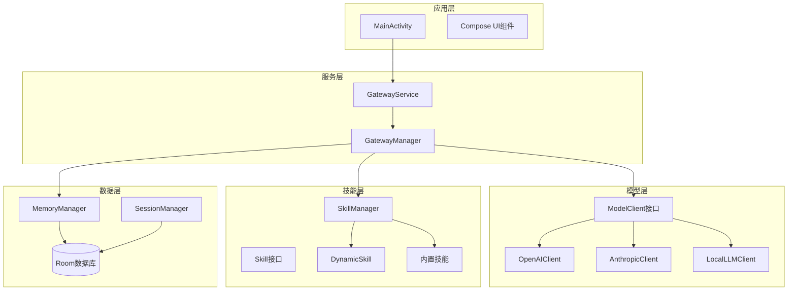
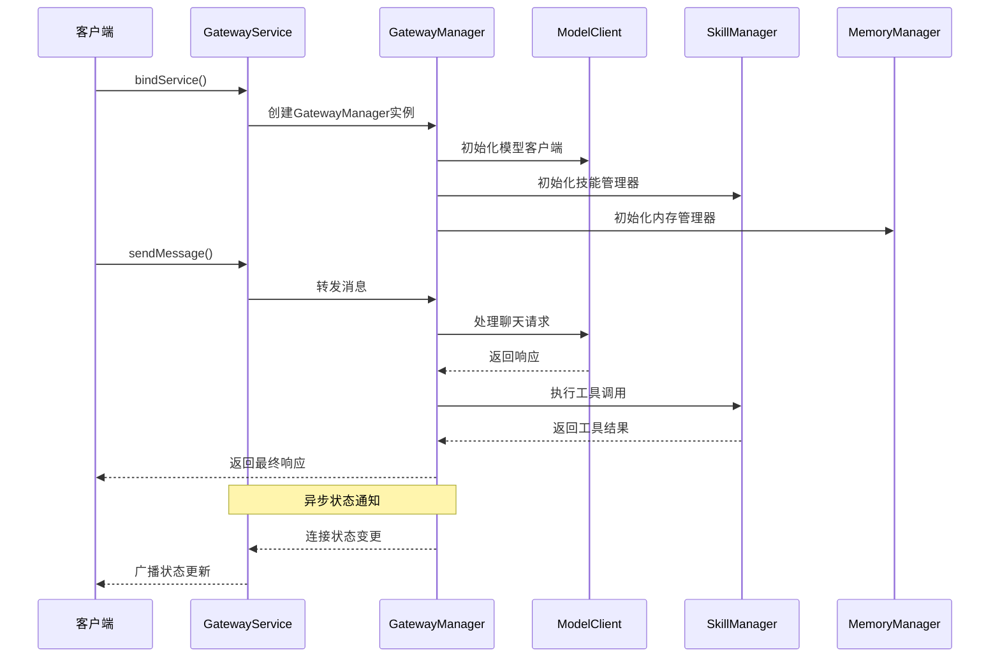
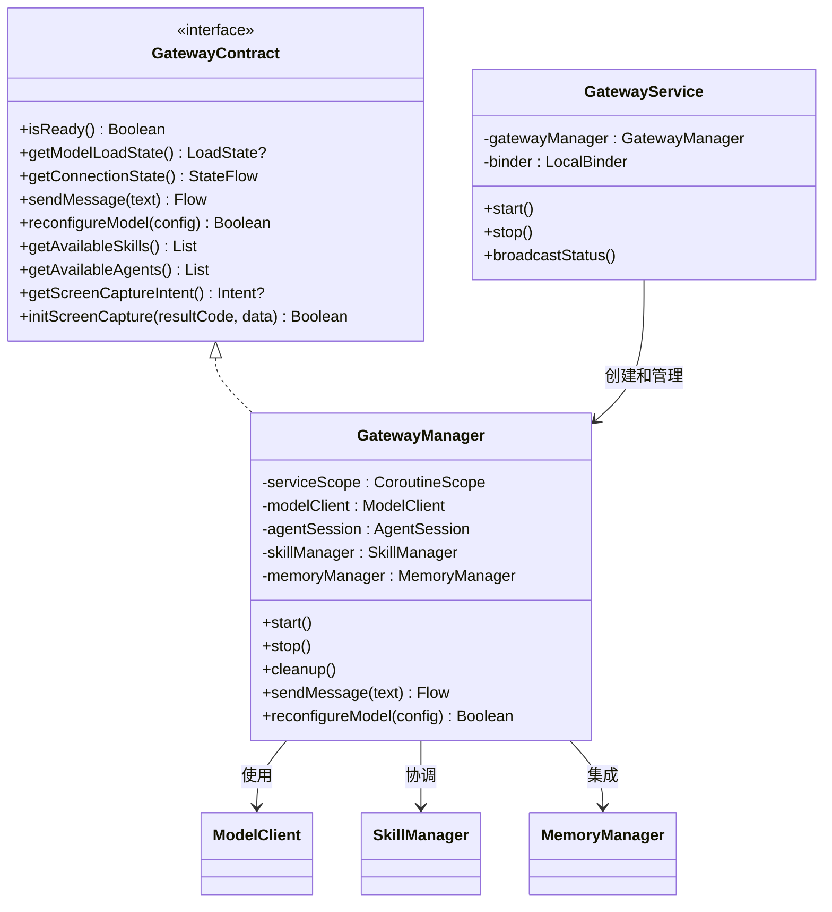
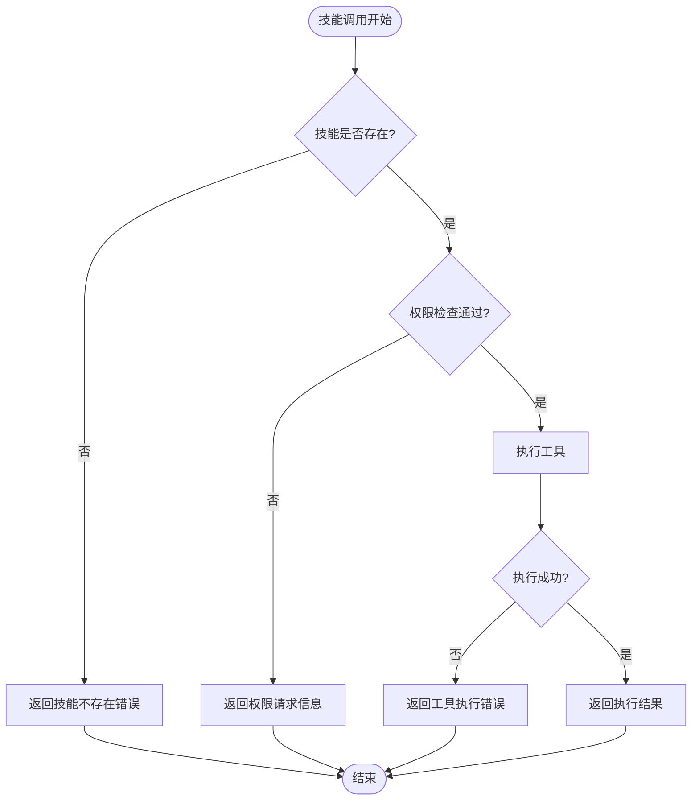
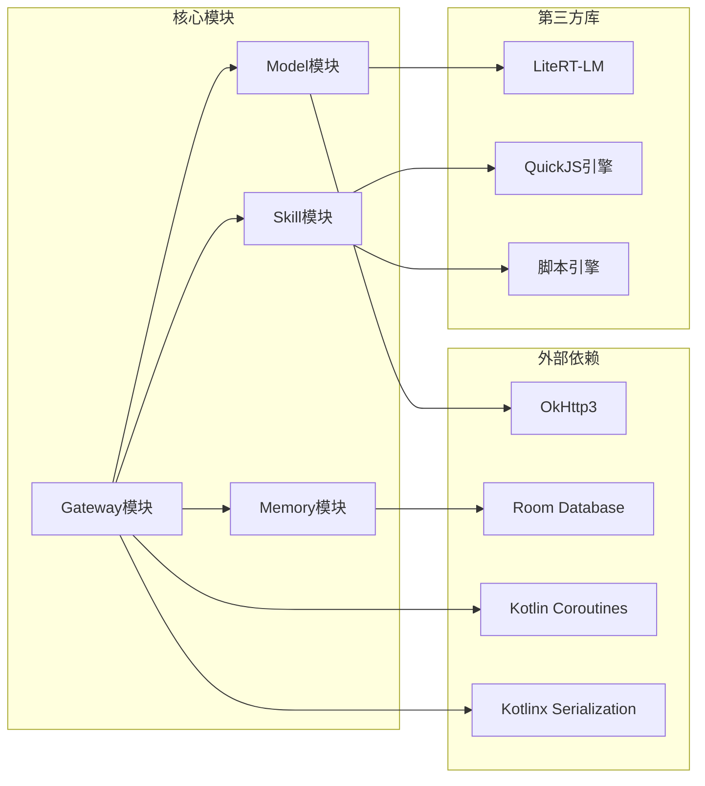

# API参考文档

<cite>
**本文档引用的文件**
- [GatewayContract.kt](file://app/src/main/java/ai/openclaw/android/GatewayContract.kt)
- [GatewayManager.kt](file://app/src/main/java/ai/openclaw/android/GatewayManager.kt)
- [GatewayService.kt](file://app/src/main/java/ai/openclaw/android/GatewayService.kt)
- [ModelClient.kt](file://app/src/main/java/ai/openclaw/android/model/ModelClient.kt)
- [ModelModels.kt](file://app/src/main/java/ai/openclaw/android/model/ModelModels.kt)
- [OpenAIClient.kt](file://app/src/main/java/ai/openclaw/android/model/OpenAIClient.kt)
- [AnthropicClient.kt](file://app/src/main/java/ai/openclaw/android/model/AnthropicClient.kt)
- [LocalLLMClient.kt](file://app/src/main/java/ai/openclaw/android/model/LocalLLMClient.kt)
- [Skill.kt](file://app/src/main/java/ai/openclaw/android/skill/Skill.kt)
- [SkillTool.kt](file://app/src/main/java/ai/openclaw/android/skill/SkillTool.kt)
- [SkillManager.kt](file://app/src/main/java/ai/openclaw/android/skill/SkillManager.kt)
- [DynamicSkill.kt](file://app/src/main/java/ai/openclaw/android/skill/DynamicSkill.kt)
- [DynamicSkillManager.kt](file://app/src/main/java/ai/openclaw/android/skill/DynamicSkillManager.kt)
- [WeatherSkill.kt](file://app/src/main/java/ai/openclaw/android/skill/builtin/WeatherSkill.kt)
- [ScriptSkill.kt](file://app/src/main/java/ai/openclaw/android/skill/builtin/ScriptSkill.kt)
</cite>

## 目录
1. [简介](#简介)
2. [项目结构](#项目结构)
3. [核心组件](#核心组件)
4. [架构概览](#架构概览)
5. [详细组件分析](#详细组件分析)
6. [依赖分析](#依赖分析)
7. [性能考虑](#性能考虑)
8. [故障排除指南](#故障排除指南)
9. [结论](#结论)
10. [附录](#附录)

## 简介

OpenClaw-Android是一个基于Android平台的智能代理系统，提供了完整的API参考文档。本文档详细记录了所有公共接口的方法签名、参数说明和返回值，深入解释了GatewayContract接口的设计和使用方法，阐述了Skill接口的扩展点和实现要求，并详细说明了ModelClient的API规范和集成指导。

该系统采用模块化设计，支持多种模型提供商（OpenAI、Anthropic、本地推理），具备动态技能扩展能力，以及完整的内存管理系统。所有组件都遵循清晰的接口契约，确保了系统的可维护性和可扩展性。

## 项目结构

OpenClaw-Android项目采用分层架构设计，主要包含以下核心模块：

**图表来源**
- [GatewayService.kt:1-234](file://app/src/main/java/ai/openclaw/android/GatewayService.kt#L1-L234)
- [GatewayManager.kt:1-676](file://app/src/main/java/ai/openclaw/android/GatewayManager.kt#L1-L676)

**章节来源**
- [GatewayService.kt:1-234](file://app/src/main/java/ai/openclaw/android/GatewayService.kt#L1-L234)
- [GatewayManager.kt:1-676](file://app/src/main/java/ai/openclaw/android/GatewayManager.kt#L1-L676)

## 核心组件

### GatewayContract接口

GatewayContract是系统的核心接口，定义了Activity与GatewayManager之间的通信契约。该接口设计遵循依赖倒置原则，确保Activity只依赖抽象而非具体实现。

**主要方法说明：**

- `isReady(): Boolean` - 检查系统是否已准备好接收消息
- `getModelLoadState(): LocalLLMClient.LoadState?` - 获取本地模型加载状态
- `getConnectionState(): StateFlow<GatewayManager.ConnectionState>` - 获取连接状态流
- `sendMessage(text: String): Flow<SessionEvent>` - 发送消息并返回事件流
- `reconfigureModel(config: ModelConfig): Boolean` - 重新配置模型
- `getAvailableSkills(): List<SkillInfo>` - 获取可用技能列表
- `getAvailableAgents(): List<AgentInfo>` - 获取可用代理列表
- `getScreenCaptureIntent(): Intent?` - 获取屏幕捕获权限意图
- `initScreenCapture(resultCode: Int, data: Intent): Boolean` - 初始化屏幕捕获

**章节来源**
- [GatewayContract.kt:14-33](file://app/src/main/java/ai/openclaw/android/GatewayContract.kt#L14-L33)

### ModelClient接口

ModelClient定义了LLM API调用的标准契约，支持同步和异步两种调用模式。

**核心方法：**

- `chat(messages: List<Message>, tools: List<Tool>? = null): Result<ModelResponse>` - 非流式聊天
- `chatStream(messages: List<Message>, tools: List<Tool>? = null): Flow<ChatEvent>` - 流式聊天
- `configure(provider: ModelProvider, apiKey: String, model: String, baseUrl: String = "")` - 配置模型提供商

**数据模型：**

- `ChatEvent` - 流式事件密封类，包含Token、ToolCallRequested、Complete、Error四种状态
- `ModelProvider` - 枚举支持OPENAI、ANTHROPIC、LOCAL三种提供商
- `Message` - 对话消息模型，支持system、user、assistant、tool四种角色

**章节来源**
- [ModelClient.kt:10-32](file://app/src/main/java/ai/openclaw/android/model/ModelClient.kt#L10-L32)
- [ModelModels.kt:6-168](file://app/src/main/java/ai/openclaw/android/model/ModelModels.kt#L6-L168)

### Skill接口体系

Skill接口定义了可扩展的技能系统，支持静态内置技能和动态生成技能。

**核心组件：**

- `Skill` - 基础技能接口，定义技能的基本属性和生命周期
- `SkillTool` - 技能工具接口，定义工具的参数和执行逻辑
- `SkillManager` - 技能管理器，负责技能的注册、执行和权限检查
- `DynamicSkill` - 动态技能实现，支持LLM生成的JavaScript脚本

**章节来源**
- [Skill.kt:3-13](file://app/src/main/java/ai/openclaw/android/skill/Skill.kt#L3-L13)
- [SkillTool.kt:3-22](file://app/src/main/java/ai/openclaw/android/skill/SkillTool.kt#L3-L22)
- [SkillManager.kt:8-193](file://app/src/main/java/ai/openclaw/android/skill/SkillManager.kt#L8-L193)

## 架构概览

OpenClaw-Android采用服务驱动的架构模式，通过GatewayService提供前台服务，GatewayManager实现业务逻辑，各组件通过清晰的接口进行交互。

**图表来源**
- [GatewayService.kt:70-234](file://app/src/main/java/ai/openclaw/android/GatewayService.kt#L70-L234)
- [GatewayManager.kt:115-273](file://app/src/main/java/ai/openclaw/android/GatewayManager.kt#L115-L273)

**章节来源**
- [GatewayService.kt:31-234](file://app/src/main/java/ai/openclaw/android/GatewayService.kt#L31-L234)
- [GatewayManager.kt:64-676](file://app/src/main/java/ai/openclaw/android/GatewayManager.kt#L64-L676)

## 详细组件分析

### GatewayManager实现

GatewayManager是系统的核心协调者，实现了GatewayContract接口，负责管理所有子系统组件。

**主要职责：**

1. **组件生命周期管理** - 负责模型客户端、技能管理器、内存管理器等组件的初始化和清理
2. **消息路由** - 处理用户消息，支持单代理和多代理路由
3. **状态监控** - 提供连接状态的实时监控和通知
4. **资源管理** - 管理本地模型的加载、释放和错误恢复

**关键实现细节：**

- **多代理支持** - 通过AgentRouter和AgentSessionManager实现多代理会话管理
- **内存集成** - 与MemoryManager和HybridSessionManager深度集成
- **动态技能** - 支持运行时注册和执行JavaScript脚本技能
- **权限管理** - 集成屏幕捕获权限管理和无障碍服务

**图表来源**
- [GatewayContract.kt:14-33](file://app/src/main/java/ai/openclaw/android/GatewayContract.kt#L14-L33)
- [GatewayManager.kt:64-676](file://app/src/main/java/ai/openclaw/android/GatewayManager.kt#L64-L676)
- [GatewayService.kt:31-234](file://app/src/main/java/ai/openclaw/android/GatewayService.kt#L31-L234)

**章节来源**
- [GatewayManager.kt:64-676](file://app/src/main/java/ai/openclaw/android/GatewayManager.kt#L64-L676)

### ModelClient实现族

系统提供了三种不同的ModelClient实现，分别对应不同的部署场景：

#### OpenAIClient

OpenAIClient实现了标准的OpenAI兼容API，支持流式响应和工具调用。

**特性：**
- 支持OpenAI兼容的聊天完成API
- 流式SSE响应处理
- 工具调用的增量解析
- 错误处理和重试机制

**配置选项：**
- API密钥认证
- 自定义基础URL
- 模型选择和参数配置

#### AnthropicClient

AnthropicClient专门处理Anthropic Claude API，适配其独特的消息格式和工具使用协议。

**特性：**
- Anthropic Messages API兼容
- 内容块格式转换
- 工具使用事件的SSE处理
- 系统消息的特殊处理

**章节来源**
- [OpenAIClient.kt:25-249](file://app/src/main/java/ai/openclaw/android/model/OpenAIClient.kt#L25-L249)
- [AnthropicClient.kt:37-490](file://app/src/main/java/ai/openclaw/android/model/AnthropicClient.kt#L37-L490)

### LocalLLMClient

LocalLLMClient使用LiteRT-LM框架在设备上运行本地语言模型，提供离线推理能力。

**技术特点：**
- 支持Gemma 4 E4B等轻量级模型
- 多后端加速（NPU、GPU、CPU）
- 自适应性能优化
- 工具调用的本地执行

**硬件兼容性：**
- 自动检测设备硬件特性
- 智能后端选择策略
- GPU崩溃后的自动降级
- 性能监控和日志记录

**章节来源**
- [LocalLLMClient.kt:48-777](file://app/src/main/java/ai/openclaw/android/model/LocalLLMClient.kt#L48-L777)

### Skill系统架构

Skill系统提供了灵活的扩展机制，支持静态内置技能和动态生成技能。

**图表来源**
- [SkillManager.kt:62-83](file://app/src/main/java/ai/openclaw/android/skill/SkillManager.kt#L62-L83)

**章节来源**
- [SkillManager.kt:8-193](file://app/src/main/java/ai/openclaw/android/skill/SkillManager.kt#L8-L193)
- [DynamicSkillManager.kt:22-202](file://app/src/main/java/ai/openclaw/android/skill/DynamicSkillManager.kt#L22-L202)

### 内置技能示例

#### WeatherSkill

WeatherSkill展示了如何实现一个完整的内置技能，支持多数据源天气查询。

**功能特性：**
- 支持中文和英文城市名
- 多数据源回退机制（wttr.in → Open-Meteo）
- A2UI卡片格式输出
- 详细的错误处理

**实现要点：**
- 城市坐标映射表
- 天气代码转换
- HTTP客户端管理
- 结构化输出格式

**章节来源**
- [WeatherSkill.kt:11-399](file://app/src/main/java/ai/openclaw/android/skill/builtin/WeatherSkill.kt#L11-L399)

#### ScriptSkill

ScriptSkill提供了动态脚本执行能力，通过JavaScript桥接各种系统功能。

**核心功能：**
- JavaScript脚本沙箱执行
- 文件系统操作（fs）
- HTTP网络请求（http）
- 内存检索和存储（memory）

**安全机制：**
- 能力白名单控制
- 执行时间限制
- 路径访问限制
- 用户确认机制

**章节来源**
- [ScriptSkill.kt:19-134](file://app/src/main/java/ai/openclaw/android/skill/builtin/ScriptSkill.kt#L19-L134)

## 依赖分析

系统采用模块化设计，各组件之间保持松耦合的关系。

**图表来源**
- [GatewayManager.kt:18-49](file://app/src/main/java/ai/openclaw/android/GatewayManager.kt#L18-L49)
- [SkillManager.kt:3-7](file://app/src/main/java/ai/openclaw/android/skill/SkillManager.kt#L3-L7)

**章节来源**
- [GatewayManager.kt:1-676](file://app/src/main/java/ai/openclaw/android/GatewayManager.kt#L1-L676)
- [SkillManager.kt:1-193](file://app/src/main/java/ai/openclaw/android/skill/SkillManager.kt#L1-L193)

## 性能考虑

### 模型性能优化

系统针对不同部署场景提供了多种性能优化策略：

**云端模型优化：**
- 连接池复用
- 超时配置调整
- 错误重试机制
- 流式响应处理

**本地模型优化：**
- 自动后端选择
- GPU崩溃检测
- 缓存目录管理
- 内存使用监控

### 内存管理

系统实现了多层次的内存管理策略：

- **会话压缩** - 减少历史消息占用
- **向量搜索优化** - 高效的相似度计算
- **模型缓存** - 避免重复加载
- **垃圾回收** - 及时释放资源

### 线程和协程管理

- **IO线程池** - 处理网络和文件操作
- **主线程调度** - 更新UI状态
- **协程作用域** - 管理异步任务生命周期
- **SupervisorJob** - 防止单个任务影响整体

## 故障排除指南

### 常见问题诊断

**模型加载失败：**
1. 检查模型文件完整性
2. 验证设备硬件兼容性
3. 查看GPU初始化日志
4. 尝试降级到CPU后端

**技能执行错误：**
1. 确认技能权限已授予
2. 检查网络连接状态
3. 验证API密钥有效性
4. 查看技能日志输出

**内存管理问题：**
1. 监控内存使用情况
2. 检查向量索引完整性
3. 验证磁盘空间充足
4. 清理临时文件

### 日志分析

系统提供了详细的日志记录机制：

- **调试级别** - 详细的操作流程
- **信息级别** - 关键状态变更
- **警告级别** - 可恢复的错误
- **错误级别** - 严重故障

**章节来源**
- [GatewayManager.kt:325-387](file://app/src/main/java/ai/openclaw/android/GatewayManager.kt#L325-L387)
- [LocalLLMClient.kt:175-286](file://app/src/main/java/ai/openclaw/android/model/LocalLLMClient.kt#L175-L286)

## 结论

OpenClaw-Android提供了一个完整、可扩展的智能代理API系统。通过清晰的接口设计、模块化的架构和丰富的扩展能力，开发者可以轻松集成和定制各种AI功能。

**主要优势：**
- **接口清晰** - 所有公共接口都有明确的契约和文档
- **扩展性强** - 支持动态技能和自定义模型
- **部署灵活** - 云端、本地、混合部署模式
- **安全性高** - 完善的权限控制和安全检查

**适用场景：**
- 智能助手应用
- 企业AI解决方案
- 教育培训平台
- 开发者工具套件

## 附录

### API使用示例

由于代码示例的具体内容可能涉及版权问题，本文档提供API使用的通用指导：

**基本集成步骤：**
1. 在AndroidManifest.xml中声明服务
2. 在Application中初始化配置管理器
3. 通过bindService绑定GatewayService
4. 获取GatewayContract实例
5. 调用相应API方法

**最佳实践：**
- 使用协程处理异步操作
- 正确处理错误和异常
- 实现适当的生命周期管理
- 遵循权限申请流程

### 版本兼容性

系统遵循语义化版本控制：

- **主版本** - 重大架构变更
- **次版本** - 新功能添加
- **修订版本** - 错误修复

**迁移指导：**
- 检查接口变更日志
- 更新依赖版本
- 测试兼容性
- 逐步迁移

### 第三方集成

系统提供了完善的第三方集成接口：

- **模型提供商** - 支持自定义模型API
- **技能扩展** - 动态注册新技能
- **数据源** - 集成外部数据服务
- **UI组件** - 可定制的界面组件

通过遵循本文档的API规范和最佳实践，开发者可以快速集成OpenClaw-Android的各项功能，构建强大的AI应用。