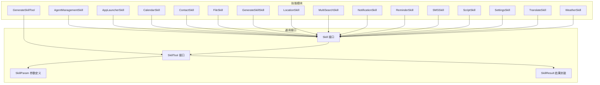
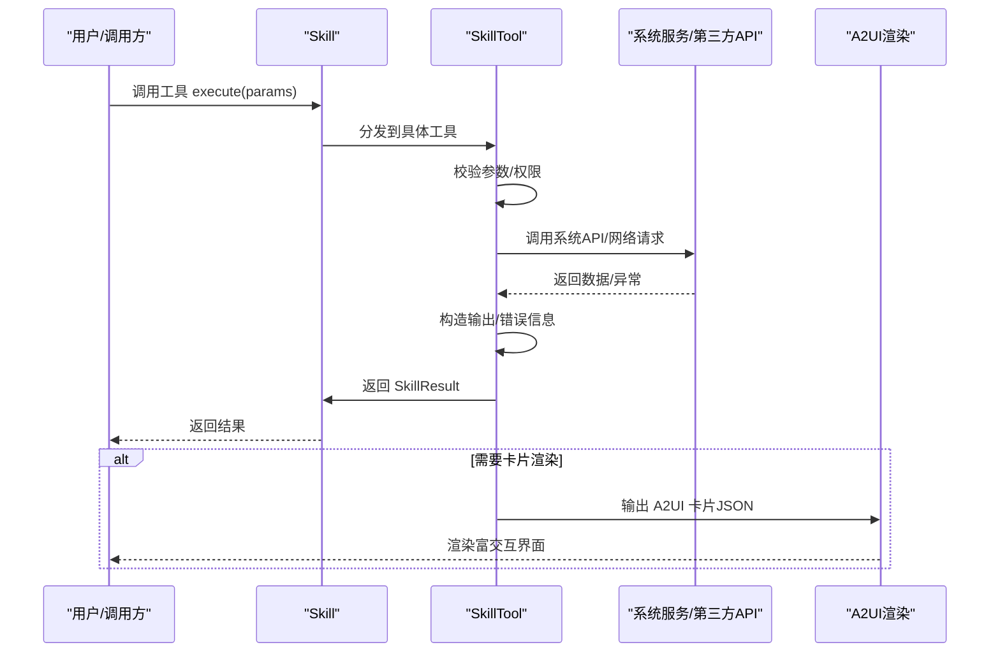
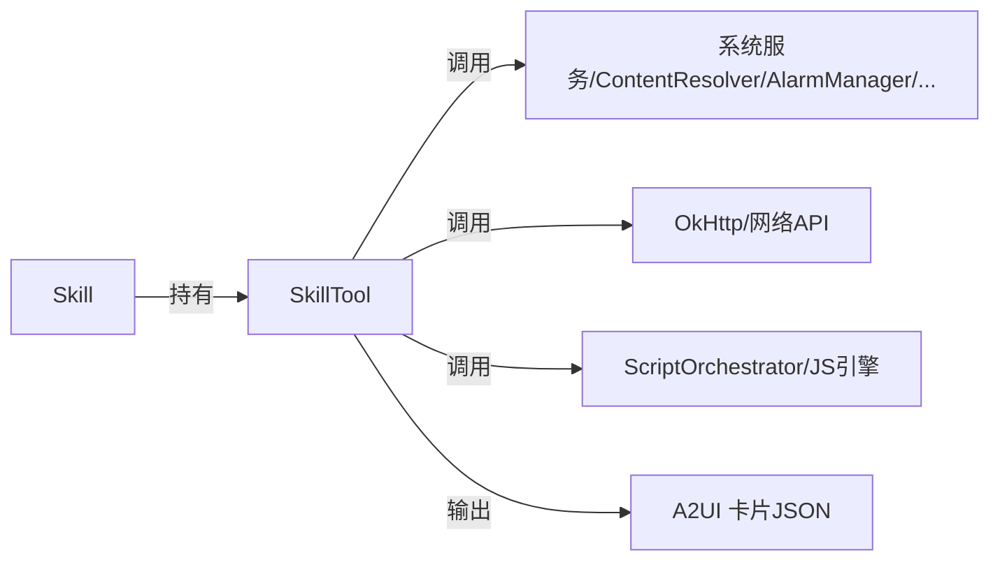

# 内置技能实现参考

<cite>
**本文档引用的文件**
- [AgentManagementSkill.kt](file://app/src/main/java/ai/openclaw/android/skill/builtin/AgentManagementSkill.kt)
- [AppLauncherSkill.kt](file://app/src/main/java/ai/openclaw/android/skill/builtin/AppLauncherSkill.kt)
- [CalendarSkill.kt](file://app/src/main/java/ai/openclaw/android/skill/builtin/CalendarSkill.kt)
- [ContactSkill.kt](file://app/src/main/java/ai/openclaw/android/skill/builtin/ContactSkill.kt)
- [FileSkill.kt](file://app/src/main/java/ai/openclaw/android/skill/builtin/FileSkill.kt)
- [GenerateSkillSkill.kt](file://app/src/main/java/ai/openclaw/android/skill/builtin/GenerateSkillSkill.kt)
- [GenerateSkillTool.kt](file://app/src/main/java/ai/openclaw/android/skill/builtin/GenerateSkillTool.kt)
- [LocationSkill.kt](file://app/src/main/java/ai/openclaw/android/skill/builtin/LocationSkill.kt)
- [MultiSearchSkill.kt](file://app/src/main/java/ai/openclaw/android/skill/builtin/MultiSearchSkill.kt)
- [NotificationSkill.kt](file://app/src/main/java/ai/openclaw/android/skill/builtin/NotificationSkill.kt)
- [ReminderSkill.kt](file://app/src/main/java/ai/openclaw/android/skill/builtin/ReminderSkill.kt)
- [SMSSkill.kt](file://app/src/main/java/ai/openclaw/android/skill/builtin/SMSSkill.kt)
- [ScriptSkill.kt](file://app/src/main/java/ai/openclaw/android/skill/builtin/ScriptSkill.kt)
- [SettingsSkill.kt](file://app/src/main/java/ai/openclaw/android/skill/builtin/SettingsSkill.kt)
- [TranslateSkill.kt](file://app/src/main/java/ai/openclaw/android/skill/builtin/TranslateSkill.kt)
- [WeatherSkill.kt](file://app/src/main/java/ai/openclaw/android/skill/builtin/WeatherSkill.kt)
</cite>

## 目录
1. [简介](#简介)
2. [项目结构](#项目结构)
3. [核心组件](#核心组件)
4. [架构总览](#架构总览)
5. [详细组件分析](#详细组件分析)
6. [依赖关系分析](#依赖关系分析)
7. [性能考量](#性能考量)
8. [故障排查指南](#故障排查指南)
9. [结论](#结论)
10. [附录](#附录)

## 简介
本文件为 OpenClaw Android 项目的内置技能系统实现参考文档。系统提供 12 类内置技能，覆盖智能体管理、应用启动、日历与提醒、通讯录、文件系统、定位与周边、通知管理、短信、系统设置、翻译、天气查询以及脚本引擎等能力。每个技能均以统一的 Skill/SkillTool 接口组织，具备明确的输入参数、输出格式与错误处理机制，并支持 A2UI 卡片渲染用于富交互 UI 展示。

## 项目结构
内置技能位于 app 模块的 ai.openclaw.android.skill.builtin 包下，每个技能以独立类文件实现，遵循统一的接口规范。技能通过 SkillContext 注入所需依赖（如 Android 上下文、HTTP 客户端、脚本引擎等），并在 initialize/cleanup 生命周期中完成资源初始化与释放。

**图表来源**
- [AgentManagementSkill.kt:6-34](file://app/src/main/java/ai/openclaw/android/skill/builtin/AgentManagementSkill.kt#L6-L34)
- [AppLauncherSkill.kt:8-193](file://app/src/main/java/ai/openclaw/android/skill/builtin/AppLauncherSkill.kt#L8-L193)
- [CalendarSkill.kt:13-182](file://app/src/main/java/ai/openclaw/android/skill/builtin/CalendarSkill.kt#L13-L182)
- [ContactSkill.kt:13-243](file://app/src/main/java/ai/openclaw/android/skill/builtin/ContactSkill.kt#L13-L243)
- [FileSkill.kt:30-310](file://app/src/main/java/ai/openclaw/android/skill/builtin/FileSkill.kt#L30-L310)
- [GenerateSkillSkill.kt:10-27](file://app/src/main/java/ai/openclaw/android/skill/builtin/GenerateSkillSkill.kt#L10-L27)
- [GenerateSkillTool.kt:10-88](file://app/src/main/java/ai/openclaw/android/skill/builtin/GenerateSkillTool.kt#L10-L88)
- [LocationSkill.kt:18-255](file://app/src/main/java/ai/openclaw/android/skill/builtin/LocationSkill.kt#L18-L255)
- [MultiSearchSkill.kt:14-131](file://app/src/main/java/ai/openclaw/android/skill/builtin/MultiSearchSkill.kt#L14-L131)
- [NotificationSkill.kt:14-216](file://app/src/main/java/ai/openclaw/android/skill/builtin/NotificationSkill.kt#L14-L216)
- [ReminderSkill.kt:13-304](file://app/src/main/java/ai/openclaw/android/skill/builtin/ReminderSkill.kt#L13-L304)
- [SMSSkill.kt:15-185](file://app/src/main/java/ai/openclaw/android/skill/builtin/SMSSkill.kt#L15-L185)
- [ScriptSkill.kt:19-134](file://app/src/main/java/ai/openclaw/android/skill/builtin/ScriptSkill.kt#L19-L134)
- [SettingsSkill.kt:14-234](file://app/src/main/java/ai/openclaw/android/skill/builtin/SettingsSkill.kt#L14-L234)
- [TranslateSkill.kt:11-159](file://app/src/main/java/ai/openclaw/android/skill/builtin/TranslateSkill.kt#L11-L159)
- [WeatherSkill.kt:11-399](file://app/src/main/java/ai/openclaw/android/skill/builtin/WeatherSkill.kt#L11-L399)

**章节来源**
- [AgentManagementSkill.kt:1-128](file://app/src/main/java/ai/openclaw/android/skill/builtin/AgentManagementSkill.kt#L1-L128)
- [AppLauncherSkill.kt:1-193](file://app/src/main/java/ai/openclaw/android/skill/builtin/AppLauncherSkill.kt#L1-L193)
- [CalendarSkill.kt:1-182](file://app/src/main/java/ai/openclaw/android/skill/builtin/CalendarSkill.kt#L1-L182)
- [ContactSkill.kt:1-243](file://app/src/main/java/ai/openclaw/android/skill/builtin/ContactSkill.kt#L1-L243)
- [FileSkill.kt:1-310](file://app/src/main/java/ai/openclaw/android/skill/builtin/FileSkill.kt#L1-L310)
- [GenerateSkillSkill.kt:1-27](file://app/src/main/java/ai/openclaw/android/skill/builtin/GenerateSkillSkill.kt#L1-L27)
- [GenerateSkillTool.kt:1-88](file://app/src/main/java/ai/openclaw/android/skill/builtin/GenerateSkillTool.kt#L1-L88)
- [LocationSkill.kt:1-255](file://app/src/main/java/ai/openclaw/android/skill/builtin/LocationSkill.kt#L1-L255)
- [MultiSearchSkill.kt:1-131](file://app/src/main/java/ai/openclaw/android/skill/builtin/MultiSearchSkill.kt#L1-L131)
- [NotificationSkill.kt:1-216](file://app/src/main/java/ai/openclaw/android/skill/builtin/NotificationSkill.kt#L1-L216)
- [ReminderSkill.kt:1-304](file://app/src/main/java/ai/openclaw/android/skill/builtin/ReminderSkill.kt#L1-L304)
- [SMSSkill.kt:1-185](file://app/src/main/java/ai/openclaw/android/skill/builtin/SMSSkill.kt#L1-L185)
- [ScriptSkill.kt:1-134](file://app/src/main/java/ai/openclaw/android/skill/builtin/ScriptSkill.kt#L1-L134)
- [SettingsSkill.kt:1-234](file://app/src/main/java/ai/openclaw/android/skill/builtin/SettingsSkill.kt#L1-L234)
- [TranslateSkill.kt:1-159](file://app/src/main/java/ai/openclaw/android/skill/builtin/TranslateSkill.kt#L1-L159)
- [WeatherSkill.kt:1-399](file://app/src/main/java/ai/openclaw/android/skill/builtin/WeatherSkill.kt#L1-L399)

## 核心组件
- Skill 接口：定义技能的唯一标识、名称、描述、版本、指令说明、工具集合以及生命周期方法 initialize/cleanup。
- SkillTool 接口：定义工具的名称、描述、参数定义（SkillParam）、执行逻辑（suspend execute）与返回值（SkillResult）。
- SkillParam：参数类型、描述、是否必填、默认值。
- SkillResult：统一的结果封装，包含 success、output、error 字段。
- SkillContext：技能运行时上下文，提供 ApplicationContext、HttpClient 等依赖注入点。

这些组件保证了技能系统的可扩展性与一致性，便于新增技能与工具。

**章节来源**
- [AgentManagementSkill.kt:6-34](file://app/src/main/java/ai/openclaw/android/skill/builtin/AgentManagementSkill.kt#L6-L34)
- [AppLauncherSkill.kt:25-27](file://app/src/main/java/ai/openclaw/android/skill/builtin/AppLauncherSkill.kt#L25-L27)
- [FileSkill.kt:86-141](file://app/src/main/java/ai/openclaw/android/skill/builtin/FileSkill.kt#L86-L141)
- [GenerateSkillTool.kt:10-88](file://app/src/main/java/ai/openclaw/android/skill/builtin/GenerateSkillTool.kt#L10-L88)

## 架构总览
内置技能采用“技能-工具”两级结构：每个 Skill 持有一组 SkillTool；工具负责具体业务逻辑与系统交互。技能通过 SkillContext 注入 Android 上下文、网络客户端等资源；工具执行时进行参数校验、权限检查、系统 API 调用与错误处理，并以统一的 SkillResult 返回结果。对于需要 UI 展示的技能，工具会构造 A2UI 卡片 JSON，交由前端渲染。

**图表来源**
- [MultiSearchSkill.kt:42-85](file://app/src/main/java/ai/openclaw/android/skill/builtin/MultiSearchSkill.kt#L42-L85)
- [NotificationSkill.kt:106-140](file://app/src/main/java/ai/openclaw/android/skill/builtin/NotificationSkill.kt#L106-L140)
- [ReminderSkill.kt:51-76](file://app/src/main/java/ai/openclaw/android/skill/builtin/ReminderSkill.kt#L51-L76)
- [TranslateSkill.kt:44-83](file://app/src/main/java/ai/openclaw/android/skill/builtin/TranslateSkill.kt#L44-L83)
- [WeatherSkill.kt:89-107](file://app/src/main/java/ai/openclaw/android/skill/builtin/WeatherSkill.kt#L89-L107)

## 详细组件分析

### 1) Agent 管理（AgentManagementSkill）
- 功能概述：管理多 Agent 配置，支持列出、创建、删除、查看配置。
- 输入参数：
  - list_agents：无参数
  - create_agent：id（字符串，必填）、name（字符串，必填）、model（字符串，必填）
  - delete_agent：id（字符串，必填）
  - get_agent_config：id（字符串，必填）
- 输出格式：纯文本摘要或配置详情；成功时返回 success=true，失败时返回错误信息。
- 错误处理：缺少参数、创建失败、删除失败（默认 Agent 不可删除）、Agent 不存在。
- 权限与安全：依赖 AgentRegistry，无额外系统权限；创建后生成配置文件于应用专属目录。
- A2UI 渲染：不涉及卡片输出。

**章节来源**
- [AgentManagementSkill.kt:38-127](file://app/src/main/java/ai/openclaw/android/skill/builtin/AgentManagementSkill.kt#L38-L127)

### 2) 应用启动（AppLauncherSkill）
- 功能概述：打开应用或列出已安装应用。
- 输入参数：
  - open：app_name（字符串，可选）、package_name（字符串，可选）
  - list_apps：filter（字符串，可选）
- 输出格式：纯文本列表或成功提示。
- 错误处理：缺少必要参数、未找到应用、包管理器异常。
- 权限与安全：需在 initialize 中注入 Context；打开应用通过 Intent 启动。
- A2UI 渲染：不涉及卡片输出。

**章节来源**
- [AppLauncherSkill.kt:29-183](file://app/src/main/java/ai/openclaw/android/skill/builtin/AppLauncherSkill.kt#L29-L183)

### 3) 日程（CalendarSkill）
- 功能概述：查询未来 N 天的日历事件、添加事件。
- 输入参数：
  - list_events：days（数字，默认 7）
  - add_event：title（字符串，必填）、start_time（字符串，必填，格式 yyyy-MM-dd HH:mm）、end_time（字符串，必填）、description（字符串，可选）
- 输出格式：纯文本列表或成功提示。
- 错误处理：缺少参数、日期解析失败、权限不足（日历）、数据库查询异常。
- 权限与安全：需要日历读取/写入权限；使用 ContentResolver 查询与插入事件。
- A2UI 渲染：不涉及卡片输出。

**章节来源**
- [CalendarSkill.kt:34-171](file://app/src/main/java/ai/openclaw/android/skill/builtin/CalendarSkill.kt#L34-L171)

### 4) 通讯录（ContactSkill）
- 功能概述：搜索联系人、获取联系人详情、拨打电话。
- 输入参数：
  - search_contacts：query（字符串，必填）
  - get_contact：name（字符串，必填）
  - call_contact：phone_number（字符串，可选）、contact_name（字符串，可选，二选一）
- 输出格式：纯文本列表或详情。
- 错误处理：缺少参数、权限不足（通讯录）、查询异常、未找到联系人。
- 权限与安全：READ_CONTACTS 权限；拨打电话通过 Intent ACTION_DIAL。
- A2UI 渲染：不涉及卡片输出。

**章节来源**
- [ContactSkill.kt:32-229](file://app/src/main/java/ai/openclaw/android/skill/builtin/ContactSkill.kt#L32-L229)

### 5) 文件读写（FileSkill）
- 功能概述：在 Android 10+ Scoped Storage 下读写文件，支持外部与内部存储。
- 输入参数：
  - read_file：path（字符串，必填）、max_chars（数字，默认 50000）
  - write_file：path（字符串，必填）、content（字符串，必填）、append（布尔，默认 false）
  - list_dir：path（字符串，默认 ~）
- 输出格式：文件内容摘要或目录列表；包含大小、字符数等元信息。
- 错误处理：缺少参数、文件不存在、路径非文件、文件过大、权限不足、IO 异常。
- 权限与安全：应用专属存储，无需特殊权限；路径解析支持 ~、~/internal、/sdcard 等规则。
- A2UI 渲染：不涉及卡片输出。

**章节来源**
- [FileSkill.kt:86-309](file://app/src/main/java/ai/openclaw/android/skill/builtin/FileSkill.kt#L86-L309)

### 6) 动态技能生成（GenerateSkillSkill + GenerateSkillTool）
- 功能概述：通过 JSON 定义生成并注册新的动态技能。
- 输入参数：
  - generate_skill：skillJson（字符串，必填，完整技能定义 JSON）
- 输出格式：成功返回技能 ID，失败返回错误信息。
- 错误处理：缺少参数、JSON 为空、注册失败（异常捕获）。
- 权限与安全：依赖 DynamicSkillManager；JSON 必须包含 id/name/description/version/instructions/script/tools 等字段。
- A2UI 渲染：不涉及卡片输出。

**章节来源**
- [GenerateSkillSkill.kt:10-26](file://app/src/main/java/ai/openclaw/android/skill/builtin/GenerateSkillSkill.kt#L10-L26)
- [GenerateSkillTool.kt:10-88](file://app/src/main/java/ai/openclaw/android/skill/builtin/GenerateSkillTool.kt#L10-L88)

### 7) 定位（LocationSkill）
- 功能概述：获取当前位置、地址解析（逆地理编码）、周边地点搜索。
- 输入参数：
  - get_location：无
  - get_address：latitude（数字，必填）、longitude（数字，必填）
  - search_places：query（字符串，必填）、latitude（数字，可选）、longitude（数字，可选）、radius（数字，默认 1000）
- 输出格式：经纬度、地址文本、地点列表。
- 错误处理：缺少参数、权限不足、HTTP 请求失败、解析异常。
- 权限与安全：ACCESS_FINE_LOCATION/ACCESS_COARSE_LOCATION；使用 Nominatim/OpenStreetMap API。
- A2UI 渲染：不涉及卡片输出。

**章节来源**
- [LocationSkill.kt:39-241](file://app/src/main/java/ai/openclaw/android/skill/builtin/LocationSkill.kt#L39-L241)

### 8) 多引擎搜索（MultiSearchSkill）
- 功能概述：使用 SearXNG 搜索互联网信息，返回文本摘要与 A2UI 卡片。
- 输入参数：
  - search：query（字符串，必填）
- 输出格式：纯文本摘要 + A2UI 卡片 JSON。
- 错误处理：缺少参数、脚本引擎未初始化、脚本执行失败、解析 JSON 失败。
- 权限与安全：依赖 ScriptOrchestrator 与 assets 中的 search.js。
- A2UI 渲染：构建 search 类型卡片，包含 query 与多条结果的 title/snippet/url。

**章节来源**
- [MultiSearchSkill.kt:35-116](file://app/src/main/java/ai/openclaw/android/skill/builtin/MultiSearchSkill.kt#L35-L116)

### 9) 通知管理（NotificationSkill）
- 功能概述：获取通知列表、发送本地通知、删除/清空通知、标记已读。
- 输入参数：
  - list_notifications：packageName（字符串，可选）、limit（数字，默认 20）、includeRead（布尔，默认 false）
  - send_notification：title（字符串，必填）、text（字符串，必填）、importance（字符串，默认 normal）
  - delete_notification：notificationId（字符串，必填）
  - clear_notifications：packageName（字符串，可选）
  - mark_notification_read：notificationId（字符串，必填）
- 输出格式：纯文本列表或成功提示。
- 错误处理：缺少参数、删除/清空异常、标记已读异常。
- 权限与安全：创建通知渠道；依赖 SmartNotificationListener 与系统 NotificationManager。
- A2UI 渲染：不涉及卡片输出。

**章节来源**
- [NotificationSkill.kt:62-211](file://app/src/main/java/ai/openclaw/android/skill/builtin/NotificationSkill.kt#L62-L211)

### 10) 提醒（ReminderSkill）
- 功能概述：设置提醒（支持相对/绝对时间）、列出待处理提醒、取消提醒。
- 输入参数：
  - set_reminder：title（字符串，必填）、time（字符串，必填，如 "in 5 minutes" 或 "2024-01-01 10:00"）、message（字符串，可选）
  - list_reminders：无
  - cancel_reminder：id（字符串，必填）
- 输出格式：纯文本或 A2UI 提醒确认/列表卡片 JSON。
- 错误处理：缺少参数、时间解析失败、AlarmManager 权限问题（Android 13+）、取消失败。
- 权限与安全：使用 AlarmManager 广播；Android 13+ 需要精确闹钟权限。
- A2UI 渲染：构建 reminder_confirm/reminder_list 卡片，支持编辑与取消操作。

**章节来源**
- [ReminderSkill.kt:42-199](file://app/src/main/java/ai/openclaw/android/skill/builtin/ReminderSkill.kt#L42-L199)

### 11) 短信（SMSSkill）
- 功能概述：发送短信、读取最近短信、统计未读数量。
- 输入参数：
  - send_sms：phone_number（字符串，必填）、message（字符串，必填）
  - read_sms：limit（数字，默认 100）、from（字符串，可选）
  - get_unread_sms：无
- 输出格式：纯文本列表或统计结果。
- 错误处理：缺少参数、权限不足（SEND_SMS/READ_SMS）、查询异常。
- 权限与安全：SEND_SMS/READ_SMS 权限；通过 content://sms 访问短信。
- A2UI 渲染：不涉及卡片输出。

**章节来源**
- [SMSSkill.kt:36-165](file://app/src/main/java/ai/openclaw/android/skill/builtin/SMSSkill.kt#L36-L165)

### 12) Script Engine（ScriptSkill）
- 功能概述：动态执行 JS 脚本，扩展 Agent 能力，支持 fs/http/memory 能力。
- 输入参数：
  - execute_script：script（字符串，必填）、capabilities（字符串，逗号分隔，默认 fs,http）
- 输出格式：成功返回输出，失败返回错误信息。
- 错误处理：缺少参数、脚本引擎未初始化、执行超时/限制、能力未授权。
- 权限与安全：沙箱限制（禁用 import/eval/访问系统对象），文件操作限制在沙箱目录。
- A2UI 渲染：不涉及卡片输出。

**章节来源**
- [ScriptSkill.kt:64-132](file://app/src/main/java/ai/openclaw/android/skill/builtin/ScriptSkill.kt#L64-L132)

### 13) 系统设置（SettingsSkill）
- 功能概述：打开系统设置页面、切换蓝牙、控制音量。
- 输入参数：
  - open_settings：type（字符串，可选，如 wifi/bluetooth/sound/display/about/location/storage/battery/apps/accessibility/security/date/language/developer）
  - toggle_bluetooth：value（布尔，必填）
  - volume：action（字符串，必填，up/down/mute/unmute/set）、level（数字，可选）、stream（字符串，可选，默认 media）
- 输出格式：纯文本提示。
- 错误处理：缺少参数、设备不支持蓝牙、权限不足、操作失败。
- 权限与安全：部分功能（Android 13+）无法直接切换蓝牙，改为打开设置页面。
- A2UI 渲染：不涉及卡片输出。

**章节来源**
- [SettingsSkill.kt:43-232](file://app/src/main/java/ai/openclaw/android/skill/builtin/SettingsSkill.kt#L43-L232)

### 14) 翻译（TranslateSkill）
- 功能概述：使用 MyMemory API 进行多语言翻译，支持自动语言检测。
- 输入参数：
  - translate：text（字符串，必填）、target_lang（字符串，必填）、source_lang（字符串，默认 auto）
- 输出格式：纯文本或 A2UI 翻译卡片 JSON。
- 错误处理：缺少参数、HTTP 错误、响应解析失败。
- 权限与安全：依赖 OkHttpClient；无需 API Key。
- A2UI 渲染：构建 translation 卡片，包含源文本/语言、目标文本/语言及操作按钮。

**章节来源**
- [TranslateSkill.kt:35-104](file://app/src/main/java/ai/openclaw/android/skill/builtin/TranslateSkill.kt#L35-L104)

### 15) 天气查询（WeatherSkill）
- 功能概述：查询当前天气与天气预报，支持中文城市名与回退机制。
- 输入参数：
  - get_weather：location（字符串，必填）
- 输出格式：纯文本或 A2UI 天气卡片 JSON。
- 错误处理：缺少参数、HTTP 错误、坐标解析失败、解析异常。
- 权限与安全：依赖 OkHttpClient；优先使用 wttr.in，失败回退 Open-Meteo。
- A2UI 渲染：构建 weather 卡片，包含城市、天气状况、温度、体感、湿度、风力、动作按钮等。

**章节来源**
- [WeatherSkill.kt:78-248](file://app/src/main/java/ai/openclaw/android/skill/builtin/WeatherSkill.kt#L78-L248)

## 依赖关系分析
- 技能到工具：每个 Skill 持有若干 SkillTool；工具通过 Context/HttpClient/脚本引擎等依赖执行业务。
- 工具到系统：工具直接调用 Android 系统 API（PackageManager、ContentResolver、AlarmManager、NotificationManager、SmsManager 等）或第三方 HTTP API。
- 工具到脚本：ScriptSkill/GenerateSkillTool 依赖 ScriptOrchestrator 与 ScriptEngine；MultiSearchSkill 依赖 assets 中的 search.js。
- 工具到 UI：ReminderSkill/TranslateSkill/WeatherSkill 构造 A2UI 卡片 JSON，供前端渲染。

**图表来源**
- [FileSkill.kt:86-141](file://app/src/main/java/ai/openclaw/android/skill/builtin/FileSkill.kt#L86-L141)
- [LocationSkill.kt:127-146](file://app/src/main/java/ai/openclaw/android/skill/builtin/LocationSkill.kt#L127-L146)
- [ScriptSkill.kt:72-87](file://app/src/main/java/ai/openclaw/android/skill/builtin/ScriptSkill.kt#L72-L87)
- [MultiSearchSkill.kt:54-84](file://app/src/main/java/ai/openclaw/android/skill/builtin/MultiSearchSkill.kt#L54-L84)

**章节来源**
- [FileSkill.kt:86-309](file://app/src/main/java/ai/openclaw/android/skill/builtin/FileSkill.kt#L86-L309)
- [LocationSkill.kt:39-241](file://app/src/main/java/ai/openclaw/android/skill/builtin/LocationSkill.kt#L39-L241)
- [ScriptSkill.kt:64-132](file://app/src/main/java/ai/openclaw/android/skill/builtin/ScriptSkill.kt#L64-L132)
- [MultiSearchSkill.kt:35-116](file://app/src/main/java/ai/openclaw/android/skill/builtin/MultiSearchSkill.kt#L35-L116)

## 性能考量
- I/O 限制：FileSkill 限制单次读取最大字符数，避免大文件阻塞；MultiSearchSkill/WeatherSkill/TranslateSkill 控制网络请求超时与解析复杂度。
- 权限与降级：LocationSkill/ReminderSkill 在 Android 13+ 对精确闹钟与位置权限进行降级处理；AppLauncherSkill/ContactSkill/SMSSkill 对缺失权限进行提示而非崩溃。
- 资源管理：各技能在 initialize 中初始化依赖，在 cleanup 中释放；ScriptSkill/WeatherSkill/LocationSkill 在工具层持有 HttpClient，减少重复创建。
- UI 渲染：ReminderSkill/TranslateSkill/WeatherSkill 构造卡片 JSON，前端一次性渲染，降低多次往返成本。

## 故障排查指南
- 缺少参数：多数工具在执行前校验参数，返回“缺少参数”提示。请检查调用侧是否传入必需字段。
- 权限不足：CalendarSkill/ContactSkill/LocationSkill/SMSSkill/NotificationSkill 等涉及隐私数据或系统功能时，需确认相应权限已授予。
- 网络异常：WeatherSkill/TranslateSkill/LocationSkill/ScriptSkill 依赖网络，若 HTTP 失败或解析异常，检查网络连通性与 API 可用性。
- 资源未初始化：ScriptSkill/WeatherSkill/LocationSkill 需要在 initialize 中注入上下文与 HTTP 客户端；若未初始化，工具会返回“未初始化”错误。
- 蓝牙/闹钟限制：Android 13+ 对蓝牙开关与精确闹钟权限有限制，工具会回退到设置页面或使用近似策略。
- 文件路径问题：FileSkill 路径解析支持多种前缀与绝对路径重定向，若文件不存在或非文件，工具会给出建议与提示。

**章节来源**
- [FileSkill.kt:111-140](file://app/src/main/java/ai/openclaw/android/skill/builtin/FileSkill.kt#L111-L140)
- [LocationSkill.kt:45-58](file://app/src/main/java/ai/openclaw/android/skill/builtin/LocationSkill.kt#L45-L58)
- [ReminderSkill.kt:112-130](file://app/src/main/java/ai/openclaw/android/skill/builtin/ReminderSkill.kt#L112-L130)
- [ScriptSkill.kt:56-62](file://app/src/main/java/ai/openclaw/android/skill/builtin/ScriptSkill.kt#L56-L62)

## 结论
内置技能系统以统一接口抽象各类设备与系统能力，提供一致的参数定义、错误处理与 UI 卡片输出。通过 SkillContext 注入依赖与生命周期管理，确保技能在不同 Android 版本与权限环境下稳定运行。推荐在扩展新技能时遵循现有接口规范，明确参数与权限要求，合理处理错误并提供清晰的输出格式。

## 附录
- 技能工具调用示例（路径引用）
  - [调用 MultiSearchSkill.search:42-85](file://app/src/main/java/ai/openclaw/android/skill/builtin/MultiSearchSkill.kt#L42-L85)
  - [调用 ReminderSkill.set_reminder:51-76](file://app/src/main/java/ai/openclaw/android/skill/builtin/ReminderSkill.kt#L51-L76)
  - [调用 TranslateSkill.translate:44-83](file://app/src/main/java/ai/openclaw/android/skill/builtin/TranslateSkill.kt#L44-L83)
  - [调用 WeatherSkill.get_weather:89-107](file://app/src/main/java/ai/openclaw/android/skill/builtin/WeatherSkill.kt#L89-L107)
- A2UI 卡片渲染实现（路径引用）
  - [ReminderSkill 构建提醒卡片:230-302](file://app/src/main/java/ai/openclaw/android/skill/builtin/ReminderSkill.kt#L230-L302)
  - [TranslateSkill 构建翻译卡片:115-157](file://app/src/main/java/ai/openclaw/android/skill/builtin/TranslateSkill.kt#L115-L157)
  - [WeatherSkill 构建天气卡片:254-360](file://app/src/main/java/ai/openclaw/android/skill/builtin/WeatherSkill.kt#L254-L360)
- 权限与安全
  - [日历权限检查:54-58](file://app/src/main/java/ai/openclaw/android/skill/builtin/CalendarSkill.kt#L54-L58)
  - [通讯录权限检查:237-239](file://app/src/main/java/ai/openclaw/android/skill/builtin/ContactSkill.kt#L237-L239)
  - [短信权限检查:175-181](file://app/src/main/java/ai/openclaw/android/skill/builtin/SMSSkill.kt#L175-L181)
  - [位置权限检查:245-248](file://app/src/main/java/ai/openclaw/android/skill/builtin/LocationSkill.kt#L245-L248)
- 配置与自定义
  - [FileSkill 路径规则与限制:36-58](file://app/src/main/java/ai/openclaw/android/skill/builtin/FileSkill.kt#L36-L58)
  - [GenerateSkillTool JSON 定义要求:19-53](file://app/src/main/java/ai/openclaw/android/skill/builtin/GenerateSkillTool.kt#L19-L53)
- 扩展与修改指导
  - 新增技能：实现 Skill 接口，定义 tools 列表；在 initialize 中注入依赖；在 cleanup 中释放资源。
  - 新增工具：实现 SkillTool 接口，定义参数与执行逻辑；注意参数校验、权限检查与错误处理。
  - UI 卡片：在工具中构造 A2UI JSON，遵循现有卡片类型与字段约定。
- 测试与调试
  - 单元测试：参考 app 模块 skill 目录下的测试用例，验证工具执行与错误分支。
  - 调试技巧：利用日志输出关键参数与返回值；在网络请求失败时检查 HTTP 状态码与响应体；在权限问题时检查系统权限状态。