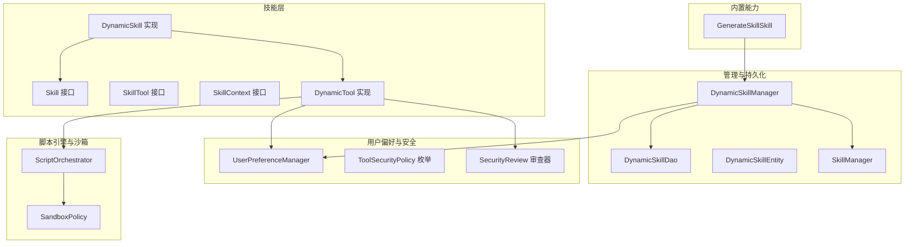
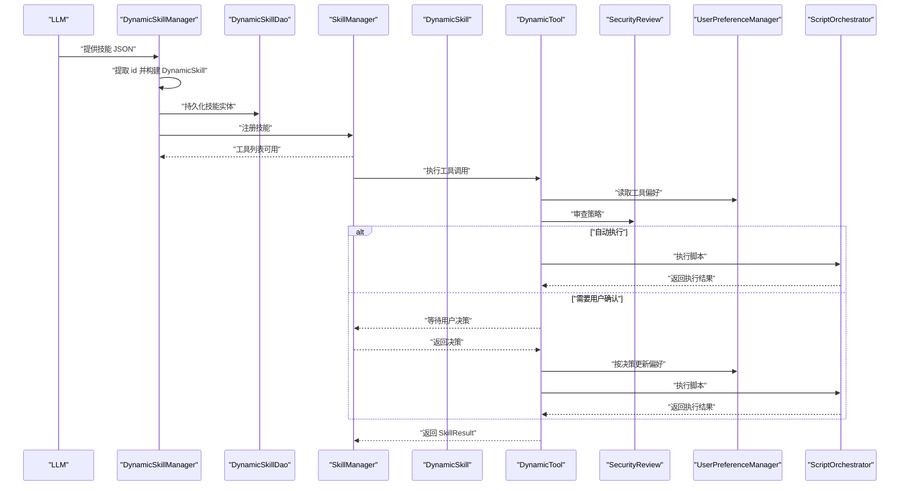
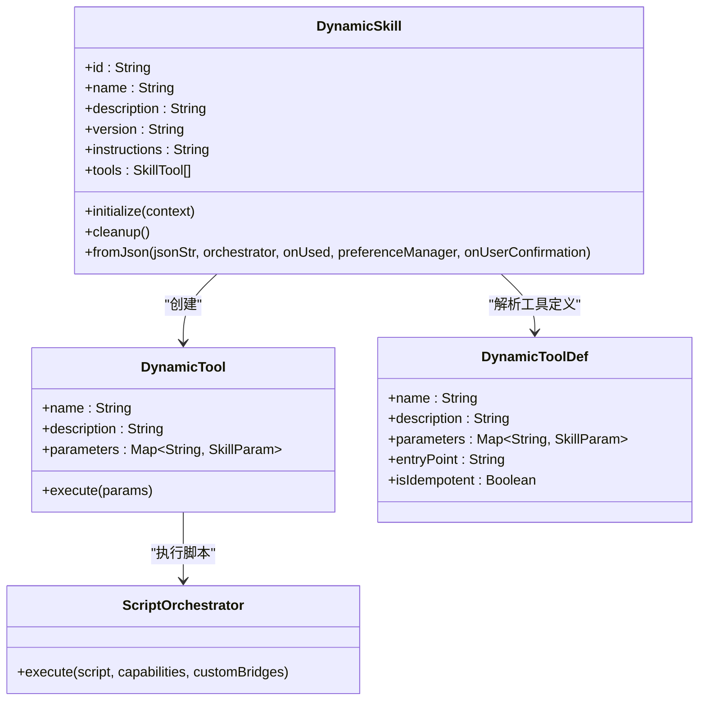
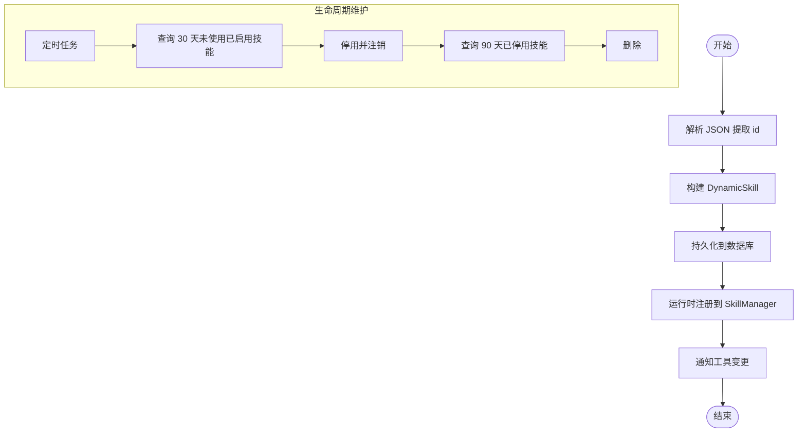
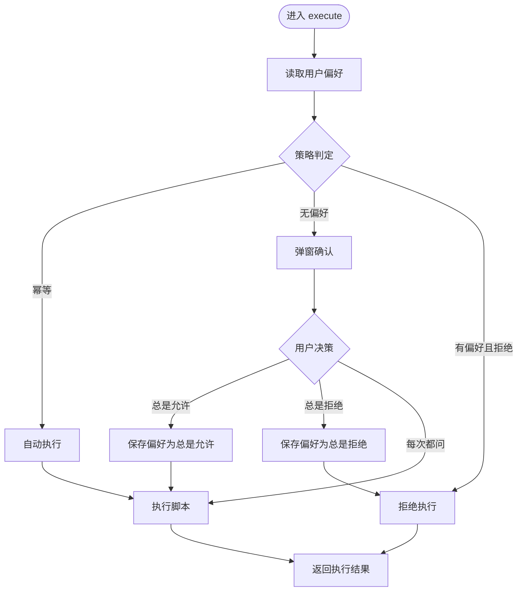
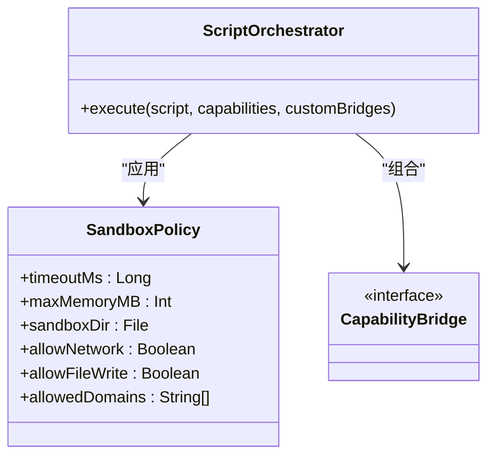
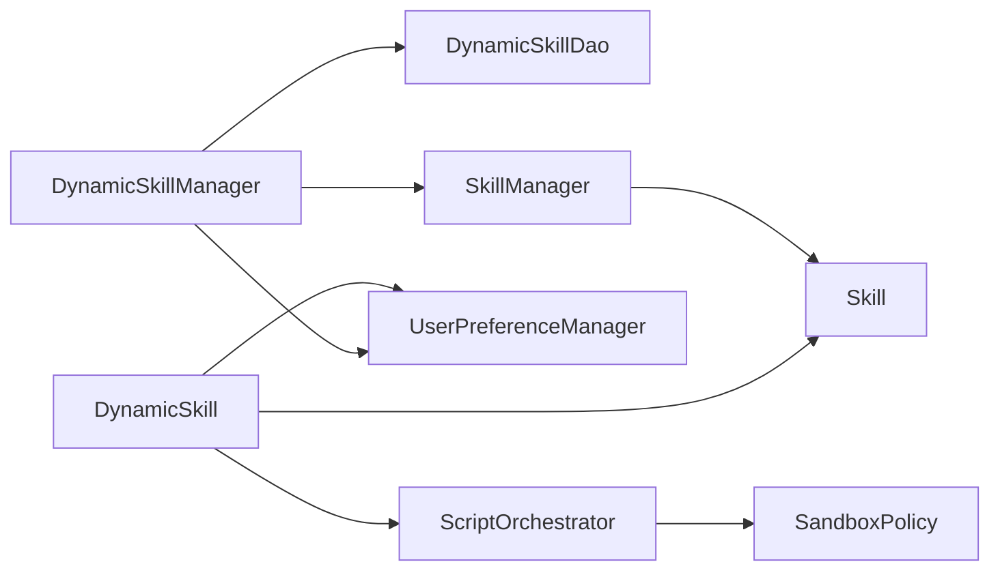

# 动态技能扩展机制

<cite>
**本文引用的文件**
- [DynamicSkill.kt](file://app/src/main/java/ai/openclaw/android/skill/DynamicSkill.kt)
- [DynamicSkillManager.kt](file://app/src/main/java/ai/openclaw/android/skill/DynamicSkillManager.kt)
- [UserPreferenceManager.kt](file://app/src/main/java/ai/openclaw/android/skill/UserPreferenceManager.kt)
- [ToolSecurityPolicy.kt](file://app/src/main/java/ai/openclaw/android/skill/ToolSecurityPolicy.kt)
- [Skill.kt](file://app/src/main/java/ai/openclaw/android/skill/Skill.kt)
- [SkillTool.kt](file://app/src/main/java/ai/openclaw/android/skill/SkillTool.kt)
- [SkillManager.kt](file://app/src/main/java/ai/openclaw/android/skill/SkillManager.kt)
- [SkillContext.kt](file://app/src/main/java/ai/openclaw/android/skill/SkillContext.kt)
- [DynamicSkillEntity.kt](file://app/src/main/java/ai/openclaw/android/data/model/DynamicSkillEntity.kt)
- [DynamicSkillDao.kt](file://app/src/main/java/ai/openclaw/android/data/local/DynamicSkillDao.kt)
- [ScriptOrchestrator.kt](file://script/src/main/java/ai/openclaw/script/ScriptOrchestrator.kt)
- [SandboxPolicy.kt](file://script/src/main/java/ai/openclaw/script/SandboxPolicy.kt)
- [GenerateSkillSkill.kt](file://app/src/main/java/ai/openclaw/android/skill/builtin/GenerateSkillSkill.kt)
- [DynamicSkillTest.kt](file://app/src/test/java/ai/openclaw/android/skill/DynamicSkillTest.kt)
- [DynamicSkillManagerTest.kt](file://app/src/test/java/ai/openclaw/android/skill/DynamicSkillManagerTest.kt)
</cite>

## 目录
1. [简介](#简介)
2. [项目结构](#项目结构)
3. [核心组件](#核心组件)
4. [架构总览](#架构总览)
5. [详细组件分析](#详细组件分析)
6. [依赖关系分析](#依赖关系分析)
7. [性能考虑](#性能考虑)
8. [故障排查指南](#故障排查指南)
9. [结论](#结论)
10. [附录](#附录)

## 简介
本技术文档围绕动态技能扩展机制展开，系统阐述 DynamicSkill 的设计理念与实现架构，覆盖动态技能的创建流程、注册机制、生命周期管理、用户偏好影响、安全策略与沙箱机制、性能优化建议以及版本与兼容性处理。读者可据此完成从 JSON 到运行时技能的全链路开发与集成。

## 项目结构
动态技能扩展位于应用模块的 skill 包中，并与脚本引擎模块协同工作。关键文件分布如下：
- 技能接口与基础模型：Skill、SkillTool、SkillContext、SkillResult
- 动态技能实现：DynamicSkill、DynamicTool、DynamicToolDef
- 管理与持久化：DynamicSkillManager、DynamicSkillDao、DynamicSkillEntity
- 用户偏好与安全：UserPreferenceManager、ToolSecurityPolicy、SecurityReview
- 脚本执行与沙箱：ScriptOrchestrator、SandboxPolicy
- 内置生成工具：GenerateSkillSkill

图表来源
- [DynamicSkill.kt:1-221](file://app/src/main/java/ai/openclaw/android/skill/DynamicSkill.kt#L1-L221)
- [DynamicSkillManager.kt:1-202](file://app/src/main/java/ai/openclaw/android/skill/DynamicSkillManager.kt#L1-L202)
- [UserPreferenceManager.kt:1-100](file://app/src/main/java/ai/openclaw/android/skill/UserPreferenceManager.kt#L1-L100)
- [ToolSecurityPolicy.kt:1-72](file://app/src/main/java/ai/openclaw/android/skill/ToolSecurityPolicy.kt#L1-L72)
- [Skill.kt:1-13](file://app/src/main/java/ai/openclaw/android/skill/Skill.kt#L1-L13)
- [SkillTool.kt:1-22](file://app/src/main/java/ai/openclaw/android/skill/SkillTool.kt#L1-L22)
- [SkillManager.kt:1-193](file://app/src/main/java/ai/openclaw/android/skill/SkillManager.kt#L1-L193)
- [DynamicSkillEntity.kt:1-22](file://app/src/main/java/ai/openclaw/android/data/model/DynamicSkillEntity.kt#L1-L22)
- [DynamicSkillDao.kt:1-47](file://app/src/main/java/ai/openclaw/android/data/local/DynamicSkillDao.kt#L1-L47)
- [ScriptOrchestrator.kt:1-55](file://script/src/main/java/ai/openclaw/script/ScriptOrchestrator.kt#L1-L55)
- [SandboxPolicy.kt:1-16](file://script/src/main/java/ai/openclaw/script/SandboxPolicy.kt#L1-L16)
- [GenerateSkillSkill.kt:1-27](file://app/src/main/java/ai/openclaw/android/skill/builtin/GenerateSkillSkill.kt#L1-L27)

章节来源
- [DynamicSkill.kt:1-221](file://app/src/main/java/ai/openclaw/android/skill/DynamicSkill.kt#L1-L221)
- [DynamicSkillManager.kt:1-202](file://app/src/main/java/ai/openclaw/android/skill/DynamicSkillManager.kt#L1-L202)
- [SkillManager.kt:1-193](file://app/src/main/java/ai/openclaw/android/skill/SkillManager.kt#L1-L193)

## 核心组件
- DynamicSkill：从 LLM 输出的 JSON 解析并构建技能，内部封装多个 DynamicTool，负责初始化与清理生命周期。
- DynamicTool：将工具调用路由至脚本执行器，执行前进行安全审查与用户确认，执行后返回结果。
- DynamicSkillManager：负责动态技能的注册、加载、启用/停用/删除、使用统计与定时维护。
- UserPreferenceManager：以本地 JSON 文件存储用户对工具的审批偏好，支持查询、设置、清除与批量清空。
- ToolSecurityPolicy/SecurityReview：定义工具安全策略与审查逻辑，结合幂等性与用户偏好决定执行路径。
- ScriptOrchestrator/SandboxPolicy：提供脚本执行入口与沙箱策略，限制超时、内存、网络与文件写入等能力。
- Skill/SkillTool/SkillContext：通用技能抽象与上下文，统一工具调用与权限检查。

章节来源
- [DynamicSkill.kt:22-108](file://app/src/main/java/ai/openclaw/android/skill/DynamicSkill.kt#L22-L108)
- [DynamicSkillManager.kt:22-201](file://app/src/main/java/ai/openclaw/android/skill/DynamicSkillManager.kt#L22-L201)
- [UserPreferenceManager.kt:16-98](file://app/src/main/java/ai/openclaw/android/skill/UserPreferenceManager.kt#L16-L98)
- [ToolSecurityPolicy.kt:6-71](file://app/src/main/java/ai/openclaw/android/skill/ToolSecurityPolicy.kt#L6-L71)
- [ScriptOrchestrator.kt:13-54](file://script/src/main/java/ai/openclaw/script/ScriptOrchestrator.kt#L13-L54)
- [Skill.kt:3-13](file://app/src/main/java/ai/openclaw/android/skill/Skill.kt#L3-L13)
- [SkillTool.kt:3-22](file://app/src/main/java/ai/openclaw/android/skill/SkillTool.kt#L3-L22)

## 架构总览
动态技能从 LLM 生成的 JSON 开始，经由 DynamicSkillManager 注册并持久化，随后在运行时由 SkillManager 统一调度。工具调用时，DynamicTool 通过 SecurityReview 与 UserPreferenceManager 决策是否自动执行或弹窗确认；若允许执行，则委托 ScriptOrchestrator 在沙箱内执行脚本并返回结果。

图表来源
- [DynamicSkillManager.kt:63-96](file://app/src/main/java/ai/openclaw/android/skill/DynamicSkillManager.kt#L63-L96)
- [DynamicSkill.kt:153-193](file://app/src/main/java/ai/openclaw/android/skill/DynamicSkill.kt#L153-L193)
- [ToolSecurityPolicy.kt:53-70](file://app/src/main/java/ai/openclaw/android/skill/ToolSecurityPolicy.kt#L53-L70)
- [UserPreferenceManager.kt:35-52](file://app/src/main/java/ai/openclaw/android/skill/UserPreferenceManager.kt#L35-L52)
- [ScriptOrchestrator.kt:31-39](file://script/src/main/java/ai/openclaw/script/ScriptOrchestrator.kt#L31-L39)

## 详细组件分析

### DynamicSkill 设计与实现
- 设计理念
  - 以 JSON 描述技能元数据与工具定义，通过 fromJson() 构建运行时对象。
  - 工具集合由 DynamicToolDef 列表驱动，每个工具映射到脚本中的入口函数。
  - 生命周期由外部 ScriptOrchestrator 管理，DynamicSkill 仅负责装配与初始化/清理占位。
- 关键点
  - JSON 字段校验与默认值处理（version 默认 1.0.0，instructions 默认空字符串，entryPoint 缺省时回退为工具名）。
  - 工具参数类型与必填项解析，支持 string/number/boolean 及默认值。
  - 构造 DynamicTool 时注入 onUsed 回调以更新 lastUsedAt。

图表来源
- [DynamicSkill.kt:22-108](file://app/src/main/java/ai/openclaw/android/skill/DynamicSkill.kt#L22-L108)
- [DynamicSkill.kt:130-220](file://app/src/main/java/ai/openclaw/android/skill/DynamicSkill.kt#L130-L220)
- [ScriptOrchestrator.kt:31-39](file://script/src/main/java/ai/openclaw/script/ScriptOrchestrator.kt#L31-L39)

章节来源
- [DynamicSkill.kt:48-108](file://app/src/main/java/ai/openclaw/android/skill/DynamicSkill.kt#L48-L108)
- [DynamicSkill.kt:153-220](file://app/src/main/java/ai/openclaw/android/skill/DynamicSkill.kt#L153-L220)

### DynamicSkillManager 管理职责与 API
- 职责
  - 注册：从 JSON 解析、持久化、运行时注册，并触发工具变更通知。
  - 加载：启动时从数据库恢复已启用技能。
  - 生命周期：30 天未使用停用，90 天已停用删除；支持手动启用/停用/删除。
  - 使用统计：记录工具使用时间，维护 lastUsedAt。
  - 维护：定时执行停用与清理任务。
- 关键 API
  - registerFromJson(json)：注册新技能。
  - loadAllSaved()：加载已保存技能。
  - disableUnusedSkills()/purgeDisabledSkills()：停用与清理。
  - enableSkill(id)/disableSkill(id)/removeSkill(id)：手动管理。
  - recordUsage(id)：记录使用。
  - runMaintenance()：执行维护。
  - cleanup()：清理协程作用域。

图表来源
- [DynamicSkillManager.kt:63-96](file://app/src/main/java/ai/openclaw/android/skill/DynamicSkillManager.kt#L63-L96)
- [DynamicSkillManager.kt:122-147](file://app/src/main/java/ai/openclaw/android/skill/DynamicSkillManager.kt#L122-L147)
- [DynamicSkillDao.kt:27-45](file://app/src/main/java/ai/openclaw/android/data/local/DynamicSkillDao.kt#L27-L45)

章节来源
- [DynamicSkillManager.kt:63-193](file://app/src/main/java/ai/openclaw/android/skill/DynamicSkillManager.kt#L63-L193)
- [DynamicSkillDao.kt:8-46](file://app/src/main/java/ai/openclaw/android/data/local/DynamicSkillDao.kt#L8-L46)

### 用户偏好管理与安全策略
- 用户偏好
  - UserPreferenceManager 以 JSON 文件存储 UserApprovalPreference，键为工具完整 ID，值包含决策与最近使用时间戳。
  - 支持查询、设置、清除单个偏好、批量清空与读取全部。
- 安全策略
  - ToolSecurityPolicy：AUTO_EXECUTE（幂等）、ASK_USER（首次或每次询问）、DENY（用户拒绝）。
  - SecurityReview：依据 isIdempotent 与已有偏好决定策略；幂等直接执行，无偏好首次询问，有偏好按决策处理。
- 工具执行流程
  - 若策略为 AUTO_EXECUTE：直接执行脚本。
  - 若策略为 ASK_USER：触发 onUserConfirmation，根据用户决策更新偏好并执行或拒绝。
  - 若策略为 DENY：直接返回拒绝结果。

图表来源
- [ToolSecurityPolicy.kt:53-70](file://app/src/main/java/ai/openclaw/android/skill/ToolSecurityPolicy.kt#L53-L70)
- [UserPreferenceManager.kt:35-52](file://app/src/main/java/ai/openclaw/android/skill/UserPreferenceManager.kt#L35-L52)
- [DynamicSkill.kt:153-193](file://app/src/main/java/ai/openclaw/android/skill/DynamicSkill.kt#L153-L193)

章节来源
- [UserPreferenceManager.kt:16-98](file://app/src/main/java/ai/openclaw/android/skill/UserPreferenceManager.kt#L16-L98)
- [ToolSecurityPolicy.kt:6-71](file://app/src/main/java/ai/openclaw/android/skill/ToolSecurityPolicy.kt#L6-L71)
- [DynamicSkill.kt:153-193](file://app/src/main/java/ai/openclaw/android/skill/DynamicSkill.kt#L153-L193)

### 脚本执行与沙箱机制
- ScriptOrchestrator
  - 负责解析能力列表（fs/http/memory 等），组装桥接器（CapabilityBridge），并应用 SandboxPolicy 执行脚本。
  - 支持自定义桥接器扩展能力。
- SandboxPolicy
  - 限制执行超时、最大内存、沙箱目录、网络与文件写入权限，以及可选域名白名单。
- 能力与桥接
  - 常见能力：fs/file、http/network；可通过 customBridges 注入自定义桥接器。

图表来源
- [ScriptOrchestrator.kt:31-39](file://script/src/main/java/ai/openclaw/script/ScriptOrchestrator.kt#L31-L39)
- [SandboxPolicy.kt:8-15](file://script/src/main/java/ai/openclaw/script/SandboxPolicy.kt#L8-L15)

章节来源
- [ScriptOrchestrator.kt:13-54](file://script/src/main/java/ai/openclaw/script/ScriptOrchestrator.kt#L13-L54)
- [SandboxPolicy.kt:1-16](file://script/src/main/java/ai/openclaw/script/SandboxPolicy.kt#L1-L16)

### 版本管理与兼容性
- 版本字段
  - DynamicSkill 从 JSON 中读取 version，默认 1.0.0；DynamicSkillEntity 同样持久化 version 字段。
- 兼容性建议
  - 工具入口函数名（entryPoint）缺省时回退为工具名，确保向后兼容。
  - 参数类型解析支持 string/number/boolean 及默认值，便于扩展参数类型而不破坏现有工具。

章节来源
- [DynamicSkill.kt:68-81](file://app/src/main/java/ai/openclaw/android/skill/DynamicSkill.kt#L68-L81)
- [DynamicSkillEntity.kt:11-19](file://app/src/main/java/ai/openclaw/android/data/model/DynamicSkillEntity.kt#L11-L19)

### 开发工作流程与示例路径
- 创建 JSON
  - 必备字段：id、name、description、script、tools；可选字段：version、instructions。
  - tools 中每个工具定义：name、description、entryPoint（缺省为 name）、parameters（键值为 SkillParam）。
- 注册与加载
  - 使用 DynamicSkillManager.registerFromJson(json) 完成注册与持久化。
  - 应用启动时调用 loadAllSaved() 恢复技能。
- 工具调用
  - 通过 SkillManager.getAllTools() 获取工具清单，使用 executeTool(fullName, params) 执行。
- 示例参考
  - 测试用例展示了 JSON 字段校验、参数解析与工具数量断言，可作为开发参考路径：
    - [DynamicSkillTest.kt:14-42](file://app/src/test/java/ai/openclaw/android/skill/DynamicSkillTest.kt#L14-L42)
    - [DynamicSkillTest.kt:76-103](file://app/src/test/java/ai/openclaw/android/skill/DynamicSkillTest.kt#L76-L103)
    - [DynamicSkillManagerTest.kt:65-98](file://app/src/test/java/ai/openclaw/android/skill/DynamicSkillManagerTest.kt#L65-L98)

章节来源
- [DynamicSkillTest.kt:14-183](file://app/src/test/java/ai/openclaw/android/skill/DynamicSkillTest.kt#L14-L183)
- [DynamicSkillManagerTest.kt:63-310](file://app/src/test/java/ai/openclaw/android/skill/DynamicSkillManagerTest.kt#L63-L310)

## 依赖关系分析
- 组件耦合
  - DynamicSkill 依赖 ScriptOrchestrator 执行脚本，依赖 UserPreferenceManager 与 onUserConfirmation 进行安全与用户交互。
  - DynamicSkillManager 依赖 SkillManager 注册/注销技能，依赖 DynamicSkillDao 持久化，依赖 UserPreferenceManager 管理偏好。
  - SkillManager 统一调度工具调用并进行权限检查。
- 外部依赖
  - 脚本引擎模块提供 ScriptOrchestrator 与 SandboxPolicy。
  - Room Dao 提供动态技能持久化能力。

图表来源
- [DynamicSkillManager.kt:22-29](file://app/src/main/java/ai/openclaw/android/skill/DynamicSkillManager.kt#L22-L29)
- [DynamicSkill.kt:30-34](file://app/src/main/java/ai/openclaw/android/skill/DynamicSkill.kt#L30-L34)
- [SkillManager.kt:8-11](file://app/src/main/java/ai/openclaw/android/skill/SkillManager.kt#L8-L11)
- [ScriptOrchestrator.kt:13-39](file://script/src/main/java/ai/openclaw/script/ScriptOrchestrator.kt#L13-L39)

章节来源
- [DynamicSkillManager.kt:22-29](file://app/src/main/java/ai/openclaw/android/skill/DynamicSkillManager.kt#L22-L29)
- [SkillManager.kt:8-187](file://app/src/main/java/ai/openclaw/android/skill/SkillManager.kt#L8-L187)

## 性能考虑
- 脚本执行
  - 通过 SandboxPolicy 限制执行超时与内存，避免长时间阻塞与内存泄漏。
  - 仅在必要时启用网络与文件写入能力，降低 IO 成本。
- 技能生命周期
  - 30 天未使用自动停用，减少运行时技能数量；90 天已停用彻底删除，释放存储空间。
- 数据访问
  - 使用 DAO 的异步接口与 Flow，避免主线程阻塞。
- 工具调用
  - 幂等工具可直接执行，减少用户交互开销；非幂等工具按偏好策略控制确认频率。

[本节为通用指导，无需列出章节来源]

## 故障排查指南
- 注册失败
  - 检查 JSON 是否包含 id、name、description、script、tools；缺失字段会抛出异常。
  - 参考：[DynamicSkillManagerTest.kt:76-98](file://app/src/test/java/ai/openclaw/android/skill/DynamicSkillManagerTest.kt#L76-L98)
- 加载失败
  - 数据库中 toolsJson 不合法会导致加载阶段跳过；检查 JSON 格式与字段完整性。
  - 参考：[DynamicSkillManagerTest.kt:132-142](file://app/src/test/java/ai/openclaw/android/skill/DynamicSkillManagerTest.kt#L132-L142)
- 工具执行失败
  - 检查 ScriptOrchestrator 的 capabilities 与 SandboxPolicy 配置是否满足脚本需求。
  - 参考：[ScriptOrchestrator.kt:31-39](file://script/src/main/java/ai/openclaw/script/ScriptOrchestrator.kt#L31-L39)
- 安全策略问题
  - 确认工具 isIdempotent 标记正确；核对 UserPreferenceManager 中的偏好决策。
  - 参考：[ToolSecurityPolicy.kt:53-70](file://app/src/main/java/ai/openclaw/android/skill/ToolSecurityPolicy.kt#L53-L70)

章节来源
- [DynamicSkillManagerTest.kt:76-142](file://app/src/test/java/ai/openclaw/android/skill/DynamicSkillManagerTest.kt#L76-L142)
- [ScriptOrchestrator.kt:31-39](file://script/src/main/java/ai/openclaw/script/ScriptOrchestrator.kt#L31-L39)
- [ToolSecurityPolicy.kt:53-70](file://app/src/main/java/ai/openclaw/android/skill/ToolSecurityPolicy.kt#L53-L70)

## 结论
动态技能扩展机制通过 JSON 驱动、脚本执行与安全策略三者协作，实现了灵活、可控且可维护的技能生态。DynamicSkillManager 提供完善的生命周期与持久化管理，UserPreferenceManager 与 SecurityReview 确保用户可控与安全边界，ScriptOrchestrator 与 SandboxPolicy 保障执行效率与资源约束。配合版本与兼容性设计，开发者可以快速构建与迭代动态技能。

## 附录
- 内置生成工具
  - GenerateSkillSkill 提供 generate_skill 工具，便于 LLM 生成并注册新技能。
  - 参考：[GenerateSkillSkill.kt:10-26](file://app/src/main/java/ai/openclaw/android/skill/builtin/GenerateSkillSkill.kt#L10-L26)

章节来源
- [GenerateSkillSkill.kt:10-26](file://app/src/main/java/ai/openclaw/android/skill/builtin/GenerateSkillSkill.kt#L10-L26)