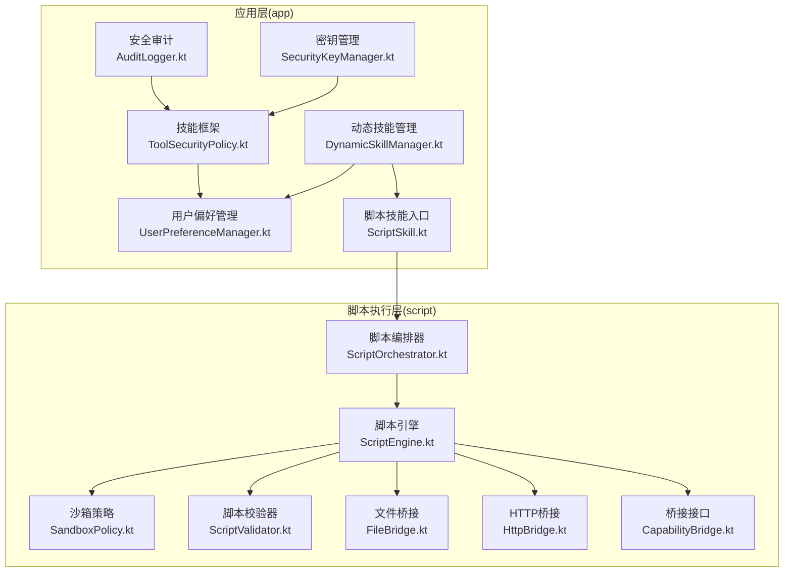
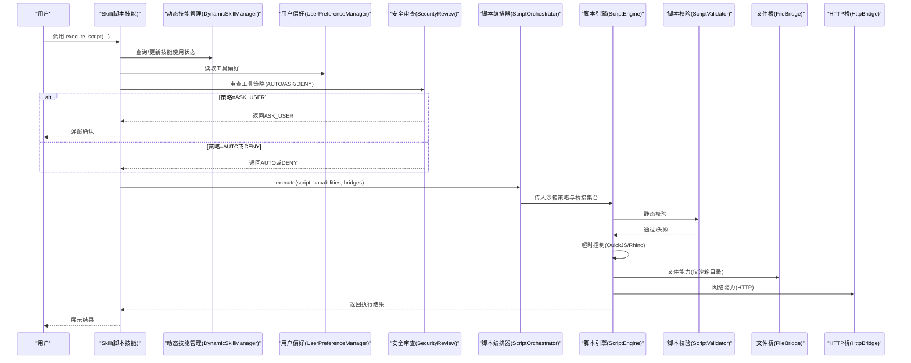
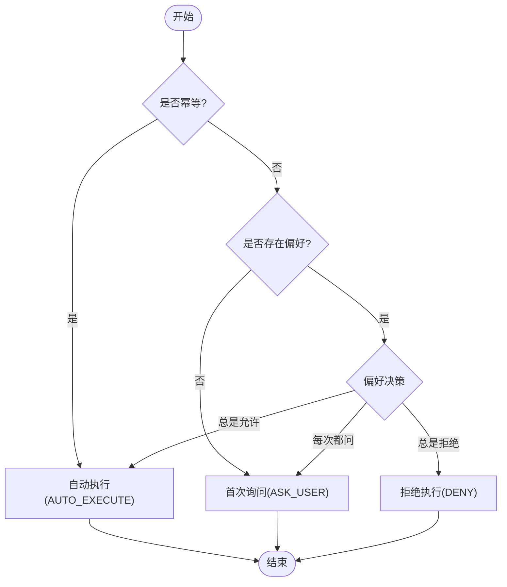
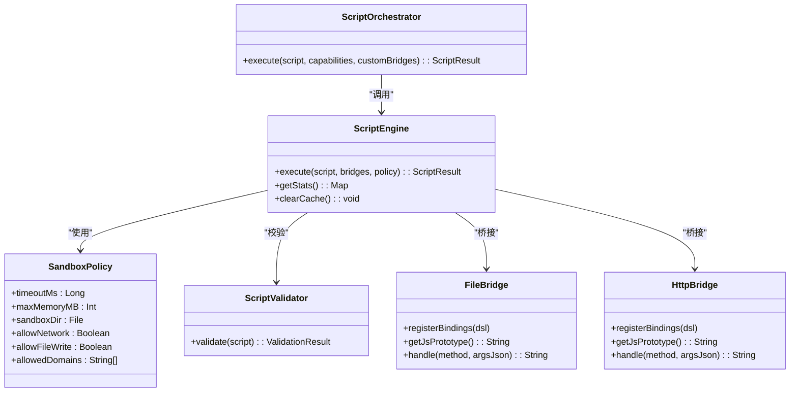
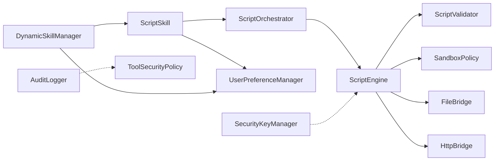

# 技能安全策略

<cite>
**本文引用的文件**
- [ToolSecurityPolicy.kt](file://app/src/main/java/ai/openclaw/android/skill/ToolSecurityPolicy.kt)
- [UserPreferenceManager.kt](file://app/src/main/java/ai/openclaw/android/skill/UserPreferenceManager.kt)
- [DynamicSkillManager.kt](file://app/src/main/java/ai/openclaw/android/skill/DynamicSkillManager.kt)
- [ScriptSkill.kt](file://app/src/main/java/ai/openclaw/android/skill/builtin/ScriptSkill.kt)
- [AuditLogger.kt](file://app/src/main/java/ai/openclaw/android/security/AuditLogger.kt)
- [SecurityKeyManager.kt](file://app/src/main/java/ai/openclaw/android/security/SecurityKeyManager.kt)
- [SandboxPolicy.kt](file://script/src/main/java/ai/openclaw/script/SandboxPolicy.kt)
- [ScriptEngine.kt](file://script/src/main/java/ai/openclaw/script/ScriptEngine.kt)
- [ScriptOrchestrator.kt](file://script/src/main/java/ai/openclaw/script/ScriptOrchestrator.kt)
- [ScriptValidator.kt](file://script/src/main/java/ai/openclaw/script/ScriptValidator.kt)
- [FileBridge.kt](file://script/src/main/java/ai/openclaw/script/bridge/FileBridge.kt)
- [HttpBridge.kt](file://script/src/main/java/ai/openclaw/script/bridge/HttpBridge.kt)
- [CapabilityBridge.kt](file://script/src/main/java/ai/openclaw/script/CapabilityBridge.kt)
- [SecurityReviewTest.kt](file://app/src/test/java/ai/openclaw/android/skill/SecurityReviewTest.kt)
- [SandboxPolicyTest.kt](file://script/src/test/java/ai/openclaw/script/SandboxPolicyTest.kt)
</cite>

## 目录
1. [简介](#简介)
2. [项目结构](#项目结构)
3. [核心组件](#核心组件)
4. [架构总览](#架构总览)
5. [详细组件分析](#详细组件分析)
6. [依赖关系分析](#依赖关系分析)
7. [性能考量](#性能考量)
8. [故障排查指南](#故障排查指南)
9. [结论](#结论)
10. [附录](#附录)

## 简介
本文件面向“技能安全策略”，系统性阐述以下内容：
- ToolSecurityPolicy 的实施机制与安全边界
- 脚本技能的安全限制与沙箱策略
- 技能权限验证与访问控制机制
- 安全配置最佳实践与风险评估方法
- 安全审计与监控的实现指导
- 已知安全漏洞与防护措施
- 安全测试与渗透测试方法论
- 用户授权与隐私保护的实现细节

## 项目结构
围绕技能与脚本执行的安全相关模块主要分布在两个子工程：
- app 模块：技能框架、权限与偏好、审计与密钥管理
- script 模块：脚本引擎、桥接能力、沙箱策略与静态校验

图示来源
- [ToolSecurityPolicy.kt:1-72](file://app/src/main/java/ai/openclaw/android/skill/ToolSecurityPolicy.kt#L1-L72)
- [UserPreferenceManager.kt:1-100](file://app/src/main/java/ai/openclaw/android/skill/UserPreferenceManager.kt#L1-L100)
- [DynamicSkillManager.kt:1-202](file://app/src/main/java/ai/openclaw/android/skill/DynamicSkillManager.kt#L1-L202)
- [ScriptSkill.kt:1-134](file://app/src/main/java/ai/openclaw/android/skill/builtin/ScriptSkill.kt#L1-L134)
- [AuditLogger.kt:1-100](file://app/src/main/java/ai/openclaw/android/security/AuditLogger.kt#L1-L100)
- [SecurityKeyManager.kt:1-69](file://app/src/main/java/ai/openclaw/android/security/SecurityKeyManager.kt#L1-L69)
- [ScriptOrchestrator.kt:1-55](file://script/src/main/java/ai/openclaw/script/ScriptOrchestrator.kt#L1-L55)
- [ScriptEngine.kt:1-231](file://script/src/main/java/ai/openclaw/script/ScriptEngine.kt#L1-L231)
- [SandboxPolicy.kt:1-16](file://script/src/main/java/ai/openclaw/script/SandboxPolicy.kt#L1-L16)
- [ScriptValidator.kt:1-60](file://script/src/main/java/ai/openclaw/script/ScriptValidator.kt#L1-L60)
- [FileBridge.kt:1-157](file://script/src/main/java/ai/openclaw/script/bridge/FileBridge.kt#L1-L157)
- [HttpBridge.kt:1-88](file://script/src/main/java/ai/openclaw/script/bridge/HttpBridge.kt#L1-L88)
- [CapabilityBridge.kt:1-33](file://script/src/main/java/ai/openclaw/script/CapabilityBridge.kt#L1-L33)

章节来源
- [ToolSecurityPolicy.kt:1-72](file://app/src/main/java/ai/openclaw/android/skill/ToolSecurityPolicy.kt#L1-L72)
- [ScriptSkill.kt:1-134](file://app/src/main/java/ai/openclaw/android/skill/builtin/ScriptSkill.kt#L1-L134)
- [ScriptEngine.kt:1-231](file://script/src/main/java/ai/openclaw/script/ScriptEngine.kt#L1-L231)

## 核心组件
- 工具安全策略与权限偏好
  - ToolSecurityPolicy：定义自动执行、询问用户、拒绝执行三种策略
  - UserApprovalPreference：持久化的用户审批偏好（总是允许/总是拒绝/每次都问）
  - SecurityReview：纯逻辑的安全审查器，依据幂等性与偏好决定策略
  - UserPreferenceManager：以本地 JSON 文件存储偏好，支持增删改查与全量导出
- 脚本技能与沙箱执行
  - ScriptSkill：提供 execute_script 工具，声明能力与限制
  - ScriptOrchestrator：组装桥接能力与沙箱策略，统一执行入口
  - ScriptEngine：基于 QuickJS/Rhino 的执行引擎，内置超时与缓存统计
  - SandboxPolicy：超时、内存、网络/文件写入开关、域名白名单等沙箱参数
  - ScriptValidator：静态校验，阻断模块加载、定时器、原型污染、系统对象与平台访问等危险模式
  - FileBridge/HttpBridge：受限能力桥接，文件操作仅限沙箱目录，HTTP请求受OkHttp客户端限制
- 安全审计与密钥管理
  - AuditLogger：内存操作审计日志，链式哈希校验完整性
  - SecurityKeyManager：基于 Android Keystore 的加密密钥管理，用于数据库加密

章节来源
- [ToolSecurityPolicy.kt:1-72](file://app/src/main/java/ai/openclaw/android/skill/ToolSecurityPolicy.kt#L1-L72)
- [UserPreferenceManager.kt:1-100](file://app/src/main/java/ai/openclaw/android/skill/UserPreferenceManager.kt#L1-L100)
- [ScriptSkill.kt:1-134](file://app/src/main/java/ai/openclaw/android/skill/builtin/ScriptSkill.kt#L1-L134)
- [ScriptOrchestrator.kt:1-55](file://script/src/main/java/ai/openclaw/script/ScriptOrchestrator.kt#L1-L55)
- [ScriptEngine.kt:1-231](file://script/src/main/java/ai/openclaw/script/ScriptEngine.kt#L1-L231)
- [SandboxPolicy.kt:1-16](file://script/src/main/java/ai/openclaw/script/SandboxPolicy.kt#L1-L16)
- [ScriptValidator.kt:1-60](file://script/src/main/java/ai/openclaw/script/ScriptValidator.kt#L1-L60)
- [FileBridge.kt:1-157](file://script/src/main/java/ai/openclaw/script/bridge/FileBridge.kt#L1-L157)
- [HttpBridge.kt:1-88](file://script/src/main/java/ai/openclaw/script/bridge/HttpBridge.kt#L1-L88)
- [AuditLogger.kt:1-100](file://app/src/main/java/ai/openclaw/android/security/AuditLogger.kt#L1-L100)
- [SecurityKeyManager.kt:1-69](file://app/src/main/java/ai/openclaw/android/security/SecurityKeyManager.kt#L1-L69)

## 架构总览
下图展示从技能调用到脚本执行、再到能力桥接与沙箱控制的端到端流程。

图示来源
- [ScriptSkill.kt:64-87](file://app/src/main/java/ai/openclaw/android/skill/builtin/ScriptSkill.kt#L64-L87)
- [DynamicSkillManager.kt:63-96](file://app/src/main/java/ai/openclaw/android/skill/DynamicSkillManager.kt#L63-L96)
- [ToolSecurityPolicy.kt:44-71](file://app/src/main/java/ai/openclaw/android/skill/ToolSecurityPolicy.kt#L44-L71)
- [ScriptOrchestrator.kt:31-39](file://script/src/main/java/ai/openclaw/script/ScriptOrchestrator.kt#L31-L39)
- [ScriptEngine.kt:45-99](file://script/src/main/java/ai/openclaw/script/ScriptEngine.kt#L45-L99)
- [ScriptValidator.kt:42-58](file://script/src/main/java/ai/openclaw/script/ScriptValidator.kt#L42-L58)
- [FileBridge.kt:68-119](file://script/src/main/java/ai/openclaw/script/bridge/FileBridge.kt#L68-L119)
- [HttpBridge.kt:54-86](file://script/src/main/java/ai/openclaw/script/bridge/HttpBridge.kt#L54-L86)

## 详细组件分析

### 工具安全策略与权限验证
- 策略判定规则
  - 幂等操作：直接自动执行
  - 首次非幂等：询问用户
  - 已有偏好：按偏好执行（总是允许/总是拒绝/每次都问）
- 权限偏好持久化
  - 采用 JSON 文件存储，键为工具ID，值为用户决策与最后使用时间戳
  - 支持查询、设置、清除与全量导出，异常时回退为空集
- 动态技能生命周期与权限
  - 30天未使用停用，90天已停用删除；删除时同步清理偏好
  - 启动时加载已启用技能，保持工具列表一致性

图示来源
- [ToolSecurityPolicy.kt:53-70](file://app/src/main/java/ai/openclaw/android/skill/ToolSecurityPolicy.kt#L53-L70)
- [UserPreferenceManager.kt:35-52](file://app/src/main/java/ai/openclaw/android/skill/UserPreferenceManager.kt#L35-L52)
- [DynamicSkillManager.kt:122-147](file://app/src/main/java/ai/openclaw/android/skill/DynamicSkillManager.kt#L122-L147)

章节来源
- [ToolSecurityPolicy.kt:1-72](file://app/src/main/java/ai/openclaw/android/skill/ToolSecurityPolicy.kt#L1-L72)
- [UserPreferenceManager.kt:1-100](file://app/src/main/java/ai/openclaw/android/skill/UserPreferenceManager.kt#L1-L100)
- [DynamicSkillManager.kt:1-202](file://app/src/main/java/ai/openclaw/android/skill/DynamicSkillManager.kt#L1-L202)

### 脚本技能与沙箱策略
- 能力与限制
  - 能力：fs(文件)、http(网络)、memory(记忆桥接)
  - 限制：禁用 import/require/eval/new Function、禁止访问 java/android/process/global/window/document 等
  - 超时：默认10秒；大小：最大50KB
- 沙箱参数
  - 超时、内存上限、沙箱目录、网络开关、文件写入开关、域名白名单
- 执行路径
  - 编排器根据能力列表选择桥接器，构建沙箱策略后交由引擎执行
  - 引擎先进行静态校验，再在超时约束下运行 QuickJS 或降级 Rhino
  - 文件桥接严格限制在沙箱目录内，防止路径穿越；HTTP桥接使用 OkHttp 客户端并设置连接/读取超时

图示来源
- [SandboxPolicy.kt:8-15](file://script/src/main/java/ai/openclaw/script/SandboxPolicy.kt#L8-L15)
- [ScriptValidator.kt:42-58](file://script/src/main/java/ai/openclaw/script/ScriptValidator.kt#L42-L58)
- [ScriptEngine.kt:45-99](file://script/src/main/java/ai/openclaw/script/ScriptEngine.kt#L45-L99)
- [ScriptOrchestrator.kt:31-39](file://script/src/main/java/ai/openclaw/script/ScriptOrchestrator.kt#L31-L39)
- [FileBridge.kt:20-80](file://script/src/main/java/ai/openclaw/script/bridge/FileBridge.kt#L20-L80)
- [HttpBridge.kt:18-64](file://script/src/main/java/ai/openclaw/script/bridge/HttpBridge.kt#L18-L64)

章节来源
- [ScriptSkill.kt:37-52](file://app/src/main/java/ai/openclaw/android/skill/builtin/ScriptSkill.kt#L37-L52)
- [ScriptOrchestrator.kt:1-55](file://script/src/main/java/ai/openclaw/script/ScriptOrchestrator.kt#L1-L55)
- [ScriptEngine.kt:1-231](file://script/src/main/java/ai/openclaw/script/ScriptEngine.kt#L1-L231)
- [SandboxPolicy.kt:1-16](file://script/src/main/java/ai/openclaw/script/SandboxPolicy.kt#L1-L16)
- [ScriptValidator.kt:1-60](file://script/src/main/java/ai/openclaw/script/ScriptValidator.kt#L1-L60)
- [FileBridge.kt:1-157](file://script/src/main/java/ai/openclaw/script/bridge/FileBridge.kt#L1-L157)
- [HttpBridge.kt:1-88](file://script/src/main/java/ai/openclaw/script/bridge/HttpBridge.kt#L1-L88)

### 访问控制与能力桥接
- 能力桥接接口
  - CapabilityBridge：定义桥接命名、JS原型与方法分发
- 文件能力
  - 仅允许在沙箱目录内读写/列举/存在性检查，路径解析严格限制，防止越权
- 网络能力
  - 通过 OkHttp 客户端发起 GET/POST 请求，设置连接与读取超时，避免长时间阻塞
- 记忆能力
  - 通过自定义桥接将记忆检索与存储暴露给脚本，参数经JSON解析与转义，异常时返回结构化错误

章节来源
- [CapabilityBridge.kt:1-33](file://script/src/main/java/ai/openclaw/script/CapabilityBridge.kt#L1-L33)
- [FileBridge.kt:82-119](file://script/src/main/java/ai/openclaw/script/bridge/FileBridge.kt#L82-L119)
- [HttpBridge.kt:66-86](file://script/src/main/java/ai/openclaw/script/bridge/HttpBridge.kt#L66-L86)
- [ScriptSkill.kt:89-131](file://app/src/main/java/ai/openclaw/android/skill/builtin/ScriptSkill.kt#L89-L131)

### 安全审计与监控
- 审计日志
  - 记录操作类型、目标ID、详情与前一哈希，形成链式哈希，支持完整性校验与导出
  - 日志条目上限控制，确保资源占用可控
- 密钥管理
  - 基于 Android Keystore 的 MasterKey，结合 EncryptedSharedPreferences 存储数据库加密密钥
  - 生成256位AES密钥并Base64编码存储，后续启动读取复用

章节来源
- [AuditLogger.kt:16-99](file://app/src/main/java/ai/openclaw/android/security/AuditLogger.kt#L16-L99)
- [SecurityKeyManager.kt:23-68](file://app/src/main/java/ai/openclaw/android/security/SecurityKeyManager.kt#L23-L68)

## 依赖关系分析
- 组件耦合
  - ScriptSkill 依赖 ScriptOrchestrator 与 MemoryManager（可选），通过工具参数传递能力清单
  - ScriptOrchestrator 依赖 ScriptEngine，并根据能力选择桥接器
  - ScriptEngine 依赖 ScriptValidator、SandboxPolicy 与桥接器集合
  - FileBridge/HttpBridge 依赖 OkHttp 与 Android 上下文（文件桥）
  - ToolSecurityPolicy 与 UserPreferenceManager 被 DynamicSkillManager 与 Skill 调用
- 外部依赖
  - QuickJS-kt 与 Rhino（降级）用于脚本执行
  - OkHttp 用于网络请求
  - Android Keystore 与 EncryptedSharedPreferences 用于密钥与偏好存储

图示来源
- [ScriptSkill.kt:19-58](file://app/src/main/java/ai/openclaw/android/skill/builtin/ScriptSkill.kt#L19-L58)
- [ScriptOrchestrator.kt:13-39](file://script/src/main/java/ai/openclaw/script/ScriptOrchestrator.kt#L13-L39)
- [ScriptEngine.kt:22-99](file://script/src/main/java/ai/openclaw/script/ScriptEngine.kt#L22-L99)
- [ScriptValidator.kt:8-58](file://script/src/main/java/ai/openclaw/script/ScriptValidator.kt#L8-L58)
- [FileBridge.kt:20-80](file://script/src/main/java/ai/openclaw/script/bridge/FileBridge.kt#L20-L80)
- [HttpBridge.kt:18-64](file://script/src/main/java/ai/openclaw/script/bridge/HttpBridge.kt#L18-L64)
- [UserPreferenceManager.kt:16-52](file://app/src/main/java/ai/openclaw/android/skill/UserPreferenceManager.kt#L16-L52)
- [DynamicSkillManager.kt:22-47](file://app/src/main/java/ai/openclaw/android/skill/DynamicSkillManager.kt#L22-L47)
- [AuditLogger.kt:16-38](file://app/src/main/java/ai/openclaw/android/security/AuditLogger.kt#L16-L38)
- [SecurityKeyManager.kt:23-44](file://app/src/main/java/ai/openclaw/android/security/SecurityKeyManager.kt#L23-L44)

## 性能考量
- 执行统计
  - ScriptEngine 维护总执行次数、成功/失败计数、平均耗时与缓存大小，便于性能观测
- 缓存策略
  - 基于脚本哈希的编译结果缓存，命中则快速返回，减少重复解析与执行开销
- 超时与隔离
  - 引擎在协程上下文中执行，超时控制保障主线程不阻塞
  - QuickJS/Rhino 双引擎，异常时自动降级，提升鲁棒性
- I/O 限制
  - 文件操作仅限沙箱目录，避免跨分区扫描与写入
  - HTTP请求设置连接/读取超时，防止慢请求拖垮执行线程

章节来源
- [ScriptEngine.kt:104-118](file://script/src/main/java/ai/openclaw/script/ScriptEngine.kt#L104-L118)
- [ScriptEngine.kt:120-142](file://script/src/main/java/ai/openclaw/script/ScriptEngine.kt#L120-L142)
- [ScriptEngine.kt:144-209](file://script/src/main/java/ai/openclaw/script/ScriptEngine.kt#L144-L209)
- [FileBridge.kt:82-119](file://script/src/main/java/ai/openclaw/script/bridge/FileBridge.kt#L82-L119)
- [HttpBridge.kt:40-45](file://script/src/main/java/ai/openclaw/script/bridge/HttpBridge.kt#L40-L45)

## 故障排查指南
- 脚本执行失败
  - 检查静态校验：是否包含被阻断的关键字/正则匹配
  - 检查超时：确认是否超过默认10秒限制
  - 检查能力：确认 capabilities 列表与桥接器是否正确装配
- 文件操作异常
  - 核对路径是否位于沙箱目录内，避免相对路径穿越
  - 检查父目录创建与权限
- 网络请求异常
  - 核对URL合法性与可达性，关注连接/读取超时
- 审计日志问题
  - 使用 verifyChain 校验链式完整性，必要时导出文本排查
- 偏好与权限
  - 检查偏好文件是否存在与格式正确，必要时清空偏好重试

章节来源
- [ScriptValidator.kt:42-58](file://script/src/main/java/ai/openclaw/script/ScriptValidator.kt#L42-L58)
- [ScriptEngine.kt:126-142](file://script/src/main/java/ai/openclaw/script/ScriptEngine.kt#L126-L142)
- [FileBridge.kt:88-119](file://script/src/main/java/ai/openclaw/script/bridge/FileBridge.kt#L88-L119)
- [HttpBridge.kt:66-86](file://script/src/main/java/ai/openclaw/script/bridge/HttpBridge.kt#L66-L86)
- [AuditLogger.kt:69-78](file://app/src/main/java/ai/openclaw/android/security/AuditLogger.kt#L69-L78)
- [UserPreferenceManager.kt:67-93](file://app/src/main/java/ai/openclaw/android/skill/UserPreferenceManager.kt#L67-L93)

## 结论
本安全策略通过“幂等优先自动执行 + 偏好驱动 + 沙箱强约束”的组合，实现了对技能工具的最小授权与可审计。脚本执行层面以静态校验、超时控制、能力桥接与沙箱目录限制为核心防线；应用侧通过审计日志与密钥管理强化完整性与机密性。建议持续完善自动化测试与渗透测试流程，定期评估策略有效性并迭代加固。

## 附录

### 安全配置最佳实践
- 默认最小权限：能力开关默认关闭，按需开启
- 严格的沙箱策略：限制网络与文件写入，限定域名白名单
- 明确的超时与内存上限：避免资源滥用
- 审计与日志：启用链式哈希审计，定期导出核查
- 密钥与偏好：使用系统加密存储，定期轮换密钥

### 风险评估方法
- 威胁建模：识别脚本注入、越权文件访问、慢速HTTP攻击、偏好篡改等威胁
- 控制有效性：验证静态校验覆盖率、沙箱策略执行情况、超时与缓存行为
- 残留风险：对高危能力（如网络）进行白名单与速率限制

### 已知安全漏洞与防护
- 漏洞：脚本中出现 import/require/eval/new Function
  - 防护：静态校验阻断，引擎执行前拦截
- 漏洞：路径穿越导致越权文件访问
  - 防护：文件桥接强制 canonical 化与沙箱目录前缀校验
- 漏洞：长时间阻塞的网络请求
  - 防护：OkHttp 超时配置与引擎超时控制
- 漏洞：审计日志被篡改
  - 防护：链式哈希校验，完整性不可伪造

章节来源
- [ScriptValidator.kt:12-35](file://script/src/main/java/ai/openclaw/script/ScriptValidator.kt#L12-L35)
- [FileBridge.kt:82-86](file://script/src/main/java/ai/openclaw/script/bridge/FileBridge.kt#L82-L86)
- [HttpBridge.kt:40-45](file://script/src/main/java/ai/openclaw/script/bridge/HttpBridge.kt#L40-L45)
- [AuditLogger.kt:69-78](file://app/src/main/java/ai/openclaw/android/security/AuditLogger.kt#L69-L78)

### 安全测试与渗透测试方法论
- 单元测试
  - 安全审查：覆盖幂等/偏好分支，确保策略正确
  - 沙箱策略：验证默认值与自定义值
- 集成测试
  - 脚本执行：构造边界脚本（超长、超时、危险模式）验证拦截
  - 能力桥接：验证文件越权与HTTP访问限制
- 渗透测试
  - 沙箱逃逸：尝试路径穿越、原型污染、系统对象访问
  - 权限绕过：伪造偏好文件、篡改审计日志
  - 性能攻击：慢速HTTP、大体积脚本、无限递归

章节来源
- [SecurityReviewTest.kt:1-48](file://app/src/test/java/ai/openclaw/android/skill/SecurityReviewTest.kt#L1-L48)
- [SandboxPolicyTest.kt:1-23](file://script/src/test/java/ai/openclaw/script/SandboxPolicyTest.kt#L1-L23)
- [ScriptEngine.kt:88-98](file://script/src/main/java/ai/openclaw/script/ScriptEngine.kt#L88-L98)
- [FileBridge.kt:88-119](file://script/src/main/java/ai/openclaw/script/bridge/FileBridge.kt#L88-L119)
- [HttpBridge.kt:66-86](file://script/src/main/java/ai/openclaw/script/bridge/HttpBridge.kt#L66-L86)

### 用户授权与隐私保护
- 授权模型
  - 工具级授权：每个工具独立偏好，支持“总是允许/总是拒绝/每次都问”
  - 动态技能：按30/90天策略自动停用/删除，降低长期风险
- 隐私保护
  - 记忆能力通过桥接暴露，参数JSON化与转义，避免注入
  - 审计日志记录最小必要信息，避免敏感数据泄露
  - 数据库加密密钥由系统Keystore管理，增强静态度保护

章节来源
- [ToolSecurityPolicy.kt:18-39](file://app/src/main/java/ai/openclaw/android/skill/ToolSecurityPolicy.kt#L18-L39)
- [DynamicSkillManager.kt:122-147](file://app/src/main/java/ai/openclaw/android/skill/DynamicSkillManager.kt#L122-L147)
- [ScriptSkill.kt:89-131](file://app/src/main/java/ai/openclaw/android/skill/builtin/ScriptSkill.kt#L89-L131)
- [AuditLogger.kt:42-59](file://app/src/main/java/ai/openclaw/android/security/AuditLogger.kt#L42-L59)
- [SecurityKeyManager.kt:51-67](file://app/src/main/java/ai/openclaw/android/security/SecurityKeyManager.kt#L51-L67)