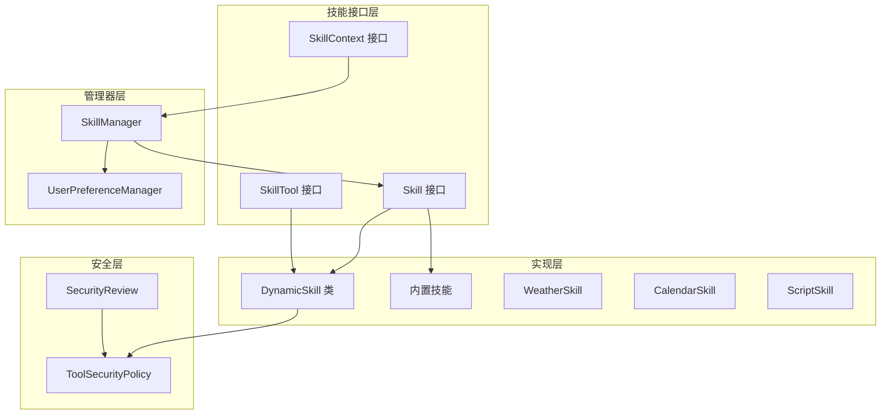
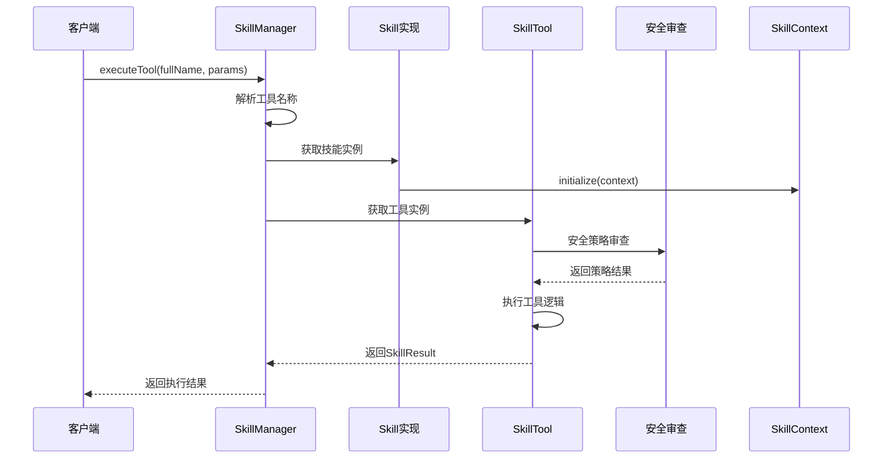
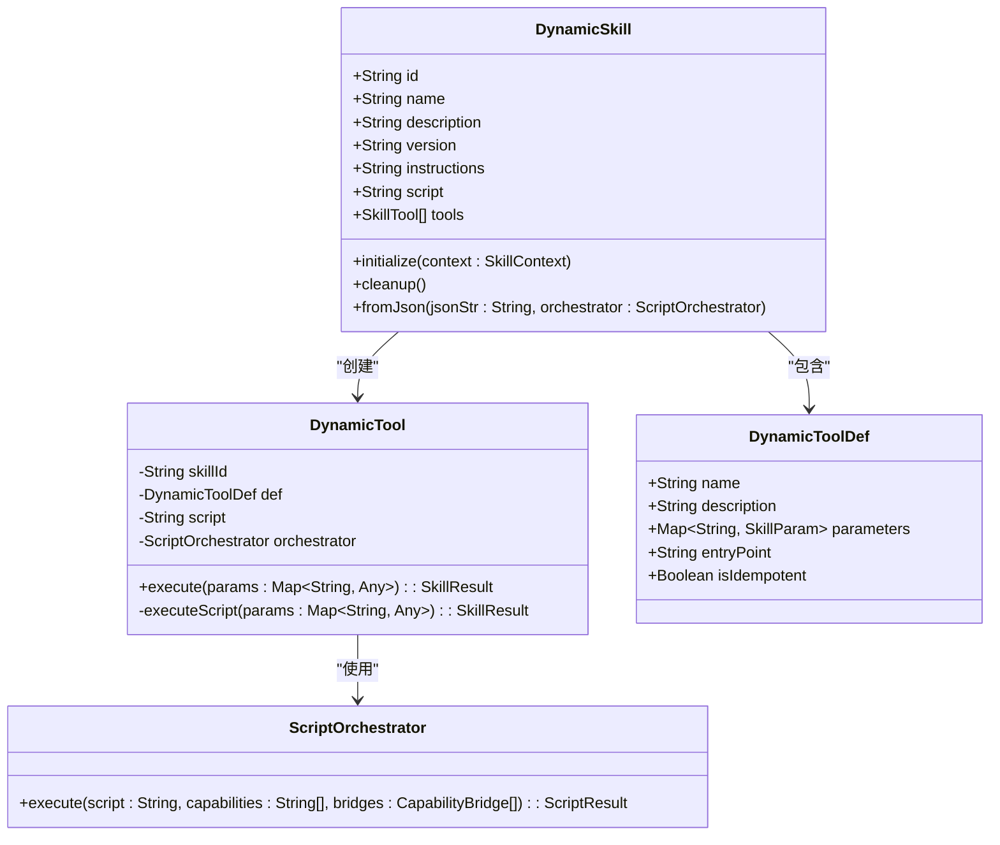
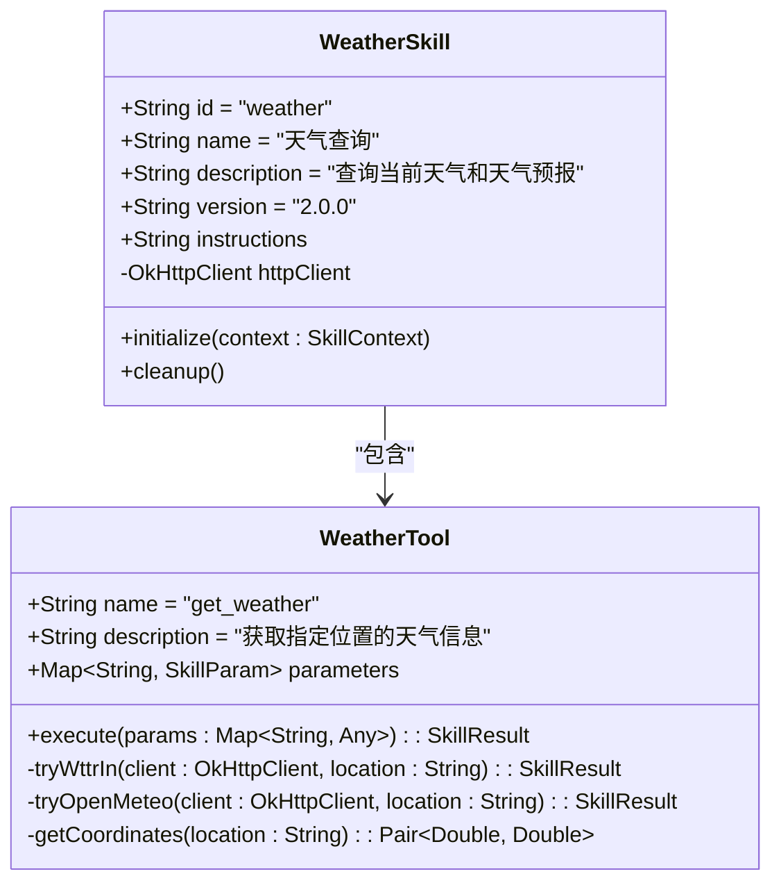
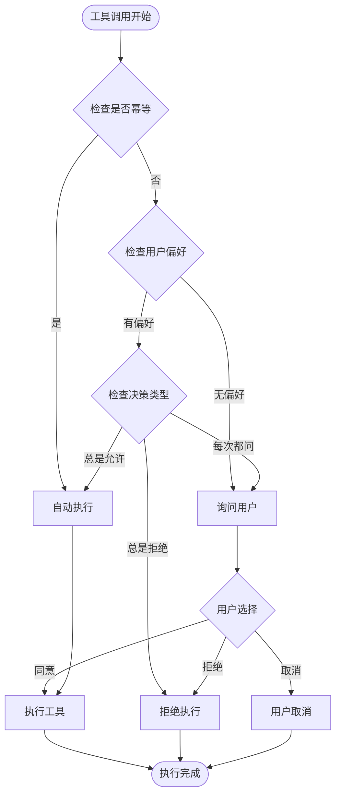
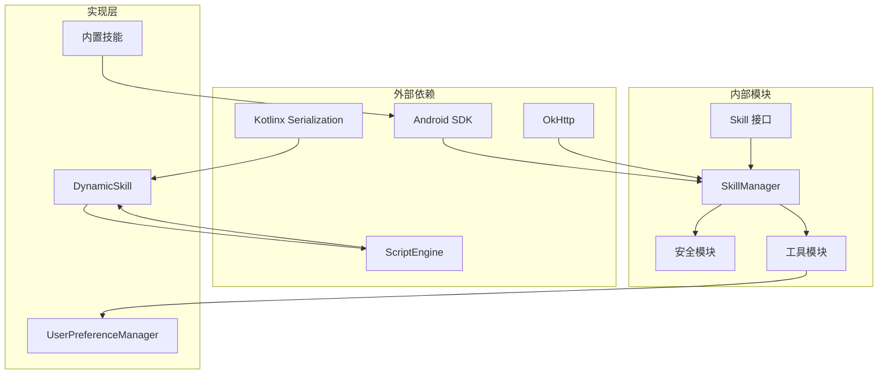

# 技能接口定义

<cite>
**本文档引用的文件**
- [Skill.kt](file://app/src/main/java/ai/openclaw/android/skill/Skill.kt)
- [SkillContext.kt](file://app/src/main/java/ai/openclaw/android/skill/SkillContext.kt)
- [SkillTool.kt](file://app/src/main/java/ai/openclaw/android/skill/SkillTool.kt)
- [DynamicSkill.kt](file://app/src/main/java/ai/openclaw/android/skill/DynamicSkill.kt)
- [SkillManager.kt](file://app/src/main/java/ai/openclaw/android/skill/SkillManager.kt)
- [ToolSecurityPolicy.kt](file://app/src/main/java/ai/openclaw/android/skill/ToolSecurityPolicy.kt)
- [UserPreferenceManager.kt](file://app/src/main/java/ai/openclaw/android/skill/UserPreferenceManager.kt)
- [WeatherSkill.kt](file://app/src/main/java/ai/openclaw/android/skill/builtin/WeatherSkill.kt)
- [CalendarSkill.kt](file://app/src/main/java/ai/openclaw/android/skill/builtin/CalendarSkill.kt)
- [ScriptSkill.kt](file://app/src/main/java/ai/openclaw/android/skill/builtin/ScriptSkill.kt)
- [GenerateSkillSkill.kt](file://app/src/main/java/ai/openclaw/android/skill/builtin/GenerateSkillSkill.kt)
- [SkillManagerTest.kt](file://app/src/test/java/ai/openclaw/android/skill/SkillManagerTest.kt)
</cite>

## 目录
1. [简介](#简介)
2. [项目结构](#项目结构)
3. [核心组件](#核心组件)
4. [架构概览](#架构概览)
5. [详细组件分析](#详细组件分析)
6. [依赖关系分析](#依赖关系分析)
7. [性能考虑](#性能考虑)
8. [故障排除指南](#故障排除指南)
9. [结论](#结论)

## 简介

OpenClaw-Android项目中的技能系统是一个高度模块化的插件架构，允许开发者创建、注册和执行各种功能技能。该系统基于接口驱动的设计，提供了统一的技能抽象和灵活的工具调用机制。

技能系统的核心目标是：
- 提供标准化的技能接口定义
- 支持静态和动态技能实现
- 实现安全的工具调用机制
- 提供完善的生命周期管理
- 支持权限控制和用户偏好管理

## 项目结构

技能系统的文件组织遵循清晰的层次结构：

**图表来源**
- [Skill.kt:1-13](file://app/src/main/java/ai/openclaw/android/skill/Skill.kt#L1-L13)
- [SkillManager.kt:1-193](file://app/src/main/java/ai/openclaw/android/skill/SkillManager.kt#L1-L193)
- [DynamicSkill.kt:1-221](file://app/src/main/java/ai/openclaw/android/skill/DynamicSkill.kt#L1-L221)

**章节来源**
- [Skill.kt:1-13](file://app/src/main/java/ai/openclaw/android/skill/Skill.kt#L1-L13)
- [SkillContext.kt:1-10](file://app/src/main/java/ai/openclaw/android/skill/SkillContext.kt#L1-L10)
- [SkillTool.kt:1-22](file://app/src/main/java/ai/openclaw/android/skill/SkillTool.kt#L1-L22)

## 核心组件

### Skill 接口

Skill接口是整个技能系统的核心抽象，定义了技能的基本属性和行为规范。

**核心属性定义**：

| 属性名 | 类型 | 必填 | 描述 | 约束条件 |
|--------|------|------|------|----------|
| id | String | 是 | 技能唯一标识符 | 唯一性，不为空，建议使用下划线分隔 |
| name | String | 是 | 技能显示名称 | 人类可读，建议简洁明了 |
| description | String | 是 | 技能功能描述 | 详细说明技能用途和能力 |
| version | String | 是 | 技能版本号 | 遵循语义化版本规范 |
| instructions | String | 是 | 技能使用说明 | Markdown格式，包含使用示例 |
| tools | List<SkillTool> | 是 | 技能提供的工具集合 | 至少包含一个工具 |

**生命周期方法**：

- `initialize(context: SkillContext)`: 初始化技能，建立与外部资源的连接
- `cleanup()`: 清理技能资源，释放占用的内存和连接

**章节来源**
- [Skill.kt:3-12](file://app/src/main/java/ai/openclaw/android/skill/Skill.kt#L3-L12)

### SkillContext 上下文

SkillContext为技能提供运行时环境和资源访问能力：

| 属性名 | 类型 | 描述 | 可用资源 |
|--------|------|------|----------|
| applicationContext | Context | Android应用上下文 | 系统服务、资源访问 |
| httpClient | OkHttpClient | HTTP客户端实例 | 网络请求、API调用 |
| log(message: String) | 函数 | 日志记录方法 | 调试和监控 |

**章节来源**
- [SkillContext.kt:6-10](file://app/src/main/java/ai/openclaw/android/skill/SkillContext.kt#L6-L10)

### SkillTool 工具接口

SkillTool定义了技能的具体功能单元：

| 成员 | 类型 | 描述 | 参数要求 |
|------|------|------|----------|
| name | String | 工具名称 | 唯一性，建议使用动词短语 |
| description | String | 工具功能描述 | 详细说明使用场景 |
| parameters | Map<String, SkillParam> | 工具参数定义 | 键值对形式 |
| execute(params: Map<String, Any>) | suspend | 工具执行方法 | 异步执行，支持挂起 |

**SkillParam 参数定义**：

| 字段 | 类型 | 必填 | 描述 | 默认值 |
|------|------|------|------|--------|
| type | String | 是 | 参数类型 | 必须为 "string" | "number" | "boolean" |
| description | String | 是 | 参数用途说明 | 空字符串 |
| required | Boolean | 是 | 是否必需参数 | false |
| default | Any? | 否 | 默认值 | null |

**SkillResult 结果定义**：

| 字段 | 类型 | 描述 | 使用场景 |
|------|------|------|----------|
| success | Boolean | 执行成功标志 | 判断操作结果 |
| output | String | 执行输出结果 | 用户可见的反馈信息 |
| error | String? | 错误信息 | 失败时的详细说明 |

**章节来源**
- [SkillTool.kt:3-22](file://app/src/main/java/ai/openclaw/android/skill/SkillTool.kt#L3-L22)

## 架构概览

技能系统采用分层架构设计，确保了良好的可扩展性和安全性：

**图表来源**
- [SkillManager.kt:62-83](file://app/src/main/java/ai/openclaw/android/skill/SkillManager.kt#L62-L83)
- [DynamicSkill.kt:153-193](file://app/src/main/java/ai/openclaw/android/skill/DynamicSkill.kt#L153-L193)

**章节来源**
- [SkillManager.kt:1-193](file://app/src/main/java/ai/openclaw/android/skill/SkillManager.kt#L1-L193)

## 详细组件分析

### 动态技能实现

DynamicSkill类实现了从JSON配置动态生成技能的功能：

**图表来源**
- [DynamicSkill.kt:22-109](file://app/src/main/java/ai/openclaw/android/skill/DynamicSkill.kt#L22-L109)
- [DynamicSkill.kt:130-220](file://app/src/main/java/ai/openclaw/android/skill/DynamicSkill.kt#L130-L220)

**章节来源**
- [DynamicSkill.kt:1-221](file://app/src/main/java/ai/openclaw/android/skill/DynamicSkill.kt#L1-L221)

### 内置技能实现

#### 天气技能 (WeatherSkill)

WeatherSkill展示了传统静态技能的实现模式：

**图表来源**
- [WeatherSkill.kt:11-399](file://app/src/main/java/ai/openclaw/android/skill/builtin/WeatherSkill.kt#L11-L399)

**章节来源**
- [WeatherSkill.kt:1-399](file://app/src/main/java/ai/openclaw/android/skill/builtin/WeatherSkill.kt#L1-L399)

#### 日历技能 (CalendarSkill)

CalendarSkill演示了需要系统权限的技能实现：

**权限需求**：
- READ_CALENDAR: 读取日历事件
- WRITE_CALENDAR: 添加和修改日历事件

**工具实现**：
- `list_events`: 列出未来指定天数的日历事件
- `add_event`: 添加新的日历事件

**章节来源**
- [CalendarSkill.kt:13-182](file://app/src/main/java/ai/openclaw/android/skill/builtin/CalendarSkill.kt#L13-L182)

#### 脚本引擎技能 (ScriptSkill)

ScriptSkill展示了动态脚本执行能力：

**可用能力**：
- fs: 文件系统操作
- http: HTTP网络请求  
- memory: 记忆管理集成

**章节来源**
- [ScriptSkill.kt:19-134](file://app/src/main/java/ai/openclaw/android/skill/builtin/ScriptSkill.kt#L19-L134)

### 安全策略系统

技能系统实现了多层次的安全保护机制：

**图表来源**
- [ToolSecurityPolicy.kt:44-71](file://app/src/main/java/ai/openclaw/android/skill/ToolSecurityPolicy.kt#L44-L71)

**章节来源**
- [ToolSecurityPolicy.kt:1-72](file://app/src/main/java/ai/openclaw/android/skill/ToolSecurityPolicy.kt#L1-L72)

## 依赖关系分析

技能系统的依赖关系体现了清晰的分层设计：

**图表来源**
- [SkillManager.kt:1-193](file://app/src/main/java/ai/openclaw/android/skill/SkillManager.kt#L1-L193)
- [DynamicSkill.kt:1-221](file://app/src/main/java/ai/openclaw/android/skill/DynamicSkill.kt#L1-L221)

**章节来源**
- [SkillManager.kt:1-193](file://app/src/main/java/ai/openclaw/android/skill/SkillManager.kt#L1-L193)

## 性能考虑

技能系统在设计时充分考虑了性能优化：

### 内存管理
- 使用懒加载策略，按需初始化技能
- 实现资源清理机制，防止内存泄漏
- 采用对象池模式管理HTTP连接

### 执行效率
- 工具调用采用协程异步执行
- 缓存常用资源，减少重复创建
- 实现工具调用统计和性能监控

### 网络优化
- 复用HTTP客户端实例
- 实现请求超时和重试机制
- 支持连接池复用

## 故障排除指南

### 常见问题及解决方案

**技能加载失败**
- 检查技能ID唯一性
- 验证initialize()方法实现
- 确认权限配置正确

**工具调用异常**
- 检查参数类型匹配
- 验证必填参数完整性
- 查看日志输出定位问题

**权限相关错误**
- 确认Android权限声明
- 检查运行时权限申请
- 验证权限检查逻辑

**安全策略问题**
- 检查用户偏好设置
- 验证工具幂等性标记
- 确认安全策略配置

**章节来源**
- [SkillManagerTest.kt:176-222](file://app/src/test/java/ai/openclaw/android/skill/SkillManagerTest.kt#L176-L222)

## 结论

OpenClaw-Android的技能接口系统提供了一个强大而灵活的插件架构，具有以下特点：

**优势特性**：
- 标准化的接口设计，易于扩展
- 完善的安全机制，保障系统稳定
- 灵活的工具调用模型，支持复杂业务逻辑
- 清晰的生命周期管理，便于资源控制

**最佳实践建议**：
- 严格遵守接口规范，确保兼容性
- 实现完善的错误处理和日志记录
- 合理设计工具参数，提升用户体验
- 建立完整的测试覆盖，保证质量

该系统为构建智能代理应用提供了坚实的技术基础，支持从简单工具到复杂业务场景的各种需求。