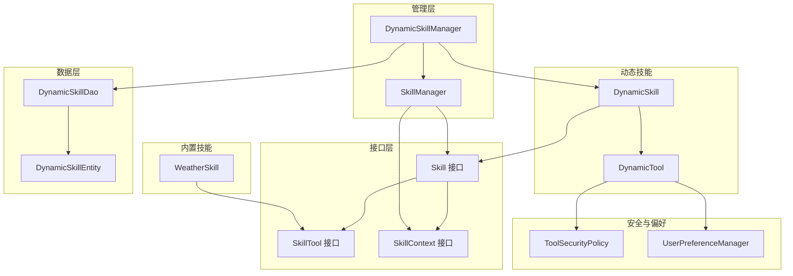
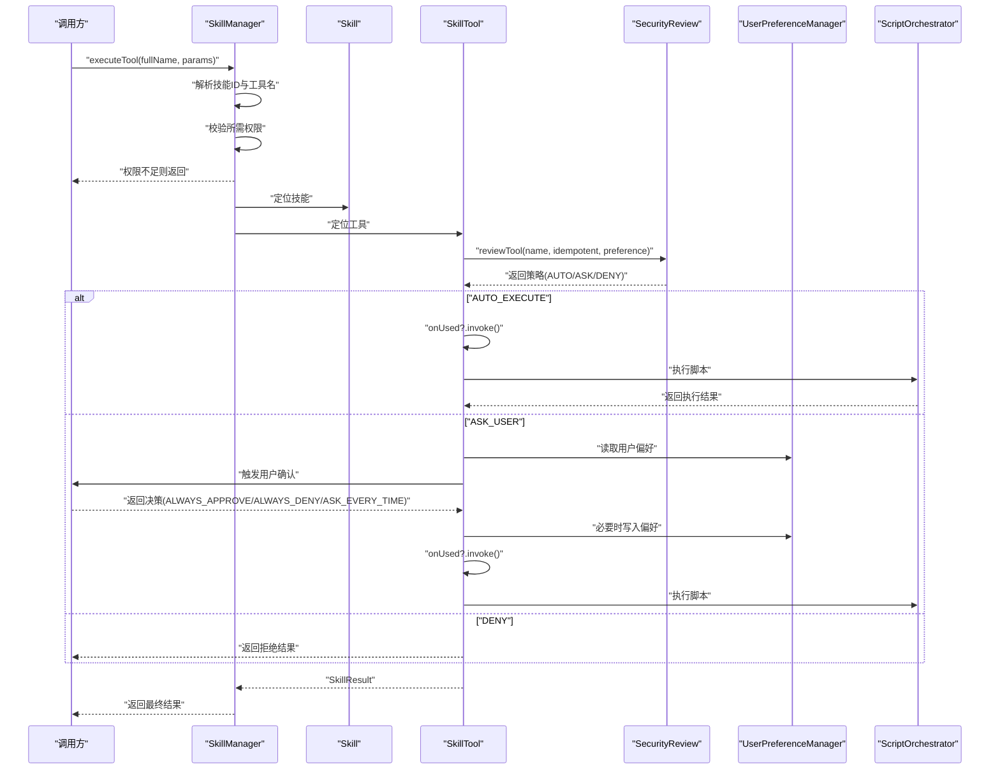
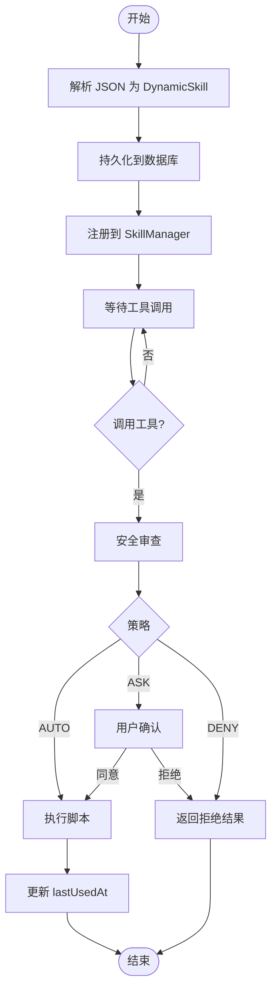
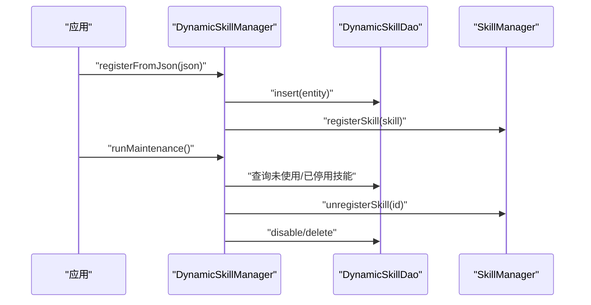
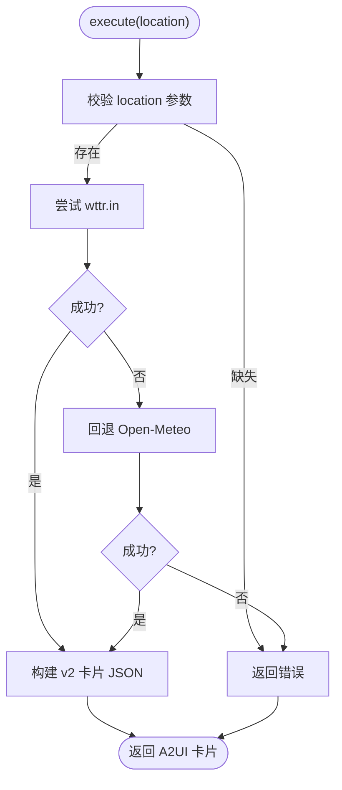
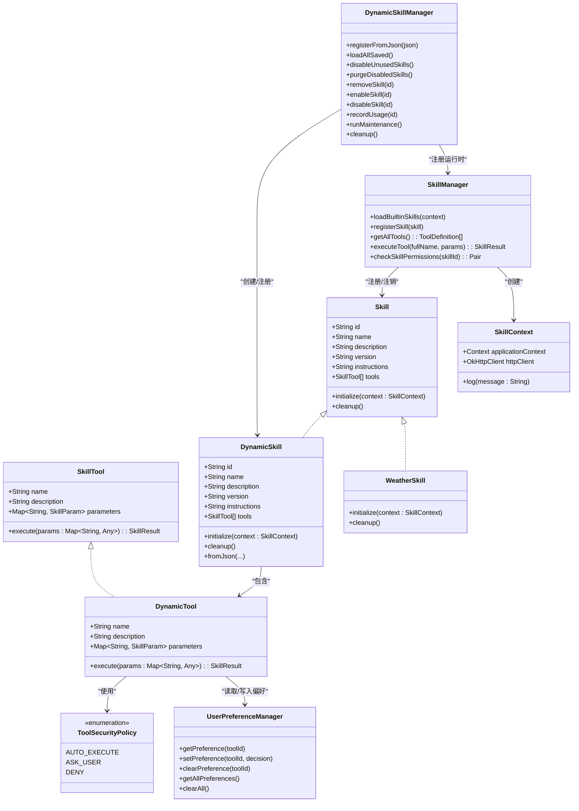
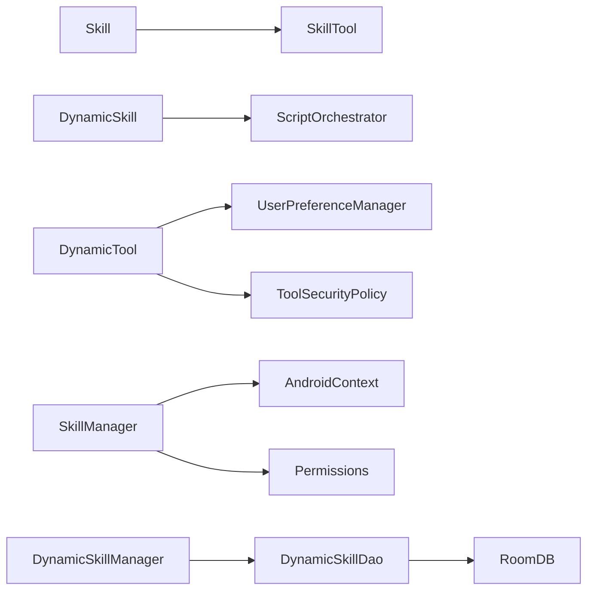

# 技能接口规范

<cite>
**本文引用的文件**
- [Skill.kt](file://app/src/main/java/ai/openclaw/android/skill/Skill.kt)
- [SkillContext.kt](file://app/src/main/java/ai/openclaw/android/skill/SkillContext.kt)
- [SkillTool.kt](file://app/src/main/java/ai/openclaw/android/skill/SkillTool.kt)
- [DynamicSkill.kt](file://app/src/main/java/ai/openclaw/android/skill/DynamicSkill.kt)
- [DynamicSkillManager.kt](file://app/src/main/java/ai/openclaw/android/skill/DynamicSkillManager.kt)
- [SkillManager.kt](file://app/src/main/java/ai/openclaw/android/skill/SkillManager.kt)
- [ToolSecurityPolicy.kt](file://app/src/main/java/ai/openclaw/android/skill/ToolSecurityPolicy.kt)
- [UserPreferenceManager.kt](file://app/src/main/java/ai/openclaw/android/skill/UserPreferenceManager.kt)
- [WeatherSkill.kt](file://app/src/main/java/ai/openclaw/android/skill/builtin/WeatherSkill.kt)
- [GenerateSkillSkill.kt](file://app/src/main/java/ai/openclaw/android/skill/builtin/GenerateSkillSkill.kt)
- [GenerateSkillTool.kt](file://app/src/main/java/ai/openclaw/android/skill/builtin/GenerateSkillTool.kt)
- [DynamicSkillEntity.kt](file://app/src/main/java/ai/openclaw/android/data/model/DynamicSkillEntity.kt)
- [DynamicSkillDao.kt](file://app/src/main/java/ai/openclaw/android/data/local/DynamicSkillDao.kt)
- [DynamicSkillTest.kt](file://app/src/test/java/ai/openclaw/android/skill/DynamicSkillTest.kt)
- [SkillManagerTest.kt](file://app/src/test/java/ai/openclaw/android/skill/SkillManagerTest.kt)
</cite>

## 目录
1. [简介](#简介)
2. [项目结构](#项目结构)
3. [核心组件](#核心组件)
4. [架构总览](#架构总览)
5. [详细组件分析](#详细组件分析)
6. [依赖关系分析](#依赖关系分析)
7. [性能考量](#性能考量)
8. [故障排查指南](#故障排查指南)
9. [结论](#结论)
10. [附录](#附录)

## 简介
本文件为 Skill 接口的全面 API 参考与实现指南，覆盖以下主题：
- Skill 接口的方法签名、参数与返回值
- execute()、validate()、getDescription() 等核心方法的实现要求
- SkillContext 参数的作用与使用方式
- DynamicSkill 的扩展机制与动态技能创建流程
- 技能注册、权限管理与生命周期管理
- 内置技能实现参考与自定义技能开发指导
- 最佳实践与常见问题排查

## 项目结构
技能系统位于 app 模块的 ai.openclaw.android.skill 包下，采用“接口 + 实现 + 管理器”的分层设计：
- 接口层：Skill、SkillTool、SkillContext
- 实现层：内置技能（如 WeatherSkill）、动态技能（DynamicSkill）
- 管理层：SkillManager（内置技能注册与执行）、DynamicSkillManager（动态技能注册、持久化、生命周期）
- 安全与偏好：ToolSecurityPolicy、UserPreferenceManager
- 数据模型与 DAO：DynamicSkillEntity、DynamicSkillDao

图表来源
- [Skill.kt:1-13](file://app/src/main/java/ai/openclaw/android/skill/Skill.kt#L1-L13)
- [SkillTool.kt:1-22](file://app/src/main/java/ai/openclaw/android/skill/SkillTool.kt#L1-L22)
- [SkillContext.kt:1-10](file://app/src/main/java/ai/openclaw/android/skill/SkillContext.kt#L1-L10)
- [WeatherSkill.kt:1-399](file://app/src/main/java/ai/openclaw/android/skill/builtin/WeatherSkill.kt#L1-L399)
- [DynamicSkill.kt:1-221](file://app/src/main/java/ai/openclaw/android/skill/DynamicSkill.kt#L1-L221)
- [DynamicSkillManager.kt:1-202](file://app/src/main/java/ai/openclaw/android/skill/DynamicSkillManager.kt#L1-L202)
- [SkillManager.kt:1-193](file://app/src/main/java/ai/openclaw/android/skill/SkillManager.kt#L1-L193)
- [ToolSecurityPolicy.kt:1-72](file://app/src/main/java/ai/openclaw/android/skill/ToolSecurityPolicy.kt#L1-L72)
- [UserPreferenceManager.kt:1-100](file://app/src/main/java/ai/openclaw/android/skill/UserPreferenceManager.kt#L1-L100)
- [DynamicSkillEntity.kt:1-22](file://app/src/main/java/ai/openclaw/android/data/model/DynamicSkillEntity.kt#L1-L22)
- [DynamicSkillDao.kt:1-47](file://app/src/main/java/ai/openclaw/android/data/local/DynamicSkillDao.kt#L1-L47)

章节来源
- [Skill.kt:1-13](file://app/src/main/java/ai/openclaw/android/skill/Skill.kt#L1-L13)
- [SkillTool.kt:1-22](file://app/src/main/java/ai/openclaw/android/skill/SkillTool.kt#L1-L22)
- [SkillContext.kt:1-10](file://app/src/main/java/ai/openclaw/android/skill/SkillContext.kt#L1-L10)
- [SkillManager.kt:1-193](file://app/src/main/java/ai/openclaw/android/skill/SkillManager.kt#L1-L193)
- [DynamicSkill.kt:1-221](file://app/src/main/java/ai/openclaw/android/skill/DynamicSkill.kt#L1-L221)
- [DynamicSkillManager.kt:1-202](file://app/src/main/java/ai/openclaw/android/skill/DynamicSkillManager.kt#L1-L202)
- [ToolSecurityPolicy.kt:1-72](file://app/src/main/java/ai/openclaw/android/skill/ToolSecurityPolicy.kt#L1-L72)
- [UserPreferenceManager.kt:1-100](file://app/src/main/java/ai/openclaw/android/skill/UserPreferenceManager.kt#L1-L100)
- [WeatherSkill.kt:1-399](file://app/src/main/java/ai/openclaw/android/skill/builtin/WeatherSkill.kt#L1-L399)
- [DynamicSkillEntity.kt:1-22](file://app/src/main/java/ai/openclaw/android/data/model/DynamicSkillEntity.kt#L1-L22)
- [DynamicSkillDao.kt:1-47](file://app/src/main/java/ai/openclaw/android/data/local/DynamicSkillDao.kt#L1-L47)

## 核心组件
本节对 Skill 接口及关键类型进行 API 层面的梳理。

- Skill 接口
  - 字段
    - id: String（技能唯一标识）
    - name: String（显示名称）
    - description: String（技能描述）
    - version: String（版本号）
    - instructions: String（Markdown 格式的使用说明）
    - tools: List<SkillTool>（工具集合）
  - 方法
    - initialize(context: SkillContext): 初始化技能，注入上下文（如 HTTP 客户端、日志等）
    - cleanup(): 销毁资源，释放占用
  - 实现要求
    - initialize 中应完成对外部资源的绑定（如网络客户端），确保后续工具执行可用
    - cleanup 应释放资源，避免内存泄漏

- SkillTool 接口
  - 字段
    - name: String
    - description: String
    - parameters: Map<String, SkillParam>
  - 方法
    - execute(params: Map<String, Any>): SkillResult（异步执行，返回成功/失败、输出或错误信息）
  - 参数与返回值
    - params: 工具期望的键值对参数，类型为 Any（内部会序列化为脚本可用的 JSON）
    - SkillResult: success: Boolean；output: String；error: String?

- SkillContext 接口
  - 字段
    - applicationContext: Context（应用上下文）
    - httpClient: OkHttpClient（网络客户端）
  - 方法
    - log(message: String): 日志输出
  - 使用方式
    - 由 SkillManager 在注册技能时创建匿名实现，并传入 Skill.initialize
    - Skill 实现（如 WeatherSkill）在 initialize 中将 httpClient 注入其内部工具

- SkillParam 与 SkillResult
  - SkillParam: type(String)、description(String)、required(Boolean)、default(Any?)
  - SkillResult: success(Boolean)、output(String)、error(String?)

章节来源
- [Skill.kt:1-13](file://app/src/main/java/ai/openclaw/android/skill/Skill.kt#L1-L13)
- [SkillTool.kt:1-22](file://app/src/main/java/ai/openclaw/android/skill/SkillTool.kt#L1-L22)
- [SkillContext.kt:1-10](file://app/src/main/java/ai/openclaw/android/skill/SkillContext.kt#L1-L10)

## 架构总览
技能系统的控制流与交互如下：

图表来源
- [SkillManager.kt:62-83](file://app/src/main/java/ai/openclaw/android/skill/SkillManager.kt#L62-L83)
- [DynamicSkill.kt:153-193](file://app/src/main/java/ai/openclaw/android/skill/DynamicSkill.kt#L153-L193)
- [ToolSecurityPolicy.kt:44-71](file://app/src/main/java/ai/openclaw/android/skill/ToolSecurityPolicy.kt#L44-L71)
- [UserPreferenceManager.kt:16-100](file://app/src/main/java/ai/openclaw/android/skill/UserPreferenceManager.kt#L16-L100)

## 详细组件分析

### Skill 接口与实现要求
- 方法签名与职责
  - initialize(context: SkillContext): 用于注入外部依赖（如网络客户端），并建立日志通道
  - cleanup(): 释放资源，确保无泄漏
- 参数类型与返回值
  - execute(params: Map<String, Any>): SkillResult
  - validate(): 未在接口中声明，但可在实现中自行扩展以进行输入校验
  - getDescription(): 未在接口中声明，但可通过 description 字段访问

章节来源
- [Skill.kt:1-13](file://app/src/main/java/ai/openclaw/android/skill/Skill.kt#L1-L13)
- [SkillTool.kt:1-22](file://app/src/main/java/ai/openclaw/android/skill/SkillTool.kt#L1-L22)

### SkillContext 使用方式
- 提供的应用上下文与 HTTP 客户端
- 日志接口便于调试与审计
- SkillManager.createSkillContext 会创建匿名实现并注入到 Skill.initialize

章节来源
- [SkillContext.kt:1-10](file://app/src/main/java/ai/openclaw/android/skill/SkillContext.kt#L1-L10)
- [SkillManager.kt:165-173](file://app/src/main/java/ai/openclaw/android/skill/SkillManager.kt#L165-L173)

### DynamicSkill 扩展机制与动态技能创建流程
- JSON 定义字段
  - id、name、description、version、instructions、script、tools[]
- 工具定义字段
  - name、description、parameters（键到 SkillParam）、entryPoint、idempotent
- 创建流程
  - 通过 DynamicSkill.fromJson 从 JSON 解析并构造 DynamicSkill
  - DynamicSkillManager.registerFromJson 持久化并注册到 SkillManager
  - DynamicTool.execute 根据安全策略决定是否执行脚本
- 生命周期管理
  - 30 天未使用停用，90 天已停用删除
  - 支持手动启用/停用/删除

图表来源
- [DynamicSkill.kt:54-108](file://app/src/main/java/ai/openclaw/android/skill/DynamicSkill.kt#L54-L108)
- [DynamicSkillManager.kt:63-96](file://app/src/main/java/ai/openclaw/android/skill/DynamicSkillManager.kt#L63-L96)
- [DynamicSkillManager.kt:122-147](file://app/src/main/java/ai/openclaw/android/skill/DynamicSkillManager.kt#L122-L147)
- [DynamicSkillManager.kt:152-178](file://app/src/main/java/ai/openclaw/android/skill/DynamicSkillManager.kt#L152-L178)

章节来源
- [DynamicSkill.kt:1-221](file://app/src/main/java/ai/openclaw/android/skill/DynamicSkill.kt#L1-L221)
- [DynamicSkillManager.kt:1-202](file://app/src/main/java/ai/openclaw/android/skill/DynamicSkillManager.kt#L1-L202)

### 技能注册、权限管理与生命周期
- 注册
  - SkillManager.registerSkill：初始化并加入内存索引
  - DynamicSkillManager.registerFromJson：持久化 + 注册
- 权限管理
  - SkillManager.checkSkillPermissions：根据技能 ID 查询所需权限并检查
  - 支持的权限映射：日历、位置、联系人、短信
- 生命周期
  - DynamicSkillManager.disableUnusedSkills / purgeDisabledSkills：自动停用/清理
  - 手动启停删：enableSkill/disableSkill/removeSkill

图表来源
- [DynamicSkillManager.kt:63-96](file://app/src/main/java/ai/openclaw/android/skill/DynamicSkillManager.kt#L63-L96)
- [DynamicSkillManager.kt:122-147](file://app/src/main/java/ai/openclaw/android/skill/DynamicSkillManager.kt#L122-L147)
- [DynamicSkillManager.kt:152-178](file://app/src/main/java/ai/openclaw/android/skill/DynamicSkillManager.kt#L152-L178)
- [DynamicSkillDao.kt:1-47](file://app/src/main/java/ai/openclaw/android/data/local/DynamicSkillDao.kt#L1-L47)
- [SkillManager.kt:182-186](file://app/src/main/java/ai/openclaw/android/skill/SkillManager.kt#L182-L186)

章节来源
- [SkillManager.kt:1-193](file://app/src/main/java/ai/openclaw/android/skill/SkillManager.kt#L1-L193)
- [DynamicSkillManager.kt:1-202](file://app/src/main/java/ai/openclaw/android/skill/DynamicSkillManager.kt#L1-L202)
- [DynamicSkillDao.kt:1-47](file://app/src/main/java/ai/openclaw/android/data/local/DynamicSkillDao.kt#L1-L47)

### 内置技能实现参考：WeatherSkill
- 技能元数据：id="weather"，version="2.0.0"，工具：get_weather
- 参数：location（必填，字符串）
- 执行逻辑：优先使用 wttr.in，失败则回退 Open-Meteo
- 输出：A2UI 卡片 JSON（封装天气信息与动作）

图表来源
- [WeatherSkill.kt:89-107](file://app/src/main/java/ai/openclaw/android/skill/builtin/WeatherSkill.kt#L89-L107)
- [WeatherSkill.kt:112-141](file://app/src/main/java/ai/openclaw/android/skill/builtin/WeatherSkill.kt#L112-L141)
- [WeatherSkill.kt:146-198](file://app/src/main/java/ai/openclaw/android/skill/builtin/WeatherSkill.kt#L146-L198)

章节来源
- [WeatherSkill.kt:1-399](file://app/src/main/java/ai/openclaw/android/skill/builtin/WeatherSkill.kt#L1-L399)

### 自定义技能开发指导：GenerateSkillSkill 与 GenerateSkillTool
- GenerateSkillSkill 提供 generate_skill 工具
- GenerateSkillTool 接收 skillJson（完整技能定义 JSON），委托 DynamicSkillManager 注册
- 示例 JSON 字段：id、name、description、version、instructions、script、tools[]
- 工具定义字段：name、description、parameters、entryPoint、idempotent

章节来源
- [GenerateSkillSkill.kt:1-27](file://app/src/main/java/ai/openclaw/android/skill/builtin/GenerateSkillSkill.kt#L1-L27)
- [GenerateSkillTool.kt:1-88](file://app/src/main/java/ai/openclaw/android/skill/builtin/GenerateSkillTool.kt#L1-L88)

### 类关系图（代码级）

图表来源
- [Skill.kt:1-13](file://app/src/main/java/ai/openclaw/android/skill/Skill.kt#L1-L13)
- [SkillTool.kt:1-22](file://app/src/main/java/ai/openclaw/android/skill/SkillTool.kt#L1-L22)
- [SkillContext.kt:1-10](file://app/src/main/java/ai/openclaw/android/skill/SkillContext.kt#L1-L10)
- [DynamicSkill.kt:1-221](file://app/src/main/java/ai/openclaw/android/skill/DynamicSkill.kt#L1-L221)
- [DynamicSkillManager.kt:1-202](file://app/src/main/java/ai/openclaw/android/skill/DynamicSkillManager.kt#L1-L202)
- [SkillManager.kt:1-193](file://app/src/main/java/ai/openclaw/android/skill/SkillManager.kt#L1-L193)
- [ToolSecurityPolicy.kt:1-72](file://app/src/main/java/ai/openclaw/android/skill/ToolSecurityPolicy.kt#L1-L72)
- [UserPreferenceManager.kt:1-100](file://app/src/main/java/ai/openclaw/android/skill/UserPreferenceManager.kt#L1-L100)
- [WeatherSkill.kt:1-399](file://app/src/main/java/ai/openclaw/android/skill/builtin/WeatherSkill.kt#L1-L399)

## 依赖关系分析
- 组件耦合
  - Skill 与 SkillTool 强关联（技能包含多个工具）
  - DynamicSkill 依赖 ScriptOrchestrator 执行脚本
  - DynamicTool 依赖 UserPreferenceManager 与 ToolSecurityPolicy
  - SkillManager 依赖 Android 上下文与权限框架
  - DynamicSkillManager 依赖 DAO 与数据库
- 外部依赖
  - OkHttp 用于网络请求
  - Room 用于动态技能持久化
  - Kotlinx Serialization 用于 JSON 解析与编码

图表来源
- [DynamicSkill.kt:3-5](file://app/src/main/java/ai/openclaw/android/skill/DynamicSkill.kt#L3-L5)
- [DynamicSkillManager.kt:3-6](file://app/src/main/java/ai/openclaw/android/skill/DynamicSkillManager.kt#L3-L6)
- [SkillManager.kt:3-7](file://app/src/main/java/ai/openclaw/android/skill/SkillManager.kt#L3-L7)
- [DynamicSkillDao.kt:1-47](file://app/src/main/java/ai/openclaw/android/data/local/DynamicSkillDao.kt#L1-L47)

章节来源
- [DynamicSkill.kt:1-221](file://app/src/main/java/ai/openclaw/android/skill/DynamicSkill.kt#L1-L221)
- [DynamicSkillManager.kt:1-202](file://app/src/main/java/ai/openclaw/android/skill/DynamicSkillManager.kt#L1-L202)
- [SkillManager.kt:1-193](file://app/src/main/java/ai/openclaw/android/skill/SkillManager.kt#L1-L193)
- [DynamicSkillDao.kt:1-47](file://app/src/main/java/ai/openclaw/android/data/local/DynamicSkillDao.kt#L1-L47)

## 性能考量
- 动态技能执行
  - 脚本执行由 ScriptOrchestrator 承担，注意避免长时间阻塞
  - 对频繁调用的工具可考虑缓存结果（在工具内部实现）
- 网络请求
  - 使用共享 OkHttpClient，减少连接开销
  - 合理设置超时与重试策略
- 数据库与协程
  - 持久化与维护任务在 IO 协程作用域执行，避免阻塞主线程
- 权限检查
  - 在工具执行前进行一次性权限校验，减少重复检查

## 故障排查指南
- 工具调用返回“技能未找到”
  - 检查工具名命名空间（skillId_toolName），确保 SkillManager.parseToolName 正确匹配
  - 参考测试用例验证长 ID（含下划线）场景
- 权限不足
  - 使用 SkillManager.checkSkillPermissions 获取缺失权限列表
  - 针对日历、位置、联系人、短信等权限进行申请
- 动态技能未生效
  - 确认 DynamicSkillManager.registerFromJson 成功并持久化
  - 检查 lastUsedAt 与 enabled 状态，确认未被自动停用/清理
- 安全策略导致拒绝
  - 检查 UserPreferenceManager 中的偏好设置
  - 对于幂等工具（idempotent=true）可自动执行

章节来源
- [SkillManagerTest.kt:114-147](file://app/src/test/java/ai/openclaw/android/skill/SkillManagerTest.kt#L114-L147)
- [SkillManager.kt:89-107](file://app/src/main/java/ai/openclaw/android/skill/SkillManager.kt#L89-L107)
- [DynamicSkillManager.kt:122-147](file://app/src/main/java/ai/openclaw/android/skill/DynamicSkillManager.kt#L122-L147)
- [UserPreferenceManager.kt:16-100](file://app/src/main/java/ai/openclaw/android/skill/UserPreferenceManager.kt#L16-L100)

## 结论
本规范明确了 Skill 接口的 API 定义、DynamicSkill 的扩展机制与生命周期管理，并提供了内置与动态技能的实现参考。通过 SkillManager 与 DynamicSkillManager 的协作，系统实现了从技能注册、权限校验到执行与持久化的完整闭环。建议在自定义技能开发中遵循参数规范化、幂等性设计与安全策略配置的最佳实践，以提升稳定性与安全性。

## 附录
- 最佳实践
  - 工具参数使用 SkillParam 明确定义类型、是否必填与默认值
  - 对非幂等操作开启用户确认策略，避免高风险操作
  - 在 initialize 中完成资源绑定，在 cleanup 中释放资源
  - 使用 A2UI 卡片格式输出结构化结果，便于前端渲染
- 测试参考
  - DynamicSkillTest：验证 JSON 解析与工具参数映射
  - SkillManagerTest：验证工具命名空间解析与权限检查

章节来源
- [DynamicSkillTest.kt:1-184](file://app/src/test/java/ai/openclaw/android/skill/DynamicSkillTest.kt#L1-L184)
- [SkillManagerTest.kt:1-223](file://app/src/test/java/ai/openclaw/android/skill/SkillManagerTest.kt#L1-L223)