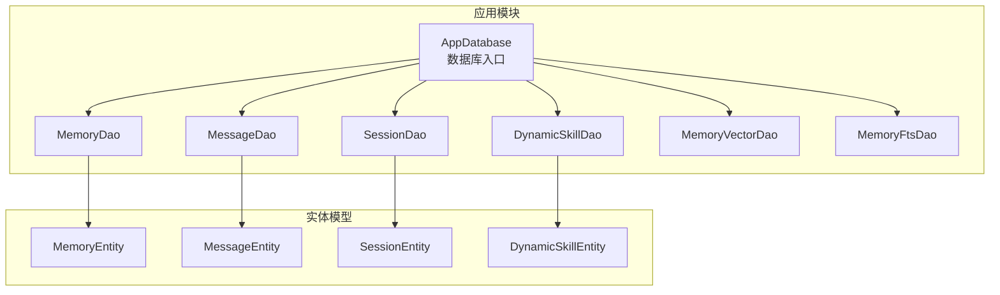
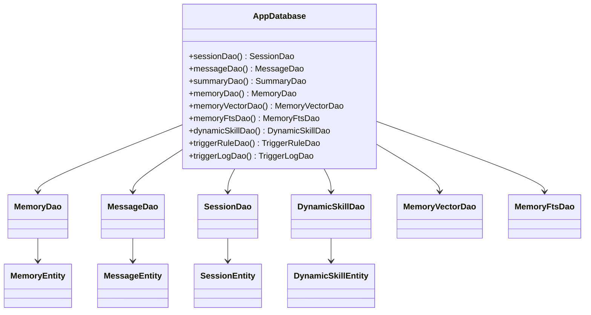
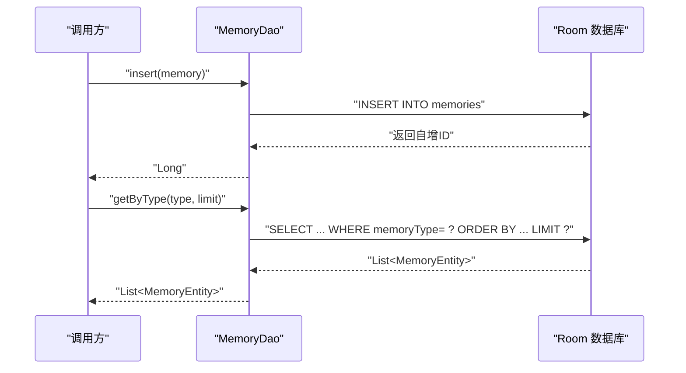
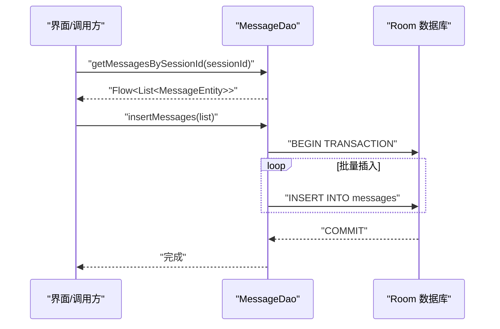
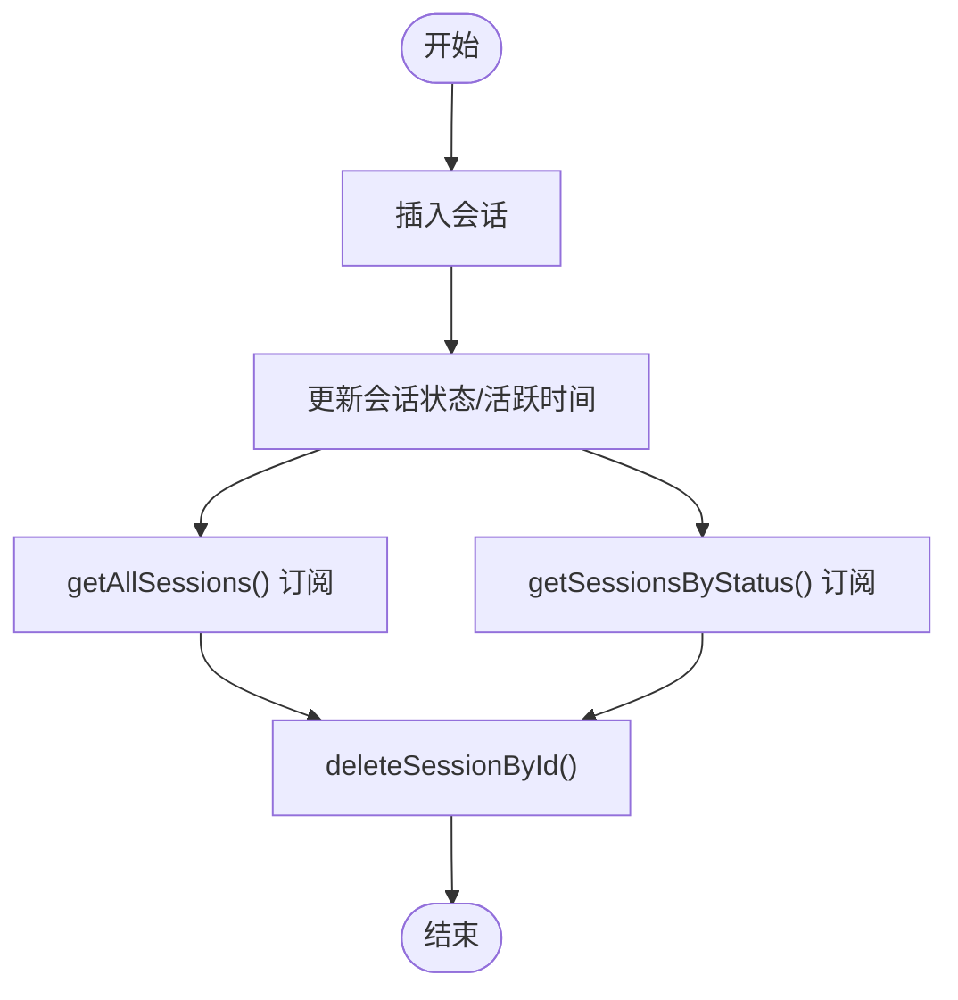
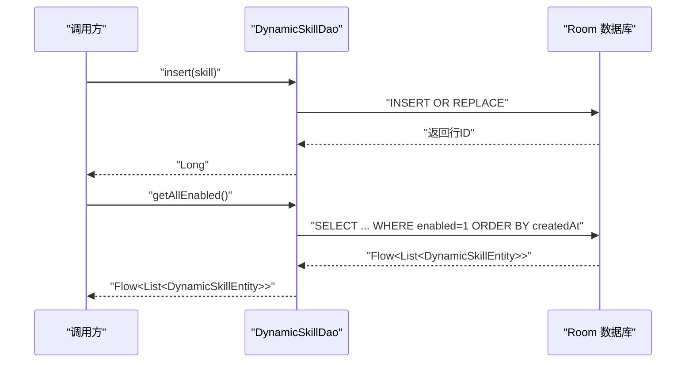
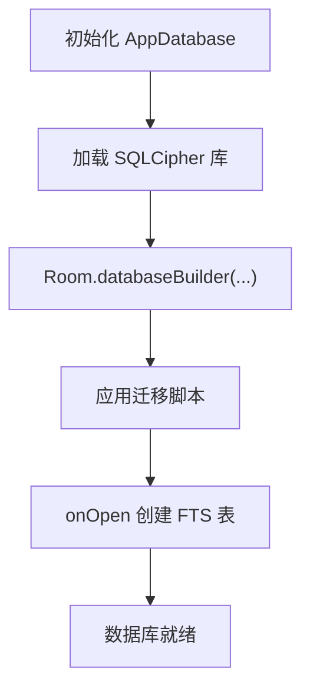
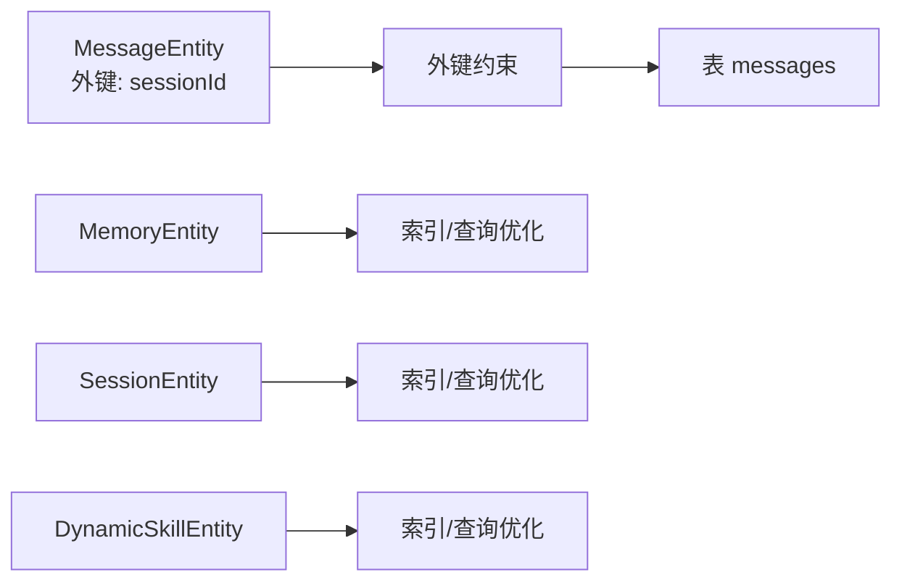

# DAO 接口规范

<cite>
**本文档引用的文件**
- [MemoryDao.kt](file://app/src/main/java/ai/openclaw/android/data/local/MemoryDao.kt)
- [MessageDao.kt](file://app/src/main/java/ai/openclaw/android/data/local/MessageDao.kt)
- [SessionDao.kt](file://app/src/main/java/ai/openclaw/android/data/local/SessionDao.kt)
- [DynamicSkillDao.kt](file://app/src/main/java/ai/openclaw/android/data/local/DynamicSkillDao.kt)
- [AppDatabase.kt](file://app/src/main/java/ai/openclaw/android/data/local/AppDatabase.kt)
- [MemoryEntity.kt](file://app/src/main/java/ai/openclaw/android/data/model/MemoryEntity.kt)
- [MessageEntity.kt](file://app/src/main/java/ai/openclaw/android/data/model/MessageEntity.kt)
- [SessionEntity.kt](file://app/src/main/java/ai/openclaw/android/data/model/SessionEntity.kt)
- [DynamicSkillEntity.kt](file://app/src/main/java/ai/openclaw/android/data/model/DynamicSkillEntity.kt)
- [MemoryType.kt](file://app/src/main/java/ai/openclaw/android/data/model/MemoryType.kt)
- [MessageRole.kt](file://app/src/main/java/ai/openclaw/android/data/model/MessageRole.kt)
- [SessionStatus.kt](file://app/src/main/java/ai/openclaw/android/data/model/SessionStatus.kt)
- [Converters.kt](file://app/src/main/java/ai/openclaw/android/data/local/Converters.kt)
- [MemoryFtsDao.kt](file://app/src/main/java/ai/openclaw/android/data/local/MemoryFtsDao.kt)
- [MemoryVectorDao.kt](file://app/src/main/java/ai/openclaw/android/data/local/MemoryVectorDao.kt)
- [MemoryDaoTest.kt](file://app/src/androidTest/java/ai/openclaw/android/data/MemoryDaoTest.kt)
- [SessionDaoTest.kt](file://app/src/androidTest/java/ai/openclaw/android/data/SessionDaoTest.kt)
- [DynamicSkillDaoTest.kt](file://app/src/androidTest/java/ai/openclaw/android/data/DynamicSkillDaoTest.kt)
</cite>

## 目录
1. [简介](#简介)
2. [项目结构](#项目结构)
3. [核心组件](#核心组件)
4. [架构总览](#架构总览)
5. [详细组件分析](#详细组件分析)
6. [依赖关系分析](#依赖关系分析)
7. [性能考虑](#性能考虑)
8. [故障排查指南](#故障排查指南)
9. [结论](#结论)
10. [附录](#附录)

## 简介
本规范面向DAO接口的CRUD与高级查询能力，覆盖MemoryDao、MessageDao、SessionDao与DynamicSkillDao四大核心DAO。文档从接口定义、方法签名、参数与返回值、异步查询与事务操作、Room查询优化与索引策略、批量操作与复杂查询、以及单元测试示例与最佳实践等方面进行系统化说明，帮助开发者高效、安全地使用数据层。

## 项目结构
数据层采用Room数据库，通过AppDatabase集中管理DAO实例，并在数据库初始化时创建FTS虚拟表与触发器相关表及索引。各实体模型定义了表结构、索引与外键约束，TypeConverters负责枚举与集合类型的序列化/反序列化。

**图表来源**
- [AppDatabase.kt:31-40](file://app/src/main/java/ai/openclaw/android/data/local/AppDatabase.kt#L31-L40)
- [MemoryDao.kt:11-48](file://app/src/main/java/ai/openclaw/android/data/local/MemoryDao.kt#L11-L48)
- [MessageDao.kt:7-42](file://app/src/main/java/ai/openclaw/android/data/local/MessageDao.kt#L7-L42)
- [SessionDao.kt:8-31](file://app/src/main/java/ai/openclaw/android/data/local/SessionDao.kt#L8-L31)
- [DynamicSkillDao.kt:7-47](file://app/src/main/java/ai/openclaw/android/data/local/DynamicSkillDao.kt#L7-L47)

**章节来源**
- [AppDatabase.kt:25-41](file://app/src/main/java/ai/openclaw/android/data/local/AppDatabase.kt#L25-L41)
- [Converters.kt:10-65](file://app/src/main/java/ai/openclaw/android/data/local/Converters.kt#L10-L65)

## 核心组件
- MemoryDao：内存/记忆条目的增删改查、按类型/优先级/最近访问等条件检索、计数与访问统计更新。
- MessageDao：会话消息的流式查询（Flow）、分页查询、批量插入、更新、删除与统计聚合。
- SessionDao：会话的增删改查、按状态流式查询、全量流式查询。
- DynamicSkillDao：动态技能的启用/禁用、按时间阈值筛选、最后使用时间更新、按ID删除与查询。
- AppDatabase：数据库构建、迁移、加密、FTS虚拟表创建与索引维护。
- TypeConverters：枚举与集合类型转换，确保Room可持久化复杂字段。

**章节来源**
- [MemoryDao.kt:11-48](file://app/src/main/java/ai/openclaw/android/data/local/MemoryDao.kt#L11-L48)
- [MessageDao.kt:7-42](file://app/src/main/java/ai/openclaw/android/data/local/MessageDao.kt#L7-L42)
- [SessionDao.kt:8-31](file://app/src/main/java/ai/openclaw/android/data/local/SessionDao.kt#L8-L31)
- [DynamicSkillDao.kt:7-47](file://app/src/main/java/ai/openclaw/android/data/local/DynamicSkillDao.kt#L7-L47)
- [AppDatabase.kt:42-157](file://app/src/main/java/ai/openclaw/android/data/local/AppDatabase.kt#L42-L157)
- [Converters.kt:10-65](file://app/src/main/java/ai/openclaw/android/data/local/Converters.kt#L10-L65)

## 架构总览
下图展示DAO接口与实体模型之间的关系，以及数据库初始化时的索引与FTS配置。

**图表来源**
- [AppDatabase.kt:31-40](file://app/src/main/java/ai/openclaw/android/data/local/AppDatabase.kt#L31-L40)
- [MemoryDao.kt:11-14](file://app/src/main/java/ai/openclaw/android/data/local/MemoryDao.kt#L11-L14)
- [MessageDao.kt:7-11](file://app/src/main/java/ai/openclaw/android/data/local/MessageDao.kt#L7-L11)
- [SessionDao.kt:8-12](file://app/src/main/java/ai/openclaw/android/data/local/SessionDao.kt#L8-L12)
- [DynamicSkillDao.kt:7-16](file://app/src/main/java/ai/openclaw/android/data/local/DynamicSkillDao.kt#L7-L16)

## 详细组件分析

### MemoryDao 接口规范
- 方法与用途
  - 插入：insert(memory: MemoryEntity): Long
  - 查询单条：getById(id: Long): MemoryEntity?
  - 批量查询：getByIds(ids: List<Long>): List<MemoryEntity>
  - 按类型查询：getByType(type: MemoryType, limit: Int): List<MemoryEntity>
  - 高优先级查询：getHighPriority(limit: Int): List<MemoryEntity>
  - 全量查询：getAll(): List<MemoryEntity>
  - 修改时间范围查询：getModifiedSince(sinceTimestamp: Long): List<MemoryEntity>
  - 最近访问查询：getRecent(limit: Int): List<MemoryEntity>
  - 计数：count(): Int
  - 访问信息更新：updateAccess(id: Long, timestamp: Long)
  - 清理过期条目：findStale(threshold: Long, minAccessCount: Int): List<MemoryEntity>
  - 删除：delete(memory: MemoryEntity)
- 异步与事务
  - 所有方法均为挂起函数，适合协程调用；批量插入建议在事务中执行以保证一致性。
- 复杂查询与索引
  - 建议对memoryType、priority、lastAccessedAt建立复合索引以提升排序与过滤性能。
- 单元测试要点
  - 验证插入后按ID检索、按类型分组、高优先级筛选、访问计数与时间更新、删除后不可见等。

**图表来源**
- [MemoryDao.kt:13-23](file://app/src/main/java/ai/openclaw/android/data/local/MemoryDao.kt#L13-L23)

**章节来源**
- [MemoryDao.kt:11-48](file://app/src/main/java/ai/openclaw/android/data/local/MemoryDao.kt#L11-L48)
- [MemoryEntity.kt:6-18](file://app/src/main/java/ai/openclaw/android/data/model/MemoryEntity.kt#L6-L18)
- [MemoryType.kt:3-5](file://app/src/main/java/ai/openclaw/android/data/model/MemoryType.kt#L3-L5)
- [MemoryDaoTest.kt:33-86](file://app/src/androidTest/java/ai/openclaw/android/data/MemoryDaoTest.kt#L33-L86)

### MessageDao 接口规范
- 方法与用途
  - 流式查询：getMessagesBySessionId(sessionId: String): Flow<List<MessageEntity>>
  - 分页查询：getMessagesBySessionIdWithLimit(sessionId: String, limit: Int, offset: Int): List<MessageEntity>
  - 单条插入：insertMessage(message: MessageEntity): Long
  - 批量插入：insertMessages(messages: List<MessageEntity>)
  - 更新：updateMessage(message: MessageEntity)
  - 删除单条：deleteMessage(message: MessageEntity)
  - 按会话删除：deleteMessagesBySessionId(sessionId: String)
  - 按ID列表删除：deleteMessagesByIds(sessionId: String, messageIds: List<Long>)
  - 按时间删除：deleteMessagesBeforeTimestamp(sessionId: String, beforeTimestamp: Long)
  - 统计：getMessageCountBySessionId(sessionId: String): Int、getTotalTokenCountBySessionId(sessionId: String): Int
- 异步与事务
  - 使用Flow支持实时订阅；批量写入建议封装在事务中。
- 性能与索引
  - sessionId已建索引；建议对timestamp建立索引以优化分页与时间范围查询。
- 单元测试要点
  - 验证流式查询的响应性、分页结果边界、批量插入一致性、删除范围控制与统计聚合准确性。

**图表来源**
- [MessageDao.kt:10-20](file://app/src/main/java/ai/openclaw/android/data/local/MessageDao.kt#L10-L20)
- [MessageDao.kt:16-20](file://app/src/main/java/ai/openclaw/android/data/local/MessageDao.kt#L16-L20)

**章节来源**
- [MessageDao.kt:7-42](file://app/src/main/java/ai/openclaw/android/data/local/MessageDao.kt#L7-L42)
- [MessageEntity.kt:8-25](file://app/src/main/java/ai/openclaw/android/data/model/MessageEntity.kt#L8-L25)
- [MessageRole.kt:3-7](file://app/src/main/java/ai/openclaw/android/data/model/MessageRole.kt#L3-L7)
- [SessionDaoTest.kt:125-153](file://app/src/androidTest/java/ai/openclaw/android/data/SessionDaoTest.kt#L125-L153)

### SessionDao 接口规范
- 方法与用途
  - 按ID查询：getSessionById(sessionId: String): SessionEntity?
  - 插入：insertSession(session: SessionEntity)
  - 更新：updateSession(session: SessionEntity)
  - 删除：deleteSession(session: SessionEntity)
  - 按ID删除：deleteSessionById(sessionId: String)
  - 全量流式查询：getAllSessions(): Flow<List<SessionEntity>>
  - 按状态流式查询：getSessionsByStatus(status: SessionStatus): Flow<List<SessionEntity>>
- 异步与事务
  - 流式查询基于Flow，适合UI订阅；写操作为挂起函数，建议在事务中组合多步写。
- 性能与索引
  - 建议对status与lastActiveAt建立索引以支持活跃度排序与状态筛选。
- 单元测试要点
  - 验证默认会话名称为null、状态变更、删除后不可见、流式查询的实时性。

**图表来源**
- [SessionDao.kt:11-31](file://app/src/main/java/ai/openclaw/android/data/local/SessionDao.kt#L11-L31)

**章节来源**
- [SessionDao.kt:8-31](file://app/src/main/java/ai/openclaw/android/data/local/SessionDao.kt#L8-L31)
- [SessionEntity.kt:6-14](file://app/src/main/java/ai/openclaw/android/data/model/SessionEntity.kt#L6-L14)
- [SessionStatus.kt:3-7](file://app/src/main/java/ai/openclaw/android/data/model/SessionStatus.kt#L3-L7)
- [SessionDaoTest.kt:33-101](file://app/src/androidTest/java/ai/openclaw/android/data/SessionDaoTest.kt#L33-L101)

### DynamicSkillDao 接口规范
- 方法与用途
  - 启用技能流式查询：getAllEnabled(): Flow<List<DynamicSkillEntity>>
  - 启用技能列表查询：getAllEnabledList(): List<DynamicSkillEntity>
  - 插入：insert(skill: DynamicSkillEntity): Long
  - 删除：delete(skill: DynamicSkillEntity)
  - 禁用：disable(id: String)
  - 按ID查询：getById(id: String): DynamicSkillEntity?
  - 近期未使用启用技能：getEnabledSkillsLastUsedBefore(threshold: Long): List<DynamicSkillEntity>
  - 长期未使用禁用技能：getDisabledSkillsDisabledBefore(threshold: Long): List<DynamicSkillEntity>
  - 更新最后使用时间：updateLastUsed(id: String, timestamp: Long)
  - 启用已禁用技能：enable(id: String)
  - 按ID删除：deleteById(id: String)
- 异步与事务
  - 写操作为挂起函数；批量启停/清理建议在事务中执行。
- 性能与索引
  - 建议对enabled、lastUsedAt建立索引以优化筛选与排序。
- 单元测试要点
  - 验证启用/禁用切换、按时间阈值筛选、最后使用时间更新、冲突插入替换、按ID删除与查询空值。

**图表来源**
- [DynamicSkillDao.kt:9-13](file://app/src/main/java/ai/openclaw/android/data/local/DynamicSkillDao.kt#L9-L13)
- [DynamicSkillDao.kt:15-16](file://app/src/main/java/ai/openclaw/android/data/local/DynamicSkillDao.kt#L15-L16)

**章节来源**
- [DynamicSkillDao.kt:7-47](file://app/src/main/java/ai/openclaw/android/data/local/DynamicSkillDao.kt#L7-L47)
- [DynamicSkillEntity.kt:6-21](file://app/src/main/java/ai/openclaw/android/data/model/DynamicSkillEntity.kt#L6-L21)
- [DynamicSkillDaoTest.kt:40-66](file://app/src/androidTest/java/ai/openclaw/android/data/DynamicSkillDaoTest.kt#L40-L66)

### Room 数据库与查询优化
- 数据库初始化
  - 使用SQLCipher加密，运行时加载本地库；通过回调在首次打开时创建FTS虚拟表。
  - 定义多版本迁移，新增dynamic_skills、trigger_rules、trigger_logs表并创建索引。
- 索引与FTS
  - 触发规则：index_trigger_rules_source、index_trigger_rules_enabled
  - 触发日志：index_trigger_logs_ruleId、index_trigger_logs_executedAt
  - 记忆FTS：memory_fts（FTS5）
- 类型转换
  - 枚举与集合类型转换器，确保Room可持久化复杂字段。

**图表来源**
- [AppDatabase.kt:42-157](file://app/src/main/java/ai/openclaw/android/data/local/AppDatabase.kt#L42-L157)

**章节来源**
- [AppDatabase.kt:25-157](file://app/src/main/java/ai/openclaw/android/data/local/AppDatabase.kt#L25-L157)
- [Converters.kt:10-65](file://app/src/main/java/ai/openclaw/android/data/local/Converters.kt#L10-L65)

## 依赖关系分析
- 实体到DAO：各实体作为表模型，DAO通过注解映射到具体表；MessageEntity声明了外键与索引，SessionEntity用于消息的关联完整性。
- DAO到数据库：AppDatabase统一暴露DAO实例，避免跨模块直接依赖Room实现。
- 类型转换：Converters将枚举与集合序列化为字符串，减少Room扩展依赖。

**图表来源**
- [MessageEntity.kt:8-16](file://app/src/main/java/ai/openclaw/android/data/model/MessageEntity.kt#L8-L16)
- [MemoryEntity.kt:6-18](file://app/src/main/java/ai/openclaw/android/data/model/MemoryEntity.kt#L6-L18)
- [SessionEntity.kt:6-14](file://app/src/main/java/ai/openclaw/android/data/model/SessionEntity.kt#L6-L14)
- [DynamicSkillEntity.kt:6-21](file://app/src/main/java/ai/openclaw/android/data/model/DynamicSkillEntity.kt#L6-L21)

**章节来源**
- [MessageEntity.kt:8-25](file://app/src/main/java/ai/openclaw/android/data/model/MessageEntity.kt#L8-L25)
- [SessionDao.kt:27-31](file://app/src/main/java/ai/openclaw/android/data/local/SessionDao.kt#L27-L31)

## 性能考虑
- 索引策略
  - MessageEntity：已对sessionId建立索引，建议对timestamp建立索引以优化分页与时间范围查询。
  - MemoryEntity：建议对memoryType、priority、lastAccessedAt建立复合索引以提升排序与过滤性能。
  - SessionEntity：建议对status与lastActiveAt建立索引以支持活跃度排序与状态筛选。
  - DynamicSkillEntity：建议对enabled与lastUsedAt建立索引以优化筛选与排序。
- 查询优化
  - 使用LIMIT与OFFSET进行分页，避免一次性加载大量数据。
  - 对频繁过滤的字段（如memoryType、status）使用索引或物化视图。
- 批量操作
  - 批量插入/更新/删除建议封装在Room事务中，减少IO次数与锁竞争。
- FTS与BM25
  - 记忆FTS虚拟表用于全文检索，结合BM25评分进行相关性排序；建议在搜索前预估结果集大小并设置合理LIMIT。

[本节为通用性能指导，不直接分析特定文件，故无章节来源]

## 故障排查指南
- 插入冲突
  - 使用REPLACE策略时，注意主键冲突导致的记录替换行为；可通过单元测试验证替换逻辑。
- 删除一致性
  - 删除单条记录需使用完整实体（含主键），否则可能无法匹配；参考MemoryDao与DynamicSkillDao的删除测试。
- 流式查询无更新
  - 确认写操作发生在正确的数据库实例上，且UI侧正确订阅Flow；检查事务提交时机。
- 加密问题
  - 确保SQLCipher库正确加载与密钥生成；数据库升级失败时检查迁移脚本与回调创建FTS表逻辑。
- FTS未命中
  - 确认FTS表已创建且内容已同步；检查查询语法与分词设置。

**章节来源**
- [MemoryDaoTest.kt:144-166](file://app/src/androidTest/java/ai/openclaw/android/data/MemoryDaoTest.kt#L144-L166)
- [DynamicSkillDaoTest.kt:130-153](file://app/src/androidTest/java/ai/openclaw/android/data/DynamicSkillDaoTest.kt#L130-L153)
- [AppDatabase.kt:146-152](file://app/src/main/java/ai/openclaw/android/data/local/AppDatabase.kt#L146-L152)

## 结论
本文档系统梳理了四大DAO接口的CRUD与高级查询能力，明确了异步调用方式、事务处理建议、索引与FTS优化策略，并提供了单元测试示例与最佳实践。遵循本文规范可显著提升数据层的稳定性、性能与可维护性。

## 附录
- 批量操作建议
  - 将多次插入/更新/删除封装在Room事务中，减少数据库往返与锁竞争。
- 复杂查询接口规范
  - 提供按时间窗口、状态组合、优先级排序的查询方法；必要时引入物化视图或索引辅助。
- 单元测试最佳实践
  - 使用内存数据库隔离环境；覆盖插入/查询/更新/删除/异常路径；验证Flow订阅与生命周期。

[本节为通用指导，不直接分析特定文件，故无章节来源]