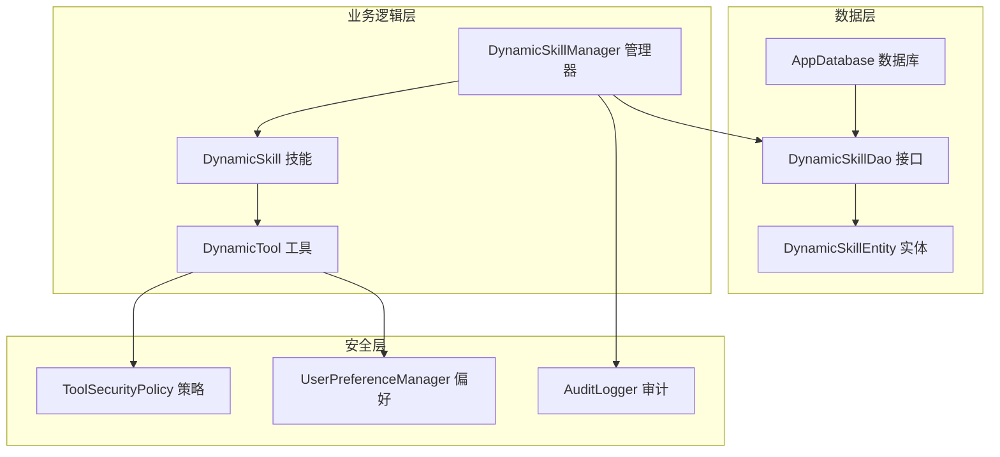
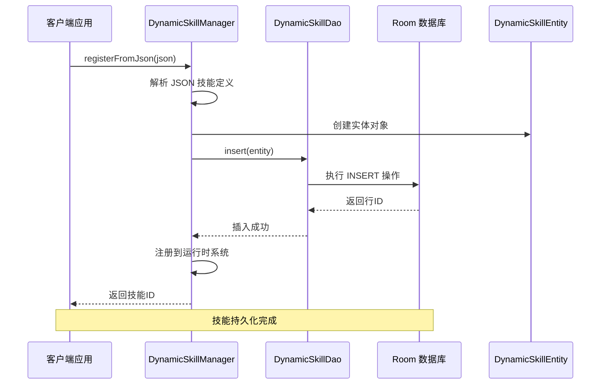
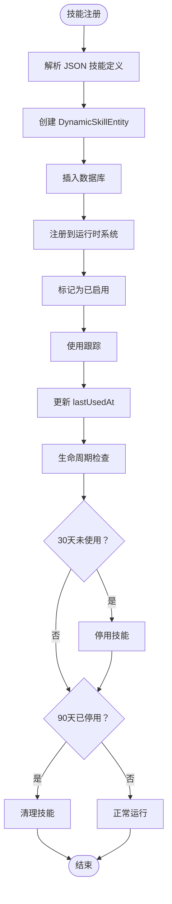
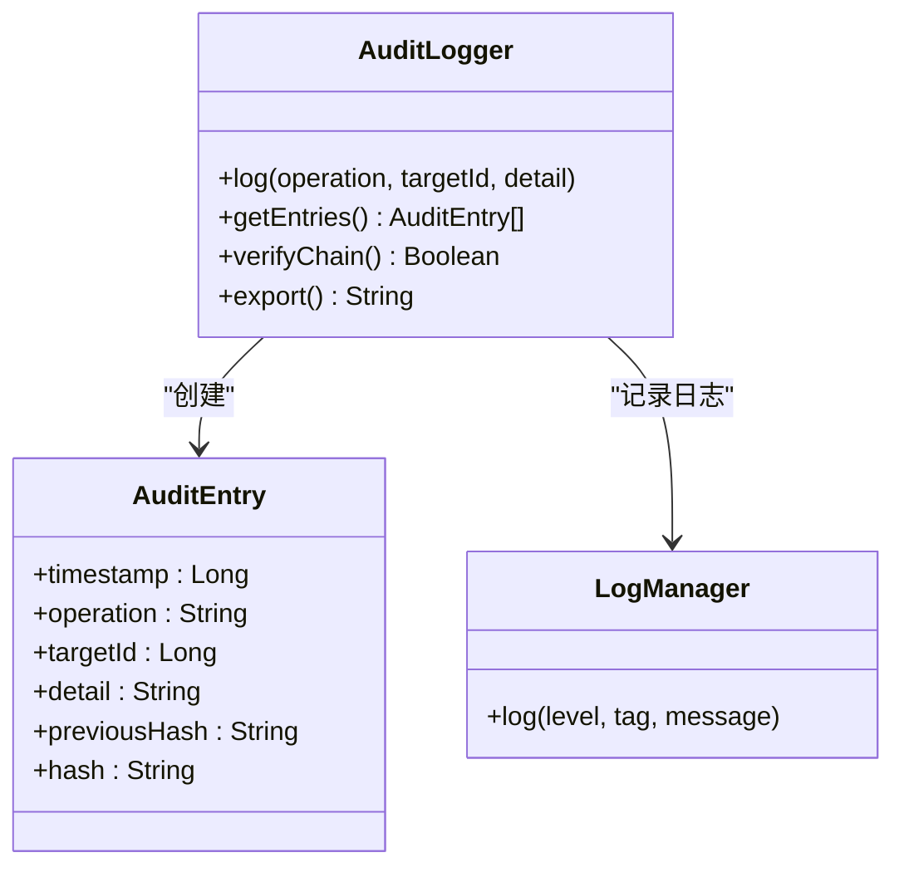
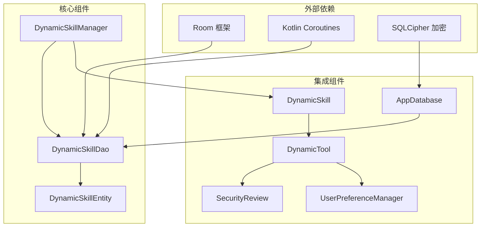

# DynamicSkillDao 接口规范

<cite>
**本文档引用的文件**
- [DynamicSkillDao.kt](file://app/src/main/java/ai/openclaw/android/data/local/DynamicSkillDao.kt)
- [DynamicSkillEntity.kt](file://app/src/main/java/ai/openclaw/android/data/model/DynamicSkillEntity.kt)
- [AppDatabase.kt](file://app/src/main/java/ai/openclaw/android/data/local/AppDatabase.kt)
- [DynamicSkillManager.kt](file://app/src/main/java/ai/openclaw/android/skill/DynamicSkillManager.kt)
- [DynamicSkill.kt](file://app/src/main/java/ai/openclaw/android/skill/DynamicSkill.kt)
- [ToolSecurityPolicy.kt](file://app/src/main/java/ai/openclaw/android/skill/ToolSecurityPolicy.kt)
- [UserPreferenceManager.kt](file://app/src/main/java/ai/openclaw/android/skill/UserPreferenceManager.kt)
- [AuditLogger.kt](file://app/src/main/java/ai/openclaw/android/security/AuditLogger.kt)
- [DynamicSkillDaoTest.kt](file://app/src/androidTest/java/ai/openclaw/android/data/DynamicSkillDaoTest.kt)
</cite>

## 目录
1. [简介](#简介)
2. [项目结构](#项目结构)
3. [核心组件](#核心组件)
4. [架构概览](#架构概览)
5. [详细组件分析](#详细组件分析)
6. [依赖关系分析](#依赖关系分析)
7. [性能考虑](#性能考虑)
8. [故障排除指南](#故障排除指南)
9. [结论](#结论)

## 简介

DynamicSkillDao 是 OpenClaw Android 应用程序中动态技能数据访问的核心接口。该接口负责管理用户生成的动态技能的完整生命周期，包括技能的注册、查询、更新和删除操作。动态技能系统允许用户通过 LLM 生成自定义技能，这些技能以 JavaScript 脚本的形式执行，并通过安全策略进行权限控制。

该接口基于 Android Room 持久层框架构建，提供类型安全的数据访问模式，支持流式查询和异步操作。系统还集成了版本管理和热更新机制，以及完整的安全审计功能。

## 项目结构

DynamicSkillDao 接口及其相关组件在项目中的组织结构如下：

**图表来源**
- [DynamicSkillDao.kt:1-47](file://app/src/main/java/ai/openclaw/android/data/local/DynamicSkillDao.kt#L1-L47)
- [AppDatabase.kt:25-41](file://app/src/main/java/ai/openclaw/android/data/local/AppDatabase.kt#L25-L41)

**章节来源**
- [DynamicSkillDao.kt:1-47](file://app/src/main/java/ai/openclaw/android/data/local/DynamicSkillDao.kt#L1-L47)
- [AppDatabase.kt:1-158](file://app/src/main/java/ai/openclaw/android/data/local/AppDatabase.kt#L1-L158)

## 核心组件

### DynamicSkillDao 接口

DynamicSkillDao 是一个基于 Room 的数据访问对象，定义了动态技能的完整 CRUD 操作和查询方法。接口提供了以下核心功能：

#### 主要方法分类

1. **查询操作**
   - 获取所有已启用的技能（支持流式监听）
   - 按 ID 查询特定技能
   - 获取未使用技能列表

2. **数据操作**
   - 插入新技能
   - 删除技能
   - 更新技能状态

3. **状态管理**
   - 启用/停用技能
   - 更新使用时间

**章节来源**
- [DynamicSkillDao.kt:8-46](file://app/src/main/java/ai/openclaw/android/data/local/DynamicSkillDao.kt#L8-L46)

### DynamicSkillEntity 实体

DynamicSkillEntity 是 Room 实体类，定义了动态技能在数据库中的存储结构：

| 字段名 | 类型 | 描述 | 默认值 |
|--------|------|------|--------|
| id | String | 技能唯一标识符 | 必填 |
| name | String | 技能名称 | 必填 |
| description | String | 技能描述 | 必填 |
| version | String | 技能版本 | 必填 |
| category | String | 技能类别 | "custom" |
| instructions | String | 使用说明 | 必填 |
| script | String | JavaScript 脚本源码 | 必填 |
| toolsJson | String | 工具定义 JSON | 必填 |
| permissions | String | 权限声明 | "" |
| createdAt | Long | 创建时间戳 | 当前时间 |
| lastUsedAt | Long | 最后使用时间戳 | 0 |
| enabled | Boolean | 启用状态 | true |
| approvalPrefsJson | String | 审批偏好 JSON | "" |

**章节来源**
- [DynamicSkillEntity.kt:6-21](file://app/src/main/java/ai/openclaw/android/data/model/DynamicSkillEntity.kt#L6-L21)

## 架构概览

DynamicSkillDao 接口在整个系统架构中扮演着关键的数据持久化角色：

**图表来源**
- [DynamicSkillManager.kt:63-96](file://app/src/main/java/ai/openclaw/android/skill/DynamicSkillManager.kt#L63-L96)
- [DynamicSkillDao.kt:15-16](file://app/src/main/java/ai/openclaw/android/data/local/DynamicSkillDao.kt#L15-L16)

**章节来源**
- [DynamicSkillManager.kt:1-202](file://app/src/main/java/ai/openclaw/android/skill/DynamicSkillManager.kt#L1-L202)

## 详细组件分析

### 数据访问方法详解

#### 查询方法

**getAllEnabled() - 流式查询**
- **功能**: 获取所有已启用的动态技能
- **返回类型**: Flow<List<DynamicSkillEntity>>
- **排序**: 按创建时间升序排列
- **用途**: 实时监听技能状态变化

**getAllEnabledList() - 同步查询**
- **功能**: 获取所有已启用技能的同步列表
- **返回类型**: List<DynamicSkillEntity>
- **用途**: 初始化加载和批量操作

**getById(id: String) - 按ID查询**
- **功能**: 根据技能ID获取特定技能
- **返回类型**: DynamicSkillEntity?
- **特点**: 支持空值返回

**章节来源**
- [DynamicSkillDao.kt:9-25](file://app/src/main/java/ai/openclaw/android/data/local/DynamicSkillDao.kt#L9-L25)

#### 数据操作方法

**insert(skill: DynamicSkillEntity) - 插入操作**
- **功能**: 插入新的动态技能
- **冲突策略**: REPLACE（冲突时替换）
- **返回类型**: Long（行ID）
- **特点**: 支持版本覆盖更新

**delete(skill: DynamicSkillEntity) - 删除操作**
- **功能**: 删除指定技能实体
- **注意**: 通常配合 deleteById 使用

**章节来源**
- [DynamicSkillDao.kt:15-19](file://app/src/main/java/ai/openclaw/android/data/local/DynamicSkillDao.kt#L15-L19)

#### 状态管理方法

**enable(id: String) - 启用技能**
- **功能**: 将停用的技能重新启用
- **SQL**: UPDATE dynamic_skills SET enabled = 1 WHERE id = :id

**disable(id: String) - 停用技能**
- **功能**: 停用指定技能
- **SQL**: UPDATE dynamic_skills SET enabled = 0 WHERE id = :id

**deleteById(id: String) - 按ID删除**
- **功能**: 按技能ID彻底删除技能
- **SQL**: DELETE FROM dynamic_skills WHERE id = :id

**updateLastUsed(id: String, timestamp: Long) - 更新使用时间**
- **功能**: 更新技能的最后使用时间
- **SQL**: UPDATE dynamic_skills SET lastUsedAt = :timestamp WHERE id = :id

**章节来源**
- [DynamicSkillDao.kt:21-45](file://app/src/main/java/ai/openclaw/android/data/local/DynamicSkillDao.kt#L21-L45)

### 生命周期管理查询

系统提供了专门的查询方法来管理技能的生命周期：

**getEnabledSkillsLastUsedBefore(threshold: Long) - 未使用技能查询**
- **功能**: 获取指定时间之前未使用的已启用技能
- **用途**: 30天未使用自动停用
- **SQL**: SELECT * FROM dynamic_skills WHERE enabled = 1 AND lastUsedAt < :threshold ORDER BY lastUsedAt

**getDisabledSkillsDisabledBefore(threshold: Long) - 已停用技能查询**
- **功能**: 获取指定时间之前已停用的技能
- **用途**: 90天已停用自动清理
- **SQL**: SELECT * FROM dynamic_skills WHERE enabled = 0 AND lastUsedAt < :threshold ORDER BY lastUsedAt

**章节来源**
- [DynamicSkillDao.kt:27-33](file://app/src/main/java/ai/openclaw/android/data/local/DynamicSkillDao.kt#L27-L33)

### 版本管理和热更新机制

DynamicSkillManager 实现了完整的技能生命周期管理：

**图表来源**
- [DynamicSkillManager.kt:122-147](file://app/src/main/java/ai/openclaw/android/skill/DynamicSkillManager.kt#L122-L147)

**章节来源**
- [DynamicSkillManager.kt:13-21](file://app/src/main/java/ai/openclaw/android/skill/DynamicSkillManager.kt#L13-L21)

### 安全检查和权限控制

系统实现了多层次的安全控制机制：

#### 工具安全策略

| 策略类型 | 描述 | 适用场景 |
|----------|------|----------|
| AUTO_EXECUTE | 自动执行 | 幂等操作（如只读查询） |
| ASK_USER | 用户确认 | 非幂等操作（如数据修改） |
| DENY | 拒绝执行 | 用户已明确拒绝 |

#### 用户偏好管理

UserPreferenceManager 提供了持久化的用户偏好存储：

- **存储格式**: JSON 文件
- **存储位置**: 应用私有目录
- **功能**: 记忆用户的审批决策
- **同步机制**: 自动保存和加载

**章节来源**
- [ToolSecurityPolicy.kt:6-25](file://app/src/main/java/ai/openclaw/android/skill/ToolSecurityPolicy.kt#L6-L25)
- [UserPreferenceManager.kt:16-100](file://app/src/main/java/ai/openclaw/android/skill/UserPreferenceManager.kt#L16-L100)

### 审计日志记录

系统提供了完整的审计日志功能：

**图表来源**
- [AuditLogger.kt:16-33](file://app/src/main/java/ai/openclaw/android/security/AuditLogger.kt#L16-L33)

**章节来源**
- [AuditLogger.kt:1-100](file://app/src/main/java/ai/openclaw/android/security/AuditLogger.kt#L1-L100)

## 依赖关系分析

DynamicSkillDao 接口与系统其他组件的依赖关系如下：

**图表来源**
- [AppDatabase.kt:25-41](file://app/src/main/java/ai/openclaw/android/data/local/AppDatabase.kt#L25-L41)
- [DynamicSkillManager.kt:3-29](file://app/src/main/java/ai/openclaw/android/skill/DynamicSkillManager.kt#L3-L29)

**章节来源**
- [AppDatabase.kt:1-158](file://app/src/main/java/ai/openclaw/android/data/local/AppDatabase.kt#L1-L158)

## 性能考虑

### 数据库优化

1. **索引设计**
   - 主键索引：自动为 id 字段创建
   - 查询优化：针对常用查询条件建立索引

2. **内存管理**
   - Flow 流式查询：支持响应式数据更新
   - 异步操作：避免阻塞主线程

3. **缓存策略**
   - 运行时缓存：技能实例缓存
   - 数据库缓存：Room 查询结果缓存

### 安全性能

1. **权限检查优化**
   - 缓存用户偏好设置
   - 批量处理权限验证

2. **审计日志性能**
   - 内存中维护有限数量的日志条目
   - 异步日志写入

## 故障排除指南

### 常见问题及解决方案

**技能无法加载**
- 检查数据库连接是否正常
- 验证技能 JSON 格式是否正确
- 确认权限设置是否完整

**权限验证失败**
- 检查 UserPreferenceManager 文件是否存在
- 验证用户偏好的序列化格式
- 确认安全策略配置

**审计日志异常**
- 检查磁盘空间是否充足
- 验证日志文件权限
- 确认哈希链完整性

**章节来源**
- [DynamicSkillDaoTest.kt:40-229](file://app/src/androidTest/java/ai/openclaw/android/data/DynamicSkillDaoTest.kt#L40-L229)

## 结论

DynamicSkillDao 接口为动态技能系统提供了完整、类型安全的数据访问能力。通过精心设计的 API，系统实现了以下关键特性：

1. **完整的生命周期管理**：从技能注册到自动清理的全流程支持
2. **强大的安全控制**：多层次的权限验证和用户偏好管理
3. **高效的性能表现**：基于 Room 的优化查询和异步操作
4. **完善的审计功能**：基于哈希链的不可篡改日志记录

该接口的设计充分考虑了移动应用的特殊需求，在保证功能完整性的同时，确保了良好的性能和安全性。通过模块化的架构设计，系统具有良好的可扩展性和维护性，为未来的功能增强奠定了坚实的基础。