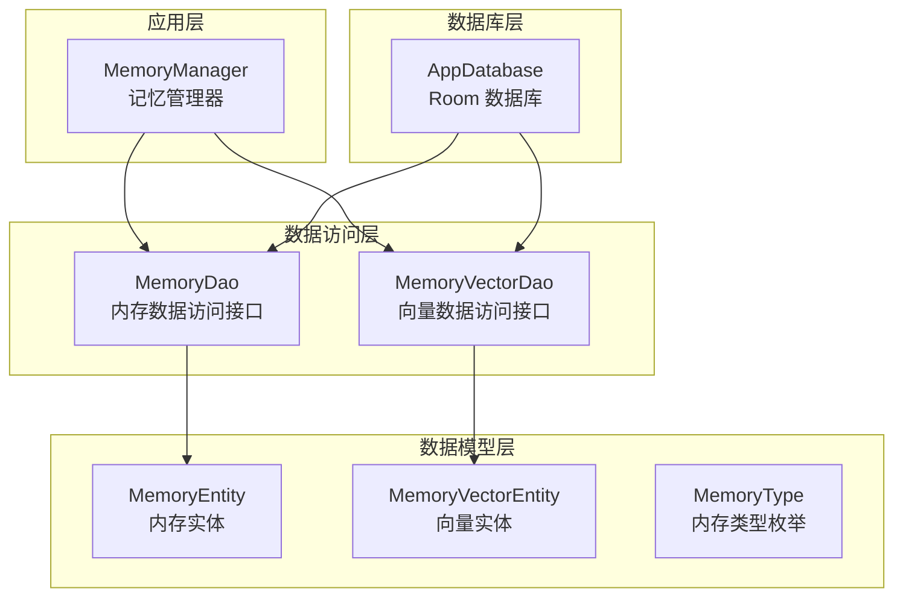
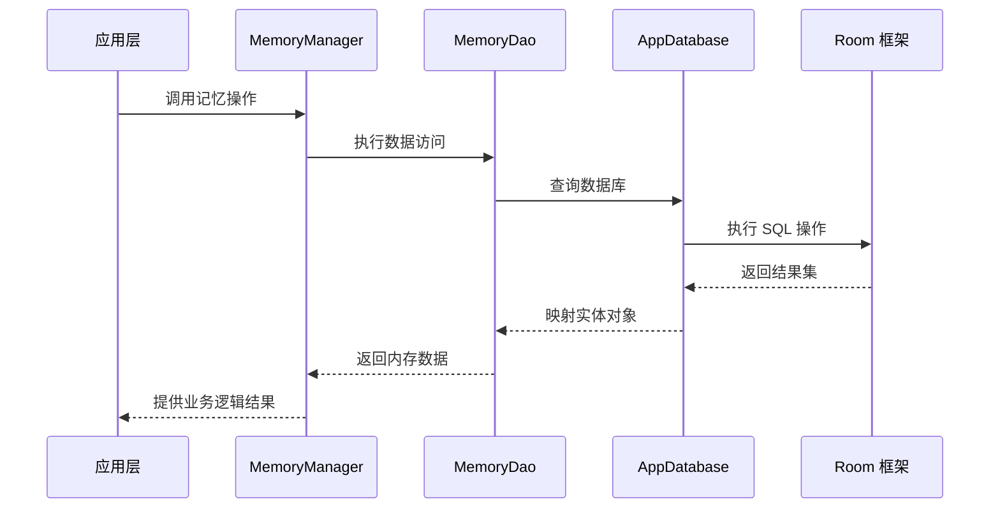
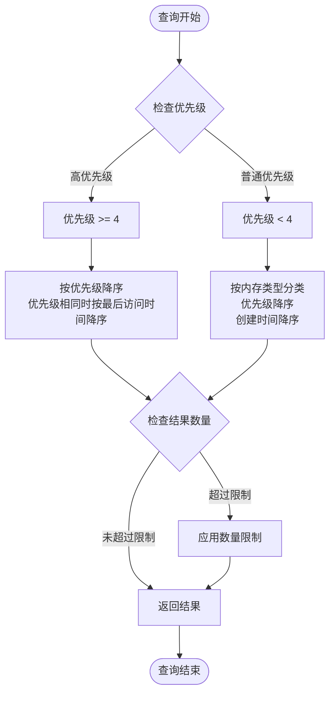
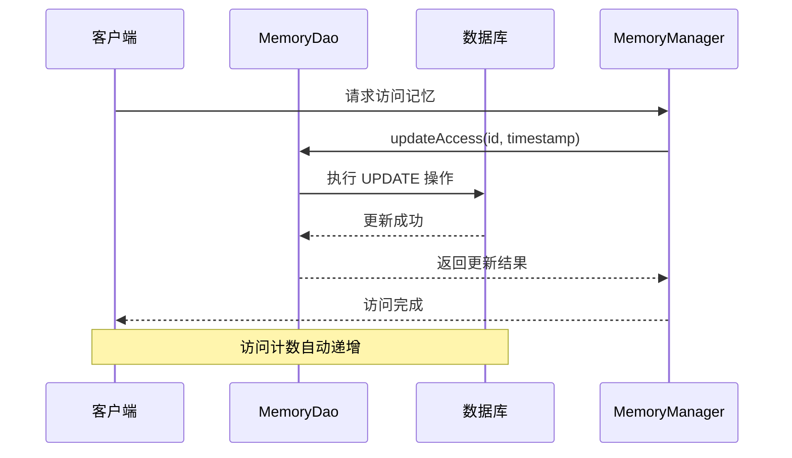
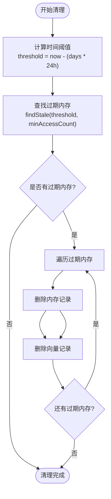
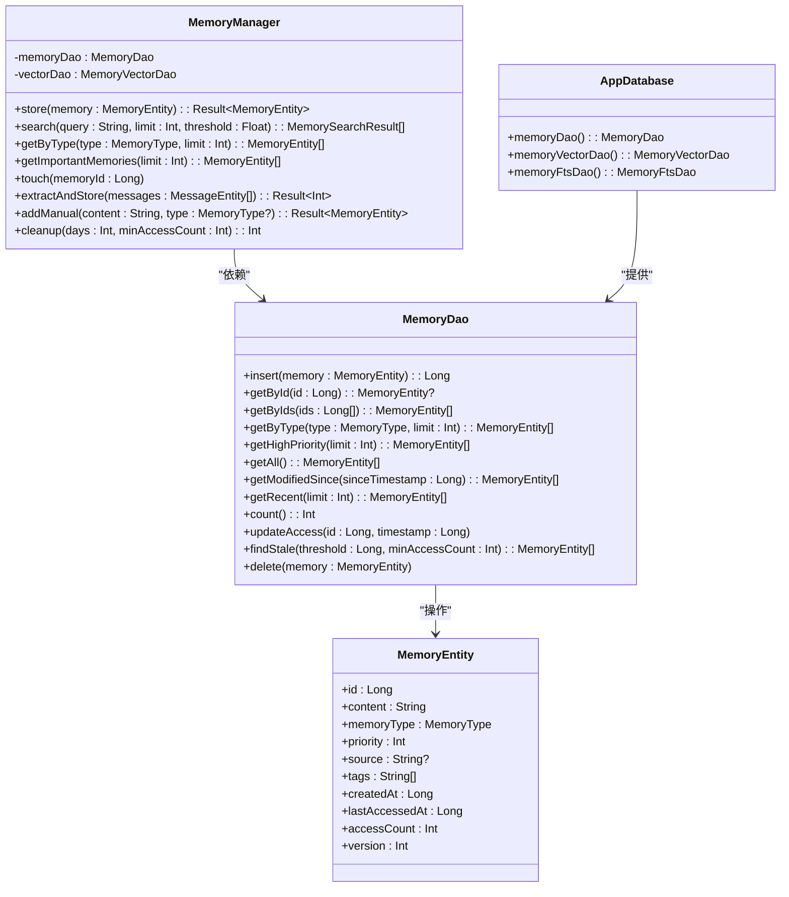

# MemoryDao 接口规范

<cite>
**本文档引用的文件**
- [MemoryDao.kt](file://app/src/main/java/ai/openclaw/android/data/local/MemoryDao.kt)
- [MemoryEntity.kt](file://app/src/main/java/ai/openclaw/android/data/model/MemoryEntity.kt)
- [MemoryType.kt](file://app/src/main/java/ai/openclaw/android/data/model/MemoryType.kt)
- [AppDatabase.kt](file://app/src/main/java/ai/openclaw/android/data/local/AppDatabase.kt)
- [MemoryManager.kt](file://app/src/main/java/ai/openclaw/android/domain/memory/MemoryManager.kt)
- [MemoryVectorEntity.kt](file://app/src/main/java/ai/openclaw/android/data/model/MemoryVectorEntity.kt)
- [MemoryVectorDao.kt](file://app/src/main/java/ai/openclaw/android/data/local/MemoryVectorDao.kt)
- [MemoryDaoTest.kt](file://app/src/androidTest/java/ai/openclaw/android/data/MemoryDaoTest.kt)
</cite>

## 目录
1. [简介](#简介)
2. [项目结构](#项目结构)
3. [核心组件](#核心组件)
4. [架构概览](#架构概览)
5. [详细组件分析](#详细组件分析)
6. [依赖关系分析](#依赖关系分析)
7. [性能考虑](#性能考虑)
8. [故障排除指南](#故障排除指南)
9. [结论](#结论)

## 简介

MemoryDao 是 OpenClaw Android 应用程序中内存数据访问的核心接口，基于 Room 持久化库实现。该接口提供了完整的内存 CRUD 操作，包括插入、查询、更新和删除功能，并支持高级查询如高优先级内存检索、按类型分类检索、最近访问检索等功能。

该接口设计用于管理不同类型的记忆实体，支持优先级排序、时间戳管理和访问统计功能，为应用程序的智能记忆系统提供基础数据存储能力。

## 项目结构

OpenClaw 项目的内存管理系统采用分层架构设计，主要包含以下关键组件：



**图表来源**
- [MemoryDao.kt:11-48](file://app/src/main/java/ai/openclaw/android/data/local/MemoryDao.kt#L11-L48)
- [MemoryManager.kt:10-15](file://app/src/main/java/ai/openclaw/android/domain/memory/MemoryManager.kt#L10-L15)
- [AppDatabase.kt:25-40](file://app/src/main/java/ai/openclaw/android/data/local/AppDatabase.kt#L25-L40)

**章节来源**
- [MemoryDao.kt:1-49](file://app/src/main/java/ai/openclaw/android/data/local/MemoryDao.kt#L1-L49)
- [AppDatabase.kt:1-158](file://app/src/main/java/ai/openclaw/android/data/local/AppDatabase.kt#L1-L158)

## 核心组件

### MemoryDao 接口定义

MemoryDao 接口是内存数据访问的核心抽象，定义了完整的数据操作方法集合。该接口继承自 Room 的 @Dao 注解，提供了类型安全的数据访问能力。

**主要特性：**
- 支持异步操作（suspend 函数）
- 基于 SQL 查询的灵活数据检索
- 冲突解决策略（REPLACE）
- 完整的 CRUD 操作支持

**章节来源**
- [MemoryDao.kt:11-48](file://app/src/main/java/ai/openclaw/android/data/local/MemoryDao.kt#L11-L48)

### MemoryEntity 数据模型

MemoryEntity 是内存系统的数据载体，定义了内存记录的完整结构：

**核心字段：**
- `id`: 主键标识符（自动生成）
- `content`: 内存内容文本
- `memoryType`: 内存类型（枚举）
- `priority`: 优先级（1-5）
- `source`: 来源信息
- `tags`: 标签列表
- `createdAt`: 创建时间戳
- `lastAccessedAt`: 最后访问时间戳
- `accessCount`: 访问计数
- `version`: 版本号

**章节来源**
- [MemoryEntity.kt:6-18](file://app/src/main/java/ai/openclaw/android/data/model/MemoryEntity.kt#L6-L18)

### MemoryType 枚举类型

MemoryType 定义了内存的分类体系，支持五种不同的内存类型：

- `PREFERENCE`: 偏好设置
- `FACT`: 事实信息
- `DECISION`: 决策记录
- `TASK`: 任务信息
- `PROJECT`: 项目信息

**章节来源**
- [MemoryType.kt:3-5](file://app/src/main/java/ai/openclaw/android/data/model/MemoryType.kt#L3-L5)

## 架构概览

MemoryDao 在整体架构中的位置和职责如下：



**图表来源**
- [MemoryManager.kt:16-36](file://app/src/main/java/ai/openclaw/android/domain/memory/MemoryManager.kt#L16-L36)
- [MemoryDao.kt:13-14](file://app/src/main/java/ai/openclaw/android/data/local/MemoryDao.kt#L13-L14)
- [AppDatabase.kt:35](file://app/src/main/java/ai/openclaw/android/data/local/AppDatabase.kt#L35)

## 详细组件分析

### CRUD 操作规范

#### 插入操作 (insert)

**方法签名：**
```kotlin
suspend fun insert(memory: MemoryEntity): Long
```

**功能描述：**
- 将新的内存实体插入到数据库中
- 使用 REPLACE 冲突策略处理重复项
- 返回新插入记录的主键 ID

**参数说明：**
- `memory`: MemoryEntity 对象，包含要插入的内存数据

**返回值：**
- `Long`: 新记录的主键 ID

**使用场景：**
- 新建记忆条目
- 更新现有记忆时的替代操作

**章节来源**
- [MemoryDao.kt:13-14](file://app/src/main/java/ai/openclaw/android/data/local/MemoryDao.kt#L13-L14)

#### 查询操作

##### 单个记录查询 (getById)

**方法签名：**
```kotlin
suspend fun getById(id: Long): MemoryEntity?
```

**功能描述：**
- 根据主键 ID 查询单个内存实体
- 返回空值表示未找到对应记录

**参数说明：**
- `id`: Long 类型的主键标识符

**返回值：**
- `MemoryEntity?`: 找到的内存实体或 null

**章节来源**
- [MemoryDao.kt:16-17](file://app/src/main/java/ai/openclaw/android/data/local/MemoryDao.kt#L16-L17)

##### 批量查询 (getByIds)

**方法签名：**
```kotlin
suspend fun getByIds(ids: List<Long>): List<MemoryEntity>
```

**功能描述：**
- 批量查询多个内存实体
- 返回匹配记录的列表

**参数说明：**
- `ids`: List<Long> 类型的 ID 列表

**返回值：**
- `List<MemoryEntity>`: 匹配的内存实体列表

**章节来源**
- [MemoryDao.kt:19-20](file://app/src/main/java/ai/openclaw/android/data/local/MemoryDao.kt#L19-L20)

##### 按类型查询 (getByType)

**方法签名：**
```kotlin
suspend fun getByType(type: MemoryType, limit: Int): List<MemoryEntity>
```

**功能描述：**
- 根据内存类型查询相关记录
- 支持优先级和创建时间排序
- 可限制返回结果数量

**参数说明：**
- `type`: MemoryType 枚举值，指定内存类型
- `limit`: Int 类型，限制返回结果数量

**返回值：**
- `List<MemoryEntity>`: 按优先级降序、创建时间降序排列的内存实体列表

**排序规则：**
1. 首先按优先级降序排列
2. 优先级相同时按创建时间降序排列

**章节来源**
- [MemoryDao.kt:22-23](file://app/src/main/java/ai/openclaw/android/data/local/MemoryDao.kt#L22-L23)

##### 高优先级查询 (getHighPriority)

**方法签名：**
```kotlin
suspend fun getHighPriority(limit: Int): List<MemoryEntity>
```

**功能描述：**
- 查询优先级大于等于 4 的高优先级内存
- 支持按最后访问时间和优先级排序

**参数说明：**
- `limit`: Int 类型，限制返回结果数量

**返回值：**
- `List<MemoryEntity>`: 高优先级内存实体列表

**排序规则：**
1. 按优先级降序排列
2. 优先级相同时按最后访问时间降序排列

**章节来源**
- [MemoryDao.kt:25-26](file://app/src/main/java/ai/openclaw/android/data/local/MemoryDao.kt#L25-L26)

##### 全部查询 (getAll)

**方法签名：**
```kotlin
suspend fun getAll(): List<MemoryEntity>
```

**功能描述：**
- 查询数据库中的所有内存记录
- 按创建时间降序排列

**返回值：**
- `List<MemoryEntity>`: 所有内存实体的列表

**排序规则：**
- 按创建时间降序排列

**章节来源**
- [MemoryDao.kt:28-29](file://app/src/main/java/ai/openclaw/android/data/local/MemoryDao.kt#L28-L29)

##### 时间范围查询 (getModifiedSince)

**方法签名：**
```kotlin
suspend fun getModifiedSince(sinceTimestamp: Long): List<MemoryEntity>
```

**功能描述：**
- 查询指定时间戳之后修改过的内存记录
- 按最后访问时间降序排列

**参数说明：**
- `sinceTimestamp`: Long 类型，时间戳下限

**返回值：**
- `List<MemoryEntity>`: 指定时间范围内的内存实体列表

**排序规则：**
- 按最后访问时间降序排列

**章节来源**
- [MemoryDao.kt:31-32](file://app/src/main/java/ai/openclaw/android/data/local/MemoryDao.kt#L31-L32)

##### 最近访问查询 (getRecent)

**方法签名：**
```kotlin
suspend fun getRecent(limit: Int): List<MemoryEntity>
```

**功能描述：**
- 查询最近访问过的内存记录
- 支持限制返回结果数量

**参数说明：**
- `limit`: Int 类型，限制返回结果数量

**返回值：**
- `List<MemoryEntity>`: 最近访问的内存实体列表

**排序规则：**
- 按最后访问时间降序排列

**章节来源**
- [MemoryDao.kt:34-35](file://app/src/main/java/ai/openclaw/android/data/local/MemoryDao.kt#L34-L35)

#### 统计操作

##### 计数查询 (count)

**方法签名：**
```kotlin
suspend fun count(): Int
```

**功能描述：**
- 统计数据库中内存记录的总数

**返回值：**
- `Int`: 内存记录的总数量

**章节来源**
- [MemoryDao.kt:37-38](file://app/src/main/java/ai/openclaw/android/data/local/MemoryDao.kt#L37-L38)

#### 更新操作

##### 访问信息更新 (updateAccess)

**方法签名：**
```kotlin
suspend fun updateAccess(id: Long, timestamp: Long)
```

**功能描述：**
- 更新内存记录的访问信息
- 同时更新最后访问时间和访问计数

**参数说明：**
- `id`: Long 类型，内存记录的主键
- `timestamp`: Long 类型，新的访问时间戳

**功能效果：**
- 设置 `lastAccessedAt` 字段为指定时间戳
- 将 `accessCount` 字段加 1

**章节来源**
- [MemoryDao.kt:40-41](file://app/src/main/java/ai/openclaw/android/data/local/MemoryDao.kt#L40-L41)

#### 清理操作

##### 过期检测 (findStale)

**方法签名：**
```kotlin
suspend fun findStale(threshold: Long, minAccessCount: Int): List<MemoryEntity>
```

**功能描述：**
- 查找过期且访问次数较少的内存记录
- 用于内存清理和垃圾回收

**参数说明：**
- `threshold`: Long 类型，时间阈值
- `minAccessCount`: Int 类型，最小访问次数

**返回值：**
- `List<MemoryEntity>`: 符合条件的过期内存实体列表

**筛选条件：**
- `lastAccessedAt < threshold`（最后访问时间早于阈值）
- `accessCount < minAccessCount`（访问次数少于最小值）

**章节来源**
- [MemoryDao.kt:43-44](file://app/src/main/java/ai/openclaw/android/data/local/MemoryDao.kt#L43-L44)

#### 删除操作

##### 单个删除 (delete)

**方法签名：**
```kotlin
suspend fun delete(memory: MemoryEntity)
```

**功能描述：**
- 删除指定的内存记录
- 基于主键进行删除操作

**参数说明：**
- `memory`: MemoryEntity 对象，包含要删除记录的主键信息

**章节来源**
- [MemoryDao.kt:46-47](file://app/src/main/java/ai/openclaw/android/data/local/MemoryDao.kt#L46-L47)

### 内存优先级排序机制

MemoryDao 实现了多层级的排序机制，确保内存数据能够按照合理的优先级进行组织：



**图表来源**
- [MemoryDao.kt:22-26](file://app/src/main/java/ai/openclaw/android/data/local/MemoryDao.kt#L22-L26)

### 时间戳管理功能

MemoryDao 提供了全面的时间戳管理功能：

| 字段 | 类型 | 描述 | 更新时机 |
|------|------|------|----------|
| `createdAt` | Long | 记录创建时间戳 | 插入时设置 |
| `lastAccessedAt` | Long | 最后访问时间戳 | 访问时更新 |
| `modifiedAt` | Long | 修改时间戳 | 更新时设置 |

**章节来源**
- [MemoryEntity.kt:14-16](file://app/src/main/java/ai/openclaw/android/data/model/MemoryEntity.kt#L14-L16)

### 访问统计功能

访问统计功能通过以下机制实现：



**图表来源**
- [MemoryDao.kt:40-41](file://app/src/main/java/ai/openclaw/android/data/local/MemoryDao.kt#L40-L41)
- [MemoryManager.kt:71-73](file://app/src/main/java/ai/openclaw/android/domain/memory/MemoryManager.kt#L71-L73)

**章节来源**
- [MemoryDao.kt:40-41](file://app/src/main/java/ai/openclaw/android/data/local/MemoryDao.kt#L40-L41)
- [MemoryManager.kt:71-73](file://app/src/main/java/ai/openclaw/android/domain/memory/MemoryManager.kt#L71-L73)

### 批量处理方法

MemoryDao 支持多种批量处理能力：

#### 批量 ID 查询
- 方法：`getByIds(List<Long>)`
- 功能：一次性查询多个内存记录
- 性能优势：减少数据库往返次数

#### 分页查询
- 方法：`getByType(MemoryType, limit)`
- 功能：按类型和限制数量查询
- 参数：`limit` 控制返回结果数量

**章节来源**
- [MemoryDao.kt:19-23](file://app/src/main/java/ai/openclaw/android/data/local/MemoryDao.kt#L19-L23)

### 内存清理和过期检测

MemoryManager 提供了完整的内存清理机制：



**图表来源**
- [MemoryManager.kt:87-95](file://app/src/main/java/ai/openclaw/android/domain/memory/MemoryManager.kt#L87-L95)

**章节来源**
- [MemoryManager.kt:87-95](file://app/src/main/java/ai/openclaw/android/domain/memory/MemoryManager.kt#L87-L95)

## 依赖关系分析

MemoryDao 的依赖关系图展示了其在整个系统中的位置：



**图表来源**
- [MemoryDao.kt:11-48](file://app/src/main/java/ai/openclaw/android/data/local/MemoryDao.kt#L11-L48)
- [MemoryManager.kt:10-15](file://app/src/main/java/ai/openclaw/android/domain/memory/MemoryManager.kt#L10-L15)
- [MemoryEntity.kt:6-18](file://app/src/main/java/ai/openclaw/android/data/model/MemoryEntity.kt#L6-L18)
- [AppDatabase.kt:35](file://app/src/main/java/ai/openclaw/android/data/local/AppDatabase.kt#L35)

**章节来源**
- [MemoryDao.kt:11-48](file://app/src/main/java/ai/openclaw/android/data/local/MemoryDao.kt#L11-L48)
- [MemoryManager.kt:10-15](file://app/src/main/java/ai/openclaw/android/domain/memory/MemoryManager.kt#L10-L15)
- [AppDatabase.kt:35](file://app/src/main/java/ai/openclaw/android/data/local/AppDatabase.kt#L35)

## 性能考虑

### 查询优化策略

1. **索引利用**
   - 按 ID 查询使用主键索引
   - 按类型查询使用 memoryType 索引
   - 按时间戳查询使用时间戳索引

2. **排序优化**
   - 预定义排序规则避免运行时排序开销
   - 限制查询结果数量防止大数据集扫描

3. **批量操作**
   - 支持批量 ID 查询减少数据库往返
   - 批量删除操作提高清理效率

### 内存管理

1. **访问统计**
   - 自动维护访问计数和时间戳
   - 支持基于访问频率的内存清理

2. **优先级管理**
   - 高优先级内存优先保留
   - 支持动态优先级调整

3. **清理策略**
   - 基于时间阈值的过期检测
   - 结合访问频率的智能清理

## 故障排除指南

### 常见问题及解决方案

#### 查询结果为空
**可能原因：**
- 记录不存在
- 查询条件不匹配
- 数据库初始化失败

**解决方案：**
- 验证输入参数的有效性
- 检查数据库连接状态
- 确认数据是否已正确插入

#### 插入操作失败
**可能原因：**
- 数据库约束冲突
- 内存不足
- 数据格式错误

**解决方案：**
- 检查 MemoryEntity 字段的有效性
- 验证数据库空间充足
- 确认数据类型匹配

#### 性能问题
**可能原因：**
- 缺少必要的索引
- 查询条件过于复杂
- 数据量过大

**解决方案：**
- 添加适当的数据库索引
- 优化查询条件
- 实施分页查询

**章节来源**
- [MemoryDaoTest.kt:33-52](file://app/src/androidTest/java/ai/openclaw/android/data/MemoryDaoTest.kt#L33-L52)
- [MemoryDaoTest.kt:144-165](file://app/src/androidTest/java/ai/openclaw/android/data/MemoryDaoTest.kt#L144-L165)

## 结论

MemoryDao 接口为 OpenClaw Android 应用程序提供了强大而灵活的内存数据访问能力。通过精心设计的查询方法、完善的 CRUD 操作和智能的内存管理功能，该接口能够有效支持应用程序的各种记忆相关需求。

**主要优势：**
- 完整的 CRUD 操作支持
- 多层次的查询能力
- 智能的内存优先级管理
- 有效的访问统计和清理机制
- 良好的性能优化策略

**未来改进方向：**
- 增加更多高级查询选项
- 优化批量操作性能
- 扩展内存类型支持
- 增强数据一致性保证

该接口的设计充分体现了现代移动应用对智能记忆系统的需求，为应用程序提供了可靠的数据存储基础设施。