# MessageDao 接口规范

<cite>
**本文档引用的文件**
- [MessageDao.kt](file://app/src/main/java/ai/openclaw/android/data/local/MessageDao.kt)
- [MessageEntity.kt](file://app/src/main/java/ai/openclaw/android/data/model/MessageEntity.kt)
- [MessageRole.kt](file://app/src/main/java/ai/openclaw/android/data/model/MessageRole.kt)
- [AppDatabase.kt](file://app/src/main/java/ai/openclaw/android/data/local/AppDatabase.kt)
- [HybridSessionManager.kt](file://app/src/main/java/ai/openclaw/android/domain/session/HybridSessionManager.kt)
- [HybridSessionManagerTest.kt](file://app/src/androidTest/java/ai/openclaw/android/domain/session/HybridSessionManagerTest.kt)
</cite>

## 目录
1. [简介](#简介)
2. [项目结构](#项目结构)
3. [核心组件](#核心组件)
4. [架构概览](#架构概览)
5. [详细组件分析](#详细组件分析)
6. [依赖关系分析](#依赖关系分析)
7. [性能考虑](#性能考虑)
8. [故障排除指南](#故障排除指南)
9. [结论](#结论)

## 简介

MessageDao 是 OpenClaw Android 应用程序中负责消息数据访问的核心接口。该接口基于 Android Room 持久化库构建，提供了完整的消息 CRUD 操作能力，包括按会话查询、分页查询、批量操作、条件删除等高级功能。本文档将详细介绍 MessageDao 的所有 API 方法、消息实体结构、数据关系映射以及查询优化策略。

## 项目结构

OpenClaw 项目采用模块化架构设计，消息数据访问层位于 `app/src/main/java/ai/openclaw/android/data/local/` 目录下，消息实体模型位于 `app/src/main/java/ai/openclaw/android/data/model/` 目录下。

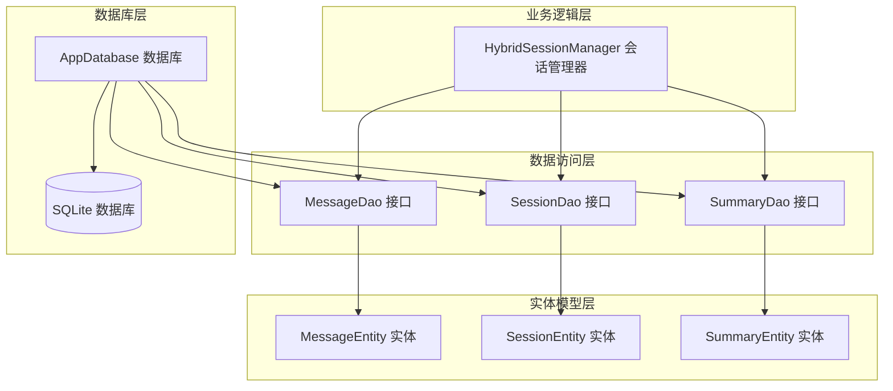

**图表来源**
- [MessageDao.kt:1-42](file://app/src/main/java/ai/openclaw/android/data/local/MessageDao.kt#L1-L42)
- [AppDatabase.kt:25-40](file://app/src/main/java/ai/openclaw/android/data/local/AppDatabase.kt#L25-L40)

**章节来源**
- [MessageDao.kt:1-42](file://app/src/main/java/ai/openclaw/android/data/local/MessageDao.kt#L1-L42)
- [AppDatabase.kt:1-158](file://app/src/main/java/ai/openclaw/android/data/local/AppDatabase.kt#L1-L158)

## 核心组件

### MessageDao 接口概述

MessageDao 接口是消息数据访问的核心抽象，定义了完整的消息 CRUD 操作和查询方法。该接口使用 Room 注解进行声明式 SQL 查询定义，并通过协程支持异步操作。

### 主要功能特性

1. **实时流查询**: 支持基于 Flow 的实时消息流监听
2. **分页查询**: 提供带偏移量和限制的分页查询能力
3. **批量操作**: 支持单条和批量消息插入
4. **条件删除**: 支持按会话、ID 列表、时间戳等多种条件删除
5. **统计查询**: 提供消息计数和 token 统计功能

**章节来源**
- [MessageDao.kt:7-42](file://app/src/main/java/ai/openclaw/android/data/local/MessageDao.kt#L7-L42)

## 架构概览

MessageDao 在整个应用程序架构中扮演着关键的数据访问层角色，连接业务逻辑层和持久化存储层。

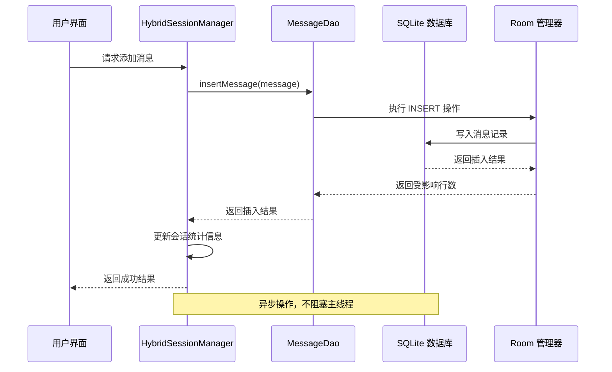

**图表来源**
- [HybridSessionManager.kt:70-110](file://app/src/main/java/ai/openclaw/android/domain/session/HybridSessionManager.kt#L70-L110)
- [MessageDao.kt:16-20](file://app/src/main/java/ai/openclaw/android/data/local/MessageDao.kt#L16-L20)

**章节来源**
- [HybridSessionManager.kt:1-457](file://app/src/main/java/ai/openclaw/android/domain/session/HybridSessionManager.kt#L1-L457)

## 详细组件分析

### 消息实体模型

MessageEntity 定义了消息在数据库中的结构，包含了所有必要的字段和关系映射。

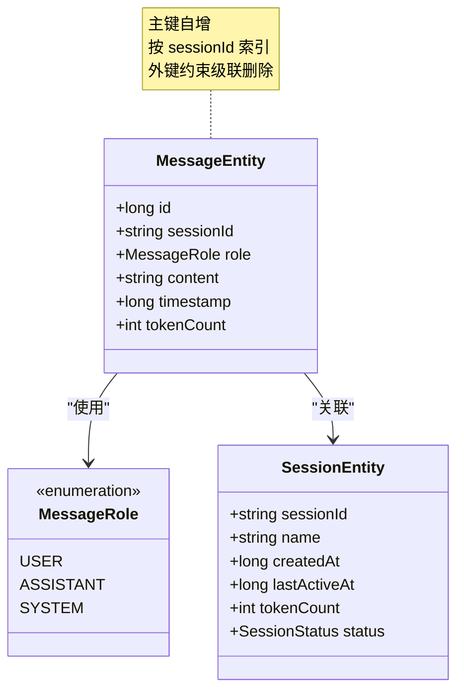

**图表来源**
- [MessageEntity.kt:18-25](file://app/src/main/java/ai/openclaw/android/data/model/MessageEntity.kt#L18-L25)
- [MessageRole.kt:3-7](file://app/src/main/java/ai/openclaw/android/data/model/MessageRole.kt#L3-L7)

#### 实体字段详细说明

| 字段名 | 类型 | 必填 | 描述 | 索引 |
|--------|------|------|------|------|
| id | Long | 否 | 消息唯一标识符，自动生成 | 主键 |
| sessionId | String | 是 | 关联的会话标识符 | 外键，普通索引 |
| role | MessageRole | 是 | 消息角色类型 | 无索引 |
| content | String | 是 | 消息内容文本 | 无索引 |
| timestamp | Long | 是 | 时间戳（毫秒） | 无索引 |
| tokenCount | Int | 是 | Token 计数 | 无索引 |

**章节来源**
- [MessageEntity.kt:1-25](file://app/src/main/java/ai/openclaw/android/data/model/MessageEntity.kt#L1-L25)
- [MessageRole.kt:1-7](file://app/src/main/java/ai/openclaw/android/data/model/MessageRole.kt#L1-L7)

### 数据库关系映射

MessageEntity 通过外键约束与 SessionEntity 建立一对多关系，实现了会话级别的消息管理。

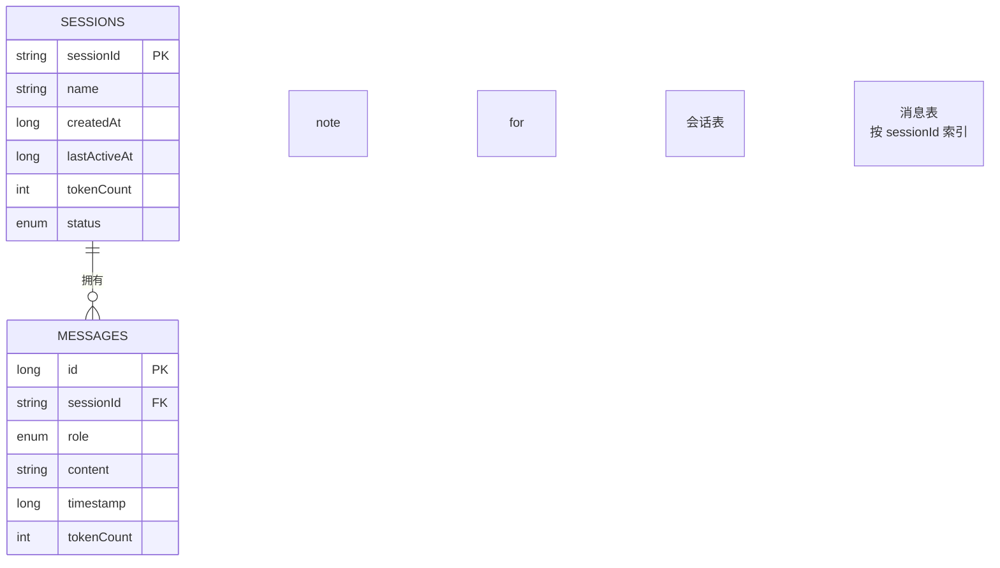

**图表来源**
- [MessageEntity.kt:8-17](file://app/src/main/java/ai/openclaw/android/data/model/MessageEntity.kt#L8-L17)
- [AppDatabase.kt:25-40](file://app/src/main/java/ai/openclaw/android/data/local/AppDatabase.kt#L25-L40)

### 查询方法详解

#### 实时流查询

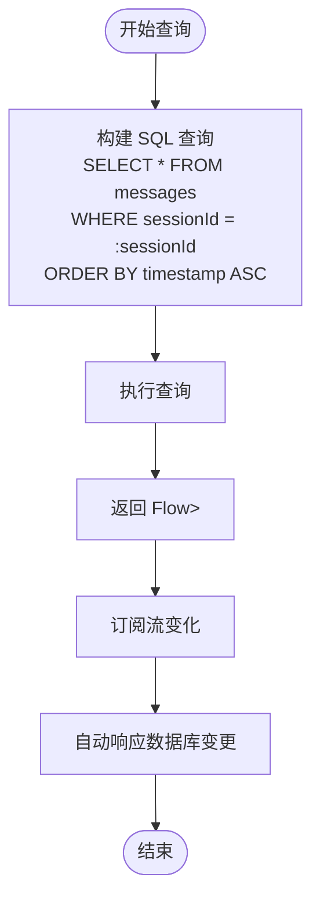

**图表来源**
- [MessageDao.kt:10-11](file://app/src/main/java/ai/openclaw/android/data/local/MessageDao.kt#L10-L11)

#### 分页查询

分页查询支持灵活的偏移量和限制参数，适用于大数据集的高效浏览。

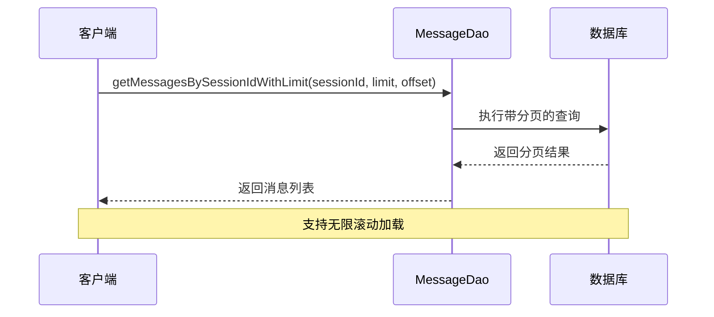

**图表来源**
- [MessageDao.kt:13-14](file://app/src/main/java/ai/openclaw/android/data/local/MessageDao.kt#L13-L14)

#### 批量操作

支持单条和批量消息插入，提高数据写入效率。

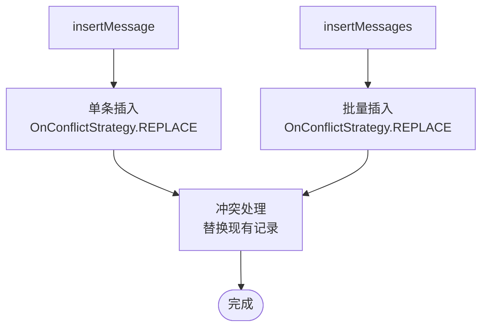

**图表来源**
- [MessageDao.kt:16-20](file://app/src/main/java/ai/openclaw/android/data/local/MessageDao.kt#L16-L20)

#### 条件删除

提供多种删除策略以满足不同的清理需求。

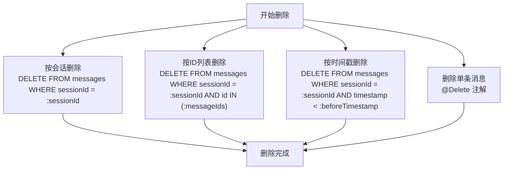

**图表来源**
- [MessageDao.kt:28-35](file://app/src/main/java/ai/openclaw/android/data/local/MessageDao.kt#L28-L35)

### 统计查询功能

MessageDao 提供了消息统计和 token 计数功能，支持会话级别的数据分析。

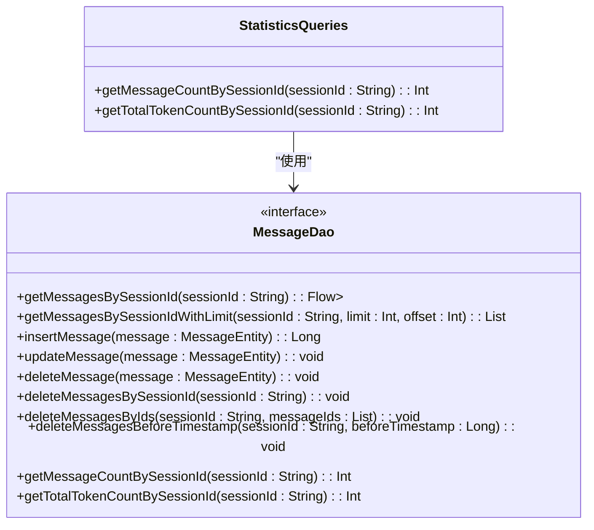

**图表来源**
- [MessageDao.kt:37-41](file://app/src/main/java/ai/openclaw/android/data/local/MessageDao.kt#L37-L41)

**章节来源**
- [MessageDao.kt:1-42](file://app/src/main/java/ai/openclaw/android/data/local/MessageDao.kt#L1-L42)

## 依赖关系分析

MessageDao 与其他组件之间的依赖关系体现了清晰的分层架构。

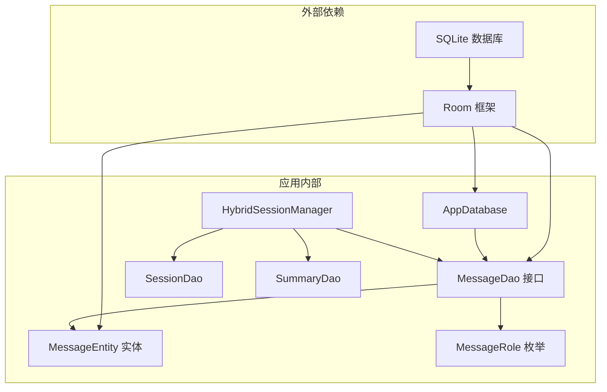

**图表来源**
- [AppDatabase.kt:31-40](file://app/src/main/java/ai/openclaw/android/data/local/AppDatabase.kt#L31-L40)
- [HybridSessionManager.kt:31-38](file://app/src/main/java/ai/openclaw/android/domain/session/HybridSessionManager.kt#L31-L38)

### 数据库初始化流程

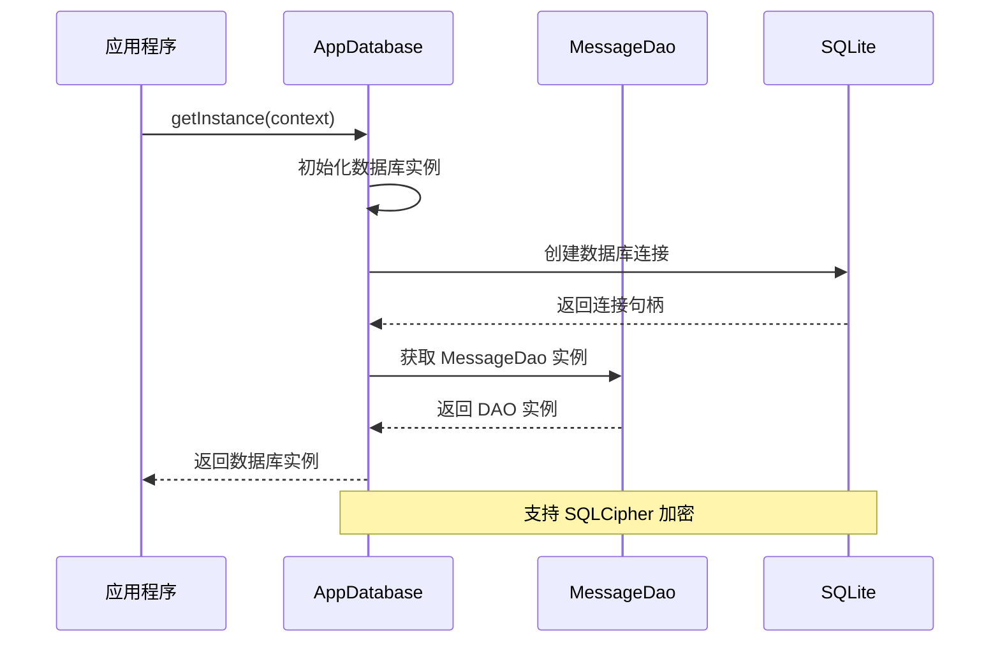

**图表来源**
- [AppDatabase.kt:52-56](file://app/src/main/java/ai/openclaw/android/data/local/AppDatabase.kt#L52-L56)
- [AppDatabase.kt:132-155](file://app/src/main/java/ai/openclaw/android/data/local/AppDatabase.kt#L132-L155)

**章节来源**
- [AppDatabase.kt:1-158](file://app/src/main/java/ai/openclaw/android/data/local/AppDatabase.kt#L1-L158)

## 性能考虑

### 查询优化策略

1. **索引设计**: `sessionId` 字段建立了普通索引，优化了按会话查询的性能
2. **流式查询**: 使用 Flow 实现响应式数据流，减少不必要的数据传输
3. **分页机制**: 支持分页查询，避免一次性加载大量数据
4. **批量操作**: 提供批量插入和更新，减少数据库往返次数

### 内存管理

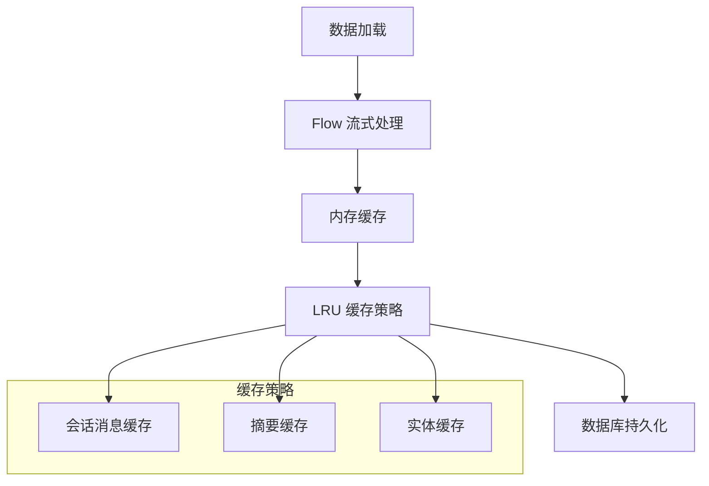

**图表来源**
- [HybridSessionManager.kt:44-47](file://app/src/main/java/ai/openclaw/android/domain/session/HybridSessionManager.kt#L44-L47)

### 并发安全

MessageDao 的设计确保了线程安全和并发访问的可靠性：

- 所有数据库操作都是异步执行
- 使用协程确保非阻塞操作
- Room 框架提供线程安全保障
- Flow 支持响应式数据流

## 故障排除指南

### 常见问题及解决方案

#### 数据库版本升级问题

当数据库版本升级时，可能出现迁移失败的情况：

1. **检查迁移脚本**: 确保所有必要的迁移步骤都已正确实现
2. **验证数据完整性**: 升级后检查数据是否完整
3. **回滚策略**: 准备降级回滚方案

#### 查询性能问题

如果查询响应缓慢，可以采取以下措施：

1. **检查索引**: 确认 `sessionId` 索引正常工作
2. **优化查询**: 使用分页查询替代全量查询
3. **监控内存**: 检查是否有内存泄漏

#### 数据一致性问题

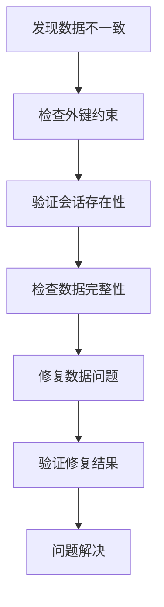

**图表来源**
- [MessageEntity.kt:10-16](file://app/src/main/java/ai/openclaw/android/data/model/MessageEntity.kt#L10-L16)

**章节来源**
- [MessageDao.kt:1-42](file://app/src/main/java/ai/openclaw/android/data/local/MessageDao.kt#L1-L42)

## 结论

MessageDao 接口为 OpenClaw 应用程序提供了强大而灵活的消息数据访问能力。通过精心设计的 API 结构、完善的实体关系映射和高效的查询优化策略，该接口能够满足复杂的消息管理需求。

### 主要优势

1. **完整的 CRUD 支持**: 提供了从基础到高级的完整数据操作能力
2. **响应式编程**: 基于 Flow 的实时数据流，提供良好的用户体验
3. **性能优化**: 通过索引、分页和批量操作优化查询性能
4. **数据完整性**: 外键约束和级联删除确保数据一致性
5. **扩展性强**: 模块化设计便于功能扩展和维护

### 未来改进方向

1. **查询优化**: 可以考虑添加更多索引以优化复杂查询
2. **缓存策略**: 进一步优化缓存机制以提升性能
3. **监控指标**: 添加更多的性能监控和诊断工具
4. **测试覆盖**: 扩大单元测试和集成测试的覆盖范围

MessageDao 接口的设计充分体现了现代 Android 应用开发的最佳实践，为消息系统的稳定运行奠定了坚实的基础。