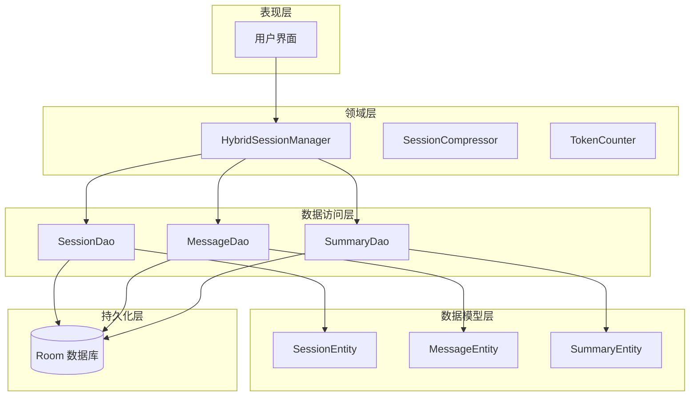
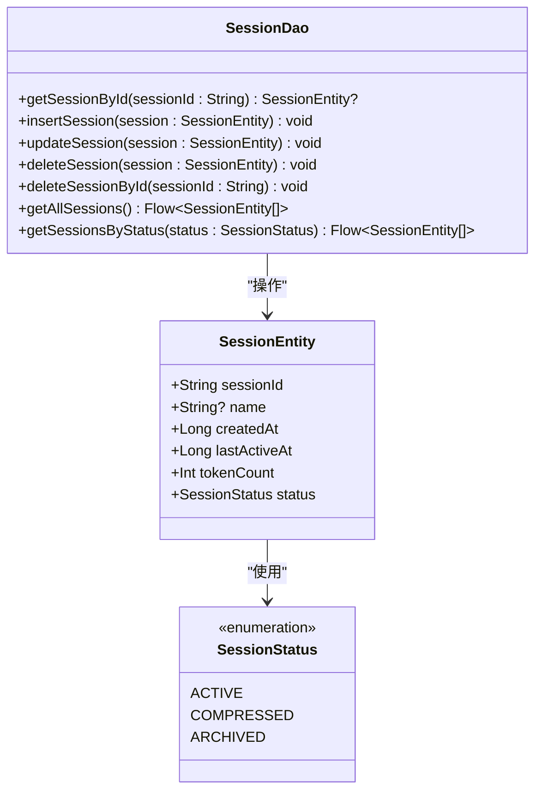
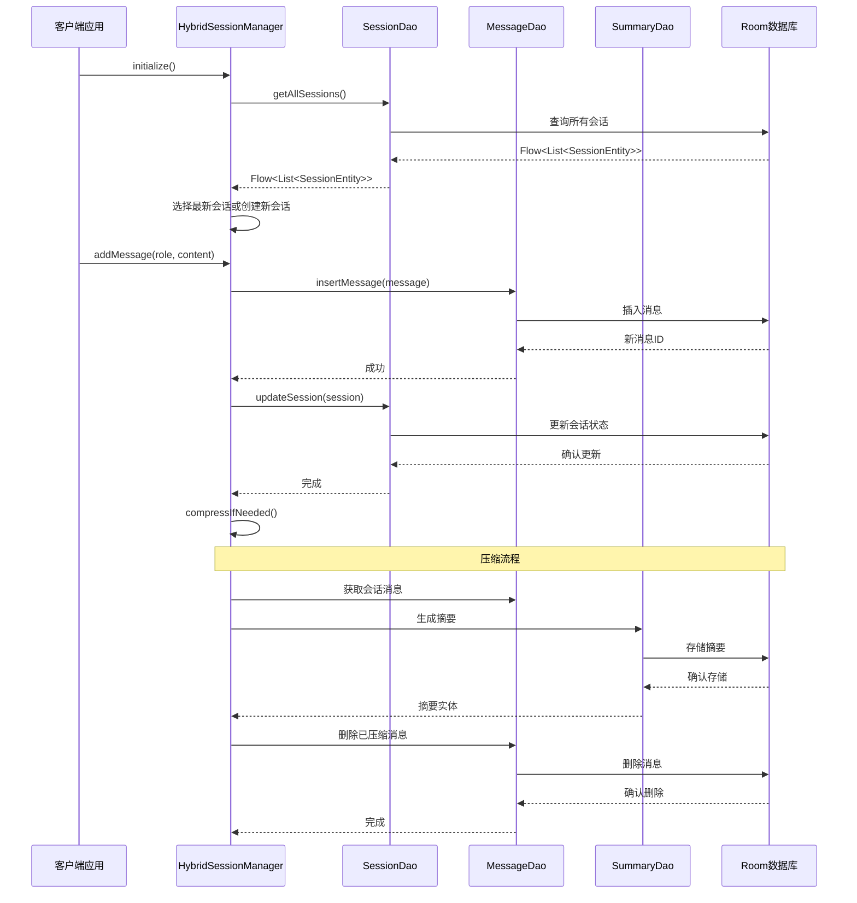
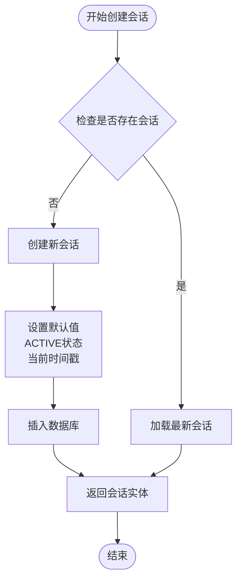
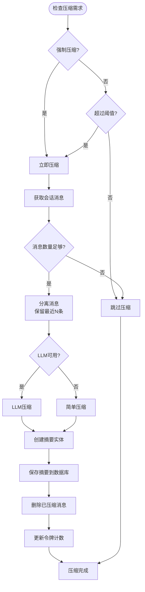
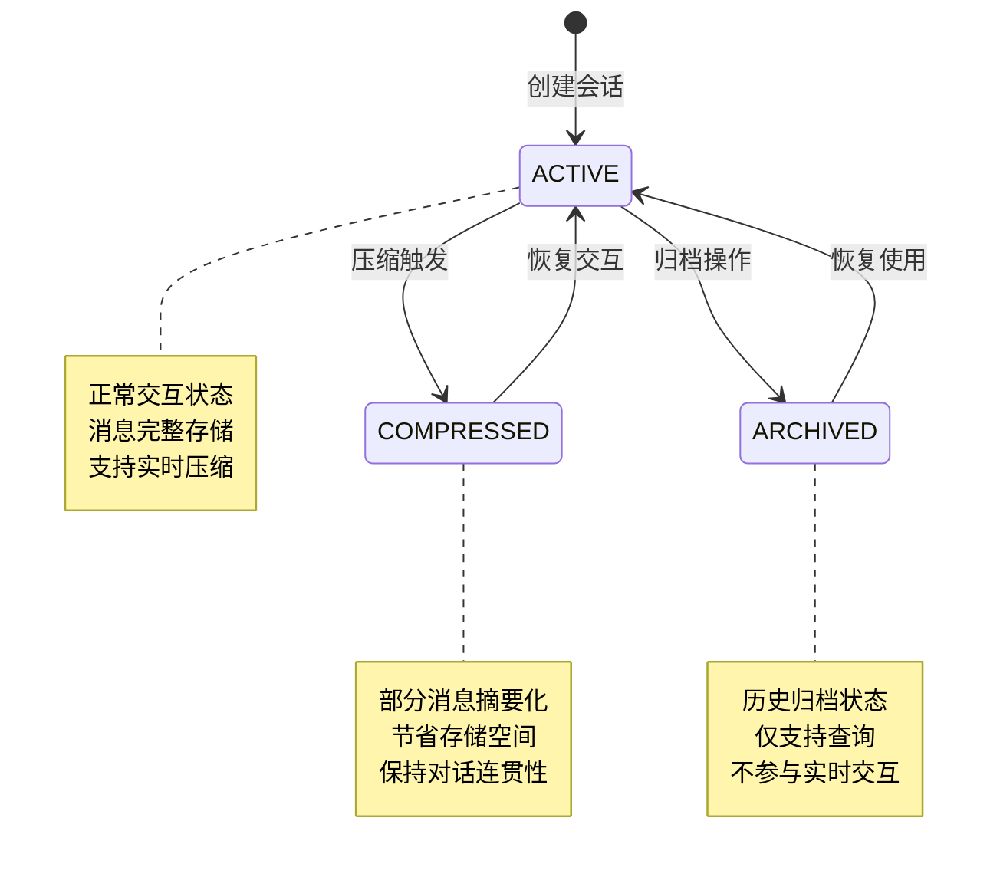
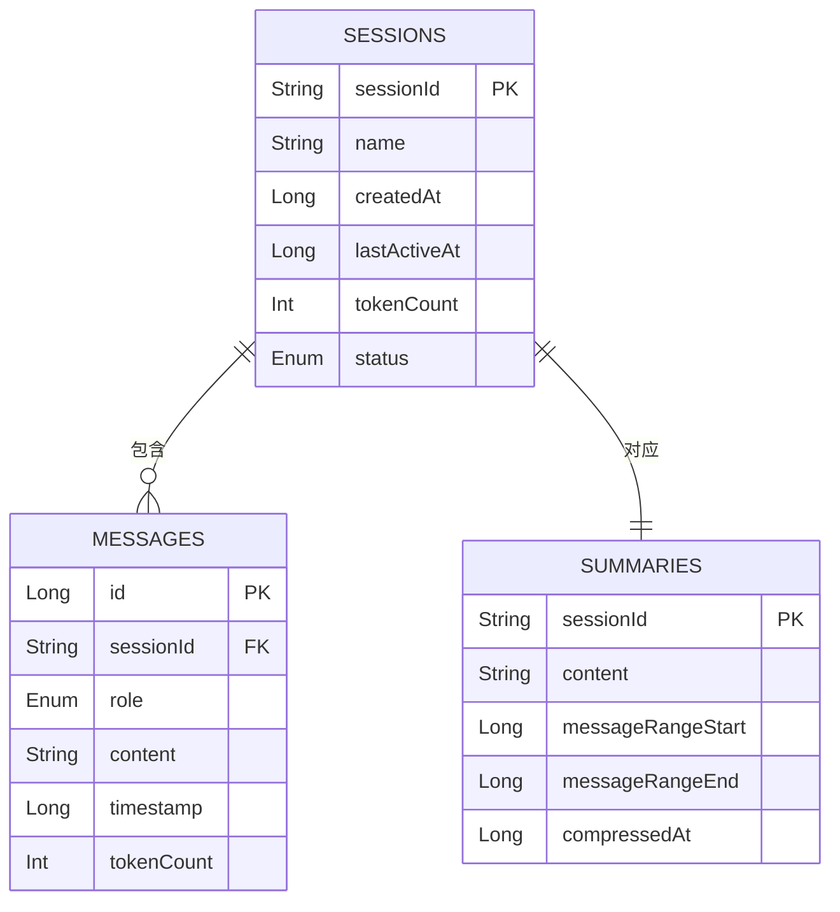
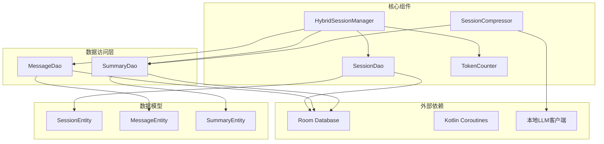

# SessionDao 接口规范

<cite>
**本文档引用的文件**
- [SessionDao.kt](file://app/src/main/java/ai/openclaw/android/data/local/SessionDao.kt)
- [SessionEntity.kt](file://app/src/main/java/ai/openclaw/android/data/model/SessionEntity.kt)
- [SessionStatus.kt](file://app/src/main/java/ai/openclaw/android/data/model/SessionStatus.kt)
- [HybridSessionManager.kt](file://app/src/main/java/ai/openclaw/android/domain/session/HybridSessionManager.kt)
- [SessionCompressor.kt](file://app/src/main/java/ai/openclaw/android/domain/session/SessionCompressor.kt)
- [MessageDao.kt](file://app/src/main/java/ai/openclaw/android/data/local/MessageDao.kt)
- [SummaryDao.kt](file://app/src/main/java/ai/openclaw/android/data/local/SummaryDao.kt)
- [SessionDaoTest.kt](file://app/src/androidTest/java/ai/openclaw/android/data/SessionDaoTest.kt)
</cite>

## 目录
1. [简介](#简介)
2. [项目结构](#项目结构)
3. [核心组件](#核心组件)
4. [架构概览](#架构概览)
5. [详细组件分析](#详细组件分析)
6. [依赖关系分析](#依赖关系分析)
7. [性能考虑](#性能考虑)
8. [故障排除指南](#故障排除指南)
9. [结论](#结论)

## 简介

SessionDao 接口是 OpenClaw-Android 项目中会话数据访问的核心抽象层，基于 Room 持久化框架实现。该接口负责管理会话实体的完整生命周期，包括创建、查询、更新和删除操作。项目采用了混合会话管理模式，结合了自动压缩和手动命名会话两种策略，通过分层压缩技术有效控制内存使用并保持对话历史的完整性。

## 项目结构

会话管理系统由多个层次组成，形成了清晰的分层架构：

**图表来源**
- [SessionDao.kt:1-31](file://app/src/main/java/ai/openclaw/android/data/local/SessionDao.kt#L1-L31)
- [HybridSessionManager.kt:1-457](file://app/src/main/java/ai/openclaw/android/domain/session/HybridSessionManager.kt#L1-L457)

**章节来源**
- [SessionDao.kt:1-31](file://app/src/main/java/ai/openclaw/android/data/local/SessionDao.kt#L1-L31)
- [SessionEntity.kt:1-14](file://app/src/main/java/ai/openclaw/android/data/model/SessionEntity.kt#L1-L14)

## 核心组件

### SessionDao 接口定义

SessionDao 是一个基于 Room 的数据访问对象，提供了会话数据的完整 CRUD 操作：

**图表来源**
- [SessionDao.kt:8-31](file://app/src/main/java/ai/openclaw/android/data/local/SessionDao.kt#L8-L31)
- [SessionEntity.kt:6-14](file://app/src/main/java/ai/openclaw/android/data/model/SessionEntity.kt#L6-L14)
- [SessionStatus.kt:3-7](file://app/src/main/java/ai/openclaw/android/data/model/SessionStatus.kt#L3-L7)

### 会话实体状态管理

会话实体采用三状态管理模式，每种状态代表不同的会话生命周期阶段：

| 状态 | 描述 | 特征 | 典型操作 |
|------|------|------|----------|
| ACTIVE | 活跃会话 | 正常交互，消息完整存储 | 添加消息、更新活跃时间 |
| COMPRESSED | 已压缩会话 | 部分消息被摘要替代，节省存储 | 恢复摘要、继续交互 |
| ARCHIVED | 已归档会话 | 不再活跃，仅用于历史检索 | 查询历史、恢复使用 |

**章节来源**
- [SessionEntity.kt:7-14](file://app/src/main/java/ai/openclaw/android/data/model/SessionEntity.kt#L7-L14)
- [SessionStatus.kt:3-7](file://app/src/main/java/ai/openclaw/android/data/model/SessionStatus.kt#L3-L7)

## 架构概览

会话管理系统采用混合架构设计，结合了自动压缩和手动管理两种策略：

**图表来源**
- [HybridSessionManager.kt:59-110](file://app/src/main/java/ai/openclaw/android/domain/session/HybridSessionManager.kt#L59-L110)
- [SessionCompressor.kt:18-60](file://app/src/main/java/ai/openclaw/android/domain/session/SessionCompressor.kt#L18-L60)

## 详细组件分析

### 会话创建与初始化

会话创建过程遵循以下流程：

**图表来源**
- [HybridSessionManager.kt:612-651](file://app/src/main/java/ai/openclaw/android/domain/session/HybridSessionManager.kt#L612-L651)

### 会话压缩机制

会话压缩采用分层策略，平衡存储效率和信息完整性：

**图表来源**
- [HybridSessionManager.kt:236-299](file://app/src/main/java/ai/openclaw/android/domain/session/HybridSessionManager.kt#L236-L299)
- [SessionCompressor.kt:18-60](file://app/src/main/java/ai/openclaw/android/domain/session/SessionCompressor.kt#L18-L60)

### 会话状态转换流程

会话状态在不同操作间动态转换：

**图表来源**
- [SessionStatus.kt:3-7](file://app/src/main/java/ai/openclaw/android/data/model/SessionStatus.kt#L3-L7)
- [SessionEntity.kt:12-13](file://app/src/main/java/ai/openclaw/android/data/model/SessionEntity.kt#L12-L13)

### 会话查询接口规范

会话查询支持多种维度的筛选和排序：

| 查询类型 | SQL语句 | 参数 | 返回值 | 用途 |
|----------|---------|------|--------|------|
| 按ID查询 | `SELECT * FROM sessions WHERE sessionId = ?` | sessionId: String | SessionEntity? | 单个会话详情 |
| 全部查询 | `SELECT * FROM sessions ORDER BY lastActiveAt DESC` | 无 | Flow<List<SessionEntity>> | 会话列表展示 |
| 按状态查询 | `SELECT * FROM sessions WHERE status = ? ORDER BY lastActiveAt DESC` | status: SessionStatus | Flow<List<SessionEntity>> | 状态筛选 |

**章节来源**
- [SessionDao.kt:11-31](file://app/src/main/java/ai/openclaw/android/data/local/SessionDao.kt#L11-L31)

### 会话数据操作规范

所有会话操作均遵循幂等性和事务性原则：

**图表来源**
- [SessionEntity.kt:6-14](file://app/src/main/java/ai/openclaw/android/data/model/SessionEntity.kt#L6-L14)
- [MessageDao.kt:10-11](file://app/src/main/java/ai/openclaw/android/data/local/MessageDao.kt#L10-L11)
- [SummaryDao.kt:10-11](file://app/src/main/java/ai/openclaw/android/data/local/SummaryDao.kt#L10-L11)

**章节来源**
- [MessageDao.kt:1-42](file://app/src/main/java/ai/openclaw/android/data/local/MessageDao.kt#L1-L42)
- [SummaryDao.kt:1-27](file://app/src/main/java/ai/openclaw/android/data/local/SummaryDao.kt#L1-L27)

## 依赖关系分析

会话管理系统各组件间的依赖关系如下：

**图表来源**
- [HybridSessionManager.kt:31-38](file://app/src/main/java/ai/openclaw/android/domain/session/HybridSessionManager.kt#L31-L38)
- [SessionCompressor.kt:13-17](file://app/src/main/java/ai/openclaw/android/domain/session/SessionCompressor.kt#L13-L17)

**章节来源**
- [HybridSessionManager.kt:1-457](file://app/src/main/java/ai/openclaw/android/domain/session/HybridSessionManager.kt#L1-L457)
- [SessionCompressor.kt:1-83](file://app/src/main/java/ai/openclaw/android/domain/session/SessionCompressor.kt#L1-L83)

## 性能考虑

### 查询优化策略

1. **索引设计**: 基于 `sessionId` 和 `lastActiveAt` 字段建立复合索引
2. **流式查询**: 使用 Flow 对象实现实时数据更新
3. **分页支持**: 提供 `getMessagesBySessionIdWithLimit` 方法支持大数据集分页
4. **状态过滤**: 通过 `getSessionsByStatus` 减少不必要的数据传输

### 压缩性能优化

1. **增量压缩**: 通过 `generateSummary` 支持旧摘要与新内容的增量合并
2. **LLM超时控制**: 设置30秒超时防止长时间阻塞
3. **简单回退**: LLM不可用时自动降级为简单摘要算法
4. **批量操作**: 合并删除操作减少数据库往返次数

### 内存管理

1. **LRU缓存**: 会话摘要使用LinkedHashMap实现LRU缓存
2. **流式处理**: 大数据集查询使用Flow避免内存峰值
3. **及时释放**: 压缩完成后立即清理临时数据结构

## 故障排除指南

### 常见问题及解决方案

| 问题类型 | 症状 | 可能原因 | 解决方案 |
|----------|------|----------|----------|
| 会话创建失败 | IllegalStateException | 数据库连接异常 | 检查AppDatabase初始化 |
| 压缩操作超时 | TimeoutException | LLM模型加载失败 | 检查模型文件完整性 |
| 查询结果为空 | Flow<List<SessionEntity>>为空 | 会话不存在或状态不符 | 验证会话ID和状态 |
| 内存泄漏 | OOM错误 | Flow订阅未正确取消 | 确保在适当生命周期取消订阅 |

### 调试建议

1. **日志监控**: 在关键操作点添加日志记录
2. **单元测试**: 使用SessionDaoTest验证基本CRUD操作
3. **性能分析**: 监控数据库查询时间和内存使用
4. **状态检查**: 定期验证会话状态转换的正确性

**章节来源**
- [SessionDaoTest.kt:1-154](file://app/src/androidTest/java/ai/openclaw/android/data/SessionDaoTest.kt#L1-L154)

## 结论

SessionDao 接口为 OpenClaw-Android 项目提供了完整的会话数据管理能力。通过混合会话管理模式和分层压缩技术，系统在保证用户体验的同时有效控制了资源消耗。接口设计遵循了良好的软件工程原则，具有清晰的职责分离、良好的扩展性和完善的错误处理机制。

未来可以考虑的功能增强包括：
- 添加会话统计查询接口
- 实现会话清理和归档功能
- 提供会话数据备份和恢复机制
- 增强会话状态转换的事务性保证

这些改进将进一步提升系统的稳定性和可维护性，为用户提供更加流畅的会话体验。