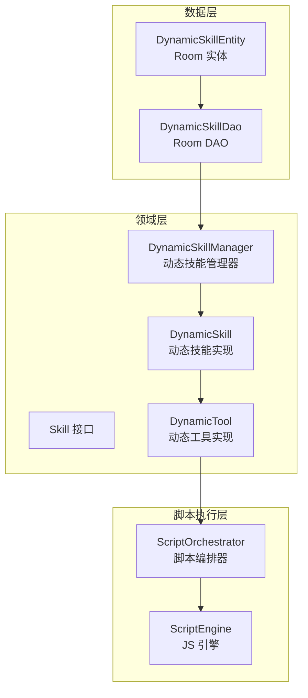
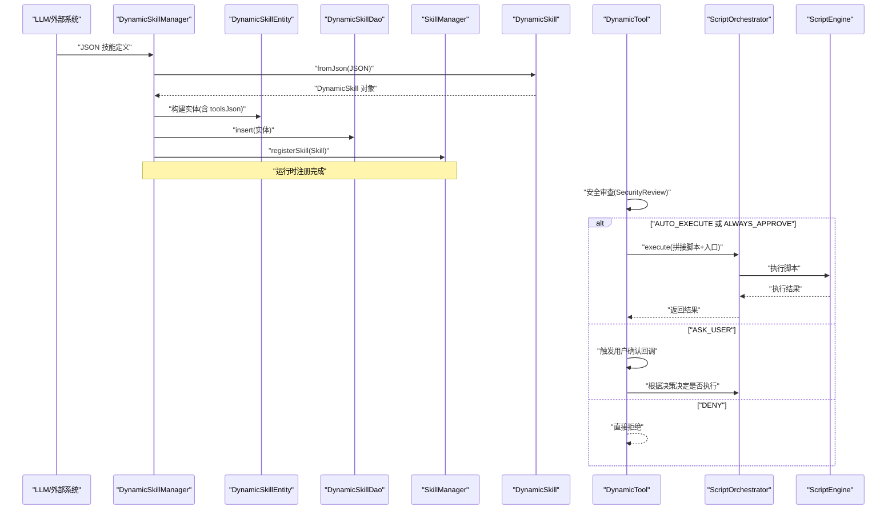
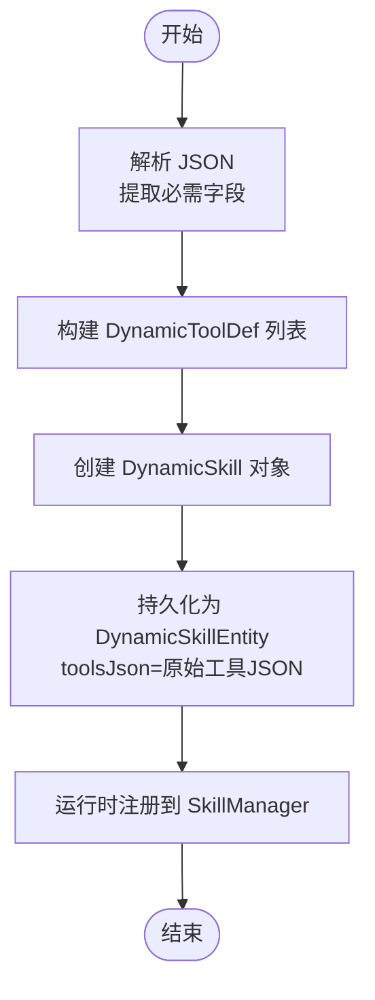
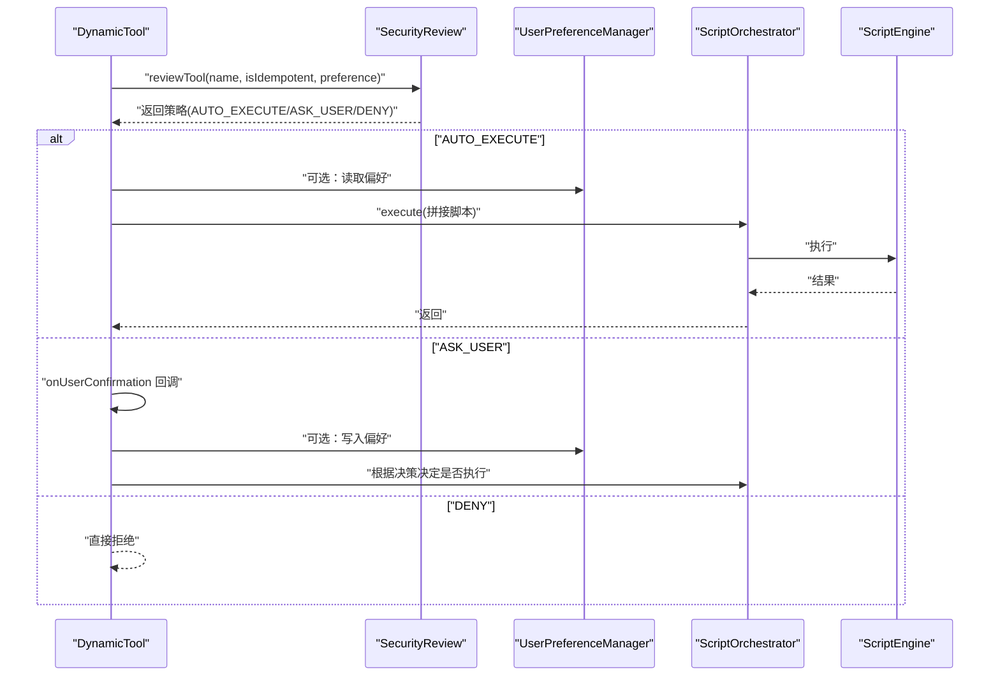
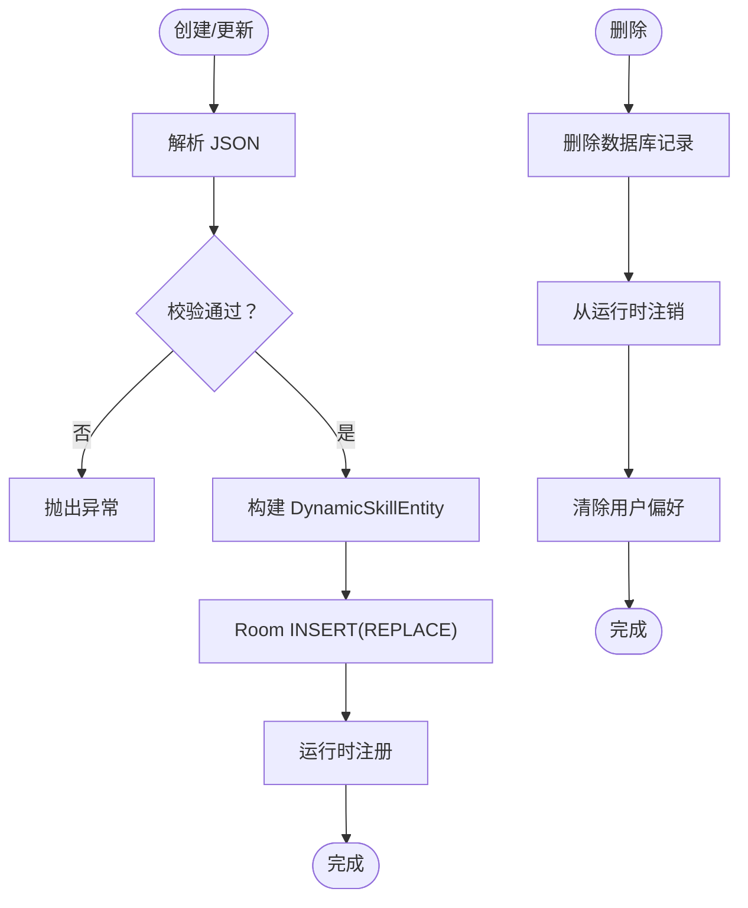
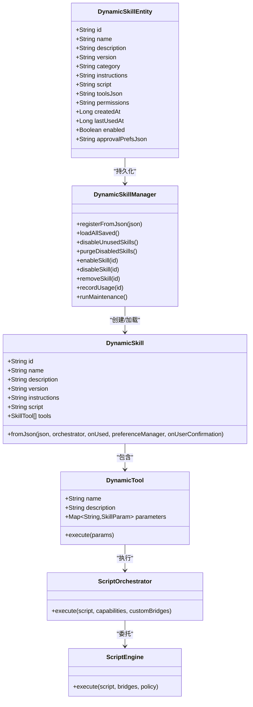

# DynamicSkillEntity 数据模型

<cite>
**本文引用的文件**
- [DynamicSkillEntity.kt](file://app/src/main/java/ai/openclaw/android/data/model/DynamicSkillEntity.kt)
- [DynamicSkill.kt](file://app/src/main/java/ai/openclaw/android/skill/DynamicSkill.kt)
- [DynamicSkillManager.kt](file://app/src/main/java/ai/openclaw/android/skill/DynamicSkillManager.kt)
- [DynamicSkillDao.kt](file://app/src/main/java/ai/openclaw/android/data/local/DynamicSkillDao.kt)
- [Skill.kt](file://app/src/main/java/ai/openclaw/android/skill/Skill.kt)
- [SkillTool.kt](file://app/src/main/java/ai/openclaw/android/skill/SkillTool.kt)
- [ToolSecurityPolicy.kt](file://app/src/main/java/ai/openclaw/android/skill/ToolSecurityPolicy.kt)
- [UserPreferenceManager.kt](file://app/src/main/java/ai/openclaw/android/skill/UserPreferenceManager.kt)
- [ScriptOrchestrator.kt](file://script/src/main/java/ai/openclaw/script/ScriptOrchestrator.kt)
- [ScriptEngine.kt](file://script/src/main/java/ai/openclaw/script/ScriptEngine.kt)
- [DynamicSkillTest.kt](file://app/src/test/java/ai/openclaw/android/skill/DynamicSkillTest.kt)
- [DynamicSkillManagerTest.kt](file://app/src/test/java/ai/openclaw/android/skill/DynamicSkillManagerTest.kt)
- [DynamicSkillDaoTest.kt](file://app/src/androidTest/java/ai/openclaw/android/data/DynamicSkillDaoTest.kt)
- [DynamicSkillIntegrationTest.kt](file://app/src/test/java/ai/openclaw/android/skill/DynamicSkillIntegrationTest.kt)
</cite>

## 目录
1. [简介](#简介)
2. [项目结构](#项目结构)
3. [核心组件](#核心组件)
4. [架构总览](#架构总览)
5. [详细组件分析](#详细组件分析)
6. [依赖关系分析](#依赖关系分析)
7. [性能考量](#性能考量)
8. [故障排查指南](#故障排查指南)
9. [结论](#结论)
10. [附录](#附录)

## 简介
本文件为 DynamicSkillEntity 数据模型的详细API文档，覆盖以下主题：
- DynamicSkillEntity 的字段定义与语义
- 动态技能的存储结构与执行机制
- 技能代码的序列化与反序列化流程
- 动态技能的创建、更新、删除操作示例
- 技能参数验证与安全检查实现
- 版本管理与兼容性处理

## 项目结构
DynamicSkillEntity 属于数据层模型，配合 Skill 接口体系与 ScriptOrchestrator 执行引擎共同构成动态技能的完整生命周期。

**图表来源**
- [DynamicSkillEntity.kt:1-22](file://app/src/main/java/ai/openclaw/android/data/model/DynamicSkillEntity.kt#L1-L22)
- [DynamicSkillDao.kt:1-47](file://app/src/main/java/ai/openclaw/android/data/local/DynamicSkillDao.kt#L1-L47)
- [Skill.kt:1-13](file://app/src/main/java/ai/openclaw/android/skill/Skill.kt#L1-L13)
- [DynamicSkill.kt:1-221](file://app/src/main/java/ai/openclaw/android/skill/DynamicSkill.kt#L1-L221)
- [DynamicSkillManager.kt:1-202](file://app/src/main/java/ai/openclaw/android/skill/DynamicSkillManager.kt#L1-L202)
- [ScriptOrchestrator.kt:1-55](file://script/src/main/java/ai/openclaw/script/ScriptOrchestrator.kt#L1-L55)
- [ScriptEngine.kt:1-231](file://script/src/main/java/ai/openclaw/script/ScriptEngine.kt#L1-L231)

**章节来源**
- [DynamicSkillEntity.kt:1-22](file://app/src/main/java/ai/openclaw/android/data/model/DynamicSkillEntity.kt#L1-L22)
- [DynamicSkillDao.kt:1-47](file://app/src/main/java/ai/openclaw/android/data/local/DynamicSkillDao.kt#L1-L47)

## 核心组件
- DynamicSkillEntity：Room 实体，持久化动态技能的元数据与脚本定义
- DynamicSkill：从 JSON 反序列化得到的技能对象，封装工具定义与执行入口
- DynamicTool：将工具调用路由至 ScriptOrchestrator 的适配器
- DynamicSkillManager：负责技能的注册、加载、启用/停用/删除、使用记录与定时维护
- ScriptOrchestrator/ScriptEngine：JS 脚本执行与沙箱能力注入
- Skill/SkillTool：技能与工具的抽象接口
- ToolSecurityPolicy/UserPreferenceManager：安全策略与用户偏好持久化

**章节来源**
- [DynamicSkillEntity.kt:1-22](file://app/src/main/java/ai/openclaw/android/data/model/DynamicSkillEntity.kt#L1-L22)
- [DynamicSkill.kt:1-221](file://app/src/main/java/ai/openclaw/android/skill/DynamicSkill.kt#L1-L221)
- [DynamicSkillManager.kt:1-202](file://app/src/main/java/ai/openclaw/android/skill/DynamicSkillManager.kt#L1-L202)
- [Skill.kt:1-13](file://app/src/main/java/ai/openclaw/android/skill/Skill.kt#L1-L13)
- [SkillTool.kt:1-22](file://app/src/main/java/ai/openclaw/android/skill/SkillTool.kt#L1-L22)
- [ToolSecurityPolicy.kt:1-72](file://app/src/main/java/ai/openclaw/android/skill/ToolSecurityPolicy.kt#L1-L72)
- [UserPreferenceManager.kt:1-100](file://app/src/main/java/ai/openclaw/android/skill/UserPreferenceManager.kt#L1-L100)
- [ScriptOrchestrator.kt:1-55](file://script/src/main/java/ai/openclaw/script/ScriptOrchestrator.kt#L1-L55)
- [ScriptEngine.kt:1-231](file://script/src/main/java/ai/openclaw/script/ScriptEngine.kt#L1-L231)

## 架构总览
动态技能从 LLM 生成的 JSON 开始，经由 DynamicSkill.fromJson 解析为内存对象；同时持久化为 DynamicSkillEntity；运行时通过 DynamicSkillManager 注册到 SkillManager；工具调用时由 DynamicTool 安全审查后交由 ScriptOrchestrator 执行 JS 脚本。

**图表来源**
- [DynamicSkillManager.kt:63-96](file://app/src/main/java/ai/openclaw/android/skill/DynamicSkillManager.kt#L63-L96)
- [DynamicSkill.kt:48-108](file://app/src/main/java/ai/openclaw/android/skill/DynamicSkill.kt#L48-L108)
- [DynamicSkillEntity.kt:7-21](file://app/src/main/java/ai/openclaw/android/data/model/DynamicSkillEntity.kt#L7-L21)
- [DynamicSkillDao.kt:15-16](file://app/src/main/java/ai/openclaw/android/data/local/DynamicSkillDao.kt#L15-L16)
- [DynamicSkill.kt:153-193](file://app/src/main/java/ai/openclaw/android/skill/DynamicSkill.kt#L153-L193)
- [ScriptOrchestrator.kt:31-39](file://script/src/main/java/ai/openclaw/script/ScriptOrchestrator.kt#L31-L39)
- [ScriptEngine.kt:45-99](file://script/src/main/java/ai/openclaw/script/ScriptEngine.kt#L45-L99)

## 详细组件分析

### DynamicSkillEntity 数据模型
- 表名：dynamic_skills
- 字段定义与语义
  - id：技能唯一标识（主键）
  - name：技能名称
  - description：技能描述
  - version：技能版本（默认 1.0.0）
  - category：分类，默认 custom
  - instructions：技能使用说明（Markdown）
  - script：JS 脚本源码
  - toolsJson：工具定义 JSON 数组（持久化用）
  - permissions：所需权限，逗号分隔
  - createdAt：创建时间戳（毫秒）
  - lastUsedAt：上次使用时间戳（毫秒），0 表示未使用
  - enabled：启用状态
  - approvalPrefsJson：用户审批偏好 JSON（预留）

- 存储约束与查询
  - Room 实体映射，支持按 enabled 查询、按 id 删除、按阈值筛选未使用/已停用技能、更新 lastUsedAt、启用/停用等

**章节来源**
- [DynamicSkillEntity.kt:6-21](file://app/src/main/java/ai/openclaw/android/data/model/DynamicSkillEntity.kt#L6-L21)
- [DynamicSkillDao.kt:9-46](file://app/src/main/java/ai/openclaw/android/data/local/DynamicSkillDao.kt#L9-L46)

### 动态技能的序列化与反序列化
- 序列化（持久化）
  - DynamicSkillManager.registerFromJson 中，将 DynamicSkill 的工具定义序列化为 JSON 字符串写入 toolsJson 字段，并插入数据库
- 反序列化（加载）
  - DynamicSkill.fromJson 从 JSON 解析 id/name/description/version/instructions/script/tools
  - tools 中的每个工具解析为 DynamicToolDef，包含 name/description/parameters/entryPoint/isIdempotent
  - DynamicToolDef 再映射为 DynamicTool 列表，作为技能的工具集合

**图表来源**
- [DynamicSkillManager.kt:72-85](file://app/src/main/java/ai/openclaw/android/skill/DynamicSkillManager.kt#L72-L85)
- [DynamicSkill.kt:54-107](file://app/src/main/java/ai/openclaw/android/skill/DynamicSkill.kt#L54-L107)

**章节来源**
- [DynamicSkillManager.kt:72-85](file://app/src/main/java/ai/openclaw/android/skill/DynamicSkillManager.kt#L72-L85)
- [DynamicSkill.kt:54-107](file://app/src/main/java/ai/openclaw/android/skill/DynamicSkill.kt#L54-L107)

### 动态技能的执行机制
- 工具调用链路
  - DynamicTool.execute：先进行安全审查（幂等性、用户偏好、用户确认）
  - 若策略允许，拼接脚本并在 ScriptOrchestrator 中执行
  - ScriptEngine 支持 QuickJS 与 Rhino 双引擎回退，具备超时控制与缓存
- 能力注入
  - ScriptOrchestrator 根据 capabilities 注入 fs/http 等桥接能力

**图表来源**
- [DynamicSkill.kt:153-193](file://app/src/main/java/ai/openclaw/android/skill/DynamicSkill.kt#L153-L193)
- [ToolSecurityPolicy.kt:44-71](file://app/src/main/java/ai/openclaw/android/skill/ToolSecurityPolicy.kt#L44-L71)
- [UserPreferenceManager.kt:34-52](file://app/src/main/java/ai/openclaw/android/skill/UserPreferenceManager.kt#L34-L52)
- [ScriptOrchestrator.kt:31-39](file://script/src/main/java/ai/openclaw/script/ScriptOrchestrator.kt#L31-L39)
- [ScriptEngine.kt:45-99](file://script/src/main/java/ai/openclaw/script/ScriptEngine.kt#L45-L99)

**章节来源**
- [DynamicSkill.kt:153-219](file://app/src/main/java/ai/openclaw/android/skill/DynamicSkill.kt#L153-L219)
- [ToolSecurityPolicy.kt:44-71](file://app/src/main/java/ai/openclaw/android/skill/ToolSecurityPolicy.kt#L44-L71)
- [UserPreferenceManager.kt:34-52](file://app/src/main/java/ai/openclaw/android/skill/UserPreferenceManager.kt#L34-L52)
- [ScriptOrchestrator.kt:31-39](file://script/src/main/java/ai/openclaw/script/ScriptOrchestrator.kt#L31-L39)
- [ScriptEngine.kt:45-99](file://script/src/main/java/ai/openclaw/script/ScriptEngine.kt#L45-L99)

### 动态技能的创建、更新与删除

- 创建（注册）
  - 输入：技能 JSON（包含 id/name/description/version/instructions/script/tools）
  - 流程：解析 JSON → 构建 DynamicSkill → 持久化为 DynamicSkillEntity → 运行时注册
  - 关键点：缺失必需字段会抛出异常；toolsJson 保存原始工具定义；注册时 lastUsedAt 设置为当前时间
- 更新
  - 通过 REPLACE 插入实现同 id 替换；version 字段可用于业务层面的版本识别
- 删除
  - removeSkill：从数据库、运行时、用户偏好中彻底移除
  - disableUnusedSkills/purgeDisabledSkills：基于 lastUsedAt 的自动停用与清理

**图表来源**
- [DynamicSkillManager.kt:63-96](file://app/src/main/java/ai/openclaw/android/skill/DynamicSkillManager.kt#L63-L96)
- [DynamicSkillDao.kt:15-16](file://app/src/main/java/ai/openclaw/android/data/local/DynamicSkillDao.kt#L15-L16)
- [DynamicSkillManager.kt:152-157](file://app/src/main/java/ai/openclaw/android/skill/DynamicSkillManager.kt#L152-L157)

**章节来源**
- [DynamicSkillManager.kt:63-96](file://app/src/main/java/ai/openclaw/android/skill/DynamicSkillManager.kt#L63-L96)
- [DynamicSkillDao.kt:15-16](file://app/src/main/java/ai/openclaw/android/data/local/DynamicSkillDao.kt#L15-L16)
- [DynamicSkillManager.kt:152-157](file://app/src/main/java/ai/openclaw/android/skill/DynamicSkillManager.kt#L152-L157)

### 技能参数验证与安全检查
- 参数定义
  - SkillParam：type/description/required/default
  - DynamicToolDef.parameters 映射为 Map<String, SkillParam>
- 安全策略
  - 幂等操作（isIdempotent=true）：自动执行
  - 无历史偏好：首次询问用户
  - 有历史偏好：按 ALWAYS_APPROVE/ALWAYS_DENY/ASK_EVERY_TIME 处理
- 用户偏好持久化
  - UserPreferenceManager 使用 JSON 文件存储，支持增删改查与批量清空

**章节来源**
- [SkillTool.kt:11-22](file://app/src/main/java/ai/openclaw/android/skill/SkillTool.kt#L11-L22)
- [DynamicSkill.kt:75-101](file://app/src/main/java/ai/openclaw/android/skill/DynamicSkill.kt#L75-L101)
- [ToolSecurityPolicy.kt:44-71](file://app/src/main/java/ai/openclaw/android/skill/ToolSecurityPolicy.kt#L44-L71)
- [UserPreferenceManager.kt:34-52](file://app/src/main/java/ai/openclaw/android/skill/UserPreferenceManager.kt#L34-L52)

### 版本管理与兼容性
- version 字段默认 1.0.0，若 JSON 缺失则回退
- DynamicSkill.fromJson 对缺失字段提供默认值，提升兼容性
- DynamicSkillManager 在启用/加载时仅依赖 toolsJson 与基础元数据，便于后续扩展

**章节来源**
- [DynamicSkill.kt:68-69](file://app/src/main/java/ai/openclaw/android/skill/DynamicSkill.kt#L68-L69)
- [DynamicSkillManager.kt:172-178](file://app/src/main/java/ai/openclaw/android/skill/DynamicSkillManager.kt#L172-L178)

## 依赖关系分析

**图表来源**
- [DynamicSkillEntity.kt:7-21](file://app/src/main/java/ai/openclaw/android/data/model/DynamicSkillEntity.kt#L7-L21)
- [DynamicSkill.kt:22-38](file://app/src/main/java/ai/openclaw/android/skill/DynamicSkill.kt#L22-L38)
- [DynamicSkillManager.kt:22-29](file://app/src/main/java/ai/openclaw/android/skill/DynamicSkillManager.kt#L22-L29)
- [ScriptOrchestrator.kt:13-39](file://script/src/main/java/ai/openclaw/script/ScriptOrchestrator.kt#L13-L39)
- [ScriptEngine.kt:22-49](file://script/src/main/java/ai/openclaw/script/ScriptEngine.kt#L22-L49)

**章节来源**
- [DynamicSkillEntity.kt:7-21](file://app/src/main/java/ai/openclaw/android/data/model/DynamicSkillEntity.kt#L7-L21)
- [DynamicSkill.kt:22-38](file://app/src/main/java/ai/openclaw/android/skill/DynamicSkill.kt#L22-L38)
- [DynamicSkillManager.kt:22-29](file://app/src/main/java/ai/openclaw/android/skill/DynamicSkillManager.kt#L22-L29)
- [ScriptOrchestrator.kt:13-39](file://script/src/main/java/ai/openclaw/script/ScriptOrchestrator.kt#L13-L39)
- [ScriptEngine.kt:22-49](file://script/src/main/java/ai/openclaw/script/ScriptEngine.kt#L22-L49)

## 性能考量
- 脚本执行缓存：ScriptEngine 维护脚本哈希到执行耗时的缓存，命中时直接返回缓存结果
- 双引擎回退：QuickJS 不可用时自动切换到 Rhino，保障可用性
- 超时控制：执行超时统一由 SandboxPolicy 控制，防止长时间阻塞
- IO 并发：DynamicSkillManager 使用 IO 协程调度执行数据库与注册操作

**章节来源**
- [ScriptEngine.kt:33-87](file://script/src/main/java/ai/openclaw/script/ScriptEngine.kt#L33-L87)
- [ScriptEngine.kt:120-142](file://script/src/main/java/ai/openclaw/script/ScriptEngine.kt#L120-L142)
- [ScriptEngine.kt:144-209](file://script/src/main/java/ai/openclaw/script/ScriptEngine.kt#L144-L209)
- [DynamicSkillManager.kt:36-36](file://app/src/main/java/ai/openclaw/android/skill/DynamicSkillManager.kt#L36-L36)

## 故障排查指南
- 注册失败
  - 现象：registerFromJson 返回失败
  - 原因：JSON 缺少 id/tools 或解析异常
  - 处理：检查 JSON 结构与必需字段
- 加载失败
  - 现象：loadAllSaved 跳过某些技能
  - 原因：toolsJson 无效或技能定义错误
  - 处理：修正 toolsJson 或删除错误条目
- 工具执行失败
  - 现象：DynamicTool.execute 返回错误
  - 原因：脚本执行异常、超时、权限不足
  - 处理：查看 ScriptEngine 统计与日志，确认 capabilities 注入与脚本合法性
- 安全策略问题
  - 现象：工具被拒绝或频繁弹窗
  - 原因：用户偏好配置不当
  - 处理：通过 UserPreferenceManager 清理或调整偏好

**章节来源**
- [DynamicSkillManagerTest.kt:76-98](file://app/src/test/java/ai/openclaw/android/skill/DynamicSkillManagerTest.kt#L76-L98)
- [DynamicSkillDaoTest.kt:132-153](file://app/src/androidTest/java/ai/openclaw/android/data/DynamicSkillDaoTest.kt#L132-L153)
- [DynamicSkillTest.kt:106-143](file://app/src/test/java/ai/openclaw/android/skill/DynamicSkillTest.kt#L106-L143)
- [ScriptEngine.kt:61-66](file://script/src/main/java/ai/openclaw/script/ScriptEngine.kt#L61-L66)
- [DynamicSkill.kt:195-219](file://app/src/main/java/ai/openclaw/android/skill/DynamicSkill.kt#L195-L219)

## 结论
DynamicSkillEntity 以简洁的字段设计承载动态技能的元数据与脚本定义，结合 DynamicSkill 的 JSON 反序列化、DynamicSkillManager 的生命周期管理、以及 ScriptOrchestrator 的安全执行，形成了完整的动态技能体系。通过幂等性判断、用户偏好与能力注入，系统在灵活性与安全性之间取得平衡。

## 附录

### API 一览（方法与用途）
- DynamicSkill.fromJson：从 JSON 构建动态技能对象
- DynamicSkillManager.registerFromJson：注册并持久化技能
- DynamicSkillManager.loadAllSaved：启动时加载已保存技能
- DynamicSkillManager.disableUnusedSkills/purgeDisabledSkills：自动停用与清理
- DynamicSkillManager.enableSkill/disableSkill/removeSkill：手动管理
- DynamicSkillManager.recordUsage：记录使用
- DynamicSkillManager.runMaintenance：定时维护
- DynamicSkillDao：Room 数据访问接口（查询/更新/删除）
- ScriptOrchestrator.execute：执行脚本并注入能力
- ScriptEngine.execute：JS 引擎执行与缓存

**章节来源**
- [DynamicSkill.kt:48-108](file://app/src/main/java/ai/openclaw/android/skill/DynamicSkill.kt#L48-L108)
- [DynamicSkillManager.kt:63-193](file://app/src/main/java/ai/openclaw/android/skill/DynamicSkillManager.kt#L63-L193)
- [DynamicSkillDao.kt:9-46](file://app/src/main/java/ai/openclaw/android/data/local/DynamicSkillDao.kt#L9-L46)
- [ScriptOrchestrator.kt:31-39](file://script/src/main/java/ai/openclaw/script/ScriptOrchestrator.kt#L31-L39)
- [ScriptEngine.kt:45-99](file://script/src/main/java/ai/openclaw/script/ScriptEngine.kt#L45-L99)