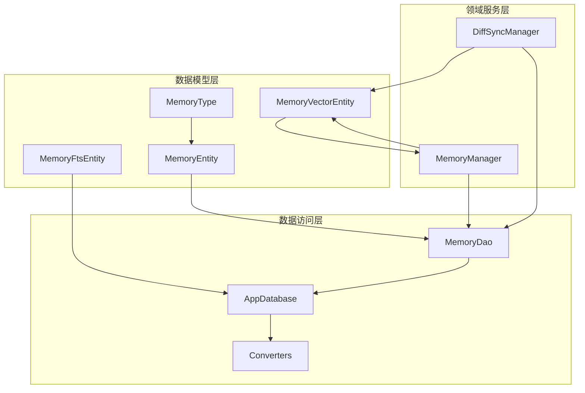
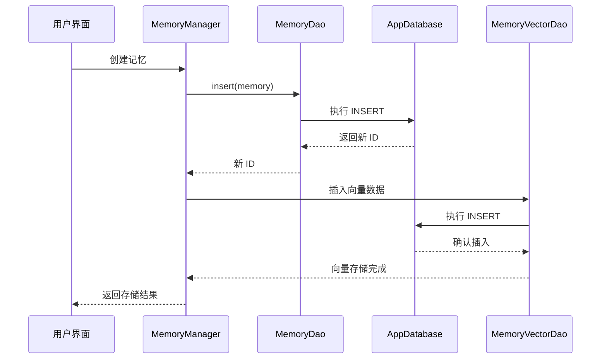
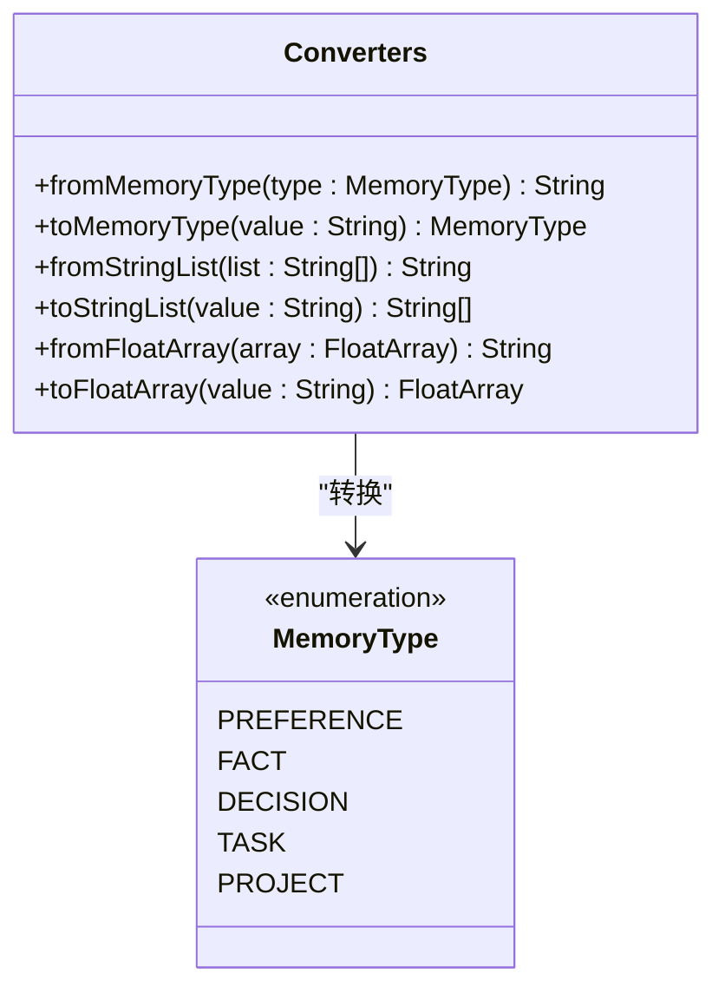
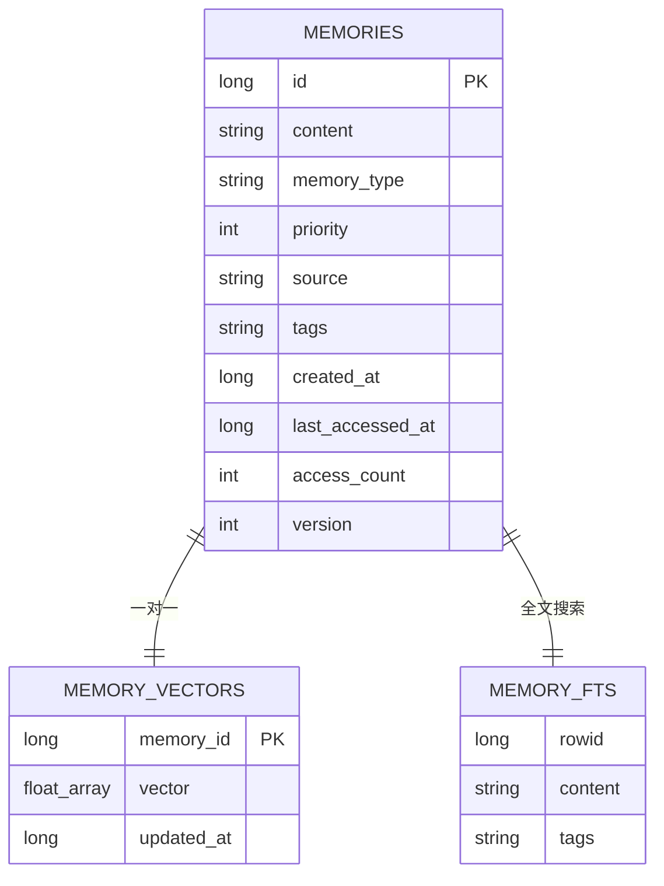
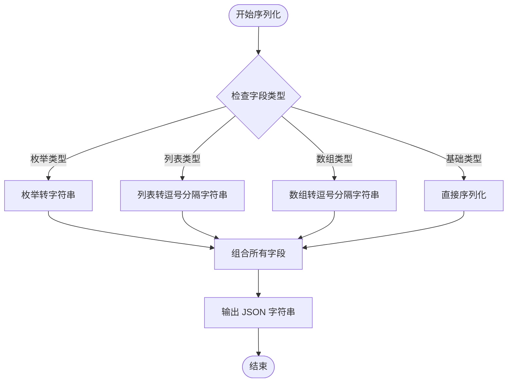
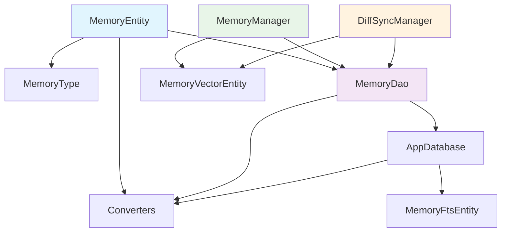

# MemoryEntity 数据模型

<cite>
**本文档引用的文件**
- [MemoryEntity.kt](file://app/src/main/java/ai/openclaw/android/data/model/MemoryEntity.kt)
- [MemoryType.kt](file://app/src/main/java/ai/openclaw/android/data/model/MemoryType.kt)
- [MemoryDao.kt](file://app/src/main/java/ai/openclaw/android/data/local/MemoryDao.kt)
- [AppDatabase.kt](file://app/src/main/java/ai/openclaw/android/data/local/AppDatabase.kt)
- [Converters.kt](file://app/src/main/java/ai/openclaw/android/data/local/Converters.kt)
- [MemoryFtsEntity.kt](file://app/src/main/java/ai/openclaw/android/data/model/MemoryFtsEntity.kt)
- [MemoryVectorEntity.kt](file://app/src/main/java/ai/openclaw/android/data/model/MemoryVectorEntity.kt)
- [MemoryManager.kt](file://app/src/main/java/ai/openclaw/android/domain/memory/MemoryManager.kt)
- [MemoryDaoTest.kt](file://app/src/androidTest/java/ai/openclaw/android/data/MemoryDaoTest.kt)
- [DiffSyncManager.kt](file://app/src/main/java/ai/openclaw/android/domain/memory/DiffSyncManager.kt)
</cite>

## 目录
1. [简介](#简介)
2. [项目结构](#项目结构)
3. [核心组件](#核心组件)
4. [架构概览](#架构概览)
5. [详细组件分析](#详细组件分析)
6. [依赖关系分析](#依赖关系分析)
7. [性能考虑](#性能考虑)
8. [故障排除指南](#故障排除指南)
9. [结论](#结论)

## 简介

MemoryEntity 是 OpenClaw Android 应用中的核心数据模型，用于存储和管理各种类型的记忆信息。该实体支持多种记忆类型，包括偏好设置、事实、决策、任务和项目，并提供了完整的 CRUD 操作支持以及高级功能如向量嵌入、全文搜索和增量同步。

## 项目结构

MemoryEntity 数据模型在项目中的组织结构如下：



**图表来源**
- [MemoryEntity.kt:1-19](file://app/src/main/java/ai/openclaw/android/data/model/MemoryEntity.kt#L1-L19)
- [MemoryDao.kt:1-49](file://app/src/main/java/ai/openclaw/android/data/local/MemoryDao.kt#L1-L49)
- [AppDatabase.kt:25-40](file://app/src/main/java/ai/openclaw/android/data/local/AppDatabase.kt#L25-L40)

**章节来源**
- [MemoryEntity.kt:1-19](file://app/src/main/java/ai/openclaw/android/data/model/MemoryEntity.kt#L1-L19)
- [AppDatabase.kt:1-158](file://app/src/main/java/ai/openclaw/android/data/local/AppDatabase.kt#L1-L158)

## 核心组件

### MemoryEntity 实体定义

MemoryEntity 是一个使用 Room 注解的数据类，定义了完整的记忆存储结构。该实体通过 Room 框架与 SQLite 数据库进行映射，支持自动化的 CRUD 操作。

### MemoryType 枚举类型

MemoryType 定义了记忆的五种基本类型：
- PREFERENCE：用户偏好设置
- FACT：事实信息
- DECISION：决策记录
- TASK：任务信息
- PROJECT：项目相关信息

### 数据库映射关系

MemoryEntity 通过 Room 注解与数据库表建立映射关系：
- 表名：memories
- 主键：id（自增）
- 版本控制：version 字段用于冲突解决
- 类型转换：通过 Converters 支持复杂类型存储

**章节来源**
- [MemoryEntity.kt:6-18](file://app/src/main/java/ai/openclaw/android/data/model/MemoryEntity.kt#L6-L18)
- [MemoryType.kt:3-5](file://app/src/main/java/ai/openclaw/android/data/model/MemoryType.kt#L3-L5)
- [AppDatabase.kt:25-30](file://app/src/main/java/ai/openclaw/android/data/local/AppDatabase.kt#L25-L30)

## 架构概览

MemoryEntity 数据模型在整个应用架构中扮演着核心角色，连接了数据层、业务逻辑层和服务层：



**图表来源**
- [MemoryManager.kt:16-36](file://app/src/main/java/ai/openclaw/android/domain/memory/MemoryManager.kt#L16-L36)
- [MemoryDao.kt:13-14](file://app/src/main/java/ai/openclaw/android/data/local/MemoryDao.kt#L13-L14)

## 详细组件分析

### MemoryEntity 字段定义

MemoryEntity 包含以下核心字段：

#### 基础标识字段
- **id**: Long 类型，Room 主键，自动递增
- **version**: Int 类型，默认值 1，用于版本控制和冲突解决

#### 内容字段
- **content**: String 类型，记忆的主要内容
- **memoryType**: MemoryType 枚举，记忆的类型分类
- **priority**: Int 类型，记忆优先级（1-5），数值越高优先级越高

#### 元数据字段
- **source**: String? 类型，可空，记忆来源标识
- **tags**: List<String> 类型，标签列表，用于分类和检索

#### 时间戳字段
- **createdAt**: Long 类型，Unix 时间戳，记录创建时间
- **lastAccessedAt**: Long 类型，Unix 时间戳，记录最后访问时间

#### 访问统计字段
- **accessCount**: Int 类型，默认值 0，记录访问次数

#### 数据类型约束
- 所有字段均为不可变（val）设计
- 可空字段使用 Kotlin 可空类型语法
- 默认值确保实体完整性

**章节来源**
- [MemoryEntity.kt:7-18](file://app/src/main/java/ai/openclaw/android/data/model/MemoryEntity.kt#L7-L18)

### Room 注解使用说明

MemoryEntity 使用了以下 Room 注解：

```kotlin
@Entity(tableName = "memories")
data class MemoryEntity(
    @PrimaryKey(autoGenerate = true) val id: Long = 0,
    // ... 其他字段
)
```

- **@Entity**: 标识这是一个数据库实体
- **@PrimaryKey**: 定义主键，autoGenerate=true 表示自增
- **tableName**: 指定数据库表名为 "memories"

### 类型转换器配置

通过 Converters 类实现复杂类型的序列化和反序列化：



**图表来源**
- [Converters.kt:10-65](file://app/src/main/java/ai/openclaw/android/data/local/Converters.kt#L10-L65)

**章节来源**
- [Converters.kt:31-42](file://app/src/main/java/ai/openclaw/android/data/local/Converters.kt#L31-L42)

### 数据库映射关系

MemoryEntity 与数据库的映射关系：



**图表来源**
- [MemoryEntity.kt:6-18](file://app/src/main/java/ai/openclaw/android/data/model/MemoryEntity.kt#L6-L18)
- [MemoryVectorEntity.kt:6-11](file://app/src/main/java/ai/openclaw/android/data/model/MemoryVectorEntity.kt#L6-L11)
- [MemoryFtsEntity.kt:9-13](file://app/src/main/java/ai/openclaw/android/data/model/MemoryFtsEntity.kt#L9-L13)

**章节来源**
- [AppDatabase.kt:149-151](file://app/src/main/java/ai/openclaw/android/data/local/AppDatabase.kt#L149-L151)

### 序列化和反序列化示例

MemoryEntity 支持多种序列化方式：

#### JSON 序列化流程


**图表来源**
- [Converters.kt:31-50](file://app/src/main/java/ai/openclaw/android/data/local/Converters.kt#L31-L50)

### CRUD 操作示例

#### 创建操作
```kotlin
// 基本创建
val memory = MemoryEntity(
    content = "用户偏好设置",
    memoryType = MemoryType.PREFERENCE,
    priority = 4,
    source = "settings",
    tags = listOf("user", "preference"),
    createdAt = System.currentTimeMillis(),
    lastAccessedAt = System.currentTimeMillis()
)

val id = memoryDao.insert(memory)
```

#### 查询操作
```kotlin
// 按 ID 查询
val memory = memoryDao.getById(id)

// 按类型查询
val preferences = memoryDao.getByType(MemoryType.PREFERENCE, 20)

// 高优先级查询
val highPriority = memoryDao.getHighPriority(10)

// 最近访问查询
val recent = memoryDao.getRecent(50)
```

#### 更新操作
```kotlin
// 访问更新
memoryDao.updateAccess(id, System.currentTimeMillis())

// 手动更新（通过重新插入）
val updatedMemory = memory.copy(version = memory.version + 1)
memoryDao.insert(updatedMemory)
```

#### 删除操作
```kotlin
// 删除单个
memoryDao.delete(memory)

// 批量删除
memoryDao.deleteByIds(ids)
```

**章节来源**
- [MemoryDaoTest.kt:34-166](file://app/src/androidTest/java/ai/openclaw/android/data/MemoryDaoTest.kt#L34-L166)

### 最佳实践

#### 内存管理最佳实践
1. **优先级设置**：合理设置 priority 值（1-5），高优先级用于重要任务
2. **标签使用**：使用有意义的标签进行分类和检索
3. **版本控制**：利用 version 字段处理并发冲突
4. **访问统计**：定期清理低访问频率的记忆条目

#### 性能优化建议
1. **批量操作**：使用批量插入和查询减少数据库往返
2. **索引使用**：利用数据库索引优化常用查询
3. **内存限制**：设置合理的内存上限防止过度增长

**章节来源**
- [MemoryManager.kt:87-95](file://app/src/main/java/ai/openclaw/android/domain/memory/MemoryManager.kt#L87-L95)

## 依赖关系分析

MemoryEntity 的依赖关系图：



**图表来源**
- [MemoryEntity.kt:3-4](file://app/src/main/java/ai/openclaw/android/data/model/MemoryEntity.kt#L3-L4)
- [MemoryDao.kt:3-4](file://app/src/main/java/ai/openclaw/android/data/local/MemoryDao.kt#L3-L4)
- [AppDatabase.kt:12-13](file://app/src/main/java/ai/openclaw/android/data/local/AppDatabase.kt#L12-L13)

**章节来源**
- [MemoryManager.kt:3-7](file://app/src/main/java/ai/openclaw/android/domain/memory/MemoryManager.kt#L3-L7)
- [DiffSyncManager.kt:4-7](file://app/src/main/java/ai/openclaw/android/domain/memory/DiffSyncManager.kt#L4-L7)

## 性能考虑

### 数据库性能优化

1. **索引策略**：根据查询模式创建适当的索引
2. **查询优化**：使用 LIMIT 和排序优化大数据集查询
3. **批量操作**：减少数据库交互次数

### 内存管理

1. **向量存储**：MemoryVectorEntity 提供高效的向量检索
2. **缓存机制**：利用 Room 的查询结果缓存
3. **清理策略**：定期清理过期和低价值的记忆条目

### 并发处理

1. **版本控制**：通过 version 字段处理并发写入
2. **事务管理**：使用 Room 事务确保数据一致性
3. **冲突解决**：基于版本号的冲突检测和解决

## 故障排除指南

### 常见问题及解决方案

#### 数据库迁移问题
- **症状**：应用启动时报数据库版本错误
- **解决方案**：检查 AppDatabase 中的迁移脚本，确保版本兼容性

#### 类型转换错误
- **症状**：枚举或列表字段序列化失败
- **解决方案**：确认 Converters 类正确配置，检查字段类型映射

#### 内存泄漏问题
- **症状**：长时间运行后内存使用持续增长
- **解决方案**：实现定期清理机制，监控 MemoryManager 的清理操作

#### 同步冲突
- **症状**：分布式同步时出现数据不一致
- **解决方案**：检查版本号比较逻辑，实现适当的冲突解决策略

**章节来源**
- [AppDatabase.kt:58-130](file://app/src/main/java/ai/openclaw/android/data/local/AppDatabase.kt#L58-L130)
- [DiffSyncManager.kt:70-78](file://app/src/main/java/ai/openclaw/android/domain/memory/DiffSyncManager.kt#L70-L78)

## 结论

MemoryEntity 数据模型为 OpenClaw Android 应用提供了完整而灵活的记忆管理系统。通过精心设计的字段结构、完善的 Room 集成和丰富的业务功能，该模型能够有效支持各种记忆类型的存储、检索和管理需求。

关键优势包括：
- **类型安全**：通过 MemoryType 枚举确保数据完整性
- **扩展性**：支持向量嵌入和全文搜索
- **并发安全**：内置版本控制和冲突解决机制
- **性能优化**：针对移动设备的内存和存储优化

该数据模型为构建智能记忆系统奠定了坚实的基础，支持从简单的偏好设置到复杂的任务管理等各种应用场景。