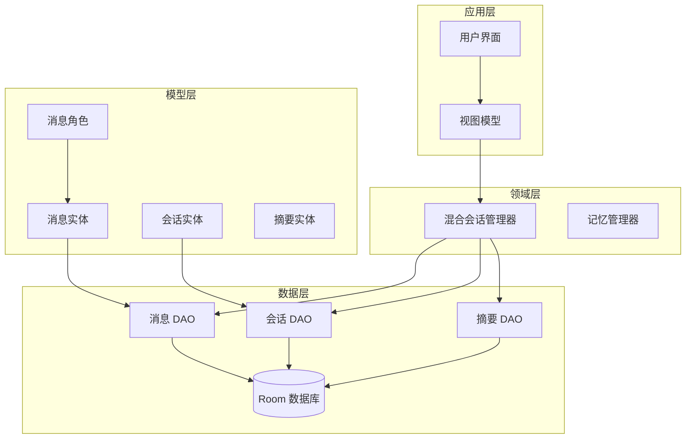
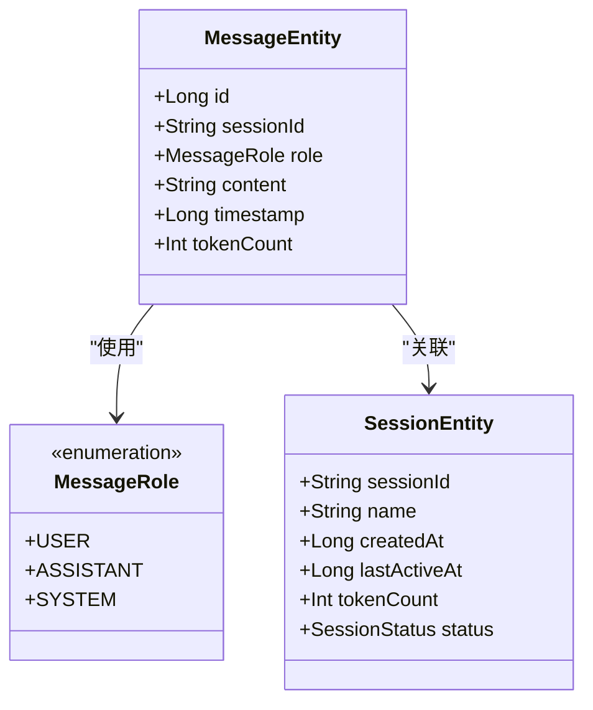
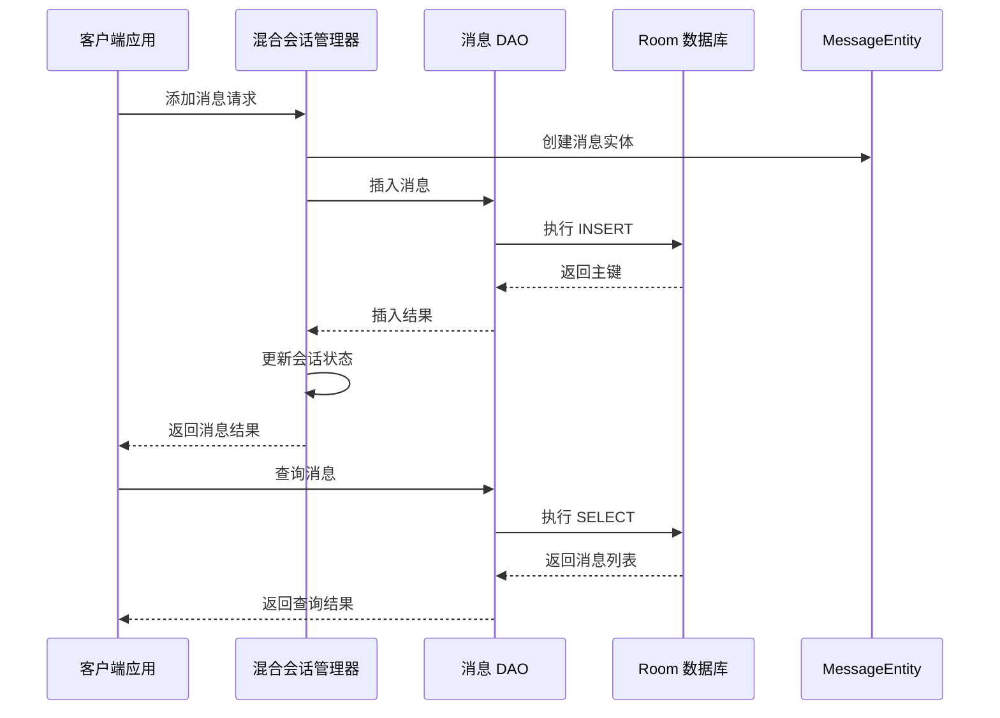
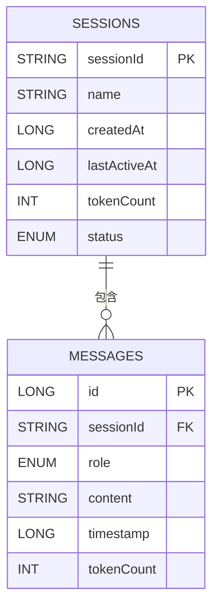
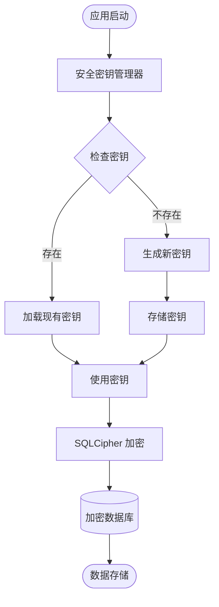
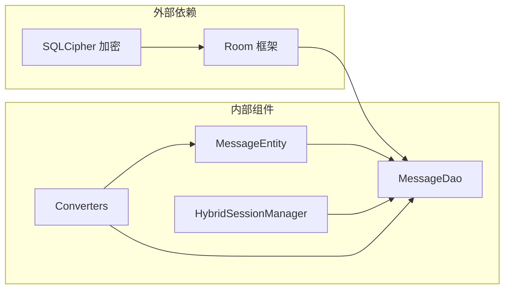

# MessageEntity 数据模型

<cite>
**本文档引用的文件**
- [MessageEntity.kt](file://app/src/main/java/ai/openclaw/android/data/model/MessageEntity.kt)
- [MessageRole.kt](file://app/src/main/java/ai/openclaw/android/data/model/MessageRole.kt)
- [MessageDao.kt](file://app/src/main/java/ai/openclaw/android/data/local/MessageDao.kt)
- [AppDatabase.kt](file://app/src/main/java/ai/openclaw/android/data/local/AppDatabase.kt)
- [Converters.kt](file://app/src/main/java/ai/openclaw/android/data/local/Converters.kt)
- [SessionEntity.kt](file://app/src/main/java/ai/openclaw/android/data/model/SessionEntity.kt)
- [HybridSessionManager.kt](file://app/src/main/java/ai/openclaw/android/domain/session/HybridSessionManager.kt)
- [SecurityKeyManager.kt](file://app/src/main/java/ai/openclaw/android/security/SecurityKeyManager.kt)
</cite>

## 目录
1. [简介](#简介)
2. [项目结构](#项目结构)
3. [核心组件](#核心组件)
4. [架构概览](#架构概览)
5. [详细组件分析](#详细组件分析)
6. [依赖关系分析](#依赖关系分析)
7. [性能考虑](#性能考虑)
8. [故障排除指南](#故障排除指南)
9. [结论](#结论)

## 简介

MessageEntity 是 OpenClaw Android 应用程序中的核心数据模型，用于表示聊天会话中的消息记录。该模型基于 Android Room 持久化库构建，提供了完整的消息存储、检索和管理功能。本文档将详细介绍 MessageEntity 的所有字段定义、消息角色枚举、会话关联关系、查询方法以及数据存储格式。

## 项目结构

OpenClaw 项目采用分层架构设计，MessageEntity 位于数据层，与会话管理器协同工作：

**图表来源**
- [HybridSessionManager.kt:31-38](file://app/src/main/java/ai/openclaw/android/domain/session/HybridSessionManager.kt#L31-L38)
- [AppDatabase.kt:25-40](file://app/src/main/java/ai/openclaw/android/data/local/AppDatabase.kt#L25-L40)

**章节来源**
- [AppDatabase.kt:1-158](file://app/src/main/java/ai/openclaw/android/data/local/AppDatabase.kt#L1-L158)
- [HybridSessionManager.kt:1-457](file://app/src/main/java/ai/openclaw/android/domain/session/HybridSessionManager.kt#L1-L457)

## 核心组件

### MessageEntity 实体模型

MessageEntity 是一个基于 Room 注解的数据类，定义了消息存储的核心结构：

**图表来源**
- [MessageEntity.kt:18-25](file://app/src/main/java/ai/openclaw/android/data/model/MessageEntity.kt#L18-L25)
- [MessageRole.kt:3-7](file://app/src/main/java/ai/openclaw/android/data/model/MessageRole.kt#L3-L7)
- [SessionEntity.kt:7-14](file://app/src/main/java/ai/openclaw/android/data/model/SessionEntity.kt#L7-L14)

### 字段定义详解

#### 主键标识符 (id)
- 类型：Long
- 特性：自增主键
- 作用：唯一标识每条消息记录
- 默认值：0

#### 会话关联 (sessionId)
- 类型：String
- 特性：外键关联到 SessionEntity
- 作用：建立消息与会话的关联关系
- 约束：通过外键级联删除保证数据一致性

#### 消息角色 (role)
- 类型：MessageRole 枚举
- 可选值：
  - USER：用户发送的消息
  - ASSISTANT：AI 助手回复
  - SYSTEM：系统提示消息
- 作用：标识消息的发送者身份

#### 消息内容 (content)
- 类型：String
- 作用：存储消息的文本内容
- 特性：支持任意长度的文本内容

#### 时间戳 (timestamp)
- 类型：Long
- 单位：毫秒
- 作用：记录消息创建的时间
- 用途：消息排序和时间范围查询

#### 令牌计数 (tokenCount)
- 类型：Int
- 作用：记录消息内容的 token 数量
- 用途：会话压缩和内存管理

**章节来源**
- [MessageEntity.kt:8-25](file://app/src/main/java/ai/openclaw/android/data/model/MessageEntity.kt#L8-L25)
- [MessageRole.kt:3-7](file://app/src/main/java/ai/openclaw/android/data/model/MessageRole.kt#L3-L7)

## 架构概览

MessageEntity 在整个系统中的位置和交互关系：

**图表来源**
- [HybridSessionManager.kt:70-110](file://app/src/main/java/ai/openclaw/android/domain/session/HybridSessionManager.kt#L70-L110)
- [MessageDao.kt:16-23](file://app/src/main/java/ai/openclaw/android/data/local/MessageDao.kt#L16-L23)

**章节来源**
- [HybridSessionManager.kt:67-110](file://app/src/main/java/ai/openclaw/android/domain/session/HybridSessionManager.kt#L67-L110)
- [MessageDao.kt:1-42](file://app/src/main/java/ai/openclaw/android/data/local/MessageDao.kt#L1-L42)

## 详细组件分析

### 数据库架构

MessageEntity 通过 Room 注解定义了完整的数据库结构：

**图表来源**
- [SessionEntity.kt:7-14](file://app/src/main/java/ai/openclaw/android/data/model/SessionEntity.kt#L7-L14)
- [MessageEntity.kt:8-25](file://app/src/main/java/ai/openclaw/android/data/model/MessageEntity.kt#L8-L25)

### 消息角色枚举

MessageRole 枚举定义了三种基本消息类型：

| 角色 | 描述 | 用途 |
|------|------|------|
| USER | 用户发送的消息 | 用户输入的原始消息 |
| ASSISTANT | AI 助手回复 | 系统生成的响应消息 |
| SYSTEM | 系统提示消息 | 系统引导和上下文注入 |

### 数据访问接口

MessageDao 提供了完整的 CRUD 操作和高级查询功能：

#### 基础操作
- **插入操作**：支持单条和批量插入
- **更新操作**：修改现有消息内容
- **删除操作**：按 ID 或会话删除消息

#### 查询操作
- **按会话查询**：获取特定会话的所有消息
- **分页查询**：支持 limit 和 offset 参数
- **统计查询**：获取消息数量和 token 总数

**章节来源**
- [MessageDao.kt:7-42](file://app/src/main/java/ai/openclaw/android/data/local/MessageDao.kt#L7-L42)

### 数据存储安全

应用使用 SQLCipher 对数据库进行加密存储：

**图表来源**
- [SecurityKeyManager.kt:47-67](file://app/src/main/java/ai/openclaw/android/security/SecurityKeyManager.kt#L47-L67)
- [AppDatabase.kt:132-155](file://app/src/main/java/ai/openclaw/android/data/local/AppDatabase.kt#L132-L155)

**章节来源**
- [SecurityKeyManager.kt:15-69](file://app/src/main/java/ai/openclaw/android/security/SecurityKeyManager.kt#L15-L69)
- [AppDatabase.kt:42-56](file://app/src/main/java/ai/openclaw/android/data/local/AppDatabase.kt#L42-L56)

## 依赖关系分析

### 组件耦合度

MessageEntity 的设计遵循低耦合高内聚原则：

**图表来源**
- [AppDatabase.kt:25-31](file://app/src/main/java/ai/openclaw/android/data/local/AppDatabase.kt#L25-L31)
- [Converters.kt:10-29](file://app/src/main/java/ai/openclaw/android/data/local/Converters.kt#L10-L29)

### 数据转换机制

通过 TypeConverters 实现复杂类型的序列化存储：

| 类型 | 转换器 | 存储格式 |
|------|--------|----------|
| MessageRole | Enum 转 String | 角色名称字符串 |
| SessionStatus | Enum 转 String | 状态名称字符串 |
| List<String> | 逗号分隔 | 字符串序列 |
| FloatArray | 逗号分隔 | 浮点数序列 |

**章节来源**
- [Converters.kt:10-65](file://app/src/main/java/ai/openclaw/android/data/local/Converters.kt#L10-L65)

## 性能考虑

### 查询优化

1. **索引策略**：为 sessionId 字段建立索引，优化按会话查询性能
2. **分页查询**：支持 limit 和 offset 参数，避免一次性加载大量数据
3. **流式查询**：使用 Flow 支持实时数据监听

### 内存管理

1. **令牌计数**：维护 tokenCount 字段，支持会话压缩
2. **LRU 缓存**：摘要缓存减少数据库查询次数
3. **增量压缩**：支持基于摘要的增量压缩

## 故障排除指南

### 常见问题

#### 数据库加密问题
- **症状**：应用无法启动或数据库无法打开
- **解决方案**：检查安全密钥管理器是否正常生成和存储密钥

#### 外键约束错误
- **症状**：删除会话时报错
- **解决方案**：确保先删除会话中的所有消息，因为设置了 CASCADE 删除

#### 数据类型转换错误
- **症状**：枚举类型存储失败
- **解决方案**：确认 TypeConverters 正确配置

**章节来源**
- [MessageEntity.kt:10-16](file://app/src/main/java/ai/openclaw/android/data/model/MessageEntity.kt#L10-L16)
- [Converters.kt:21-29](file://app/src/main/java/ai/openclaw/android/data/local/Converters.kt#L21-L29)

## 结论

MessageEntity 数据模型通过精心设计的字段结构、完善的数据库约束和安全的存储机制，为 OpenClaw 应用提供了可靠的消息存储基础。其与会话管理器的紧密集成，以及与 SQLCipher 的安全结合，确保了数据的完整性、安全性与可扩展性。

该模型的设计充分考虑了实际应用场景的需求，包括消息排序、过滤查询、令牌计数和会话压缩等功能，为构建高性能的聊天应用奠定了坚实的基础。