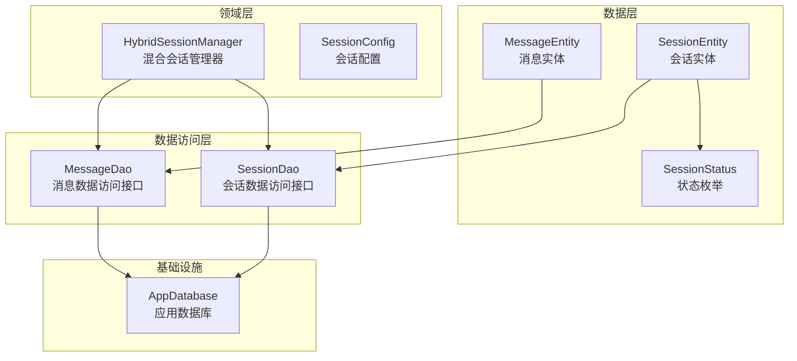
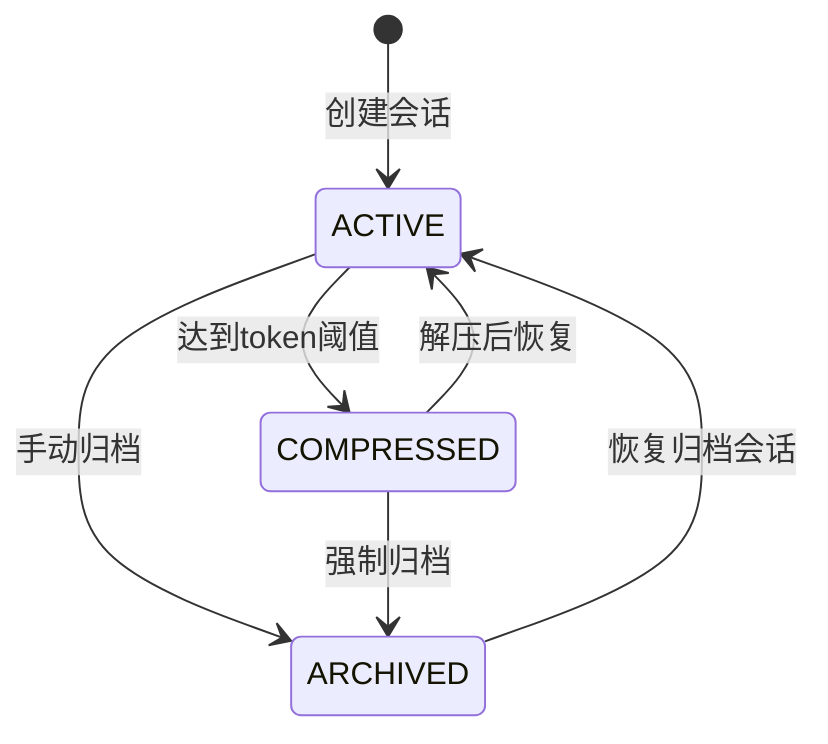
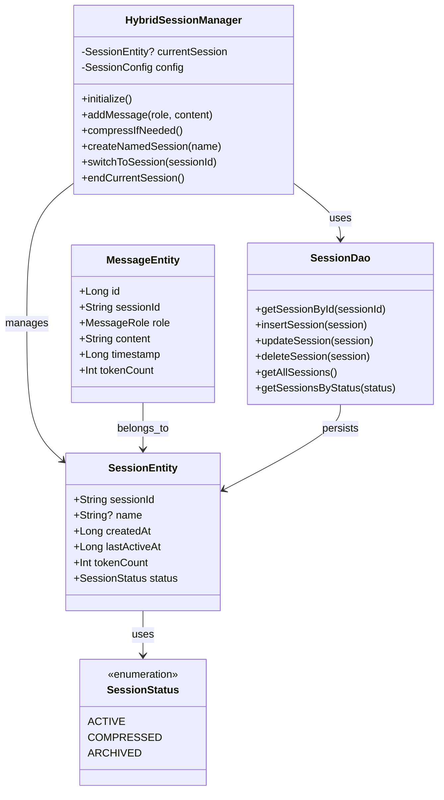
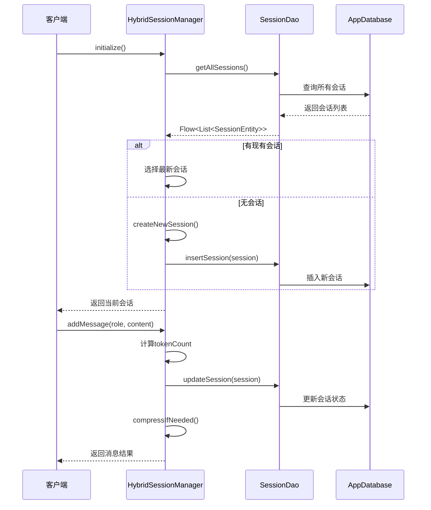
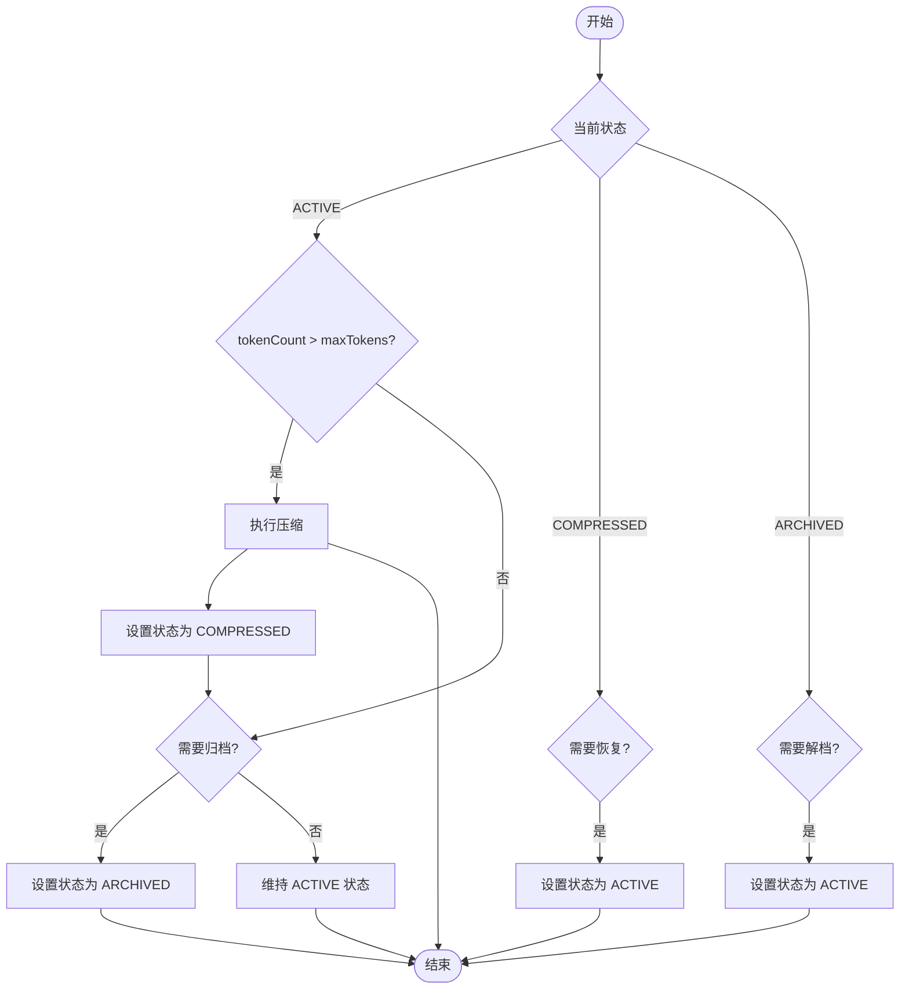
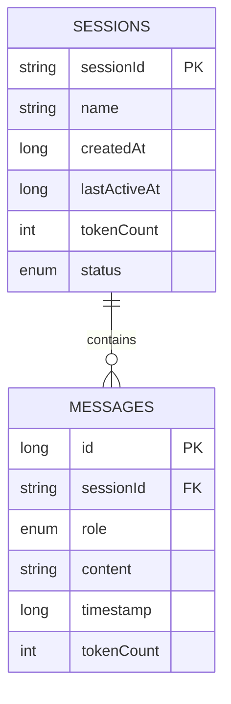
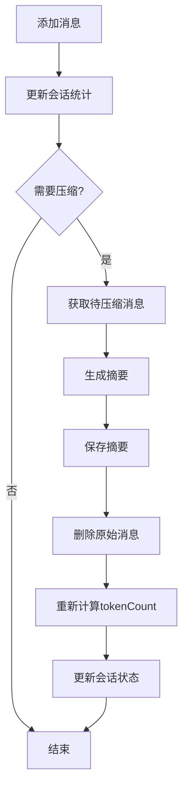
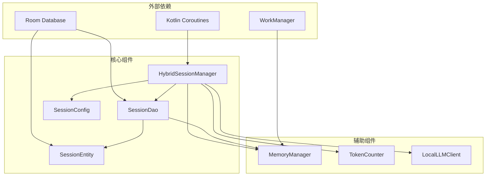

# SessionEntity 数据模型

<cite>
**本文引用的文件**
- [SessionEntity.kt](file://app/src/main/java/ai/openclaw/android/data/model/SessionEntity.kt)
- [SessionStatus.kt](file://app/src/main/java/ai/openclaw/android/data/model/SessionStatus.kt)
- [SessionDao.kt](file://app/src/main/java/ai/openclaw/android/data/local/SessionDao.kt)
- [AppDatabase.kt](file://app/src/main/java/ai/openclaw/android/data/local/AppDatabase.kt)
- [HybridSessionManager.kt](file://app/src/main/java/ai/openclaw/android/domain/session/HybridSessionManager.kt)
- [MessageEntity.kt](file://app/src/main/java/ai/openclaw/android/data/model/MessageEntity.kt)
- [SessionConfig.kt](file://app/src/main/java/ai/openclaw/android/domain/model/SessionConfig.kt)
- [SessionDaoTest.kt](file://app/src/androidTest/java/ai/openclaw/android/data/SessionDaoTest.kt)
</cite>

## 目录
1. [简介](#简介)
2. [项目结构](#项目结构)
3. [核心组件](#核心组件)
4. [架构概览](#架构概览)
5. [详细组件分析](#详细组件分析)
6. [依赖关系分析](#依赖关系分析)
7. [性能考虑](#性能考虑)
8. [故障排除指南](#故障排除指南)
9. [结论](#结论)

## 简介

SessionEntity 是 OpenClaw Android 应用中的核心数据模型，用于表示和管理用户的对话会话。该模型实现了会话的完整生命周期管理，包括会话创建、状态维护、消息关联以及持久化存储。本文档将详细介绍 SessionEntity 的所有字段定义、状态枚举、关联关系以及完整的业务逻辑实现。

## 项目结构

OpenClaw 项目采用分层架构设计，SessionEntity 位于数据层，通过 Room 数据库进行持久化存储。整个会话管理系统由多个组件协同工作：

**图表来源**
- [SessionEntity.kt:1-14](file://app/src/main/java/ai/openclaw/android/data/model/SessionEntity.kt#L1-L14)
- [SessionDao.kt:1-31](file://app/src/main/java/ai/openclaw/android/data/local/SessionDao.kt#L1-L31)
- [HybridSessionManager.kt:1-457](file://app/src/main/java/ai/openclaw/android/domain/session/HybridSessionManager.kt#L1-L457)
- [AppDatabase.kt:1-158](file://app/src/main/java/ai/openclaw/android/data/local/AppDatabase.kt#L1-L158)

**章节来源**
- [SessionEntity.kt:1-14](file://app/src/main/java/ai/openclaw/android/data/model/SessionEntity.kt#L1-L14)
- [AppDatabase.kt:25-41](file://app/src/main/java/ai/openclaw/android/data/local/AppDatabase.kt#L25-L41)

## 核心组件

### SessionEntity 数据模型

SessionEntity 是会话的核心数据结构，使用 Room 注解进行数据库映射：

| 字段名 | 类型 | 描述 | 约束 |
|--------|------|------|------|
| sessionId | String | 会话唯一标识符 | 主键，UUID格式 |
| name | String? | 会话名称 | 可为空，null表示默认会话 |
| createdAt | Long | 会话创建时间戳 | 毫秒级时间戳 |
| lastActiveAt | Long | 最后活跃时间戳 | 毫秒级时间戳 |
| tokenCount | Int | 当前会话的token总数 | 用于压缩控制 |
| status | SessionStatus | 会话当前状态 | 枚举类型 |

### SessionStatus 状态枚举

会话状态定义了会话在整个生命周期中的不同阶段：

**图表来源**
- [SessionStatus.kt:3-7](file://app/src/main/java/ai/openclaw/android/data/model/SessionStatus.kt#L3-L7)

**章节来源**
- [SessionEntity.kt:6-14](file://app/src/main/java/ai/openclaw/android/data/model/SessionEntity.kt#L6-L14)
- [SessionStatus.kt:1-7](file://app/src/main/java/ai/openclaw/android/data/model/SessionStatus.kt#L1-L7)

## 架构概览

会话管理系统采用分层架构，确保关注点分离和可维护性：

**图表来源**
- [SessionEntity.kt:7-14](file://app/src/main/java/ai/openclaw/android/data/model/SessionEntity.kt#L7-L14)
- [SessionStatus.kt:3-7](file://app/src/main/java/ai/openclaw/android/data/model/SessionStatus.kt#L3-L7)
- [SessionDao.kt:8-31](file://app/src/main/java/ai/openclaw/android/data/local/SessionDao.kt#L8-L31)
- [HybridSessionManager.kt:31-42](file://app/src/main/java/ai/openclaw/android/domain/session/HybridSessionManager.kt#L31-L42)
- [MessageEntity.kt:18-25](file://app/src/main/java/ai/openclaw/android/data/model/MessageEntity.kt#L18-L25)

## 详细组件分析

### 会话生命周期管理

会话生命周期由 HybridSessionManager 统一管理，包含完整的创建、维护和销毁流程：

**图表来源**
- [HybridSessionManager.kt:59-65](file://app/src/main/java/ai/openclaw/android/domain/session/HybridSessionManager.kt#L59-L65)
- [HybridSessionManager.kt:70-110](file://app/src/main/java/ai/openclaw/android/domain/session/HybridSessionManager.kt#L70-L110)

### 会话状态转换逻辑

会话状态转换遵循严格的业务规则，确保系统的稳定性和一致性：

**图表来源**
- [HybridSessionManager.kt:236-243](file://app/src/main/java/ai/openclaw/android/domain/session/HybridSessionManager.kt#L236-L243)
- [HybridSessionManager.kt:452-455](file://app/src/main/java/ai/openclaw/android/domain/session/HybridSessionManager.kt#L452-L455)

### 会话与消息的关联关系

会话与消息之间建立了一对多的关联关系，通过外键约束保证数据完整性：

**图表来源**
- [SessionEntity.kt:6-14](file://app/src/main/java/ai/openclaw/android/data/model/SessionEntity.kt#L6-L14)
- [MessageEntity.kt:8-25](file://app/src/main/java/ai/openclaw/android/data/model/MessageEntity.kt#L8-L25)

**章节来源**
- [MessageEntity.kt:8-17](file://app/src/main/java/ai/openclaw/android/data/model/MessageEntity.kt#L8-L17)
- [SessionDao.kt:11-12](file://app/src/main/java/ai/openclaw/android/data/local/SessionDao.kt#L11-L12)

### 会话数据持久化机制

数据持久化通过 Room ORM 实现，提供类型安全的数据库操作：

| 操作类型 | 方法名 | 功能描述 | 返回值 |
|----------|--------|----------|--------|
| 查询 | getSessionById | 根据ID查询会话 | SessionEntity? |
| 插入 | insertSession | 创建新会话 | Unit |
| 更新 | updateSession | 更新会话状态 | Unit |
| 删除 | deleteSession | 删除会话及其消息 | Unit |
| 查询 | getAllSessions | 获取所有会话 | Flow<List<SessionEntity>> |
| 查询 | getSessionsByStatus | 按状态过滤会话 | Flow<List<SessionEntity>> |

**章节来源**
- [SessionDao.kt:9-31](file://app/src/main/java/ai/openclaw/android/data/local/SessionDao.kt#L9-L31)
- [AppDatabase.kt:32-40](file://app/src/main/java/ai/openclaw/android/data/local/AppDatabase.kt#L32-L40)

### 会话压缩与清理机制

系统实现了智能的会话压缩机制，通过摘要技术控制内存使用：

**图表来源**
- [HybridSessionManager.kt:248-299](file://app/src/main/java/ai/openclaw/android/domain/session/HybridSessionManager.kt#L248-L299)

**章节来源**
- [HybridSessionManager.kt:236-299](file://app/src/main/java/ai/openclaw/android/domain/session/HybridSessionManager.kt#L236-L299)

## 依赖关系分析

会话系统各组件之间的依赖关系清晰明确：

**图表来源**
- [HybridSessionManager.kt:31-38](file://app/src/main/java/ai/openclaw/android/domain/session/HybridSessionManager.kt#L31-L38)
- [AppDatabase.kt:25-41](file://app/src/main/java/ai/openclaw/android/data/local/AppDatabase.kt#L25-L41)

**章节来源**
- [HybridSessionManager.kt:1-26](file://app/src/main/java/ai/openclaw/android/domain/session/HybridSessionManager.kt#L1-L26)
- [AppDatabase.kt:1-158](file://app/src/main/java/ai/openclaw/android/data/local/AppDatabase.kt#L1-L158)

## 性能考虑

### 内存优化策略

1. **LRU缓存机制**：摘要缓存限制在10条记录，避免频繁的数据库查询
2. **增量压缩**：支持基于历史摘要的增量压缩，减少重复计算
3. **延迟处理**：记忆提取采用30秒延迟，避免频繁的后台任务

### 数据库性能优化

1. **索引优化**：为sessionId字段建立索引，加速消息查询
2. **批量操作**：支持批量删除压缩后的消息，提高效率
3. **流式查询**：使用Flow进行实时数据监听，减少不必要的查询

### Token计数优化

会话配置参数经过精心调优：
- `maxTokens`: 1800 - 触发压缩的阈值
- `preserveRecentMessages`: 10 - 保留最近10条消息
- `autoCompressDefault`: true - 默认启用自动压缩

**章节来源**
- [HybridSessionManager.kt:44-54](file://app/src/main/java/ai/openclaw/android/domain/session/HybridSessionManager.kt#L44-L54)
- [SessionConfig.kt:6-10](file://app/src/main/java/ai/openclaw/android/domain/model/SessionConfig.kt#L6-L10)

## 故障排除指南

### 常见问题及解决方案

1. **会话无法恢复**
   - 检查数据库连接状态
   - 验证sessionId格式正确性
   - 确认会话状态不是ARCHIVED

2. **消息丢失问题**
   - 检查压缩机制是否正常工作
   - 验证摘要生成是否成功
   - 确认外键约束设置正确

3. **性能问题**
   - 监控tokenCount增长情况
   - 检查压缩频率设置
   - 优化数据库索引使用

### 调试建议

1. 启用Room日志输出，监控SQL执行
2. 使用Flow监听会话状态变化
3. 定期检查数据库大小和性能指标

**章节来源**
- [SessionDaoTest.kt:33-153](file://app/src/androidTest/java/ai/openclaw/android/data/SessionDaoTest.kt#L33-L153)

## 结论

SessionEntity 数据模型为 OpenClaw Android 应用提供了完整、可靠的会话管理能力。通过精心设计的数据结构、完善的生命周期管理和高效的持久化机制，系统能够：

1. **可靠的状态管理**：通过SessionStatus枚举确保会话状态的一致性
2. **智能的内存控制**：自动压缩机制有效控制内存使用
3. **完整的数据关联**：会话与消息的一对多关系保证数据完整性
4. **高性能的持久化**：Room ORM提供类型安全的数据库操作
5. **灵活的扩展性**：模块化的架构设计便于功能扩展

该数据模型的设计充分考虑了移动应用的特殊需求，在保证功能完整性的同时，也注重了性能优化和用户体验。通过合理的抽象和封装，为上层业务逻辑提供了简洁易用的接口。