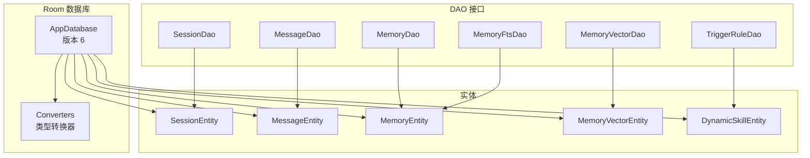
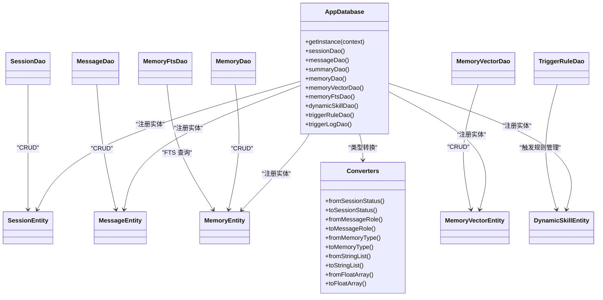
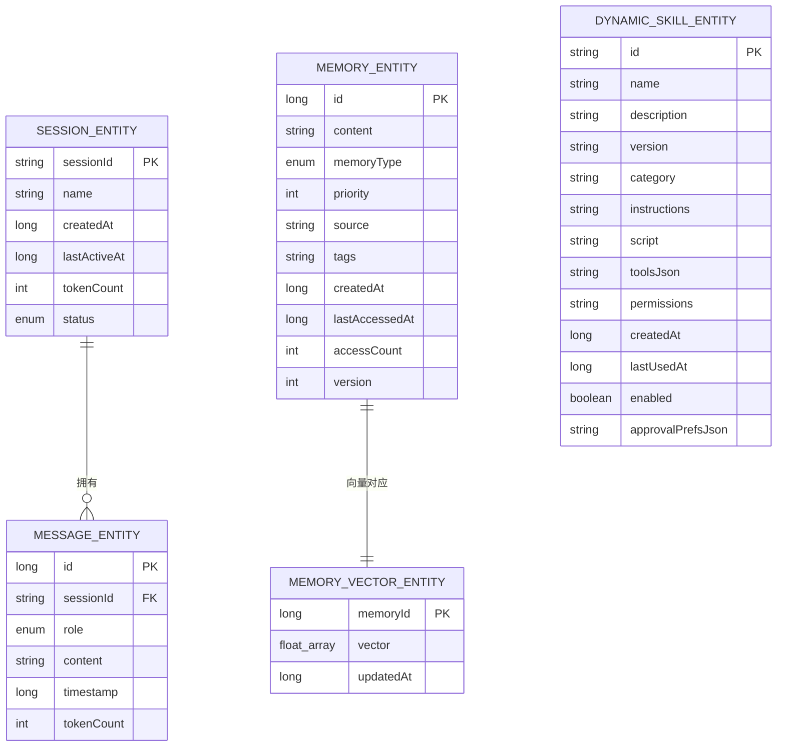
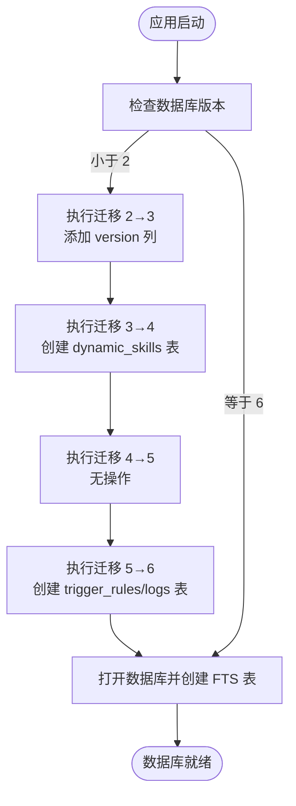
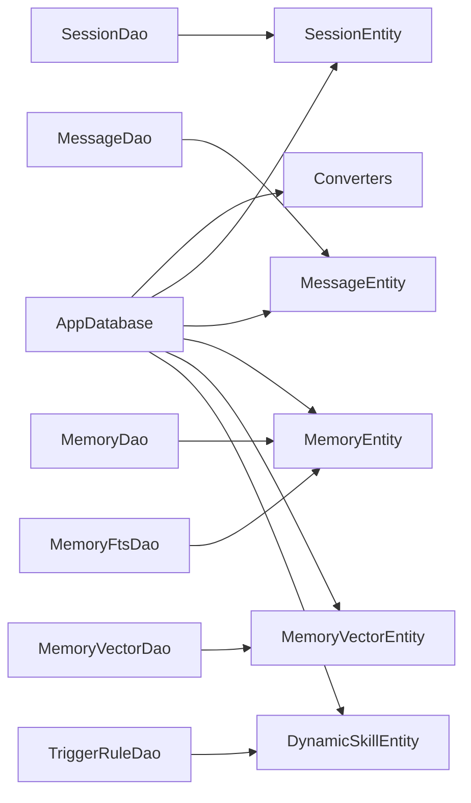
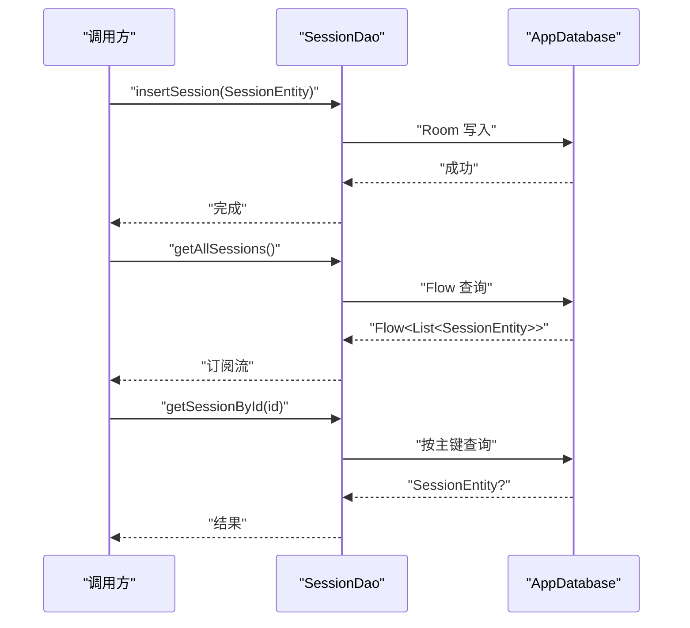

# 数据模型接口

<cite>
**本文引用的文件**
- [MemoryEntity.kt](file://app/src/main/java/ai/openclaw/android/data/model/MemoryEntity.kt)
- [MessageEntity.kt](file://app/src/main/java/ai/openclaw/android/data/model/MessageEntity.kt)
- [SessionEntity.kt](file://app/src/main/java/ai/openclaw/android/data/model/SessionEntity.kt)
- [MemoryVectorEntity.kt](file://app/src/main/java/ai/openclaw/android/data/model/MemoryVectorEntity.kt)
- [DynamicSkillEntity.kt](file://app/src/main/java/ai/openclaw/android/data/model/DynamicSkillEntity.kt)
- [MemoryType.kt](file://app/src/main/java/ai/openclaw/android/data/model/MemoryType.kt)
- [MessageRole.kt](file://app/src/main/java/ai/openclaw/android/data/model/MessageRole.kt)
- [SessionStatus.kt](file://app/src/main/java/ai/openclaw/android/data/model/SessionStatus.kt)
- [AppDatabase.kt](file://app/src/main/java/ai/openclaw/android/data/local/AppDatabase.kt)
- [Converters.kt](file://app/src/main/java/ai/openclaw/android/data/local/Converters.kt)
- [MemoryDao.kt](file://app/src/main/java/ai/openclaw/android/data/local/MemoryDao.kt)
- [MessageDao.kt](file://app/src/main/java/ai/openclaw/android/data/local/MessageDao.kt)
- [SessionDao.kt](file://app/src/main/java/ai/openclaw/android/data/local/SessionDao.kt)
- [MemoryVectorDao.kt](file://app/src/main/java/ai/openclaw/android/data/local/MemoryVectorDao.kt)
- [MemoryFtsDao.kt](file://app/src/main/java/ai/openclaw/android/data/local/MemoryFtsDao.kt)
- [TriggerRuleDao.kt](file://app/src/main/java/ai/openclaw/android/trigger/dao/TriggerRuleDao.kt)
</cite>

## 目录
1. [简介](#简介)
2. [项目结构](#项目结构)
3. [核心组件](#核心组件)
4. [架构总览](#架构总览)
5. [详细组件分析](#详细组件分析)
6. [依赖分析](#依赖分析)
7. [性能考虑](#性能考虑)
8. [故障排查指南](#故障排查指南)
9. [结论](#结论)
10. [附录](#附录)

## 简介
本文件面向数据模型接口，系统性梳理并规范以下内容：
- 实体类的数据结构与字段定义：MemoryEntity、MessageEntity、SessionEntity、MemoryVectorEntity、DynamicSkillEntity
- 字段语义、约束与默认值
- 序列化与反序列化机制（Room TypeConverter）
- DAO 接口的 CRUD 与查询 API 规范
- 数据验证规则与约束条件
- 数据迁移与版本兼容策略
- 使用最佳实践与性能优化建议

## 项目结构
数据模型与持久层采用 Room 架构，数据库版本为 6；通过 TypeConverters 将枚举与复杂类型转换为字符串存储；通过 DAO 提供统一的增删改查接口。

图表来源
- [AppDatabase.kt:25-41](file://app/src/main/java/ai/openclaw/android/data/local/AppDatabase.kt#L25-L41)
- [Converters.kt:10-65](file://app/src/main/java/ai/openclaw/android/data/local/Converters.kt#L10-L65)
- [SessionDao.kt:8-31](file://app/src/main/java/ai/openclaw/android/data/local/SessionDao.kt#L8-L31)
- [MessageDao.kt:7-42](file://app/src/main/java/ai/openclaw/android/data/local/MessageDao.kt#L7-L42)
- [MemoryDao.kt:11-49](file://app/src/main/java/ai/openclaw/android/data/local/MemoryDao.kt#L11-L49)
- [MemoryVectorDao.kt:9-26](file://app/src/main/java/ai/openclaw/android/data/local/MemoryVectorDao.kt#L9-L26)
- [MemoryFtsDao.kt:8-13](file://app/src/main/java/ai/openclaw/android/data/local/MemoryFtsDao.kt#L8-L13)
- [TriggerRuleDao.kt:6-31](file://app/src/main/java/ai/openclaw/android/trigger/dao/TriggerRuleDao.kt#L6-L31)

章节来源
- [AppDatabase.kt:25-41](file://app/src/main/java/ai/openclaw/android/data/local/AppDatabase.kt#L25-L41)
- [Converters.kt:10-65](file://app/src/main/java/ai/openclaw/android/data/local/Converters.kt#L10-L65)

## 核心组件
本节对关键实体进行字段级说明，并给出约束与默认值。

- MemoryEntity（记忆条目）
  - 字段与含义
    - id: 主键，自增长整型
    - content: 记忆文本内容
    - memoryType: 记忆类型（枚举）
    - priority: 优先级（整数）
    - source: 来源标识（可空）
    - tags: 标签列表（字符串数组，Room 通过 TypeConverter 存储为逗号分隔字符串）
    - createdAt: 创建时间戳
    - lastAccessedAt: 最后访问时间戳
    - accessCount: 访问次数，默认 0
    - version: 版本号，默认 1
  - 约束与默认值
    - tags 默认为空列表
    - version 默认 1
    - priority 未显式约束，业务侧按 1-5 定义高优
  - 关系
    - 与向量表通过 memoryId 关联（一对一）

- MessageEntity（消息）
  - 字段与含义
    - id: 主键，自增长整型
    - sessionId: 会话 ID（外键关联 SessionEntity.sessionId）
    - role: 角色（USER/ASSISTANT/SYSTEM）
    - content: 消息内容
    - timestamp: 时间戳
    - tokenCount: token 数量
  - 约束与默认值
    - 外键删除策略：CASCADE
    - 为 sessionId 建有索引
  - 关系
    - 属于 SessionEntity

- SessionEntity（会话）
  - 字段与含义
    - sessionId: 主键，字符串
    - name: 会话名称（可空，null 表示默认会话）
    - createdAt: 创建时间戳
    - lastActiveAt: 最后活跃时间戳
    - tokenCount: 总 token 数
    - status: 会话状态（ACTIVE/COMPRESSED/ARCHIVED）
  - 约束与默认值
    - status 默认 ACTIVE
  - 关系
    - 包含多条 MessageEntity

- MemoryVectorEntity（记忆向量）
  - 字段与含义
    - memoryId: 主键，对应 MemoryEntity.id
    - vector: 向量数组（FloatArray）
    - updatedAt: 更新时间戳
  - 约束与默认值
    - 重写 equals/hashCode，基于 memoryId 与向量内容
  - 关系
    - 与 MemoryEntity 一对一

- DynamicSkillEntity（动态技能）
  - 字段与含义
    - id: 主键，字符串
    - name/description/version/category/instructions/script/toolsJson/permissions/createdAt/lastUsedAt/enabled/approvalPrefsJson
  - 约束与默认值
    - category 默认 "custom"
    - permissions 默认空串
    - enabled 默认 true
    - createdAt 默认当前毫秒时间
    - lastUsedAt 默认 0
  - 关系
    - 独立表，不直接参与会话/消息主链

章节来源
- [MemoryEntity.kt:6-18](file://app/src/main/java/ai/openclaw/android/data/model/MemoryEntity.kt#L6-L18)
- [MessageEntity.kt:8-25](file://app/src/main/java/ai/openclaw/android/data/model/MessageEntity.kt#L8-L25)
- [SessionEntity.kt:6-14](file://app/src/main/java/ai/openclaw/android/data/model/SessionEntity.kt#L6-L14)
- [MemoryVectorEntity.kt:6-19](file://app/src/main/java/ai/openclaw/android/data/model/MemoryVectorEntity.kt#L6-L19)
- [DynamicSkillEntity.kt:6-22](file://app/src/main/java/ai/openclaw/android/data/model/DynamicSkillEntity.kt#L6-L22)

## 架构总览
Room 数据库通过 AppDatabase 统一管理，实体注册在 @Database 注解中，TypeConverters 负责枚举与集合类型的序列化/反序列化。DAO 接口提供 CRUD 与查询方法，支持 Flow 流式读取与批量操作。

图表来源
- [AppDatabase.kt:25-41](file://app/src/main/java/ai/openclaw/android/data/local/AppDatabase.kt#L25-L41)
- [Converters.kt:10-65](file://app/src/main/java/ai/openclaw/android/data/local/Converters.kt#L10-L65)
- [SessionDao.kt:8-31](file://app/src/main/java/ai/openclaw/android/data/local/SessionDao.kt#L8-L31)
- [MessageDao.kt:7-42](file://app/src/main/java/ai/openclaw/android/data/local/MessageDao.kt#L7-L42)
- [MemoryDao.kt:11-49](file://app/src/main/java/ai/openclaw/android/data/local/MemoryDao.kt#L11-L49)
- [MemoryVectorDao.kt:9-26](file://app/src/main/java/ai/openclaw/android/data/local/MemoryVectorDao.kt#L9-L26)
- [MemoryFtsDao.kt:8-13](file://app/src/main/java/ai/openclaw/android/data/local/MemoryFtsDao.kt#L8-L13)
- [TriggerRuleDao.kt:6-31](file://app/src/main/java/ai/openclaw/android/trigger/dao/TriggerRuleDao.kt#L6-L31)

## 详细组件分析

### 序列化与反序列化机制
- 枚举类型
  - SessionStatus: ACTIVE/COMPRESSED/ARCHIVED
  - MessageRole: USER/ASSISTANT/SYSTEM
  - MemoryType: PREFERENCE/FACT/DECISION/TASK/PROJECT
  - 通过 TypeConverter 将枚举名映射为字符串存入数据库
- 集合与数组
  - List<String> 以逗号分隔字符串存储与还原
  - FloatArray 以逗号分隔数值字符串存储与还原
- 其他
  - 触发规则相关枚举（EventSource、MatchMode）同样采用字符串存储

章节来源
- [Converters.kt:10-65](file://app/src/main/java/ai/openclaw/android/data/local/Converters.kt#L10-L65)
- [MemoryType.kt:3-5](file://app/src/main/java/ai/openclaw/android/data/model/MemoryType.kt#L3-L5)
- [MessageRole.kt:3-7](file://app/src/main/java/ai/openclaw/android/data/model/MessageRole.kt#L3-L7)
- [SessionStatus.kt:3-7](file://app/src/main/java/ai/openclaw/android/data/model/SessionStatus.kt#L3-L7)

### 数据模型关系图

图表来源
- [SessionEntity.kt:6-14](file://app/src/main/java/ai/openclaw/android/data/model/SessionEntity.kt#L6-L14)
- [MessageEntity.kt:8-25](file://app/src/main/java/ai/openclaw/android/data/model/MessageEntity.kt#L8-L25)
- [MemoryEntity.kt:6-18](file://app/src/main/java/ai/openclaw/android/data/model/MemoryEntity.kt#L6-L18)
- [MemoryVectorEntity.kt:6-19](file://app/src/main/java/ai/openclaw/android/data/model/MemoryVectorEntity.kt#L6-L19)
- [DynamicSkillEntity.kt:6-22](file://app/src/main/java/ai/openclaw/android/data/model/DynamicSkillEntity.kt#L6-L22)

### DAO 接口与 CRUD API 规范

- SessionDao
  - 查询
    - 按 sessionId 获取会话
    - 获取全部会话（Flow）
    - 按状态过滤会话（Flow）
  - 写入
    - 新增/替换插入
    - 更新
    - 删除（按实体或按 sessionId）
  - 返回值
    - Flow 用于响应式读取
    - suspend 方法用于协程调用

- MessageDao
  - 查询
    - 按 sessionId 分页/排序查询（Flow）
    - 按 sessionId 统计数量与 token 总量
    - 按时间阈值清理
  - 写入
    - 单条/批量插入
    - 更新/删除
    - 按 sessionId 或 messageId 列表删除

- MemoryDao
  - 查询
    - 按 id/id 列表获取
    - 按类型获取（带优先级与时间排序）
    - 高优先级记忆
    - 最近修改/最近访问
    - 全量列表
  - 统计
    - 计数
  - 更新
    - 访问统计更新（时间戳+1）
    - 清理低频陈旧记忆
  - 删除
    - 按实体删除

- MemoryVectorDao
  - 查询
    - 按 memoryId 获取
    - 按更新时间范围获取
    - 全量列表
  - 写入/删除
    - 插入/按 memoryId 删除

- MemoryFtsDao
  - 查询
    - 原生 SQL 查询（支持 BM25 结果）

- TriggerRuleDao
  - 查询
    - 全部/启用/按 id/按 source
  - 写入/删除
    - 插入/删除/按 id 删除
  - 更新
    - 启用状态切换与更新时间戳

章节来源
- [SessionDao.kt:8-31](file://app/src/main/java/ai/openclaw/android/data/local/SessionDao.kt#L8-L31)
- [MessageDao.kt:7-42](file://app/src/main/java/ai/openclaw/android/data/local/MessageDao.kt#L7-L42)
- [MemoryDao.kt:11-49](file://app/src/main/java/ai/openclaw/android/data/local/MemoryDao.kt#L11-L49)
- [MemoryVectorDao.kt:9-26](file://app/src/main/java/ai/openclaw/android/data/local/MemoryVectorDao.kt#L9-L26)
- [MemoryFtsDao.kt:8-13](file://app/src/main/java/ai/openclaw/android/data/local/MemoryFtsDao.kt#L8-L13)
- [TriggerRuleDao.kt:6-31](file://app/src/main/java/ai/openclaw/android/trigger/dao/TriggerRuleDao.kt#L6-L31)

### 数据验证规则与约束条件
- 外键与索引
  - MessageEntity 的 sessionId 外键指向 SessionEntity.sessionId，删除策略为 CASCADE
  - 为 MessageEntity.sessionId 建有索引，提升查询性能
- 枚举约束
  - 通过 TypeConverter 将枚举名映射为字符串，读取时以枚举名解析，非法值将抛出异常
- 集合与数组
  - List<String> 与 FloatArray 采用分隔符存储，解析失败将返回空集合或空数组
- 会话状态
  - Session.status 仅允许 ACTIVE/COMPRESSED/ARCHIVED 三值
- 记忆版本
  - MemoryEntity.version 默认 1，迁移时新增该列并设置默认值

章节来源
- [MessageEntity.kt:8-17](file://app/src/main/java/ai/openclaw/android/data/model/MessageEntity.kt#L8-L17)
- [Converters.kt:10-65](file://app/src/main/java/ai/openclaw/android/data/local/Converters.kt#L10-L65)
- [AppDatabase.kt:58-130](file://app/src/main/java/ai/openclaw/android/data/local/AppDatabase.kt#L58-L130)

### 数据迁移与版本兼容
- 当前版本：6
- 迁移历史
  - 2 → 3：为 memories 表增加 version 列并设默认值
  - 3 → 4：创建 dynamic_skills 表（含完整列集）
  - 4 → 5：无操作（仅为 Room 校验）
  - 5 → 6：创建 trigger_rules 与 trigger_logs 表并建立索引
- 回退策略
  - 降级与升级均启用破坏性回退，确保 schema 一致性
- FTS 支持
  - 数据库打开时创建 memory_fts 虚拟表（fts5），用于混合检索

图表来源
- [AppDatabase.kt:58-130](file://app/src/main/java/ai/openclaw/android/data/local/AppDatabase.kt#L58-L130)

章节来源
- [AppDatabase.kt:58-130](file://app/src/main/java/ai/openclaw/android/data/local/AppDatabase.kt#L58-L130)

## 依赖分析
- 组件耦合
  - DAO 依赖实体类与枚举
  - AppDatabase 统一注册实体与 TypeConverters
  - TriggerRuleDao 与 TriggerRule/TriggerLog 实体存在间接耦合
- 外部依赖
  - Room 与 SQLCipher（加密）
  - FTS5（全文搜索）

图表来源
- [AppDatabase.kt:25-41](file://app/src/main/java/ai/openclaw/android/data/local/AppDatabase.kt#L25-L41)
- [Converters.kt:10-65](file://app/src/main/java/ai/openclaw/android/data/local/Converters.kt#L10-L65)
- [SessionDao.kt:8-31](file://app/src/main/java/ai/openclaw/android/data/local/SessionDao.kt#L8-L31)
- [MessageDao.kt:7-42](file://app/src/main/java/ai/openclaw/android/data/local/MessageDao.kt#L7-L42)
- [MemoryDao.kt:11-49](file://app/src/main/java/ai/openclaw/android/data/local/MemoryDao.kt#L11-L49)
- [MemoryVectorDao.kt:9-26](file://app/src/main/java/ai/openclaw/android/data/local/MemoryVectorDao.kt#L9-L26)
- [MemoryFtsDao.kt:8-13](file://app/src/main/java/ai/openclaw/android/data/local/MemoryFtsDao.kt#L8-L13)
- [TriggerRuleDao.kt:6-31](file://app/src/main/java/ai/openclaw/android/trigger/dao/TriggerRuleDao.kt#L6-L31)

## 性能考虑
- 查询优化
  - 为 MessageEntity.sessionId 建有索引，建议按 sessionId 进行分页查询
  - 使用 Flow 订阅会话列表，避免频繁全量扫描
- 写入优化
  - 批量插入（如 MessageDao.insertMessages）优于逐条插入
  - 使用 REPLACE 策略减少重复写入成本
- 缓存与访问统计
  - MemoryDao.updateAccess 可用于热点记忆的访问统计，便于后续清理策略
- 向量与检索
  - MemoryVectorDao 支持按更新时间范围查询，便于增量同步
  - FTS 虚拟表用于混合检索，建议结合 BM25 结果进行二次排序
- 磁盘与加密
  - 使用 SQLCipher 加密数据库，注意初始化开销与密钥管理

## 故障排查指南
- 枚举解析异常
  - 现象：读取枚举字段时报错
  - 原因：存储值与枚举名不匹配
  - 处理：确认 TypeConverter 正常工作，检查迁移是否覆盖历史数据
- 外键约束错误
  - 现象：删除会话时报外键约束
  - 原因：MessageEntity 的外键删除策略为 CASCADE，应先删除会话或消息
- FTS 表缺失
  - 现象：FTS 查询失败
  - 原因：数据库打开回调未创建虚拟表
  - 处理：确认 AppDatabase 初始化流程与回调执行
- 迁移失败
  - 现象：升级/降级报 schema 不一致
  - 处理：启用破坏性回退策略，重新初始化数据库

章节来源
- [Converters.kt:10-65](file://app/src/main/java/ai/openclaw/android/data/local/Converters.kt#L10-L65)
- [MessageEntity.kt:8-17](file://app/src/main/java/ai/openclaw/android/data/model/MessageEntity.kt#L8-L17)
- [AppDatabase.kt:146-152](file://app/src/main/java/ai/openclaw/android/data/local/AppDatabase.kt#L146-L152)
- [AppDatabase.kt:143-145](file://app/src/main/java/ai/openclaw/android/data/local/AppDatabase.kt#L143-L145)

## 结论
本数据模型接口以 Room 为核心，通过 TypeConverters 实现类型安全的序列化/反序列化，DAO 提供完善的 CRUD 与查询能力。配合迁移策略与索引设计，满足会话、消息、记忆、向量与动态技能等多维度数据管理需求。建议在实际使用中遵循枚举约束、索引查询与批量写入的最佳实践，确保性能与稳定性。

## 附录

### API 使用流程示意（以会话为例）

图表来源
- [SessionDao.kt:8-31](file://app/src/main/java/ai/openclaw/android/data/local/SessionDao.kt#L8-L31)
- [AppDatabase.kt:25-41](file://app/src/main/java/ai/openclaw/android/data/local/AppDatabase.kt#L25-L41)