# 无障碍桥接接口

<cite>
**本文档引用的文件**
- [AccessibilityBridge.kt](file://app/src/main/java/ai/openclaw/android/accessibility/AccessibilityBridge.kt)
- [MyAccessibilityService.kt](file://app/src/main/java/ai/openclaw/android/MyAccessibilityService.kt)
- [accessibility_config.xml](file://app/src/main/res/xml/accessibility_config.xml)
- [AndroidManifest.xml](file://app/src/main/AndroidManifest.xml)
- [ModelModels.kt](file://app/src/main/java/ai/openclaw/android/model/ModelModels.kt)
</cite>

## 目录
1. [简介](#简介)
2. [项目结构](#项目结构)
3. [核心组件](#核心组件)
4. [架构概览](#架构概览)
5. [详细组件分析](#详细组件分析)
6. [依赖关系分析](#依赖关系分析)
7. [性能考量](#性能考量)
8. [故障排除指南](#故障排除指南)
9. [结论](#结论)
10. [附录](#附录)

## 简介
本文件为 OpenClaw Android 项目中的无障碍桥接接口提供完整的 API 参考文档。该接口将智能代理的工具调用转换为系统级的无障碍命令，实现对 Android UI 的自动化操作。文档涵盖以下关键内容：
- 无障碍服务桥接的完整 API 规范
- UI 自动化操作的详细说明（元素查找、点击、输入、滑动等）
- 无障碍事件监听与处理机制
- 设备控制与屏幕自动化的使用示例
- 权限申请与配置要求
- 安全考虑与最佳实践

## 项目结构
无障碍桥接功能主要由两个核心组件构成：AccessibilityBridge（桥接层）和 MyAccessibilityService（系统服务层）。两者通过统一的工具调用协议进行交互。

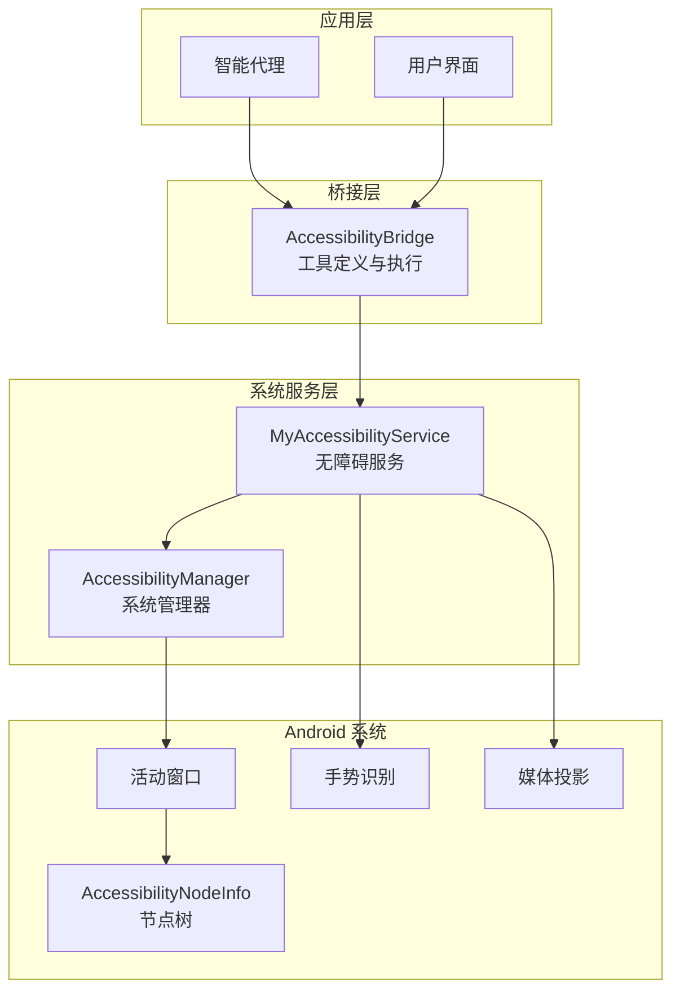

**图表来源**
- [AccessibilityBridge.kt:19-220](file://app/src/main/java/ai/openclaw/android/accessibility/AccessibilityBridge.kt#L19-L220)
- [MyAccessibilityService.kt:38-676](file://app/src/main/java/ai/openclaw/android/MyAccessibilityService.kt#L38-L676)

**章节来源**
- [AccessibilityBridge.kt:1-328](file://app/src/main/java/ai/openclaw/android/accessibility/AccessibilityBridge.kt#L1-L328)
- [MyAccessibilityService.kt:1-676](file://app/src/main/java/ai/openclaw/android/MyAccessibilityService.kt#L1-L676)

## 核心组件
无障碍桥接系统包含三个核心组件，每个组件都有明确的职责分工：

### AccessibilityBridge（桥接器）
负责将智能代理的工具调用转换为系统级的无障碍命令。它提供了 11 种不同的 UI 自动化工具，涵盖了从基础点击操作到高级屏幕截图的完整功能集。

### MyAccessibilityService（无障碍服务）
作为 Android 系统的无障碍服务，直接与系统交互执行具体的 UI 操作。它实现了所有底层的无障碍功能，包括节点查找、手势操作、文本输入等。

### 工具调用协议
采用标准化的工具定义格式，支持参数验证、类型检查和错误处理。所有工具都遵循统一的 JSON Schema 规范。

**章节来源**
- [AccessibilityBridge.kt:25-220](file://app/src/main/java/ai/openclaw/android/accessibility/AccessibilityBridge.kt#L25-L220)
- [MyAccessibilityService.kt:38-676](file://app/src/main/java/ai/openclaw/android/MyAccessibilityService.kt#L38-L676)
- [ModelModels.kt:33-73](file://app/src/main/java/ai/openclaw/android/model/ModelModels.kt#L33-L73)

## 架构概览
无障碍桥接系统采用分层架构设计，确保了良好的可维护性和扩展性。

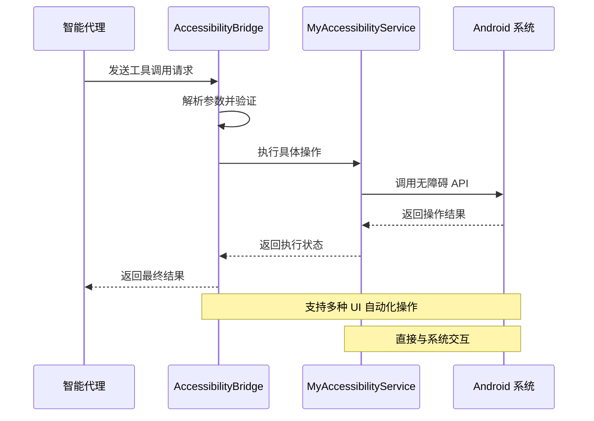

**图表来源**
- [AccessibilityBridge.kt:225-254](file://app/src/main/java/ai/openclaw/android/accessibility/AccessibilityBridge.kt#L225-L254)
- [MyAccessibilityService.kt:58-89](file://app/src/main/java/ai/openclaw/android/MyAccessibilityService.kt#L58-L89)

系统架构的关键特性：
- **分层设计**：桥接层负责逻辑协调，服务层负责系统交互
- **协议驱动**：统一的工具调用协议确保了系统的可扩展性
- **错误处理**：完善的异常捕获和错误返回机制
- **异步执行**：支持协程异步操作，提升响应性能

## 详细组件分析

### 工具调用协议详解
所有工具调用都遵循标准化的 JSON Schema 定义，确保了跨平台的一致性和可靠性。

#### 工具定义结构
每个工具包含以下核心要素：
- **名称**：唯一标识符，用于区分不同操作
- **描述**：详细的用途说明和使用场景
- **参数**：严格的类型定义和验证规则
- **必需参数**：强制要求提供的参数列表

#### 参数验证机制
系统实现了多层次的参数验证：
1. **类型检查**：确保参数类型符合预期
2. **必需性验证**：检查必需参数是否完整
3. **范围限制**：对数值参数进行范围约束
4. **格式验证**：对特殊格式的参数进行校验

**章节来源**
- [ModelModels.kt:33-73](file://app/src/main/java/ai/openclaw/android/model/ModelModels.kt#L33-L73)
- [AccessibilityBridge.kt:256-263](file://app/src/main/java/ai/openclaw/android/accessibility/AccessibilityBridge.kt#L256-L263)

### UI 自动化操作 API

#### 元素查找操作
系统提供了多种元素查找方式，满足不同场景的需求：

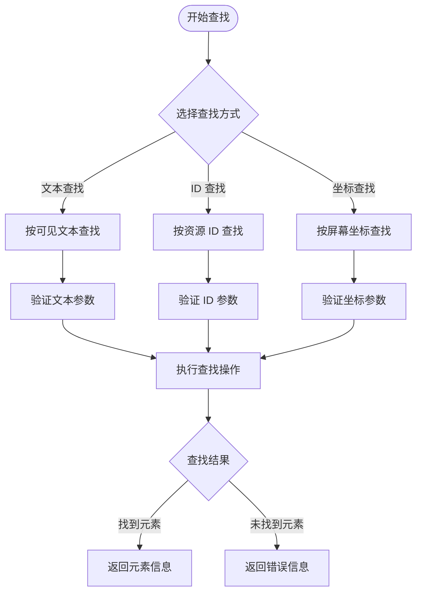

**图表来源**
- [MyAccessibilityService.kt:106-121](file://app/src/main/java/ai/openclaw/android/MyAccessibilityService.kt#L106-L121)
- [AccessibilityBridge.kt:306-322](file://app/src/main/java/ai/openclaw/android/accessibility/AccessibilityBridge.kt#L306-L322)

##### 文本查找
- **功能**：根据可见文本内容查找 UI 元素
- **参数**：`text`（必需）- 要搜索的文本内容
- **索引支持**：支持多匹配元素的索引选择
- **返回值**：元素位置信息和属性描述

##### ID 查找
- **功能**：根据资源 ID 查找特定 UI 元素
- **参数**：`resource_id`（必需）- 完整的资源 ID
- **索引支持**：支持同 ID 多元素的定位
- **优势**：比文本查找更精确可靠

##### 坐标查找
- **功能**：直接指定屏幕坐标进行元素定位
- **参数**：精确的 X、Y 坐标值
- **应用场景**：复杂布局或动态内容的精确定位

**章节来源**
- [MyAccessibilityService.kt:106-121](file://app/src/main/java/ai/openclaw/android/MyAccessibilityService.kt#L106-L121)
- [AccessibilityBridge.kt:180-193](file://app/src/main/java/ai/openclaw/android/accessibility/AccessibilityBridge.kt#L180-L193)

#### 点击操作 API

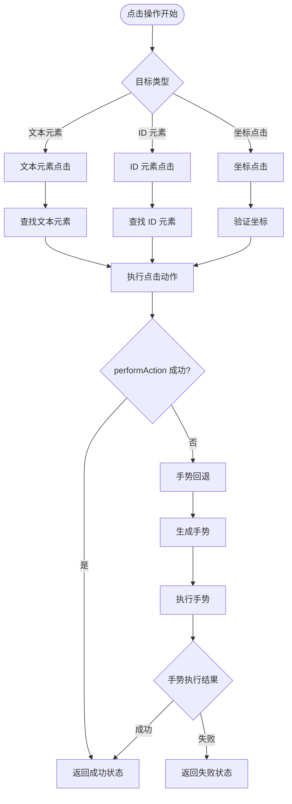

**图表来源**
- [MyAccessibilityService.kt:150-243](file://app/src/main/java/ai/openclaw/android/MyAccessibilityService.kt#L150-L243)
- [AccessibilityBridge.kt:265-275](file://app/src/main/java/ai/openclaw/android/accessibility/AccessibilityBridge.kt#L265-L275)

##### 基础点击
- **功能**：对可点击元素执行点击操作
- **参数**：`text`（必需）- 元素可见文本
- **索引支持**：`index`（可选）- 多匹配元素的选择
- **智能定位**：自动寻找可点击祖先节点

##### 长按操作
- **功能**：执行长按手势触发上下文菜单
- **参数**：`text`（必需）- 目标元素文本
- **持续时间**：默认 1000ms 长按
- **回退机制**：无法执行时自动转换为手势

##### 坐标点击
- **功能**：直接在屏幕坐标处执行点击
- **参数**：精确的 X、Y 坐标
- **应用场景**：特殊控件或自定义界面

**章节来源**
- [MyAccessibilityService.kt:150-295](file://app/src/main/java/ai/openclaw/android/MyAccessibilityService.kt#L150-L295)
- [AccessibilityBridge.kt:77-90](file://app/src/main/java/ai/openclaw/android/accessibility/AccessibilityBridge.kt#L77-L90)

#### 输入操作 API

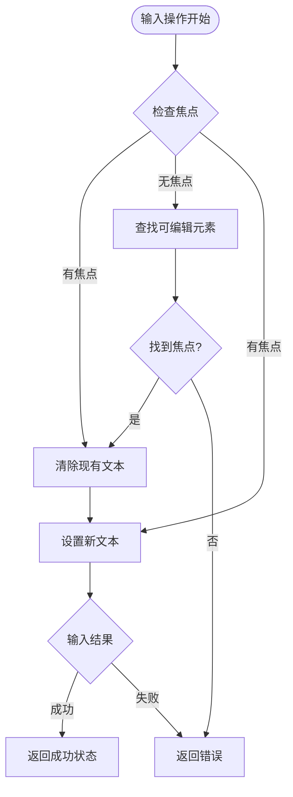

**图表来源**
- [MyAccessibilityService.kt:299-331](file://app/src/main/java/ai/openclaw/android/MyAccessibilityService.kt#L299-L331)
- [AccessibilityBridge.kt:94-107](file://app/src/main/java/ai/openclaw/android/accessibility/AccessibilityBridge.kt#L94-L107)

##### 文本输入
- **功能**：向当前聚焦的输入框输入文本
- **参数**：`text`（必需）- 要输入的文本内容
- **自动清理**：先清除现有内容再输入新内容
- **焦点检测**：自动检测并激活输入焦点

##### ID 输入
- **功能**：直接向指定 ID 的输入框输入文本
- **参数**：`resource_id`（必需）、`text`（必需）
- **索引支持**：支持多输入框的精确定位
- **可编辑验证**：确保目标元素支持文本输入

**章节来源**
- [MyAccessibilityService.kt:299-361](file://app/src/main/java/ai/openclaw/android/MyAccessibilityService.kt#L299-L361)
- [AccessibilityBridge.kt:94-107](file://app/src/main/java/ai/openclaw/android/accessibility/AccessibilityBridge.kt#L94-L107)

#### 滑动手势 API

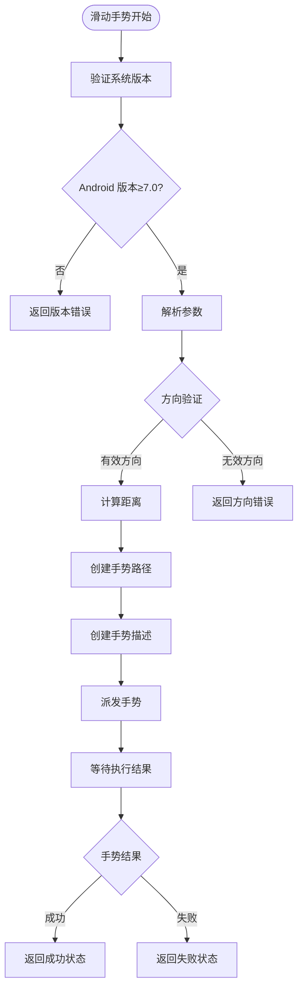

**图表来源**
- [MyAccessibilityService.kt:368-417](file://app/src/main/java/ai/openclaw/android/MyAccessibilityService.kt#L368-L417)
- [AccessibilityBridge.kt:111-128](file://app/src/main/java/ai/openclaw/android/accessibility/AccessibilityBridge.kt#L111-L128)

##### 基础滑动
- **功能**：执行屏幕滑动手势
- **参数**：
  - `direction`（必需）：滑动方向（up/down/left/right）
  - `distance`（可选）：滑动距离比例（0.0-1.0，默认 0.5）
- **智能计算**：基于屏幕高度计算实际滑动距离
- **固定时长**：手势持续时间固定为 300ms

##### 方向支持
- **上滑**：从底部向上滑动
- **下滑**：从顶部向下滑动
- **左滑**：从右向左滑动
- **右滑**：从左向右滑动

**章节来源**
- [MyAccessibilityService.kt:368-417](file://app/src/main/java/ai/openclaw/android/MyAccessibilityService.kt#L368-L417)
- [AccessibilityBridge.kt:111-128](file://app/src/main/java/ai/openclaw/android/accessibility/AccessibilityBridge.kt#L111-L128)

#### 系统按键 API

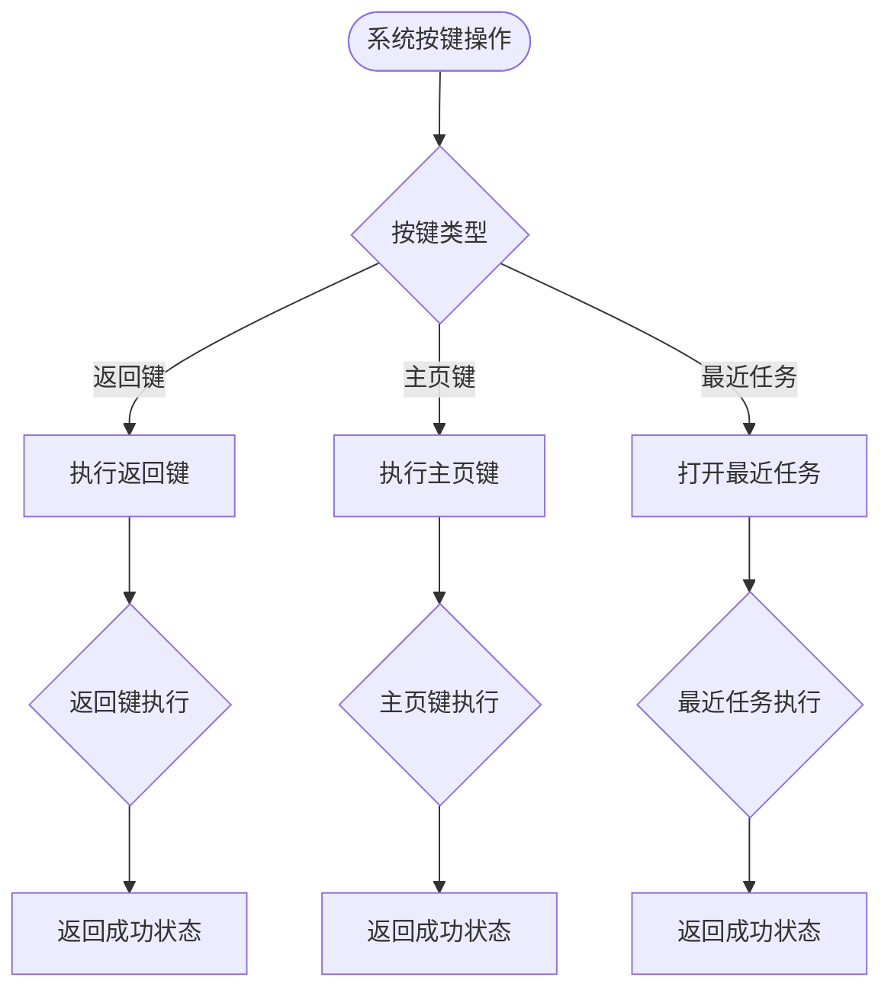

**图表来源**
- [MyAccessibilityService.kt:424-443](file://app/src/main/java/ai/openclaw/android/MyAccessibilityService.kt#L424-L443)
- [AccessibilityBridge.kt:132-152](file://app/src/main/java/ai/openclaw/android/accessibility/AccessibilityBridge.kt#L132-L152)

##### 返回键
- **功能**：模拟用户按下返回键
- **应用场景**：导航返回、关闭对话框、退出应用
- **系统集成**：通过全局动作 API 执行

##### 主页键
- **功能**：模拟用户按下主页键
- **应用场景**：快速回到主屏幕
- **系统集成**：通过全局动作 API 执行

##### 最近任务
- **功能**：打开最近使用的应用列表
- **应用场景**：应用间切换、任务管理
- **系统集成**：通过全局动作 API 执行

**章节来源**
- [MyAccessibilityService.kt:424-443](file://app/src/main/java/ai/openclaw/android/MyAccessibilityService.kt#L424-L443)
- [AccessibilityBridge.kt:132-152](file://app/src/main/java/ai/openclaw/android/accessibility/AccessibilityBridge.kt#L132-L152)

#### 屏幕读取与截图 API

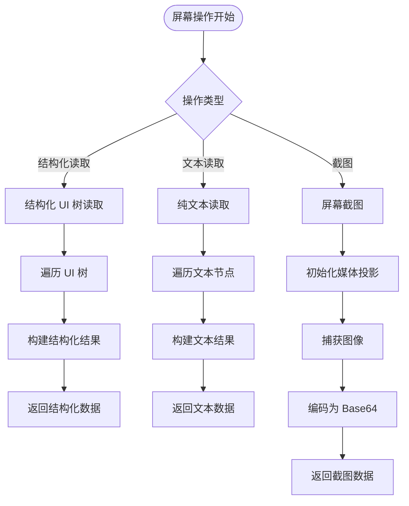

**图表来源**
- [MyAccessibilityService.kt:449-482](file://app/src/main/java/ai/openclaw/android/MyAccessibilityService.kt#L449-L482)
- [MyAccessibilityService.kt:509-546](file://app/src/main/java/ai/openclaw/android/MyAccessibilityService.kt#L509-L546)
- [AccessibilityBridge.kt:156-176](file://app/src/main/java/ai/openclaw/android/accessibility/AccessibilityBridge.kt#L156-L176)

##### 结构化屏幕读取
- **功能**：读取当前屏幕的完整 UI 结构
- **输出格式**：层次化的节点信息，包含类型、文本、位置等
- **截断保护**：超长输出自动截断，防止内存溢出
- **适用场景**：UI 分析、元素定位、自动化脚本编写

##### 文本读取
- **功能**：提取屏幕上所有可见文本
- **内容范围**：包括元素文本和内容描述
- **去重机制**：避免重复文本的多次输出
- **长度限制**：超过阈值自动截断

##### 屏幕截图
- **功能**：捕获当前屏幕内容
- **格式要求**：Android 8.0+ 支持截图功能
- **编码格式**：Base64 编码便于传输和存储
- **质量控制**：JPEG 压缩，质量 80%

**章节来源**
- [MyAccessibilityService.kt:449-546](file://app/src/main/java/ai/openclaw/android/MyAccessibilityService.kt#L449-L546)
- [AccessibilityBridge.kt:156-176](file://app/src/main/java/ai/openclaw/android/accessibility/AccessibilityBridge.kt#L156-L176)

#### 应用控制 API

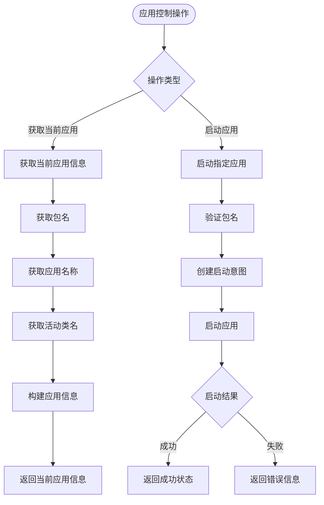

**图表来源**
- [MyAccessibilityService.kt:575-587](file://app/src/main/java/ai/openclaw/android/MyAccessibilityService.kt#L575-L587)
- [MyAccessibilityService.kt:592-605](file://app/src/main/java/ai/openclaw/android/MyAccessibilityService.kt#L592-L605)
- [AccessibilityBridge.kt:197-218](file://app/src/main/java/ai/openclaw/android/accessibility/AccessibilityBridge.kt#L197-L218)

##### 当前应用信息
- **功能**：获取当前活跃应用的详细信息
- **返回内容**：应用标签、包名、当前活动类名
- **系统集成**：直接查询系统窗口信息
- **应用场景**：应用识别、上下文感知

##### 应用启动
- **功能**：启动指定包名的应用程序
- **参数**：`package_name`（必需）- 目标应用包名
- **权限要求**：需要相应的应用启动权限
- **错误处理**：无效包名或权限不足时返回错误

**章节来源**
- [MyAccessibilityService.kt:575-605](file://app/src/main/java/ai/openclaw/android/MyAccessibilityService.kt#L575-L605)
- [AccessibilityBridge.kt:197-218](file://app/src/main/java/ai/openclaw/android/accessibility/AccessibilityBridge.kt#L197-L218)

### 无障碍事件监听机制

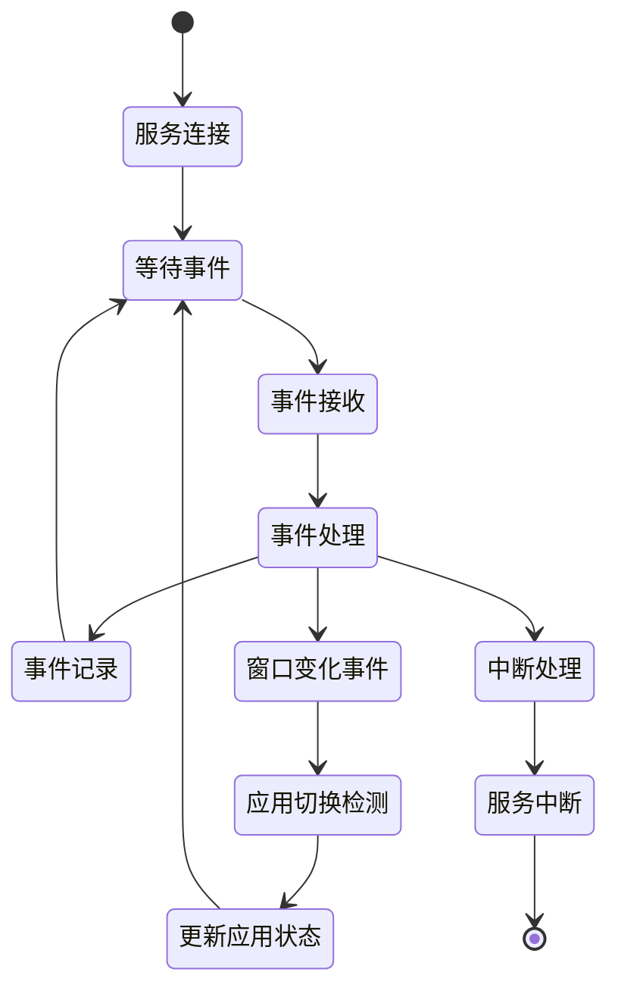

**图表来源**
- [MyAccessibilityService.kt:81-89](file://app/src/main/java/ai/openclaw/android/MyAccessibilityService.kt#L81-L89)
- [MyAccessibilityService.kt:91-93](file://app/src/main/java/ai/openclaw/android/MyAccessibilityService.kt#L91-L93)

系统实现了完整的无障碍事件监听机制：
- **事件类型**：支持所有类型的无障碍事件
- **事件处理**：实时监控应用状态变化
- **调试支持**：详细的事件日志记录
- **资源管理**：正确的生命周期管理和资源释放

**章节来源**
- [MyAccessibilityService.kt:81-99](file://app/src/main/java/ai/openclaw/android/MyAccessibilityService.kt#L81-L99)

## 依赖关系分析

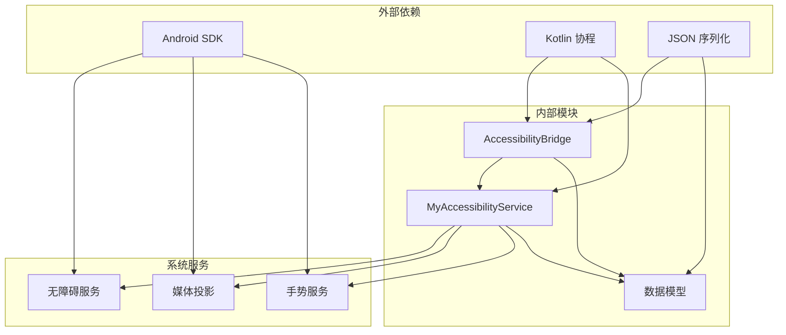

**图表来源**
- [AndroidManifest.xml:83-94](file://app/src/main/AndroidManifest.xml#L83-L94)
- [accessibility_config.xml:1-10](file://app/src/main/res/xml/accessibility_config.xml#L1-L10)

### 外部依赖
- **Android SDK**：提供无障碍 API 和系统服务访问
- **Kotlin 协程**：支持异步操作和并发处理
- **JSON 序列化**：工具调用参数的解析和验证

### 内部模块依赖
- **桥接层**：依赖服务层的具体实现
- **服务层**：依赖系统无障碍服务和媒体投影
- **数据模型**：提供标准化的工具定义和参数结构

**章节来源**
- [AndroidManifest.xml:1-123](file://app/src/main/AndroidManifest.xml#L1-L123)
- [accessibility_config.xml:1-10](file://app/src/main/res/xml/accessibility_config.xml#L1-L10)

## 性能考量
无障碍操作的性能优化是系统设计的重要考虑因素：

### 异步执行策略
- **协程调度**：使用 Dispatchers.Main 确保 UI 操作的线程安全
- **超时控制**：手势操作设置合理的超时时间（1-2秒）
- **并发限制**：避免同时执行过多的无障碍操作

### 资源管理优化
- **媒体投影复用**：截图功能复用已初始化的媒体投影
- **节点缓存**：合理利用 AccessibilityNodeInfo 的缓存机制
- **内存控制**：及时释放不再使用的节点和图像资源

### 网络和存储优化
- **Base64 编码**：截图数据的高效编码和传输
- **压缩策略**：JPEG 压缩保证图像质量的同时减小体积
- **增量更新**：只传输必要的数据变更

## 故障排除指南

### 常见问题诊断

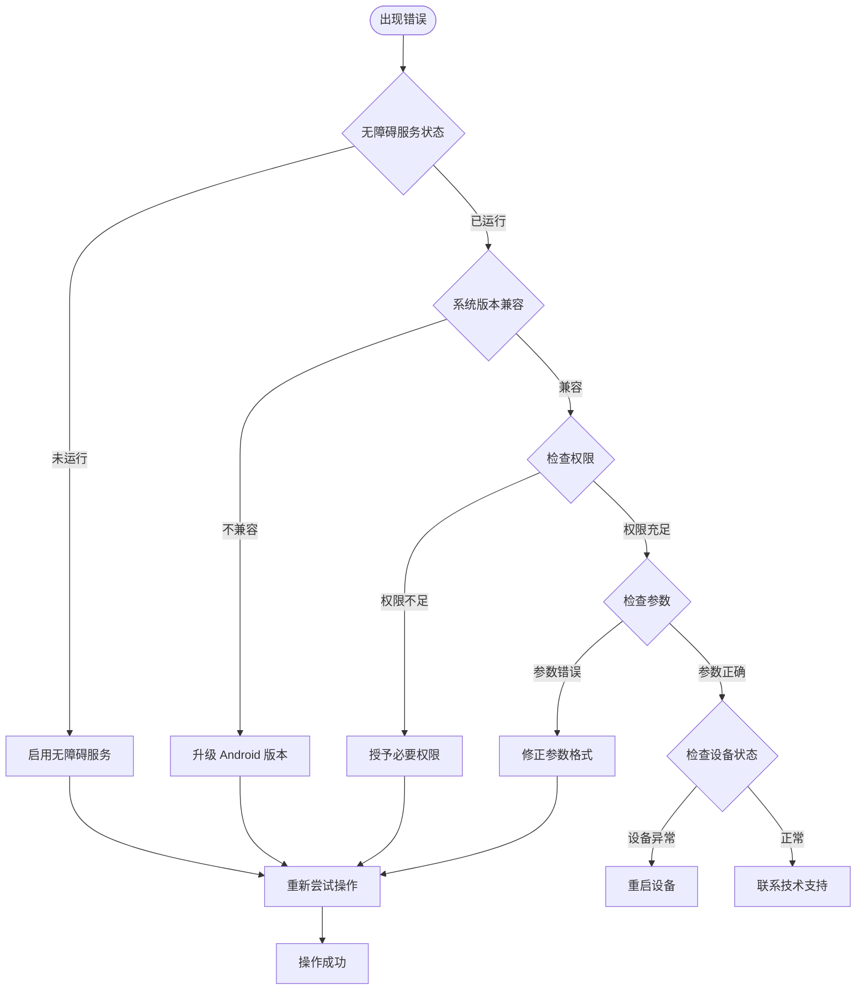

**图表来源**
- [AccessibilityBridge.kt:228-230](file://app/src/main/java/ai/openclaw/android/accessibility/AccessibilityBridge.kt#L228-L230)
- [MyAccessibilityService.kt:490-493](file://app/src/main/java/ai/openclaw/android/MyAccessibilityService.kt#L490-L493)

### 权限相关问题
- **无障碍服务权限**：确保应用已获得无障碍服务绑定权限
- **截图权限**：Android 8.0+ 需要媒体投影相关权限
- **应用启动权限**：某些设备可能需要额外的应用管理权限

### 版本兼容性问题
- **API 级别要求**：部分功能需要特定的 Android 版本支持
- **手势 API**：滑动手势功能需要 Android 7.0+
- **截图功能**：屏幕截图需要 Android 8.0+

### 参数验证错误
- **必需参数缺失**：检查工具调用中是否缺少必需参数
- **参数类型不匹配**：确保参数类型符合工具定义要求
- **参数范围超出**：验证数值参数是否在允许范围内

**章节来源**
- [AccessibilityBridge.kt:228-304](file://app/src/main/java/ai/openclaw/android/accessibility/AccessibilityBridge.kt#L228-L304)
- [MyAccessibilityService.kt:490-513](file://app/src/main/java/ai/openclaw/android/MyAccessibilityService.kt#L490-L513)

## 结论
无障碍桥接接口为 Android 平台的 UI 自动化提供了完整而强大的解决方案。通过标准化的工具调用协议和分层架构设计，系统实现了：

### 核心优势
- **功能完整性**：覆盖了从基础点击到高级截图的完整 UI 自动化功能
- **易用性**：简洁的 API 设计和清晰的参数定义
- **可靠性**：完善的错误处理和回退机制
- **扩展性**：模块化的架构便于功能扩展和维护

### 技术特色
- **协议驱动**：统一的工具调用协议确保了跨平台的一致性
- **智能回退**：多种操作方式的智能选择和回退机制
- **性能优化**：异步执行和资源管理的综合优化
- **安全考虑**：严格的参数验证和权限控制

### 应用价值
该接口为智能代理系统提供了强大的设备控制能力，使得 AI 助手能够直接与移动设备进行交互，实现了真正的端侧智能自动化。通过持续的功能完善和性能优化，该系统为未来的移动智能应用奠定了坚实的技术基础。

## 附录

### API 使用示例

#### 基础点击操作
```json
{
  "function": "click",
  "arguments": "{\"text\": \"确定\", \"index\": 0}"
}
```

#### 文本输入操作
```json
{
  "function": "input_text", 
  "arguments": "{\"text\": \"Hello World\"}"
}
```

#### 屏幕截图操作
```json
{
  "function": "screenshot",
  "arguments": "{}"
}
```

### 权限配置清单
- **无障碍服务权限**：`BIND_ACCESSIBILITY_SERVICE`
- **网络访问权限**：`INTERNET`、`ACCESS_NETWORK_STATE`
- **前台服务权限**：`FOREGROUND_SERVICE`
- **通知权限**：`POST_NOTIFICATIONS`

### 最佳实践建议
1. **参数验证**：始终验证工具调用参数的有效性
2. **错误处理**：实现完善的异常捕获和错误恢复机制
3. **性能监控**：监控操作执行时间和资源使用情况
4. **安全性**：限制敏感操作的执行范围和权限
5. **兼容性**：考虑不同 Android 版本和设备的兼容性问题