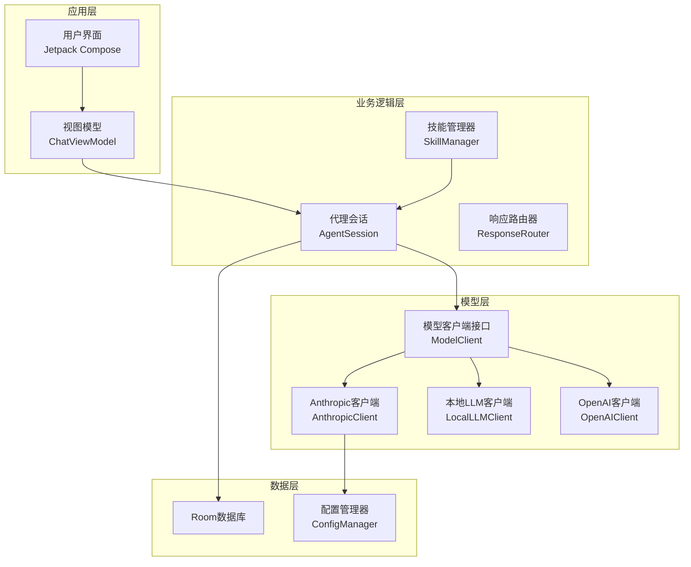
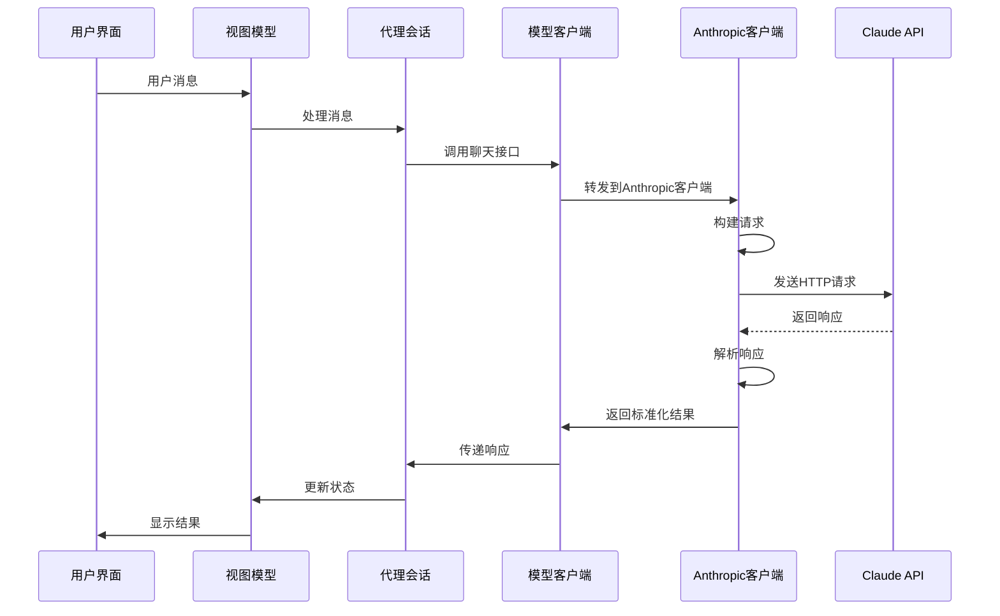
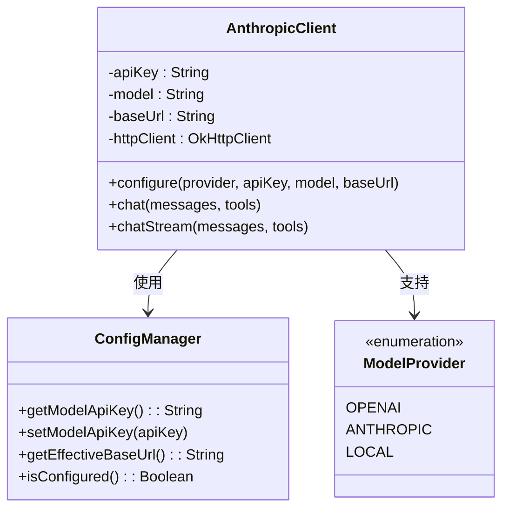
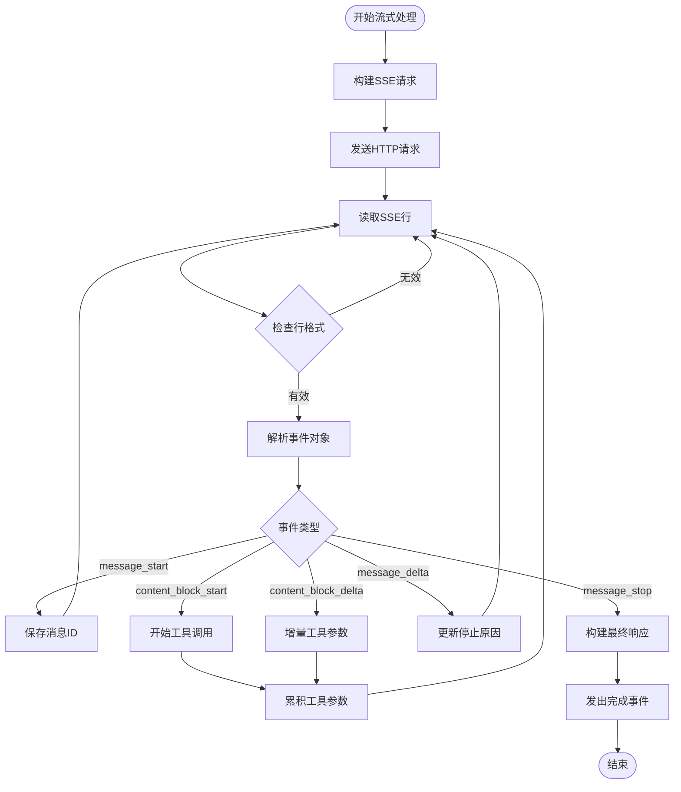
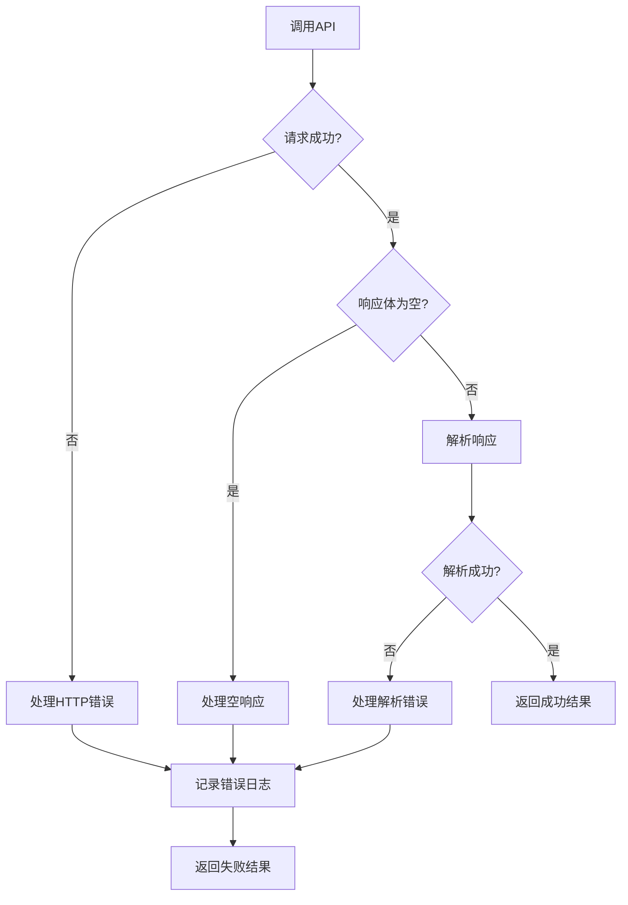
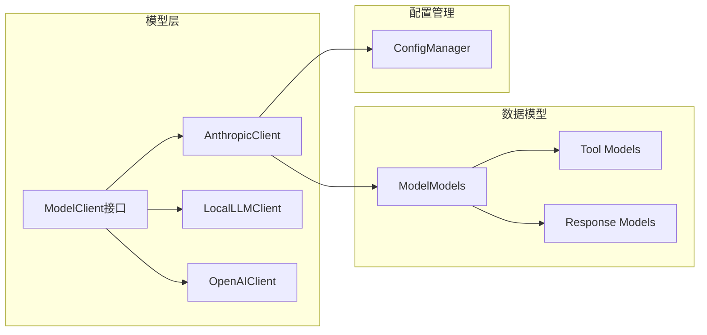

# Anthropic客户端实现

<cite>
**本文档引用的文件**
- [AnthropicClient.kt](file://app/src/main/java/ai/openclaw/android/model/AnthropicClient.kt)
- [ModelModels.kt](file://app/src/main/java/ai/openclaw/android/model/ModelModels.kt)
- [ModelClient.kt](file://app/src/main/java/ai/openclaw/android/model/ModelClient.kt)
- [ConfigManager.kt](file://app/src/main/java/ai/openclaw/android/ConfigManager.kt)
- [CLAUDE.md](file://CLAUDE.md)
</cite>

## 目录
1. [简介](#简介)
2. [项目结构](#项目结构)
3. [核心组件](#核心组件)
4. [架构概览](#架构概览)
5. [详细组件分析](#详细组件分析)
6. [依赖关系分析](#依赖关系分析)
7. [性能考虑](#性能考虑)
8. [故障排除指南](#故障排除指南)
9. [结论](#结论)

## 简介

Anthropic客户端实现是OpenClaw Android应用中的关键组件，负责与Anthropic Claude AI服务进行集成。该实现提供了完整的Claude API集成功能，包括非流式对话、流式响应处理、工具调用支持以及特殊的Anthropic API配置要求。

该客户端实现了统一的ModelClient接口，支持Anthropic Messages API的SSE流式传输，并专门处理了Anthropic与OpenAI API之间的格式差异。通过精心设计的数据模型和事件系统，该实现能够高效地处理复杂的多模态对话场景。

## 项目结构

OpenClaw项目采用模块化架构设计，Anthropic客户端位于模型层，与UI层、业务逻辑层和其他组件保持清晰的分离：



**图表来源**
- [ModelClient.kt:1-59](file://app/src/main/java/ai/openclaw/android/model/ModelClient.kt#L1-L59)
- [AnthropicClient.kt:37-100](file://app/src/main/java/ai/openclaw/android/model/AnthropicClient.kt#L37-L100)

**章节来源**
- [ModelClient.kt:1-59](file://app/src/main/java/ai/openclaw/android/model/ModelClient.kt#L1-L59)
- [CLAUDE.md:57-85](file://CLAUDE.md#L57-L85)

## 核心组件

### AnthropicClient类

AnthropicClient是主要的实现类，继承自ModelClient接口，提供了完整的Anthropic API集成功能：

- **认证机制**：使用x-api-key头部和anthropic-version头部进行身份验证
- **请求构建**：将标准消息格式转换为Anthropic特定的content blocks格式
- **流式处理**：支持SSE流式传输，实时处理content_block_start/stop/delta事件
- **工具调用**：完整支持Anthropic的工具调用功能，包括增量JSON参数收集

### 数据模型体系

项目实现了完整的数据模型体系来处理不同API格式之间的转换：

- **Message模型**：支持文本内容、工具调用、图像内容等多模态消息
- **Tool模型**：定义工具函数的名称、描述和参数结构
- **ModelResponse模型**：标准化所有模型响应格式
- **ChatEvent枚举**：流式事件的统一表示

**章节来源**
- [AnthropicClient.kt:37-100](file://app/src/main/java/ai/openclaw/android/model/AnthropicClient.kt#L37-L100)
- [ModelModels.kt:19-115](file://app/src/main/java/ai/openclaw/android/model/ModelModels.kt#L19-L115)

## 架构概览

Anthropic客户端在整个应用架构中扮演着关键角色，作为统一的模型抽象层：



**图表来源**
- [AnthropicClient.kt:68-82](file://app/src/main/java/ai/openclaw/android/model/AnthropicClient.kt#L68-L82)
- [ModelClient.kt:10-32](file://app/src/main/java/ai/openclaw/android/model/ModelClient.kt#L10-L32)

## 详细组件分析

### 认证与配置管理

Anthropic客户端使用标准的API密钥认证机制：



**图表来源**
- [AnthropicClient.kt:58-66](file://app/src/main/java/ai/openclaw/android/model/AnthropicClient.kt#L58-L66)
- [ConfigManager.kt:56-90](file://app/src/main/java/ai/openclaw/android/ConfigManager.kt#L56-L90)

### 请求格式转换

Anthropic客户端实现了复杂的消息格式转换逻辑：

#### 系统提示词处理
- Anthropic使用顶层system字段而不是消息数组中的system角色
- 系统消息从普通消息中提取并单独处理

#### 内容块格式
Anthropic使用typed content blocks格式：
- 文本内容：`{"type": "text", "text": "..."}`
- 图像内容：`{"type": "image", "source": {"type": "base64", "media_type": "...", "data": "..."}}`
- 工具调用：`{"type": "tool_use", "id": "...", "name": "...", "input": {...}}`
- 工具结果：`{"type": "tool_result", "tool_use_id": "...", "content": "..."}`

#### 工具定义转换
从OpenAI格式转换为Anthropic格式：
```json
{
  "name": "...",
  "description": "...",
  "input_schema": {
    "type": "object",
    "properties": {
      "param1": {"type": "string", "description": "..."},
      "param2": {"type": "number", "description": "..."}
    },
    "required": ["param1"]
  }
}
```

**章节来源**
- [AnthropicClient.kt:104-153](file://app/src/main/java/ai/openclaw/android/model/AnthropicClient.kt#L104-L153)
- [AnthropicClient.kt:163-229](file://app/src/main/java/ai/openclaw/android/model/AnthropicClient.kt#L163-L229)
- [AnthropicClient.kt:241-267](file://app/src/main/java/ai/openclaw/android/model/AnthropicClient.kt#L241-L267)

### 流式响应处理

Anthropic客户端实现了完整的SSE流式处理机制：



**图表来源**
- [AnthropicClient.kt:370-493](file://app/src/main/java/ai/openclaw/android/model/AnthropicClient.kt#L370-L493)

### 流式事件处理

客户端支持以下SSE事件类型：

- **message_start**：开始新消息，包含消息ID
- **content_block_start**：开始内容块，用于工具调用初始化
- **content_block_delta**：内容块增量更新
  - text_delta：文本增量
  - input_json_delta：工具参数JSON增量
- **message_delta**：消息增量，包含停止原因
- **message_stop**：消息结束，组装最终响应

**章节来源**
- [AnthropicClient.kt:370-493](file://app/src/main/java/ai/openclaw/android/model/AnthropicClient.kt#L370-L493)

### 错误处理与重试机制

客户端实现了多层次的错误处理：



**图表来源**
- [AnthropicClient.kt:271-292](file://app/src/main/java/ai/openclaw/android/model/AnthropicClient.kt#L271-L292)

**章节来源**
- [AnthropicClient.kt:271-292](file://app/src/main/java/ai/openclaw/android/model/AnthropicClient.kt#L271-L292)

## 依赖关系分析

### 外部依赖

项目使用以下关键外部库：

- **OkHttp 4.12**：HTTP客户端，支持SSE流式传输
- **Kotlin Serialization**：JSON序列化，替代Gson/Moshi
- **Kotlin Coroutines**：异步编程支持
- **Material3**：现代Android UI设计

### 内部依赖关系



**图表来源**
- [ModelClient.kt:10-32](file://app/src/main/java/ai/openclaw/android/model/ModelClient.kt#L10-L32)
- [ModelModels.kt:19-115](file://app/src/main/java/ai/openclaw/android/model/ModelModels.kt#L19-L115)

**章节来源**
- [CLAUDE.md:43-56](file://CLAUDE.md#L43-L56)
- [ModelClient.kt:10-32](file://app/src/main/java/ai/openclaw/android/model/ModelClient.kt#L10-L32)

## 性能考虑

### 连接池优化

客户端使用OkHttp连接池优化网络性能：
- 读超时：120秒
- 写超时：60秒  
- 连接超时：30秒
- 自动重用连接

### 内存管理

- 使用StringBuilder累积文本内容
- 工具调用参数使用增量累积
- 及时清理工具调用累加器
- 流式处理避免大内存占用

### 序列化优化

- 使用Kotlin Serialization替代反射
- 配置Json解析器忽略未知字段
- 启用lenient模式处理不规范响应

## 故障排除指南

### 常见问题及解决方案

#### API密钥认证失败
- **症状**：HTTP 401或403错误
- **原因**：API密钥无效或过期
- **解决**：检查ConfigManager中的密钥存储，重新配置API密钥

#### 流式连接中断
- **症状**：SSE连接意外断开
- **原因**：网络不稳定或服务器超时
- **解决**：检查网络连接，适当增加超时时间

#### 工具调用参数解析错误
- **症状**：工具调用参数JSON解析失败
- **原因**：增量JSON片段不完整
- **解决**：等待完整JSON后再执行工具调用

#### 模型响应格式不兼容
- **症状**：响应解析异常
- **原因**：Anthropic API版本变化
- **解决**：更新anthropic-version头部到最新版本

**章节来源**
- [ConfigManager.kt:56-90](file://app/src/main/java/ai/openclaw/android/ConfigManager.kt#L56-L90)
- [AnthropicClient.kt:42-43](file://app/src/main/java/ai/openclaw/android/model/AnthropicClient.kt#L42-L43)

## 结论

Anthropic客户端实现展现了优秀的软件工程实践，通过以下关键特性确保了高质量的Claude API集成：

### 技术优势

1. **格式适配**：完美处理Anthropic与OpenAI API格式差异
2. **流式处理**：完整的SSE流式传输支持
3. **工具调用**：原生支持Anthropic工具调用功能
4. **错误处理**：多层次的错误处理和恢复机制
5. **性能优化**：高效的内存管理和网络优化

### 最佳实践

1. **配置管理**：使用加密存储管理敏感API密钥
2. **异步处理**：充分利用Kotlin协程实现非阻塞I/O
3. **事件驱动**：基于Flow的响应式编程模型
4. **类型安全**：完整的Kotlin类型系统保证编译时安全
5. **模块化设计**：清晰的组件分离和接口抽象

该实现为Android平台上的AI集成提供了可靠的基础设施，支持复杂的多模态对话场景和工具调用需求，为后续的功能扩展奠定了坚实基础。