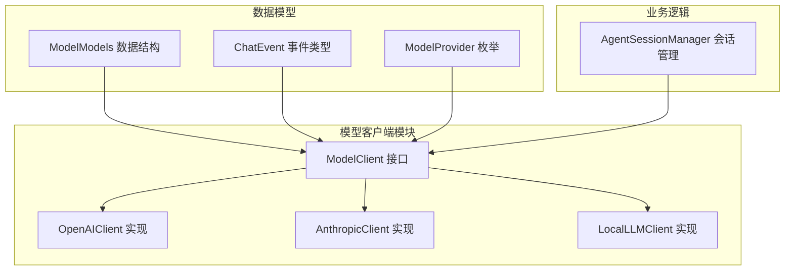
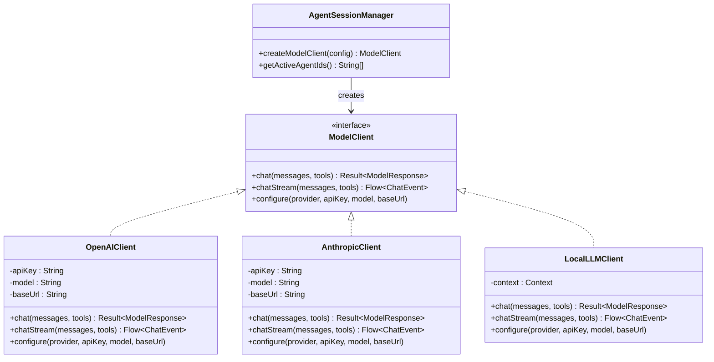
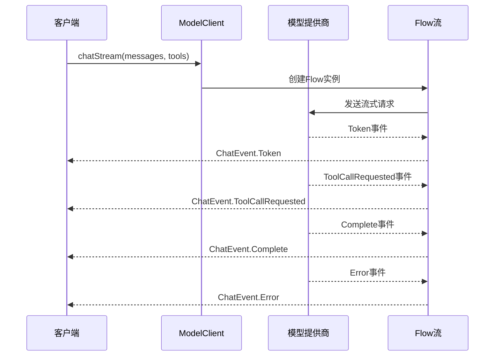
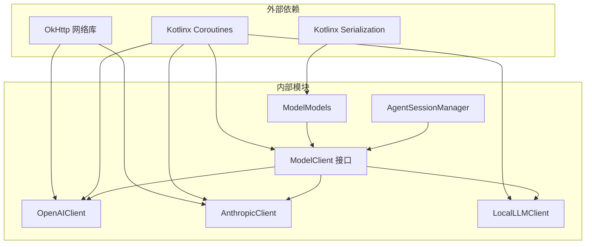

# ModelClient接口规范

<cite>
**本文档引用的文件**
- [ModelClient.kt](file://app/src/main/java/ai/openclaw/android/model/ModelClient.kt)
- [ModelModels.kt](file://app/src/main/java/ai/openclaw/android/model/ModelModels.kt)
- [OpenAIClient.kt](file://app/src/main/java/ai/openclaw/android/model/OpenAIClient.kt)
- [AnthropicClient.kt](file://app/src/main/java/ai/openclaw/android/model/AnthropicClient.kt)
- [LocalLLMClient.kt](file://app/src/main/java/ai/openclaw/android/model/LocalLLMClient.kt)
- [AgentSessionManager.kt](file://app/src/main/java/ai/openclaw/android/domain/agent/AgentSessionManager.kt)
- [CLAUDE.md](file://CLAUDE.md)
</cite>

## 目录
1. [简介](#简介)
2. [项目结构](#项目结构)
3. [核心组件](#核心组件)
4. [架构概览](#架构概览)
5. [详细组件分析](#详细组件分析)
6. [依赖关系分析](#依赖关系分析)
7. [性能考虑](#性能考虑)
8. [故障排除指南](#故障排除指南)
9. [结论](#结论)

## 简介

ModelClient接口是OpenClaw Android项目中统一的大型语言模型(Large Language Model)客户端抽象层。该接口定义了标准化的聊天接口，支持同步和异步两种调用模式，并提供了完整的流式传输机制。通过统一的接口设计，项目能够灵活地集成多种模型提供商，包括OpenAI兼容API、Anthropic Claude以及本地端侧推理模型。

该接口的核心价值在于为上层应用提供一致的编程体验，无论底层使用哪种具体的模型服务提供商，开发者都可以通过相同的API进行交互。这种设计模式有助于实现模型提供商的切换、测试隔离以及功能扩展。

## 项目结构

OpenClaw项目的模型客户端相关代码主要位于以下目录结构中：

**图表来源**
- [ModelClient.kt:1-59](file://app/src/main/java/ai/openclaw/android/model/ModelClient.kt#L1-L59)
- [ModelModels.kt:1-179](file://app/src/main/java/ai/openclaw/android/model/ModelModels.kt#L1-L179)

**章节来源**
- [ModelClient.kt:1-59](file://app/src/main/java/ai/openclaw/android/model/ModelClient.kt#L1-L59)
- [ModelModels.kt:1-179](file://app/src/main/java/ai/openclaw/android/model/ModelModels.kt#L1-L179)

## 核心组件

### ModelClient接口定义

ModelClient接口定义了统一的模型调用契约，包含三个核心方法：

1. **chat方法**：同步聊天请求，返回完整的响应结果
2. **chatStream方法**：异步流式聊天请求，实时返回生成的token
3. **configure方法**：配置模型提供商、API密钥、模型名称和基础URL

### 数据模型体系

系统采用Kotlin序列化注解定义了完整的数据传输对象：

- **Message**：对话消息结构，支持多模态内容
- **Tool/ToolFunction**：工具定义和函数参数
- **ModelResponse/Choice**：模型响应结构
- **Usage**：令牌使用统计信息
- **ChatRequest**：聊天请求封装

### 流式传输事件系统

ChatEvent密封类定义了四种标准事件类型，用于流式传输过程中的状态通知：

- **Token**：文本token生成事件
- **ToolCallRequested**：工具调用请求事件  
- **Complete**：流式传输完成事件
- **Error**：错误事件

**章节来源**
- [ModelClient.kt:10-32](file://app/src/main/java/ai/openclaw/android/model/ModelClient.kt#L10-L32)
- [ModelModels.kt:19-115](file://app/src/main/java/ai/openclaw/android/model/ModelModels.kt#L19-L115)
- [ModelClient.kt:37-49](file://app/src/main/java/ai/openclaw/android/model/ModelClient.kt#L37-L49)

## 架构概览

OpenClaw的模型客户端架构采用了策略模式和工厂模式的组合设计：

**图表来源**
- [ModelClient.kt:10-32](file://app/src/main/java/ai/openclaw/android/model/ModelClient.kt#L10-L32)
- [OpenAIClient.kt:30-42](file://app/src/main/java/ai/openclaw/android/model/OpenAIClient.kt#L30-L42)
- [AnthropicClient.kt:37-149](file://app/src/main/java/ai/openclaw/android/model/AnthropicClient.kt#L37-L149)
- [LocalLLMClient.kt:302-336](file://app/src/main/java/ai/openclaw/android/model/LocalLLMClient.kt#L302-L336)
- [AgentSessionManager.kt:142-175](file://app/src/main/java/ai/openclaw/android/domain/agent/AgentSessionManager.kt#L142-L175)

## 详细组件分析

### ModelClient接口规范

#### 方法签名详解

**chat方法**
- **返回类型**：`suspend fun chat(messages: List<Message>, tools: List<Tool>? = null): Result<ModelResponse>`
- **同步特性**：使用协程挂起，等待完整响应
- **参数规范**：
  - `messages`：必需，对话历史消息列表
  - `tools`：可选，工具定义列表，支持函数调用
- **返回值**：Result包装的ModelResponse，包含完整响应内容

**chatStream方法**
- **返回类型**：`fun chatStream(messages: List<Message>, tools: List<Tool>? = null): Flow<ChatEvent>`
- **异步特性**：返回Flow流，支持实时事件推送
- **参数规范**：与chat方法相同
- **事件流**：按顺序产生Token、ToolCallRequested、Complete或Error事件

**configure方法**
- **返回类型**：`fun configure(provider: ModelProvider, apiKey: String, model: String, baseUrl: String = "")`
- **配置作用**：设置模型提供商、API密钥、模型名称和基础URL
- **参数规范**：
  - `provider`：ModelProvider枚举值
  - `apiKey`：API访问密钥
  - `model`：具体模型名称
  - `baseUrl`：可选的基础URL，默认为空

#### 参数规范

**Message参数结构**
- `role`：角色标识（user、assistant、system、tool）
- `content`：消息内容字符串
- `toolCallId`：工具调用ID（当role为tool时必需）
- `toolCalls`：工具调用列表（当assistant调用工具时必需）
- `images`：可选的图像内容列表

**Tool参数结构**
- `type`：工具类型，默认"function"
- `function`：ToolFunction对象
  - `name`：函数名称
  - `description`：函数描述
  - `parameters`：ToolParameters对象

**ToolParameters结构**
- `type`：参数类型，默认"object"
- `properties`：参数属性映射
- `required`：必需参数列表

**章节来源**
- [ModelClient.kt:15-31](file://app/src/main/java/ai/openclaw/android/model/ModelClient.kt#L15-L31)
- [ModelModels.kt:19-73](file://app/src/main/java/ai/openclaw/android/model/ModelModels.kt#L19-L73)

### 流式传输机制

#### 同步vs异步对比

**同步传输（chat）**
- 一次性获取完整响应
- 适用于简单查询和不需要实时反馈的场景
- 内存占用相对较低
- 响应时间取决于完整生成时间

**异步流式传输（chatStream）**
- 实时逐token输出
- 提供更好的用户体验
- 支持工具调用的渐进式执行
- 需要处理Flow生命周期管理

#### 事件流处理流程

**图表来源**
- [ModelClient.kt:23-26](file://app/src/main/java/ai/openclaw/android/model/ModelClient.kt#L23-L26)
- [ModelClient.kt:37-49](file://app/src/main/java/ai/openclaw/android/model/ModelClient.kt#L37-L49)

#### 事件类型规范

**Token事件**
- **数据结构**：`data class Token(val text: String)`
- **触发时机**：每次生成新的文本token时
- **用途**：实时更新UI显示，提供流畅的输入体验

**ToolCallRequested事件**
- **数据结构**：`data class ToolCallRequested(val toolCall: ToolCall)`
- **触发时机**：模型决定调用某个工具时
- **用途**：允许外部系统执行工具调用，然后将结果回传给模型

**Complete事件**
- **数据结构**：`data class Complete(val response: ModelResponse)`
- **触发时机**：流式传输完全结束
- **用途**：提供最终的完整响应结果

**Error事件**
- **数据结构**：`data class Error(val message: String)`
- **触发时机**：发生任何错误时
- **用途**：错误传播和用户提示

**章节来源**
- [ModelClient.kt:37-49](file://app/src/main/java/ai/openclaw/android/model/ModelClient.kt#L37-L49)

### ModelProvider枚举详解

ModelProvider枚举定义了系统支持的三种模型提供商类型：

**OPENAI**
- **用途**：OpenAI兼容API服务
- **特点**：支持标准的OpenAI聊天补全格式
- **扩展**：可通过baseUrl参数支持其他兼容服务（如百炼）
- **适用场景**：云端大模型服务，功能最完整

**ANTHROPIC**
- **用途**：Anthropic Claude模型服务
- **特点**：专门的Claude API，支持不同的内容块格式
- **认证方式**：使用x-api-key头部和anthropic-version头部
- **适用场景**：需要Claude特定功能的场景

**LOCAL**
- **用途**：本地端侧推理模型
- **特点**：在设备本地运行，无需网络连接
- **示例模型**：Gemma 4E4B
- **适用场景**：隐私敏感、离线环境、低延迟要求

**章节来源**
- [ModelClient.kt:54-58](file://app/src/main/java/ai/openclaw/android/model/ModelClient.kt#L54-L58)

### 具体实现分析

#### OpenAIClient实现

OpenAIClient是ModelClient接口的标准实现，负责与OpenAI兼容的API进行通信：

**核心特性**
- 支持标准的OpenAI聊天补全API
- 实现完整的流式传输机制
- 支持工具调用功能
- 使用OkHttp进行网络请求

**配置管理**
- 默认基础URL：`https://dashscope.aliyuncs.com/compatible-mode/v1`
- JSON序列化配置：忽略未知字段、编码默认值、宽松模式
- 请求头设置：Content-Type为application/json

**章节来源**
- [OpenAIClient.kt:30-42](file://app/src/main/java/ai/openclaw/android/model/OpenAIClient.kt#L30-L42)

#### AnthropicClient实现

AnthropicClient专门处理Anthropic Claude模型的通信：

**API差异处理**
- 认证方式：x-api-key + anthropic-version头部
- 消息格式：内容块数组格式而非扁平字符串
- 工具调用：使用content_block_start/stop/delta SSE事件

**消息转换**
- 系统消息分离到顶层system字段
- 聊天消息转换为Anthropic格式
- 工具定义转换为Anthropic格式

**章节来源**
- [AnthropicClient.kt:28-36](file://app/src/main/java/ai/openclaw/android/model/AnthropicClient.kt#L28-L36)
- [AnthropicClient.kt:104-149](file://app/src/main/java/ai/openclaw/android/model/AnthropicClient.kt#L104-L149)

#### LocalLLMClient实现

LocalLLMClient处理本地端侧推理：

**核心优势**
- 完全离线运行，无需网络连接
- 低延迟响应
- 隐私保护，数据不离开设备
- 适合资源受限的移动设备

**实现特点**
- 使用会话锁确保线程安全
- 在IO调度器上执行长时间推理任务
- 支持视觉模型的降级处理
- 包装响应结果为标准格式

**章节来源**
- [LocalLLMClient.kt:302-336](file://app/src/main/java/ai/openclaw/android/model/LocalLLMClient.kt#L302-L336)

### 会话管理集成

AgentSessionManager负责根据配置动态创建合适的ModelClient实例：

**智能选择逻辑**
- 当用户选择LOCAL提供商时，优先使用共享的本地模型实例
- 对于其他提供商，解析模型字符串中的提供商前缀
- 支持从配置管理器获取API密钥和基础URL
- 实现LRU缓存机制管理会话实例

**配置解析规则**
- 模型字符串格式："provider/name"或"name"
- 默认提供商：OPENAI
- 模型名称提取：如果包含斜杠则取斜杠后的部分

**章节来源**
- [AgentSessionManager.kt:142-175](file://app/src/main/java/ai/openclaw/android/domain/agent/AgentSessionManager.kt#L142-L175)

## 依赖关系分析

**图表来源**
- [OpenAIClient.kt:22-26](file://app/src/main/java/ai/openclaw/android/model/OpenAIClient.kt#L22-L26)
- [AnthropicClient.kt:22-26](file://app/src/main/java/ai/openclaw/android/model/AnthropicClient.kt#L22-L26)
- [ModelModels.kt:3-4](file://app/src/main/java/ai/openclaw/android/model/ModelModels.kt#L3-L4)

**章节来源**
- [OpenAIClient.kt:22-26](file://app/src/main/java/ai/openclaw/android/model/OpenAIClient.kt#L22-L26)
- [AnthropicClient.kt:22-26](file://app/src/main/java/ai/openclaw/android/model/AnthropicClient.kt#L22-L26)
- [ModelModels.kt:3-4](file://app/src/main/java/ai/openclaw/android/model/ModelModels.kt#L3-L4)

## 性能考虑

### 流式传输优化

1. **背压处理**：Flow的自然背压机制防止内存溢出
2. **协程调度**：使用flowOn将I/O操作转移到专用调度器
3. **增量处理**：Token事件的增量处理减少内存占用
4. **生命周期管理**：及时取消不再需要的流式请求

### 内存管理

1. **对象池化**：LocalLLMClient使用会话锁避免重复创建
2. **流式消费**：优先使用chatStream而非chat以减少峰值内存
3. **缓存策略**：AgentSessionManager实现LRU缓存避免重复实例化

### 网络优化

1. **连接复用**：OkHttp自动管理连接池
2. **超时配置**：合理的超时设置平衡响应时间和资源占用
3. **重试机制**：在网络不稳定时提供适当的重试策略

## 故障排除指南

### 常见错误类型

**网络连接错误**
- 检查API密钥的有效性
- 验证基础URL的正确性
- 确认网络连接状态

**模型配置错误**
- 验证模型名称是否正确
- 检查提供商类型匹配
- 确认工具定义的JSON格式

**流式传输问题**
- 检查Flow收集器的生命周期
- 验证事件处理器的正确性
- 确认异常处理逻辑

### 错误处理最佳实践

1. **统一异常捕获**：在每个实现中都应捕获并转换为ChatEvent.Error
2. **日志记录**：详细的错误日志便于调试和监控
3. **优雅降级**：在网络失败时提供合理的回退策略
4. **资源清理**：确保流式传输结束后正确释放资源

**章节来源**
- [AnthropicClient.kt:96-99](file://app/src/main/java/ai/openclaw/android/model/AnthropicClient.kt#L96-L99)
- [LocalLLMClient.kt:332-336](file://app/src/main/java/ai/openclaw/android/model/LocalLLMClient.kt#L332-L336)

## 结论

ModelClient接口为OpenClaw Android项目提供了强大而灵活的模型客户端抽象层。通过统一的接口设计，项目成功实现了以下目标：

1. **多提供商支持**：统一接口下支持OpenAI、Anthropic和本地模型
2. **流式传输能力**：提供实时的用户体验和渐进式功能
3. **类型安全**：完整的Kotlin数据模型确保编译时类型检查
4. **可扩展性**：易于添加新的模型提供商和功能特性

该接口的设计充分考虑了Android平台的特殊需求，包括内存限制、网络条件变化和电池续航等因素。通过合理的错误处理和性能优化，为上层应用提供了稳定可靠的AI服务能力。

未来的发展方向包括支持更多模型提供商、增强流式传输的控制能力，以及进一步优化本地推理的性能表现。