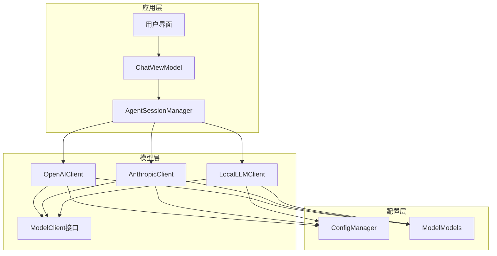
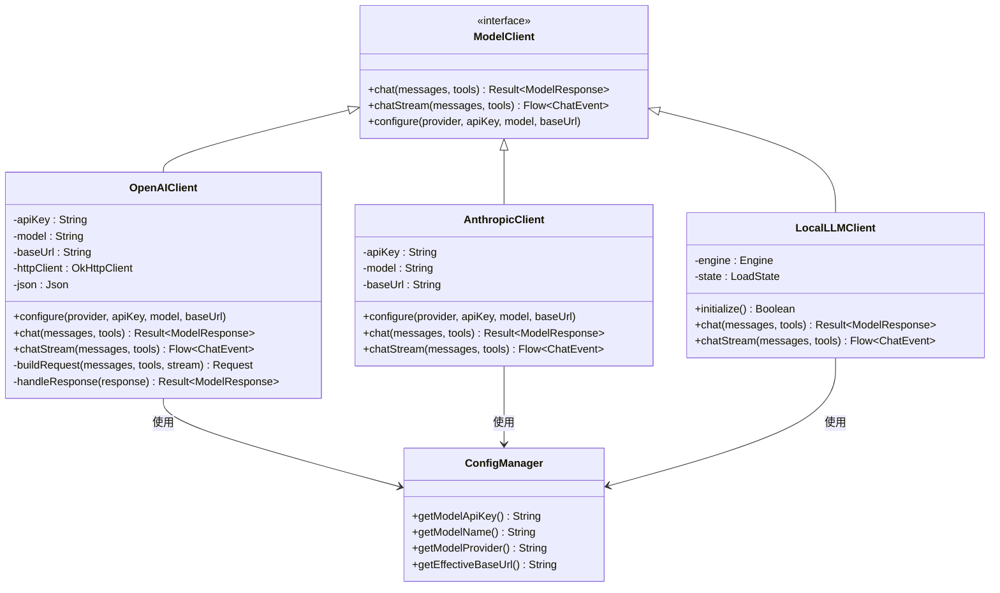
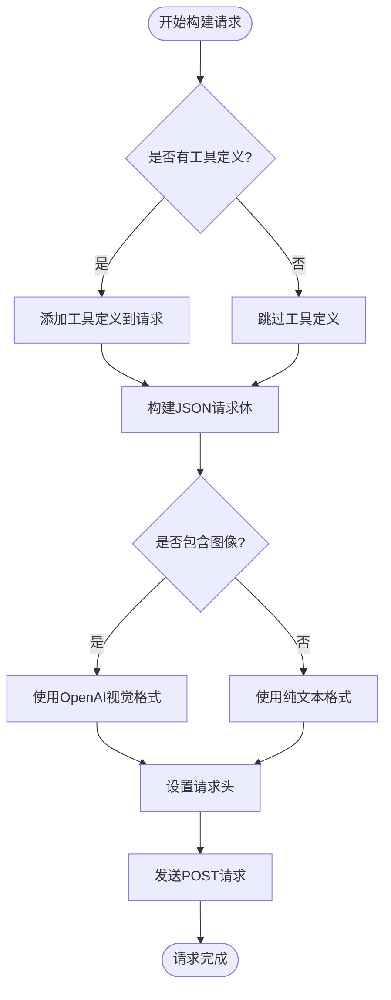
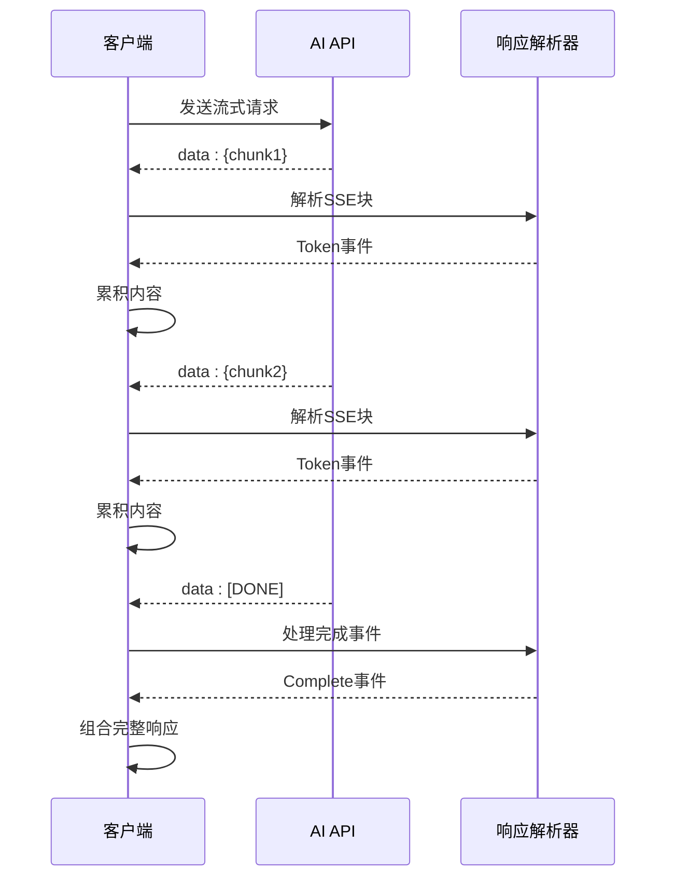
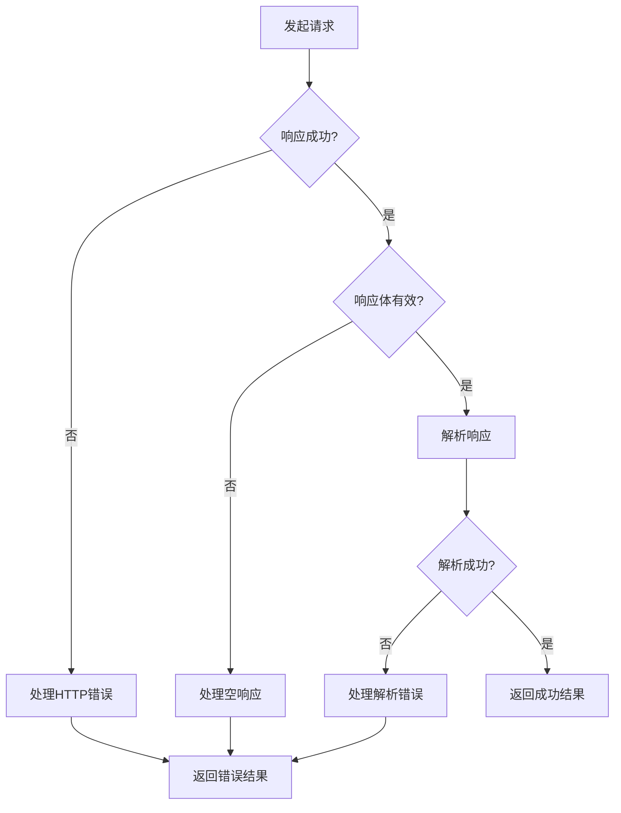
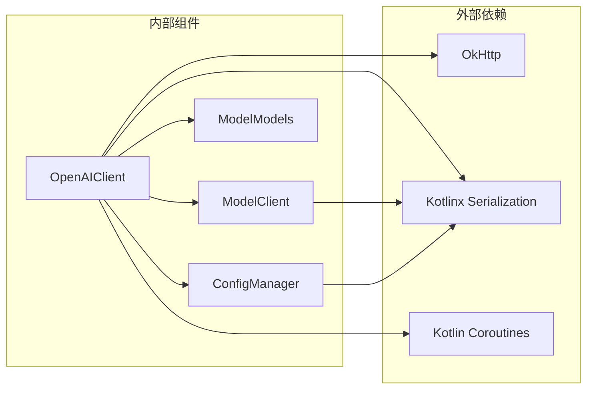

# OpenAI客户端实现

<cite>
**本文档引用的文件**
- [OpenAIClient.kt](file://app/src/main/java/ai/openclaw/android/model/OpenAIClient.kt)
- [ModelModels.kt](file://app/src/main/java/ai/openclaw/android/model/ModelModels.kt)
- [ModelClient.kt](file://app/src/main/java/ai/openclaw/android/model/ModelClient.kt)
- [ConfigManager.kt](file://app/src/main/java/ai/openclaw/android/ConfigManager.kt)
- [AgentSessionManager.kt](file://app/src/main/java/ai/openclaw/android/domain/agent/AgentSessionManager.kt)
- [ChatViewModel.kt](file://app/src/main/java/ai/openclaw/android/viewmodel/ChatViewModel.kt)
</cite>

## 目录
1. [简介](#简介)
2. [项目结构](#项目结构)
3. [核心组件](#核心组件)
4. [架构概览](#架构概览)
5. [详细组件分析](#详细组件分析)
6. [依赖关系分析](#依赖关系分析)
7. [性能考虑](#性能考虑)
8. [故障排除指南](#故障排除指南)
9. [结论](#结论)
10. [附录](#附录)

## 简介

OpenAIClient是OpenClaw Android项目中的核心AI模型客户端实现，专门用于与OpenAI兼容的API进行交互。该客户端支持以下关键功能：

- **OpenAI兼容API集成**：完全兼容OpenAI Chat Completions API标准格式
- **多服务支持**：通过baseUrl参数支持多种OpenAI兼容服务（包括百炼等）
- **流式响应处理**：支持Server-Sent Events (SSE) 流式响应
- **工具调用功能**：支持函数调用和工具执行
- **多模态支持**：支持图像和文本混合内容
- **错误处理机制**：完善的错误捕获和处理策略

## 项目结构

OpenAI客户端实现位于Android项目的模型层，采用清晰的分层架构设计：



**图表来源**
- [OpenAIClient.kt:1-332](file://app/src/main/java/ai/openclaw/android/model/OpenAIClient.kt#L1-L332)
- [ModelClient.kt:1-58](file://app/src/main/java/ai/openclaw/android/model/ModelClient.kt#L1-L58)
- [ConfigManager.kt:1-171](file://app/src/main/java/ai/openclaw/android/ConfigManager.kt#L1-L171)

**章节来源**
- [OpenAIClient.kt:1-332](file://app/src/main/java/ai/openclaw/android/model/OpenAIClient.kt#L1-L332)
- [ModelClient.kt:1-58](file://app/src/main/java/ai/openclaw/android/model/ModelClient.kt#L1-L58)
- [ConfigManager.kt:1-171](file://app/src/main/java/ai/openclaw/android/ConfigManager.kt#L1-L171)

## 核心组件

### OpenAIClient类

OpenAIClient是主要的AI模型客户端实现，继承自ModelClient接口，提供了完整的OpenAI兼容API支持。

**核心特性**：
- **配置管理**：支持动态配置API密钥、模型名称和基础URL
- **请求构建**：自动构建符合OpenAI标准的JSON请求体
- **响应处理**：解析标准的OpenAI响应格式
- **流式处理**：支持SSE流式响应的增量处理

**章节来源**
- [OpenAIClient.kt:30-332](file://app/src/main/java/ai/openclaw/android/model/OpenAIClient.kt#L30-L332)

### 数据模型

系统定义了完整的消息和响应数据结构：

**消息模型**：
- `Message`：支持角色、内容、工具调用ID和图像内容
- `ImageContent`：Base64编码的图像数据
- `ToolCall`：工具调用定义

**响应模型**：
- `ModelResponse`：标准的OpenAI响应格式
- `Choice`：单个响应选择
- `ResponseMessage`：响应消息内容

**章节来源**
- [ModelModels.kt:19-179](file://app/src/main/java/ai/openclaw/android/model/ModelModels.kt#L19-L179)

## 架构概览

OpenAIClient采用模块化设计，通过接口抽象实现了可扩展的模型客户端架构：



**图表来源**
- [ModelClient.kt:10-58](file://app/src/main/java/ai/openclaw/android/model/ModelClient.kt#L10-L58)
- [OpenAIClient.kt:30-332](file://app/src/main/java/ai/openclaw/android/model/OpenAIClient.kt#L30-L332)
- [ConfigManager.kt:11-171](file://app/src/main/java/ai/openclaw/android/ConfigManager.kt#L11-L171)

## 详细组件分析

### 请求构建机制

OpenAIClient实现了智能的请求构建逻辑，支持多种内容类型和配置选项：



**图表来源**
- [OpenAIClient.kt:94-133](file://app/src/main/java/ai/openclaw/android/model/OpenAIClient.kt#L94-L133)
- [OpenAIClient.kt:260-322](file://app/src/main/java/ai/openclaw/android/model/OpenAIClient.kt#L260-L322)

### 流式响应处理

客户端实现了完整的SSE流式响应处理机制：



**图表来源**
- [OpenAIClient.kt:157-248](file://app/src/main/java/ai/openclaw/android/model/OpenAIClient.kt#L157-L248)

### 错误处理机制

系统实现了多层次的错误处理策略：



**图表来源**
- [OpenAIClient.kt:135-155](file://app/src/main/java/ai/openclaw/android/model/OpenAIClient.kt#L135-L155)

**章节来源**
- [OpenAIClient.kt:60-92](file://app/src/main/java/ai/openclaw/android/model/OpenAIClient.kt#L60-L92)
- [OpenAIClient.kt:135-155](file://app/src/main/java/ai/openclaw/android/model/OpenAIClient.kt#L135-L155)

### 配置管理系统

ConfigManager提供了统一的配置管理功能：

**核心配置项**：
- `model_api_key`：API密钥存储（加密）
- `model_name`：模型名称
- `model_provider`：模型提供商
- `model_base_url`：自定义基础URL

**章节来源**
- [ConfigManager.kt:11-171](file://app/src/main/java/ai/openclaw/android/ConfigManager.kt#L11-L171)

## 依赖关系分析

OpenAIClient与其他组件的依赖关系如下：



**图表来源**
- [OpenAIClient.kt:19-23](file://app/src/main/java/ai/openclaw/android/model/OpenAIClient.kt#L19-L23)
- [ModelClient.kt:10-32](file://app/src/main/java/ai/openclaw/android/model/ModelClient.kt#L10-L32)

**章节来源**
- [OpenAIClient.kt:19-23](file://app/src/main/java/ai/openclaw/android/model/OpenAIClient.kt#L19-L23)
- [ModelClient.kt:10-32](file://app/src/main/java/ai/openclaw/android/model/ModelClient.kt#L10-L32)

## 性能考虑

### 连接池优化
- **超时配置**：连接超时30秒，读取超时120秒，写入超时60秒
- **线程池**：使用IO调度器处理网络请求
- **连接复用**：OkHttp自动管理连接池

### 内存管理
- **流式处理**：避免大响应体的内存峰值
- **StringBuilder累积**：高效处理增量内容
- **协程作用域**：确保异步操作的正确生命周期

### 响应解析优化
- **懒加载**：仅在需要时解析JSON
- **类型安全**：编译时验证数据结构
- **默认值处理**：忽略未知字段提高兼容性

## 故障排除指南

### 常见问题及解决方案

**1. 认证失败**
- 检查API密钥格式是否正确
- 确认基础URL指向正确的服务端点
- 验证网络连接和防火墙设置

**2. 流式响应中断**
- 检查服务器SSE支持情况
- 验证网络稳定性
- 实现适当的重连机制

**3. 工具调用失败**
- 确认工具定义的JSON格式正确
- 验证工具参数的类型匹配
- 检查工具执行权限

**4. 图像内容处理问题**
- 确认Base64编码格式正确
- 验证MIME类型设置
- 检查图像大小限制

**章节来源**
- [OpenAIClient.kt:88-92](file://app/src/main/java/ai/openclaw/android/model/OpenAIClient.kt#L88-L92)
- [OpenAIClient.kt:165-170](file://app/src/main/java/ai/openclaw/android/model/OpenAIClient.kt#L165-L170)

## 结论

OpenAIClient实现了功能完整、性能优异的OpenAI兼容API客户端，具有以下优势：

1. **高度兼容性**：完全遵循OpenAI API标准
2. **灵活配置**：支持多种服务提供商和自定义配置
3. **强大功能**：流式响应、工具调用、多模态支持
4. **健壮性**：完善的错误处理和恢复机制
5. **可扩展性**：模块化设计便于功能扩展

该实现为Android平台提供了专业级的AI模型集成解决方案，能够满足各种复杂的AI应用场景需求。

## 附录

### API端点规范

**基础端点**：`{baseUrl}/chat/completions`

**请求头**：
- `Authorization: Bearer {apiKey}`
- `Content-Type: application/json`
- `Accept: text/event-stream` (流式模式)

**请求参数**：
- `model`: 模型名称
- `messages`: 消息数组
- `tools`: 工具定义数组
- `temperature`: 采样温度
- `max_tokens`: 最大生成令牌数
- `stream`: 是否启用流式响应

**响应格式**：
- 标准OpenAI响应格式
- 支持增量流式传输
- 包含工具调用信息

### 集成示例

**基本配置**：
```kotlin
val client = OpenAIClient()
client.configure(
    provider = ModelProvider.OPENAI,
    apiKey = "your-api-key",
    model = "gpt-4-turbo",
    baseUrl = "https://api.openai.com/v1"
)
```

**工具调用示例**：
```kotlin
val tools = listOf(
    Tool(
        type = "function",
        function = ToolFunction(
            name = "weather_lookup",
            description = "获取天气信息",
            parameters = ToolParameters(
                properties = mapOf(
                    "location" to ToolProperty(type = "string"),
                    "unit" to ToolProperty(type = "string")
                ),
                required = listOf("location")
            )
        )
    )
)
```

**流式响应处理**：
```kotlin
client.chatStream(messages, tools).collect { event ->
    when (event) {
        is ChatEvent.Token -> processToken(event.text)
        is ChatEvent.ToolCallRequested -> executeTool(event.toolCall)
        is ChatEvent.Complete -> finalizeResponse(event.response)
        is ChatEvent.Error -> handleError(event.message)
    }
}
```