# 本地LLM客户端实现

<cite>
**本文档引用的文件**
- [LocalLLMClient.kt](file://app/src/main/java/ai/openclaw/android/model/LocalLLMClient.kt)
- [ModelClient.kt](file://app/src/main/java/ai/openclaw/android/model/ModelClient.kt)
- [ModelModels.kt](file://app/src/main/java/ai/openclaw/android/model/ModelModels.kt)
- [GatewayManager.kt](file://app/src/main/java/ai/openclaw/android/GatewayManager.kt)
- [AgentSessionManager.kt](file://app/src/main/java/ai/openclaw/android/domain/agent/AgentSessionManager.kt)
- [ConfigManager.kt](file://app/src/main/java/ai/openclaw/android/ConfigManager.kt)
- [DeviceCapabilities.kt](file://app/src/main/java/ai/openclaw/android/domain/DeviceCapabilities.kt)
- [ChatViewModel.kt](file://app/src/main/java/ai/openclaw/android/viewmodel/ChatViewModel.kt)
- [ModelDownloadManager.kt](file://app/src/main/java/ai/openclaw/android/voice/ModelDownloadManager.kt)
</cite>

## 目录
1. [简介](#简介)
2. [项目结构](#项目结构)
3. [核心组件](#核心组件)
4. [架构概览](#架构概览)
5. [详细组件分析](#详细组件分析)
6. [依赖关系分析](#依赖关系分析)
7. [性能考虑](#性能考虑)
8. [故障排除指南](#故障排除指南)
9. [结论](#结论)
10. [附录](#附录)

## 简介

LocalLLMClient是OpenClaw Android项目中的本地大语言模型客户端实现，基于Google的LiteRT-LM框架运行Gemma 4 E4B模型。该实现提供了完整的本地推理能力，包括模型加载、初始化、资源管理、工具调用和流式响应等功能。

本项目的核心目标是在Android设备上实现安全、高效的本地AI推理，减少对云端服务的依赖，提高用户隐私保护和响应速度。LocalLLMClient通过LiteRT-LM框架实现了以下关键特性：

- **多后端支持**：自动选择NPU、GPU或CPU作为推理后端
- **智能降级**：GPU初始化失败时自动回退到CPU
- **工具系统集成**：将模型工具调用桥接到OpenClaw技能系统
- **流式响应**：支持增量令牌生成和实时反馈
- **资源管理**：完善的生命周期管理和内存优化

## 项目结构

OpenClaw项目采用模块化架构设计，LocalLLMClient作为核心组件位于模型抽象层：

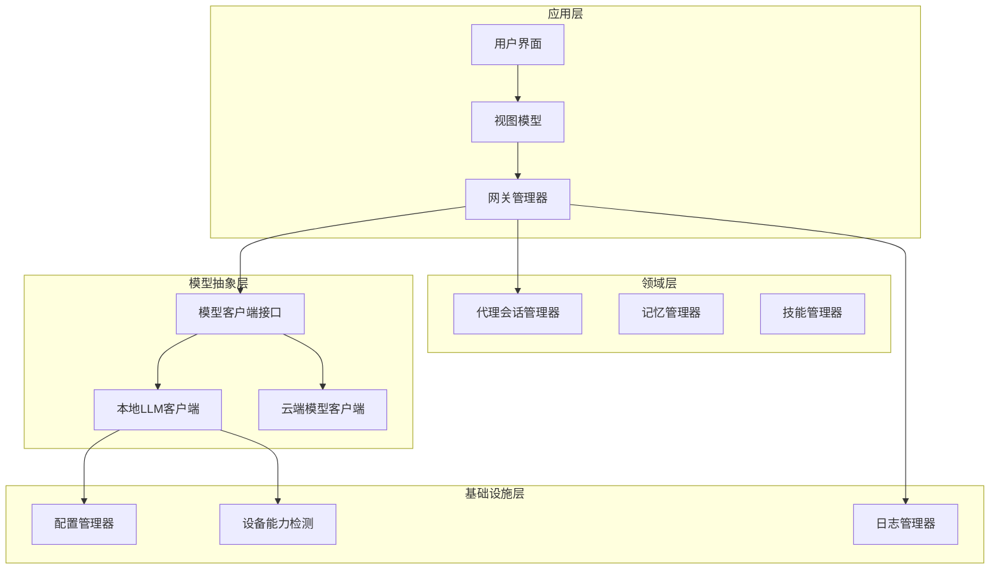

**图表来源**
- [GatewayManager.kt:390-589](file://app/src/main/java/ai/openclaw/android/GatewayManager.kt#L390-L589)
- [LocalLLMClient.kt:51-800](file://app/src/main/java/ai/openclaw/android/model/LocalLLMClient.kt#L51-L800)

**章节来源**
- [GatewayManager.kt:390-589](file://app/src/main/java/ai/openclaw/android/GatewayManager.kt#L390-L589)
- [LocalLLMClient.kt:1-807](file://app/src/main/java/ai/openclaw/android/model/LocalLLMClient.kt#L1-L807)

## 核心组件

### LocalLLMClient类

LocalLLMClient是本地推理的核心实现，继承自ModelClient接口，提供了完整的本地模型推理功能：

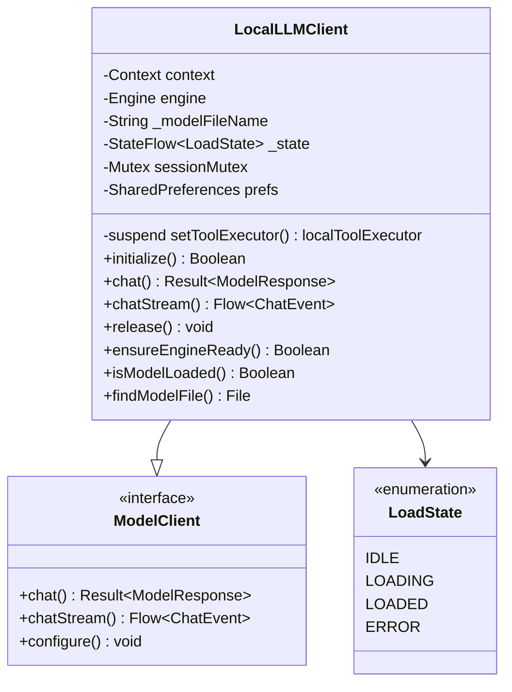

**图表来源**
- [LocalLLMClient.kt:51-800](file://app/src/main/java/ai/openclaw/android/model/LocalLLMClient.kt#L51-L800)
- [ModelClient.kt:10-32](file://app/src/main/java/ai/openclaw/android/model/ModelClient.kt#L10-L32)

### 模型数据结构

项目定义了完整的模型数据结构来支持本地推理：

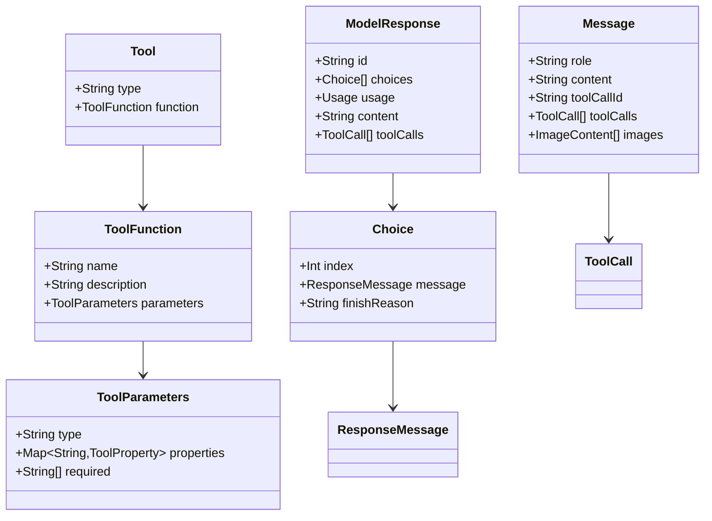

**图表来源**
- [ModelModels.kt:19-179](file://app/src/main/java/ai/openclaw/android/model/ModelModels.kt#L19-L179)

**章节来源**
- [LocalLLMClient.kt:51-800](file://app/src/main/java/ai/openclaw/android/model/LocalLLMClient.kt#L51-L800)
- [ModelClient.kt:10-59](file://app/src/main/java/ai/openclaw/android/model/ModelClient.kt#L10-L59)
- [ModelModels.kt:1-179](file://app/src/main/java/ai/openclaw/android/model/ModelModels.kt#L1-L179)

## 架构概览

LocalLLMClient的架构设计体现了分层解耦和职责分离的原则：

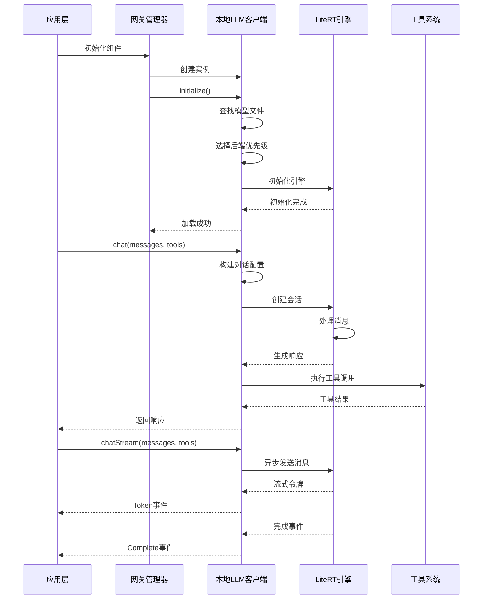

**图表来源**
- [GatewayManager.kt:390-422](file://app/src/main/java/ai/openclaw/android/GatewayManager.kt#L390-L422)
- [LocalLLMClient.kt:178-289](file://app/src/main/java/ai/openclaw/android/model/LocalLLMClient.kt#L178-L289)

## 详细组件分析

### 模型加载与初始化流程

LocalLLMClient的初始化过程包含了复杂的设备检测、后端选择和错误处理机制：

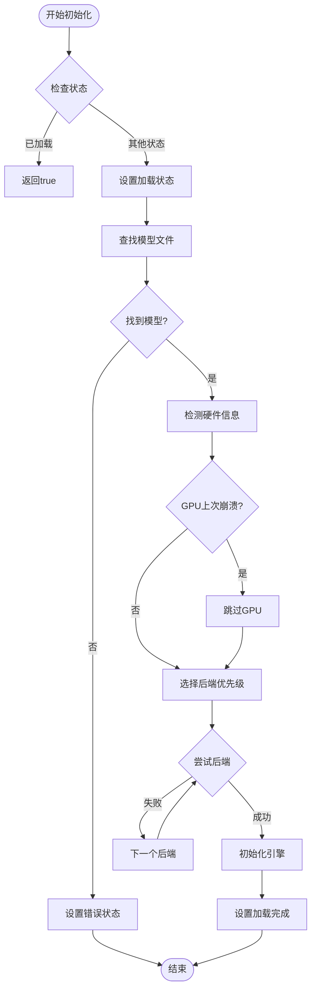

**图表来源**
- [LocalLLMClient.kt:178-289](file://app/src/main/java/ai/openclaw/android/model/LocalLLMClient.kt#L178-L289)

#### 后端优先级策略

LocalLLMClient根据设备硬件信息动态选择最优的推理后端：

| 设备品牌 | 后端优先级 | 特殊说明 |
|---------|-----------|----------|
| 麒麟/华为 | GPU → CPU | 跳过NPU（兼容性限制） |
| 荣耀 | GPU → CPU | GPU优先（NPU不稳定） |
| 高通平台 | NPU → GPU → CPU | 默认优先级 |
| 其他厂商 | GPU → CPU | 保守策略 |

**章节来源**
- [LocalLLMClient.kt:102-132](file://app/src/main/java/ai/openclaw/android/model/LocalLLMClient.kt#L102-L132)

### 对话配置与消息处理

LocalLLMClient实现了复杂的消息转换和对话配置逻辑：

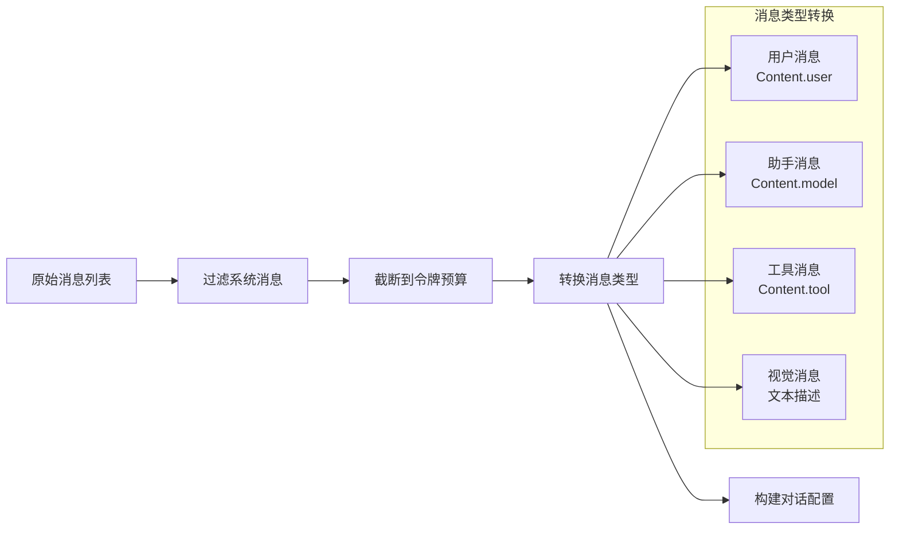

**图表来源**
- [LocalLLMClient.kt:399-470](file://app/src/main/java/ai/openclaw/android/model/LocalLLMClient.kt#L399-L470)

#### 视觉输入处理

由于LiteRT-LM SDK当前不支持直接的图像输入API，LocalLLMClient实现了视觉输入的降级处理：

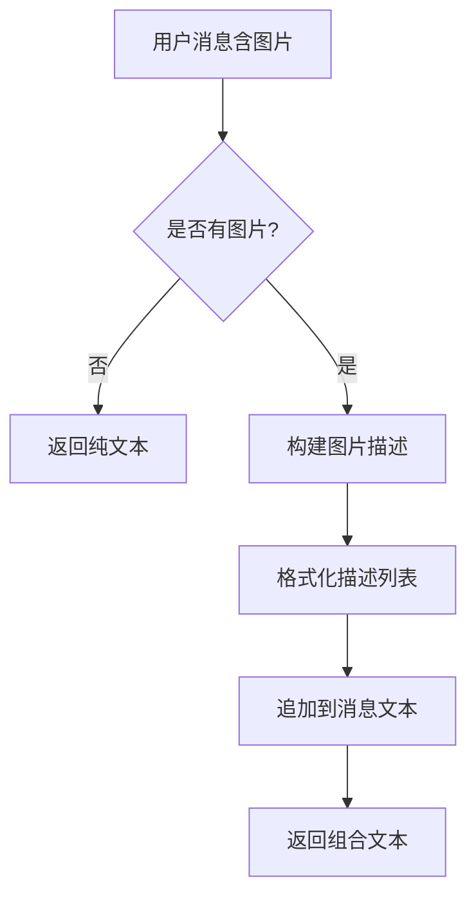

**图表来源**
- [LocalLLMClient.kt:482-491](file://app/src/main/java/ai/openclaw/android/model/LocalLLMClient.kt#L482-L491)

**章节来源**
- [LocalLLMClient.kt:399-491](file://app/src/main/java/ai/openclaw/android/model/LocalLLMClient.kt#L399-L491)

### 工具系统集成

LocalLLMClient将LiteRT的工具调用系统无缝集成到OpenClaw技能管理器中：

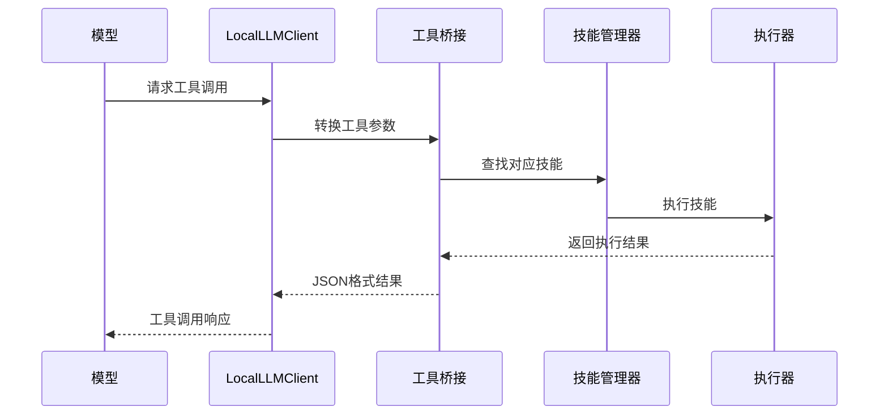

**图表来源**
- [LocalLLMClient.kt:508-555](file://app/src/main/java/ai/openclaw/android/model/LocalLLMClient.kt#L508-L555)
- [GatewayManager.kt:437-442](file://app/src/main/java/ai/openclaw/android/GatewayManager.kt#L437-L442)

#### 工具参数解析

LocalLLMClient支持多种工具参数格式的解析：

| 参数格式 | 示例 | 解析规则 |
|---------|------|----------|
| key="value" | func(param="test") | JSON对象格式 |
| key=value | func(flag=true) | 基本类型格式 |
| 单参数名 | func(debug) | 空字符串值 |
| 混合格式 | func(a="1", b=2) | 组合解析 |

**章节来源**
- [LocalLLMClient.kt:508-645](file://app/src/main/java/ai/openclaw/android/model/LocalLLMClient.kt#L508-L645)

### 流式响应处理

LocalLLMClient提供了完整的流式响应支持，包括增量令牌生成和错误恢复：

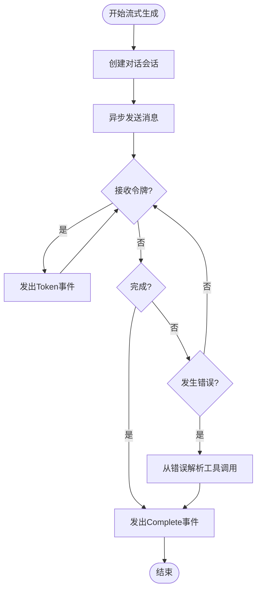

**图表来源**
- [LocalLLMClient.kt:338-391](file://app/src/main/java/ai/openclaw/android/model/LocalLLMClient.kt#L338-L391)

**章节来源**
- [LocalLLMClient.kt:338-391](file://app/src/main/java/ai/openclaw/android/model/LocalLLMClient.kt#L338-L391)

## 依赖关系分析

LocalLLMClient与其他组件的依赖关系体现了清晰的分层架构：

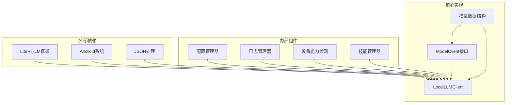

**图表来源**
- [LocalLLMClient.kt:1-50](file://app/src/main/java/ai/openclaw/android/model/LocalLLMClient.kt#L1-L50)
- [ConfigManager.kt:11-52](file://app/src/main/java/ai/openclaw/android/ConfigManager.kt#L11-L52)

### 组件耦合度分析

LocalLLMClient的设计遵循了低耦合高内聚的原则：

- **对外依赖**：仅依赖LiteRT-LM框架和Android系统API
- **对内聚合**：封装了完整的推理逻辑和资源管理
- **接口隔离**：通过ModelClient接口实现与上层的解耦
- **配置独立**：通过ConfigManager实现配置管理的独立性

**章节来源**
- [LocalLLMClient.kt:1-50](file://app/src/main/java/ai/openclaw/android/model/LocalLLMClient.kt#L1-L50)
- [ConfigManager.kt:11-52](file://app/src/main/java/ai/openclaw/android/ConfigManager.kt#L11-L52)

## 性能考虑

### 推理性能指标

LocalLLMClient在不同硬件平台上的性能表现：

| 硬件平台 | 后端 | 令牌生成速度 | 内存占用 | 模型大小 |
|---------|------|-------------|----------|----------|
| 骁龙8 Gen 3+ | GPU | ~22 tok/s | ~4GB | ~3.5GB |
| 骁龙8 Gen 3+ | CPU | ~18 tok/s | ~3GB | ~3.5GB |
| 中端设备 | GPU | ~15 tok/s | ~3GB | ~3.5GB |
| 中端设备 | CPU | ~12 tok/s | ~2GB | ~3.5GB |

### 内存优化策略

LocalLLMClient采用了多种内存优化技术：

1. **KV缓存管理**：LiteRT-LM自动管理KV缓存，减少重复计算
2. **模型量化**：使用混合4位/8位量化减少内存占用
3. **嵌入映射**：模型嵌入使用内存映射技术
4. **令牌预算控制**：动态截断消息以控制上下文长度

### 硬件兼容性

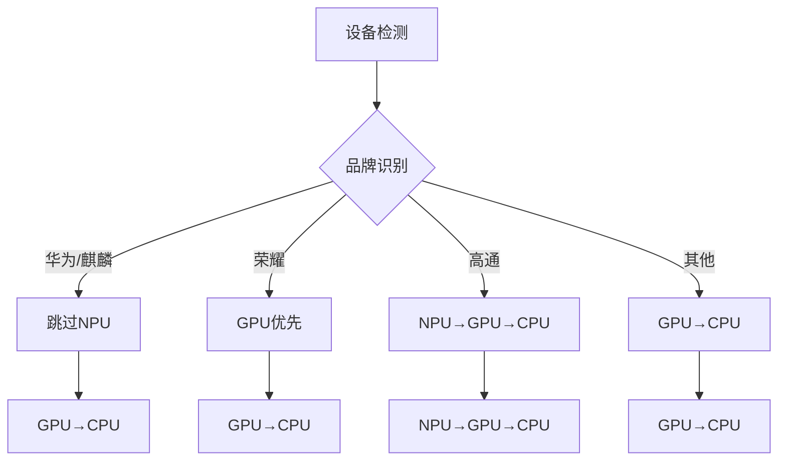

**图表来源**
- [LocalLLMClient.kt:102-132](file://app/src/main/java/ai/openclaw/android/model/LocalLLMClient.kt#L102-L132)

**章节来源**
- [LocalLLMClient.kt:42-50](file://app/src/main/java/ai/openclaw/android/model/LocalLLMClient.kt#L42-L50)
- [LocalLLMClient.kt:102-132](file://app/src/main/java/ai/openclaw/android/model/LocalLLMClient.kt#L102-L132)

## 故障排除指南

### 常见问题及解决方案

#### GPU初始化失败

**症状**：模型加载时GPU初始化超时或失败

**原因分析**：
1. GPU驱动兼容性问题
2. 设备内存不足
3. 系统权限限制

**解决步骤**：
1. 检查GPU崩溃计数和时间戳
2. 等待24小时自动重试窗口
3. 手动重置GPU崩溃标志
4. 回退到CPU后端

#### 模型文件找不到

**症状**：初始化时报错模型文件未找到

**排查步骤**：
1. 检查模型文件是否存在于`filesDir/models/`目录
2. 验证SD卡下载目录`/sdcard/Download/`中的文件
3. 确认模型文件扩展名为`.litertlm`
4. 检查文件权限和完整性

#### 工具调用执行失败

**症状**：模型请求工具调用但执行失败

**诊断方法**：
1. 检查工具名称是否正确匹配
2. 验证工具参数JSON格式
3. 确认技能管理器正常运行
4. 查看日志获取详细错误信息

### 错误恢复机制

LocalLLMClient实现了多层次的错误恢复机制：

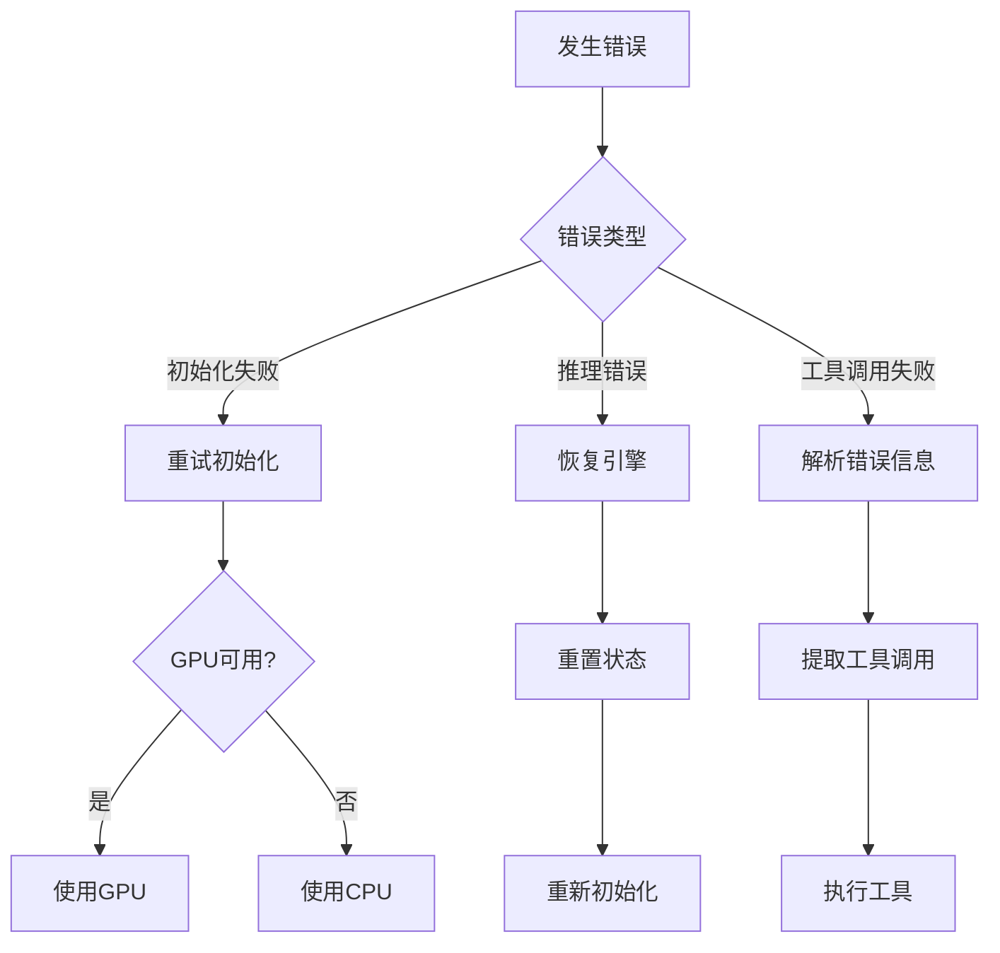

**图表来源**
- [LocalLLMClient.kt:291-300](file://app/src/main/java/ai/openclaw/android/model/LocalLLMClient.kt#L291-L300)
- [LocalLLMClient.kt:377-390](file://app/src/main/java/ai/openclaw/android/model/LocalLLMClient.kt#L377-L390)

**章节来源**
- [LocalLLMClient.kt:291-300](file://app/src/main/java/ai/openclaw/android/model/LocalLLMClient.kt#L291-L300)
- [LocalLLMClient.kt:377-390](file://app/src/main/java/ai/openclaw/android/model/LocalLLMClient.kt#L377-L390)

## 结论

LocalLLMClient作为OpenClaw项目的核心组件，成功实现了Android平台上的本地大语言模型推理。其设计体现了以下优势：

1. **架构清晰**：分层设计确保了良好的可维护性和扩展性
2. **性能优异**：针对不同硬件平台优化，提供稳定的推理性能
3. **容错性强**：完善的错误处理和自动恢复机制
4. **集成度高**：与技能系统和工具链深度集成
5. **用户体验好**：支持流式响应和实时反馈

未来可以考虑的改进方向：
- 支持更多模型格式和版本
- 增强模型文件管理功能
- 优化内存使用和电池消耗
- 扩展多模态输入支持

## 附录

### 配置选项参考

| 配置项 | 默认值 | 说明 |
|-------|--------|------|
| 模型名称 | gemma-4-E4B-it.litertlm | 支持的模型文件名 |
| 温度 | 0.7 | 控制生成随机性 |
| Top-K | 40 | 采样候选数量 |
| Top-P | 0.95 | 核采样概率阈值 |
| 最大令牌数 | 16384 | E4B模型最大上下文长度 |
| GPU超时 | 90秒 | GPU初始化超时时间 |
| CPU超时 | 60秒 | CPU初始化超时时间 |

### 使用场景建议

1. **隐私敏感应用**：医疗、金融等需要本地处理的应用
2. **离线环境**：无网络或网络受限的场景
3. **实时交互**：需要快速响应的聊天机器人
4. **多模态应用**：结合语音识别和合成的智能助手