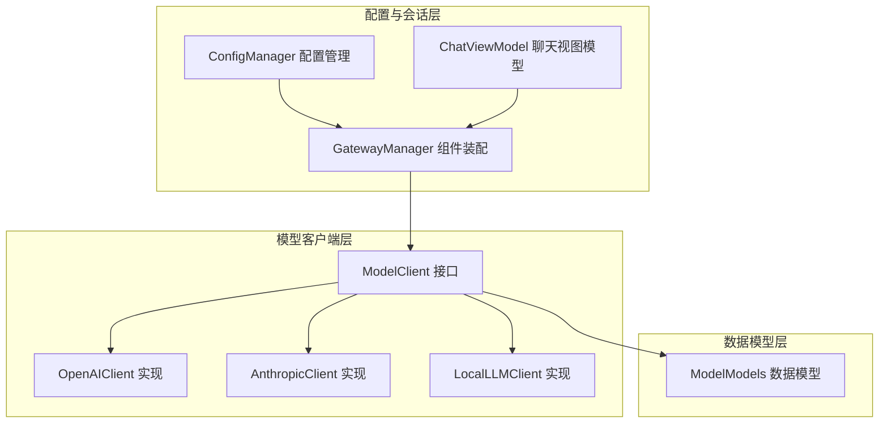
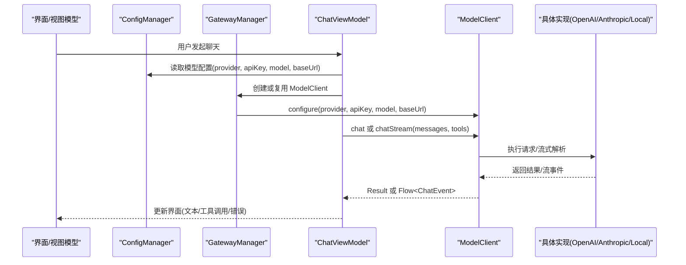
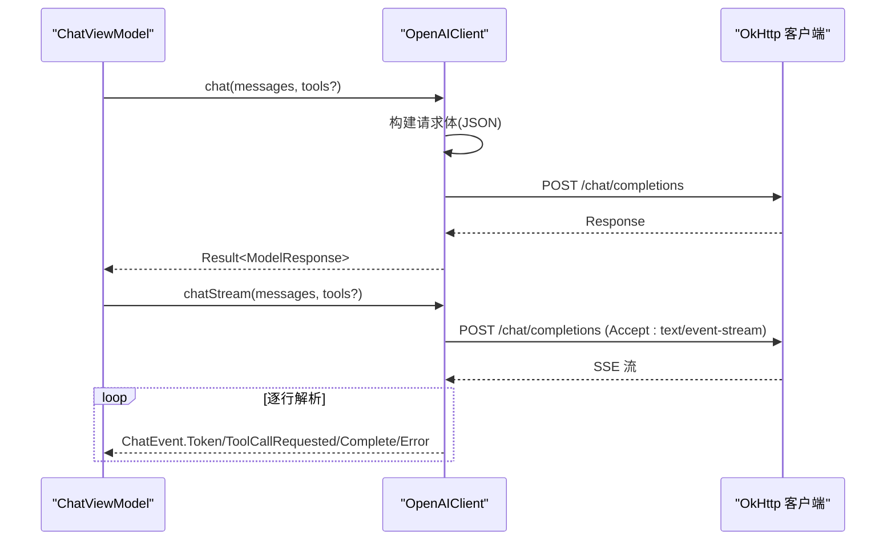
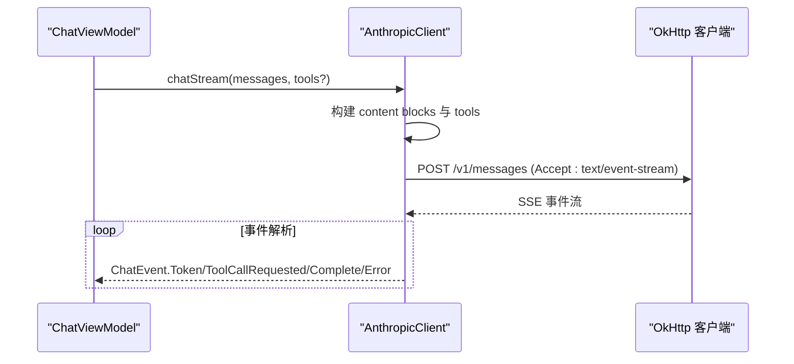
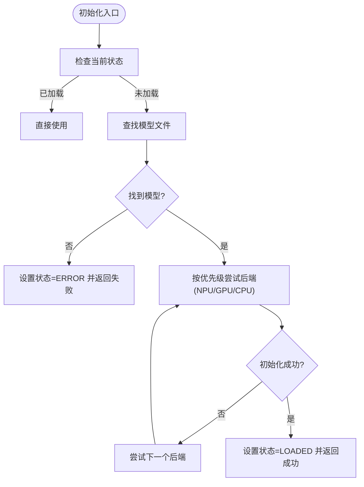
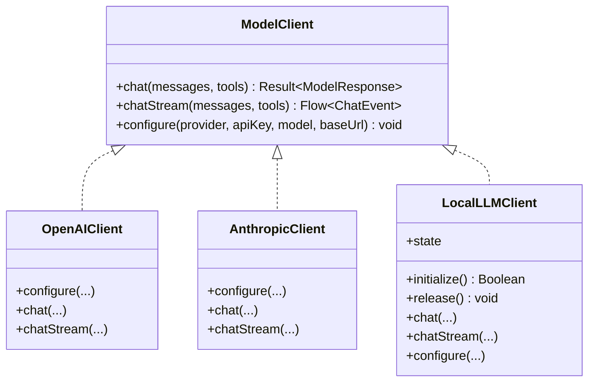
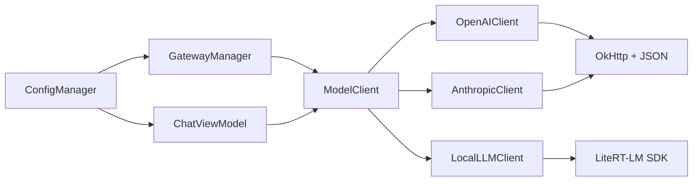

# 模型客户端接口

<cite>
**本文引用的文件**
- [ModelClient.kt](file://app/src/main/java/ai/openclaw/android/model/ModelClient.kt)
- [OpenAIClient.kt](file://app/src/main/java/ai/openclaw/android/model/OpenAIClient.kt)
- [AnthropicClient.kt](file://app/src/main/java/ai/openclaw/android/model/AnthropicClient.kt)
- [LocalLLMClient.kt](file://app/src/main/java/ai/openclaw/android/model/LocalLLMClient.kt)
- [ModelModels.kt](file://app/src/main/java/ai/openclaw/android/model/ModelModels.kt)
- [GatewayManager.kt](file://app/src/main/java/ai/openclaw/android/GatewayManager.kt)
- [ChatViewModel.kt](file://app/src/main/java/ai/openclaw/android/viewmodel/ChatViewModel.kt)
- [ConfigManager.kt](file://app/src/main/java/ai/openclaw/android/ConfigManager.kt)
- [ModelModelsTest.kt](file://app/src/test/java/ai/openclaw/android/model/ModelModelsTest.kt)
</cite>

## 目录
1. [简介](#简介)
2. [项目结构](#项目结构)
3. [核心组件](#核心组件)
4. [架构总览](#架构总览)
5. [详细组件分析](#详细组件分析)
6. [依赖关系分析](#依赖关系分析)
7. [性能考量](#性能考量)
8. [故障排除指南](#故障排除指南)
9. [结论](#结论)
10. [附录](#附录)

## 简介
本文件为 OpenClaw Android 项目中的模型客户端接口与实现提供系统化 API 文档，覆盖以下内容：
- 统一接口 ModelClient 的方法签名与实现规范
- OpenAIClient、AnthropicClient、LocalLLMClient 的 API 差异与行为差异
- 模型配置、请求参数、响应格式与错误处理机制
- 不同模型提供商的集成示例与配置指导
- 本地推理与云端推理的 API 使用差异
- 性能优化建议与故障排除指南

## 项目结构
模型客户端相关代码位于 app/src/main/java/ai/openclaw/android/model 下，配合 GatewayManager、ChatViewModel、ConfigManager 等模块完成配置、实例化与调用。

**图表来源**
- [ModelClient.kt](file://app/src/main/java/ai/openclaw/android/model/ModelClient.kt)
- [OpenAIClient.kt](file://app/src/main/java/ai/openclaw/android/model/OpenAIClient.kt)
- [AnthropicClient.kt](file://app/src/main/java/ai/openclaw/android/model/AnthropicClient.kt)
- [LocalLLMClient.kt](file://app/src/main/java/ai/openclaw/android/model/LocalLLMClient.kt)
- [ModelModels.kt](file://app/src/main/java/ai/openclaw/android/model/ModelModels.kt)
- [GatewayManager.kt](file://app/src/main/java/ai/openclaw/android/GatewayManager.kt)
- [ChatViewModel.kt](file://app/src/main/java/ai/openclaw/android/viewmodel/ChatViewModel.kt)
- [ConfigManager.kt](file://app/src/main/java/ai/openclaw/android/ConfigManager.kt)

**章节来源**
- [ModelClient.kt:1-59](file://app/src/main/java/ai/openclaw/android/model/ModelClient.kt#L1-L59)
- [OpenAIClient.kt:1-332](file://app/src/main/java/ai/openclaw/android/model/OpenAIClient.kt#L1-L332)
- [AnthropicClient.kt:1-502](file://app/src/main/java/ai/openclaw/android/model/AnthropicClient.kt#L1-L502)
- [LocalLLMClient.kt:1-807](file://app/src/main/java/ai/openclaw/android/model/LocalLLMClient.kt#L1-L807)
- [ModelModels.kt:1-179](file://app/src/main/java/ai/openclaw/android/model/ModelModels.kt#L1-L179)
- [GatewayManager.kt:390-589](file://app/src/main/java/ai/openclaw/android/GatewayManager.kt#L390-L589)
- [ChatViewModel.kt:160-359](file://app/src/main/java/ai/openclaw/android/viewmodel/ChatViewModel.kt#L160-L359)
- [ConfigManager.kt:1-171](file://app/src/main/java/ai/openclaw/android/ConfigManager.kt#L1-L171)

## 核心组件
- ModelClient 接口：定义统一的聊天请求（非流式与流式）、配置方法，以及流式事件类型 ChatEvent。
- OpenAIClient：封装 DashScope 兼容模式（OpenAI 兼容）的聊天补全 API，支持 SSE 流式输出与工具调用。
- AnthropicClient：封装 Anthropic Messages API，支持 SSE 流式输出、工具使用与内容块转换。
- LocalLLMClient：基于 LiteRT-LM 在设备端运行 Gemma 系列模型，支持同步与异步流式生成、工具调用桥接。
- ModelModels：统一的消息、工具、响应与流式分片数据模型，确保跨客户端一致的数据契约。

关键点
- 统一方法签名：chat(messages, tools?) 返回 Result<ModelResponse>；chatStream(messages, tools?) 返回 Flow<ChatEvent>。
- 配置方法：configure(provider, apiKey, model, baseUrl) 用于设置提供商、密钥、模型名与基础地址。
- 流式事件：Token（增量文本）、ToolCallRequested（工具调用请求）、Complete（完整响应）、Error（错误）。

**章节来源**
- [ModelClient.kt:10-59](file://app/src/main/java/ai/openclaw/android/model/ModelClient.kt#L10-L59)
- [ModelModels.kt:19-115](file://app/src/main/java/ai/openclaw/android/model/ModelModels.kt#L19-L115)

## 架构总览
模型客户端通过 GatewayManager 或 ChatViewModel 进行装配与调用，ConfigManager 提供配置存储与默认值推导。LocalLLMClient 支持本地初始化与工具执行桥接，其他客户端通过网络访问云端模型。

**图表来源**
- [ChatViewModel.kt:160-359](file://app/src/main/java/ai/openclaw/android/viewmodel/ChatViewModel.kt#L160-L359)
- [GatewayManager.kt:390-589](file://app/src/main/java/ai/openclaw/android/GatewayManager.kt#L390-L589)
- [ConfigManager.kt:54-171](file://app/src/main/java/ai/openclaw/android/ConfigManager.kt#L54-L171)
- [ModelClient.kt:10-32](file://app/src/main/java/ai/openclaw/android/model/ModelClient.kt#L10-L32)

## 详细组件分析

### ModelClient 接口与数据模型
- 方法
  - chat(messages: List<Message>, tools: List<Tool>?): Result<ModelResponse>
  - chatStream(messages: List<Message>, tools: List<Tool>?): Flow<ChatEvent>
  - configure(provider: ModelProvider, apiKey: String, model: String, baseUrl: String)
- 数据模型
  - Message、Tool、ToolFunction、ToolParameters、ToolProperty、ToolCall、ToolCallFunction
  - ModelResponse、Choice、ResponseMessage、Usage
  - StreamChunk、StreamChoice、StreamDelta、StreamToolCallDelta、StreamToolCallFunctionDelta

实现要点
- 统一的 Result 包装与异常捕获，便于上层处理。
- 流式事件以 ChatEvent 密封类表达，保证消费端一致性。
- 数据模型采用 @Serializable 与 @SerialName 映射，确保跨客户端序列化兼容。

**章节来源**
- [ModelClient.kt:10-59](file://app/src/main/java/ai/openclaw/android/model/ModelClient.kt#L10-L59)
- [ModelModels.kt:19-179](file://app/src/main/java/ai/openclaw/android/model/ModelModels.kt#L19-L179)

### OpenAIClient 实现
- 请求构建
  - 默认基础地址与模型前缀处理（去除 openai/ 前缀）。
  - 消息体包含 model、messages、可选 tools、temperature、max_tokens、stream。
  - 视觉消息采用数组格式（OpenAI Vision/Qwen/DashScope 兼容）。
- 响应处理
  - 非流式：解析 ModelResponse，提取 choices 与 content/toolCalls。
  - 流式：逐行解析 SSE，累积文本与工具调用参数，结束时发出 Complete。
- 错误处理
  - HTTP 失败、空响应体、JSON 解析失败均转为 Result.failure 或 ChatEvent.Error。

**图表来源**
- [OpenAIClient.kt:60-155](file://app/src/main/java/ai/openclaw/android/model/OpenAIClient.kt#L60-L155)
- [OpenAIClient.kt:157-248](file://app/src/main/java/ai/openclaw/android/model/OpenAIClient.kt#L157-L248)

**章节来源**
- [OpenAIClient.kt:30-332](file://app/src/main/java/ai/openclaw/android/model/OpenAIClient.kt#L30-L332)

### AnthropicClient 实现
- 请求构建
  - Anthropic Messages API，独立 system 字段与 content blocks 数组。
  - 工具定义转换为 Anthropic input_schema 结构。
  - 认证头：x-api-key 与 anthropic-version。
- 响应转换
  - 将 content 中的 text 与 tool_use 块映射为内部 ModelResponse。
  - finish_reason 对齐：tool_use -> tool_calls，end_turn -> stop。
- 流式事件
  - message_start、content_block_start、content_block_delta、message_delta、message_stop。
  - 累积工具调用 JSON 片段，最终组装 ToolCall。

**图表来源**
- [AnthropicClient.kt:84-100](file://app/src/main/java/ai/openclaw/android/model/AnthropicClient.kt#L84-L100)
- [AnthropicClient.kt:370-493](file://app/src/main/java/ai/openclaw/android/model/AnthropicClient.kt#L370-L493)

**章节来源**
- [AnthropicClient.kt:37-502](file://app/src/main/java/ai/openclaw/android/model/AnthropicClient.kt#L37-L502)

### LocalLLMClient 实现
- 生命周期与初始化
  - initialize()：查找模型文件、按优先级尝试 NPU/GPU/CPU 后端，超时与失败重试策略。
  - release()：关闭引擎，重置状态。
  - state：IDLE/LOADING/LOADED/ERROR。
- 聊天与流式
  - chat：同步生成，返回 ModelResponse。
  - chatStream：异步流式，收集 Token，结束时发出 Complete。
  - 工具调用桥接：setToolExecutor 将 LiteRT 内部工具调用转发至技能系统。
- 配置
  - configure：本地模型无需 API Key，直接忽略。
- 视觉与多模态
  - 当前 LiteRT SDK 不支持图像输入，采用“图片描述”拼接到文本的降级方案。

**图表来源**
- [LocalLLMClient.kt:178-289](file://app/src/main/java/ai/openclaw/android/model/LocalLLMClient.kt#L178-L289)

**章节来源**
- [LocalLLMClient.kt:51-807](file://app/src/main/java/ai/openclaw/android/model/LocalLLMClient.kt#L51-L807)

### 统一 API 使用流程
- 配置来源：ConfigManager 提供 provider、apiKey、modelName、baseUrl，默认值与有效地址推导。
- 组件装配：GatewayManager/ChatViewModel 根据 provider 创建对应 ModelClient，并调用 configure。
- 调用方式：chat 获取一次性响应；chatStream 获取增量 Token 与工具调用事件。

**图表来源**
- [ModelClient.kt:10-59](file://app/src/main/java/ai/openclaw/android/model/ModelClient.kt#L10-L59)
- [OpenAIClient.kt:30](file://app/src/main/java/ai/openclaw/android/model/OpenAIClient.kt#L30)
- [AnthropicClient.kt:37](file://app/src/main/java/ai/openclaw/android/model/AnthropicClient.kt#L37)
- [LocalLLMClient.kt:51](file://app/src/main/java/ai/openclaw/android/model/LocalLLMClient.kt#L51)

**章节来源**
- [GatewayManager.kt:390-589](file://app/src/main/java/ai/openclaw/android/GatewayManager.kt#L390-L589)
- [ChatViewModel.kt:160-359](file://app/src/main/java/ai/openclaw/android/viewmodel/ChatViewModel.kt#L160-L359)
- [ConfigManager.kt:54-171](file://app/src/main/java/ai/openclaw/android/ConfigManager.kt#L54-L171)

## 依赖关系分析
- 组件耦合
  - ModelClient 作为抽象接口，被 GatewayManager/ChatViewModel 依赖，降低对具体实现的耦合。
  - LocalLLMClient 依赖 LiteRT-LM SDK 与 Android 上下文，具备独立生命周期管理。
- 外部依赖
  - OpenAIClient/AnthropicClient 依赖 OkHttp 与 Kotlinx Serialization。
  - LocalLLMClient 依赖 LiteRT-LM Engine 与工具提供器。
- 配置与回退
  - ConfigManager 提供默认基础地址与敏感配置加密存储。
  - LocalLLM 加载失败时自动回退到云端客户端。

**图表来源**
- [ConfigManager.kt:54-171](file://app/src/main/java/ai/openclaw/android/ConfigManager.kt#L54-L171)
- [GatewayManager.kt:390-589](file://app/src/main/java/ai/openclaw/android/GatewayManager.kt#L390-L589)
- [ChatViewModel.kt:160-359](file://app/src/main/java/ai/openclaw/android/viewmodel/ChatViewModel.kt#L160-L359)
- [OpenAIClient.kt:30-332](file://app/src/main/java/ai/openclaw/android/model/OpenAIClient.kt#L30-L332)
- [AnthropicClient.kt:37-502](file://app/src/main/java/ai/openclaw/android/model/AnthropicClient.kt#L37-L502)
- [LocalLLMClient.kt:51-807](file://app/src/main/java/ai/openclaw/android/model/LocalLLMClient.kt#L51-L807)

**章节来源**
- [GatewayManager.kt:390-589](file://app/src/main/java/ai/openclaw/android/GatewayManager.kt#L390-L589)
- [ChatViewModel.kt:160-359](file://app/src/main/java/ai/openclaw/android/viewmodel/ChatViewModel.kt#L160-L359)

## 性能考量
- 本地推理
  - 后端优先级与自动回退：NPU → GPU → CPU，GPU 失败后冷却与计数重试。
  - 初始化超时控制：NPU 60s、GPU 90s、CPU 60s，避免主线程阻塞。
  - 会话互斥：使用 Mutex 保护并发会话，避免引擎竞争。
  - 视觉降级：当前不支持图像输入，建议在消息中添加描述以提升效果。
- 云端推理
  - SSE 流式解析：逐行读取 data: 行，累积文本与工具调用参数，注意空行与 [DONE] 结束标记。
  - 超时与连接：OkHttp 设置读/写/连接超时，避免长时间阻塞。
  - 参数调优：temperature、top_k、top_p、max_tokens 可根据需求调整（实现中提供默认值）。

[本节为通用性能建议，不直接分析特定文件]

## 故障排除指南
- 本地模型加载失败
  - 现象：Initialize 返回 false，状态变为 ERROR。
  - 排查：确认模型文件存在且命名匹配；检查 GPU 是否崩溃与冷却时间；尝试切换后端。
  - 参考路径：[LocalLLMClient.kt:178-289](file://app/src/main/java/ai/openclaw/android/model/LocalLLMClient.kt#L178-L289)
- 云端请求错误
  - 现象：HTTP 非成功状态、空响应体、JSON 解析失败。
  - 排查：检查 API Key、模型名、基础地址；确认网络连通性；查看日志输出。
  - 参考路径：[OpenAIClient.kt:135-155](file://app/src/main/java/ai/openclaw/android/model/OpenAIClient.kt#L135-L155)、[AnthropicClient.kt:271-292](file://app/src/main/java/ai/openclaw/android/model/AnthropicClient.kt#L271-L292)
- 流式解析异常
  - 现象：SSE 行格式异常、工具调用参数不完整。
  - 排查：验证 finish_reason、tool_calls 累积逻辑；参考单元测试断言。
  - 参考路径：[ModelModelsTest.kt:15-184](file://app/src/test/java/ai/openclaw/android/model/ModelModelsTest.kt#L15-L184)
- 配置问题
  - 现象：无法创建客户端或缺少凭据。
  - 排查：确认 ConfigManager 中 provider、apiKey、modelName、baseUrl 设置正确；本地模式无需 API Key。
  - 参考路径：[ConfigManager.kt:54-171](file://app/src/main/java/ai/openclaw/android/ConfigManager.kt#L54-L171)

**章节来源**
- [LocalLLMClient.kt:178-289](file://app/src/main/java/ai/openclaw/android/model/LocalLLMClient.kt#L178-L289)
- [OpenAIClient.kt:135-155](file://app/src/main/java/ai/openclaw/android/model/OpenAIClient.kt#L135-L155)
- [AnthropicClient.kt:271-292](file://app/src/main/java/ai/openclaw/android/model/AnthropicClient.kt#L271-L292)
- [ModelModelsTest.kt:15-184](file://app/src/test/java/ai/openclaw/android/model/ModelModelsTest.kt#L15-L184)
- [ConfigManager.kt:54-171](file://app/src/main/java/ai/openclaw/android/ConfigManager.kt#L54-L171)

## 结论
- ModelClient 提供统一抽象，屏蔽云端与本地差异，简化上层调用。
- OpenAIClient/AnthropicClient 实现了标准的流式与非流式调用，具备完善的错误处理。
- LocalLLMClient 在设备端提供推理能力，具备健壮的初始化与回退策略。
- 建议在生产环境结合 ConfigManager 进行配置管理，并在 UI 层通过 ChatViewModel/GatewayManager 完成装配与调用。

[本节为总结性内容，不直接分析特定文件]

## 附录

### API 差异对比表
- 方法签名
  - chat：三实现均支持；返回 Result<ModelResponse>。
  - chatStream：三实现均支持；返回 Flow<ChatEvent>。
  - configure：三实现均支持；OpenAI/Anthropic 需要 apiKey/model/baseUrl；Local 忽略。
- 请求参数
  - OpenAI：model、messages、tools、temperature、max_tokens、stream。
  - Anthropic：model、messages（content blocks）、tools（input_schema）、system、temperature、max_tokens、stream。
  - Local：ConversationConfig（系统指令、初始消息、工具、采样器、自动工具调用关闭）。
- 响应格式
  - 统一为 ModelResponse，内部包含 choices、usage；流式事件统一为 ChatEvent。
- 错误处理
  - 统一捕获异常并返回 Result.failure 或 ChatEvent.Error。

**章节来源**
- [ModelClient.kt:10-32](file://app/src/main/java/ai/openclaw/android/model/ModelClient.kt#L10-L32)
- [OpenAIClient.kt:94-133](file://app/src/main/java/ai/openclaw/android/model/OpenAIClient.kt#L94-L133)
- [AnthropicClient.kt:104-153](file://app/src/main/java/ai/openclaw/android/model/AnthropicClient.kt#L104-L153)
- [LocalLLMClient.kt:399-430](file://app/src/main/java/ai/openclaw/android/model/LocalLLMClient.kt#L399-L430)

### 集成示例与配置指导
- 云端客户端
  - 通过 ChatViewModel/GatewayManager 创建并配置 OpenAI/Anthropic 客户端，读取 ConfigManager 中的 provider、apiKey、modelName、baseUrl。
  - 参考路径：[ChatViewModel.kt:160-172](file://app/src/main/java/ai/openclaw/android/viewmodel/ChatViewModel.kt#L160-L172)、[GatewayManager.kt:390-419](file://app/src/main/java/ai/openclaw/android/GatewayManager.kt#L390-L419)
- 本地客户端
  - 初始化 LocalLLMClient，设置工具执行器，必要时回退到云端客户端。
  - 参考路径：[GatewayManager.kt:404-441](file://app/src/main/java/ai/openclaw/android/GatewayManager.kt#L404-L441)、[LocalLLMClient.kt:304-391](file://app/src/main/java/ai/openclaw/android/model/LocalLLMClient.kt#L304-L391)
- 配置项
  - provider、apiKey、modelName、baseUrl 存储于 ConfigManager，本地模式无需 apiKey。
  - 参考路径：[ConfigManager.kt:54-171](file://app/src/main/java/ai/openclaw/android/ConfigManager.kt#L54-L171)

**章节来源**
- [ChatViewModel.kt:160-172](file://app/src/main/java/ai/openclaw/android/viewmodel/ChatViewModel.kt#L160-L172)
- [GatewayManager.kt:390-441](file://app/src/main/java/ai/openclaw/android/GatewayManager.kt#L390-L441)
- [ConfigManager.kt:54-171](file://app/src/main/java/ai/openclaw/android/ConfigManager.kt#L54-L171)