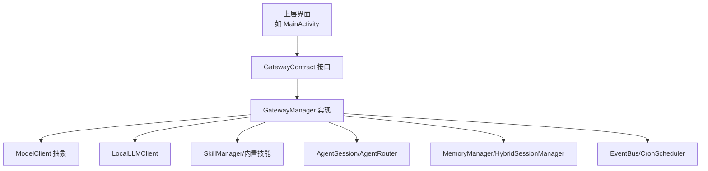
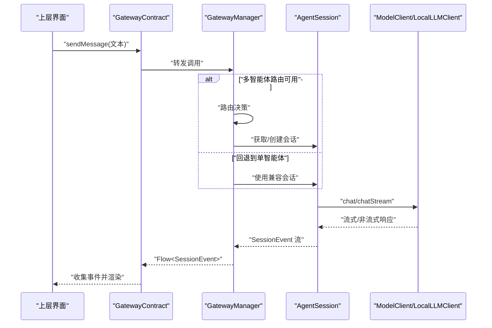
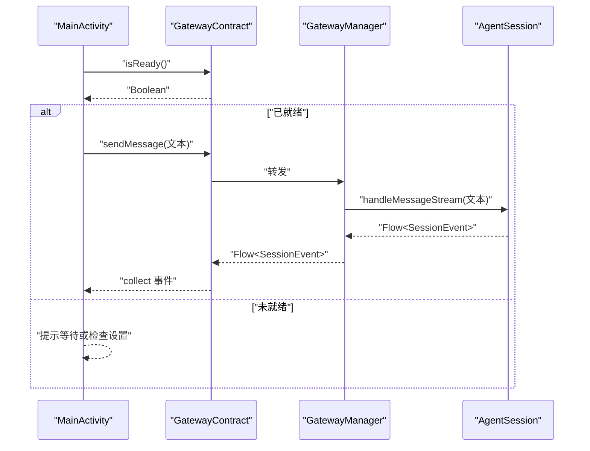
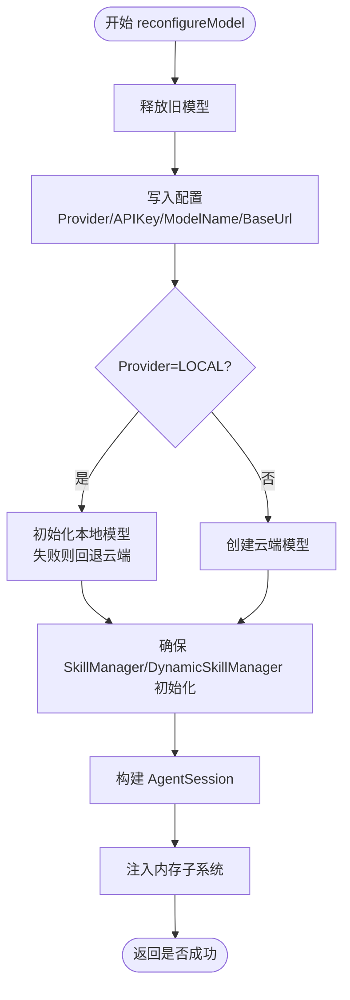
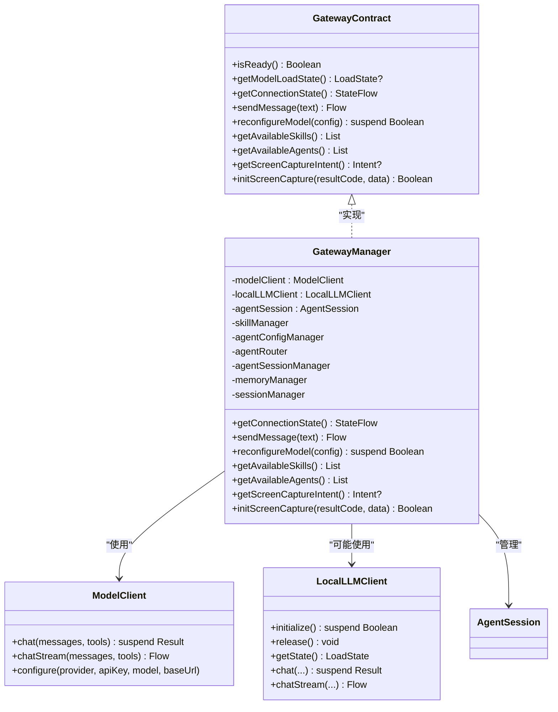

# 网关契约接口

<cite>
**本文引用的文件**
- [GatewayContract.kt](file://app/src/main/java/ai/openclaw/android/GatewayContract.kt)
- [GatewayManager.kt](file://app/src/main/java/ai/openclaw/android/GatewayManager.kt)
- [LocalLLMClient.kt](file://app/src/main/java/ai/openclaw/android/model/LocalLLMClient.kt)
- [ModelClient.kt](file://app/src/main/java/ai/openclaw/android/model/ModelClient.kt)
- [ModelModels.kt](file://app/src/main/java/ai/openclaw/android/model/ModelModels.kt)
- [AgentSession.kt](file://app/src/main/java/ai/openclaw/android/agent/AgentSession.kt)
- [MainActivity.kt](file://app/src/main/java/ai/openclaw/android/MainActivity.kt)
</cite>

## 目录
1. [简介](#简介)
2. [项目结构](#项目结构)
3. [核心组件](#核心组件)
4. [架构总览](#架构总览)
5. [详细组件分析](#详细组件分析)
6. [依赖关系分析](#依赖关系分析)
7. [性能考量](#性能考量)
8. [故障排查指南](#故障排查指南)
9. [结论](#结论)

## 简介
本文件为 GatewayContract 接口的权威 API 文档，面向使用该接口的上层模块（如 Activity），提供清晰的方法签名、参数说明、返回值类型与行为语义。重点覆盖以下核心方法：
- isReady()
- getModelLoadState()
- getConnectionState()
- sendMessage()
- reconfigureModel()
- getAvailableSkills()
- getAvailableAgents()

同时解释 ModelConfig、SkillInfo、AgentInfo 数据类的字段含义与使用场景，并给出方法调用流程图、错误处理建议以及与 GatewayManager 的关系说明。

## 项目结构
GatewayContract 位于应用主模块，作为“契约”对外暴露能力；GatewayManager 实现该契约并管理内部子系统（模型客户端、技能系统、多智能体路由、内存与会话、触发器等）。上层 UI（如 MainActivity）仅通过 GatewayContract 调用能力，不直接依赖 GatewayManager 的内部实现细节。

图表来源
- [GatewayContract.kt:14-33](file://app/src/main/java/ai/openclaw/android/GatewayContract.kt#L14-L33)
- [GatewayManager.kt:64](file://app/src/main/java/ai/openclaw/android/GatewayManager.kt#L64)
- [ModelClient.kt:10-32](file://app/src/main/java/ai/openclaw/android/model/ModelClient.kt#L10-L32)
- [LocalLLMClient.kt:48](file://app/src/main/java/ai/openclaw/android/model/LocalLLMClient.kt#L48)

章节来源
- [GatewayContract.kt:14-33](file://app/src/main/java/ai/openclaw/android/GatewayContract.kt#L14-L33)
- [GatewayManager.kt:64](file://app/src/main/java/ai/openclaw/android/GatewayManager.kt#L64)

## 核心组件
- GatewayContract：对外暴露的契约接口，屏蔽内部实现细节，便于未来扩展为跨进程服务。
- GatewayManager：契约的具体实现，负责组件生命周期、状态管理与业务编排。
- ModelClient/LocalLLMClient：统一的模型抽象与本地推理实现，支持流式与非流式对话。
- AgentSession：单智能体会话管理，支持工具调用、反射优化与 A2UI 呈现。
- 数据类：ModelConfig、SkillInfo、AgentInfo，用于配置传递与信息查询。

章节来源
- [GatewayContract.kt:14-52](file://app/src/main/java/ai/openclaw/android/GatewayContract.kt#L14-L52)
- [GatewayManager.kt:64](file://app/src/main/java/ai/openclaw/android/GatewayManager.kt#L64)
- [ModelClient.kt:10-59](file://app/src/main/java/ai/openclaw/android/model/ModelClient.kt#L10-L59)
- [LocalLLMClient.kt:48](file://app/src/main/java/ai/openclaw/android/model/LocalLLMClient.kt#L48)
- [AgentSession.kt:35-40](file://app/src/main/java/ai/openclaw/android/agent/AgentSession.kt#L35-L40)

## 架构总览
GatewayContract 将上层 UI 与内部复杂子系统解耦。UI 仅通过契约方法发起请求，契约将调用委托给 GatewayManager，后者根据当前状态与配置选择合适的路径（单智能体或多智能体路由），并结合模型、技能、内存与会话进行处理。

图表来源
- [GatewayContract.kt:18](file://app/src/main/java/ai/openclaw/android/GatewayContract.kt#L18)
- [GatewayManager.kt:115-127](file://app/src/main/java/ai/openclaw/android/GatewayManager.kt#L115-L127)
- [AgentSession.kt:807-819](file://app/src/main/java/ai/openclaw/android/agent/AgentSession.kt#L807-L819)
- [ModelClient.kt:15-26](file://app/src/main/java/ai/openclaw/android/model/ModelClient.kt#L15-L26)

## 详细组件分析

### 方法 API 一览与说明

- isReady(): Boolean
  - 功能：判断当前是否已建立可通信的 AgentSession，可用于发送消息。
  - 返回：true 表示已准备；false 表示尚未准备好。
  - 使用场景：在发起消息前进行预检，避免空引用或错误状态。
  - 章节来源
    - [GatewayContract.kt:15](file://app/src/main/java/ai/openclaw/android/GatewayContract.kt#L15)
    - [GatewayManager.kt:111](file://app/src/main/java/ai/openclaw/android/GatewayManager.kt#L111)

- getModelLoadState(): LocalLLMClient.LoadState?
  - 功能：查询本地推理引擎加载状态（空表示未加载或未使用本地模型）。
  - 返回：枚举状态（IDLE/LOADING/LOADED/ERROR）或空。
  - 使用场景：UI 展示模型加载进度或错误提示。
  - 章节来源
    - [GatewayContract.kt:16](file://app/src/main/java/ai/openclaw/android/GatewayContract.kt#L16)
    - [GatewayManager.kt:113](file://app/src/main/java/ai/openclaw/android/GatewayManager.kt#L113)
    - [LocalLLMClient.kt:50](file://app/src/main/java/ai/openclaw/android/model/LocalLLMClient.kt#L50)

- getConnectionState(): StateFlow<GatewayManager.ConnectionState>
  - 功能：获取连接状态流，包含 Disconnected/Connecting/Connected/Error。
  - 返回：状态流，UI 可订阅以更新连接指示。
  - 使用场景：显示“连接中/已连接/错误”状态。
  - 章节来源
    - [GatewayContract.kt:17](file://app/src/main/java/ai/openclaw/android/GatewayContract.kt#L17)
    - [GatewayManager.kt:99-107](file://app/src/main/java/ai/openclaw/android/GatewayManager.kt#L99-L107)

- sendMessage(text: String): Flow<SessionEvent>
  - 功能：发送用户消息，返回流式事件，包含 Token、ToolExecuting、ToolResult、Complete、Error、反射阶段事件等。
  - 参数：text 用户输入文本。
  - 返回：Flow<SessionEvent>，按序产生事件。
  - 使用场景：实时渲染回复、工具调用与结果展示。
  - 章节来源
    - [GatewayContract.kt:18](file://app/src/main/java/ai/openclaw/android/GatewayContract.kt#L18)
    - [GatewayManager.kt:115-127](file://app/src/main/java/ai/openclaw/android/GatewayManager.kt#L115-L127)
    - [AgentSession.kt:807-819](file://app/src/main/java/ai/openclaw/android/agent/AgentSession.kt#L807-L819)

- reconfigureModel(config: ModelConfig): suspend Boolean
  - 功能：动态重配模型（本地或云端），释放旧模型、更新配置、重建 AgentSession 并注入内存子系统。
  - 参数：ModelConfig（provider、apiKey、modelName、baseUrl）。
  - 返回：true 表示成功；false 表示失败（如初始化失败）。
  - 使用场景：切换模型提供商、更新密钥或模型名后重启会话。
  - 章节来源
    - [GatewayContract.kt:19](file://app/src/main/java/ai/openclaw/android/GatewayContract.kt#L19)
    - [GatewayManager.kt:142-273](file://app/src/main/java/ai/openclaw/android/GatewayManager.kt#L142-L273)
    - [ModelClient.kt:54-58](file://app/src/main/java/ai/openclaw/android/model/ModelClient.kt#L54-L58)

- getAvailableSkills(): List<SkillInfo>
  - 功能：返回已注册技能清单（含 id、name、description）。
  - 返回：技能信息列表。
  - 使用场景：UI 展示可用技能、调试与诊断。
  - 章节来源
    - [GatewayContract.kt:20](file://app/src/main/java/ai/openclaw/android/GatewayContract.kt#L20)
    - [GatewayManager.kt:275-279](file://app/src/main/java/ai/openclaw/android/GatewayManager.kt#L275-L279)
    - [SkillInfo:42-46](file://app/src/main/java/ai/openclaw/android/GatewayContract.kt#L42-L46)

- getAvailableAgents(): List<AgentInfo>
  - 功能：返回已配置的智能体清单，并标注默认智能体。
  - 返回：AgentInfo 列表（id、name、isDefault）。
  - 使用场景：多智能体切换与管理。
  - 章节来源
    - [GatewayContract.kt:21](file://app/src/main/java/ai/openclaw/android/GatewayContract.kt#L21)
    - [GatewayManager.kt:280-294](file://app/src/main/java/ai/openclaw/android/GatewayManager.kt#L280-L294)
    - [AgentInfo:48-52](file://app/src/main/java/ai/openclaw/android/GatewayContract.kt#L48-L52)

- getScreenCaptureIntent(): Intent?
  - 功能：请求截屏权限的 Intent（需 startActivityForResult 启动）。
  - 返回：Intent 或空（低版本设备不支持）。
  - 使用场景：开启无障碍服务的屏幕捕获能力。
  - 章节来源
    - [GatewayContract.kt:27](file://app/src/main/java/ai/openclaw/android/GatewayContract.kt#L27)
    - [GatewayManager.kt:298-305](file://app/src/main/java/ai/openclaw/android/GatewayManager.kt#L298-L305)

- initScreenCapture(resultCode: Int, data: Intent): Boolean
  - 功能：在用户授权后初始化 MediaProjection。
  - 返回：true/false 表示成功与否。
  - 使用场景：处理 onActivityResult 并初始化无障碍服务的投影。
  - 章节来源
    - [GatewayContract.kt:32](file://app/src/main/java/ai/openclaw/android/GatewayContract.kt#L32)
    - [GatewayManager.kt:307-321](file://app/src/main/java/ai/openclaw/android/GatewayManager.kt#L307-L321)

### 数据类说明

- ModelConfig
  - 字段
    - provider: ModelProvider（OPENAI/ANTHROPIC/LOCAL）
    - apiKey: 密钥字符串（云端模型使用）
    - modelName: 模型标识（云端模型名或本地模型名）
    - baseUrl: 自定义基础地址（可选）
  - 使用场景：调用 reconfigureModel 时传入新配置，驱动模型切换与重建。
  - 章节来源
    - [ModelConfig:35-40](file://app/src/main/java/ai/openclaw/android/GatewayContract.kt#L35-L40)
    - [ModelProvider:54-58](file://app/src/main/java/ai/openclaw/android/model/ModelClient.kt#L54-L58)

- SkillInfo
  - 字段
    - id: 技能唯一标识
    - name: 技能名称
    - description: 技能描述
  - 使用场景：UI 展示技能列表、帮助信息。
  - 章节来源
    - [SkillInfo:42-46](file://app/src/main/java/ai/openclaw/android/GatewayContract.kt#L42-L46)

- AgentInfo
  - 字段
    - id: 智能体标识
    - name: 智能体名称
    - isDefault: 是否为默认智能体
  - 使用场景：多智能体选择与切换。
  - 章节来源
    - [AgentInfo:48-52](file://app/src/main/java/ai/openclaw/android/GatewayContract.kt#L48-L52)

### 方法调用流程与示例

- sendMessage() 调用序列
  - UI 预检 isReady()，若为真则调用 sendMessage()。
  - 收集 Flow<SessionEvent>，按事件类型更新 UI。
  - 参考 UI 示例路径：[MainActivity.kt:378-401](file://app/src/main/java/ai/openclaw/android/MainActivity.kt#L378-L401)

图表来源
- [GatewayContract.kt:15-18](file://app/src/main/java/ai/openclaw/android/GatewayContract.kt#L15-L18)
- [GatewayManager.kt:115-127](file://app/src/main/java/ai/openclaw/android/GatewayManager.kt#L115-L127)
- [MainActivity.kt:378-401](file://app/src/main/java/ai/openclaw/android/MainActivity.kt#L378-L401)

- reconfigureModel() 流程
  - 释放旧模型
  - 更新配置（Provider/APIKey/ModelName/BaseUrl）
  - 创建新模型（本地优先，失败则云端）
  - 初始化技能系统与动态技能
  - 重建 AgentSession 并注入内存子系统
  - 更新默认会话引用并刷新工具

图表来源
- [GatewayManager.kt:142-273](file://app/src/main/java/ai/openclaw/android/GatewayManager.kt#L142-L273)

## 依赖关系分析

图表来源
- [GatewayContract.kt:14-33](file://app/src/main/java/ai/openclaw/android/GatewayContract.kt#L14-L33)
- [GatewayManager.kt:64](file://app/src/main/java/ai/openclaw/android/GatewayManager.kt#L64)
- [ModelClient.kt:10-32](file://app/src/main/java/ai/openclaw/android/model/ModelClient.kt#L10-L32)
- [LocalLLMClient.kt:48](file://app/src/main/java/ai/openclaw/android/model/LocalLLMClient.kt#L48)

章节来源
- [GatewayContract.kt:14-33](file://app/src/main/java/ai/openclaw/android/GatewayContract.kt#L14-L33)
- [GatewayManager.kt:64](file://app/src/main/java/ai/openclaw/android/GatewayManager.kt#L64)
- [ModelClient.kt:10-32](file://app/src/main/java/ai/openclaw/android/model/ModelClient.kt#L10-L32)
- [LocalLLMClient.kt:48](file://app/src/main/java/ai/openclaw/android/model/LocalLLMClient.kt#L48)

## 性能考量
- 本地模型初始化存在硬件后端优先级与超时控制，不同后端（NPU/GPU/CPU）对吞吐与稳定性影响显著。
- 流式对话通过协程与背压机制传输，注意 UI 端及时取消订阅以避免资源泄漏。
- 多智能体路由与内存检索会增加延迟，建议在配置阶段预热关键组件并在 UI 上提供加载指示。

## 故障排查指南
- isReady() 返回 false
  - 可能原因：Gateway 尚未 start() 或组件初始化失败。
  - 建议：检查 getConnectionState() 是否为 Error，并查看日志。
  - 章节来源
    - [GatewayManager.kt:325-343](file://app/src/main/java/ai/openclaw/android/GatewayManager.kt#L325-L343)

- sendMessage() 无输出或报错
  - 可能原因：AgentSession 未就绪、模型未加载、工具执行异常。
  - 建议：先调用 isReady()，再订阅 Flow<SessionEvent>，关注 Error 事件。
  - 章节来源
    - [GatewayManager.kt:115-127](file://app/src/main/java/ai/openclaw/android/GatewayManager.kt#L115-L127)
    - [AgentSession.kt:807-819](file://app/src/main/java/ai/openclaw/android/agent/AgentSession.kt#L807-L819)

- reconfigureModel() 失败
  - 可能原因：本地模型初始化失败、技能系统未初始化、数据库或脚本引擎异常。
  - 建议：查看日志中的 Error 状态与具体异常信息，必要时回退云端模型。
  - 章节来源
    - [GatewayManager.kt:142-273](file://app/src/main/java/ai/openclaw/android/GatewayManager.kt#L142-L273)

- 截屏权限相关问题
  - 可能原因：设备版本过低、用户拒绝授权、无障碍服务未运行。
  - 建议：检查 API 版本与返回的 Intent，处理 resultCode/data 并初始化投影。
  - 章节来源
    - [GatewayManager.kt:298-321](file://app/src/main/java/ai/openclaw/android/GatewayManager.kt#L298-L321)

## 结论
GatewayContract 通过清晰的契约设计，将上层 UI 与复杂的内部子系统解耦，既保证了易用性，也为未来跨进程扩展预留空间。结合 GatewayManager 的实现，开发者可以安全地进行模型重配、多智能体路由、技能与内存系统的集成，并通过流式事件实现流畅的用户体验。建议在实际使用中：
- 先调用 isReady() 进行预检
- 订阅 getConnectionState() 与 Flow<SessionEvent> 以获得最佳交互体验
- 在调用 reconfigureModel() 前准备好正确的 ModelConfig
- 对错误事件进行分类处理并提供明确的用户反馈