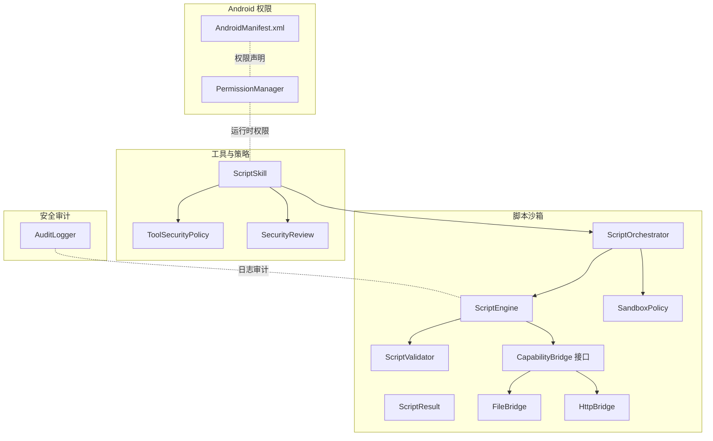
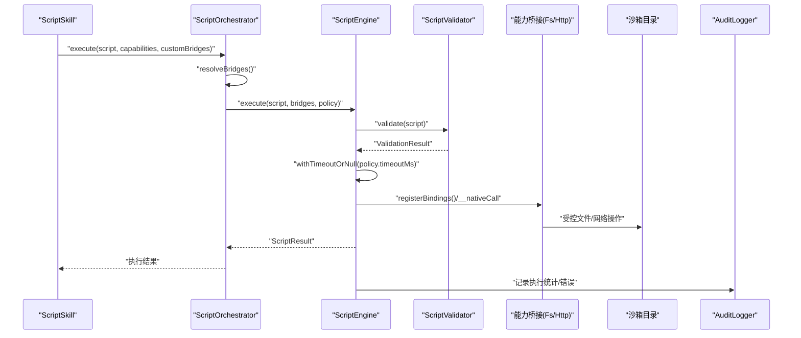
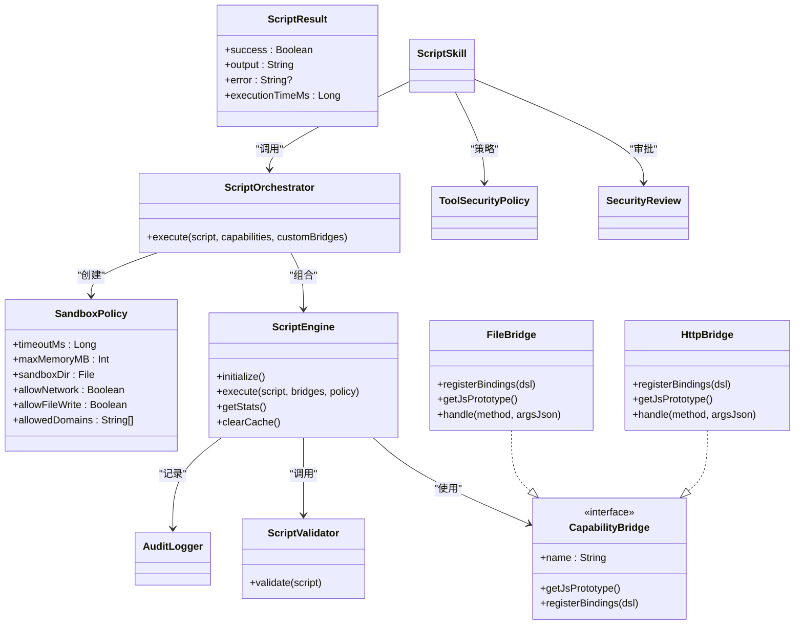

# 沙箱安全策略

<cite>
**本文引用的文件**
- [SandboxPolicy.kt](file://script/src/main/java/ai/openclaw/script/SandboxPolicy.kt)
- [ScriptEngine.kt](file://script/src/main/java/ai/openclaw/script/ScriptEngine.kt)
- [ScriptOrchestrator.kt](file://script/src/main/java/ai/openclaw/script/ScriptOrchestrator.kt)
- [ScriptValidator.kt](file://script/src/main/java/ai/openclaw/script/ScriptValidator.kt)
- [ScriptResult.kt](file://script/src/main/java/ai/openclaw/script/ScriptResult.kt)
- [CapabilityBridge.kt](file://script/src/main/java/ai/openclaw/script/CapabilityBridge.kt)
- [FileBridge.kt](file://script/src/main/java/ai/openclaw/script/bridge/FileBridge.kt)
- [HttpBridge.kt](file://script/src/main/java/ai/openclaw/script/bridge/HttpBridge.kt)
- [ToolSecurityPolicy.kt](file://app/src/main/java/ai/openclaw/android/skill/ToolSecurityPolicy.kt)
- [AuditLogger.kt](file://app/src/main/java/ai/openclaw/android/security/AuditLogger.kt)
- [ScriptSkill.kt](file://app/src/main/java/ai/openclaw/android/skill/builtin/ScriptSkill.kt)
- [PermissionManager.kt](file://app/src/main/java/ai/openclaw/android/permission/PermissionManager.kt)
- [AndroidManifest.xml](file://app/src/main/AndroidManifest.xml)
</cite>

## 目录
1. [简介](#简介)
2. [项目结构](#项目结构)
3. [核心组件](#核心组件)
4. [架构总览](#架构总览)
5. [详细组件分析](#详细组件分析)
6. [依赖关系分析](#依赖关系分析)
7. [性能考量](#性能考量)
8. [故障排查指南](#故障排查指南)
9. [结论](#结论)
10. [附录](#附录)

## 简介
本文件为“沙箱安全策略”的API级技术文档，聚焦于脚本执行环境的安全边界、权限控制与访问限制、隔离与资源配额、能力桥接与白名单、参数校验、安全审计与合规建议，以及与Android安全模型的集成方式。目标读者包括需要在应用中安全地运行JS脚本的开发者与安全工程师。

## 项目结构
围绕脚本沙箱与安全策略的相关模块主要分布在以下位置：
- 脚本引擎与沙箱：script 模块中的 ScriptEngine、ScriptOrchestrator、SandboxPolicy、ScriptValidator、ScriptResult、CapabilityBridge 及其桥接实现（FileBridge、HttpBridge）
- 工具安全策略与用户审批：app 模块中的 ToolSecurityPolicy 与 SecurityReview
- 安全审计：app 模块中的 AuditLogger
- 脚本技能接入：app 模块中的 ScriptSkill
- Android 权限与清单：app 模块中的 AndroidManifest.xml 与 PermissionManager

图表来源
- [ScriptOrchestrator.kt:13-54](file://script/src/main/java/ai/openclaw/script/ScriptOrchestrator.kt#L13-L54)
- [ScriptEngine.kt:22-231](file://script/src/main/java/ai/openclaw/script/ScriptEngine.kt#L22-L231)
- [SandboxPolicy.kt:8-15](file://script/src/main/java/ai/openclaw/script/SandboxPolicy.kt#L8-L15)
- [ScriptValidator.kt:8-59](file://script/src/main/java/ai/openclaw/script/ScriptValidator.kt#L8-L59)
- [CapabilityBridge.kt:13-32](file://script/src/main/java/ai/openclaw/script/CapabilityBridge.kt#L13-L32)
- [FileBridge.kt:20-120](file://script/src/main/java/ai/openclaw/script/bridge/FileBridge.kt#L20-L120)
- [HttpBridge.kt:18-87](file://script/src/main/java/ai/openclaw/script/bridge/HttpBridge.kt#L18-L87)
- [ToolSecurityPolicy.kt:6-71](file://app/src/main/java/ai/openclaw/android/skill/ToolSecurityPolicy.kt#L6-L71)
- [AuditLogger.kt:16-99](file://app/src/main/java/ai/openclaw/android/security/AuditLogger.kt#L16-L99)
- [ScriptSkill.kt:19-133](file://app/src/main/java/ai/openclaw/android/skill/builtin/ScriptSkill.kt#L19-L133)
- [PermissionManager.kt:32-153](file://app/src/main/java/ai/openclaw/android/permission/PermissionManager.kt#L32-L153)
- [AndroidManifest.xml:5-49](file://app/src/main/AndroidManifest.xml#L5-L49)

章节来源
- [ScriptOrchestrator.kt:13-54](file://script/src/main/java/ai/openclaw/script/ScriptOrchestrator.kt#L13-L54)
- [ScriptEngine.kt:22-231](file://script/src/main/java/ai/openclaw/script/ScriptEngine.kt#L22-L231)
- [SandboxPolicy.kt:8-15](file://script/src/main/java/ai/openclaw/script/SandboxPolicy.kt#L8-L15)
- [ScriptValidator.kt:8-59](file://script/src/main/java/ai/openclaw/script/ScriptValidator.kt#L8-L59)
- [CapabilityBridge.kt:13-32](file://script/src/main/java/ai/openclaw/script/CapabilityBridge.kt#L13-L32)
- [FileBridge.kt:20-120](file://script/src/main/java/ai/openclaw/script/bridge/FileBridge.kt#L20-L120)
- [HttpBridge.kt:18-87](file://script/src/main/java/ai/openclaw/script/bridge/HttpBridge.kt#L18-L87)
- [ToolSecurityPolicy.kt:6-71](file://app/src/main/java/ai/openclaw/android/skill/ToolSecurityPolicy.kt#L6-L71)
- [AuditLogger.kt:16-99](file://app/src/main/java/ai/openclaw/android/security/AuditLogger.kt#L16-L99)
- [ScriptSkill.kt:19-133](file://app/src/main/java/ai/openclaw/android/skill/builtin/ScriptSkill.kt#L19-L133)
- [PermissionManager.kt:32-153](file://app/src/main/java/ai/openclaw/android/permission/PermissionManager.kt#L32-L153)
- [AndroidManifest.xml:5-49](file://app/src/main/AndroidManifest.xml#L5-L49)

## 核心组件
- SandboxPolicy：定义沙箱安全边界与访问限制，包括执行超时、内存上限、沙箱目录、网络与文件写入开关、域名白名单等
- ScriptEngine：脚本执行引擎，支持 QuickJS 与 Rhino 双引擎回退；负责执行前校验、超时控制、桥接调用与统计
- ScriptOrchestrator：脚本执行编排器，负责能力解析、沙箱目录准备与执行入口
- ScriptValidator：静态校验器，阻止危险模式与过大脚本
- CapabilityBridge 及其实现：能力桥接接口与具体实现（文件、HTTP），限定在沙箱目录内
- ToolSecurityPolicy 与 SecurityReview：工具安全策略与用户审批流程
- AuditLogger：安全审计日志，基于哈希链确保不可篡改
- ScriptSkill：将脚本能力接入技能系统，提供工具参数与能力选择
- PermissionManager 与 AndroidManifest：Android 权限模型与清单声明

章节来源
- [SandboxPolicy.kt:8-15](file://script/src/main/java/ai/openclaw/script/SandboxPolicy.kt#L8-L15)
- [ScriptEngine.kt:22-231](file://script/src/main/java/ai/openclaw/script/ScriptEngine.kt#L22-L231)
- [ScriptOrchestrator.kt:13-54](file://script/src/main/java/ai/openclaw/script/ScriptOrchestrator.kt#L13-L54)
- [ScriptValidator.kt:8-59](file://script/src/main/java/ai/openclaw/script/ScriptValidator.kt#L8-L59)
- [CapabilityBridge.kt:13-32](file://script/src/main/java/ai/openclaw/script/CapabilityBridge.kt#L13-L32)
- [FileBridge.kt:20-120](file://script/src/main/java/ai/openclaw/script/bridge/FileBridge.kt#L20-L120)
- [HttpBridge.kt:18-87](file://script/src/main/java/ai/openclaw/script/bridge/HttpBridge.kt#L18-L87)
- [ToolSecurityPolicy.kt:6-71](file://app/src/main/java/ai/openclaw/android/skill/ToolSecurityPolicy.kt#L6-L71)
- [AuditLogger.kt:16-99](file://app/src/main/java/ai/openclaw/android/security/AuditLogger.kt#L16-L99)
- [ScriptSkill.kt:19-133](file://app/src/main/java/ai/openclaw/android/skill/builtin/ScriptSkill.kt#L19-L133)
- [PermissionManager.kt:32-153](file://app/src/main/java/ai/openclaw/android/permission/PermissionManager.kt#L32-L153)
- [AndroidManifest.xml:5-49](file://app/src/main/AndroidManifest.xml#L5-L49)

## 架构总览
下图展示从技能调用到脚本执行、能力桥接与安全控制的整体流程。

图表来源
- [ScriptSkill.kt:72-87](file://app/src/main/java/ai/openclaw/android/skill/builtin/ScriptSkill.kt#L72-L87)
- [ScriptOrchestrator.kt:31-39](file://script/src/main/java/ai/openclaw/script/ScriptOrchestrator.kt#L31-L39)
- [ScriptEngine.kt:45-99](file://script/src/main/java/ai/openclaw/script/ScriptEngine.kt#L45-L99)
- [ScriptValidator.kt:42-58](file://script/src/main/java/ai/openclaw/script/ScriptValidator.kt#L42-L58)
- [FileBridge.kt:31-51](file://script/src/main/java/ai/openclaw/script/bridge/FileBridge.kt#L31-L51)
- [HttpBridge.kt:26-38](file://script/src/main/java/ai/openclaw/script/bridge/HttpBridge.kt#L26-L38)
- [AuditLogger.kt:42-59](file://app/src/main/java/ai/openclaw/android/security/AuditLogger.kt#L42-L59)

## 详细组件分析

### SandboxPolicy（沙箱安全策略）
- 关键属性
  - timeoutMs：执行超时毫秒数，默认10秒
  - maxMemoryMB：内存上限（注：当前实现未直接使用该字段）
  - sandboxDir：沙箱根目录，所有文件操作限制在此目录内
  - allowNetwork：是否允许网络访问，默认开启
  - allowFileWrite：是否允许文件写入，默认开启
  - allowedDomains：允许访问的域名白名单（可选）
- 设计要点
  - 通过构造函数集中配置安全边界
  - 与 ScriptEngine 的超时控制配合，避免无限循环或长时间阻塞
  - 与 FileBridge 的路径解析配合，防止越权访问

章节来源
- [SandboxPolicy.kt:8-15](file://script/src/main/java/ai/openclaw/script/SandboxPolicy.kt#L8-L15)
- [ScriptEngine.kt:126-142](file://script/src/main/java/ai/openclaw/script/ScriptEngine.kt#L126-L142)
- [FileBridge.kt:82-86](file://script/src/main/java/ai/openclaw/script/bridge/FileBridge.kt#L82-L86)

### ScriptEngine（脚本执行引擎）
- 执行流程
  - 缓存命中：对相同脚本哈希进行缓存加速
  - 静态校验：调用 ScriptValidator 拒绝危险模式
  - 引擎选择：优先 QuickJS，失败则回退 Rhino
  - 超时控制：统一使用 withTimeoutOrNull 控制执行时间
  - 桥接调用：通过 __nativeCall 或 registerBindings 分发到具体能力
  - 统计更新：记录执行次数、成功率、失败率与平均耗时
- 安全特性
  - 每次执行创建独立 QuickJS 上下文并在作用域结束后释放
  - Rhino 模式下移除危险全局对象（如 java、Packages 等）
  - 超时失败返回明确错误信息
- 性能特性
  - 成功执行结果按脚本哈希缓存，提升重复执行效率
  - 提供 getStats 查询执行统计

章节来源
- [ScriptEngine.kt:45-99](file://script/src/main/java/ai/openclaw/script/ScriptEngine.kt#L45-L99)
- [ScriptEngine.kt:120-142](file://script/src/main/java/ai/openclaw/script/ScriptEngine.kt#L120-L142)
- [ScriptEngine.kt:144-209](file://script/src/main/java/ai/openclaw/script/ScriptEngine.kt#L144-L209)
- [ScriptEngine.kt:104-111](file://script/src/main/java/ai/openclaw/script/ScriptEngine.kt#L104-L111)

### ScriptOrchestrator（脚本编排器）
- 职责
  - 解析能力字符串（fs、http、network、file 等），构建对应桥接
  - 准备沙箱目录（filesDir/script_sandbox）
  - 组合 SandboxPolicy 与桥接，调用 ScriptEngine.execute
- 能力解析
  - 默认能力：fs、http
  - 自定义桥接：通过 customBridges 参数传入

章节来源
- [ScriptOrchestrator.kt:31-39](file://script/src/main/java/ai/openclaw/script/ScriptOrchestrator.kt#L31-L39)
- [ScriptOrchestrator.kt:41-53](file://script/src/main/java/ai/openclaw/script/ScriptOrchestrator.kt#L41-L53)

### ScriptValidator（脚本静态校验器）
- 校验规则
  - 空脚本拒绝
  - 脚本长度超过阈值（默认50KB）拒绝
  - 匹配禁止模式（import/require、eval/new Function、定时器、原型污染、Java/Android访问、系统对象等）
- 输出
  - ValidationResult 结构化结果，包含 isValid 与 error

章节来源
- [ScriptValidator.kt:42-58](file://script/src/main/java/ai/openclaw/script/ScriptValidator.kt#L42-L58)

### CapabilityBridge 及其实现
- CapabilityBridge
  - QuickJS 模式：registerBindings 在 DSL 中注册函数
  - Rhino 模式：getJsPrototype 注入原型，__nativeCall 分发到 handleMethod
- FileBridge
  - 仅允许在 sandboxDir 内进行读写、列出与存在性检查
  - 路径解析使用 canonicalPath 与 startsWith 防止路径穿越
- HttpBridge
  - 仅提供 get/post，内置超时与连接池配置

章节来源
- [CapabilityBridge.kt:13-32](file://script/src/main/java/ai/openclaw/script/CapabilityBridge.kt#L13-L32)
- [FileBridge.kt:31-51](file://script/src/main/java/ai/openclaw/script/bridge/FileBridge.kt#L31-L51)
- [FileBridge.kt:82-119](file://script/src/main/java/ai/openclaw/script/bridge/FileBridge.kt#L82-L119)
- [HttpBridge.kt:26-38](file://script/src/main/java/ai/openclaw/script/bridge/HttpBridge.kt#L26-L38)
- [HttpBridge.kt:66-86](file://script/src/main/java/ai/openclaw/script/bridge/HttpBridge.kt#L66-L86)

### 工具安全策略与用户审批（ToolSecurityPolicy）
- ToolSecurityPolicy
  - AUTO_EXECUTE：幂等操作自动执行
  - ASK_USER：非幂等首次询问用户
  - DENY：用户已拒绝
- SecurityReview
  - 根据 isIdempotent 与用户偏好（ApprovalDecision）决定策略
- 用户偏好
  - ALWAYS_APPROVE / ALWAYS_DENY / ASK_EVERY_TIME

章节来源
- [ToolSecurityPolicy.kt:6-71](file://app/src/main/java/ai/openclaw/android/skill/ToolSecurityPolicy.kt#L6-L71)

### 安全审计（AuditLogger）
- 功能
  - 记录操作类型、目标ID、详情与前一哈希
  - 基于 SHA-256 的哈希链，支持完整性校验
  - 导出人类可读文本
- 线程安全：使用 @Synchronized 保护内部状态

章节来源
- [AuditLogger.kt:41-78](file://app/src/main/java/ai/openclaw/android/security/AuditLogger.kt#L41-L78)
- [AuditLogger.kt:80-98](file://app/src/main/java/ai/openclaw/android/security/AuditLogger.kt#L80-L98)

### 与Android安全模型的集成
- 权限声明
  - AndroidManifest 声明网络、通知、相机、存储、日历、联系人、短信等权限
- 运行时权限
  - PermissionManager 提供权限组状态查询与请求流程
  - 特殊权限（如 MANAGE_EXTERNAL_STORAGE）单独处理
- 技能权限检查
  - SkillManager 提供按技能查询所需权限与缺失检测

章节来源
- [AndroidManifest.xml:5-49](file://app/src/main/AndroidManifest.xml#L5-L49)
- [PermissionManager.kt:114-153](file://app/src/main/java/ai/openclaw/android/permission/PermissionManager.kt#L114-L153)
- [PermissionManager.kt:14-30](file://app/src/main/java/ai/openclaw/android/permission/PermissionManager.kt#L14-L30)

## 依赖关系分析

图表来源
- [SandboxPolicy.kt:8-15](file://script/src/main/java/ai/openclaw/script/SandboxPolicy.kt#L8-L15)
- [ScriptEngine.kt:22-231](file://script/src/main/java/ai/openclaw/script/ScriptEngine.kt#L22-L231)
- [ScriptOrchestrator.kt:13-54](file://script/src/main/java/ai/openclaw/script/ScriptOrchestrator.kt#L13-L54)
- [ScriptValidator.kt:8-59](file://script/src/main/java/ai/openclaw/script/ScriptValidator.kt#L8-L59)
- [ScriptResult.kt:6-19](file://script/src/main/java/ai/openclaw/script/ScriptResult.kt#L6-L19)
- [CapabilityBridge.kt:13-32](file://script/src/main/java/ai/openclaw/script/CapabilityBridge.kt#L13-L32)
- [FileBridge.kt:20-120](file://script/src/main/java/ai/openclaw/script/bridge/FileBridge.kt#L20-L120)
- [HttpBridge.kt:18-87](file://script/src/main/java/ai/openclaw/script/bridge/HttpBridge.kt#L18-L87)
- [ToolSecurityPolicy.kt:6-71](file://app/src/main/java/ai/openclaw/android/skill/ToolSecurityPolicy.kt#L6-L71)
- [AuditLogger.kt:16-99](file://app/src/main/java/ai/openclaw/android/security/AuditLogger.kt#L16-L99)
- [ScriptSkill.kt:19-133](file://app/src/main/java/ai/openclaw/android/skill/builtin/ScriptSkill.kt#L19-L133)

## 性能考量
- 执行缓存：ScriptEngine 对成功执行结果按脚本哈希缓存，减少重复编译与执行开销
- 超时控制：统一的超时机制避免长时间阻塞，保障UI与服务稳定性
- 引擎回退：QuickJS 失败自动回退 Rhino，提升兼容性
- 资源配额：通过 timeoutMs 与 maxMemoryMB（预留）限制资源占用
- I/O 限制：文件操作严格限制在沙箱目录内，避免磁盘扫描与大文件读取带来的性能问题

## 故障排查指南
- 超时失败
  - 现象：执行结果 error 包含 “Timeout”
  - 排查：检查脚本复杂度、循环与递归深度；适当提高 timeoutMs
- 静态校验失败
  - 现象：返回包含“禁止”或“过长”的错误
  - 排查：确认脚本未使用 import/require/eval/new Function、定时器、原型污染、Java/Android访问、系统对象等
- 路径穿越
  - 现象：文件操作返回“Path traversal blocked”
  - 排查：确认相对路径未指向沙箱目录外；避免 ../ 等相对路径
- 网络受限
  - 现象：HTTP 请求失败或被拒绝
  - 排查：确认 allowNetwork 开关与 allowedDomains 白名单设置
- 引擎切换
  - 现象：首次失败后回退到 Rhino
  - 排查：检查 QuickJS 可用性与脚本兼容性

章节来源
- [ScriptEngine.kt:88-98](file://script/src/main/java/ai/openclaw/script/ScriptEngine.kt#L88-L98)
- [ScriptEngine.kt:126-142](file://script/src/main/java/ai/openclaw/script/ScriptEngine.kt#L126-L142)
- [ScriptEngine.kt:198-208](file://script/src/main/java/ai/openclaw/script/ScriptEngine.kt#L198-L208)
- [ScriptValidator.kt:42-58](file://script/src/main/java/ai/openclaw/script/ScriptValidator.kt#L42-L58)
- [FileBridge.kt:88-119](file://script/src/main/java/ai/openclaw/script/bridge/FileBridge.kt#L88-L119)
- [SandboxPolicy.kt:12-14](file://script/src/main/java/ai/openclaw/script/SandboxPolicy.kt#L12-L14)

## 结论
本沙箱安全策略通过“策略定义 + 静态校验 + 引擎隔离 + 能力桥接 + 审计日志 + Android 权限模型”的多层设计，在保证脚本灵活性的同时，有效限制了潜在风险。建议在生产环境中结合工具安全策略与用户审批流程，持续完善白名单与配额，并定期审计日志以满足合规要求。

## 附录

### API 一览（概要）
- SandboxPolicy
  - 属性：timeoutMs、maxMemoryMB、sandboxDir、allowNetwork、allowFileWrite、allowedDomains
- ScriptEngine
  - 方法：initialize()、execute(script, bridges, policy)、getStats()、clearCache()
- ScriptOrchestrator
  - 方法：execute(script, capabilities, customBridges)
- ScriptValidator
  - 方法：validate(script)
- CapabilityBridge
  - 方法：getJsPrototype()、registerBindings(dsl)
- FileBridge
  - 方法：registerBindings(dsl)、getJsPrototype()、handle(method, argsJson)
- HttpBridge
  - 方法：registerBindings(dsl)、getJsPrototype()、handle(method, argsJson)
- ToolSecurityPolicy
  - 枚举：AUTO_EXECUTE、ASK_USER、DENY
- SecurityReview
  - 方法：reviewTool(toolName, isIdempotent, preference)
- AuditLogger
  - 方法：log(operation, targetId, detail)、getEntries()、verifyChain()、export()

章节来源
- [SandboxPolicy.kt:8-15](file://script/src/main/java/ai/openclaw/script/SandboxPolicy.kt#L8-L15)
- [ScriptEngine.kt:37-118](file://script/src/main/java/ai/openclaw/script/ScriptEngine.kt#L37-L118)
- [ScriptOrchestrator.kt:31-53](file://script/src/main/java/ai/openclaw/script/ScriptOrchestrator.kt#L31-L53)
- [ScriptValidator.kt:42-58](file://script/src/main/java/ai/openclaw/script/ScriptValidator.kt#L42-L58)
- [CapabilityBridge.kt:16-31](file://script/src/main/java/ai/openclaw/script/CapabilityBridge.kt#L16-L31)
- [FileBridge.kt:31-80](file://script/src/main/java/ai/openclaw/script/bridge/FileBridge.kt#L31-L80)
- [HttpBridge.kt:26-64](file://script/src/main/java/ai/openclaw/script/bridge/HttpBridge.kt#L26-L64)
- [ToolSecurityPolicy.kt:6-71](file://app/src/main/java/ai/openclaw/android/skill/ToolSecurityPolicy.kt#L6-L71)
- [AuditLogger.kt:41-98](file://app/src/main/java/ai/openclaw/android/security/AuditLogger.kt#L41-L98)