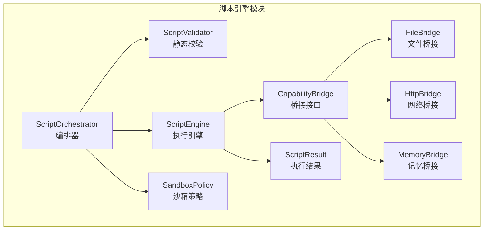
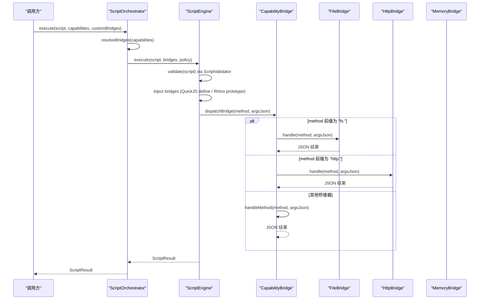
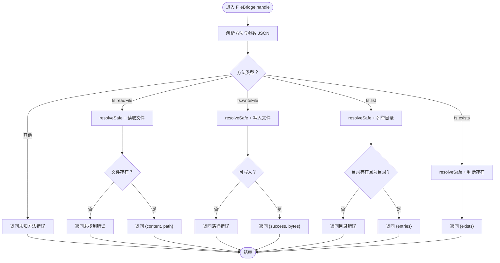
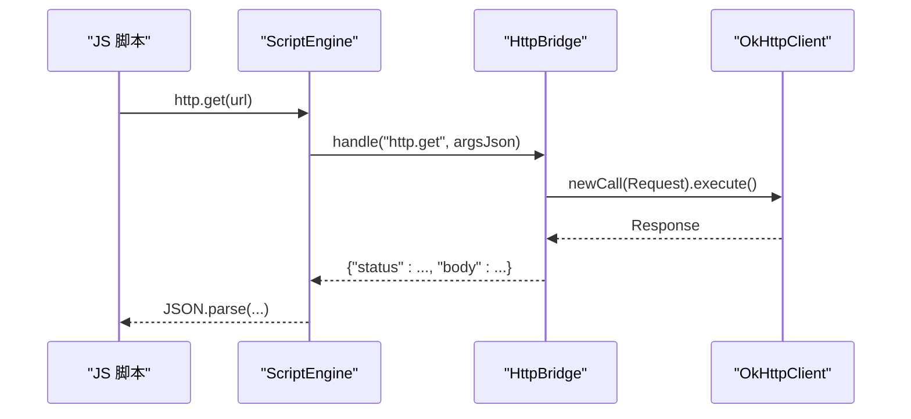
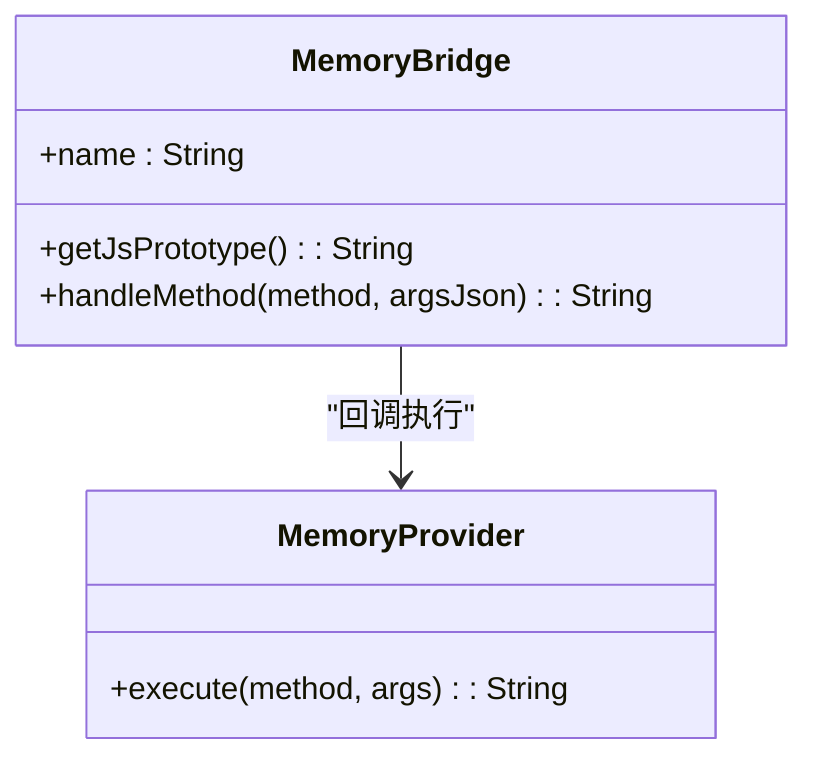
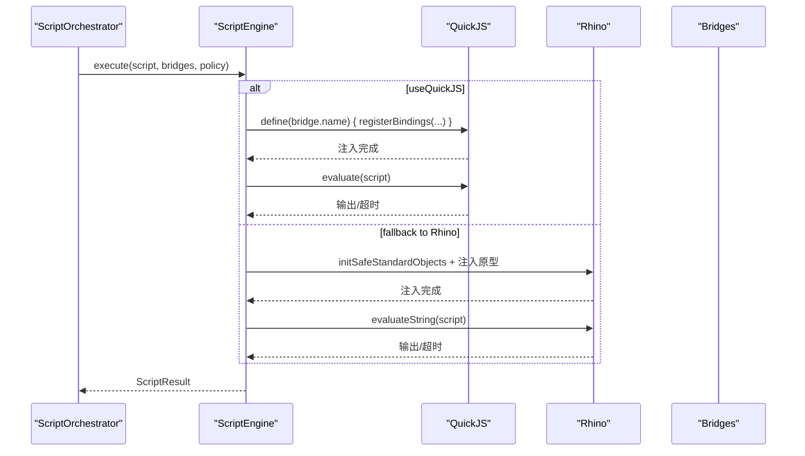
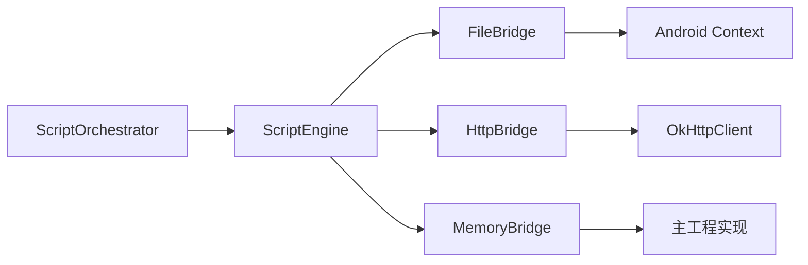

# 能力桥接接口

<cite>
**本文引用的文件**
- [CapabilityBridge.kt](file://script/src/main/java/ai/openclaw/script/CapabilityBridge.kt)
- [FileBridge.kt](file://script/src/main/java/ai/openclaw/script/bridge/FileBridge.kt)
- [HttpBridge.kt](file://script/src/main/java/ai/openclaw/script/bridge/HttpBridge.kt)
- [MemoryBridge.kt](file://script/src/main/java/ai/openclaw/script/bridge/MemoryBridge.kt)
- [ScriptEngine.kt](file://script/src/main/java/ai/openclaw/script/ScriptEngine.kt)
- [ScriptOrchestrator.kt](file://script/src/main/java/ai/openclaw/script/ScriptOrchestrator.kt)
- [SandboxPolicy.kt](file://script/src/main/java/ai/openclaw/script/SandboxPolicy.kt)
- [ScriptResult.kt](file://script/src/main/java/ai/openclaw/script/ScriptResult.kt)
- [ScriptValidator.kt](file://script/src/main/java/ai/openclaw/script/ScriptValidator.kt)
- [FileBridgeTest.kt](file://script/src/test/java/ai/openclaw/script/bridge/FileBridgeTest.kt)
- [HttpBridgeTest.kt](file://script/src/test/java/ai/openclaw/script/bridge/HttpBridgeTest.kt)
- [ScriptOrchestratorIntegrationTest.kt](file://script/src/test/java/ai/openclaw/script/ScriptOrchestratorIntegrationTest.kt)
- [CapabilityBridgeTest.kt](file://script/src/test/java/ai/openclaw/script/bridge/CapabilityBridgeTest.kt)
- [weather.js](file://app/src/main/assets/scripts/weather.js)
- [search.js](file://app/src/main/assets/scripts/search.js)
- [script-engine.md](file://docs/script-engine.md)
</cite>

## 目录
1. [简介](#简介)
2. [项目结构](#项目结构)
3. [核心组件](#核心组件)
4. [架构总览](#架构总览)
5. [详细组件分析](#详细组件分析)
6. [依赖关系分析](#依赖关系分析)
7. [性能考量](#性能考量)
8. [故障排查指南](#故障排查指南)
9. [结论](#结论)
10. [附录](#附录)

## 简介
本文件面向“能力桥接接口”的设计与实现，聚焦以下目标：
- 解释 CapabilityBridge 基类的设计模式、方法签名与实现规范
- 详述内置桥接器（FileBridge、HttpBridge、MemoryBridge）的功能特性、API 接口与使用方法
- 说明桥接器的注册流程、参数传递与返回值处理方式
- 提供自定义桥接器的开发指南、安全考虑与性能优化建议
- 说明桥接器与脚本引擎的集成方式与调试技巧

## 项目结构
脚本引擎模块位于 script 子模块，核心由“编排器 + 引擎 + 桥接器 + 安全策略 + 结果封装”构成；应用层通过 ScriptOrchestrator 统一入口发起执行，并可按需启用内置桥接器或注入自定义桥接器。

图示来源
- [ScriptOrchestrator.kt:13-54](file://script/src/main/java/ai/openclaw/script/ScriptOrchestrator.kt#L13-L54)
- [ScriptEngine.kt:22-231](file://script/src/main/java/ai/openclaw/script/ScriptEngine.kt#L22-L231)
- [ScriptValidator.kt:8-60](file://script/src/main/java/ai/openclaw/script/ScriptValidator.kt#L8-L60)
- [SandboxPolicy.kt:8-16](file://script/src/main/java/ai/openclaw/script/SandboxPolicy.kt#L8-L16)
- [ScriptResult.kt:6-20](file://script/src/main/java/ai/openclaw/script/ScriptResult.kt#L6-L20)
- [CapabilityBridge.kt:13-32](file://script/src/main/java/ai/openclaw/script/CapabilityBridge.kt#L13-L32)
- [FileBridge.kt:20-120](file://script/src/main/java/ai/openclaw/script/bridge/FileBridge.kt#L20-L120)
- [HttpBridge.kt:18-87](file://script/src/main/java/ai/openclaw/script/bridge/HttpBridge.kt#L18-L87)
- [MemoryBridge.kt:14-54](file://script/src/main/java/ai/openclaw/script/bridge/MemoryBridge.kt#L14-L54)

章节来源
- [ScriptOrchestrator.kt:13-54](file://script/src/main/java/ai/openclaw/script/ScriptOrchestrator.kt#L13-L54)
- [ScriptEngine.kt:22-231](file://script/src/main/java/ai/openclaw/script/ScriptEngine.kt#L22-L231)

## 核心组件
- CapabilityBridge：桥接接口，定义桥接器名称、JS 原型与方法分发机制，支持 Rhino 与 QuickJS 两种模式。
- ScriptOrchestrator：执行入口，负责解析能力清单、组装桥接器、应用沙箱策略并委派执行。
- ScriptEngine：执行引擎，支持 QuickJS（JNI）与 Rhino（原型），负责注入桥接器、执行脚本、超时控制与回退。
- FileBridge：文件系统桥接，限定在沙箱目录内进行读写、列出与存在性判断，具备路径穿越防护。
- HttpBridge：网络请求桥接，基于 OkHttp 提供 GET/POST，内置连接与读取超时。
- MemoryBridge：记忆系统桥接，通过回调接口将召回与存储请求转发至主工程实现。
- SandboxPolicy：沙箱策略，控制超时、内存上限、沙箱目录、网络与文件写入权限及域名白名单。
- ScriptResult：执行结果封装，包含成功标志、输出、错误信息与耗时。
- ScriptValidator：静态校验器，禁止危险模式与过大脚本，保障执行前安全。

章节来源
- [CapabilityBridge.kt:13-32](file://script/src/main/java/ai/openclaw/script/CapabilityBridge.kt#L13-L32)
- [ScriptOrchestrator.kt:13-54](file://script/src/main/java/ai/openclaw/script/ScriptOrchestrator.kt#L13-L54)
- [ScriptEngine.kt:22-231](file://script/src/main/java/ai/openclaw/script/ScriptEngine.kt#L22-L231)
- [FileBridge.kt:20-120](file://script/src/main/java/ai/openclaw/script/bridge/FileBridge.kt#L20-L120)
- [HttpBridge.kt:18-87](file://script/src/main/java/ai/openclaw/script/bridge/HttpBridge.kt#L18-L87)
- [MemoryBridge.kt:14-54](file://script/src/main/java/ai/openclaw/script/bridge/MemoryBridge.kt#L14-L54)
- [SandboxPolicy.kt:8-16](file://script/src/main/java/ai/openclaw/script/SandboxPolicy.kt#L8-L16)
- [ScriptResult.kt:6-20](file://script/src/main/java/ai/openclaw/script/ScriptResult.kt#L6-L20)
- [ScriptValidator.kt:8-60](file://script/src/main/java/ai/openclaw/script/ScriptValidator.kt#L8-L60)

## 架构总览
下图展示了从调用方到桥接器与引擎的整体交互流程，包括能力解析、桥接器注入、脚本执行与结果返回。

图示来源
- [ScriptOrchestrator.kt:31-53](file://script/src/main/java/ai/openclaw/script/ScriptOrchestrator.kt#L31-L53)
- [ScriptEngine.kt:45-99](file://script/src/main/java/ai/openclaw/script/ScriptEngine.kt#L45-L99)
- [FileBridge.kt:68-80](file://script/src/main/java/ai/openclaw/script/bridge/FileBridge.kt#L68-L80)
- [HttpBridge.kt:54-64](file://script/src/main/java/ai/openclaw/script/bridge/HttpBridge.kt#L54-L64)
- [MemoryBridge.kt:25-48](file://script/src/main/java/ai/openclaw/script/bridge/MemoryBridge.kt#L25-L48)

## 详细组件分析

### CapabilityBridge 接口设计与实现规范
- 设计要点
  - 桥接器名称：每个桥接器通过 name 标识，作为 JS 全局对象名或方法前缀的一部分。
  - Rhino 模式：提供 getJsPrototype() 以注入 JS 原型；通过 __nativeCall 分发到 handleMethod。
  - QuickJS 模式：提供 registerBindings(ObjectBindingScope) 在 DSL 内注册函数，内部复用 handle()。
  - 默认实现：handleMethod 提供通用分发与错误兜底，便于非 QuickJS 场景使用。
- 方法签名与职责
  - name: String
  - getJsPrototype(): String
  - handleMethod(method: String, argsJson: String): String（默认返回未实现错误）
  - registerBindings(dsl: ObjectBindingScope)（默认空实现，子类覆盖）

章节来源
- [CapabilityBridge.kt:13-32](file://script/src/main/java/ai/openclaw/script/CapabilityBridge.kt#L13-L32)

### FileBridge 文件系统桥接
- 功能特性
  - 支持文件读取、写入、目录列举与存在性判断。
  - 所有操作限制在沙箱目录内，防止路径穿越攻击。
  - 参数与返回值均为 JSON 字符串，便于跨引擎传输。
- API 接口
  - fs.readFile(path): {content, path}
  - fs.writeFile(path, content): {success, bytes}
  - fs.list(dir): {entries: [{name, isDirectory, size}]}
  - fs.exists(path): {exists}
- 实现要点
  - 路径解析：resolveSafe() 基于 canonicalPath 校验，阻断 ../ 等越权路径。
  - 参数解析：extractField() 从 JSON 字符串中提取字段值，避免引入外部 JSON 库。
  - 字符串转义：jsonEscape() 用于在 DSL 中构造安全的 JSON 字面量。
  - 错误处理：捕获异常并返回标准化错误 JSON。
- 使用方法
  - 在 ScriptOrchestrator.execute() 中传入 capabilities = ["fs"]，或通过 customBridges 注入实例。
  - JS 脚本中直接调用 fs.* 方法，引擎自动注入全局对象。

图示来源
- [FileBridge.kt:68-120](file://script/src/main/java/ai/openclaw/script/bridge/FileBridge.kt#L68-L120)
- [FileBridge.kt:122-157](file://script/src/main/java/ai/openclaw/script/bridge/FileBridge.kt#L122-L157)

章节来源
- [FileBridge.kt:20-120](file://script/src/main/java/ai/openclaw/script/bridge/FileBridge.kt#L20-L120)
- [FileBridgeTest.kt:21-79](file://script/src/test/java/ai/openclaw/script/bridge/FileBridgeTest.kt#L21-L79)

### HttpBridge 网络请求桥接
- 功能特性
  - 提供 HTTP GET/POST 能力，基于 OkHttp 客户端。
  - 内置连接与读取超时，避免长时间阻塞。
  - 参数与返回值为 JSON 字符串，便于跨引擎传输。
- API 接口
  - http.get(url): {status, body}
  - http.post(url, body): {status, body}
- 实现要点
  - 超时配置：连接与读取超时均为 10 秒。
  - 错误处理：捕获异常并返回标准化错误 JSON。
- 使用方法
  - 在 ScriptOrchestrator.execute() 中传入 capabilities = ["http"]，或通过 customBridges 注入实例。
  - JS 脚本中直接调用 http.* 方法，引擎自动注入全局对象。

图示来源
- [HttpBridge.kt:54-87](file://script/src/main/java/ai/openclaw/script/bridge/HttpBridge.kt#L54-L87)
- [ScriptEngine.kt:120-142](file://script/src/main/java/ai/openclaw/script/ScriptEngine.kt#L120-L142)

章节来源
- [HttpBridge.kt:18-87](file://script/src/main/java/ai/openclaw/script/bridge/HttpBridge.kt#L18-L87)
- [HttpBridgeTest.kt:17-33](file://script/src/test/java/ai/openclaw/script/bridge/HttpBridgeTest.kt#L17-L33)

### MemoryBridge 记忆系统桥接
- 功能特性
  - 通过回调接口将记忆系统的召回与存储请求转发至主工程实现。
  - JS API 与返回值为 JSON 字符串，便于跨引擎传输。
- API 接口
  - memory.recall(query, limit): {results: [{content, similarity, type}]}
  - memory.store(content): {success}
- 实现要点
  - 回调接口：MemoryProvider.execute(method, args) 以协程方式执行，返回 JSON 字符串。
  - 参数解析：extractField() 从 JSON 字符串中提取字段值。
  - 错误处理：捕获异常并返回标准化错误 JSON。
- 使用方法
  - 在主工程实现 MemoryProvider.execute()，并在 ScriptOrchestrator.execute() 中通过 customBridges 注入 MemoryBridge 实例。
  - JS 脚本中直接调用 memory.* 方法，引擎自动注入全局对象。

图示来源
- [MemoryBridge.kt:14-54](file://script/src/main/java/ai/openclaw/script/bridge/MemoryBridge.kt#L14-L54)

章节来源
- [MemoryBridge.kt:14-54](file://script/src/main/java/ai/openclaw/script/bridge/MemoryBridge.kt#L14-L54)

### ScriptEngine 执行引擎与桥接器注册流程
- 引擎模式
  - QuickJS（推荐）：通过 quickJs.define(name) { ... } 注册桥接器，每个桥接器对应一个全局对象。
  - Rhino（原型）：通过 __nativeCall 分发到桥接器的 handleMethod。
- 注册流程
  - ScriptOrchestrator.resolveBridges() 根据 capabilities 列表创建桥接器实例。
  - ScriptEngine.executeWithQuickJS() 遍历 bridges 并注入到 QuickJS 上下文。
  - Rhino 模式下，ScriptEngine.executeWithRhino() 注入 getJsPrototype() 与 __nativeCall。
- 参数与返回值
  - JS → Android：方法名（形如 "fs.readFile"）与 JSON 字符串参数。
  - Android → JS：JSON 字符串结果，由引擎转换为 JS 对象。
- 超时与回退
  - 使用 withTimeoutOrNull 控制执行时间；若 QuickJS 失败则回退到 Rhino。

图示来源
- [ScriptEngine.kt:120-225](file://script/src/main/java/ai/openclaw/script/ScriptEngine.kt#L120-L225)
- [ScriptOrchestrator.kt:41-53](file://script/src/main/java/ai/openclaw/script/ScriptOrchestrator.kt#L41-L53)

章节来源
- [ScriptEngine.kt:22-231](file://script/src/main/java/ai/openclaw/script/ScriptEngine.kt#L22-L231)
- [ScriptOrchestrator.kt:31-53](file://script/src/main/java/ai/openclaw/script/ScriptOrchestrator.kt#L31-L53)

### ScriptOrchestrator 注册与执行入口
- 能力解析
  - 支持 "fs"/"file"、"http"/"network" 等能力标识；未知能力会记录警告。
- 沙箱策略
  - 默认策略：超时 10 秒、允许网络与文件写入、沙箱目录为 app/files/script_sandbox。
- 执行流程
  - 组装桥接器列表（内置 + 自定义）
  - 应用策略并执行脚本
  - 返回 ScriptResult

章节来源
- [ScriptOrchestrator.kt:13-54](file://script/src/main/java/ai/openclaw/script/ScriptOrchestrator.kt#L13-L54)
- [SandboxPolicy.kt:8-16](file://script/src/main/java/ai/openclaw/script/SandboxPolicy.kt#L8-L16)

## 依赖关系分析
- 组件耦合
  - ScriptEngine 依赖各桥接器实现；桥接器实现依赖 Android 上下文（FileBridge）或 OkHttp（HttpBridge）。
  - ScriptOrchestrator 仅负责编排，低耦合。
- 外部依赖
  - QuickJS（JNI）、Rhino（原型）、OkHttp、kotlinx-coroutines。
- 循环依赖
  - 无循环依赖，桥接器通过接口与回调解耦。

图示来源
- [ScriptEngine.kt:22-231](file://script/src/main/java/ai/openclaw/script/ScriptEngine.kt#L22-L231)
- [FileBridge.kt:20-120](file://script/src/main/java/ai/openclaw/script/bridge/FileBridge.kt#L20-L120)
- [HttpBridge.kt:18-87](file://script/src/main/java/ai/openclaw/script/bridge/HttpBridge.kt#L18-L87)
- [MemoryBridge.kt:14-54](file://script/src/main/java/ai/openclaw/script/bridge/MemoryBridge.kt#L14-L54)

章节来源
- [ScriptEngine.kt:22-231](file://script/src/main/java/ai/openclaw/script/ScriptEngine.kt#L22-L231)

## 性能考量
- 引擎选择
  - QuickJS JNI 相比 Rhino 具备更小体积与更高性能，建议优先使用 QuickJS。
- 脚本缓存
  - ScriptEngine 内置基于脚本哈希的执行结果缓存，命中时直接返回缓存结果与耗时。
- 超时控制
  - 默认 10 秒超时，可通过 SandboxPolicy.timeoutMs 调整。
- I/O 优化
  - FileBridge 采用一次性读写，避免重复 IO；HttpBridge 使用连接池与超时控制。
- 协程与并发
  - MemoryBridge 通过协程回调执行，避免阻塞主线程。

章节来源
- [ScriptEngine.kt:33-99](file://script/src/main/java/ai/openclaw/script/ScriptEngine.kt#L33-L99)
- [script-engine.md:245-246](file://docs/script-engine.md#L245-L246)

## 故障排查指南
- 脚本被拒绝
  - 静态校验失败：检查是否包含禁止模式（如 import/require/eval 等）或脚本过长。
  - 空脚本：确保传入非空脚本。
- 能力未生效
  - 未正确声明能力：在 capabilities 中添加 "fs" 或 "http"。
  - 未注入自定义桥接器：通过 customBridges 注入实例。
- 文件操作异常
  - 路径穿越：确保路径不包含 "../" 等越权片段。
  - 文件不存在：确认路径与沙箱目录设置。
- 网络请求异常
  - URL 为空或无效：检查 URL 格式与可达性。
  - 超时：适当增大 SandboxPolicy.timeoutMs。
- 记忆能力异常
  - 未实现 MemoryProvider：在主工程实现 execute() 并注入到 MemoryBridge。
- 调试技巧
  - 查看 ScriptEngine 统计信息：totalExecutions、successCount、failureCount、avgElapsedMs、cacheSize、activeEngine。
  - 使用测试用例参考：FileBridgeTest、HttpBridgeTest、ScriptOrchestratorIntegrationTest。

章节来源
- [ScriptValidator.kt:42-58](file://script/src/main/java/ai/openclaw/script/ScriptValidator.kt#L42-L58)
- [ScriptEngine.kt:104-118](file://script/src/main/java/ai/openclaw/script/ScriptEngine.kt#L104-L118)
- [FileBridgeTest.kt:67-70](file://script/src/test/java/ai/openclaw/script/bridge/FileBridgeTest.kt#L67-L70)
- [HttpBridgeTest.kt:17-28](file://script/src/test/java/ai/openclaw/script/bridge/HttpBridgeTest.kt#L17-L28)
- [ScriptOrchestratorIntegrationTest.kt:118-136](file://script/src/test/java/ai/openclaw/script/ScriptOrchestratorIntegrationTest.kt#L118-L136)

## 结论
能力桥接接口通过统一的 CapabilityBridge 抽象，将 JS 脚本与 Android 能力解耦，支持快速扩展与安全执行。内置桥接器覆盖文件系统、网络请求与记忆系统等常见需求；配合 ScriptOrchestrator 的能力解析与 ScriptEngine 的执行调度，形成完整的脚本执行闭环。建议在生产环境优先采用 QuickJS 引擎、合理配置沙箱策略，并结合缓存与超时控制提升性能与稳定性。

## 附录

### API 参考与使用示例
- 文件操作（FileBridge）
  - fs.readFile(path): {content, path}
  - fs.writeFile(path, content): {success, bytes}
  - fs.list(dir): {entries: [{name, isDirectory, size}]}
  - fs.exists(path): {exists}
- 网络请求（HttpBridge）
  - http.get(url): {status, body}
  - http.post(url, body): {status, body}
- 记忆系统（MemoryBridge）
  - memory.recall(query, limit): {results: [{content, similarity, type}]}
  - memory.store(content): {success}

章节来源
- [FileBridge.kt:12-17](file://script/src/main/java/ai/openclaw/script/bridge/FileBridge.kt#L12-L17)
- [HttpBridge.kt:14-17](file://script/src/main/java/ai/openclaw/script/bridge/HttpBridge.kt#L14-L17)
- [MemoryBridge.kt:8-12](file://script/src/main/java/ai/openclaw/script/bridge/MemoryBridge.kt#L8-L12)
- [script-engine.md:169-203](file://docs/script-engine.md#L169-L203)

### 自定义桥接器开发指南
- 必要步骤
  - 实现 CapabilityBridge 接口，提供 name、getJsPrototype（Rhino 模式）与 registerBindings（QuickJS 模式）。
  - 在 handleMethod 或 handle 中解析 argsJson 并返回 JSON 字符串。
  - 在 ScriptOrchestrator.execute() 的 customBridges 中注入实例。
- 安全考虑
  - 严格校验输入参数，避免路径穿越（参考 FileBridge 的 resolveSafe）。
  - 限制 I/O 与网络访问范围，遵循 SandboxPolicy。
  - 使用 JSON 字符串进行跨引擎通信，避免直接暴露对象。
- 性能优化
  - 缓存热点数据与计算结果。
  - 合理设置超时与内存上限。
  - 使用协程异步处理耗时操作（参考 MemoryBridge）。

章节来源
- [CapabilityBridge.kt:13-32](file://script/src/main/java/ai/openclaw/script/CapabilityBridge.kt#L13-L32)
- [FileBridge.kt:82-120](file://script/src/main/java/ai/openclaw/script/bridge/FileBridge.kt#L82-L120)
- [MemoryBridge.kt:25-48](file://script/src/main/java/ai/openclaw/script/bridge/MemoryBridge.kt#L25-L48)
- [ScriptOrchestrator.kt:31-39](file://script/src/main/java/ai/openclaw/script/ScriptOrchestrator.kt#L31-L39)

### 脚本引擎集成与调试
- 集成方式
  - 在主工程中添加对 :script 模块的依赖。
  - 通过 ScriptSkill 调用 ScriptOrchestrator.execute(script, capabilities)。
- 调试技巧
  - 使用 ScriptEngine.getStats() 获取执行统计。
  - 参考应用层脚本示例：weather.js、search.js。
  - 关注测试用例中的边界条件与错误处理。

章节来源
- [script-engine.md:247-279](file://docs/script-engine.md#L247-L279)
- [weather.js:1-16](file://app/src/main/assets/scripts/weather.js#L1-L16)
- [search.js:1-39](file://app/src/main/assets/scripts/search.js#L1-L39)
- [ScriptEngine.kt:104-118](file://script/src/main/java/ai/openclaw/script/ScriptEngine.kt#L104-L118)