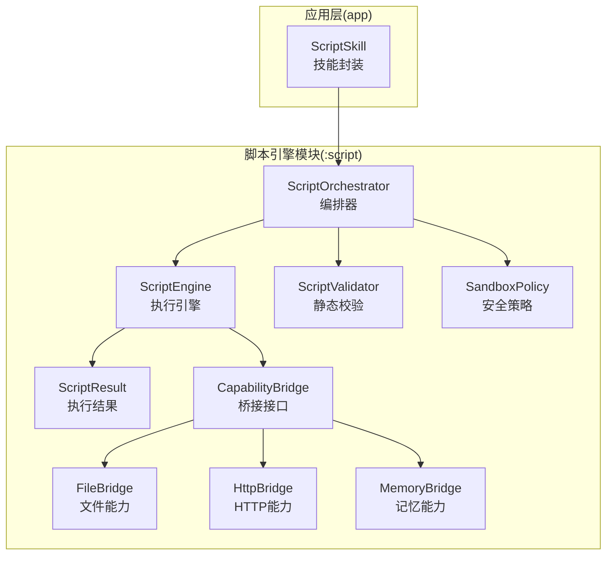
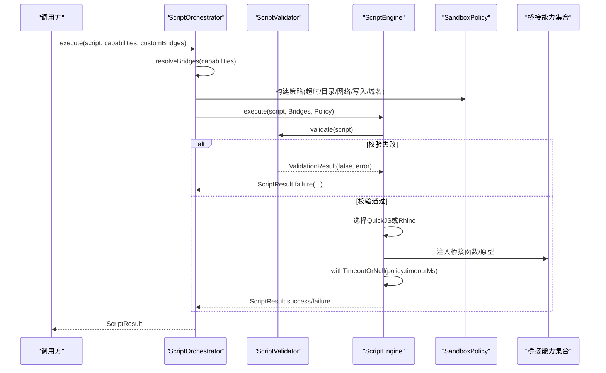
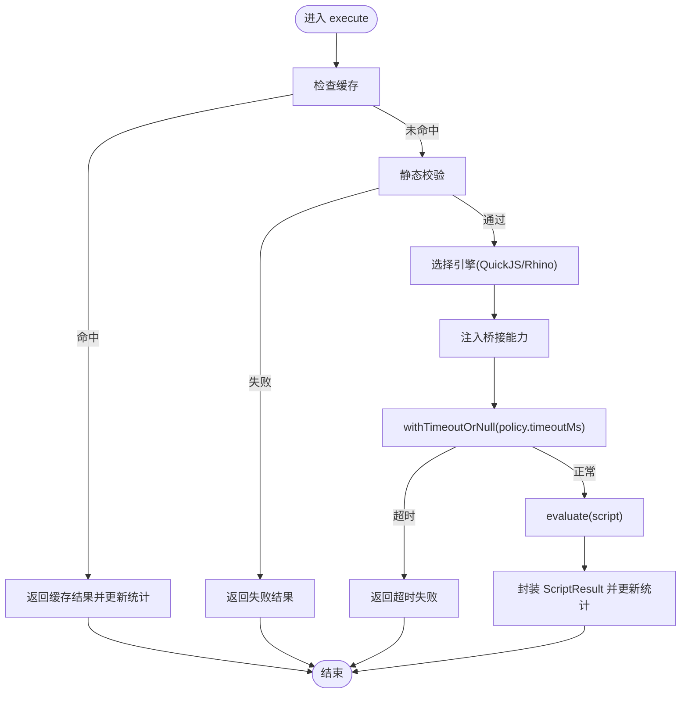
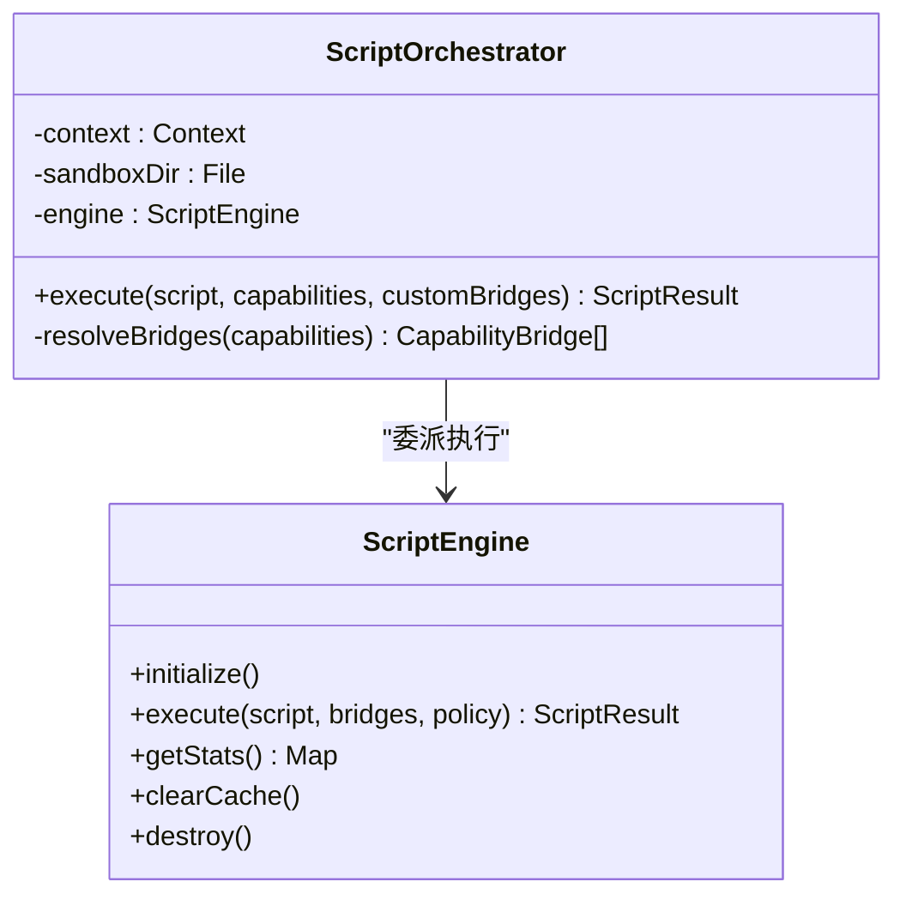
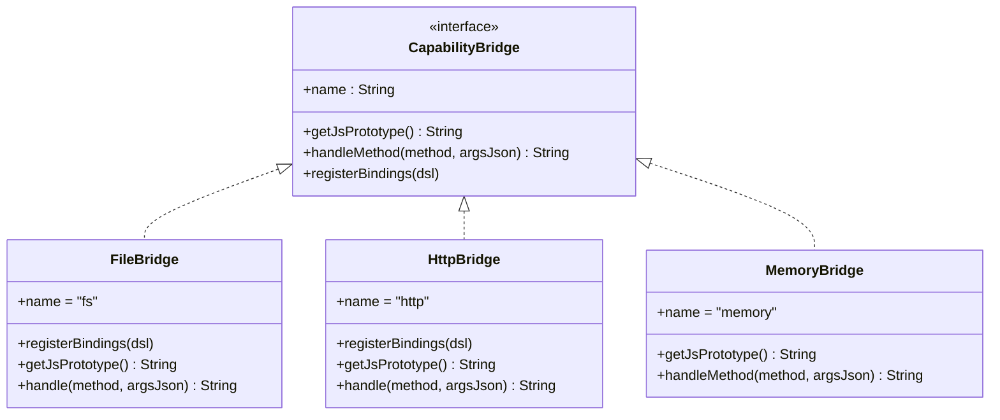
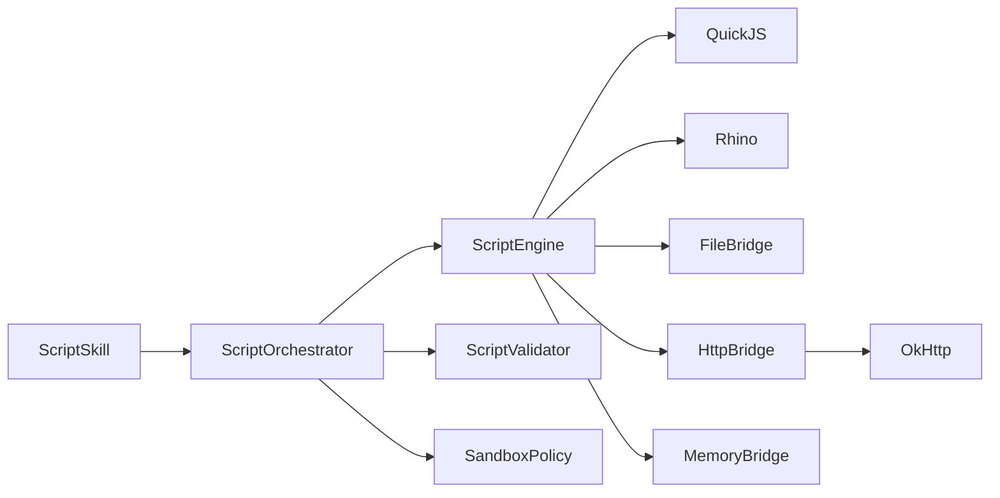

# 脚本引擎接口

<cite>
**本文引用的文件**
- [ScriptEngine.kt](file://script/src/main/java/ai/openclaw/script/ScriptEngine.kt)
- [ScriptOrchestrator.kt](file://script/src/main/java/ai/openclaw/script/ScriptOrchestrator.kt)
- [SandboxPolicy.kt](file://script/src/main/java/ai/openclaw/script/SandboxPolicy.kt)
- [ScriptResult.kt](file://script/src/main/java/ai/openclaw/script/ScriptResult.kt)
- [ScriptValidator.kt](file://script/src/main/java/ai/openclaw/script/ScriptValidator.kt)
- [CapabilityBridge.kt](file://script/src/main/java/ai/openclaw/script/CapabilityBridge.kt)
- [FileBridge.kt](file://script/src/main/java/ai/openclaw/script/bridge/FileBridge.kt)
- [HttpBridge.kt](file://script/src/main/java/ai/openclaw/script/bridge/HttpBridge.kt)
- [MemoryBridge.kt](file://script/src/main/java/ai/openclaw/script/bridge/MemoryBridge.kt)
- [ScriptEngineTest.kt](file://script/src/test/java/ai/openclaw/script/ScriptEngineTest.kt)
- [ScriptOrchestratorIntegrationTest.kt](file://script/src/test/java/ai/openclaw/script/ScriptOrchestratorIntegrationTest.kt)
- [ScriptSkill.kt](file://app/src/main/java/ai/openclaw/android/skill/builtin/ScriptSkill.kt)
- [script-engine.md](file://docs/script-engine.md)
- [design-weather-script-sandbox.md](file://docs/design-weather-script-sandbox.md)
</cite>

## 目录
1. [简介](#简介)
2. [项目结构](#项目结构)
3. [核心组件](#核心组件)
4. [架构总览](#架构总览)
5. [详细组件分析](#详细组件分析)
6. [依赖关系分析](#依赖关系分析)
7. [性能与优化](#性能与优化)
8. [故障排查指南](#故障排查指南)
9. [结论](#结论)
10. [附录：API使用示例与最佳实践](#附录api使用示例与最佳实践)

## 简介
本文件为脚本引擎API的权威接口文档，面向希望在Android应用中安全地执行JavaScript脚本、并与原生能力（文件系统、HTTP网络、记忆系统等）进行受控交互的开发者。文档覆盖以下关键主题：
- ScriptEngine的核心方法与脚本执行流程
- ScriptOrchestrator的调度机制与生命周期管理
- SandboxPolicy的安全策略与权限控制
- 脚本编写、执行与调试的API使用示例
- 脚本与原生代码的交互方式与数据传递机制
- 配置选项与性能优化建议

## 项目结构
脚本引擎模块位于独立的Android Library Module中，核心源码集中在script/src/main/java/ai/openclaw/script及子包bridge下；应用层通过SkillSkill对接脚本引擎，实现LLM生成JS脚本的动态执行。

图示来源
- [ScriptOrchestrator.kt:13-39](file://script/src/main/java/ai/openclaw/script/ScriptOrchestrator.kt#L13-L39)
- [ScriptEngine.kt:45-99](file://script/src/main/java/ai/openclaw/script/ScriptEngine.kt#L45-L99)
- [ScriptValidator.kt:42-58](file://script/src/main/java/ai/openclaw/script/ScriptValidator.kt#L42-L58)
- [SandboxPolicy.kt:8-15](file://script/src/main/java/ai/openclaw/script/SandboxPolicy.kt#L8-L15)
- [ScriptResult.kt:6-18](file://script/src/main/java/ai/openclaw/script/ScriptResult.kt#L6-L18)
- [CapabilityBridge.kt:13-32](file://script/src/main/java/ai/openclaw/script/CapabilityBridge.kt#L13-L32)
- [FileBridge.kt:20-51](file://script/src/main/java/ai/openclaw/script/bridge/FileBridge.kt#L20-L51)
- [HttpBridge.kt:18-38](file://script/src/main/java/ai/openclaw/script/bridge/HttpBridge.kt#L18-L38)
- [MemoryBridge.kt:14-23](file://script/src/main/java/ai/openclaw/script/bridge/MemoryBridge.kt#L14-L23)
- [ScriptSkill.kt:56-87](file://app/src/main/java/ai/openclaw/android/skill/builtin/ScriptSkill.kt#L56-L87)

章节来源
- [script-engine.md:36-51](file://docs/script-engine.md#L36-L51)

## 核心组件
- ScriptOrchestrator：脚本执行入口，负责能力解析、沙箱策略构建与引擎委派。
- ScriptEngine：JS执行引擎，支持QuickJS（JNI）与Rhino双引擎回退，具备缓存、统计与超时控制。
- ScriptValidator：静态校验器，在执行前阻断危险模式与超长脚本。
- SandboxPolicy：安全策略数据类，控制超时、内存、文件写入、网络访问与域名白名单。
- ScriptResult：统一的执行结果封装。
- CapabilityBridge及其子类：桥接接口与具体能力实现（文件、HTTP、记忆等）。
- ScriptSkill：应用层技能封装，将脚本引擎接入Skill体系，暴露execute_script工具。

章节来源
- [ScriptOrchestrator.kt:13-39](file://script/src/main/java/ai/openclaw/script/ScriptOrchestrator.kt#L13-L39)
- [ScriptEngine.kt:22-99](file://script/src/main/java/ai/openclaw/script/ScriptEngine.kt#L22-L99)
- [ScriptValidator.kt:42-58](file://script/src/main/java/ai/openclaw/script/ScriptValidator.kt#L42-L58)
- [SandboxPolicy.kt:8-15](file://script/src/main/java/ai/openclaw/script/SandboxPolicy.kt#L8-L15)
- [ScriptResult.kt:6-18](file://script/src/main/java/ai/openclaw/script/ScriptResult.kt#L6-L18)
- [CapabilityBridge.kt:13-32](file://script/src/main/java/ai/openclaw/script/CapabilityBridge.kt#L13-L32)
- [ScriptSkill.kt:56-87](file://app/src/main/java/ai/openclaw/android/skill/builtin/ScriptSkill.kt#L56-L87)

## 架构总览
脚本执行从ScriptOrchestrator开始，经过静态校验、能力解析与沙箱策略，最终委派给ScriptEngine执行。引擎内部根据策略选择QuickJS或Rhino，注入桥接能力，并在限定时间内完成脚本求值，返回统一的ScriptResult。

图示来源
- [ScriptOrchestrator.kt:31-39](file://script/src/main/java/ai/openclaw/script/ScriptOrchestrator.kt#L31-L39)
- [ScriptEngine.kt:45-99](file://script/src/main/java/ai/openclaw/script/ScriptEngine.kt#L45-L99)
- [ScriptValidator.kt:42-58](file://script/src/main/java/ai/openclaw/script/ScriptValidator.kt#L42-L58)
- [SandboxPolicy.kt:8-15](file://script/src/main/java/ai/openclaw/script/SandboxPolicy.kt#L8-L15)

## 详细组件分析

### ScriptEngine 执行引擎
- 职责
  - 负责脚本执行、缓存、统计与错误回退。
  - 支持QuickJS（JNI）与Rhino双引擎，自动回退。
  - 注入桥接能力，按策略执行并返回结果。
- 关键方法
  - initialize()/destroy()：生命周期管理。
  - execute(script, bridges, policy)：核心执行方法，返回ScriptResult。
  - getStats()/clearCache()：统计与缓存管理。
  - executeWithQuickJS()/executeWithRhino()：引擎选择与执行。
  - dispatchBridge()：桥接方法分发。
- 执行流程
  - 缓存命中则直接返回缓存结果并更新统计。
  - 静态校验通过后，按策略设置超时，注入桥接能力，执行脚本。
  - 成功/失败均更新统计；异常时尝试回退到另一引擎。
- 性能与安全
  - 脚本缓存（基于哈希键），最大容量限制。
  - 超时控制（withTimeoutOrNull）。
  - Rhino侧初始化安全标准对象并删除危险全局对象。

图示来源
- [ScriptEngine.kt:45-99](file://script/src/main/java/ai/openclaw/script/ScriptEngine.kt#L45-L99)
- [ScriptEngine.kt:120-142](file://script/src/main/java/ai/openclaw/script/ScriptEngine.kt#L120-L142)
- [ScriptEngine.kt:144-209](file://script/src/main/java/ai/openclaw/script/ScriptEngine.kt#L144-L209)

章节来源
- [ScriptEngine.kt:22-231](file://script/src/main/java/ai/openclaw/script/ScriptEngine.kt#L22-L231)

### ScriptOrchestrator 调度器
- 职责
  - 作为统一入口，解析能力列表，构建沙箱目录与策略，委派给ScriptEngine执行。
- 生命周期
  - 懒加载沙箱目录与引擎实例，初始化后可重复使用。
- 能力解析
  - 支持“fs/file”、“http/network”，未知能力会发出警告但不会抛错。
- 执行流程
  - 合并内置能力与自定义桥接，构建SandboxPolicy，调用ScriptEngine.execute。

图示来源
- [ScriptOrchestrator.kt:13-54](file://script/src/main/java/ai/openclaw/script/ScriptOrchestrator.kt#L13-L54)
- [ScriptEngine.kt:22-99](file://script/src/main/java/ai/openclaw/script/ScriptEngine.kt#L22-L99)

章节来源
- [ScriptOrchestrator.kt:13-55](file://script/src/main/java/ai/openclaw/script/ScriptOrchestrator.kt#L13-L55)

### SandboxPolicy 安全策略
- 字段
  - timeoutMs：执行超时时间（毫秒）。
  - maxMemoryMB：内存限制（当前未直接使用，保留扩展）。
  - sandboxDir：沙箱根目录。
  - allowNetwork：是否允许网络访问。
  - allowFileWrite：是否允许文件写入。
  - allowedDomains：允许访问的域名白名单（可选）。
- 作用
  - 作为ScriptEngine的执行约束，影响超时与桥接行为（例如HTTP桥接的网络开关）。

章节来源
- [SandboxPolicy.kt:8-15](file://script/src/main/java/ai/openclaw/script/SandboxPolicy.kt#L8-L15)

### ScriptValidator 静态校验
- 目标
  - 在执行前阻断潜在危险模式与超长脚本，降低运行时风险。
- 限制
  - 禁止import/require/eval/new Function等模块化与动态执行。
  - 禁止访问java/android/Packages/process/global/window/document等系统对象。
  - 脚本长度上限50KB。
- 结果
  - 返回ValidationResult，包含isValid与error信息。

章节来源
- [ScriptValidator.kt:42-58](file://script/src/main/java/ai/openclaw/script/ScriptValidator.kt#L42-L58)

### ScriptResult 执行结果
- 字段
  - success：是否成功。
  - output：输出文本。
  - error：错误信息（可为空）。
  - executionTimeMs：执行耗时（毫秒）。
- 工厂方法
  - success()/failure()：便捷创建。

章节来源
- [ScriptResult.kt:6-18](file://script/src/main/java/ai/openclaw/script/ScriptResult.kt#L6-L18)

### CapabilityBridge 桥接接口与实现
- CapabilityBridge
  - name：桥接名称（如“fs”、“http”、“memory”）。
  - getJsPrototype()：Rhino模式下的JS原型注入代码。
  - handleMethod(method, argsJson)：默认实现（返回未实现错误）。
  - registerBindings(dsl)：QuickJS模式下的DSL绑定注册点。
- FileBridge
  - 提供fs.readFile/writeFile/list/exists。
  - 所有操作限制在沙箱目录内，防止路径穿越。
- HttpBridge
  - 提供http.get/post。
  - 基于OkHttp，支持连接/读取超时。
- MemoryBridge
  - 提供memory.recall/store。
  - 通过MemoryProvider回调注入实际记忆能力（由主工程实现）。

图示来源
- [CapabilityBridge.kt:13-32](file://script/src/main/java/ai/openclaw/script/CapabilityBridge.kt#L13-L32)
- [FileBridge.kt:20-51](file://script/src/main/java/ai/openclaw/script/bridge/FileBridge.kt#L20-L51)
- [HttpBridge.kt:18-38](file://script/src/main/java/ai/openclaw/script/bridge/HttpBridge.kt#L18-L38)
- [MemoryBridge.kt:14-23](file://script/src/main/java/ai/openclaw/script/bridge/MemoryBridge.kt#L14-L23)

章节来源
- [FileBridge.kt:20-157](file://script/src/main/java/ai/openclaw/script/bridge/FileBridge.kt#L20-L157)
- [HttpBridge.kt:18-88](file://script/src/main/java/ai/openclaw/script/bridge/HttpBridge.kt#L18-L88)
- [MemoryBridge.kt:14-55](file://script/src/main/java/ai/openclaw/script/bridge/MemoryBridge.kt#L14-L55)

### 应用层集成：ScriptSkill
- 职责
  - 将脚本引擎接入Skill体系，提供execute_script工具。
  - 支持延迟注入MemoryManager，构建MemoryBridge。
- 参数
  - script：必填，JS代码。
  - capabilities：可选，默认“fs,http”，支持逗号分隔。
- 行为
  - 初始化时创建ScriptOrchestrator。
  - 执行时合并自定义桥接（如MemoryBridge），调用orchestrator.execute并返回SkillResult。

章节来源
- [ScriptSkill.kt:56-132](file://app/src/main/java/ai/openclaw/android/skill/builtin/ScriptSkill.kt#L56-L132)

## 依赖关系分析
- 内部依赖
  - ScriptOrchestrator依赖ScriptEngine、ScriptValidator、SandboxPolicy与桥接能力。
  - ScriptEngine依赖QuickJS（或Rhino）、桥接能力与ScriptResult。
  - 各Bridge实现依赖对应第三方库（OkHttp、Android上下文等）。
- 外部依赖
  - QuickJS（JNI）：高性能JS引擎。
  - Rhino：原型引擎，用于回退。
  - OkHttp：HTTP桥接。
  - kotlinx-coroutines：异步支持。
- 循环依赖
  - 未发现循环依赖；各模块职责清晰，接口解耦良好。

图示来源
- [ScriptOrchestrator.kt:13-39](file://script/src/main/java/ai/openclaw/script/ScriptOrchestrator.kt#L13-L39)
- [ScriptEngine.kt:7-12](file://script/src/main/java/ai/openclaw/script/ScriptEngine.kt#L7-L12)
- [HttpBridge.kt:6-45](file://script/src/main/java/ai/openclaw/script/bridge/HttpBridge.kt#L6-L45)
- [ScriptSkill.kt:56-58](file://app/src/main/java/ai/openclaw/android/skill/builtin/ScriptSkill.kt#L56-L58)

## 性能与优化
- 引擎选择
  - 优先使用QuickJS（JNI），性能显著优于Rhino；若QuickJS失败自动回退。
- 缓存策略
  - ScriptEngine对成功执行的脚本进行缓存（基于哈希键），减少重复编译开销；最大容量限制，避免无限增长。
- 超时控制
  - 通过withTimeoutOrNull限制单次执行时间，防止长时间阻塞。
- I/O与网络
  - HTTP桥接使用OkHttp并设置连接/读取超时；文件操作严格限制在沙箱目录内，避免跨目录I/O。
- 统计与可观测性
  - 提供执行次数、成功/失败计数、平均耗时与缓存大小等指标，便于性能监控与优化。

章节来源
- [ScriptEngine.kt:28-35](file://script/src/main/java/ai/openclaw/script/ScriptEngine.kt#L28-L35)
- [ScriptEngine.kt:126-141](file://script/src/main/java/ai/openclaw/script/ScriptEngine.kt#L126-L141)
- [ScriptEngine.kt:149-209](file://script/src/main/java/ai/openclaw/script/ScriptEngine.kt#L149-L209)
- [HttpBridge.kt:40-45](file://script/src/main/java/ai/openclaw/script/bridge/HttpBridge.kt#L40-L45)

## 故障排查指南
- 常见问题与处理
  - 脚本被拒绝：检查是否包含被禁用的关键字（如import/require/eval等），或脚本过长。
  - 超时失败：适当增大SandboxPolicy.timeoutMs，或优化脚本逻辑。
  - 文件操作失败：确认路径在沙箱目录内且未越权（../被拦截）。
  - HTTP请求失败：检查网络权限与域名白名单（若启用allowedDomains）。
  - Rhino回退：若QuickJS不可用或异常，引擎会自动切换到Rhino；可在日志中查看回退提示。
- 调试建议
  - 使用ScriptEngine.getStats()观察执行统计，定位热点脚本。
  - 在应用层捕获ScriptResult.error，结合日志定位问题。
  - 使用单元测试与集成测试验证脚本行为与边界条件。

章节来源
- [ScriptEngineTest.kt:94-129](file://script/src/test/java/ai/openclaw/script/ScriptEngineTest.kt#L94-L129)
- [ScriptOrchestratorIntegrationTest.kt:179-191](file://script/src/test/java/ai/openclaw/script/ScriptOrchestratorIntegrationTest.kt#L179-L191)
- [ScriptEngine.kt:88-98](file://script/src/main/java/ai/openclaw/script/ScriptEngine.kt#L88-L98)

## 结论
脚本引擎通过清晰的职责划分与严格的沙箱策略，实现了在Android环境中安全、可控的JS脚本执行。ScriptOrchestrator提供统一入口，ScriptEngine负责执行与回退，SandboxPolicy与ScriptValidator共同保障安全边界。桥接能力使脚本能够与文件系统、HTTP网络、记忆系统等原生能力进行受控交互。配合统计与缓存机制，整体具备良好的性能与可观测性。

## 附录：API使用示例与最佳实践

### API使用示例
- 基础脚本执行
  - 使用ScriptOrchestrator.execute执行简单表达式或控制流。
  - 示例参考：[ScriptOrchestratorIntegrationTest.kt:41-83](file://script/src/test/java/ai/openclaw/script/ScriptOrchestratorIntegrationTest.kt#L41-L83)
- 文件能力
  - 通过fs.readFile/fs.writeFile/fs.list/fs.exists进行文件操作。
  - 示例参考：[FileBridge.kt:68-119](file://script/src/main/java/ai/openclaw/script/bridge/FileBridge.kt#L68-L119)
- HTTP能力
  - 通过http.get/http.post发起网络请求。
  - 示例参考：[HttpBridge.kt:54-86](file://script/src/main/java/ai/openclaw/script/bridge/HttpBridge.kt#L54-L86)
- 记忆能力
  - 通过memory.recall/memory.store与记忆系统交互（需提供MemoryProvider）。
  - 示例参考：[MemoryBridge.kt:25-48](file://script/src/main/java/ai/openclaw/script/bridge/MemoryBridge.kt#L25-L48)
- 应用层工具
  - 通过ScriptSkill.execute_script工具调用脚本引擎。
  - 示例参考：[ScriptSkill.kt:64-87](file://app/src/main/java/ai/openclaw/android/skill/builtin/ScriptSkill.kt#L64-L87)

### 最佳实践
- 安全
  - 严格遵守ScriptValidator的限制，避免使用被禁用的关键字与模式。
  - 合理配置SandboxPolicy.timeoutMs与allowNetwork/allowFileWrite。
- 性能
  - 利用脚本缓存减少重复执行成本；对热点脚本进行复用。
  - 优化脚本逻辑，避免长时间循环与阻塞操作。
- 可维护性
  - 将复杂逻辑拆分为多个小脚本，便于调试与复用。
  - 使用统一的日志与统计接口（ScriptEngine.getStats）进行监控。

### 脚本与原生代码交互机制
- 数据传递
  - JS侧通过桥接方法调用原生能力，参数以JSON字符串形式传递，原生侧解析并执行，再以JSON字符串返回。
- 权限控制
  - 文件操作仅限沙箱目录；HTTP访问受allowNetwork与allowedDomains控制；记忆与UI渲染通过Provider回调注入，避免直接暴露系统能力。
- 生命周期
  - ScriptOrchestrator懒加载沙箱目录与引擎实例；ScriptEngine每次执行创建独立实例并在完成后销毁，确保隔离与安全。

章节来源
- [script-engine.md:169-203](file://docs/script-engine.md#L169-L203)
- [FileBridge.kt:82-119](file://script/src/main/java/ai/openclaw/script/bridge/FileBridge.kt#L82-L119)
- [HttpBridge.kt:66-86](file://script/src/main/java/ai/openclaw/script/bridge/HttpBridge.kt#L66-L86)
- [MemoryBridge.kt:25-48](file://script/src/main/java/ai/openclaw/script/bridge/MemoryBridge.kt#L25-L48)
- [ScriptEngine.kt:120-209](file://script/src/main/java/ai/openclaw/script/ScriptEngine.kt#L120-L209)