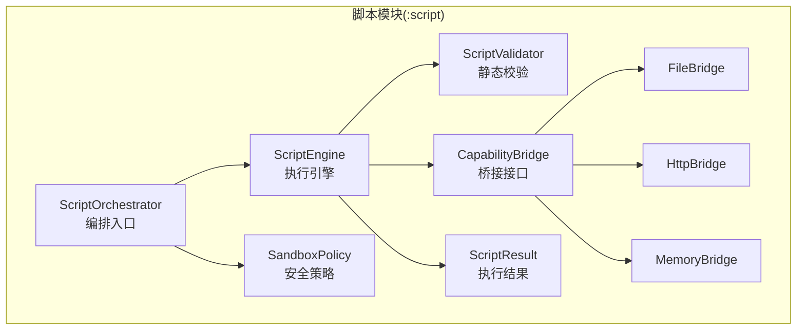
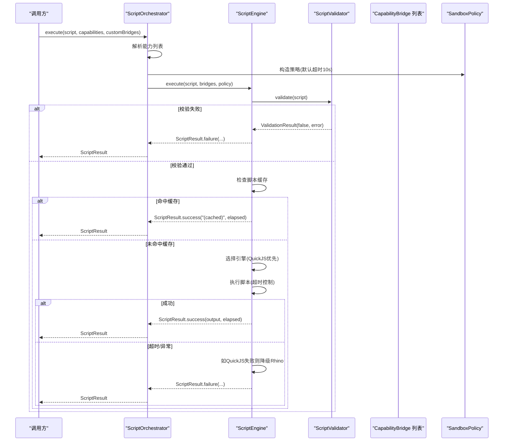
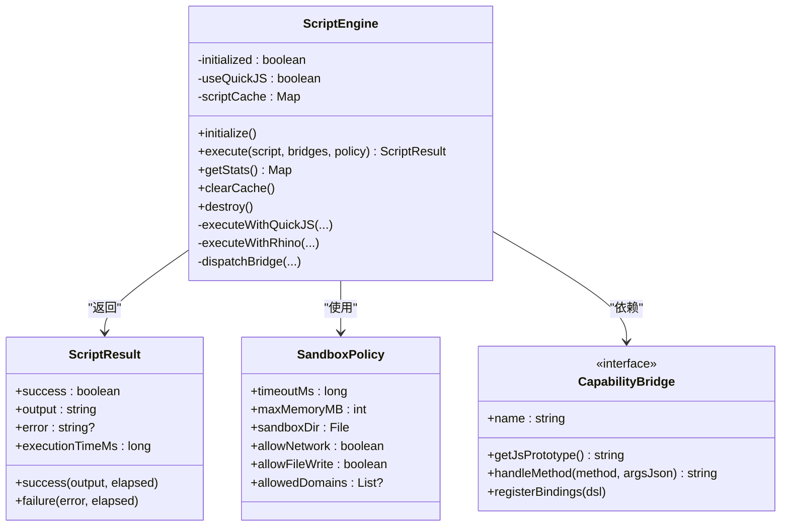
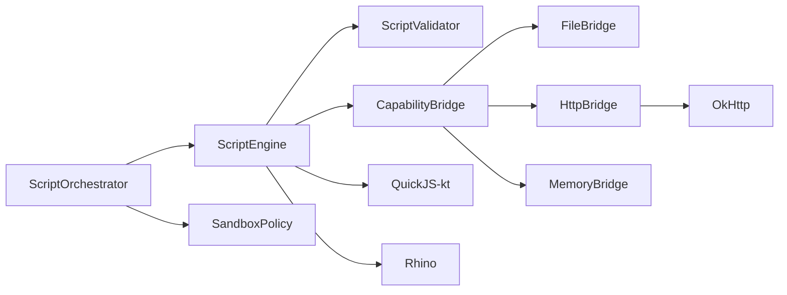

# 脚本执行引擎核心

<cite>
**本文引用的文件**
- [ScriptEngine.kt](file://script/src/main/java/ai/openclaw/script/ScriptEngine.kt)
- [ScriptOrchestrator.kt](file://script/src/main/java/ai/openclaw/script/ScriptOrchestrator.kt)
- [ScriptResult.kt](file://script/src/main/java/ai/openclaw/script/ScriptResult.kt)
- [SandboxPolicy.kt](file://script/src/main/java/ai/openclaw/script/SandboxPolicy.kt)
- [CapabilityBridge.kt](file://script/src/main/java/ai/openclaw/script/CapabilityBridge.kt)
- [FileBridge.kt](file://script/src/main/java/ai/openclaw/script/bridge/FileBridge.kt)
- [HttpBridge.kt](file://script/src/main/java/ai/openclaw/script/bridge/HttpBridge.kt)
- [MemoryBridge.kt](file://script/src/main/java/ai/openclaw/script/bridge/MemoryBridge.kt)
- [ScriptValidator.kt](file://script/src/main/java/ai/openclaw/script/ScriptValidator.kt)
- [ScriptEngineTest.kt](file://script/src/test/java/ai/openclaw/script/ScriptEngineTest.kt)
- [ScriptOrchestratorIntegrationTest.kt](file://script/src/test/java/ai/openclaw/script/ScriptOrchestratorIntegrationTest.kt)
- [ScriptSkill.kt](file://app/src/main/java/ai/openclaw/android/skill/builtin/ScriptSkill.kt)
- [script-engine.md](file://docs/script-engine.md)
</cite>

## 目录
1. [简介](#简介)
2. [项目结构](#项目结构)
3. [核心组件](#核心组件)
4. [架构总览](#架构总览)
5. [详细组件分析](#详细组件分析)
6. [依赖关系分析](#依赖关系分析)
7. [性能考量](#性能考量)
8. [故障排查指南](#故障排查指南)
9. [结论](#结论)
10. [附录](#附录)

## 简介
本文件为脚本执行引擎核心组件的详细API文档，聚焦于ScriptEngine类的初始化、执行流程与生命周期管理；详述execute方法的参数规范、返回值结构与异常处理机制；解释QuickJS与Rhino两种执行引擎的选择策略与降级机制；说明脚本缓存、性能统计与资源清理策略；并提供脚本执行的完整API使用示例（含错误处理与超时控制）、引擎配置选项、性能优化建议与最佳实践。

## 项目结构
脚本执行引擎位于独立的Android Library模块中，核心文件组织如下：
- 入口与编排：ScriptOrchestrator
- 执行引擎：ScriptEngine
- 结果模型：ScriptResult
- 安全策略：SandboxPolicy
- 能力桥接：CapabilityBridge及其具体实现（FileBridge、HttpBridge、MemoryBridge）
- 静态校验：ScriptValidator
- 文档与设计：docs/script-engine.md

图示来源
- [ScriptOrchestrator.kt:13-54](file://script/src/main/java/ai/openclaw/script/ScriptOrchestrator.kt#L13-L54)
- [ScriptEngine.kt:22-231](file://script/src/main/java/ai/openclaw/script/ScriptEngine.kt#L22-L231)
- [ScriptResult.kt:6-19](file://script/src/main/java/ai/openclaw/script/ScriptResult.kt#L6-L19)
- [SandboxPolicy.kt:8-15](file://script/src/main/java/ai/openclaw/script/SandboxPolicy.kt#L8-L15)
- [CapabilityBridge.kt:13-32](file://script/src/main/java/ai/openclaw/script/CapabilityBridge.kt#L13-L32)
- [FileBridge.kt:20-157](file://script/src/main/java/ai/openclaw/script/bridge/FileBridge.kt#L20-L157)
- [HttpBridge.kt:18-88](file://script/src/main/java/ai/openclaw/script/bridge/HttpBridge.kt#L18-L88)
- [MemoryBridge.kt:14-55](file://script/src/main/java/ai/openclaw/script/bridge/MemoryBridge.kt#L14-L55)
- [ScriptValidator.kt:8-60](file://script/src/main/java/ai/openclaw/script/ScriptValidator.kt#L8-L60)

章节来源
- [ScriptOrchestrator.kt:13-54](file://script/src/main/java/ai/openclaw/script/ScriptOrchestrator.kt#L13-L54)
- [ScriptEngine.kt:22-231](file://script/src/main/java/ai/openclaw/script/ScriptEngine.kt#L22-L231)
- [script-engine.md:36-51](file://docs/script-engine.md#L36-L51)

## 核心组件
- ScriptOrchestrator：负责创建沙箱目录、初始化ScriptEngine、解析能力列表并执行脚本。
- ScriptEngine：核心执行引擎，支持QuickJS与Rhino双引擎，内置脚本缓存、统计与降级机制。
- ScriptResult：封装执行结果（成功/失败、输出、错误信息、耗时）。
- SandboxPolicy：定义超时、内存、网络与文件写入等安全策略。
- CapabilityBridge及其实现：将Android能力暴露给JS，包括文件、HTTP、记忆与UI渲染等。
- ScriptValidator：执行前的静态安全校验。

章节来源
- [ScriptOrchestrator.kt:13-54](file://script/src/main/java/ai/openclaw/script/ScriptOrchestrator.kt#L13-L54)
- [ScriptEngine.kt:22-231](file://script/src/main/java/ai/openclaw/script/ScriptEngine.kt#L22-L231)
- [ScriptResult.kt:6-19](file://script/src/main/java/ai/openclaw/script/ScriptResult.kt#L6-L19)
- [SandboxPolicy.kt:8-15](file://script/src/main/java/ai/openclaw/script/SandboxPolicy.kt#L8-L15)
- [CapabilityBridge.kt:13-32](file://script/src/main/java/ai/openclaw/script/CapabilityBridge.kt#L13-L32)
- [ScriptValidator.kt:8-60](file://script/src/main/java/ai/openclaw/script/ScriptValidator.kt#L8-L60)

## 架构总览
下图展示了从调用方到执行引擎、桥接与沙箱的整体流程。

图示来源
- [ScriptOrchestrator.kt:31-39](file://script/src/main/java/ai/openclaw/script/ScriptOrchestrator.kt#L31-L39)
- [ScriptEngine.kt:45-99](file://script/src/main/java/ai/openclaw/script/ScriptEngine.kt#L45-L99)
- [ScriptValidator.kt:42-58](file://script/src/main/java/ai/openclaw/script/ScriptValidator.kt#L42-L58)

## 详细组件分析

### ScriptEngine 类
- 初始化与生命周期
  - initialize()：标记已初始化，当前实现为空操作。
  - destroy()：重置初始化状态，用于资源回收。
- 执行流程
  - execute(script, bridges, policy)：挂起函数，执行前进行静态校验，随后按策略选择引擎执行，并更新统计与缓存。
  - getStats()：返回总执行次数、成功/失败计数、平均耗时、缓存大小与当前活跃引擎。
  - clearCache()：清空脚本缓存。
- 引擎选择与降级
  - 默认使用QuickJS；若QuickJS抛出异常，则降级至Rhino，并在后续执行中继续使用Rhino。
- 超时控制
  - QuickJS：withTimeoutOrNull结合协程调度器实现超时。
  - Rhino：Future.get(timeout)实现超时。
- 缓存机制
  - 以脚本哈希作为键，缓存成功执行耗时；达到上限后不再新增缓存项。
- 性能统计
  - 统计总执行次数、成功/失败次数、总耗时；平均耗时由总耗时/成功次数计算。
- 资源清理
  - QuickJS：with作用域确保上下文释放。
  - Rhino：Context.exit()与线程池shutdownNow()确保资源回收。

图示来源
- [ScriptEngine.kt:22-231](file://script/src/main/java/ai/openclaw/script/ScriptEngine.kt#L22-L231)
- [ScriptResult.kt:6-19](file://script/src/main/java/ai/openclaw/script/ScriptResult.kt#L6-L19)
- [SandboxPolicy.kt:8-15](file://script/src/main/java/ai/openclaw/script/SandboxPolicy.kt#L8-L15)
- [CapabilityBridge.kt:13-32](file://script/src/main/java/ai/openclaw/script/CapabilityBridge.kt#L13-L32)

章节来源
- [ScriptEngine.kt:37-118](file://script/src/main/java/ai/openclaw/script/ScriptEngine.kt#L37-L118)
- [ScriptEngine.kt:120-225](file://script/src/main/java/ai/openclaw/script/ScriptEngine.kt#L120-L225)

### ScriptOrchestrator 类
- 职责
  - 创建沙箱目录（filesDir/script_sandbox），延迟初始化ScriptEngine。
  - 解析能力列表（fs/http/memory等），合并自定义桥接器。
  - 构造SandboxPolicy（默认超时10秒），调用ScriptEngine.execute执行。
- 能力解析规则
  - capabilities为空时，默认启用fs与http。
  - 支持"fs"/"file"、"http"/"network"等别名映射。
- 使用建议
  - 在应用层按需传入capabilities或自定义桥接器，避免不必要的能力暴露。

章节来源
- [ScriptOrchestrator.kt:13-54](file://script/src/main/java/ai/openclaw/script/ScriptOrchestrator.kt#L13-L54)

### ScriptResult 数据类
- 字段
  - success：执行是否成功
  - output：输出字符串
  - error：错误信息（可空）
  - executionTimeMs：执行耗时（毫秒）
- 工厂方法
  - success(output, elapsed)：构造成功结果
  - failure(error, elapsed)：构造失败结果

章节来源
- [ScriptResult.kt:6-19](file://script/src/main/java/ai/openclaw/script/ScriptResult.kt#L6-L19)

### SandboxPolicy 数据类
- 关键字段
  - timeoutMs：默认10000毫秒
  - maxMemoryMB：默认16MB
  - sandboxDir：沙箱根目录
  - allowNetwork：默认允许网络
  - allowFileWrite：默认允许文件写入
  - allowedDomains：允许访问的域名列表（可空）

章节来源
- [SandboxPolicy.kt:8-15](file://script/src/main/java/ai/openclaw/script/SandboxPolicy.kt#L8-L15)

### CapabilityBridge 接口与实现
- 接口职责
  - name：桥接器名称（如fs、http、memory、ui）
  - getJsPrototype()：返回Rhino模式下的JS原型代码
  - handleMethod()：Rhino模式下处理JS方法调用
  - registerBindings()：QuickJS模式下在DSL中注册函数
- 具体实现
  - FileBridge：文件读写、列出、存在性检查，严格限制在沙箱目录内。
  - HttpBridge：HTTP GET/POST，基于OkHttp客户端。
  - MemoryBridge：通过MemoryProvider回调实现记忆检索与存储。

章节来源
- [CapabilityBridge.kt:13-32](file://script/src/main/java/ai/openclaw/script/CapabilityBridge.kt#L13-L32)
- [FileBridge.kt:20-157](file://script/src/main/java/ai/openclaw/script/bridge/FileBridge.kt#L20-L157)
- [HttpBridge.kt:18-88](file://script/src/main/java/ai/openclaw/script/bridge/HttpBridge.kt#L18-L88)
- [MemoryBridge.kt:14-55](file://script/src/main/java/ai/openclaw/script/bridge/MemoryBridge.kt#L14-L55)

### ScriptValidator 静态校验
- 校验规则
  - 空脚本拒绝
  - 脚本长度上限（默认50KB）
  - 禁止导入/模块加载、eval/new Function、定时器、原型污染、访问java/android/Packages、系统对象等
- 返回值
  - ValidationResult(isValid, error?)

章节来源
- [ScriptValidator.kt:8-60](file://script/src/main/java/ai/openclaw/script/ScriptValidator.kt#L8-L60)

## 依赖关系分析
- 组件耦合
  - ScriptOrchestrator依赖ScriptEngine与SandboxPolicy，负责编排与能力解析。
  - ScriptEngine依赖ScriptValidator、Bridge实现与SandboxPolicy，负责执行与降级。
  - Bridge实现依赖外部库（如OkHttp）与Android上下文（FileBridge）。
- 外部依赖
  - QuickJS-kt：用于QuickJS引擎绑定与DSL注册。
  - Rhino：作为备用引擎。
  - OkHttp：HttpBridge网络请求。
  - Kotlin协程：异步与超时控制。

图示来源
- [ScriptOrchestrator.kt:20-22](file://script/src/main/java/ai/openclaw/script/ScriptOrchestrator.kt#L20-L22)
- [ScriptEngine.kt:7-12](file://script/src/main/java/ai/openclaw/script/ScriptEngine.kt#L7-L12)
- [HttpBridge.kt:6-45](file://script/src/main/java/ai/openclaw/script/bridge/HttpBridge.kt#L6-L45)

章节来源
- [ScriptEngine.kt:7-12](file://script/src/main/java/ai/openclaw/script/ScriptEngine.kt#L7-L12)
- [HttpBridge.kt:6-45](file://script/src/main/java/ai/openclaw/script/bridge/HttpBridge.kt#L6-L45)
- [script-engine.md:237-246](file://docs/script-engine.md#L237-L246)

## 性能考量
- 引擎选择
  - QuickJS优先，性能显著优于Rhino；当QuickJS首次失败时自动降级至Rhino并持久化切换。
- 超时控制
  - 默认超时10秒；可通过SandboxPolicy调整。
- 缓存策略
  - 成功执行耗时缓存，命中则直接返回缓存结果，减少重复开销。
- 内存限制
  - Rhino模式下通过Context.optimizationLevel=-1降低优化以稳定内存占用。
- 并发与资源
  - QuickJS使用协程调度器与withTimeoutOrNull；Rhino使用单线程执行器与Future超时。
- 最佳实践
  - 为复杂脚本设置合理超时；对重复执行的脚本利用缓存；仅开启必要能力；避免大脚本与阻塞操作。

[本节为通用性能指导，无需特定文件引用]

## 故障排查指南
- 常见问题与定位
  - 超时：检查SandboxPolicy.timeoutMs；确认脚本是否存在死循环或阻塞I/O。
  - 静态校验失败：检查脚本是否包含被禁用的关键字或模式。
  - 引擎降级：QuickJS异常会触发降级；观察日志中的降级提示。
  - Bridge调用失败：确认JS侧调用方法名与参数格式正确；检查沙箱目录权限与路径。
- 日志与诊断
  - ScriptEngine内部记录降级警告；通过getStats()获取执行统计辅助诊断。
- 测试参考
  - 集成测试覆盖了基础执行、超时、非法脚本与Bridge调用场景；可据此对照排查。

章节来源
- [ScriptEngine.kt:88-98](file://script/src/main/java/ai/openclaw/script/ScriptEngine.kt#L88-L98)
- [ScriptEngineTest.kt:121-129](file://script/src/test/java/ai/openclaw/script/ScriptEngineTest.kt#L121-L129)
- [ScriptOrchestratorIntegrationTest.kt:177-191](file://script/src/test/java/ai/openclaw/script/ScriptOrchestratorIntegrationTest.kt#L177-L191)

## 结论
ScriptEngine提供了高安全性的动态脚本执行能力，具备快速失败与降级机制、完善的统计与缓存策略。通过ScriptOrchestrator统一编排，开发者可灵活地按需启用能力并安全地执行JS脚本。配合SandboxPolicy与ScriptValidator，系统在易用性与安全性之间取得良好平衡。

[本节为总结性内容，无需特定文件引用]

## 附录

### API 使用示例（含错误处理与超时控制）
以下示例展示如何在应用中使用脚本执行引擎（以ScriptSkill为例）：

- 步骤
  - 创建ScriptOrchestrator（传入ApplicationContext）
  - 准备脚本与能力列表（如fs、http、memory）
  - 可选：构建MemoryBridge（通过MemoryProvider回调）
  - 调用execute(script, capabilities, customBridges)
  - 处理ScriptResult（success、output、error、executionTimeMs）
  - 超时：根据SandboxPolicy.timeoutMs设置合理的超时时间

- 示例路径
  - [ScriptSkill.kt:72-87](file://app/src/main/java/ai/openclaw/android/skill/builtin/ScriptSkill.kt#L72-L87)
  - [ScriptOrchestrator.kt:31-39](file://script/src/main/java/ai/openclaw/script/ScriptOrchestrator.kt#L31-L39)
  - [ScriptEngineTest.kt:26-72](file://script/src/test/java/ai/openclaw/script/ScriptEngineTest.kt#L26-L72)
  - [ScriptOrchestratorIntegrationTest.kt:42-83](file://script/src/test/java/ai/openclaw/script/ScriptOrchestratorIntegrationTest.kt#L42-L83)

章节来源
- [ScriptSkill.kt:72-87](file://app/src/main/java/ai/openclaw/android/skill/builtin/ScriptSkill.kt#L72-L87)
- [ScriptOrchestrator.kt:31-39](file://script/src/main/java/ai/openclaw/script/ScriptOrchestrator.kt#L31-L39)
- [ScriptEngineTest.kt:26-72](file://script/src/test/java/ai/openclaw/script/ScriptEngineTest.kt#L26-L72)
- [ScriptOrchestratorIntegrationTest.kt:42-83](file://script/src/test/java/ai/openclaw/script/ScriptOrchestratorIntegrationTest.kt#L42-L83)

### 引擎配置选项与参数规范
- execute(script, bridges, policy)
  - script：待执行的JavaScript代码
  - bridges：能力桥接器列表（如FileBridge、HttpBridge、MemoryBridge）
  - policy：SandboxPolicy（超时、沙箱目录、网络/文件写入权限等）
- SandboxPolicy默认值
  - timeoutMs：10000
  - maxMemoryMB：16
  - allowNetwork：true
  - allowFileWrite：true
  - allowedDomains：null

章节来源
- [ScriptEngine.kt:45-49](file://script/src/main/java/ai/openclaw/script/ScriptEngine.kt#L45-L49)
- [SandboxPolicy.kt:8-15](file://script/src/main/java/ai/openclaw/script/SandboxPolicy.kt#L8-L15)

### 返回值结构与异常处理
- ScriptResult
  - success：布尔，表示执行是否成功
  - output：字符串，通常为JS执行结果的字符串化
  - error：字符串或null，失败原因
  - executionTimeMs：long，执行耗时（毫秒）
- 异常处理机制
  - 静态校验失败：立即返回失败结果
  - 超时：返回失败并包含超时信息
  - QuickJS异常：记录降级日志并切换到Rhino继续执行
  - Rhino异常：返回失败结果并包含错误信息

章节来源
- [ScriptResult.kt:6-19](file://script/src/main/java/ai/openclaw/script/ScriptResult.kt#L6-L19)
- [ScriptEngine.kt:61-98](file://script/src/main/java/ai/openclaw/script/ScriptEngine.kt#L61-L98)

### 能力桥接API参考
- 文件能力（fs）
  - readFile(path)、writeFile(path, content)、list(dir)、exists(path)
  - 严格限制在沙箱目录内，防止路径穿越
- HTTP能力（http）
  - get(url)、post(url, body)
  - 基于OkHttp实现
- 记忆能力（memory）
  - recall(query, limit)、store(content)
  - 通过MemoryProvider回调实现

章节来源
- [FileBridge.kt:12-17](file://script/src/main/java/ai/openclaw/script/bridge/FileBridge.kt#L12-L17)
- [HttpBridge.kt:14-17](file://script/src/main/java/ai/openclaw/script/bridge/HttpBridge.kt#L14-L17)
- [MemoryBridge.kt:8-13](file://script/src/main/java/ai/openclaw/script/bridge/MemoryBridge.kt#L8-L13)

### 性能优化建议与最佳实践
- 优先使用QuickJS，确保脚本简洁、无阻塞I/O
- 合理设置超时，避免长时间运行的脚本
- 仅启用必要的能力，减少Bridge数量
- 对重复执行的脚本利用缓存机制
- 使用静态校验避免潜在危险模式
- 在Rhino模式下注意内存占用与优化级别

章节来源
- [script-engine.md:245-246](file://docs/script-engine.md#L245-L246)
- [ScriptEngine.kt:34-35](file://script/src/main/java/ai/openclaw/script/ScriptEngine.kt#L34-L35)