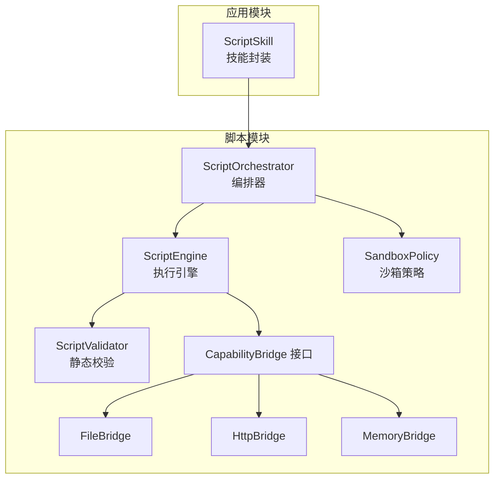
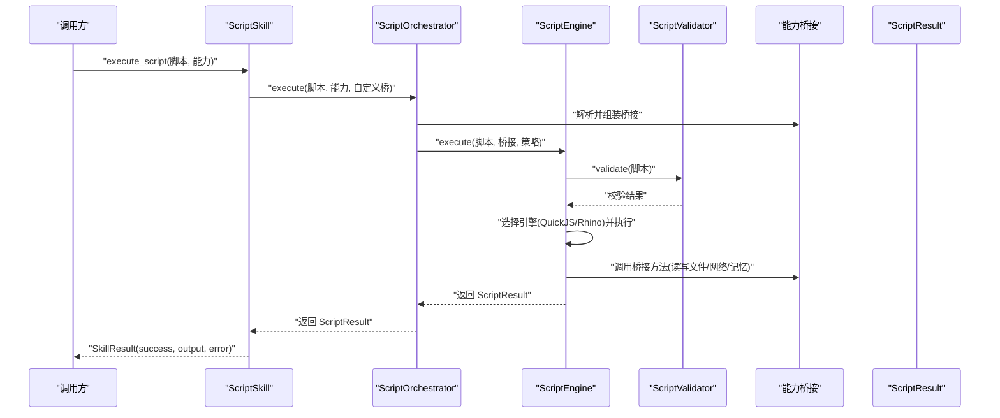
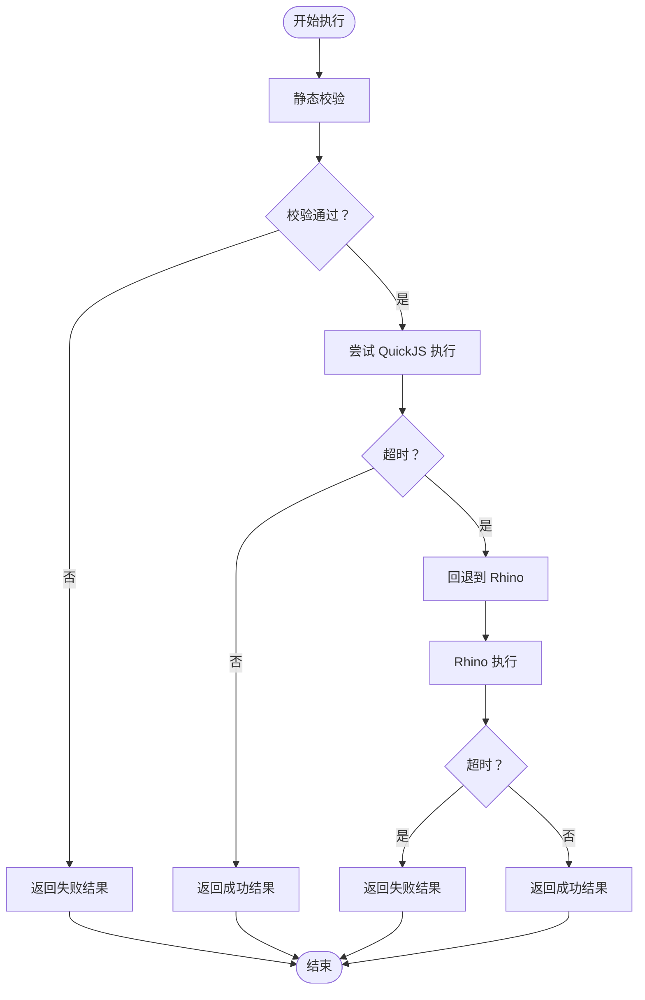
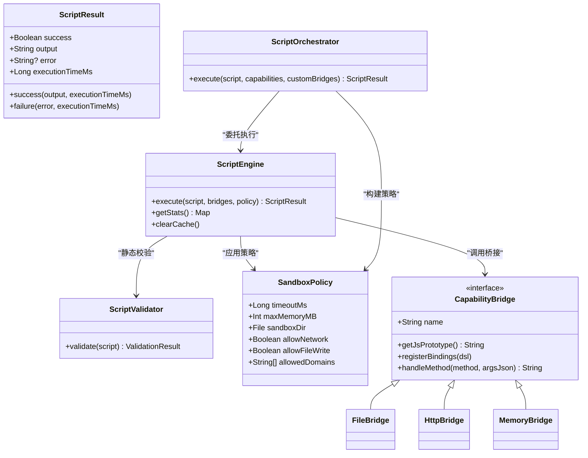

# 脚本执行结果

<cite>
**本文引用的文件**
- [ScriptResult.kt](file://script/src/main/java/ai/openclaw/script/ScriptResult.kt)
- [ScriptResultTest.kt](file://script/src/test/java/ai/openclaw/script/ScriptResultTest.kt)
- [ScriptEngine.kt](file://script/src/main/java/ai/openclaw/script/ScriptEngine.kt)
- [ScriptOrchestrator.kt](file://script/src/main/java/ai/openclaw/script/ScriptOrchestrator.kt)
- [SandboxPolicy.kt](file://script/src/main/java/ai/openclaw/script/SandboxPolicy.kt)
- [ScriptValidator.kt](file://script/src/main/java/ai/openclaw/script/ScriptValidator.kt)
- [CapabilityBridge.kt](file://script/src/main/java/ai/openclaw/script/CapabilityBridge.kt)
- [FileBridge.kt](file://script/src/main/java/ai/openclaw/script/bridge/FileBridge.kt)
- [HttpBridge.kt](file://script/src/main/java/ai/openclaw/script/bridge/HttpBridge.kt)
- [MemoryBridge.kt](file://script/src/main/java/ai/openclaw/script/bridge/MemoryBridge.kt)
- [ScriptSkill.kt](file://app/src/main/java/ai/openclaw/android/skill/builtin/ScriptSkill.kt)
- [ScriptSkillQuickJsTest.kt](file://app/src/test/java/ai/openclaw/android/skill/builtin/ScriptSkillQuickJsTest.kt)
- [ScriptSkillMemoryTest.kt](file://app/src/test/java/ai/openclaw/android/skill/builtin/ScriptSkillMemoryTest.kt)
</cite>

## 目录
1. [简介](#简介)
2. [项目结构](#项目结构)
3. [核心组件](#核心组件)
4. [架构总览](#架构总览)
5. [详细组件分析](#详细组件分析)
6. [依赖关系分析](#依赖关系分析)
7. [性能考量](#性能考量)
8. [故障排查指南](#故障排查指南)
9. [结论](#结论)
10. [附录](#附录)

## 简介
本文件面向“脚本执行结果”的API设计与使用，围绕 ScriptResult 的数据结构、状态标识与结果封装机制展开，详细说明：
- 成功结果的输出格式与执行耗时统计
- 错误结果的错误码与错误信息结构
- 结果序列化、反序列化与跨进程传递方式
- 结果处理最佳实践、错误恢复策略与调试信息提取
- 结果类型的扩展方式、自定义字段添加与兼容性保证
- 与上层系统的集成接口与结果消费模式

## 项目结构
脚本执行链路由 Orchestrator 负责编排，Engine 负责执行，Bridge 提供能力桥接，最终统一以 ScriptResult 封装返回。

图表来源
- [ScriptOrchestrator.kt:31-39](file://script/src/main/java/ai/openclaw/script/ScriptOrchestrator.kt#L31-L39)
- [ScriptEngine.kt:45-99](file://script/src/main/java/ai/openclaw/script/ScriptEngine.kt#L45-L99)
- [ScriptValidator.kt:42-58](file://script/src/main/java/ai/openclaw/script/ScriptValidator.kt#L42-L58)
- [SandboxPolicy.kt:8-15](file://script/src/main/java/ai/openclaw/script/SandboxPolicy.kt#L8-L15)
- [CapabilityBridge.kt:13-32](file://script/src/main/java/ai/openclaw/script/CapabilityBridge.kt#L13-L32)
- [FileBridge.kt:20-51](file://script/src/main/java/ai/openclaw/script/bridge/FileBridge.kt#L20-L51)
- [HttpBridge.kt:18-38](file://script/src/main/java/ai/openclaw/script/bridge/HttpBridge.kt#L18-L38)
- [MemoryBridge.kt:14-23](file://script/src/main/java/ai/openclaw/script/bridge/MemoryBridge.kt#L14-L23)
- [ScriptSkill.kt:64-87](file://app/src/main/java/ai/openclaw/android/skill/builtin/ScriptSkill.kt#L64-L87)

章节来源
- [ScriptOrchestrator.kt:13-54](file://script/src/main/java/ai/openclaw/script/ScriptOrchestrator.kt#L13-L54)
- [ScriptEngine.kt:22-99](file://script/src/main/java/ai/openclaw/script/ScriptEngine.kt#L22-L99)
- [ScriptResult.kt:6-18](file://script/src/main/java/ai/openclaw/script/ScriptResult.kt#L6-L18)

## 核心组件
- ScriptResult：统一的结果载体，包含成功标志、输出文本、错误信息与执行耗时。
- ScriptEngine：负责脚本执行、超时控制、引擎回退、统计与缓存。
- ScriptOrchestrator：负责能力桥接解析、沙箱策略构建与执行入口。
- ScriptValidator：静态校验，阻断危险模式与过大脚本。
- SandboxPolicy：沙箱策略配置（超时、内存、网络、文件写入等）。
- CapabilityBridge 及其实现：文件、HTTP、记忆系统等能力桥接。
- ScriptSkill：将脚本能力接入技能体系，消费 ScriptResult 并转换为 SkillResult。

章节来源
- [ScriptResult.kt:6-18](file://script/src/main/java/ai/openclaw/script/ScriptResult.kt#L6-L18)
- [ScriptEngine.kt:45-99](file://script/src/main/java/ai/openclaw/script/ScriptEngine.kt#L45-L99)
- [ScriptOrchestrator.kt:31-39](file://script/src/main/java/ai/openclaw/script/ScriptOrchestrator.kt#L31-L39)
- [ScriptValidator.kt:42-58](file://script/src/main/java/ai/openclaw/script/ScriptValidator.kt#L42-L58)
- [SandboxPolicy.kt:8-15](file://script/src/main/java/ai/openclaw/script/SandboxPolicy.kt#L8-L15)
- [CapabilityBridge.kt:13-32](file://script/src/main/java/ai/openclaw/script/CapabilityBridge.kt#L13-L32)
- [ScriptSkill.kt:72-87](file://app/src/main/java/ai/openclaw/android/skill/builtin/ScriptSkill.kt#L72-L87)

## 架构总览
下图展示一次脚本执行从上层调用到结果返回的关键流程。

图表来源
- [ScriptSkill.kt:72-87](file://app/src/main/java/ai/openclaw/android/skill/builtin/ScriptSkill.kt#L72-L87)
- [ScriptOrchestrator.kt:31-39](file://script/src/main/java/ai/openclaw/script/ScriptOrchestrator.kt#L31-L39)
- [ScriptEngine.kt:45-99](file://script/src/main/java/ai/openclaw/script/ScriptEngine.kt#L45-L99)
- [ScriptValidator.kt:42-58](file://script/src/main/java/ai/openclaw/script/ScriptValidator.kt#L42-L58)
- [FileBridge.kt:68-80](file://script/src/main/java/ai/openclaw/script/bridge/FileBridge.kt#L68-L80)
- [HttpBridge.kt:54-64](file://script/src/main/java/ai/openclaw/script/bridge/HttpBridge.kt#L54-L64)
- [MemoryBridge.kt:25-48](file://script/src/main/java/ai/openclaw/script/bridge/MemoryBridge.kt#L25-L48)

## 详细组件分析

### ScriptResult 数据结构与状态标识
- 字段
  - success: 布尔值，表示执行是否成功
  - output: 字符串，成功时为脚本输出；失败时通常为空或占位
  - error: 字符串或空，失败时携带错误信息；成功时为空
  - executionTimeMs: 长整型，执行耗时（毫秒）
- 工厂方法
  - success(output, executionTimeMs): 快速构造成功结果
  - failure(error, executionTimeMs): 快速构造失败结果
- 测试验证
  - 成功工厂与默认耗时
  - 失败工厂与默认耗时
  - 成功无错误、失败空输出

章节来源
- [ScriptResult.kt:6-18](file://script/src/main/java/ai/openclaw/script/ScriptResult.kt#L6-L18)
- [ScriptResultTest.kt:7-18](file://script/src/test/java/ai/openclaw/script/ScriptResultTest.kt#L7-L18)

### 成功结果输出格式
- 输出内容为脚本执行的最终值转字符串形式
- 执行耗时来自引擎计时，包含缓存命中路径
- 缓存命中时会返回占位输出并记录历史耗时

章节来源
- [ScriptEngine.kt:53-59](file://script/src/main/java/ai/openclaw/script/ScriptEngine.kt#L53-L59)
- [ScriptEngine.kt:126-141](file://script/src/main/java/ai/openclaw/script/ScriptEngine.kt#L126-L141)

### 错误结果结构与错误码
- 错误来源
  - 校验失败：包含“脚本不能为空”“脚本过长”“包含禁止模式”等
  - 执行超时：QuickJS 或 Rhino 超时
  - 引擎异常：QuickJS 失败回退 Rhino，或两者均失败
  - 桥接错误：未知桥或方法、路径越界、文件不存在、网络请求异常、记忆系统异常等
- 错误信息格式
  - 字符串，包含上下文（如“Timeout (10000ms)”“Rhino: ...”“Bridge not found: ...”）
  - 失败时 output 通常为空字符串

章节来源
- [ScriptEngine.kt:62-66](file://script/src/main/java/ai/openclaw/script/ScriptEngine.kt#L62-L66)
- [ScriptEngine.kt:126-141](file://script/src/main/java/ai/openclaw/script/ScriptEngine.kt#L126-L141)
- [ScriptEngine.kt:199-208](file://script/src/main/java/ai/openclaw/script/ScriptEngine.kt#L199-L208)
- [ScriptEngine.kt:91-97](file://script/src/main/java/ai/openclaw/script/ScriptEngine.kt#L91-L97)
- [ScriptValidator.kt:42-58](file://script/src/main/java/ai/openclaw/script/ScriptValidator.kt#L42-L58)
- [FileBridge.kt:88-119](file://script/src/main/java/ai/openclaw/script/bridge/FileBridge.kt#L88-L119)
- [HttpBridge.kt:66-86](file://script/src/main/java/ai/openclaw/script/bridge/HttpBridge.kt#L66-L86)
- [MemoryBridge.kt:25-48](file://script/src/main/java/ai/openclaw/script/bridge/MemoryBridge.kt#L25-L48)

### 结果封装与跨进程传递
- 封装机制
  - ScriptResult 为纯数据类，包含基本类型与字符串，便于序列化
  - 上层 Skill 将 ScriptResult 映射为 SkillResult，统一对外暴露
- 序列化/反序列化
  - Kotlin data class 支持标准序列化（如 Kotlinx Serialization），可直接序列化为 JSON
  - 跨进程传递建议采用 JSON 文本或 Parcelable（若需 Android 进程间通信）
- 传递路径
  - 引擎层返回 ScriptResult
  - Orchestrator 返回 ScriptResult
  - Skill 层消费 ScriptResult 并返回 SkillResult

章节来源
- [ScriptResult.kt:6-18](file://script/src/main/java/ai/openclaw/script/ScriptResult.kt#L6-L18)
- [ScriptSkill.kt:82-87](file://app/src/main/java/ai/openclaw/android/skill/builtin/ScriptSkill.kt#L82-L87)

### 执行流程与决策逻辑

图表来源
- [ScriptEngine.kt:61-66](file://script/src/main/java/ai/openclaw/script/ScriptEngine.kt#L61-L66)
- [ScriptEngine.kt:126-141](file://script/src/main/java/ai/openclaw/script/ScriptEngine.kt#L126-L141)
- [ScriptEngine.kt:144-209](file://script/src/main/java/ai/openclaw/script/ScriptEngine.kt#L144-L209)

### 能力桥接与结果影响
- 文件能力（fs）
  - 支持读取、写入、列出、存在性检查
  - 所有操作限制在沙箱目录内，防止路径越界
- 网络能力（http）
  - 支持 GET/POST，返回状态码与响应体
- 记忆能力（memory）
  - 支持 recall/store，通过 MemoryProvider 回调注入实际能力
- 桥接调用
  - QuickJS 模式：通过 DSL 注册函数，内部统一调用 handle
  - Rhino 模式：通过原型与 __nativeCall 分发

章节来源
- [FileBridge.kt:20-51](file://script/src/main/java/ai/openclaw/script/bridge/FileBridge.kt#L20-L51)
- [FileBridge.kt:68-119](file://script/src/main/java/ai/openclaw/script/bridge/FileBridge.kt#L68-L119)
- [HttpBridge.kt:18-38](file://script/src/main/java/ai/openclaw/script/bridge/HttpBridge.kt#L18-L38)
- [HttpBridge.kt:54-86](file://script/src/main/java/ai/openclaw/script/bridge/HttpBridge.kt#L54-L86)
- [MemoryBridge.kt:14-48](file://script/src/main/java/ai/openclaw/script/bridge/MemoryBridge.kt#L14-L48)
- [CapabilityBridge.kt:13-32](file://script/src/main/java/ai/openclaw/script/CapabilityBridge.kt#L13-L32)

### 与上层系统的集成与消费模式
- ScriptSkill
  - 暴露 execute_script 工具，参数包括 script 与 capabilities
  - 初始化时创建 ScriptOrchestrator，执行后将 ScriptResult 映射为 SkillResult
- 测试验证
  - 集成测试覆盖了 QuickJS 引擎与 Memory 能力的联合使用
  - 验证未初始化时的错误返回与参数缺失的错误处理

章节来源
- [ScriptSkill.kt:64-87](file://app/src/main/java/ai/openclaw/android/skill/builtin/ScriptSkill.kt#L64-L87)
- [ScriptSkillQuickJsTest.kt:42-60](file://app/src/test/java/ai/openclaw/android/skill/builtin/ScriptSkillQuickJsTest.kt#L42-L60)
- [ScriptSkillMemoryTest.kt:58-81](file://app/src/test/java/ai/openclaw/android/skill/builtin/ScriptSkillMemoryTest.kt#L58-L81)

## 依赖关系分析

图表来源
- [ScriptResult.kt:6-18](file://script/src/main/java/ai/openclaw/script/ScriptResult.kt#L6-L18)
- [ScriptEngine.kt:45-99](file://script/src/main/java/ai/openclaw/script/ScriptEngine.kt#L45-L99)
- [ScriptOrchestrator.kt:31-39](file://script/src/main/java/ai/openclaw/script/ScriptOrchestrator.kt#L31-L39)
- [ScriptValidator.kt:42-58](file://script/src/main/java/ai/openclaw/script/ScriptValidator.kt#L42-L58)
- [SandboxPolicy.kt:8-15](file://script/src/main/java/ai/openclaw/script/SandboxPolicy.kt#L8-L15)
- [CapabilityBridge.kt:13-32](file://script/src/main/java/ai/openclaw/script/CapabilityBridge.kt#L13-L32)
- [FileBridge.kt:20-51](file://script/src/main/java/ai/openclaw/script/bridge/FileBridge.kt#L20-L51)
- [HttpBridge.kt:18-38](file://script/src/main/java/ai/openclaw/script/bridge/HttpBridge.kt#L18-L38)
- [MemoryBridge.kt:14-23](file://script/src/main/java/ai/openclaw/script/bridge/MemoryBridge.kt#L14-L23)

## 性能考量
- 执行统计
  - totalExecutions、successCount、failureCount、totalElapsedMs、平均耗时、缓存大小、当前活跃引擎
- 缓存策略
  - 以脚本哈希为键缓存成功执行耗时，命中则快速返回占位结果并累加统计
- 超时与回退
  - 默认超时 10 秒；QuickJS 失败自动回退 Rhino，并记录日志
- 资源限制
  - 沙箱策略控制网络与文件写入权限，限制脚本大小与内存占用

章节来源
- [ScriptEngine.kt:27-35](file://script/src/main/java/ai/openclaw/script/ScriptEngine.kt#L27-L35)
- [ScriptEngine.kt:104-111](file://script/src/main/java/ai/openclaw/script/ScriptEngine.kt#L104-L111)
- [ScriptEngine.kt:53-59](file://script/src/main/java/ai/openclaw/script/ScriptEngine.kt#L53-L59)
- [ScriptEngine.kt:91-97](file://script/src/main/java/ai/openclaw/script/ScriptEngine.kt#L91-L97)
- [SandboxPolicy.kt:8-15](file://script/src/main/java/ai/openclaw/script/SandboxPolicy.kt#L8-L15)

## 故障排查指南
- 常见错误与定位
  - 校验失败：检查脚本长度与是否包含被禁模式
  - 超时：确认脚本复杂度与外部依赖（网络/IO）耗时
  - 引擎异常：查看日志中的回退提示与异常消息
  - 桥接错误：核对方法名、参数 JSON、沙箱路径与目标资源是否存在
- 调试建议
  - 开启引擎统计，观察平均耗时与缓存命中率
  - 在桥接层打印传入参数与返回值，定位具体调用点
  - 对于网络请求，检查域名白名单与超时设置
- 上层消费
  - Skill 层将 ScriptResult 映射为 SkillResult，统一处理 success/error/output

章节来源
- [ScriptEngine.kt:88-98](file://script/src/main/java/ai/openclaw/script/ScriptEngine.kt#L88-L98)
- [ScriptEngine.kt:199-208](file://script/src/main/java/ai/openclaw/script/ScriptEngine.kt#L199-L208)
- [FileBridge.kt:88-119](file://script/src/main/java/ai/openclaw/script/bridge/FileBridge.kt#L88-L119)
- [HttpBridge.kt:66-86](file://script/src/main/java/ai/openclaw/script/bridge/HttpBridge.kt#L66-L86)
- [ScriptSkill.kt:82-87](file://app/src/main/java/ai/openclaw/android/skill/builtin/ScriptSkill.kt#L82-L87)

## 结论
ScriptResult 作为脚本执行结果的统一载体，提供了简洁、可序列化的数据结构与明确的状态标识。结合 ScriptEngine 的执行统计、缓存与回退机制，以及 ScriptOrchestrator 的能力桥接与沙箱策略，形成了稳定、可扩展且易于调试的脚本执行体系。上层系统可通过 SkillResult 统一消费结果，实现与业务逻辑的解耦。

## 附录

### API 定义与字段说明
- ScriptResult
  - 字段
    - success: 布尔，执行成功标志
    - output: 字符串，成功时为脚本输出，失败时为空或占位
    - error: 字符串或空，失败时的错误信息
    - executionTimeMs: 长整型，执行耗时（毫秒）
  - 工厂方法
    - success(output, executionTimeMs)
    - failure(error, executionTimeMs)

章节来源
- [ScriptResult.kt:6-18](file://script/src/main/java/ai/openclaw/script/ScriptResult.kt#L6-L18)

### 结果序列化与跨进程传递建议
- 序列化
  - 使用 Kotlinx Serialization 或 JSON 库将 ScriptResult 序列化为 JSON 文本
- 跨进程传递
  - 通过 IPC 通道传递 JSON 文本；接收端反序列化为 ScriptResult
  - 注意字段命名与类型一致性，确保向后兼容

章节来源
- [ScriptResult.kt:6-18](file://script/src/main/java/ai/openclaw/script/ScriptResult.kt#L6-L18)

### 结果类型扩展与兼容性
- 扩展方式
  - 新增能力桥接：实现 CapabilityBridge 接口，注册到 Orchestrator
  - 自定义字段：在上层映射（如 SkillResult）中扩展字段，保持 ScriptResult 不变以保证兼容
- 兼容性保证
  - 保持 ScriptResult 字段不变，避免破坏上层解析
  - 新增能力通过 capabilities 参数显式启用，避免默认开启造成破坏性变更

章节来源
- [CapabilityBridge.kt:13-32](file://script/src/main/java/ai/openclaw/script/CapabilityBridge.kt#L13-L32)
- [ScriptOrchestrator.kt:41-53](file://script/src/main/java/ai/openclaw/script/ScriptOrchestrator.kt#L41-L53)