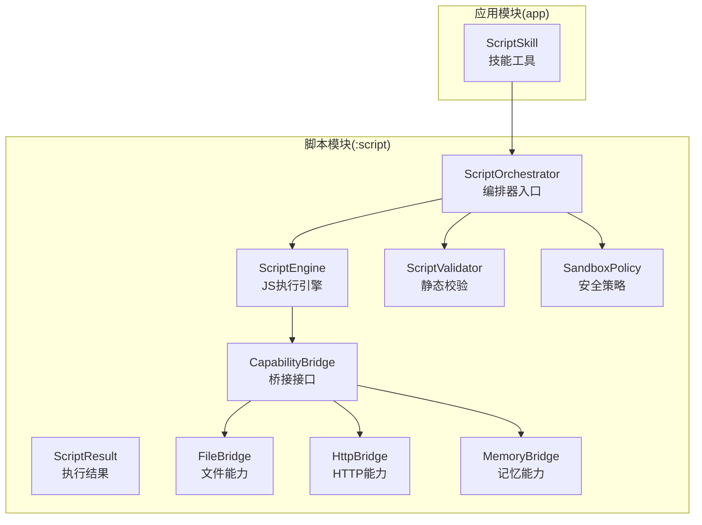
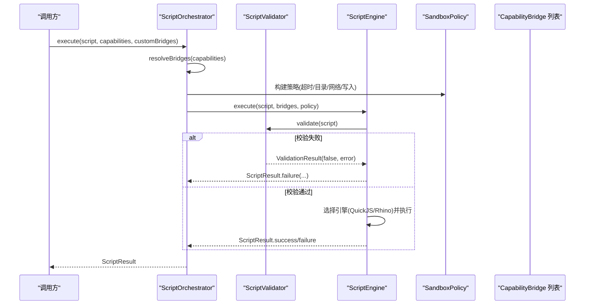
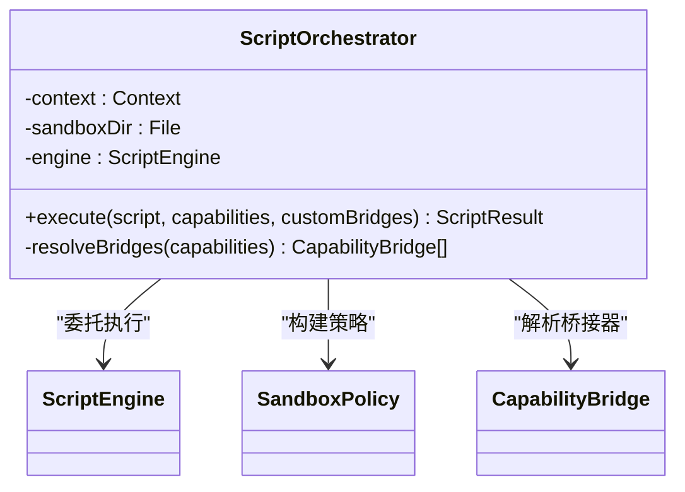
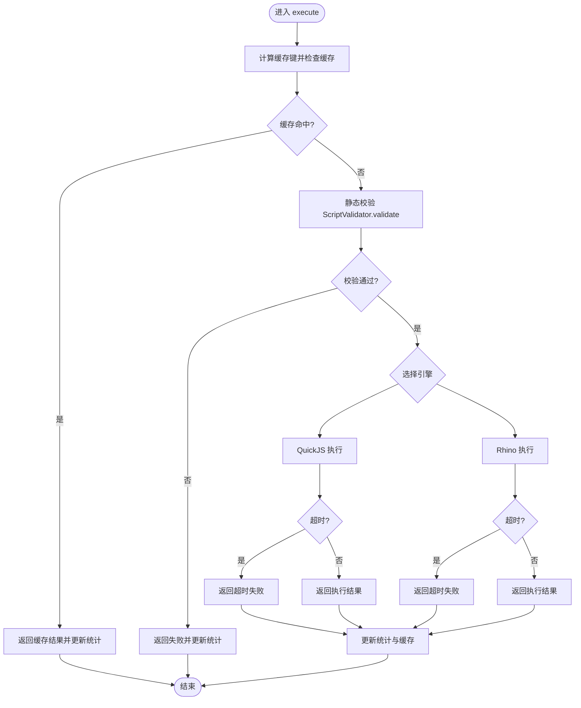
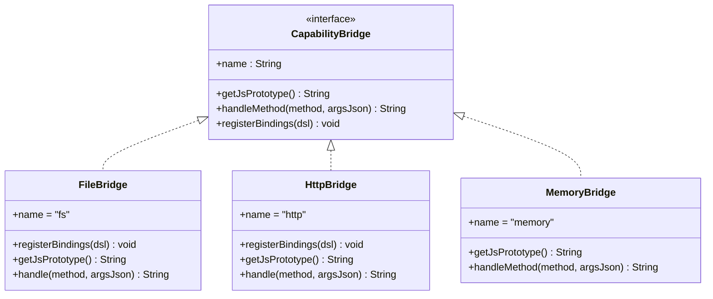
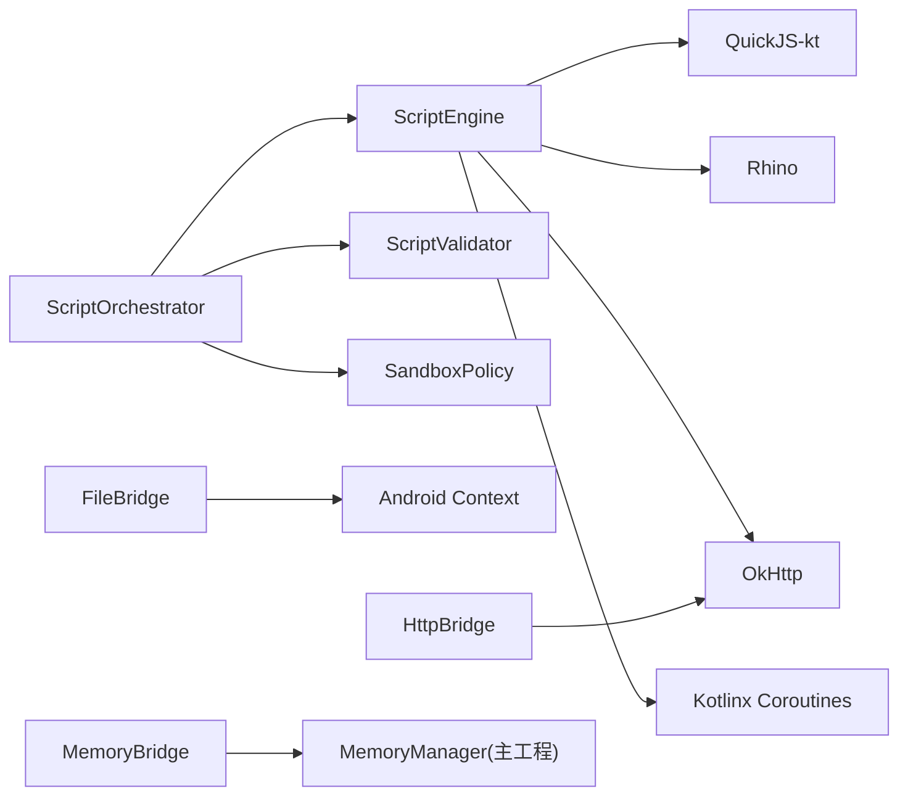

# 脚本编排器

<cite>
**本文引用的文件**
- [ScriptOrchestrator.kt](file://script/src/main/java/ai/openclaw/script/ScriptOrchestrator.kt)
- [ScriptEngine.kt](file://script/src/main/java/ai/openclaw/script/ScriptEngine.kt)
- [ScriptResult.kt](file://script/src/main/java/ai/openclaw/script/ScriptResult.kt)
- [ScriptValidator.kt](file://script/src/main/java/ai/openclaw/script/ScriptValidator.kt)
- [SandboxPolicy.kt](file://script/src/main/java/ai/openclaw/script/SandboxPolicy.kt)
- [CapabilityBridge.kt](file://script/src/main/java/ai/openclaw/script/CapabilityBridge.kt)
- [FileBridge.kt](file://script/src/main/java/ai/openclaw/script/bridge/FileBridge.kt)
- [HttpBridge.kt](file://script/src/main/java/ai/openclaw/script/bridge/HttpBridge.kt)
- [MemoryBridge.kt](file://script/src/main/java/ai/openclaw/script/bridge/MemoryBridge.kt)
- [ScriptSkill.kt](file://app/src/main/java/ai/openclaw/android/skill/builtin/ScriptSkill.kt)
- [ScriptOrchestratorIntegrationTest.kt](file://script/src/test/java/ai/openclaw/script/ScriptOrchestratorIntegrationTest.kt)
- [ScriptEngineTest.kt](file://script/src/test/java/ai/openclaw/script/ScriptEngineTest.kt)
- [script-engine.md](file://docs/script-engine.md)
- [design-weather-script-sandbox.md](file://docs/design-weather-script-sandbox.md)
</cite>

## 目录
1. [简介](#简介)
2. [项目结构](#项目结构)
3. [核心组件](#核心组件)
4. [架构总览](#架构总览)
5. [详细组件分析](#详细组件分析)
6. [依赖关系分析](#依赖关系分析)
7. [性能考量](#性能考量)
8. [故障排除指南](#故障排除指南)
9. [结论](#结论)
10. [附录](#附录)

## 简介
本文件为脚本编排器的详细API文档，聚焦于 ScriptOrchestrator 的调度机制、任务队列管理与并发控制策略；阐述脚本生命周期管理、状态跟踪与错误恢复机制；解释脚本依赖关系处理、执行顺序控制与资源分配策略；并提供编排器的配置选项、监控指标与调试接口。同时给出与外部系统的集成方式与事件通知机制，以及最佳实践、性能调优与故障排除建议。

## 项目结构
脚本编排器位于独立的 Android Library Module 中，核心代码集中在 script 模块，应用层通过 ScriptSkill 将其集成到技能体系中。关键文件如下：
- 编排器入口：ScriptOrchestrator
- 执行引擎：ScriptEngine（支持 QuickJS 与 Rhino 双引擎）
- 安全策略：SandboxPolicy
- 校验器：ScriptValidator
- 结果封装：ScriptResult
- 能力桥接：CapabilityBridge 及其实现（FileBridge、HttpBridge、MemoryBridge）

**图示来源**
- [ScriptOrchestrator.kt:13-39](file://script/src/main/java/ai/openclaw/script/ScriptOrchestrator.kt#L13-L39)
- [ScriptEngine.kt:22-99](file://script/src/main/java/ai/openclaw/script/ScriptEngine.kt#L22-L99)
- [ScriptValidator.kt:8-59](file://script/src/main/java/ai/openclaw/script/ScriptValidator.kt#L8-L59)
- [SandboxPolicy.kt:8-15](file://script/src/main/java/ai/openclaw/script/SandboxPolicy.kt#L8-L15)
- [ScriptResult.kt:6-19](file://script/src/main/java/ai/openclaw/script/ScriptResult.kt#L6-L19)
- [CapabilityBridge.kt:13-32](file://script/src/main/java/ai/openclaw/script/CapabilityBridge.kt#L13-L32)
- [FileBridge.kt:20-51](file://script/src/main/java/ai/openclaw/script/bridge/FileBridge.kt#L20-L51)
- [HttpBridge.kt:18-38](file://script/src/main/java/ai/openclaw/script/bridge/HttpBridge.kt#L18-L38)
- [MemoryBridge.kt:14-48](file://script/src/main/java/ai/openclaw/script/bridge/MemoryBridge.kt#L14-L48)
- [ScriptSkill.kt:19-87](file://app/src/main/java/ai/openclaw/android/skill/builtin/ScriptSkill.kt#L19-L87)

**章节来源**
- [ScriptOrchestrator.kt:1-55](file://script/src/main/java/ai/openclaw/script/ScriptOrchestrator.kt#L1-L55)
- [ScriptEngine.kt:1-231](file://script/src/main/java/ai/openclaw/script/ScriptEngine.kt#L1-L231)
- [script-engine.md:1-315](file://docs/script-engine.md#L1-L315)

## 核心组件
- ScriptOrchestrator：负责能力解析、沙箱策略构建与引擎执行的编排入口。提供 execute(script, capabilities, customBridges) API。
- ScriptEngine：JS 执行引擎，支持 QuickJS 与 Rhino 双引擎回退；内置脚本缓存、执行统计与超时控制。
- ScriptValidator：静态校验器，在执行前对脚本进行危险模式与大小限制检查。
- SandboxPolicy：安全策略数据类，控制超时、内存、网络与文件写入等策略。
- ScriptResult：封装执行结果（success、output、error、executionTimeMs）。
- CapabilityBridge 及其实现：桥接 JS 与 Android 能力，包括文件、HTTP、记忆与 UI 渲染等。

**章节来源**
- [ScriptOrchestrator.kt:13-39](file://script/src/main/java/ai/openclaw/script/ScriptOrchestrator.kt#L13-L39)
- [ScriptEngine.kt:22-99](file://script/src/main/java/ai/openclaw/script/ScriptEngine.kt#L22-L99)
- [ScriptValidator.kt:8-59](file://script/src/main/java/ai/openclaw/script/ScriptValidator.kt#L8-L59)
- [SandboxPolicy.kt:8-15](file://script/src/main/java/ai/openclaw/script/SandboxPolicy.kt#L8-L15)
- [ScriptResult.kt:6-19](file://script/src/main/java/ai/openclaw/script/ScriptResult.kt#L6-L19)
- [CapabilityBridge.kt:13-32](file://script/src/main/java/ai/openclaw/script/CapabilityBridge.kt#L13-L32)

## 架构总览
脚本编排器采用“入口编排 + 引擎执行 + 桥接能力 + 安全策略”的分层架构。调用方仅需创建 ScriptOrchestrator 并调用 execute()，即可完成脚本校验、能力注册与执行。

**图示来源**
- [ScriptOrchestrator.kt:31-39](file://script/src/main/java/ai/openclaw/script/ScriptOrchestrator.kt#L31-L39)
- [ScriptEngine.kt:45-99](file://script/src/main/java/ai/openclaw/script/ScriptEngine.kt#L45-L99)
- [ScriptValidator.kt:42-58](file://script/src/main/java/ai/openclaw/script/ScriptValidator.kt#L42-L58)

**章节来源**
- [ScriptOrchestrator.kt:24-39](file://script/src/main/java/ai/openclaw/script/ScriptOrchestrator.kt#L24-L39)
- [ScriptEngine.kt:120-142](file://script/src/main/java/ai/openclaw/script/ScriptEngine.kt#L120-L142)

## 详细组件分析

### ScriptOrchestrator（编排器）
- 职责
  - 解析 capabilities，生成默认桥接器集合（fs/http），并合并自定义桥接器。
  - 构建沙箱目录与策略，委托 ScriptEngine 执行。
- 关键点
  - 默认 capabilities 为空时自动启用 fs 与 http。
  - 沙箱目录 lazy 初始化，确保隔离与持久化。
  - execute 为挂起函数，适配 QuickJS 协程需求。
- API
  - execute(script, capabilities = emptyList(), customBridges = emptyList()): ScriptResult

**图示来源**
- [ScriptOrchestrator.kt:13-53](file://script/src/main/java/ai/openclaw/script/ScriptOrchestrator.kt#L13-L53)

**章节来源**
- [ScriptOrchestrator.kt:13-53](file://script/src/main/java/ai/openclaw/script/ScriptOrchestrator.kt#L13-L53)

### ScriptEngine（执行引擎）
- 职责
  - 执行 JS 脚本，支持 QuickJS 与 Rhino 双引擎回退。
  - 内置脚本缓存（基于哈希键）、执行统计与超时控制。
  - 注入桥接器，桥接 JS 与 Android 能力。
- 关键点
  - 缓存命中直接返回缓存结果，更新统计但不重复执行。
  - 超时使用 withTimeoutOrNull 或线程池超时控制。
  - QuickJS 模式通过 QuickJs.define 注册桥接函数；Rhino 模式通过 __nativeCall 分发。
  - 发生异常时记录失败次数并尝试回退到 Rhino。
- API
  - execute(script, bridges, policy): ScriptResult
  - getStats(): Map<String, Any>
  - clearCache(): void

**图示来源**
- [ScriptEngine.kt:45-99](file://script/src/main/java/ai/openclaw/script/ScriptEngine.kt#L45-L99)
- [ScriptEngine.kt:120-142](file://script/src/main/java/ai/openclaw/script/ScriptEngine.kt#L120-L142)
- [ScriptEngine.kt:144-209](file://script/src/main/java/ai/openclaw/script/ScriptEngine.kt#L144-L209)

**章节来源**
- [ScriptEngine.kt:27-118](file://script/src/main/java/ai/openclaw/script/ScriptEngine.kt#L27-L118)
- [ScriptEngine.kt:120-209](file://script/src/main/java/ai/openclaw/script/ScriptEngine.kt#L120-L209)

### ScriptValidator（静态校验）
- 职责
  - 在执行前对脚本进行危险模式与大小限制检查，拒绝潜在风险。
- 关键点
  - 禁止 import/require/eval/new Function、定时器、原型污染、Java/Android 访问、系统对象等。
  - 脚本长度上限 50KB。
- 结果
  - 返回 ValidationResult(isValid, error?)

**章节来源**
- [ScriptValidator.kt:8-59](file://script/src/main/java/ai/openclaw/script/ScriptValidator.kt#L8-L59)

### SandboxPolicy（安全策略）
- 字段
  - timeoutMs：默认 10000ms
  - maxMemoryMB：默认 16MB
  - sandboxDir：沙箱目录
  - allowNetwork：默认 true
  - allowFileWrite：默认 true
  - allowedDomains：可选白名单域名
- 作用
  - 作为执行上下文的约束条件，影响引擎超时与桥接器行为。

**章节来源**
- [SandboxPolicy.kt:8-15](file://script/src/main/java/ai/openclaw/script/SandboxPolicy.kt#L8-L15)

### ScriptResult（执行结果）
- 字段
  - success: Boolean
  - output: String
  - error: String?
  - executionTimeMs: Long
- 工厂方法
  - success(output, executionTimeMs)
  - failure(error, executionTimeMs)

**章节来源**
- [ScriptResult.kt:6-19](file://script/src/main/java/ai/openclaw/script/ScriptResult.kt#L6-L19)

### CapabilityBridge 及桥接器
- CapabilityBridge
  - QuickJS 模式：registerBindings(dsl)
  - Rhino 模式：getJsPrototype() + handleMethod(method, argsJson)
- FileBridge
  - 提供 fs.readFile/writeFile/list/exists，所有操作限制在沙箱目录，防止路径穿越。
- HttpBridge
  - 提供 http.get/post，基于 OkHttp 客户端，支持超时配置。
- MemoryBridge
  - 提供 memory.recall/query 与 memory.store，通过 MemoryProvider 回调由主工程实现。

**图示来源**
- [CapabilityBridge.kt:13-32](file://script/src/main/java/ai/openclaw/script/CapabilityBridge.kt#L13-L32)
- [FileBridge.kt:20-51](file://script/src/main/java/ai/openclaw/script/bridge/FileBridge.kt#L20-L51)
- [HttpBridge.kt:18-38](file://script/src/main/java/ai/openclaw/script/bridge/HttpBridge.kt#L18-L38)
- [MemoryBridge.kt:14-48](file://script/src/main/java/ai/openclaw/script/bridge/MemoryBridge.kt#L14-L48)

**章节来源**
- [CapabilityBridge.kt:13-32](file://script/src/main/java/ai/openclaw/script/CapabilityBridge.kt#L13-L32)
- [FileBridge.kt:20-120](file://script/src/main/java/ai/openclaw/script/bridge/FileBridge.kt#L20-L120)
- [HttpBridge.kt:18-87](file://script/src/main/java/ai/openclaw/script/bridge/HttpBridge.kt#L18-L87)
- [MemoryBridge.kt:14-55](file://script/src/main/java/ai/openclaw/script/bridge/MemoryBridge.kt#L14-L55)

### 应用层集成：ScriptSkill
- 职责
  - 将脚本编排器接入 Skill 体系，提供 execute_script 工具。
  - 可选构建 MemoryBridge，将记忆能力注入脚本环境。
- 参数
  - script: 必填，JavaScript 代码
  - capabilities: 可选，逗号分隔的能力列表，默认 "fs,http"
- 返回
  - SkillResult(success, output, error)

**章节来源**
- [ScriptSkill.kt:64-132](file://app/src/main/java/ai/openclaw/android/skill/builtin/ScriptSkill.kt#L64-L132)

## 依赖关系分析
- 组件耦合
  - ScriptOrchestrator 依赖 ScriptEngine、ScriptValidator、SandboxPolicy 与 CapabilityBridge。
  - ScriptEngine 依赖 QuickJS/JVM Rhino、OkHttp（HTTP 桥接）、Kotlinx Coroutines。
  - FileBridge/HttpBridge/MemoryBridge 依赖 Android 上下文与 OkHttp。
- 外部依赖
  - QuickJS-kt（JNI 引擎）
  - Rhino（回退引擎）
  - OkHttp（HTTP 桥接）
  - Kotlinx Coroutines（异步与超时）

**图示来源**
- [ScriptEngine.kt:7-12](file://script/src/main/java/ai/openclaw/script/ScriptEngine.kt#L7-L12)
- [HttpBridge.kt:6-45](file://script/src/main/java/ai/openclaw/script/bridge/HttpBridge.kt#L6-L45)
- [ScriptSkill.kt:89-131](file://app/src/main/java/ai/openclaw/android/skill/builtin/ScriptSkill.kt#L89-L131)

**章节来源**
- [ScriptEngine.kt:1-231](file://script/src/main/java/ai/openclaw/script/ScriptEngine.kt#L1-L231)
- [HttpBridge.kt:1-88](file://script/src/main/java/ai/openclaw/script/bridge/HttpBridge.kt#L1-L88)

## 性能考量
- 引擎选择与回退
  - 优先使用 QuickJS（体积小、性能高），失败时自动回退 Rhino，并记录回退信息。
- 脚本缓存
  - 成功执行结果按脚本哈希缓存，避免重复编译与执行，提高吞吐。
- 超时控制
  - QuickJS 使用 withTimeoutOrNull，Rhino 使用线程池超时，防止长时间阻塞。
- 执行统计
  - 统计总执行次数、成功/失败次数、平均耗时与缓存大小，便于性能观测。
- 最佳实践
  - 合理设置 capabilities，避免不必要的能力注入。
  - 控制脚本大小与复杂度，利用缓存减少重复执行。
  - 对 HTTP 请求设置合理的超时与重试策略。

**章节来源**
- [ScriptEngine.kt:27-118](file://script/src/main/java/ai/openclaw/script/ScriptEngine.kt#L27-L118)
- [ScriptEngine.kt:120-209](file://script/src/main/java/ai/openclaw/script/ScriptEngine.kt#L120-L209)

## 故障排除指南
- 常见问题与定位
  - 脚本被拒绝：检查 ScriptValidator 是否命中禁止模式或脚本为空/超长。
  - 超时失败：调整 SandboxPolicy.timeoutMs，或优化脚本逻辑。
  - 桥接方法未找到：确认 capabilities 与自定义桥接器名称一致。
  - 文件路径穿越：确保传入相对路径且不包含 ../。
  - HTTP 请求失败：检查 allowedDomains 与网络权限。
- 调试建议
  - 使用 ScriptEngine.getStats() 查看执行统计与当前引擎。
  - 在应用层打印 ScriptResult.success/error/executionTimeMs。
  - 使用单元测试验证脚本与桥接器行为。

**章节来源**
- [ScriptEngine.kt:104-111](file://script/src/main/java/ai/openclaw/script/ScriptEngine.kt#L104-L111)
- [ScriptEngineTest.kt:123-129](file://script/src/test/java/ai/openclaw/script/ScriptEngineTest.kt#L123-L129)
- [ScriptOrchestratorIntegrationTest.kt:179-191](file://script/src/test/java/ai/openclaw/script/ScriptOrchestratorIntegrationTest.kt#L179-L191)

## 结论
脚本编排器通过清晰的分层设计与严格的安全策略，实现了对 JS 脚本的动态执行与能力扩展。ScriptOrchestrator 以最小 API 提供强大功能，ScriptEngine 在性能与稳定性之间取得平衡，配合桥接器与策略配置，能够灵活适配多种业务场景。建议在生产环境中结合缓存、超时与统计指标持续优化，并通过单元测试与集成测试保障稳定性。

## 附录

### API 参考与配置选项
- ScriptOrchestrator.execute
  - 参数
    - script: String（必填）
    - capabilities: List<String>（可选，默认 ["fs","http"]）
    - customBridges: List<CapabilityBridge>（可选）
  - 返回 ScriptResult
- SandboxPolicy
  - timeoutMs: Long（默认 10000）
  - maxMemoryMB: Int（默认 16）
  - sandboxDir: File（沙箱目录）
  - allowNetwork: Boolean（默认 true）
  - allowFileWrite: Boolean（默认 true）
  - allowedDomains: List<String>?（可选）
- ScriptEngine.getStats()
  - 返回 totalExecutions、successCount、failureCount、avgElapsedMs、cacheSize、activeEngine

**章节来源**
- [ScriptOrchestrator.kt:31-39](file://script/src/main/java/ai/openclaw/script/ScriptOrchestrator.kt#L31-L39)
- [SandboxPolicy.kt:8-15](file://script/src/main/java/ai/openclaw/script/SandboxPolicy.kt#L8-L15)
- [ScriptEngine.kt:104-111](file://script/src/main/java/ai/openclaw/script/ScriptEngine.kt#L104-L111)

### 与外部系统集成与事件通知
- 记忆系统集成
  - 通过 MemoryBridge + MemoryProvider 回调，将脚本中的 memory.recall/store 映射到主工程的 MemoryManager。
- UI 渲染集成（设计文档）
  - 通过 UiBridge + UiProvider，脚本可调用 ui.renderCard/ui.renderToast/ui.showConfirm，由主工程渲染 A2UI 卡片或提示。
- 事件通知
  - 当前实现未提供显式的事件发布机制；可通过应用层在执行前后记录日志或上报统计。

**章节来源**
- [ScriptSkill.kt:89-131](file://app/src/main/java/ai/openclaw/android/skill/builtin/ScriptSkill.kt#L89-L131)
- [script-engine.md:87-121](file://docs/script-engine.md#L87-L121)

### 脚本生命周期与状态跟踪
- 生命周期
  - 初始化：lazy 创建沙箱目录与引擎实例。
  - 执行：校验 → 注册桥接器 → 执行 → 统计与缓存。
  - 销毁：ScriptEngine.destroy() 重置初始化状态。
- 状态跟踪
  - ScriptEngine 维护 totalExecutions、successCount、failureCount、totalElapsedMs、scriptCache。
  - ScriptResult 包含 executionTimeMs，便于端到端耗时统计。

**章节来源**
- [ScriptOrchestrator.kt:16-22](file://script/src/main/java/ai/openclaw/script/ScriptOrchestrator.kt#L16-L22)
- [ScriptEngine.kt:27-118](file://script/src/main/java/ai/openclaw/script/ScriptEngine.kt#L27-L118)
- [ScriptResult.kt:6-19](file://script/src/main/java/ai/openclaw/script/ScriptResult.kt#L6-L19)

### 并发控制与资源分配
- 并发模型
  - QuickJS 使用 Dispatchers.Default 与 withTimeoutOrNull 控制执行时间。
  - Rhino 使用单线程线程池，超时通过 Future.get(timeout) 控制。
- 资源分配
  - 沙箱目录隔离文件操作，防止越权访问。
  - 网络请求受 OkHttp 超时与策略控制。
  - 脚本缓存限制最大容量，避免内存膨胀。

**章节来源**
- [ScriptEngine.kt:120-209](file://script/src/main/java/ai/openclaw/script/ScriptEngine.kt#L120-L209)
- [FileBridge.kt:82-86](file://script/src/main/java/ai/openclaw/script/bridge/FileBridge.kt#L82-L86)
- [HttpBridge.kt:40-45](file://script/src/main/java/ai/openclaw/script/bridge/HttpBridge.kt#L40-L45)

### 依赖关系处理与执行顺序控制
- 依赖关系
  - ScriptOrchestrator → ScriptValidator → ScriptEngine → Bridge 注入 → 执行。
- 执行顺序
  - 静态校验优先，随后根据策略与桥接器执行；缓存命中则跳过执行。
- 资源分配
  - 每次执行创建独立引擎实例，执行完毕销毁，保证隔离与资源回收。

**章节来源**
- [ScriptOrchestrator.kt:31-39](file://script/src/main/java/ai/openclaw/script/ScriptOrchestrator.kt#L31-L39)
- [ScriptEngine.kt:45-99](file://script/src/main/java/ai/openclaw/script/ScriptEngine.kt#L45-L99)

### 最佳实践与性能调优
- 最佳实践
  - 明确 capabilities，避免注入无关能力。
  - 控制脚本复杂度与长度，充分利用缓存。
  - 对 HTTP 请求设置合理超时与重试。
- 性能调优
  - 优先使用 QuickJS，关注缓存命中率与平均耗时。
  - 合理设置 timeoutMs 与 maxMemoryMB，避免资源争用。
  - 对频繁调用的脚本进行预热与缓存策略优化。

**章节来源**
- [ScriptEngine.kt:27-118](file://script/src/main/java/ai/openclaw/script/ScriptEngine.kt#L27-L118)
- [script-engine.md:281-297](file://docs/script-engine.md#L281-L297)

### 示例与用法参考
- WeatherSkill 改造示例
  - 将硬编码 HTTP 逻辑迁移至 JS 脚本，通过 ScriptOrchestrator 执行，验证脚本沙箱可用性。
- 应用层工具
  - ScriptSkill 提供 execute_script 工具，参数包含 script 与 capabilities，返回 SkillResult。

**章节来源**
- [design-weather-script-sandbox.md:1-41](file://docs/design-weather-script-sandbox.md#L1-L41)
- [ScriptSkill.kt:64-87](file://app/src/main/java/ai/openclaw/android/skill/builtin/ScriptSkill.kt#L64-L87)