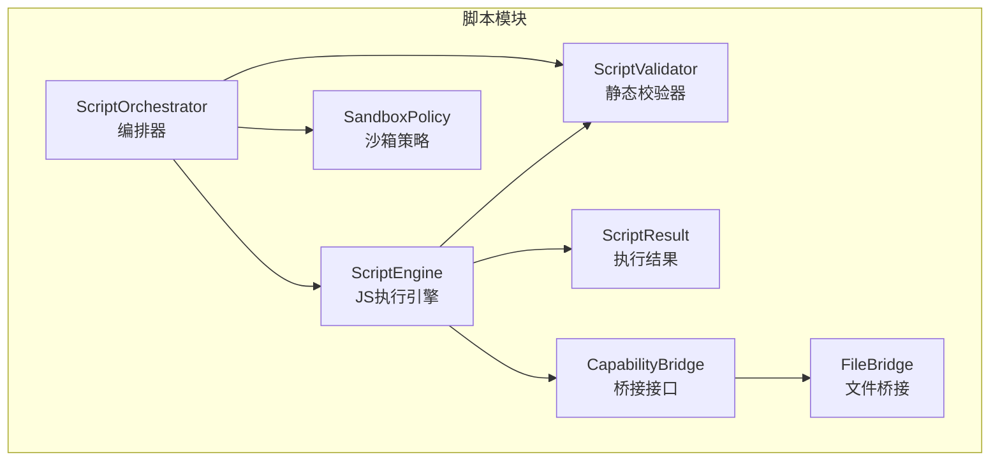
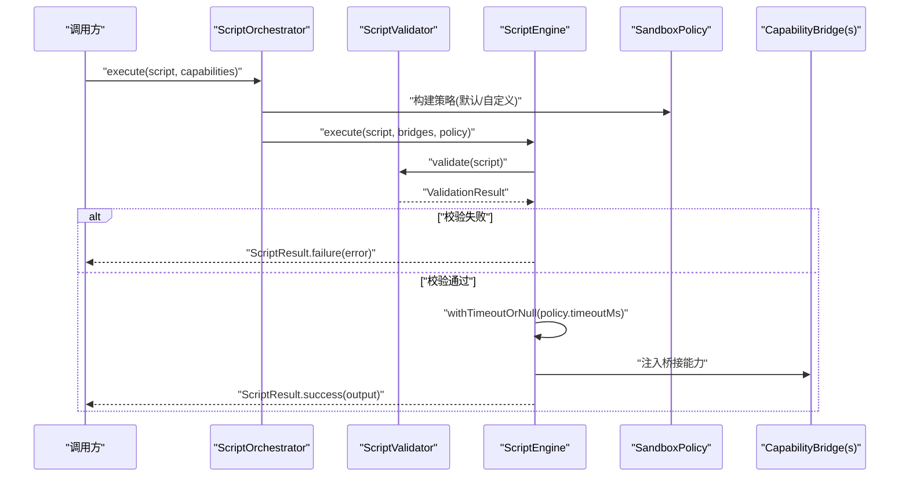
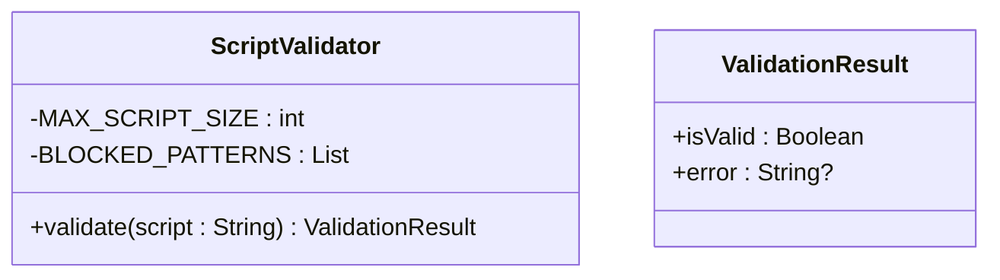
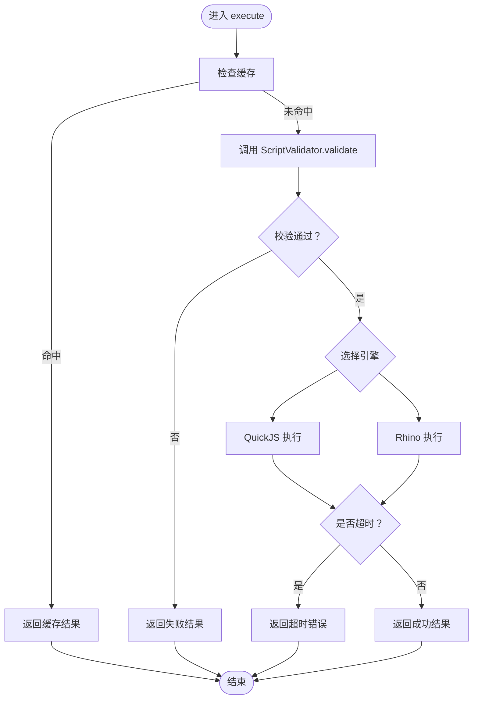
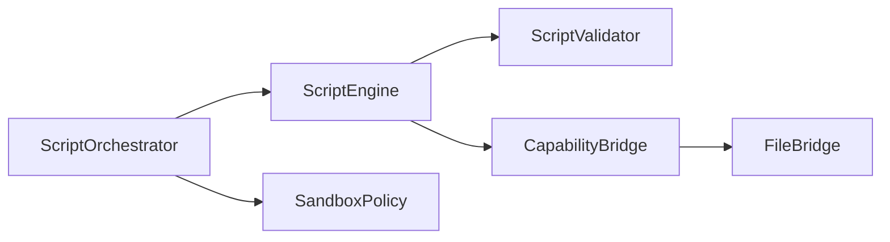

# 脚本验证器

<cite>
**本文引用的文件**
- [ScriptValidator.kt](file://script/src/main/java/ai/openclaw/script/ScriptValidator.kt)
- [ScriptValidatorTest.kt](file://script/src/test/java/ai/openclaw/script/ScriptValidatorTest.kt)
- [ScriptEngine.kt](file://script/src/main/java/ai/openclaw/script/ScriptEngine.kt)
- [SandboxPolicy.kt](file://script/src/main/java/ai/openclaw/script/SandboxPolicy.kt)
- [ScriptResult.kt](file://script/src/main/java/ai/openclaw/script/ScriptResult.kt)
- [ScriptOrchestrator.kt](file://script/src/main/java/ai/openclaw/script/ScriptOrchestrator.kt)
- [CapabilityBridge.kt](file://script/src/main/java/ai/openclaw/script/CapabilityBridge.kt)
- [FileBridge.kt](file://script/src/main/java/ai/openclaw/script/bridge/FileBridge.kt)
- [script-engine.md](file://docs/script-engine.md)
- [design-weather-script-sandbox.md](file://docs/design-weather-script-sandbox.md)
- [weather.js](file://app/src/main/assets/scripts/weather.js)
- [search.js](file://app/src/main/assets/scripts/search.js)
- [SandboxPolicyTest.kt](file://script/src/test/java/ai/openclaw/script/SandboxPolicyTest.kt)
</cite>

## 目录
1. [简介](#简介)
2. [项目结构](#项目结构)
3. [核心组件](#核心组件)
4. [架构总览](#架构总览)
5. [组件详解](#组件详解)
6. [依赖关系分析](#依赖关系分析)
7. [性能考量](#性能考量)
8. [故障排查指南](#故障排查指南)
9. [结论](#结论)
10. [附录](#附录)

## 简介
本文件为脚本验证器（ScriptValidator）的详细API文档，聚焦于其语法检查、语义分析与安全扫描机制，解释脚本合法性验证、潜在危险检测与性能问题识别的实现方式；说明验证规则配置、自定义规则扩展与验证结果处理流程；提供使用示例、错误信息解读与修复建议，并总结脚本安全最佳实践、常见问题排查与性能优化指南，以及与沙箱策略的协作与验证流程集成方法。

## 项目结构
围绕脚本验证器的关键模块与文件组织如下：
- 验证器与结果模型：ScriptValidator、ScriptResult
- 执行与编排：ScriptEngine、ScriptOrchestrator、SandboxPolicy
- 能力桥接：CapabilityBridge、FileBridge 等
- 示例脚本：weather.js、search.js
- 文档：script-engine.md、design-weather-script-sandbox.md
- 测试：ScriptValidatorTest、SandboxPolicyTest 等

图示来源
- [ScriptValidator.kt:1-60](file://script/src/main/java/ai/openclaw/script/ScriptValidator.kt#L1-L60)
- [ScriptEngine.kt:1-231](file://script/src/main/java/ai/openclaw/script/ScriptEngine.kt#L1-L231)
- [ScriptOrchestrator.kt:1-55](file://script/src/main/java/ai/openclaw/script/ScriptOrchestrator.kt#L1-L55)
- [SandboxPolicy.kt:1-16](file://script/src/main/java/ai/openclaw/script/SandboxPolicy.kt#L1-L16)
- [ScriptResult.kt:1-20](file://script/src/main/java/ai/openclaw/script/ScriptResult.kt#L1-L20)
- [CapabilityBridge.kt:1-33](file://script/src/main/java/ai/openclaw/script/CapabilityBridge.kt#L1-L33)
- [FileBridge.kt:1-157](file://script/src/main/java/ai/openclaw/script/bridge/FileBridge.kt#L1-L157)

章节来源
- [ScriptValidator.kt:1-60](file://script/src/main/java/ai/openclaw/script/ScriptValidator.kt#L1-L60)
- [ScriptEngine.kt:1-231](file://script/src/main/java/ai/openclaw/script/ScriptEngine.kt#L1-L231)
- [ScriptOrchestrator.kt:1-55](file://script/src/main/java/ai/openclaw/script/ScriptOrchestrator.kt#L1-L55)
- [SandboxPolicy.kt:1-16](file://script/src/main/java/ai/openclaw/script/SandboxPolicy.kt#L1-L16)
- [ScriptResult.kt:1-20](file://script/src/main/java/ai/openclaw/script/ScriptResult.kt#L1-L20)
- [CapabilityBridge.kt:1-33](file://script/src/main/java/ai/openclaw/script/CapabilityBridge.kt#L1-L33)
- [FileBridge.kt:1-157](file://script/src/main/java/ai/openclaw/script/bridge/FileBridge.kt#L1-L157)

## 核心组件
- ScriptValidator：负责脚本合法性与安全性的静态校验，包括大小限制、危险模式匹配等。
- ScriptEngine：脚本执行引擎，集成验证、桥接能力与沙箱策略，提供执行统计与缓存。
- ScriptOrchestrator：执行入口，负责解析能力、组装策略并调度引擎。
- SandboxPolicy：定义执行超时、内存、网络与文件写入等安全策略。
- ScriptResult：封装执行结果与错误信息。
- CapabilityBridge/FileBridge：能力桥接接口与文件操作桥接实现，限定在沙箱目录内。

章节来源
- [ScriptValidator.kt:1-60](file://script/src/main/java/ai/openclaw/script/ScriptValidator.kt#L1-L60)
- [ScriptEngine.kt:1-231](file://script/src/main/java/ai/openclaw/script/ScriptEngine.kt#L1-L231)
- [ScriptOrchestrator.kt:1-55](file://script/src/main/java/ai/openclaw/script/ScriptOrchestrator.kt#L1-L55)
- [SandboxPolicy.kt:1-16](file://script/src/main/java/ai/openclaw/script/SandboxPolicy.kt#L1-L16)
- [ScriptResult.kt:1-20](file://script/src/main/java/ai/openclaw/script/ScriptResult.kt#L1-L20)
- [CapabilityBridge.kt:1-33](file://script/src/main/java/ai/openclaw/script/CapabilityBridge.kt#L1-L33)
- [FileBridge.kt:1-157](file://script/src/main/java/ai/openclaw/script/bridge/FileBridge.kt#L1-L157)

## 架构总览
脚本验证器位于执行链路的“静态校验”阶段，与执行引擎、沙箱策略、能力桥接共同构成完整的脚本安全执行体系。

图示来源
- [ScriptOrchestrator.kt:31-39](file://script/src/main/java/ai/openclaw/script/ScriptOrchestrator.kt#L31-L39)
- [ScriptEngine.kt:45-99](file://script/src/main/java/ai/openclaw/script/ScriptEngine.kt#L45-L99)
- [ScriptValidator.kt:42-58](file://script/src/main/java/ai/openclaw/script/ScriptValidator.kt#L42-L58)
- [SandboxPolicy.kt:8-15](file://script/src/main/java/ai/openclaw/script/SandboxPolicy.kt#L8-L15)

## 组件详解

### ScriptValidator 静态校验器
- 功能概述
  - 脚本合法性验证：空脚本、超长脚本检测。
  - 安全扫描：阻断模块加载、动态求值、定时器、原型污染、Java/Android访问、系统对象等危险模式。
- 关键配置
  - 最大脚本大小：50KB。
  - 阻断模式：基于正则表达式的黑名单集合。
- 结果模型
  - ValidationResult：包含是否有效与错误信息。

图示来源
- [ScriptValidator.kt:10-58](file://script/src/main/java/ai/openclaw/script/ScriptValidator.kt#L10-L58)

章节来源
- [ScriptValidator.kt:1-60](file://script/src/main/java/ai/openclaw/script/ScriptValidator.kt#L1-L60)
- [ScriptValidatorTest.kt:1-56](file://script/src/test/java/ai/openclaw/script/ScriptValidatorTest.kt#L1-L56)

### ScriptEngine 执行引擎
- 功能概述
  - 执行前进行静态校验；校验失败直接返回失败结果。
  - 支持 QuickJS 与 Rhino 双引擎回退；默认优先 QuickJS。
  - 执行统计与缓存：命中缓存直接返回，未命中则执行并缓存耗时。
  - 超时控制：基于策略的超时限制。
- 关键流程
  - 缓存检查 → 静态校验 → 引擎执行 → 统计更新 → 结果返回。

图示来源
- [ScriptEngine.kt:52-99](file://script/src/main/java/ai/openclaw/script/ScriptEngine.kt#L52-L99)

章节来源
- [ScriptEngine.kt:1-231](file://script/src/main/java/ai/openclaw/script/ScriptEngine.kt#L1-L231)

### ScriptOrchestrator 编排器
- 功能概述
  - 作为执行入口，负责解析能力列表、组装沙箱策略与桥接能力，调用引擎执行。
  - 默认启用文件与网络能力，沙箱目录自动创建。
- 关键点
  - 能力解析：支持 fs/file、http/network 等内置能力，未知能力会发出警告。
  - 策略默认值：超时10秒、最大内存16MB、允许网络与文件写入、不限制域名。

章节来源
- [ScriptOrchestrator.kt:1-55](file://script/src/main/java/ai/openclaw/script/ScriptOrchestrator.kt#L1-L55)
- [SandboxPolicyTest.kt:1-23](file://script/src/test/java/ai/openclaw/script/SandboxPolicyTest.kt#L1-L23)

### SandboxPolicy 沙箱策略
- 功能概述
  - 定义执行超时、内存限制、沙箱目录、网络访问、文件写入权限与允许域名白名单。
- 默认行为
  - 超时10秒、最大内存16MB、允许网络与文件写入、不限制域名。
- 自定义方式
  - 通过构造函数传入自定义值，按需收紧或放宽策略。

章节来源
- [SandboxPolicy.kt:1-16](file://script/src/main/java/ai/openclaw/script/SandboxPolicy.kt#L1-L16)
- [SandboxPolicyTest.kt:1-23](file://script/src/test/java/ai/openclaw/script/SandboxPolicyTest.kt#L1-L23)

### 能力桥接与文件沙箱
- CapabilityBridge
  - QuickJS 模式：通过 registerBindings 在 DSL 中注册函数。
  - Rhino 模式：通过 getJsPrototype 生成原型代码，handleMethod 分发调用。
- FileBridge
  - 仅限沙箱目录内操作，路径穿越检测通过 canonicalPath 校验。
  - 提供 readFile/writeFile/list/exists 等方法，参数通过 JSON 序列化传递。

章节来源
- [CapabilityBridge.kt:1-33](file://script/src/main/java/ai/openclaw/script/CapabilityBridge.kt#L1-L33)
- [FileBridge.kt:1-157](file://script/src/main/java/ai/openclaw/script/bridge/FileBridge.kt#L1-L157)

### 示例脚本与集成
- 示例脚本
  - weather.js：通过 http bridge 调用天气服务，返回 JSON。
  - search.js：多实例搜索聚合，返回 JSON 结果。
- 集成方式
  - ScriptOrchestrator 从 assets 中加载脚本并注入全局变量，再执行。
  - 设计文档说明了从硬编码 HTTP 逻辑迁移到脚本沙箱的改造路径。

章节来源
- [weather.js:1-16](file://app/src/main/assets/scripts/weather.js#L1-L16)
- [search.js:1-39](file://app/src/main/assets/scripts/search.js#L1-L39)
- [design-weather-script-sandbox.md:1-41](file://docs/design-weather-script-sandbox.md#L1-L41)

## 依赖关系分析
- 调用关系
  - ScriptOrchestrator.execute → ScriptEngine.execute → ScriptValidator.validate
  - ScriptEngine.execute → SandboxPolicy（超时控制）
  - ScriptEngine.execute → CapabilityBridge（桥接能力）
- 内聚与耦合
  - ScriptValidator 与 ScriptEngine 松耦合，职责清晰：前者负责“禁止什么”，后者负责“如何执行”。
  - ScriptOrchestrator 作为门面，集中组装策略与能力，降低上层调用复杂度。
- 外部依赖
  - QuickJS 与 Rhino 引擎、OkHttp（HTTP桥）、协程异步支持。

图示来源
- [ScriptOrchestrator.kt:31-39](file://script/src/main/java/ai/openclaw/script/ScriptOrchestrator.kt#L31-L39)
- [ScriptEngine.kt:45-99](file://script/src/main/java/ai/openclaw/script/ScriptEngine.kt#L45-L99)
- [ScriptValidator.kt:42-58](file://script/src/main/java/ai/openclaw/script/ScriptValidator.kt#L42-L58)
- [CapabilityBridge.kt:1-33](file://script/src/main/java/ai/openclaw/script/CapabilityBridge.kt#L1-L33)
- [FileBridge.kt:1-157](file://script/src/main/java/ai/openclaw/script/bridge/FileBridge.kt#L1-L157)

章节来源
- [ScriptOrchestrator.kt:1-55](file://script/src/main/java/ai/openclaw/script/ScriptOrchestrator.kt#L1-L55)
- [ScriptEngine.kt:1-231](file://script/src/main/java/ai/openclaw/script/ScriptEngine.kt#L1-L231)
- [ScriptValidator.kt:1-60](file://script/src/main/java/ai/openclaw/script/ScriptValidator.kt#L1-L60)
- [CapabilityBridge.kt:1-33](file://script/src/main/java/ai/openclaw/script/CapabilityBridge.kt#L1-L33)
- [FileBridge.kt:1-157](file://script/src/main/java/ai/openclaw/script/bridge/FileBridge.kt#L1-L157)

## 性能考量
- 缓存与复用
  - ScriptEngine 对成功执行的脚本进行缓存，命中时直接返回历史耗时，减少重复执行成本。
- 引擎切换
  - QuickJS 作为首选引擎，若出现异常则回退至 Rhino，确保稳定性。
- 执行统计
  - 提供总执行次数、成功/失败次数、平均耗时与缓存规模等指标，便于性能观测与优化。
- 超时控制
  - 通过 SandboxPolicy.timeoutMs 控制单次执行上限，避免长时间阻塞。

章节来源
- [ScriptEngine.kt:52-118](file://script/src/main/java/ai/openclaw/script/ScriptEngine.kt#L52-L118)
- [SandboxPolicy.kt:8-15](file://script/src/main/java/ai/openclaw/script/SandboxPolicy.kt#L8-L15)

## 故障排查指南
- 常见错误与原因
  - 空脚本/空白脚本：返回“脚本不能为空”。
  - 脚本过长：超过50KB限制。
  - 包含禁止模式：如 import/require/eval/new Function、定时器、原型污染、Java/Android/系统对象访问等。
- 诊断步骤
  - 检查脚本长度与内容，排除危险模式。
  - 查看 ScriptResult.error 是否包含明确提示。
  - 若为超时，调整 SandboxPolicy.timeoutMs 或优化脚本逻辑。
- 修复建议
  - 移除 import/require/eval/new Function 等动态特性。
  - 避免 setTimeout/setInterval 等定时器。
  - 避免原型污染相关写法与 Java/Android/系统对象访问。
  - 控制脚本长度，拆分逻辑或外置资源。

章节来源
- [ScriptValidator.kt:42-58](file://script/src/main/java/ai/openclaw/script/ScriptValidator.kt#L42-L58)
- [ScriptValidatorTest.kt:21-55](file://script/src/test/java/ai/openclaw/script/ScriptValidatorTest.kt#L21-L55)
- [ScriptEngine.kt:126-142](file://script/src/main/java/ai/openclaw/script/ScriptEngine.kt#L126-L142)

## 结论
ScriptValidator 通过静态校验与黑名单模式，有效阻止了脚本中的危险行为；结合 ScriptEngine 的双引擎执行、SandboxPolicy 的策略控制与能力桥接的安全边界，形成了从“禁止什么”到“如何执行”的完整闭环。配合缓存与统计机制，可在保障安全的前提下提升整体性能与可观测性。

## 附录

### API 一览与使用示例
- ScriptValidator.validate
  - 输入：脚本字符串
  - 输出：ValidationResult（isValid、error）
  - 示例参考：[ScriptValidatorTest.kt:8-19](file://script/src/test/java/ai/openclaw/script/ScriptValidatorTest.kt#L8-L19)
- ScriptOrchestrator.execute
  - 输入：script、capabilities（可选）、customBridges（可选）
  - 输出：ScriptResult（success、output、error、executionTimeMs）
  - 示例参考：[ScriptEngine.kt:45-99](file://script/src/main/java/ai/openclaw/script/ScriptEngine.kt#L45-L99)
- SandboxPolicy
  - 构造参数：timeoutMs、maxMemoryMB、sandboxDir、allowNetwork、allowFileWrite、allowedDomains
  - 示例参考：[SandboxPolicyTest.kt:8-21](file://script/src/test/java/ai/openclaw/script/SandboxPolicyTest.kt#L8-L21)

章节来源
- [ScriptValidator.kt:42-58](file://script/src/main/java/ai/openclaw/script/ScriptValidator.kt#L42-L58)
- [ScriptEngine.kt:45-99](file://script/src/main/java/ai/openclaw/script/ScriptEngine.kt#L45-L99)
- [SandboxPolicyTest.kt:8-21](file://script/src/test/java/ai/openclaw/script/SandboxPolicyTest.kt#L8-L21)

### 验证规则配置与自定义
- 规则来源
  - ScriptValidator 内置 BLOCKED_PATTERNS 黑名单。
- 自定义方式
  - 当前实现未提供外部配置入口；如需扩展，可在构建阶段或运行期对 ScriptValidator 的规则集进行替换或增强（需二次开发）。
- 验证结果处理
  - ScriptEngine 在校验失败时直接返回失败结果；成功后进入执行阶段并更新统计与缓存。

章节来源
- [ScriptValidator.kt:12-35](file://script/src/main/java/ai/openclaw/script/ScriptValidator.kt#L12-L35)
- [ScriptEngine.kt:61-66](file://script/src/main/java/ai/openclaw/script/ScriptEngine.kt#L61-L66)

### 与沙箱策略的协作与集成
- 协作方式
  - ScriptOrchestrator 在执行前构建 SandboxPolicy，默认启用网络与文件写入；ScriptEngine 在执行时应用超时与内存限制。
- 集成方法
  - 通过 ScriptOrchestrator.execute 的 capabilities 参数启用所需能力；通过自定义 SandboxPolicy 调整策略。
- 设计文档参考
  - [script-engine.md:15-34](file://docs/script-engine.md#L15-L34)

章节来源
- [ScriptOrchestrator.kt:31-39](file://script/src/main/java/ai/openclaw/script/ScriptOrchestrator.kt#L31-L39)
- [SandboxPolicy.kt:8-15](file://script/src/main/java/ai/openclaw/script/SandboxPolicy.kt#L8-L15)
- [script-engine.md:15-34](file://docs/script-engine.md#L15-L34)

### 脚本安全最佳实践
- 避免危险模式：禁用 import/require/eval/new Function、定时器、原型污染、系统对象访问。
- 控制脚本大小：不超过50KB，必要时拆分逻辑。
- 限制能力暴露：仅启用必要的能力（fs/http），避免过度授权。
- 使用沙箱目录：文件操作严格限制在沙箱内，防止路径穿越。
- 设置合理超时：根据业务场景调整 SandboxPolicy.timeoutMs。

章节来源
- [ScriptValidator.kt:10-35](file://script/src/main/java/ai/openclaw/script/ScriptValidator.kt#L10-L35)
- [FileBridge.kt:82-86](file://script/src/main/java/ai/openclaw/script/bridge/FileBridge.kt#L82-L86)
- [SandboxPolicy.kt:8-15](file://script/src/main/java/ai/openclaw/script/SandboxPolicy.kt#L8-L15)