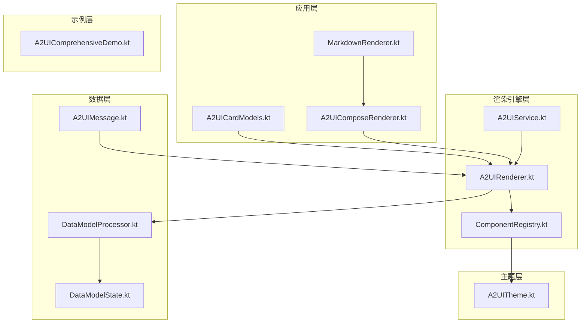
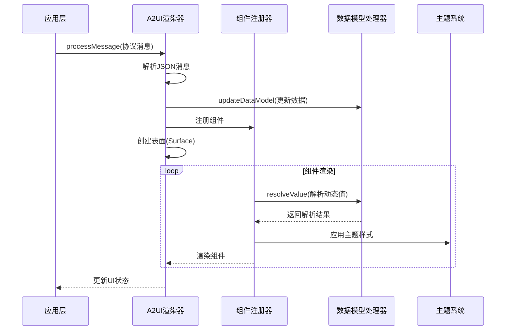
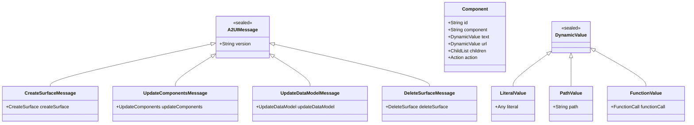
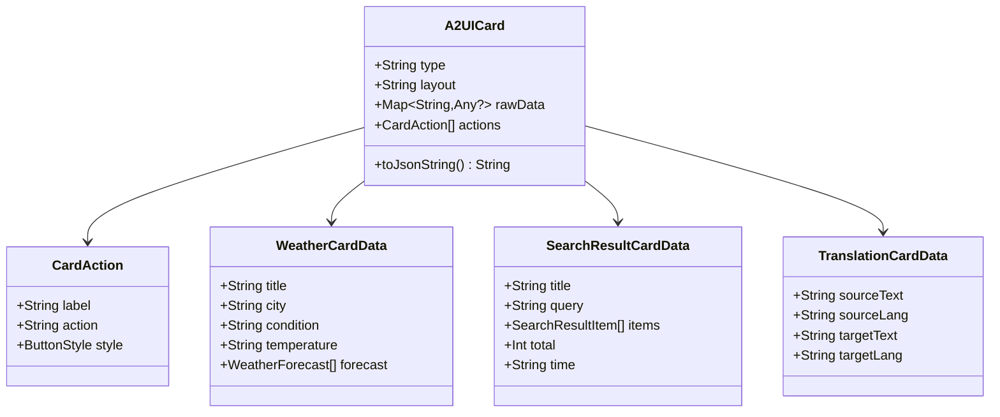
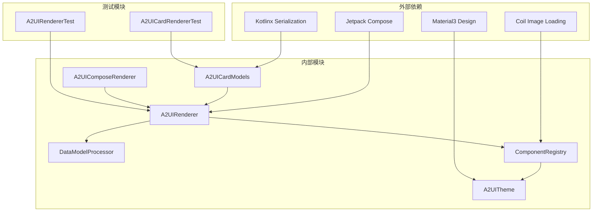

# A2UI卡片系统

<cite>
**本文档引用的文件**
- [A2UIRenderer.kt](file://android_compose/src/main/java/org/a2ui/compose/rendering/A2UIRenderer.kt)
- [ComponentRegistry.kt](file://android_compose/src/main/java/org/a2ui/compose/rendering/ComponentRegistry.kt)
- [A2UITheme.kt](file://android_compose/src/main/java/org/a2ui/compose/theme/A2UITheme.kt)
- [A2UICardModels.kt](file://app/src/main/java/ai/openclaw/android/ui/A2UICardModels.kt)
- [A2UIComposeRenderer.kt](file://app/src/main/java/ai/openclaw/android/ui/A2UIComposeRenderer.kt)
- [DataModelProcessor.kt](file://android_compose/src/main/java/org/a2ui/compose/data/DataModelProcessor.kt)
- [A2UIMessage.kt](file://android_compose/src/main/java/org/a2ui/compose/data/A2UIMessage.kt)
- [DataModelState.kt](file://android_compose/src/main/java/org/a2ui/compose/data/DataModelState.kt)
- [A2UIService.kt](file://android_compose/src/main/java/org/a2ui/compose/service/A2UIService.kt)
- [MarkdownRenderer.kt](file://app/src/main/java/ai/openclaw/android/ui/MarkdownRenderer.kt)
- [A2UIComprehensiveDemo.kt](file://android_compose/src/main/java/org/a2ui/compose/example/A2UIComprehensiveDemo.kt)
- [A2UIRendererTest.kt](file://android_compose/src/test/java/org/a2ui/compose/rendering/A2UIRendererTest.kt)
- [A2UICardRendererTest.kt](file://app/src/test/java/ai/openclaw/android/ui/A2UICardRendererTest.kt)
</cite>

## 目录
1. [简介](#简介)
2. [项目结构](#项目结构)
3. [核心组件](#核心组件)
4. [架构概览](#架构概览)
5. [详细组件分析](#详细组件分析)
6. [依赖关系分析](#依赖关系分析)
7. [性能考虑](#性能考虑)
8. [故障排除指南](#故障排除指南)
9. [结论](#结论)
10. [附录](#附录)

## 简介

A2UI卡片系统是一个基于Jetpack Compose的现代化卡片渲染框架，专为Android平台设计。该系统实现了完整的A2UI协议规范，支持动态卡片渲染、双向数据绑定、主题定制和丰富的交互功能。

系统的核心特点包括：
- **协议驱动**：完全遵循A2UI v0.8/v0.9/v0.10协议规范
- **动态渲染**：支持运行时动态更新和重新渲染
- **类型安全**：完整的Kotlin类型系统支持
- **主题适配**：灵活的主题定制和颜色方案
- **扩展性强**：支持自定义组件和插件机制
- **性能优化**：智能缓存和内存管理策略

## 项目结构

A2UI卡片系统采用模块化的架构设计，主要分为以下几个核心模块：

**图表来源**
- [A2UICardModels.kt:1-638](file://app/src/main/java/ai/openclaw/android/ui/A2UICardModels.kt#L1-L638)
- [A2UIRenderer.kt:1-660](file://android_compose/src/main/java/org/a2ui/compose/rendering/A2UIRenderer.kt#L1-L660)
- [ComponentRegistry.kt:1-800](file://android_compose/src/main/java/org/a2ui/compose/rendering/ComponentRegistry.kt#L1-L800)

**章节来源**
- [A2UICardModels.kt:1-638](file://app/src/main/java/ai/openclaw/android/ui/A2UICardModels.kt#L1-L638)
- [A2UIRenderer.kt:1-660](file://android_compose/src/main/java/org/a2ui/compose/rendering/A2UIRenderer.kt#L1-L660)
- [ComponentRegistry.kt:1-800](file://android_compose/src/main/java/org/a2ui/compose/rendering/ComponentRegistry.kt#L1-L800)

## 核心组件

### A2UI渲染器 (A2UIRenderer)

A2UI渲染器是整个系统的核心组件，负责处理A2UI协议消息并协调各个子系统的协作。

**主要功能**：
- 协议消息解析和验证
- 表面管理（Surface）生命周期控制
- 组件注册和渲染调度
- 数据模型更新和状态管理
- 错误处理和日志记录

**关键特性**：
- 支持多种协议版本（v0.8/v0.9/v0.10）
- 内存限制和安全防护
- 响应式状态管理
- 组件深度限制防止栈溢出

### 组件注册器 (ComponentRegistry)

组件注册器负责管理标准组件和自定义组件的注册与渲染。

**内置组件**（共18种标准组件）：
- 文本组件（Text）
- 图像组件（Image）
- 图标组件（Icon）
- 按钮组件（Button）
- 输入组件（TextField、CheckBox、Slider、ChoicePicker）
- 布局组件（Row、Column、Card、List、Tabs、Modal）
- 分隔符组件（Divider）
- 多媒体组件（Video、AudioPlayer）

**组件注册机制**：
- 默认组件注册（init时自动注册）
- 自定义组件注册（支持运行时动态注册）
- 组件优先级：自定义组件 > 标准组件 > 默认渲染

### 数据模型处理器 (DataModelProcessor)

数据模型处理器提供完整的数据绑定和状态管理功能。

**核心能力**：
- 动态值解析（Literal、Path、Function）
- 数据模型更新和查询
- 路径验证和安全检查
- 函数调用支持（格式化、验证、计算）

**数据绑定类型**：
- 字面量值（LiteralValue）
- 路径值（PathValue）
- 函数值（FunctionValue）

### 主题系统 (A2UITheme)

A2UI主题系统提供完整的视觉定制能力。

**主题配置项**：
- 颜色方案（primaryColor、secondaryColor、backgroundColor等）
- 字体和排版
- 动画效果（enableAnimations、animationDuration）
- 材质设计参数（borderRadius、cardElevation）
- 特效支持（glassmorphism、微交互）

## 架构概览

A2UI卡片系统采用分层架构设计，确保各层职责清晰、耦合度低。

**图表来源**
- [A2UIRenderer.kt:108-171](file://android_compose/src/main/java/org/a2ui/compose/rendering/A2UIRenderer.kt#L108-L171)
- [ComponentRegistry.kt:100-129](file://android_compose/src/main/java/org/a2ui/compose/rendering/ComponentRegistry.kt#L100-L129)

**章节来源**
- [A2UIRenderer.kt:64-577](file://android_compose/src/main/java/org/a2ui/compose/rendering/A2UIRenderer.kt#L64-L577)
- [ComponentRegistry.kt:74-129](file://android_compose/src/main/java/org/a2ui/compose/rendering/ComponentRegistry.kt#L74-L129)

## 详细组件分析

### A2UI协议消息模型

A2UI协议定义了四种基本消息类型，每种都有特定的用途和格式要求。

**图表来源**
- [A2UIMessage.kt:10-314](file://android_compose/src/main/java/org/a2ui/compose/data/A2UIMessage.kt#L10-L314)

**章节来源**
- [A2UIMessage.kt:23-314](file://android_compose/src/main/java/org/a2ui/compose/data/A2UIMessage.kt#L23-L314)

### 卡片数据模型系统

A2UI v2引入了统一的卡片数据模型，支持14种不同类型的业务卡片。

**图表来源**
- [A2UICardModels.kt:83-140](file://app/src/main/java/ai/openclaw/android/ui/A2UICardModels.kt#L83-L140)

**章节来源**
- [A2UICardModels.kt:83-524](file://app/src/main/java/ai/openclaw/android/ui/A2UICardModels.kt#L83-L524)

### Compose渲染器实现

A2UIComposeRenderer提供了在聊天界面中渲染标准A2UI协议消息的能力。

**核心功能**：
- 自动识别协议版本（v0.8/v0.9/v0.10）
- 旧格式兼容性转换
- 组件树递归渲染
- 响应式状态管理

**渲染流程**：
1. 提取[A2UI]...[/A2UI]标签内的JSON内容
2. 检测是否为标准协议格式
3. 如非标准格式则转换为标准协议
4. 调用A2UIRenderer处理消息
5. 递归渲染组件树

**章节来源**
- [A2UIComposeRenderer.kt:27-68](file://app/src/main/java/ai/openclaw/android/ui/A2UIComposeRenderer.kt#L27-L68)

### 富文本渲染器

MarkdownRenderer提供了强大的富文本渲染能力，支持多种Markdown语法。

**支持的Markdown语法**：
- 标题（# H1, ## H2, ### H3）
- 文本格式（粗体、斜体、粗斜体）
- 代码（行内代码、代码块）
- 链接和删除线
- 列表（有序、无序）
- 引用块和分割线

**渲染特性**：
- 响应式布局
- 主题适配
- 性能优化的文本渲染
- 自定义样式支持

**章节来源**
- [MarkdownRenderer.kt:46-183](file://app/src/main/java/ai/openclaw/android/ui/MarkdownRenderer.kt#L46-L183)

## 依赖关系分析

A2UI卡片系统的依赖关系体现了清晰的分层架构和模块化设计。

**图表来源**
- [A2UICardModels.kt:3-23](file://app/src/main/java/ai/openclaw/android/ui/A2UICardModels.kt#L3-L23)
- [A2UIRenderer.kt:1-48](file://android_compose/src/main/java/org/a2ui/compose/rendering/A2UIRenderer.kt#L1-L48)

**依赖特点**：
- **低耦合高内聚**：各模块职责明确，接口清晰
- **向上依赖**：底层模块不依赖上层模块
- **测试友好**：提供完整的单元测试覆盖
- **扩展性强**：支持插件化组件注册

**章节来源**
- [A2UIService.kt:1-232](file://android_compose/src/main/java/org/a2ui/compose/service/A2UIService.kt#L1-L232)
- [A2UIRendererTest.kt:1-315](file://android_compose/src/test/java/org/a2ui/compose/rendering/A2UIRendererTest.kt#L1-L315)

## 性能考虑

A2UI卡片系统在设计时充分考虑了性能优化和内存管理。

### 内存管理策略

**内存限制**：
- 最大消息大小：1MB
- 最大表面数量：50个
- 每表面最大组件数：1000个
- 数据模型条目上限：10,000个

**垃圾回收优化**：
- 使用ConcurrentHashMap避免线程竞争
- SnapshotStateMap提供响应式更新
- 智能缓存策略减少重复计算

### 渲染性能优化

**批量更新**：
- 使用Snapshot.withMutableSnapshot批量更新状态
- 避免多次重组导致的性能问题

**组件深度限制**：
- 最大渲染深度：50层
- 防止深度嵌套导致的栈溢出

**懒加载机制**：
- 列表组件使用LazyColumn/LazyRow
- 模态框按需渲染
- 图片加载使用Coil异步处理

### 数据绑定优化

**路径解析缓存**：
- 动态值解析结果缓存
- 相对路径解析优化
- 函数调用结果缓存

**章节来源**
- [A2UIRenderer.kt:83-91](file://android_compose/src/main/java/org/a2ui/compose/rendering/A2UIRenderer.kt#L83-L91)
- [DataModelProcessor.kt:82-184](file://android_compose/src/main/java/org/a2ui/compose/data/DataModelProcessor.kt#L82-L184)

## 故障排除指南

### 常见问题及解决方案

**协议解析错误**：
- 检查JSON格式是否正确
- 验证协议版本是否受支持
- 确认消息结构符合规范

**组件渲染异常**：
- 检查组件ID格式是否有效
- 验证数据绑定路径是否存在
- 确认组件注册是否成功

**内存溢出问题**：
- 检查数据模型大小是否超过限制
- 验证组件树深度是否合理
- 监控表面数量是否过多

### 调试工具和技巧

**日志系统**：
- 提供详细的调试日志
- 支持不同日志级别
- 错误信息包含上下文信息

**状态监控**：
- 提供状态快照功能
- 支持状态保存和恢复
- 实时监控组件数量

**章节来源**
- [A2UIRenderer.kt:173-184](file://android_compose/src/main/java/org/a2ui/compose/rendering/A2UIRenderer.kt#L173-L184)
- [A2UIRendererTest.kt:205-225](file://android_compose/src/test/java/org/a2ui/compose/rendering/A2UIRendererTest.kt#L205-L225)

## 结论

A2UI卡片系统是一个设计精良、功能完备的Android卡片渲染框架。其核心优势包括：

**技术优势**：
- 完整的协议实现和标准化
- 灵活的组件系统和扩展机制
- 强大的数据绑定和状态管理
- 优秀的性能表现和内存管理

**实用性特点**：
- 丰富的内置组件满足大多数需求
- 简洁的API设计易于使用
- 完善的测试覆盖保证质量
- 良好的文档和示例支持

**扩展性**：
- 插件化组件注册机制
- 灵活的主题定制系统
- 支持自定义验证和格式化函数
- 易于集成第三方库和功能

该系统为Android开发者提供了一个强大而灵活的卡片渲染解决方案，适用于各种复杂的应用场景。

## 附录

### 协议版本支持

| 版本 | 特性 | 支持状态 |
|------|------|----------|
| v0.8 | 基础协议 | ✅ 完全支持 |
| v0.9 | 增强功能 | ✅ 完全支持 |
| v0.10 | 最新特性 | ✅ 完全支持 |

### 标准组件清单

**布局组件**：
- Text（文本显示）
- Row（水平布局）
- Column（垂直布局）
- Card（卡片容器）

**交互组件**：
- Button（按钮）
- TextField（文本输入）
- CheckBox（复选框）
- Slider（滑块）

**展示组件**：
- Image（图片）
- Icon（图标）
- List（列表）
- Tabs（标签页）
- Modal（模态框）
- Divider（分割线）

### 主题配置选项

**颜色配置**：
- primaryColor：主色调
- secondaryColor：次色调
- backgroundColor：背景色
- surfaceColor：表面色

**行为配置**：
- enableAnimations：启用动画
- animationDuration：动画时长
- enableGlassmorphism：启用玻璃拟态
- cardElevation：卡片阴影