# Jetpack Compose UI实现

<cite>
**本文档引用的文件**
- [A2UIComprehensiveDemo.kt](file://android_compose/src/main/java/org/a2ui/compose/example/A2UIComprehensiveDemo.kt)
- [A2UIRenderer.kt](file://android_compose/src/main/java/org/a2ui/compose/rendering/A2UIRenderer.kt)
- [ComponentRegistry.kt](file://android_compose/src/main/java/org/a2ui/compose/rendering/ComponentRegistry.kt)
- [A2UIService.kt](file://android_compose/src/main/java/org/a2ui/compose/service/A2UIService.kt)
- [DataModelState.kt](file://android_compose/src/main/java/org/a2ui/compose/data/DataModelState.kt)
- [DataModelProcessor.kt](file://android_compose/src/main/java/org/a2ui/compose/data/DataModelProcessor.kt)
- [A2UITheme.kt](file://android_compose/src/main/java/org/a2ui/compose/theme/A2UITheme.kt)
- [A2UICards.kt](file://app/src/main/java/ai/openclaw/android/ui/A2UICards.kt)
- [SettingsScreen.kt](file://app/src/main/java/ai/openclaw/android/ui/SettingsScreen.kt)
- [ChatScreen.kt](file://app/src/main/java/ai/openclaw/android/ChatScreen.kt)
- [A2UICardModels.kt](file://app/src/main/java/ai/openclaw/android/ui/A2UICardModels.kt)
- [MessageBubble.kt](file://app/src/main/java/ai/openclaw/android/ui/MessageBubble.kt)
- [A2UIComposeRenderer.kt](file://app/src/main/java/ai/openclaw/android/ui/A2UIComposeRenderer.kt)
</cite>

## 目录
1. [简介](#简介)
2. [项目结构](#项目结构)
3. [核心组件](#核心组件)
4. [架构总览](#架构总览)
5. [详细组件分析](#详细组件分析)
6. [依赖关系分析](#依赖关系分析)
7. [性能考虑](#性能考虑)
8. [故障排除指南](#故障排除指南)
9. [结论](#结论)

## 简介
本项目基于Jetpack Compose构建了完整的声明式UI系统，实现了A2UI协议的标准化渲染引擎与应用级UI组件库。系统采用声明式UI设计理念，通过状态驱动的组件树渲染，实现了聊天界面、设置界面、A2UI卡片界面等复杂交互场景。本文档深入解析系统的架构设计、组件实现原理、状态管理机制以及性能优化策略。

## 项目结构
项目采用模块化架构，主要分为两个核心模块：

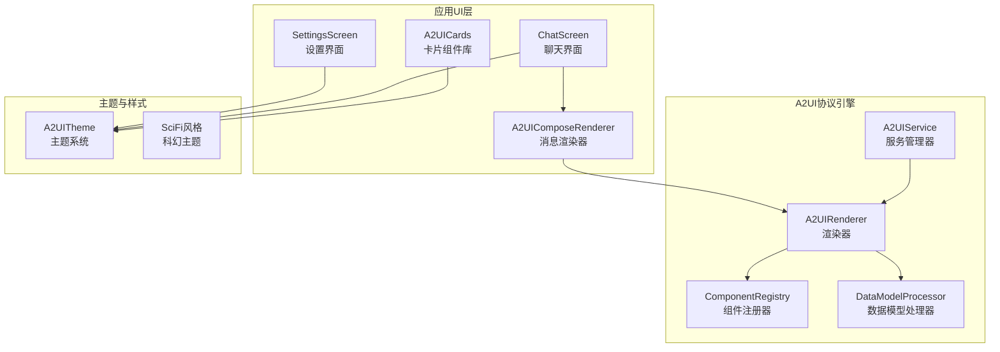

**图表来源**
- [A2UIRenderer.kt:64-577](file://android_compose/src/main/java/org/a2ui/compose/rendering/A2UIRenderer.kt#L64-L577)
- [ComponentRegistry.kt:74-109](file://android_compose/src/main/java/org/a2ui/compose/rendering/ComponentRegistry.kt#L74-L109)
- [A2UIService.kt:112-223](file://android_compose/src/main/java/org/a2ui/compose/service/A2UIService.kt#L112-L223)

**章节来源**
- [A2UIComprehensiveDemo.kt:48-89](file://android_compose/src/main/java/org/a2ui/compose/example/A2UIComprehensiveDemo.kt#L48-L89)
- [A2UIRenderer.kt:64-101](file://android_compose/src/main/java/org/a2ui/compose/rendering/A2UIRenderer.kt#L64-L101)

## 核心组件

### A2UI渲染器架构
A2UI渲染器是整个系统的核心，负责解析和渲染A2UI协议消息：

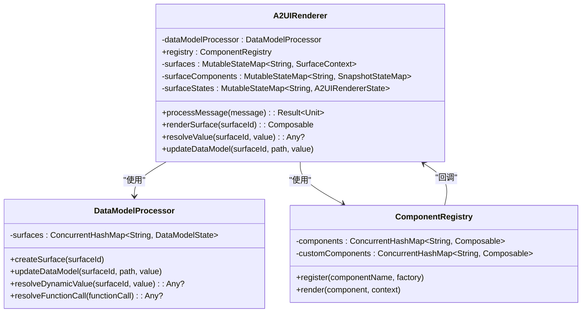

**图表来源**
- [A2UIRenderer.kt:64-101](file://android_compose/src/main/java/org/a2ui/compose/rendering/A2UIRenderer.kt#L64-L101)
- [DataModelProcessor.kt:8-51](file://android_compose/src/main/java/org/a2ui/compose/data/DataModelProcessor.kt#L8-L51)
- [ComponentRegistry.kt:74-109](file://android_compose/src/main/java/org/a2ui/compose/rendering/ComponentRegistry.kt#L74-L109)

### 应用UI组件体系
应用层提供了丰富的UI组件，包括聊天界面、设置界面和各种卡片组件：

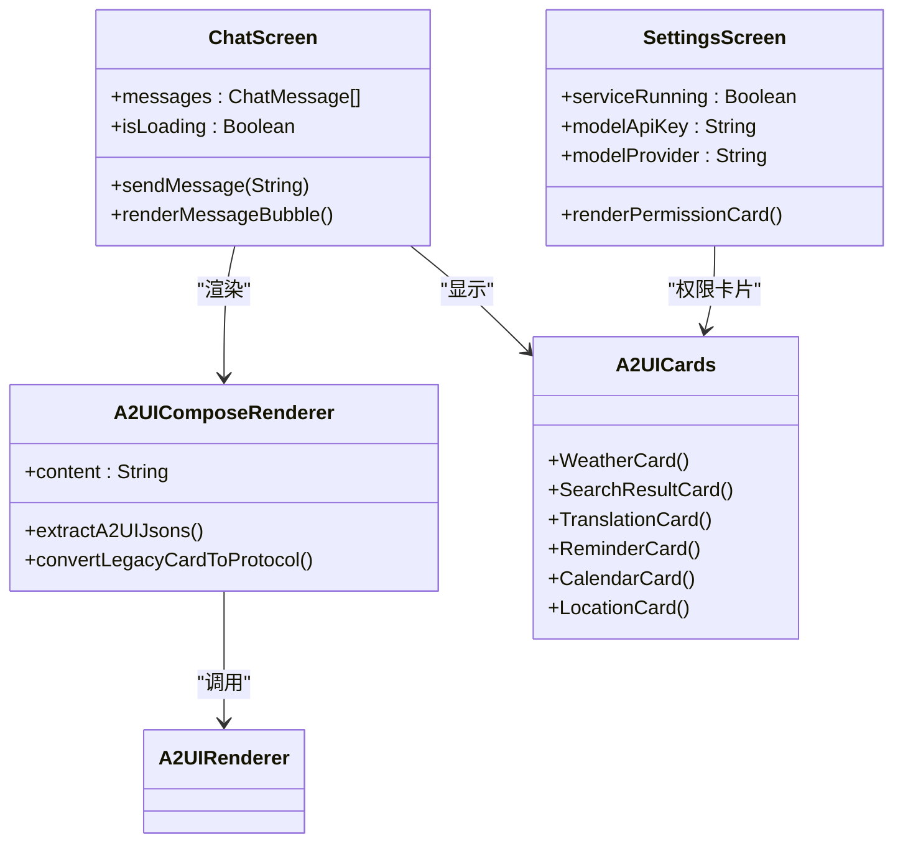

**图表来源**
- [ChatScreen.kt:206-336](file://app/src/main/java/ai/openclaw/android/ChatScreen.kt#L206-L336)
- [SettingsScreen.kt:40-62](file://app/src/main/java/ai/openclaw/android/ui/SettingsScreen.kt#L40-L62)
- [A2UICards.kt:175-321](file://app/src/main/java/ai/openclaw/android/ui/A2UICards.kt#L175-L321)
- [A2UIComposeRenderer.kt:27-68](file://app/src/main/java/ai/openclaw/android/ui/A2UIComposeRenderer.kt#L27-L68)

**章节来源**
- [A2UICards.kt:175-800](file://app/src/main/java/ai/openclaw/android/ui/A2UICards.kt#L175-L800)
- [SettingsScreen.kt:40-366](file://app/src/main/java/ai/openclaw/android/ui/SettingsScreen.kt#L40-L366)
- [ChatScreen.kt:206-639](file://app/src/main/java/ai/openclaw/android/ChatScreen.kt#L206-L639)

## 架构总览

### 声明式UI设计理念
系统采用完全的声明式UI设计，所有UI元素都是基于状态的声明：

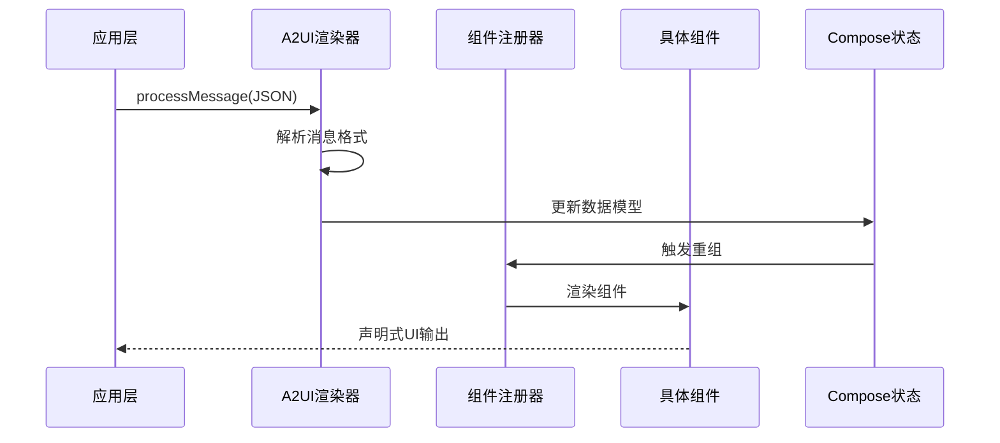

**图表来源**
- [A2UIRenderer.kt:108-171](file://android_compose/src/main/java/org/a2ui/compose/rendering/A2UIRenderer.kt#L108-L171)
- [ComponentRegistry.kt:100-109](file://android_compose/src/main/java/org/a2ui/compose/rendering/ComponentRegistry.kt#L100-L109)

### 数据流设计
系统实现了完整的数据流管道，从消息接收到底层渲染：

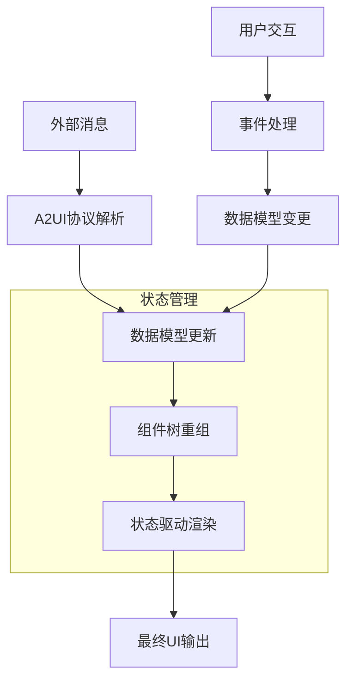

**图表来源**
- [A2UIRenderer.kt:151-162](file://android_compose/src/main/java/org/a2ui/compose/rendering/A2UIRenderer.kt#L151-L162)
- [DataModelProcessor.kt:35-55](file://android_compose/src/main/java/org/a2ui/compose/data/DataModelProcessor.kt#L35-L55)

**章节来源**
- [A2UIRenderer.kt:108-171](file://android_compose/src/main/java/org/a2ui/compose/rendering/A2UIRenderer.kt#L108-L171)
- [DataModelProcessor.kt:53-80](file://android_compose/src/main/java/org/a2ui/compose/data/DataModelProcessor.kt#L53-L80)

## 详细组件分析

### 聊天界面实现

#### 消息气泡组件
聊天界面的消息气泡组件实现了复杂的交互逻辑：

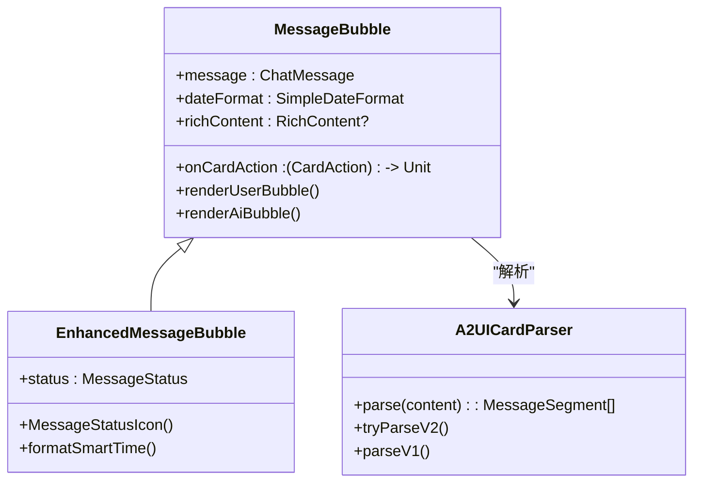

**图表来源**
- [MessageBubble.kt:47-206](file://app/src/main/java/ai/openclaw/android/ui/MessageBubble.kt#L47-L206)
- [A2UICardModels.kt:541-637](file://app/src/main/java/ai/openclaw/android/ui/A2UICardModels.kt#L541-L637)

#### 输入区域与语音交互
聊天界面集成了多种输入方式和语音交互功能：

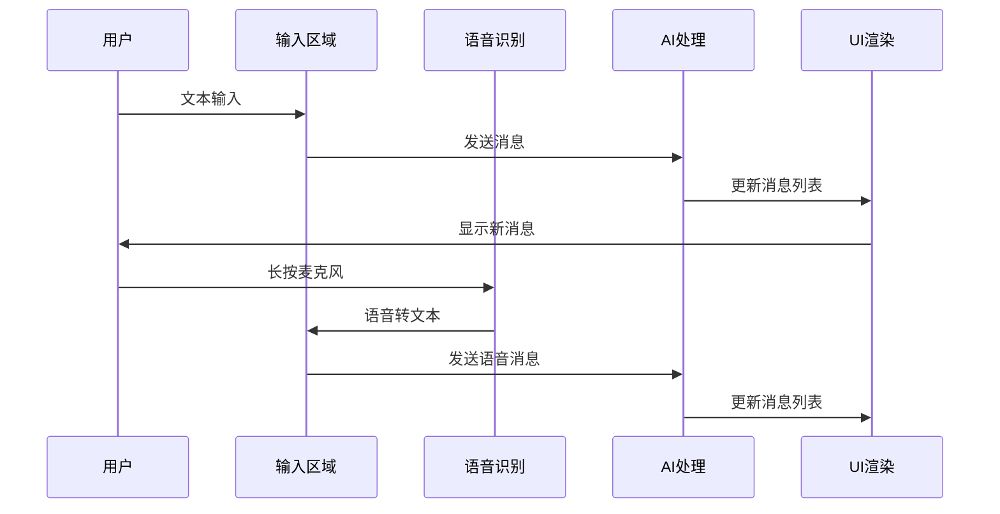

**图表来源**
- [ChatScreen.kt:242-336](file://app/src/main/java/ai/openclaw/android/ChatScreen.kt#L242-L336)
- [ChatScreen.kt:527-551](file://app/src/main/java/ai/openclaw/android/ChatScreen.kt#L527-L551)

**章节来源**
- [ChatScreen.kt:206-639](file://app/src/main/java/ai/openclaw/android/ChatScreen.kt#L206-L639)
- [MessageBubble.kt:47-270](file://app/src/main/java/ai/openclaw/android/ui/MessageBubble.kt#L47-L270)

### 设置界面实现

#### 权限管理系统
设置界面实现了完整的权限管理功能：

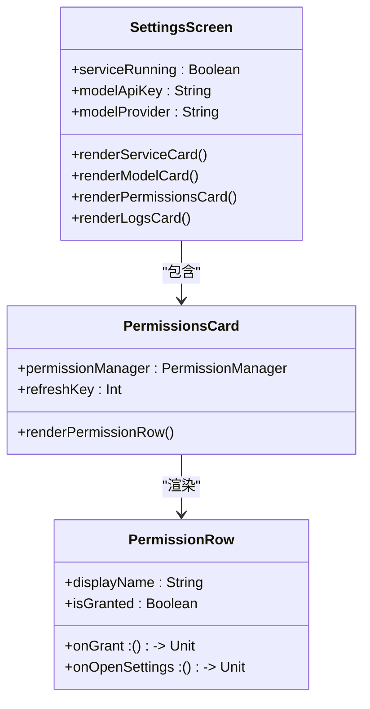

**图表来源**
- [SettingsScreen.kt:40-366](file://app/src/main/java/ai/openclaw/android/ui/SettingsScreen.kt#L40-L366)
- [SettingsScreen.kt:373-478](file://app/src/main/java/ai/openclaw/android/ui/SettingsScreen.kt#L373-L478)

#### 模型配置管理
设置界面支持多种模型配置选项：

| 配置项 | 类型 | 默认值 | 说明 |
|--------|------|--------|------|
| API Key | 文本 | 空 | 云端模型认证密钥 |
| 模型名称 | 文本 | qwen-plus | LLM模型标识 |
| 基础URL | 文本 | 服务商特定 | API端点地址 |
| 本地模型 | 文件访问 | Gemma LiteRT | 本地推理模型 |

**章节来源**
- [SettingsScreen.kt:114-279](file://app/src/main/java/ai/openclaw/android/ui/SettingsScreen.kt#L114-L279)

### A2UI卡片界面实现

#### 卡片组件库
系统提供了丰富的卡片组件，每种卡片都有特定的数据模型和渲染逻辑：

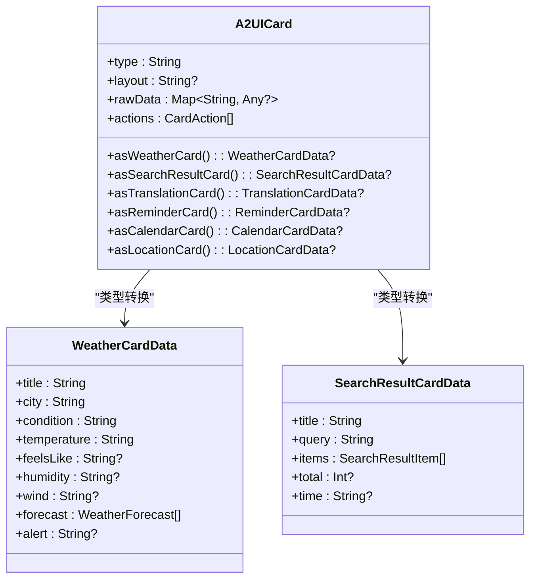

**图表来源**
- [A2UICardModels.kt:83-140](file://app/src/main/java/ai/openclaw/android/ui/A2UICardModels.kt#L83-L140)
- [A2UICardModels.kt:164-208](file://app/src/main/java/ai/openclaw/android/ui/A2UICardModels.kt#L164-L208)
- [A2UICardModels.kt:210-244](file://app/src/main/java/ai/openclaw/android/ui/A2UICardModels.kt#L210-L244)

#### 卡片渲染流程
卡片组件的渲染遵循统一的流程：

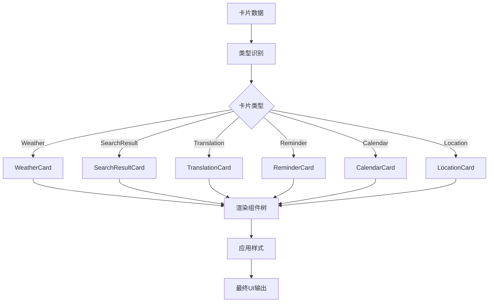

**图表来源**
- [A2UICards.kt:175-321](file://app/src/main/java/ai/openclaw/android/ui/A2UICards.kt#L175-L321)
- [A2UICards.kt:325-440](file://app/src/main/java/ai/openclaw/android/ui/A2UICards.kt#L325-L440)

**章节来源**
- [A2UICards.kt:175-800](file://app/src/main/java/ai/openclaw/android/ui/A2UICards.kt#L175-L800)
- [A2UICardModels.kt:83-524](file://app/src/main/java/ai/openclaw/android/ui/A2UICardModels.kt#L83-L524)

## 依赖关系分析

### 组件间通信模式
系统采用了多种组件间通信模式：

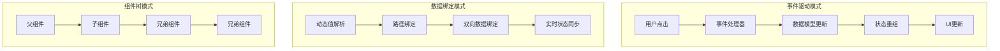

**图表来源**
- [ComponentRegistry.kt:163-184](file://android_compose/src/main/java/org/a2ui/compose/rendering/ComponentRegistry.kt#L163-L184)
- [DataModelProcessor.kt:63-80](file://android_compose/src/main/java/org/a2ui/compose/data/DataModelProcessor.kt#L63-L80)

### 状态管理机制
系统实现了多层次的状态管理：

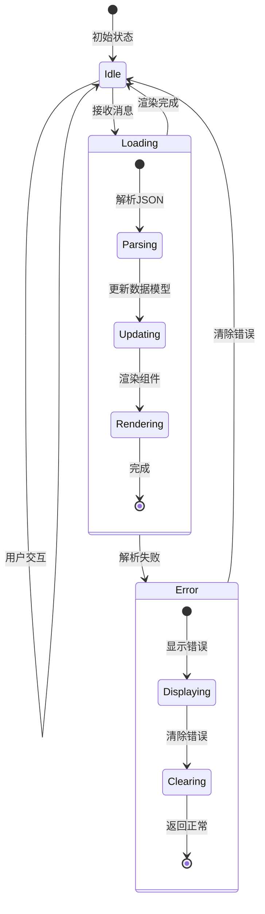

**图表来源**
- [A2UIRenderer.kt:52-56](file://android_compose/src/main/java/org/a2ui/compose/rendering/A2UIRenderer.kt#L52-L56)
- [A2UIRenderer.kt:151-162](file://android_compose/src/main/java/org/a2ui/compose/rendering/A2UIRenderer.kt#L151-L162)

**章节来源**
- [A2UIRenderer.kt:52-56](file://android_compose/src/main/java/org/a2ui/compose/rendering/A2UIRenderer.kt#L52-L56)
- [ComponentRegistry.kt:126-129](file://android_compose/src/main/java/org/a2ui/compose/rendering/ComponentRegistry.kt#L126-L129)

## 性能考虑

### 渲染优化策略
系统采用了多项性能优化措施：

1. **批量状态更新**：使用Snapshot.withMutableSnapshot确保一次原子性更新
2. **懒加载组件**：List组件使用LazyColumn/LazyRow实现虚拟化
3. **状态记忆化**：合理使用remember和rememberSaveable避免不必要的重组
4. **动画优化**：启用硬件加速和合理的动画参数

### 内存管理
系统实现了完善的内存管理机制：

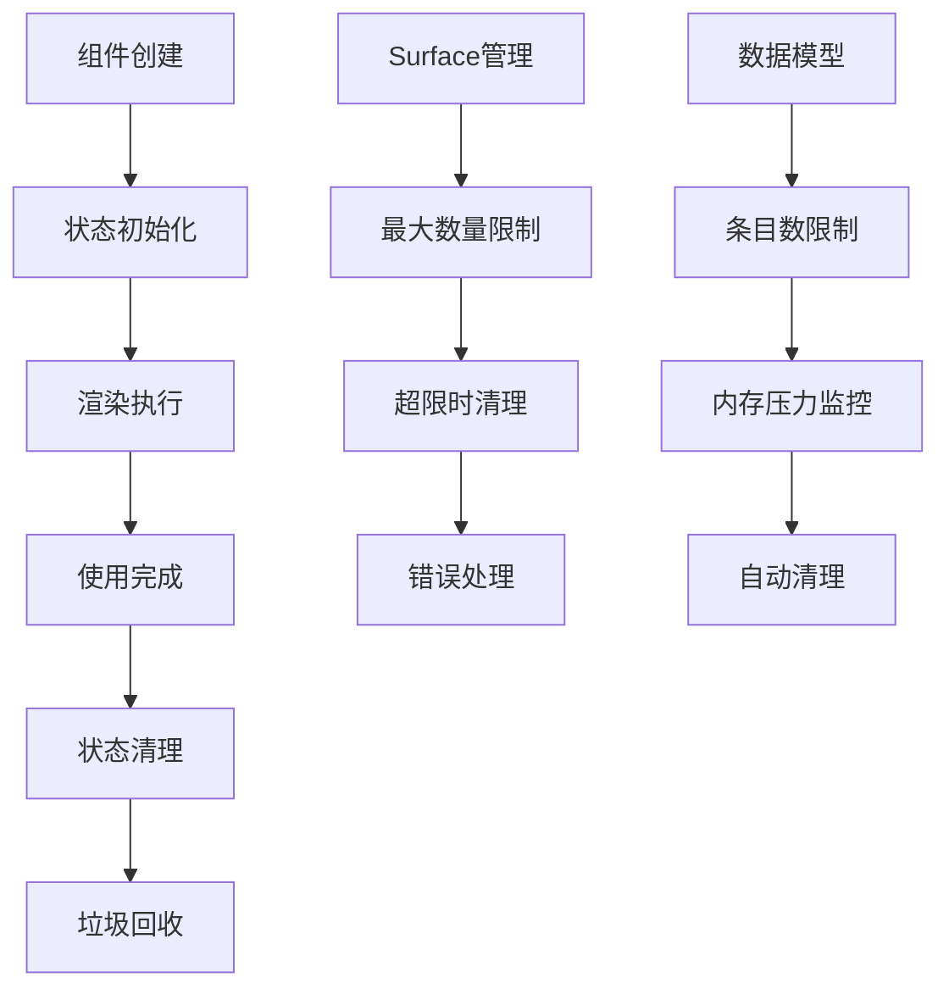

**图表来源**
- [A2UIRenderer.kt:83-91](file://android_compose/src/main/java/org/a2ui/compose/rendering/A2UIRenderer.kt#L83-L91)
- [DataModelState.kt:13-15](file://android_compose/src/main/java/org/a2ui/compose/data/DataModelState.kt#L13-L15)

**章节来源**
- [A2UIRenderer.kt:83-91](file://android_compose/src/main/java/org/a2ui/compose/rendering/A2UIRenderer.kt#L83-L91)
- [DataModelState.kt:13-44](file://android_compose/src/main/java/org/a2ui/compose/data/DataModelState.kt#L13-L44)

## 故障排除指南

### 常见问题诊断
系统提供了完善的错误处理和诊断机制：

| 问题类型 | 诊断方法 | 解决方案 |
|----------|----------|----------|
| 渲染深度超限 | 检查renderDepth | 简化组件层级 |
| 数据模型解析失败 | 查看错误日志 | 验证JSON格式 |
| 组件引用缺失 | 检查组件ID | 确保组件存在 |
| 内存泄漏 | 监控状态更新 | 清理监听器和协程 |

### 调试工具
系统提供了多种调试辅助工具：

1. **日志系统**：详细的A2UI日志记录
2. **错误监控**：最多100个错误历史
3. **状态检查**：实时查看数据模型状态
4. **组件树可视化**：调试组件层次结构

**章节来源**
- [A2UIRenderer.kt:173-195](file://android_compose/src/main/java/org/a2ui/compose/rendering/A2UIRenderer.kt#L173-L195)
- [A2UIRenderer.kt:469-499](file://android_compose/src/main/java/org/a2ui/compose/rendering/A2UIRenderer.kt#L469-L499)

## 结论
本项目成功实现了基于Jetpack Compose的声明式UI系统，通过A2UI协议实现了高度可扩展的组件渲染框架。系统具有以下特点：

1. **架构清晰**：模块化设计，职责分离明确
2. **性能优秀**：多层优化策略，确保流畅体验
3. **扩展性强**：支持自定义组件和主题
4. **易于维护**：完善的错误处理和调试机制

该系统为复杂的聊天界面、设置界面和卡片展示提供了坚实的技术基础，为后续的功能扩展和性能优化奠定了良好基础。