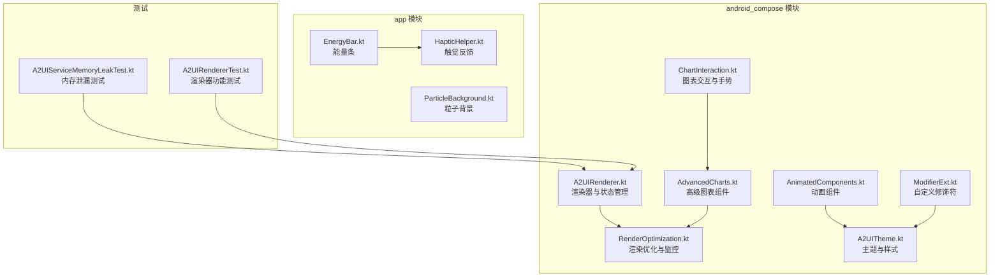
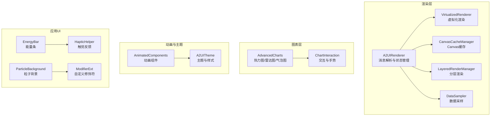
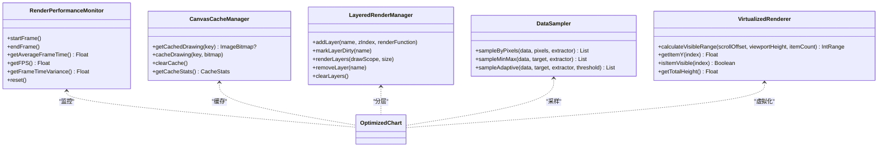
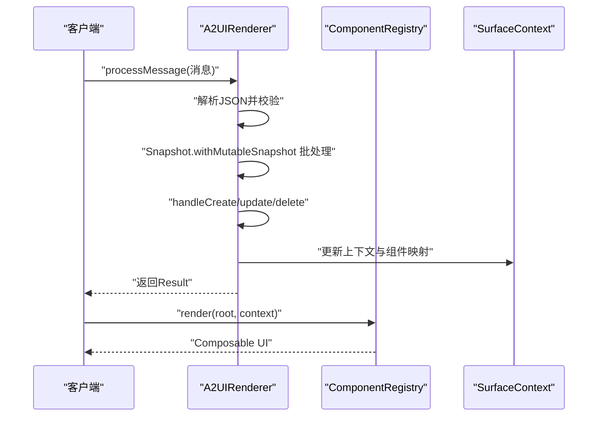
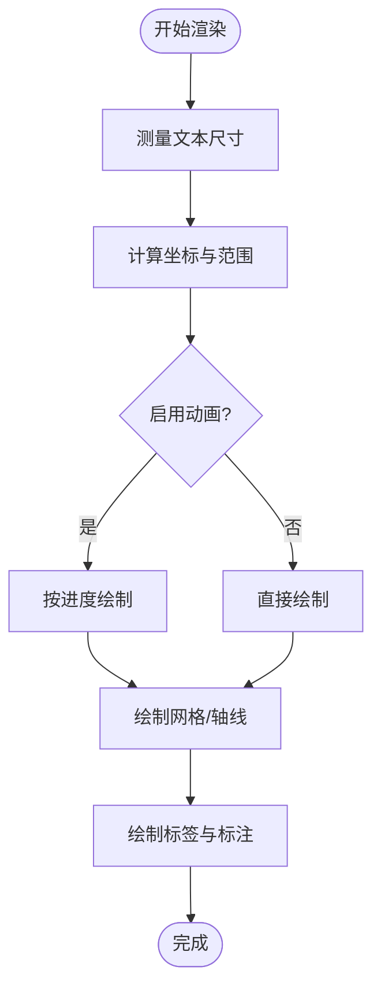
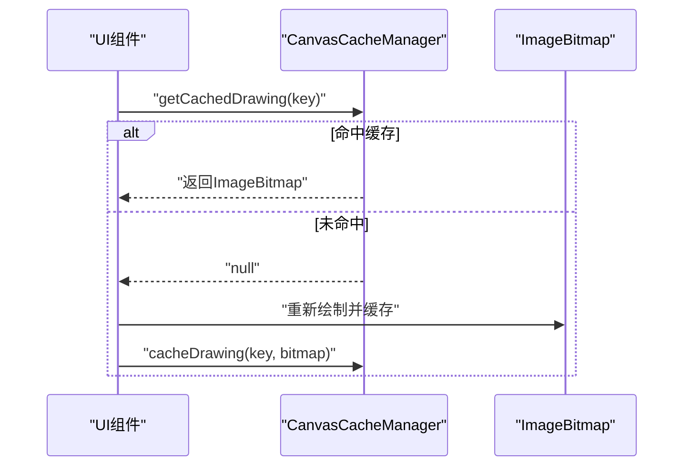
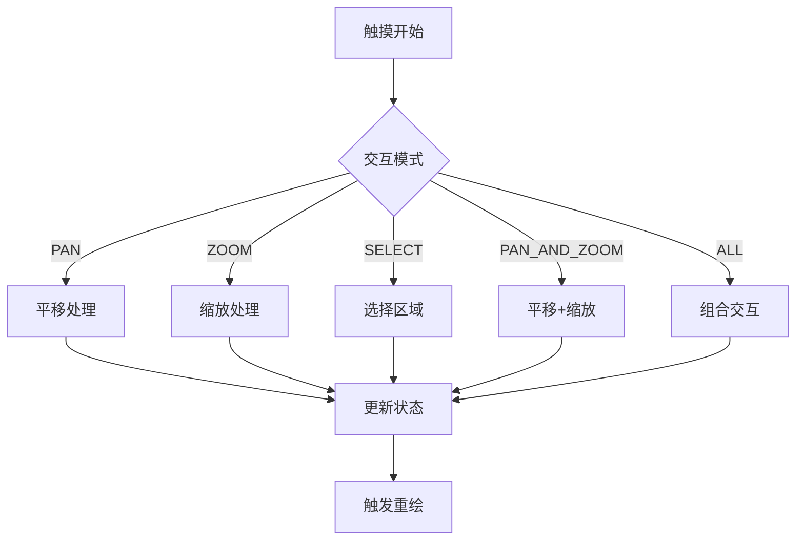
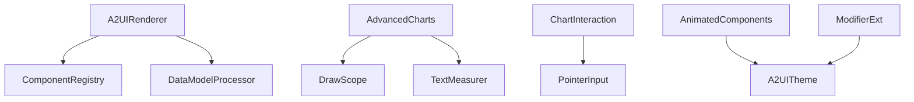

# UI性能优化

<cite>
**本文档引用的文件**
- [RenderOptimization.kt](file://android_compose/src/main/java/org/a2ui/compose/charts/performance/RenderOptimization.kt)
- [A2UIRenderer.kt](file://android_compose/src/main/java/org/a2ui/compose/rendering/A2UIRenderer.kt)
- [A2UIResourceManagementExample.kt](file://android_compose/src/main/java/org/a2ui/compose/example/A2UIResourceManagementExample.kt)
- [AdvancedCharts.kt](file://android_compose/src/main/java/org/a2ui/compose/charts/advanced/AdvancedCharts.kt)
- [ChartInteraction.kt](file://android_compose/src/main/java/org/a2ui/compose/charts/interaction/ChartInteraction.kt)
- [AnimatedComponents.kt](file://android_compose/src/main/java/org/a2ui/compose/animation/AnimatedComponents.kt)
- [A2UITheme.kt](file://android_compose/src/main/java/org/a2ui/compose/theme/A2UITheme.kt)
- [ModifierExt.kt](file://app/src/main/java/ai/openclaw/android/ui/theme/ModifierExt.kt)
- [EnergyBar.kt](file://app/src/main/java/ai/openclaw/android/ui/components/EnergyBar.kt)
- [ParticleBackground.kt](file://app/src/main/java/ai/openclaw/android/ui/components/ParticleBackground.kt)
- [HapticHelper.kt](file://app/src/main/java/ai/openclaw/android/ui/components/HapticHelper.kt)
- [A2UIServiceMemoryLeakTest.kt](file://android_compose/src/test/java/org/a2ui/compose/service/A2UIServiceMemoryLeakTest.kt)
- [A2UIRendererTest.kt](file://android_compose/src/test/java/org/a2ui/compose/rendering/A2UIRendererTest.kt)
</cite>

## 目录
1. [简介](#简介)
2. [项目结构](#项目结构)
3. [核心组件](#核心组件)
4. [架构概览](#架构概览)
5. [详细组件分析](#详细组件分析)
6. [依赖关系分析](#依赖关系分析)
7. [性能考量](#性能考量)
8. [故障排除指南](#故障排除指南)
9. [结论](#结论)
10. [附录](#附录)

## 简介
本技术文档聚焦于Android应用中的UI性能优化，基于仓库中现有的Compose UI渲染、图表渲染、资源管理与性能监控等模块，系统阐述以下主题：
- UI渲染性能的关键指标与测量方法
- 状态重组的优化策略与重组范围控制
- 资源加载与缓存机制的实现原理
- 手势处理与触摸响应的性能优化技巧
- 图表渲染与复杂UI的性能调优方案
- UI性能监控与调试工具的使用指导
- 内存泄漏预防与资源释放的最佳实践

## 项目结构
该仓库采用模块化组织方式，UI性能优化相关的核心代码主要分布在以下模块：
- android_compose：包含Compose UI渲染引擎、图表组件、动画与主题、性能优化工具等
- app：包含应用层UI组件与示例，如粒子背景、能量条、触觉反馈等
- 测试模块：覆盖渲染器与服务的内存泄漏测试与功能验证

**图表来源**
- [RenderOptimization.kt:1-523](file://android_compose/src/main/java/org/a2ui/compose/charts/performance/RenderOptimization.kt#L1-L523)
- [A2UIRenderer.kt:1-660](file://android_compose/src/main/java/org/a2ui/compose/rendering/A2UIRenderer.kt#L1-L660)
- [AdvancedCharts.kt:1-597](file://android_compose/src/main/java/org/a2ui/compose/charts/advanced/AdvancedCharts.kt#L1-L597)
- [ChartInteraction.kt:1-312](file://android_compose/src/main/java/org/a2ui/compose/charts/interaction/ChartInteraction.kt#L1-L312)
- [AnimatedComponents.kt:1-245](file://android_compose/src/main/java/org/a2ui/compose/animation/AnimatedComponents.kt#L1-L245)
- [A2UITheme.kt:1-335](file://android_compose/src/main/java/org/a2ui/compose/theme/A2UITheme.kt#L1-L335)
- [ModifierExt.kt:1-85](file://app/src/main/java/ai/openclaw/android/ui/theme/ModifierExt.kt#L1-L85)
- [EnergyBar.kt:1-51](file://app/src/main/java/ai/openclaw/android/ui/components/EnergyBar.kt#L1-L51)
- [ParticleBackground.kt:1-34](file://app/src/main/java/ai/openclaw/android/ui/components/ParticleBackground.kt#L1-L34)
- [HapticHelper.kt:1-21](file://app/src/main/java/ai/openclaw/android/ui/components/HapticHelper.kt#L1-L21)
- [A2UIServiceMemoryLeakTest.kt:1-149](file://android_compose/src/test/java/org/a2ui/compose/service/A2UIServiceMemoryLeakTest.kt#L1-L149)
- [A2UIRendererTest.kt:1-315](file://android_compose/src/test/java/org/a2ui/compose/rendering/A2UIRendererTest.kt#L1-L315)

**章节来源**
- [RenderOptimization.kt:1-523](file://android_compose/src/main/java/org/a2ui/compose/charts/performance/RenderOptimization.kt#L1-L523)
- [A2UIRenderer.kt:1-660](file://android_compose/src/main/java/org/a2ui/compose/rendering/A2UIRenderer.kt#L1-L660)

## 核心组件
本节从性能角度梳理关键组件及其职责：
- 渲染优化与监控：提供虚拟化渲染、Canvas缓存、分层渲染、数据采样与性能监控等能力
- 渲染器：负责消息解析、组件树构建、状态变更批处理与错误管理
- 图表组件：高性能Canvas绘制、动画过渡与交互手势
- 动画与主题：统一的动画配置与主题系统，支持按需禁用动画以降低开销
- 资源管理：示例展示正确的资源生命周期管理与自动清理模式
- 应用级UI组件：粒子背景、能量条、触觉反馈等，强调轻量与可复用性

**章节来源**
- [RenderOptimization.kt:1-523](file://android_compose/src/main/java/org/a2ui/compose/charts/performance/RenderOptimization.kt#L1-L523)
- [A2UIRenderer.kt:1-660](file://android_compose/src/main/java/org/a2ui/compose/rendering/A2UIRenderer.kt#L1-L660)
- [AdvancedCharts.kt:1-597](file://android_compose/src/main/java/org/a2ui/compose/charts/advanced/AdvancedCharts.kt#L1-L597)
- [AnimatedComponents.kt:1-245](file://android_compose/src/main/java/org/a2ui/compose/animation/AnimatedComponents.kt#L1-L245)
- [A2UITheme.kt:1-335](file://android_compose/src/main/java/org/a2ui/compose/theme/A2UITheme.kt#L1-L335)
- [A2UIResourceManagementExample.kt:1-313](file://android_compose/src/main/java/org/a2ui/compose/example/A2UIResourceManagementExample.kt#L1-L313)

## 架构概览
下图展示了UI渲染与性能优化的整体架构，包括渲染器、图表组件、交互层、动画与主题系统以及资源管理。

**图表来源**
- [A2UIRenderer.kt:64-577](file://android_compose/src/main/java/org/a2ui/compose/rendering/A2UIRenderer.kt#L64-L577)
- [RenderOptimization.kt:22-523](file://android_compose/src/main/java/org/a2ui/compose/charts/performance/RenderOptimization.kt#L22-L523)
- [AdvancedCharts.kt:95-206](file://android_compose/src/main/java/org/a2ui/compose/charts/advanced/AdvancedCharts.kt#L95-L206)
- [ChartInteraction.kt:14-312](file://android_compose/src/main/java/org/a2ui/compose/charts/interaction/ChartInteraction.kt#L14-L312)
- [AnimatedComponents.kt:17-245](file://android_compose/src/main/java/org/a2ui/compose/animation/AnimatedComponents.kt#L17-L245)
- [A2UITheme.kt:57-335](file://android_compose/src/main/java/org/a2ui/compose/theme/A2UITheme.kt#L57-L335)
- [EnergyBar.kt:20-51](file://app/src/main/java/ai/openclaw/android/ui/components/EnergyBar.kt#L20-L51)
- [ParticleBackground.kt:14-34](file://app/src/main/java/ai/openclaw/android/ui/components/ParticleBackground.kt#L14-L34)
- [HapticHelper.kt:9-21](file://app/src/main/java/ai/openclaw/android/ui/components/HapticHelper.kt#L9-L21)
- [ModifierExt.kt:18-85](file://app/src/main/java/ai/openclaw/android/ui/theme/ModifierExt.kt#L18-L85)

## 详细组件分析

### 渲染性能监控与优化
- 渲染性能监控器记录每帧耗时，计算平均帧时间、FPS与帧时间方差，用于识别卡顿与性能退化
- Canvas缓存管理器对绘制结果进行缓存，支持LRU式清理与命中率统计
- 分层渲染管理器将复杂绘制拆分为多层，仅在脏标记或缓存缺失时重新渲染
- 数据采样器提供像素采样、最值采样与自适应采样，降低大数据集渲染成本
- 虚拟化渲染器按可视范围计算可见项目区间，减少不必要的绘制

**图表来源**
- [RenderOptimization.kt:167-523](file://android_compose/src/main/java/org/a2ui/compose/charts/performance/RenderOptimization.kt#L167-L523)

**章节来源**
- [RenderOptimization.kt:167-523](file://android_compose/src/main/java/org/a2ui/compose/charts/performance/RenderOptimization.kt#L167-L523)

### 渲染器与状态重组优化
- 渲染器采用快照原子更新，将多次状态变更合并为单次重组，避免频繁重组
- 通过流式接口暴露表面状态与组件变更，便于按需渲染与订阅
- 提供错误收集与处理，限制错误队列大小，采用FIFO淘汰策略
- 支持保存与恢复渲染状态，便于进程重建后的快速恢复

**图表来源**
- [A2UIRenderer.kt:108-171](file://android_compose/src/main/java/org/a2ui/compose/rendering/A2UIRenderer.kt#L108-L171)
- [A2UIRenderer.kt:395-407](file://android_compose/src/main/java/org/a2ui/compose/rendering/A2UIRenderer.kt#L395-L407)

**章节来源**
- [A2UIRenderer.kt:108-171](file://android_compose/src/main/java/org/a2ui/compose/rendering/A2UIRenderer.kt#L108-L171)
- [A2UIRenderer.kt:395-407](file://android_compose/src/main/java/org/a2ui/compose/rendering/A2UIRenderer.kt#L395-L407)

### 图表渲染与交互优化
- 高级图表组件使用Canvas直接绘制，支持动画进度与文本度量器，按需启用动画
- 图表交互状态封装缩放、平移、选择与边界约束，提供手势识别与事件回调
- 通过动画组件与主题系统统一控制过渡效果，必要时可禁用动画以提升性能

**图表来源**
- [AdvancedCharts.kt:211-311](file://android_compose/src/main/java/org/a2ui/compose/charts/advanced/AdvancedCharts.kt#L211-L311)
- [AdvancedCharts.kt:316-376](file://android_compose/src/main/java/org/a2ui/compose/charts/advanced/AdvancedCharts.kt#L316-L376)
- [AdvancedCharts.kt:381-442](file://android_compose/src/main/java/org/a2ui/compose/charts/advanced/AdvancedCharts.kt#L381-L442)

**章节来源**
- [AdvancedCharts.kt:95-206](file://android_compose/src/main/java/org/a2ui/compose/charts/advanced/AdvancedCharts.kt#L95-L206)
- [ChartInteraction.kt:14-312](file://android_compose/src/main/java/org/a2ui/compose/charts/interaction/ChartInteraction.kt#L14-L312)

### 资源加载与缓存机制
- Canvas缓存管理器对ImageBitmap进行缓存，支持LRU清理与命中率统计
- 分层渲染将昂贵的绘制操作离屏缓存，减少重复绘制
- 数据采样器在大数据集场景下显著降低绘制点数，提高响应速度

**图表来源**
- [RenderOptimization.kt:77-156](file://android_compose/src/main/java/org/a2ui/compose/charts/performance/RenderOptimization.kt#L77-L156)

**章节来源**
- [RenderOptimization.kt:77-156](file://android_compose/src/main/java/org/a2ui/compose/charts/performance/RenderOptimization.kt#L77-L156)

### 手势处理与触摸响应优化
- 图表交互状态封装缩放、平移与选择，支持边界约束与双击缩放
- 手势识别器按配置启用不同交互模式，避免不必要的计算
- 通过动画组件与主题系统控制微交互，平衡体验与性能

**图表来源**
- [ChartInteraction.kt:15-117](file://android_compose/src/main/java/org/a2ui/compose/charts/interaction/ChartInteraction.kt#L15-L117)
- [ChartInteraction.kt:183-312](file://android_compose/src/main/java/org/a2ui/compose/charts/interaction/ChartInteraction.kt#L183-L312)

**章节来源**
- [ChartInteraction.kt:15-117](file://android_compose/src/main/java/org/a2ui/compose/charts/interaction/ChartInteraction.kt#L15-L117)
- [ChartInteraction.kt:183-312](file://android_compose/src/main/java/org/a2ui/compose/charts/interaction/ChartInteraction.kt#L183-L312)

### 复杂UI与动画性能调优
- 动画组件支持按主题配置启用/禁用数据过渡与微交互，避免不必要的重绘
- 主题系统提供统一的颜色、字体与动画参数，便于整体性能调优
- 自定义修饰符（如霓虹边框、渐变分割线）在高版本系统上启用原生特性，在低版本降级处理

**章节来源**
- [AnimatedComponents.kt:17-245](file://android_compose/src/main/java/org/a2ui/compose/animation/AnimatedComponents.kt#L17-L245)
- [A2UITheme.kt:57-335](file://android_compose/src/main/java/org/a2ui/compose/theme/A2UITheme.kt#L57-L335)
- [ModifierExt.kt:18-85](file://app/src/main/java/ai/openclaw/android/ui/theme/ModifierExt.kt#L18-L85)

### 应用级UI组件示例
- 能量条使用动画过渡，仅在焦点状态变化时触发
- 粒子背景通过低透明度图像实现轻量装饰
- 触觉反馈提供确认、长按与错误反馈，增强交互体验

**章节来源**
- [EnergyBar.kt:20-51](file://app/src/main/java/ai/openclaw/android/ui/components/EnergyBar.kt#L20-L51)
- [ParticleBackground.kt:14-34](file://app/src/main/java/ai/openclaw/android/ui/components/ParticleBackground.kt#L14-L34)
- [HapticHelper.kt:9-21](file://app/src/main/java/ai/openclaw/android/ui/components/HapticHelper.kt#L9-L21)

## 依赖关系分析
- 渲染器依赖组件注册表与数据模型处理器，负责消息解析与状态变更
- 图表组件依赖Canvas绘制与文本度量器，结合交互状态实现高性能交互
- 动画与主题系统为UI提供一致的视觉与交互体验，支持按需禁用以优化性能
- 资源管理示例展示正确的生命周期管理与自动清理模式

**图表来源**
- [A2UIRenderer.kt:68-69](file://android_compose/src/main/java/org/a2ui/compose/rendering/A2UIRenderer.kt#L68-L69)
- [AdvancedCharts.kt:113-114](file://android_compose/src/main/java/org/a2ui/compose/charts/advanced/AdvancedCharts.kt#L113-L114)
- [ChartInteraction.kt:190-191](file://android_compose/src/main/java/org/a2ui/compose/charts/interaction/ChartInteraction.kt#L190-L191)
- [AnimatedComponents.kt:17-245](file://android_compose/src/main/java/org/a2ui/compose/animation/AnimatedComponents.kt#L17-L245)
- [A2UITheme.kt:57-335](file://android_compose/src/main/java/org/a2ui/compose/theme/A2UITheme.kt#L57-L335)
- [ModifierExt.kt:18-85](file://app/src/main/java/ai/openclaw/android/ui/theme/ModifierExt.kt#L18-L85)

**章节来源**
- [A2UIRenderer.kt:68-69](file://android_compose/src/main/java/org/a2ui/compose/rendering/A2UIRenderer.kt#L68-L69)
- [AdvancedCharts.kt:113-114](file://android_compose/src/main/java/org/a2ui/compose/charts/advanced/AdvancedCharts.kt#L113-L114)
- [ChartInteraction.kt:190-191](file://android_compose/src/main/java/org/a2ui/compose/charts/interaction/ChartInteraction.kt#L190-L191)

## 性能考量
- 帧时间与FPS：通过性能监控器定期检查帧时间与方差，低于阈值时触发优化策略
- 内存压力：基于JVM内存使用比例评估内存压力，必要时建议触发GC
- 重组频率：使用批处理与原子快照减少重组次数，避免频繁状态更新
- 绘制成本：优先使用Canvas缓存与分层渲染，对大数据集采用数据采样
- 动画开销：按主题配置启用/禁用动画，避免不必要的过渡效果
- 手势响应：合理配置交互模式与灵敏度，避免过度计算

[本节为通用性能指导，不直接分析具体文件]

## 故障排除指南
- 内存泄漏：确保在Activity/Fragment销毁时调用close()，使用DisposableEffect或LifecycleObserver自动清理
- 资源重复创建：避免在异常分支中遗漏资源释放，使用finally块保证清理
- 渲染器状态：通过测试验证渲染器的保存/恢复与错误处理逻辑
- 服务生命周期：setTransport会自动关闭旧传输层，确保在关闭后不再使用已关闭的服务

**章节来源**
- [A2UIResourceManagementExample.kt:51-57](file://android_compose/src/main/java/org/a2ui/compose/example/A2UIResourceManagementExample.kt#L51-L57)
- [A2UIServiceMemoryLeakTest.kt:11-149](file://android_compose/src/test/java/org/a2ui/compose/service/A2UIServiceMemoryLeakTest.kt#L11-L149)
- [A2UIRendererTest.kt:252-296](file://android_compose/src/test/java/org/a2ui/compose/rendering/A2UIRendererTest.kt#L252-L296)

## 结论
本项目通过渲染器的批处理与状态管理、图表组件的Canvas绘制与交互优化、动画与主题系统的统一配置以及资源管理的最佳实践，构建了可扩展且高性能的UI体系。结合性能监控与测试用例，能够有效识别与缓解UI性能问题，保障复杂界面的流畅运行。

[本节为总结性内容，不直接分析具体文件]

## 附录
- 性能监控指标
  - 平均帧时间（毫秒）、FPS、帧时间方差（毫秒）
  - Canvas缓存命中率、分层渲染层数、采样后数据点数
- 优化策略清单
  - 启用批处理与原子快照
  - 使用Canvas缓存与分层渲染
  - 对大数据集进行数据采样
  - 按需禁用动画与微交互
  - 合理配置手势交互模式与灵敏度
  - 正确管理资源生命周期，防止内存泄漏

[本节为补充信息，不直接分析具体文件]