# UI组件系统

<cite>
**本文档引用的文件**
- [A2UIRenderer.kt](file://android_compose/src/main/java/org/a2ui/compose/rendering/A2UIRenderer.kt)
- [ComponentRegistry.kt](file://android_compose/src/main/java/org/a2ui/compose/rendering/ComponentRegistry.kt)
- [A2UITheme.kt](file://android_compose/src/main/java/org/a2ui/compose/theme/A2UITheme.kt)
- [DataModelProcessor.kt](file://android_compose/src/main/java/org/a2ui/compose/data/DataModelProcessor.kt)
- [AnimatedComponents.kt](file://android_compose/src/main/java/org/a2ui/compose/animation/AnimatedComponents.kt)
- [StockCharts.kt](file://android_compose/src/main/java/org/a2ui/compose/charts/StockCharts.kt)
- [A2UICardModels.kt](file://app/src/main/java/ai/openclaw/android/ui/A2UICardModels.kt)
- [A2UICards.kt](file://app/src/main/java/ai/openclaw/android/ui/A2UICards.kt)
- [MarkdownRenderer.kt](file://app/src/main/java/ai/openclaw/android/ui/MarkdownRenderer.kt)
- [Theme.kt](file://app/src/main/java/ai/openclaw/android/ui/theme/Theme.kt)
- [Color.kt](file://app/src/main/java/ai/openclaw/android/ui/theme/Color.kt)
</cite>

## 目录
1. [简介](#简介)
2. [项目结构](#项目结构)
3. [核心组件](#核心组件)
4. [架构总览](#架构总览)
5. [详细组件分析](#详细组件分析)
6. [依赖关系分析](#依赖关系分析)
7. [性能考虑](#性能考虑)
8. [故障排查指南](#故障排查指南)
9. [结论](#结论)
10. [附录](#附录)

## 简介
本文件系统性梳理了基于 Jetpack Compose 的 UI 组件体系，重点覆盖以下方面：
- A2UI 协议驱动的声明式渲染架构与组件注册机制
- A2UI 卡片系统的数据模型、渲染流程与富文本显示
- Markdown 渲染器的解析与展示机制
- 主题系统与样式定制（颜色、字体、动效）
- 动画与视觉效果、交互设计与可访问性
- 响应式设计与性能优化策略
- 使用示例与自定义开发指导

## 项目结构
该工程采用模块化组织，核心 UI 能力集中在 android_compose 模块中，应用层 UI 组件与主题位于 app 模块。

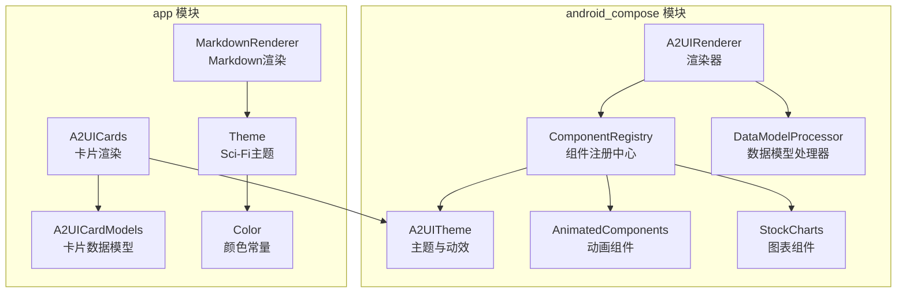

**图表来源**
- [A2UIRenderer.kt:64-101](file://android_compose/src/main/java/org/a2ui/compose/rendering/A2UIRenderer.kt#L64-L101)
- [ComponentRegistry.kt:74-109](file://android_compose/src/main/java/org/a2ui/compose/rendering/ComponentRegistry.kt#L74-L109)
- [A2UITheme.kt:173-253](file://android_compose/src/main/java/org/a2ui/compose/theme/A2UITheme.kt#L173-L253)
- [DataModelProcessor.kt:8-51](file://android_compose/src/main/java/org/a2ui/compose/data/DataModelProcessor.kt#L8-L51)
- [AnimatedComponents.kt:17-61](file://android_compose/src/main/java/org/a2ui/compose/animation/AnimatedComponents.kt#L17-L61)
- [StockCharts.kt:26-59](file://android_compose/src/main/java/org/a2ui/compose/charts/StockCharts.kt#L26-L59)
- [A2UICardModels.kt:83-140](file://app/src/main/java/ai/openclaw/android/ui/A2UICardModels.kt#L83-L140)
- [A2UICards.kt:40-68](file://app/src/main/java/ai/openclaw/android/ui/A2UICards.kt#L40-L68)
- [MarkdownRenderer.kt:45-137](file://app/src/main/java/ai/openclaw/android/ui/MarkdownRenderer.kt#L45-L137)
- [Theme.kt:66-86](file://app/src/main/java/ai/openclaw/android/ui/theme/Theme.kt#L66-L86)
- [Color.kt:7-40](file://app/src/main/java/ai/openclaw/android/ui/theme/Color.kt#L7-L40)

**章节来源**
- [A2UIRenderer.kt:64-101](file://android_compose/src/main/java/org/a2ui/compose/rendering/A2UIRenderer.kt#L64-L101)
- [ComponentRegistry.kt:74-109](file://android_compose/src/main/java/org/a2ui/compose/rendering/ComponentRegistry.kt#L74-L109)
- [A2UITheme.kt:173-253](file://android_compose/src/main/java/org/a2ui/compose/theme/A2UITheme.kt#L173-L253)

## 核心组件
- 渲染器 A2UIRenderer：负责解析消息、管理 Surface、组件与数据模型，提供统一渲染入口与动作分发。
- 组件注册中心 ComponentRegistry：内置大量默认组件（Text、Button、TextField、List、Tabs、Modal 等），并支持自定义组件注册。
- 数据模型 DataModelProcessor：提供动态值解析、函数计算、集合作用域解析与数据更新。
- 主题与动效 A2UITheme：提供颜色方案、排版、玻璃拟态、卡片动效与动画配置。
- 动画组件 AnimatedComponents：提供增强卡片、文本、数值、进度等动画组件。
- 图表组件 StockCharts：提供 K 线图、实时折线图等可视化组件。
- 应用层卡片 A2UICards：面向业务场景的卡片渲染（天气、搜索结果、翻译、提醒、日历、位置等）。
- Markdown 渲染器 MarkdownRenderer：解析 Markdown 并渲染为富文本。
- 主题 Theme/Color：Sci-Fi 科幻风格主题与颜色常量。

**章节来源**
- [A2UIRenderer.kt:64-101](file://android_compose/src/main/java/org/a2ui/compose/rendering/A2UIRenderer.kt#L64-L101)
- [ComponentRegistry.kt:131-151](file://android_compose/src/main/java/org/a2ui/compose/rendering/ComponentRegistry.kt#L131-L151)
- [DataModelProcessor.kt:53-80](file://android_compose/src/main/java/org/a2ui/compose/data/DataModelProcessor.kt#L53-L80)
- [A2UITheme.kt:173-253](file://android_compose/src/main/java/org/a2ui/compose/theme/A2UITheme.kt#L173-L253)
- [AnimatedComponents.kt:17-61](file://android_compose/src/main/java/org/a2ui/compose/animation/AnimatedComponents.kt#L17-L61)
- [StockCharts.kt:26-59](file://android_compose/src/main/java/org/a2ui/compose/charts/StockCharts.kt#L26-L59)
- [A2UICards.kt:175-321](file://app/src/main/java/ai/openclaw/android/ui/A2UICards.kt#L175-L321)
- [MarkdownRenderer.kt:45-137](file://app/src/main/java/ai/openclaw/android/ui/MarkdownRenderer.kt#L45-L137)
- [Theme.kt:66-86](file://app/src/main/java/ai/openclaw/android/ui/theme/Theme.kt#L66-L86)
- [Color.kt:7-40](file://app/src/main/java/ai/openclaw/android/ui/theme/Color.kt#L7-L40)

## 架构总览
A2UI 采用“协议驱动 + 组件注册 + 数据绑定”的声明式架构。应用通过 JSON 协议描述 UI 结构与数据，渲染器解析并按需渲染，支持动态数据与交互事件。

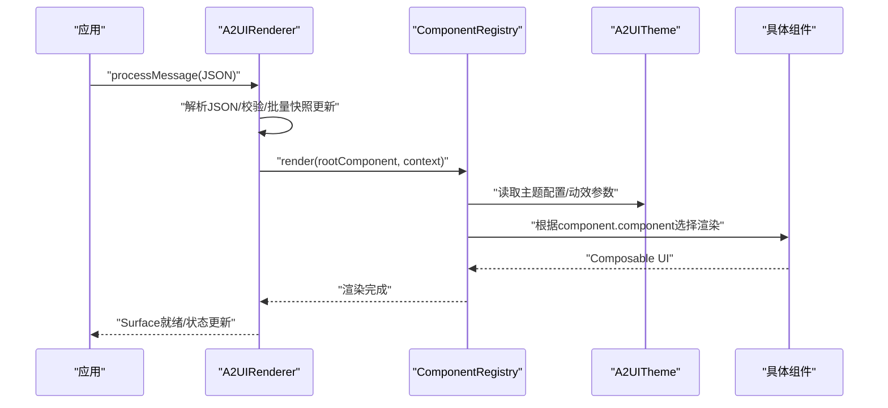

**图表来源**
- [A2UIRenderer.kt:108-171](file://android_compose/src/main/java/org/a2ui/compose/rendering/A2UIRenderer.kt#L108-L171)
- [ComponentRegistry.kt:100-109](file://android_compose/src/main/java/org/a2ui/compose/rendering/ComponentRegistry.kt#L100-L109)
- [A2UITheme.kt:173-253](file://android_compose/src/main/java/org/a2ui/compose/theme/A2UITheme.kt#L173-L253)

## 详细组件分析

### 渲染器与协议处理（A2UIRenderer）
- 支持的消息类型：创建 Surface、更新组件、更新数据模型、删除 Surface。
- 安全与限制：消息大小上限、Surface 与组件数量上限、URL Scheme 白名单、错误队列 FIFO 淘汰。
- 数据模型：DataModelProcessor 提供动态值解析与函数计算，支持集合作用域路径解析。
- 动作处理：ActionHandler 接口统一处理事件与本地函数（如 openUrl、showToast）。

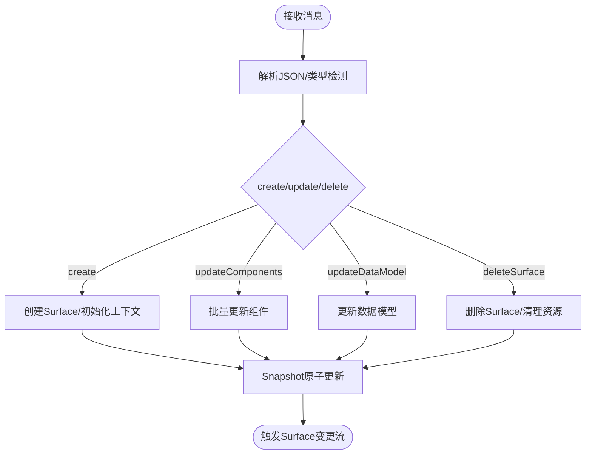

**图表来源**
- [A2UIRenderer.kt:108-171](file://android_compose/src/main/java/org/a2ui/compose/rendering/A2UIRenderer.kt#L108-L171)
- [A2UIRenderer.kt:210-282](file://android_compose/src/main/java/org/a2ui/compose/rendering/A2UIRenderer.kt#L210-L282)

**章节来源**
- [A2UIRenderer.kt:83-91](file://android_compose/src/main/java/org/a2ui/compose/rendering/A2UIRenderer.kt#L83-L91)
- [A2UIRenderer.kt:108-171](file://android_compose/src/main/java/org/a2ui/compose/rendering/A2UIRenderer.kt#L108-L171)
- [A2UIRenderer.kt:210-282](file://android_compose/src/main/java/org/a2ui/compose/rendering/A2UIRenderer.kt#L210-L282)
- [DataModelProcessor.kt:53-80](file://android_compose/src/main/java/org/a2ui/compose/data/DataModelProcessor.kt#L53-L80)

### 组件注册中心（ComponentRegistry）
- 默认组件：Text、Button、Row、Column、TextField、CheckBox、Card、Image、Icon、Divider、Slider、ChoicePicker、List、Tabs、Modal、StockCard 等。
- 渲染流程：优先自定义组件，其次默认组件，最后兜底默认渲染；支持嵌套渲染与最大深度保护。
- 集合作用域：List 组件支持模板渲染与集合作用域路径，便于复用复杂列表。
- 可访问性：为按钮、复选框等组件设置语义角色与 live region。

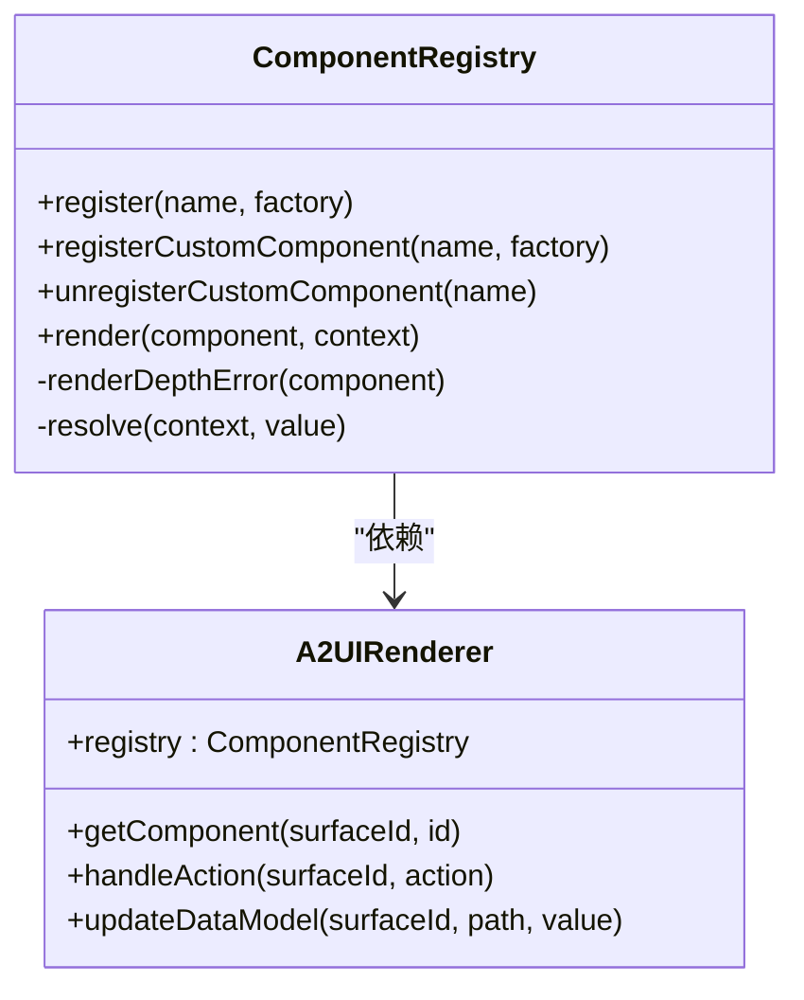

**图表来源**
- [ComponentRegistry.kt:74-109](file://android_compose/src/main/java/org/a2ui/compose/rendering/ComponentRegistry.kt#L74-L109)
- [A2UIRenderer.kt:300-420](file://android_compose/src/main/java/org/a2ui/compose/rendering/A2UIRenderer.kt#L300-L420)

**章节来源**
- [ComponentRegistry.kt:131-151](file://android_compose/src/main/java/org/a2ui/compose/rendering/ComponentRegistry.kt#L131-L151)
- [ComponentRegistry.kt:650-723](file://android_compose/src/main/java/org/a2ui/compose/rendering/ComponentRegistry.kt#L650-L723)

### 主题系统与动效（A2UITheme）
- 颜色方案：支持十六进制解析、明暗主题、Material3 颜色映射与自定义主色/背景/表面色。
- 排版：预置标题、正文、标签等多级排版样式。
- 动效：卡片进入/退出过渡、动画规格、微交互（按钮按压缩放）、列表交错/波浪/级联入场。
- 视觉增强：玻璃拟态修饰器、增强卡片阴影与颜色。

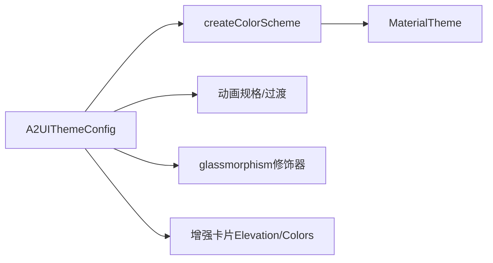

**图表来源**
- [A2UITheme.kt:114-171](file://android_compose/src/main/java/org/a2ui/compose/theme/A2UITheme.kt#L114-L171)
- [A2UITheme.kt:304-334](file://android_compose/src/main/java/org/a2ui/compose/theme/A2UITheme.kt#L304-L334)

**章节来源**
- [A2UITheme.kt:57-84](file://android_compose/src/main/java/org/a2ui/compose/theme/A2UITheme.kt#L57-L84)
- [A2UITheme.kt:114-171](file://android_compose/src/main/java/org/a2ui/compose/theme/A2UITheme.kt#L114-L171)
- [A2UITheme.kt:260-334](file://android_compose/src/main/java/org/a2ui/compose/theme/A2UITheme.kt#L260-L334)

### 动画组件（AnimatedComponents）
- AnimatedCard：带玻璃拟态、阴影与尺寸动画的卡片容器。
- AnimatedText/AnimatedNumber：文本与数值的淡入、缩放与插值动画。
- AnimatedButton：按钮按压微交互（弹性缩放）。
- AnimatedListItem：列表项交错/波浪/级联入场。
- AnimatedProgressIndicator：进度条数据过渡动画。

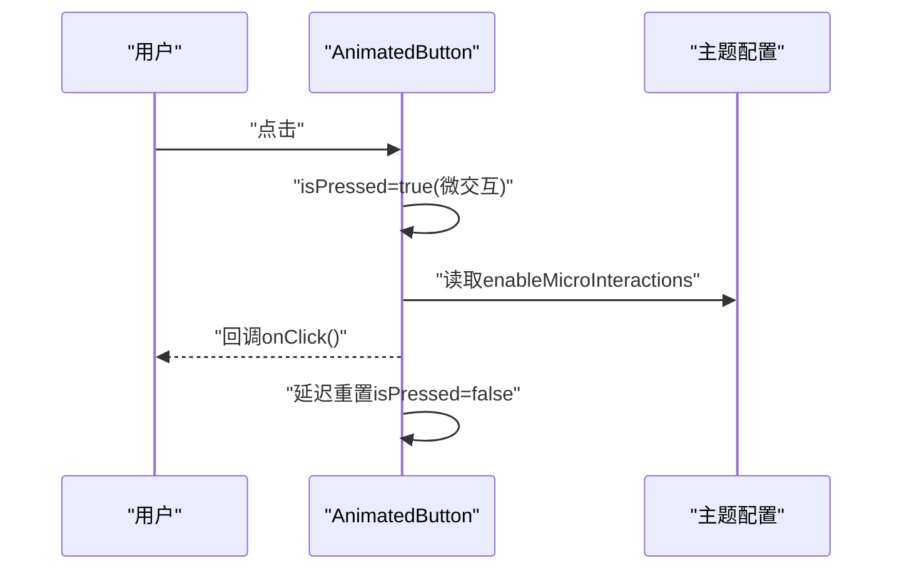

**图表来源**
- [AnimatedComponents.kt:110-149](file://android_compose/src/main/java/org/a2ui/compose/animation/AnimatedComponents.kt#L110-L149)

**章节来源**
- [AnimatedComponents.kt:17-61](file://android_compose/src/main/java/org/a2ui/compose/animation/AnimatedComponents.kt#L17-L61)
- [AnimatedComponents.kt:110-149](file://android_compose/src/main/java/org/a2ui/compose/animation/AnimatedComponents.kt#L110-L149)
- [AnimatedComponents.kt:154-192](file://android_compose/src/main/java/org/a2ui/compose/animation/AnimatedComponents.kt#L154-L192)

### 图表组件（StockCharts）
- K 线图：支持网格、时间标签、阳线/阴线绘制与逐根动画。
- 实时折线图：路径绘制、面积填充、数据点绘制与路径裁剪动画。

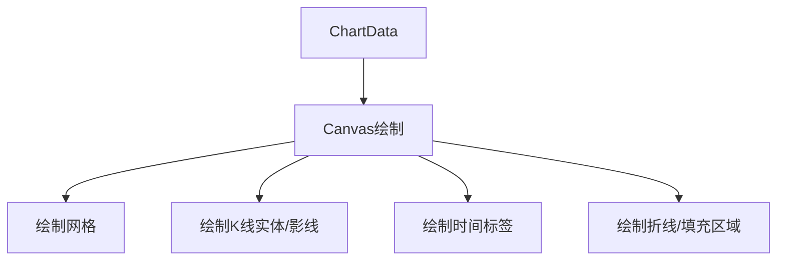

**图表来源**
- [StockCharts.kt:64-130](file://android_compose/src/main/java/org/a2ui/compose/charts/StockCharts.kt#L64-L130)
- [StockCharts.kt:298-386](file://android_compose/src/main/java/org/a2ui/compose/charts/StockCharts.kt#L298-L386)

**章节来源**
- [StockCharts.kt:26-59](file://android_compose/src/main/java/org/a2ui/compose/charts/StockCharts.kt#L26-L59)
- [StockCharts.kt:64-130](file://android_compose/src/main/java/org/a2ui/compose/charts/StockCharts.kt#L64-L130)
- [StockCharts.kt:298-386](file://android_compose/src/main/java/org/a2ui/compose/charts/StockCharts.kt#L298-L386)

### A2UI 卡片系统
- 数据模型：A2UICard 统一卡片结构，支持多种类型（天气、搜索结果、翻译、提醒、日历、位置、设置、错误、信息、摘要等），并提供类型安全访问器。
- 解析器：A2UICardParser 支持 v2 JSON 与 v1 旧格式回退，提取卡片片段。
- 渲染：A2UICards 提供科幻风格卡片容器与头部、动作按钮栏，以及各卡片类型的专用渲染逻辑。

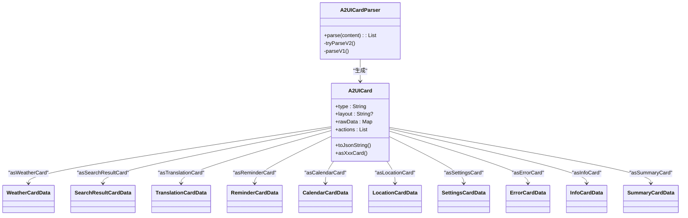

**图表来源**
- [A2UICardModels.kt:83-140](file://app/src/main/java/ai/openclaw/android/ui/A2UICardModels.kt#L83-L140)
- [A2UICardModels.kt:164-200](file://app/src/main/java/ai/openclaw/android/ui/A2UICardModels.kt#L164-L200)
- [A2UICardModels.kt:210-236](file://app/src/main/java/ai/openclaw/android/ui/A2UICardModels.kt#L210-L236)
- [A2UICardModels.kt:246-264](file://app/src/main/java/ai/openclaw/android/ui/A2UICardModels.kt#L246-L264)
- [A2UICardModels.kt:269-303](file://app/src/main/java/ai/openclaw/android/ui/A2UICardModels.kt#L269-L303)
- [A2UICardModels.kt:305-335](file://app/src/main/java/ai/openclaw/android/ui/A2UICardModels.kt#L305-L335)
- [A2UICardModels.kt:337-367](file://app/src/main/java/ai/openclaw/android/ui/A2UICardModels.kt#L337-L367)
- [A2UICardModels.kt:435-450](file://app/src/main/java/ai/openclaw/android/ui/A2UICardModels.kt#L435-L450)
- [A2UICardModels.kt:452-467](file://app/src/main/java/ai/openclaw/android/ui/A2UICardModels.kt#L452-L467)
- [A2UICardModels.kt:469-486](file://app/src/main/java/ai/openclaw/android/ui/A2UICardModels.kt#L469-L486)
- [A2UICardModels.kt:488-504](file://app/src/main/java/ai/openclaw/android/ui/A2UICardModels.kt#L488-L504)
- [A2UICardModels.kt:507-524](file://app/src/main/java/ai/openclaw/android/ui/A2UICardModels.kt#L507-L524)
- [A2UICardModels.kt:541-637](file://app/src/main/java/ai/openclaw/android/ui/A2UICardModels.kt#L541-L637)

**章节来源**
- [A2UICardModels.kt:83-140](file://app/src/main/java/ai/openclaw/android/ui/A2UICardModels.kt#L83-L140)
- [A2UICardModels.kt:541-637](file://app/src/main/java/ai/openclaw/android/ui/A2UICardModels.kt#L541-L637)
- [A2UICards.kt:175-321](file://app/src/main/java/ai/openclaw/android/ui/A2UICards.kt#L175-L321)
- [A2UICards.kt:323-440](file://app/src/main/java/ai/openclaw/android/ui/A2UICards.kt#L323-L440)
- [A2UICards.kt:442-535](file://app/src/main/java/ai/openclaw/android/ui/A2UICards.kt#L442-L535)
- [A2UICards.kt:537-663](file://app/src/main/java/ai/openclaw/android/ui/A2UICards.kt#L537-L663)
- [A2UICards.kt:665-762](file://app/src/main/java/ai/openclaw/android/ui/A2UICards.kt#L665-L762)

### Markdown 渲染器
- 解析：支持代码块、水平分割线、引用块、有序/无序列表与段落合并。
- 行内样式：粗体、斜体、粗斜体、行内代码、链接、删除线。
- 渲染：构建 AnnotatedString 并渲染为 Text，列表项与引用块有独立视图。

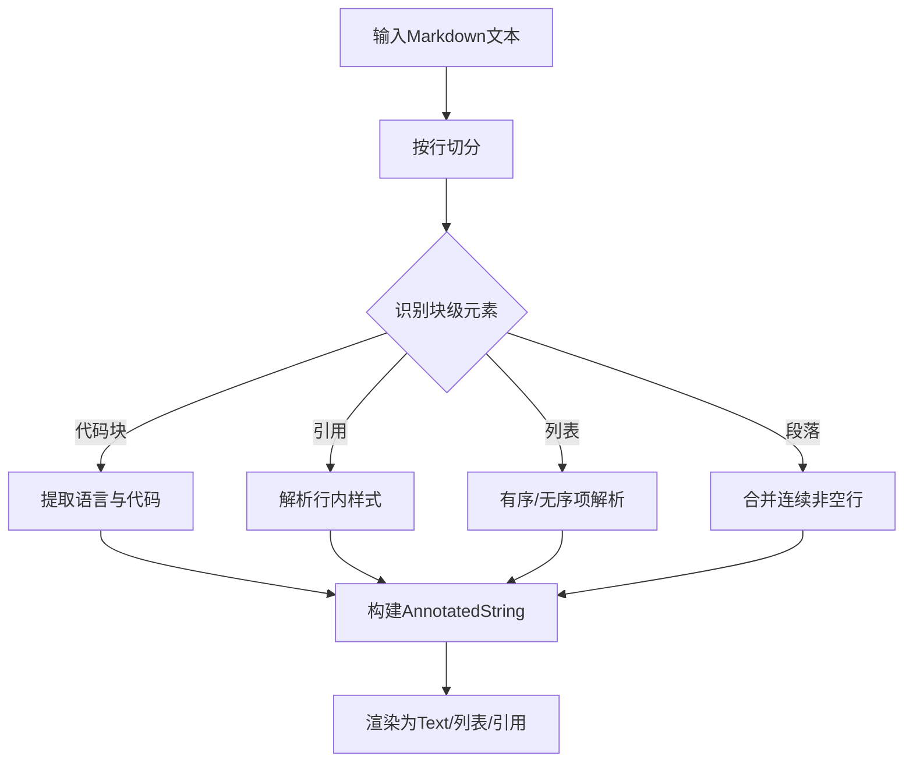

**图表来源**
- [MarkdownRenderer.kt:45-137](file://app/src/main/java/ai/openclaw/android/ui/MarkdownRenderer.kt#L45-L137)
- [MarkdownRenderer.kt:187-237](file://app/src/main/java/ai/openclaw/android/ui/MarkdownRenderer.kt#L187-L237)

**章节来源**
- [MarkdownRenderer.kt:45-137](file://app/src/main/java/ai/openclaw/android/ui/MarkdownRenderer.kt#L45-L137)
- [MarkdownRenderer.kt:187-237](file://app/src/main/java/ai/openclaw/android/ui/MarkdownRenderer.kt#L187-L237)
- [MarkdownRenderer.kt:241-278](file://app/src/main/java/ai/openclaw/android/ui/MarkdownRenderer.kt#L241-L278)

### 主题与样式定制
- 应用层主题：Sci-Fi 暗色主题，深海蓝与青色霓虹为主色调，适配状态栏。
- 颜色常量：提供背景、表面、强调色、文字色、装饰色等完整色板。
- 组件样式：卡片容器、按钮样式、列表项样式均与主题色板保持一致。

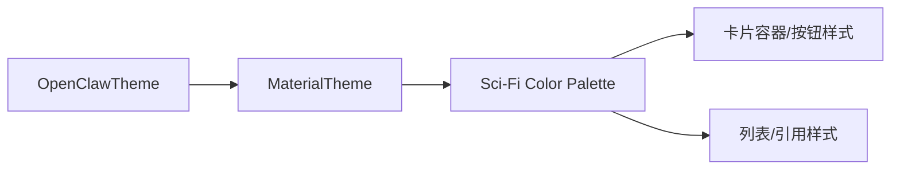

**图表来源**
- [Theme.kt:66-86](file://app/src/main/java/ai/openclaw/android/ui/theme/Theme.kt#L66-L86)
- [Color.kt:7-40](file://app/src/main/java/ai/openclaw/android/ui/theme/Color.kt#L7-L40)

**章节来源**
- [Theme.kt:66-86](file://app/src/main/java/ai/openclaw/android/ui/theme/Theme.kt#L66-L86)
- [Color.kt:7-40](file://app/src/main/java/ai/openclaw/android/ui/theme/Color.kt#L7-L40)

## 依赖关系分析
- 渲染器依赖组件注册中心与数据模型处理器，组件注册中心依赖主题与动画模块。
- 应用层卡片依赖主题与颜色常量，Markdown 渲染依赖应用层主题。
- 图表组件依赖主题配置进行动画与样式控制。

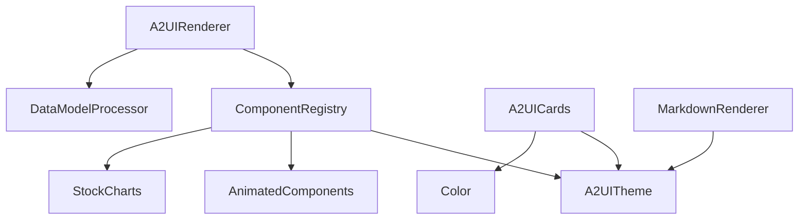

**图表来源**
- [A2UIRenderer.kt:64-101](file://android_compose/src/main/java/org/a2ui/compose/rendering/A2UIRenderer.kt#L64-L101)
- [ComponentRegistry.kt:74-109](file://android_compose/src/main/java/org/a2ui/compose/rendering/ComponentRegistry.kt#L74-L109)
- [A2UITheme.kt:173-253](file://android_compose/src/main/java/org/a2ui/compose/theme/A2UITheme.kt#L173-L253)
- [AnimatedComponents.kt:17-61](file://android_compose/src/main/java/org/a2ui/compose/animation/AnimatedComponents.kt#L17-L61)
- [StockCharts.kt:26-59](file://android_compose/src/main/java/org/a2ui/compose/charts/StockCharts.kt#L26-L59)
- [A2UICards.kt:40-68](file://app/src/main/java/ai/openclaw/android/ui/A2UICards.kt#L40-L68)
- [MarkdownRenderer.kt:241-278](file://app/src/main/java/ai/openclaw/android/ui/MarkdownRenderer.kt#L241-L278)

**章节来源**
- [A2UIRenderer.kt:64-101](file://android_compose/src/main/java/org/a2ui/compose/rendering/A2UIRenderer.kt#L64-L101)
- [ComponentRegistry.kt:74-109](file://android_compose/src/main/java/org/a2ui/compose/rendering/ComponentRegistry.kt#L74-L109)

## 性能考虑
- 渲染批处理：使用 Snapshot.withMutableSnapshot 将多次状态更新合并为一次重组，避免频繁重组。
- 组件限制：Surface 与组件数量上限、消息大小限制，防止内存膨胀。
- 动画开关：通过主题配置控制动画、微交互与数据过渡，降低低端设备压力。
- 列表优化：Lazy 列表与键值缓存，减少不必要的重组。
- 图表动画：按需启用动画，Canvas 绘制采用路径裁剪与渐进绘制。
- URL 校验：仅允许白名单协议，避免不安全加载。

**章节来源**
- [A2UIRenderer.kt:151-162](file://android_compose/src/main/java/org/a2ui/compose/rendering/A2UIRenderer.kt#L151-L162)
- [A2UIRenderer.kt:83-91](file://android_compose/src/main/java/org/a2ui/compose/rendering/A2UIRenderer.kt#L83-L91)
- [ComponentRegistry.kt:650-723](file://android_compose/src/main/java/org/a2ui/compose/rendering/ComponentRegistry.kt#L650-L723)
- [AnimatedComponents.kt:17-61](file://android_compose/src/main/java/org/a2ui/compose/animation/AnimatedComponents.kt#L17-L61)
- [StockCharts.kt:33-58](file://android_compose/src/main/java/org/a2ui/compose/charts/StockCharts.kt#L33-L58)

## 故障排查指南
- 渲染错误：查看 A2UIRenderer 的错误队列与错误状态，定位解析异常或组件缺失。
- 组件缺失：当引用组件不存在时，渲染器会记录警告并回退为文本组件，检查组件 ID 与绑定路径。
- URL 安全：被拦截的 URL 将记录警告，检查 URL Scheme 是否在白名单中。
- 数据模型：使用 DataModelProcessor 的动态值解析与函数计算，确保路径正确与作用域匹配。

**章节来源**
- [A2UIRenderer.kt:173-184](file://android_compose/src/main/java/org/a2ui/compose/rendering/A2UIRenderer.kt#L173-L184)
- [A2UIRenderer.kt:469-499](file://android_compose/src/main/java/org/a2ui/compose/rendering/A2UIRenderer.kt#L469-L499)
- [ComponentRegistry.kt:506-518](file://android_compose/src/main/java/org/a2ui/compose/rendering/ComponentRegistry.kt#L506-L518)

## 结论
该 UI 组件系统以 A2UI 协议为核心，结合组件注册中心、主题与动画模块，实现了高扩展性的声明式 UI 架构。应用层卡片与 Markdown 渲染进一步丰富了内容表达能力。通过严格的限制与可配置的动画策略，系统在功能完整性与性能稳定性之间取得平衡。建议在实际开发中充分利用集合作用域、自定义组件注册与主题配置，以获得更好的可维护性与一致性。

## 附录
- 使用示例与自定义开发指导
  - 自定义组件：通过 ComponentRegistry.registerCustomComponent 注册，遵循 Composable 签名并在 render 中处理上下文与动态值。
  - 主题定制：通过 A2UIThemeConfig 调整颜色、圆角、动画时长与动效开关，配合 glassmorphism 与增强卡片样式。
  - 卡片扩展：新增 A2UICard 子类型与对应渲染 Composable，并在 A2UICardModels 中添加类型转换方法。
  - Markdown 扩展：可在 MarkdownRenderer 中增加新的块级/行内语法支持，注意与主题颜色与排版保持一致。
  - 动画策略：根据设备性能调整 enableAnimations、enableDataTransitions、enableMicroInteractions，必要时关闭 Canvas 动画。