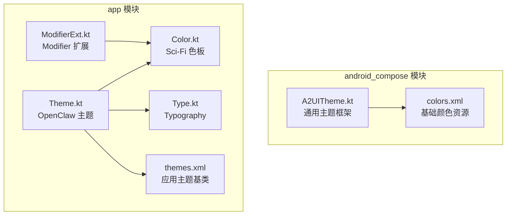
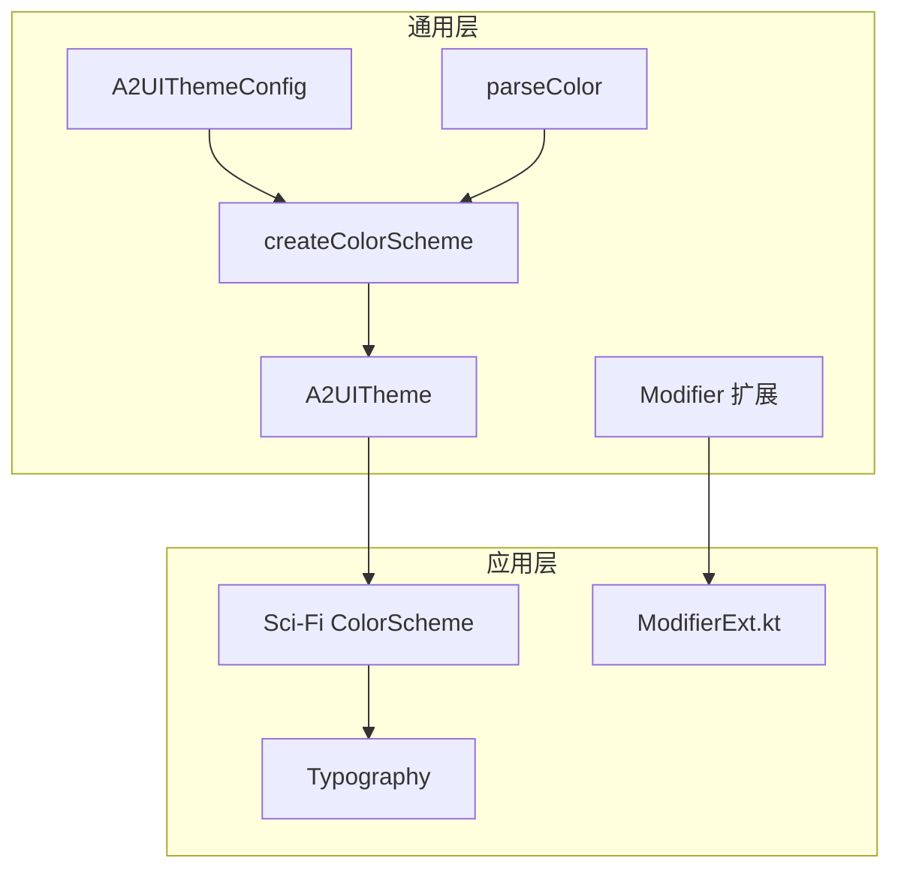
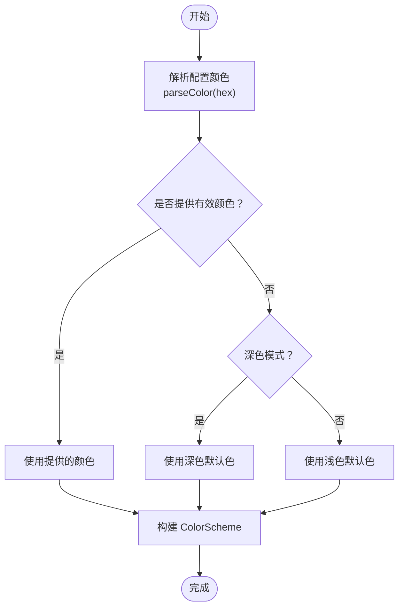
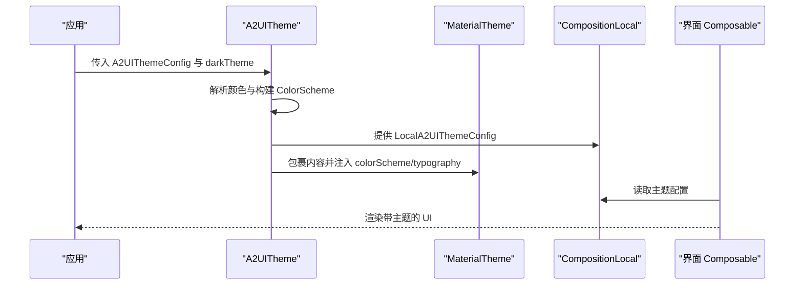
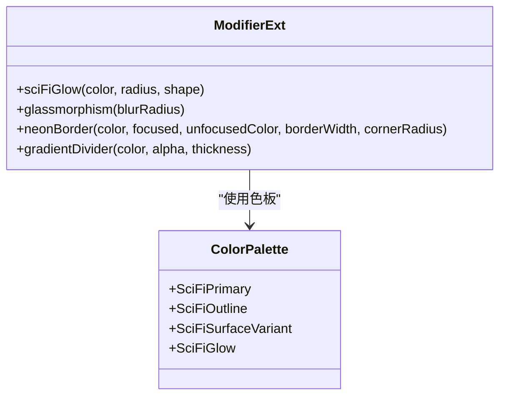
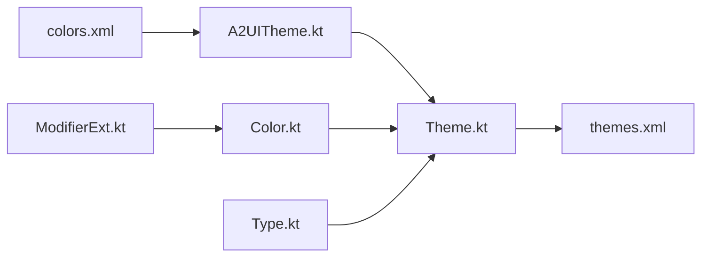

# 主题系统设计

<cite>
**本文引用的文件**
- [A2UITheme.kt](file://android_compose/src/main/java/org/a2ui/compose/theme/A2UITheme.kt)
- [Color.kt](file://app/src/main/java/ai/openclaw/android/ui/theme/Color.kt)
- [Theme.kt](file://app/src/main/java/ai/openclaw/android/ui/theme/Theme.kt)
- [Type.kt](file://app/src/main/java/ai/openclaw/android/ui/theme/Type.kt)
- [ModifierExt.kt](file://app/src/main/java/ai/openclaw/android/ui/theme/ModifierExt.kt)
- [A2UIThemeTest.kt](file://android_compose/src/test/java/org/a2ui/compose/theme/A2UIThemeTest.kt)
- [colors.xml](file://android_compose/src/main/res/values/colors.xml)
- [themes.xml](file://app/src/main/res/values/themes.xml)
- [2026-04-18-scifi-ui-redesign.md](file://docs/superpowers/specs/2026-04-18-scifi-ui-redesign.md)
</cite>

## 目录
1. [引言](#引言)
2. [项目结构](#项目结构)
3. [核心组件](#核心组件)
4. [架构总览](#架构总览)
5. [详细组件分析](#详细组件分析)
6. [依赖关系分析](#依赖关系分析)
7. [性能考量](#性能考量)
8. [故障排查指南](#故障排查指南)
9. [结论](#结论)
10. [附录](#附录)

## 引言
本文件系统化阐述 OpenClaw Android 主题系统的设计与实现，覆盖颜色方案设计原则与色彩搭配理论、字体样式与排版规范、主题切换与动态适配机制、Modifier 扩展函数的设计与使用模式，并提供主题定制化与扩展开发的最佳实践与新主题添加流程，以及在不同设备与屏幕尺寸下的适配策略。

## 项目结构
主题系统由两部分组成：
- 通用主题框架：位于 android_compose 模块，提供可配置的颜色方案、Typography、动画与 Modifier 扩展，支持动态主题参数注入与 Material 3 集成。
- 应用级主题与风格：位于 app 模块，定义 Sci-Fi 主题色板、Material 3 ColorScheme、Typography 与自定义 Modifier 扩展，实现统一的视觉语言与品牌风格。

图表来源
- [A2UITheme.kt](file://android_compose/src/main/java/org/a2ui/compose/theme/A2UITheme.kt)
- [Color.kt](file://app/src/main/java/ai/openclaw/android/ui/theme/Color.kt)
- [Theme.kt](file://app/src/main/java/ai/openclaw/android/ui/theme/Theme.kt)
- [Type.kt](file://app/src/main/java/ai/openclaw/android/ui/theme/Type.kt)
- [ModifierExt.kt](file://app/src/main/java/ai/openclaw/android/ui/theme/ModifierExt.kt)
- [colors.xml](file://android_compose/src/main/res/values/colors.xml)
- [themes.xml](file://app/src/main/res/values/themes.xml)

章节来源
- [A2UITheme.kt](file://android_compose/src/main/java/org/a2ui/compose/theme/A2UITheme.kt)
- [Color.kt](file://app/src/main/java/ai/openclaw/android/ui/theme/Color.kt)
- [Theme.kt](file://app/src/main/java/ai/openclaw/android/ui/theme/Theme.kt)
- [Type.kt](file://app/src/main/java/ai/openclaw/android/ui/theme/Type.kt)
- [ModifierExt.kt](file://app/src/main/java/ai/openclaw/android/ui/theme/ModifierExt.kt)
- [colors.xml](file://android_compose/src/main/res/values/colors.xml)
- [themes.xml](file://app/src/main/res/values/themes.xml)

## 核心组件
- 通用主题框架（android_compose）
  - A2UIThemeConfig：主题配置数据类，支持主色、辅色、背景、表面、文本、错误色等参数，以及圆角、字体族、动画开关与玻璃拟态等视觉选项。
  - createColorScheme：根据配置与深浅模式生成 Material 3 ColorScheme；支持十六进制字符串解析与默认回退。
  - A2UITheme：组合式主题入口，提供 CompositionLocal 注入与 MaterialTheme 包裹。
  - Modifier 扩展：glassmorphism、增强 Card 颜色与阴影、动画 Spec、列表动画类型枚举等。
- 应用级主题（app）
  - Color.kt：Sci-Fi 主题色板，包含深色/亮色模式、气泡、发光、网格等风格化颜色。
  - Theme.kt：OpenClawTheme 使用固定 Sci-Fi 深色方案，设置状态栏颜色与外观。
  - Type.kt：Typography 定义与 Monospace Accent 字体样式。
  - ModifierExt.kt：sciFiGlow、glassmorphism、neonBorder、gradientDivider 等 Modifier 扩展，按 API 版本降级处理。

章节来源
- [A2UITheme.kt](file://android_compose/src/main/java/org/a2ui/compose/theme/A2UITheme.kt)
- [Color.kt](file://app/src/main/java/ai/openclaw/android/ui/theme/Color.kt)
- [Theme.kt](file://app/src/main/java/ai/openclaw/android/ui/theme/Theme.kt)
- [Type.kt](file://app/src/main/java/ai/openclaw/android/ui/theme/Type.kt)
- [ModifierExt.kt](file://app/src/main/java/ai/openclaw/android/ui/theme/ModifierExt.kt)

## 架构总览
主题系统采用“通用框架 + 应用风格”的分层架构：
- 通用层负责颜色解析、Material 3 集成、动画与 Modifier 扩展，保证跨模块复用与一致性。
- 应用层聚焦品牌风格（Sci-Fi），通过 ColorScheme、Typography 与自定义 Modifier 实现独特视觉效果。
- 测试层验证颜色解析、默认与自定义 ColorScheme 的正确性，确保主题配置的稳定性。

图表来源
- [A2UITheme.kt](file://android_compose/src/main/java/org/a2ui/compose/theme/A2UITheme.kt)
- [Theme.kt](file://app/src/main/java/ai/openclaw/android/ui/theme/Theme.kt)
- [Type.kt](file://app/src/main/java/ai/openclaw/android/ui/theme/Type.kt)
- [ModifierExt.kt](file://app/src/main/java/ai/openclaw/android/ui/theme/ModifierExt.kt)

## 详细组件分析

### 颜色方案设计与色彩搭配理论
- 设计原则
  - 品牌一致性：Sci-Fi 主题以近黑背景与霓虹青色为主强调色，营造未来感与科技感。
  - 对比度与可访问性：关键文本与表面文字满足 WCAG AA 对比度要求；禁用文字保持高对比度。
  - 分层与语义：Primary/Secondary/Tertiary 明确功能层级；Error 用于警示与错误状态；Surface/SurfaceVariant 用于卡片与悬浮层。
- 色彩搭配
  - 主强调色：青色霓虹（#06D6A0）用于关键交互与强调元素。
  - 辅助色：冰蓝色（#4CC9F0）用于次要按钮与装饰。
  - 背景与表面：深蓝黑背景（#0A0E1A）与卡片表面（#111827）、悬浮层（#1E293B）形成层次。
  - 错误与成功：红色（#EF4444）用于错误，绿色（同主强调色）用于成功状态。
- 默认回退与十六进制解析
  - 未指定颜色时，深浅模式分别回退到 Material 3 默认色；十六进制字符串支持 6/8 位格式，自动转换为 Compose Color。
- 可访问性与对比度
  - OnBackground（#F1F5F9）与 OnSurfaceVariant（#94A3B8）确保在深色背景下具备足够对比度；禁用文字（#7D8FA6）满足 AA 标准。

图表来源
- [A2UITheme.kt](file://android_compose/src/main/java/org/a2ui/compose/theme/A2UITheme.kt)
- [Color.kt](file://app/src/main/java/ai/openclaw/android/ui/theme/Color.kt)

章节来源
- [A2UITheme.kt](file://android_compose/src/main/java/org/a2ui/compose/theme/A2UITheme.kt)
- [Color.kt](file://app/src/main/java/ai/openclaw/android/ui/theme/Color.kt)
- [2026-04-18-scifi-ui-redesign.md](file://docs/superpowers/specs/2026-04-18-scifi-ui-redesign.md)

### 字体样式系统与排版规范
- Material 3 Typography
  - 标题层级：headlineLarge/Medium/Small，加粗字号递减。
  - 标签与正文：titleLarge/Medium/Small、bodyLarge/Medium/Small、labelLarge/Medium/Small，权重与字号明确。
  - 行高与字距：正文与标签提供行高与字距，提升阅读体验。
- Monospace Accent
  - 提供等宽字体样式，适用于代码片段、错误码等需要强调的装饰性文本。
- 设计要点
  - 保持标题与正文的层级清晰，避免过度使用大号字或粗体。
  - 在信息密度高的区域（如聊天气泡）控制行高与字距，提升可读性。

章节来源
- [Type.kt](file://app/src/main/java/ai/openclaw/android/ui/theme/Type.kt)
- [2026-04-18-scifi-ui-redesign.md](file://docs/superpowers/specs/2026-04-18-scifi-ui-redesign.md)

### 主题切换机制与动态主题适配
- 切换机制
  - A2UITheme 接受 A2UIThemeConfig 与 darkTheme 参数，若未显式指定，则依据系统深浅模式判断。
  - OpenClawTheme 固定使用 Sci-Fi 深色方案，设置状态栏颜色与外观，便于沉浸式体验。
- 动态适配
  - CompositionLocal 注入 A2UIThemeConfig，使子树内任意 Composable 获取当前主题配置。
  - Modifier 扩展（如 glassmorphism、增强 Card 颜色）读取配置中的圆角、动画时长、开关等参数，实现一致的动态表现。
- 测试验证
  - 单元测试覆盖颜色解析、默认与自定义 ColorScheme 生成、配置默认值与自定义值，确保主题行为稳定。

图表来源
- [A2UITheme.kt](file://android_compose/src/main/java/org/a2ui/compose/theme/A2UITheme.kt)
- [Theme.kt](file://app/src/main/java/ai/openclaw/android/ui/theme/Theme.kt)

章节来源
- [A2UITheme.kt](file://android_compose/src/main/java/org/a2ui/compose/theme/A2UITheme.kt)
- [Theme.kt](file://app/src/main/java/ai/openclaw/android/ui/theme/Theme.kt)
- [A2UIThemeTest.kt](file://android_compose/src/test/java/org/a2ui/compose/theme/A2UIThemeTest.kt)

### Modifier 扩展函数的设计与使用模式
- 设计目标
  - 将风格化视觉效果封装为可复用的 Modifier 扩展，降低 UI 组合复杂度，统一风格。
  - 对平台能力进行条件降级（如 API 31+ 的模糊与阴影），保证兼容性。
- 关键扩展
  - sciFiGlow：基于阴影实现发光效果，API 低版本回退为标准阴影。
  - glassmorphism：模糊 + 半透明背景，API 低版本仅半透明背景。
  - neonBorder：焦点状态改变边框颜色与外发光宽度，增强交互反馈。
  - gradientDivider：水平渐变分割线，用于卡片与列表分隔。
- 使用模式
  - 在需要的 Composable 上链式调用，如 .sciFiGlow().glassmorphism().neonBorder()。
  - 通过参数控制颜色、半径、边框宽度与圆角，满足不同场景需求。

图表来源
- [ModifierExt.kt](file://app/src/main/java/ai/openclaw/android/ui/theme/ModifierExt.kt)
- [Color.kt](file://app/src/main/java/ai/openclaw/android/ui/theme/Color.kt)

章节来源
- [ModifierExt.kt](file://app/src/main/java/ai/openclaw/android/ui/theme/ModifierExt.kt)
- [Color.kt](file://app/src/main/java/ai/openclaw/android/ui/theme/Color.kt)

### 主题定制化实现与最佳实践
- 自定义颜色方案
  - 通过 A2UIThemeConfig 指定 primaryColor/secondaryColor/backgroundColor/surfaceColor/errorColor 等，实现品牌化定制。
  - 若未提供，自动回退到 Material 3 默认色；十六进制支持 6/8 位。
- 动画与交互
  - 启用/禁用动画、调整动画时长、选择列表动画类型，统一动效节奏。
  - 结合增强 Card 配置与动画 Spec，提升卡片交互的一致性。
- 品牌风格落地
  - 在应用层定义品牌色板（如 Sci-Fi），通过 ColorScheme 与 Typography 落地。
  - 使用 Modifier 扩展实现发光、玻璃拟态、霓虹边框等风格化效果。
- 最佳实践
  - 保持颜色层级清晰，避免过多强调色混用。
  - 优先使用 Material 3 语义色，必要时通过 Container/Variant 扩展。
  - 对关键交互（输入框、按钮、卡片）统一圆角与阴影策略。

章节来源
- [A2UITheme.kt](file://android_compose/src/main/java/org/a2ui/compose/theme/A2UITheme.kt)
- [Theme.kt](file://app/src/main/java/ai/openclaw/android/ui/theme/Theme.kt)
- [Type.kt](file://app/src/main/java/ai/openclaw/android/ui/theme/Type.kt)
- [ModifierExt.kt](file://app/src/main/java/ai/openclaw/android/ui/theme/ModifierExt.kt)
- [2026-04-18-scifi-ui-redesign.md](file://docs/superpowers/specs/2026-04-18-scifi-ui-redesign.md)

### 主题扩展开发指导与新主题添加流程
- 新主题添加步骤
  - 定义色板：在 Color.kt 中新增主题色板常量，遵循主/次/强调/错误/表面/文本的分层命名。
  - 构建 ColorScheme：在 Theme.kt 中新增对应 dark/light ColorScheme。
  - 更新主题入口：在 OpenClawTheme 或 A2UITheme 中增加主题选择逻辑（可基于配置或环境变量）。
  - 验证与测试：补充单元测试，覆盖颜色解析与 ColorScheme 生成。
- 扩展开发建议
  - 优先复用通用框架（A2UIThemeConfig、Modifier 扩展），减少重复实现。
  - 对平台差异进行条件降级，保证低版本兼容。
  - 通过 CompositionLocal 注入配置，确保全局一致性。

章节来源
- [Theme.kt](file://app/src/main/java/ai/openclaw/android/ui/theme/Theme.kt)
- [Color.kt](file://app/src/main/java/ai/openclaw/android/ui/theme/Color.kt)
- [A2UITheme.kt](file://android_compose/src/main/java/org/a2ui/compose/theme/A2UITheme.kt)
- [2026-04-18-scifi-ui-redesign.md](file://docs/superpowers/specs/2026-04-18-scifi-ui-redesign.md)

### 不同设备与屏幕尺寸下的适配策略
- 屏幕密度与字体缩放
  - 使用 sp/dp 单位，确保字体与控件在不同密度下保持合适比例。
  - Typography 已提供行高与字距，避免在小屏上出现拥挤。
- 动画与性能
  - 通过 A2UIThemeConfig 控制动画开关与时长，低端设备可关闭微交互或缩短动画。
  - Modifier 扩展对低版本 API 进行降级，避免昂贵绘制导致卡顿。
- 布局与间距
  - 使用 Material 3 的间距体系与形状，结合圆角与阴影策略，保证在小屏上不拥挤。
  - 卡片与输入框的圆角与边框宽度应与屏幕尺寸成比例，避免在小屏上显得过粗或过细。

章节来源
- [A2UITheme.kt](file://android_compose/src/main/java/org/a2ui/compose/theme/A2UITheme.kt)
- [Type.kt](file://app/src/main/java/ai/openclaw/android/ui/theme/Type.kt)
- [ModifierExt.kt](file://app/src/main/java/ai/openclaw/android/ui/theme/ModifierExt.kt)

## 依赖关系分析
- 模块间依赖
  - app 模块依赖 android_compose 的通用主题框架，复用颜色解析、ColorScheme 构建与 Modifier 扩展。
  - 资源文件 colors.xml 与 themes.xml 为通用层与应用层提供基础颜色与主题基类。
- 组件耦合
  - A2UIThemeConfig 作为配置中心，被 createColorScheme、Modifier 扩展与应用主题共同消费。
  - Color.kt 与 Theme.kt 形成强耦合，确保品牌风格一致；ModifierExt.kt 依赖 Color.kt 的色板常量。

图表来源
- [A2UITheme.kt](file://android_compose/src/main/java/org/a2ui/compose/theme/A2UITheme.kt)
- [Theme.kt](file://app/src/main/java/ai/openclaw/android/ui/theme/Theme.kt)
- [Color.kt](file://app/src/main/java/ai/openclaw/android/ui/theme/Color.kt)
- [Type.kt](file://app/src/main/java/ai/openclaw/android/ui/theme/Type.kt)
- [ModifierExt.kt](file://app/src/main/java/ai/openclaw/android/ui/theme/ModifierExt.kt)
- [colors.xml](file://android_compose/src/main/res/values/colors.xml)
- [themes.xml](file://app/src/main/res/values/themes.xml)

章节来源
- [A2UITheme.kt](file://android_compose/src/main/java/org/a2ui/compose/theme/A2UITheme.kt)
- [Theme.kt](file://app/src/main/java/ai/openclaw/android/ui/theme/Theme.kt)
- [Color.kt](file://app/src/main/java/ai/openclaw/android/ui/theme/Color.kt)
- [Type.kt](file://app/src/main/java/ai/openclaw/android/ui/theme/Type.kt)
- [ModifierExt.kt](file://app/src/main/java/ai/openclaw/android/ui/theme/ModifierExt.kt)
- [colors.xml](file://android_compose/src/main/res/values/colors.xml)
- [themes.xml](file://app/src/main/res/values/themes.xml)

## 性能考量
- 动画与过渡
  - 通过 A2UIThemeConfig 控制动画开关与时长，避免在低端设备上造成掉帧。
  - Modifier 扩展在低版本 API 下进行降级，减少昂贵绘制。
- 绘制优化
  - 使用 Material 3 的阴影与圆角策略，避免过度叠加阴影导致性能下降。
  - 玻璃拟态在低版本仅使用半透明背景，减少模糊带来的 GPU 压力。
- 资源与布局
  - 优先使用矢量与主题色，减少位图资源占用。
  - 在小屏设备上控制卡片与输入框的圆角与边框宽度，避免过度绘制。

## 故障排查指南
- 颜色解析失败
  - 现象：配置的颜色未生效，使用默认色。
  - 排查：检查十六进制字符串格式（6/8 位），确认 parseColor 返回非空；查看 A2UIThemeTest 中的解析用例。
- ColorScheme 未按预期生成
  - 现象：深浅模式颜色不符合预期。
  - 排查：核对 createColorScheme 的分支逻辑与默认回退；确认 A2UIThemeConfig 的 darkTheme 参数来源。
- Modifier 扩展无效
  - 现象：glassmorphism/发光等效果在低版本设备无变化。
  - 排查：确认 API 版本判断与降级逻辑；检查 Modifier 链式调用顺序。
- 测试验证
  - 使用 A2UIThemeTest 中的颜色解析与 ColorScheme 生成用例，快速定位问题。

章节来源
- [A2UIThemeTest.kt](file://android_compose/src/test/java/org/a2ui/compose/theme/A2UIThemeTest.kt)
- [A2UITheme.kt](file://android_compose/src/main/java/org/a2ui/compose/theme/A2UITheme.kt)

## 结论
本主题系统通过“通用框架 + 应用风格”的分层设计，在保证 Material 3 一致性的同时，实现了品牌化的 Sci-Fi 视觉风格与丰富的 Modifier 扩展。通过配置驱动的主题参数、完善的颜色解析与回退策略、以及针对平台差异的降级处理，系统在多设备与多环境下均能提供稳定且一致的用户体验。建议在后续迭代中持续完善测试覆盖与性能监控，确保主题系统的长期可维护性与扩展性。

## 附录
- 相关设计文档
  - Sci-Fi UI Redesign 设计规范：涵盖颜色、Typography、Modifier 扩展与页面细节。
- 资源文件
  - colors.xml：基础颜色资源，供通用层使用。
  - themes.xml：应用主题基类，继承系统主题。

章节来源
- [2026-04-18-scifi-ui-redesign.md](file://docs/superpowers/specs/2026-04-18-scifi-ui-redesign.md)
- [colors.xml](file://android_compose/src/main/res/values/colors.xml)
- [themes.xml](file://app/src/main/res/values/themes.xml)