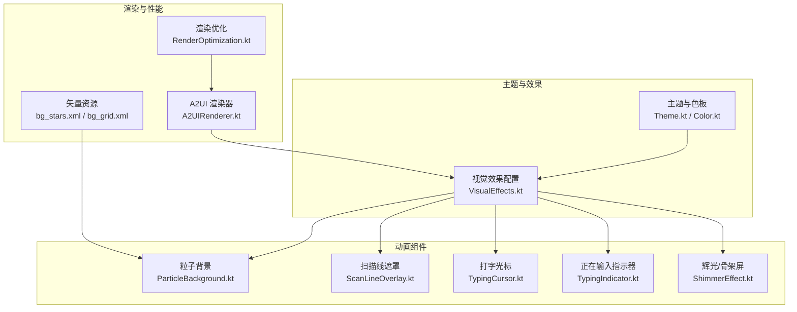
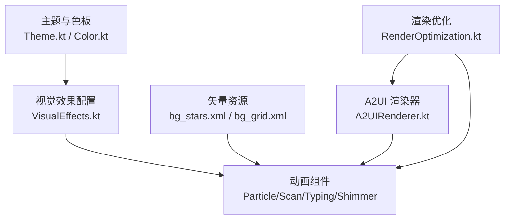
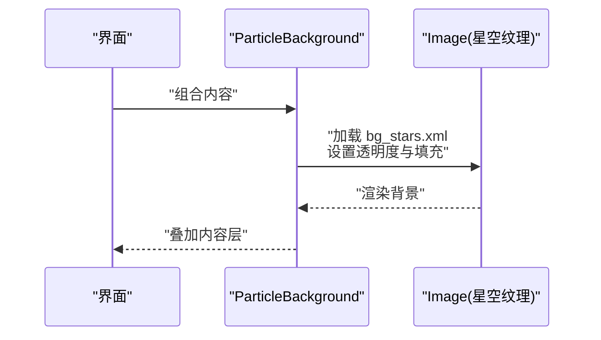
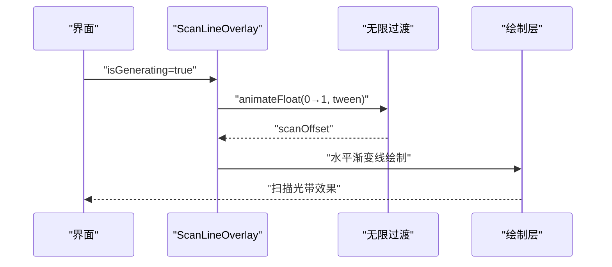
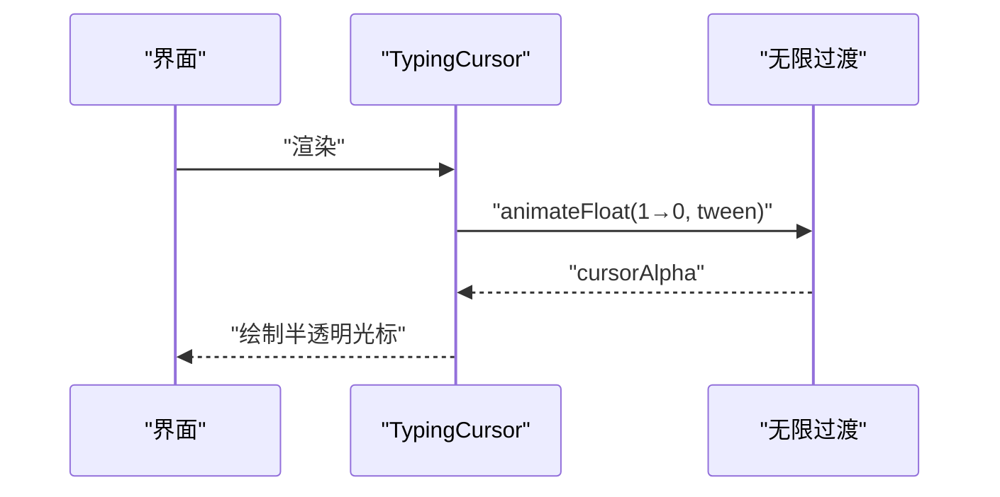
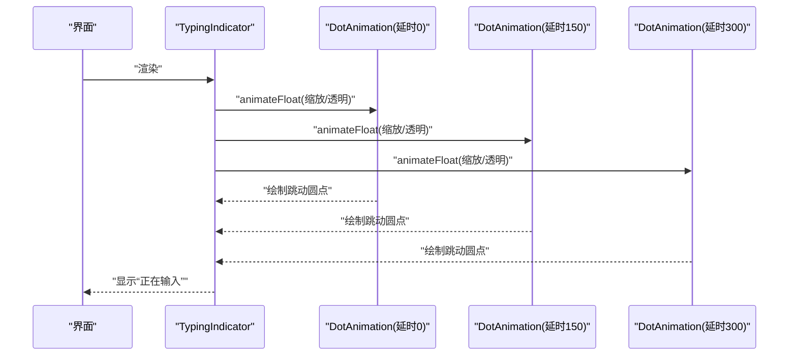
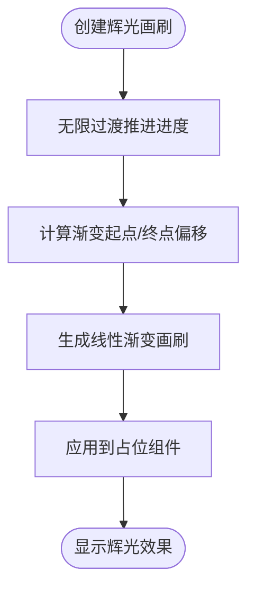
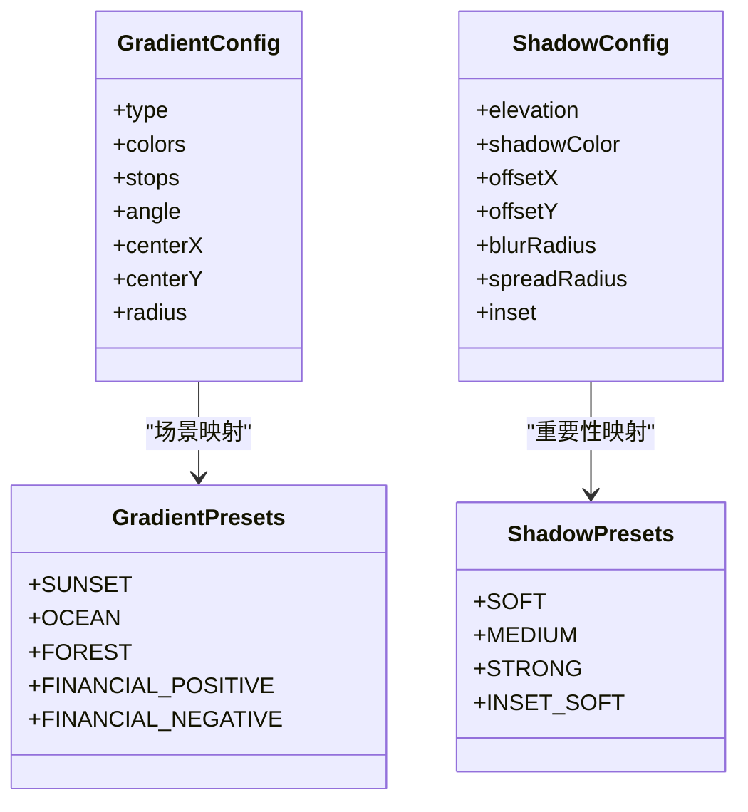
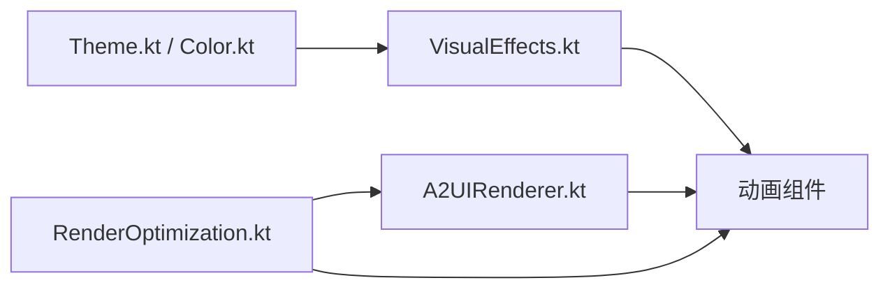

# 视觉效果与动画

<cite>
**本文引用的文件**
- [VisualEffects.kt](file://android_compose/src/main/java/org/a2ui/compose/effects/VisualEffects.kt)
- [ParticleBackground.kt](file://app/src/main/java/ai/openclaw/android/ui/components/ParticleBackground.kt)
- [ScanLineOverlay.kt](file://app/src/main/java/ai/openclaw/android/ui/components/ScanLineOverlay.kt)
- [TypingCursor.kt](file://app/src/main/java/ai/openclaw/android/ui/components/TypingCursor.kt)
- [TypingIndicator.kt](file://app/src/main/java/ai/openclaw/android/ui/TypingIndicator.kt)
- [ShimmerEffect.kt](file://app/src/main/java/ai/openclaw/android/ui/ShimmerEffect.kt)
- [Color.kt](file://app/src/main/java/ai/openclaw/android/ui/theme/Color.kt)
- [Theme.kt](file://app/src/main/java/ai/openclaw/android/ui/theme/Theme.kt)
- [RenderOptimization.kt](file://android_compose/src/main/java/org/a2ui/compose/charts/performance/RenderOptimization.kt)
- [A2UIRenderer.kt](file://android_compose/src/main/java/org/a2ui/compose/rendering/A2UIRenderer.kt)
- [bg_stars.xml](file://app/src/main/res/drawable/bg_stars.xml)
- [bg_grid.xml](file://app/src/main/res/drawable/bg_grid.xml)
- [2026-04-18-scifi-ui-redesign.md](file://docs/superpowers/specs/2026-04-18-scifi-ui-redesign.md)
</cite>

## 目录
1. [简介](#简介)
2. [项目结构](#项目结构)
3. [核心组件](#核心组件)
4. [架构总览](#架构总览)
5. [详细组件分析](#详细组件分析)
6. [依赖关系分析](#依赖关系分析)
7. [性能考量](#性能考量)
8. [故障排查指南](#故障排查指南)
9. [结论](#结论)
10. [附录](#附录)

## 简介
本文件聚焦于项目中的视觉效果与动画实现，涵盖粒子背景、扫描线遮罩、打字光标与“正在输入”指示器、辉光与阴影等效果，并结合渲染优化与性能监控工具，给出可复用组件的设计思路、参数化配置方法、最佳实践与创意扩展建议。目标读者包括需要集成或二次开发视觉动画的工程师与设计师。

## 项目结构
围绕视觉与动画的关键模块分布如下：
- 效果配置与主题：渐变、阴影、主题色板
- 动画组件：粒子背景、扫描线遮罩、打字光标、辉光与骨架屏
- 渲染与性能：虚拟化、Canvas缓存、分层渲染、性能监控
- 示例与规范：UI规范中关于辉光、玻璃拟态等效果的降级策略

**图示来源**
- [Theme.kt:66-86](file://app/src/main/java/ai/openclaw/android/ui/theme/Theme.kt#L66-L86)
- [Color.kt:1-62](file://app/src/main/java/ai/openclaw/android/ui/theme/Color.kt#L1-L62)
- [VisualEffects.kt:11-189](file://android_compose/src/main/java/org/a2ui/compose/effects/VisualEffects.kt#L11-L189)
- [ParticleBackground.kt:14-34](file://app/src/main/java/ai/openclaw/android/ui/components/ParticleBackground.kt#L14-L34)
- [ScanLineOverlay.kt:21-55](file://app/src/main/java/ai/openclaw/android/ui/components/ScanLineOverlay.kt#L21-L55)
- [TypingCursor.kt:19-41](file://app/src/main/java/ai/openclaw/android/ui/components/TypingCursor.kt#L19-L41)
- [TypingIndicator.kt:24-77](file://app/src/main/java/ai/openclaw/android/ui/TypingIndicator.kt#L24-L77)
- [ShimmerEffect.kt:28-122](file://app/src/main/java/ai/openclaw/android/ui/ShimmerEffect.kt#L28-L122)
- [A2UIRenderer.kt:395-407](file://android_compose/src/main/java/org/a2ui/compose/rendering/A2UIRenderer.kt#L395-L407)
- [RenderOptimization.kt:447-485](file://android_compose/src/main/java/org/a2ui/compose/charts/performance/RenderOptimization.kt#L447-L485)
- [bg_stars.xml:1-21](file://app/src/main/res/drawable/bg_stars.xml#L1-L21)
- [bg_grid.xml:1-15](file://app/src/main/res/drawable/bg_grid.xml#L1-L15)

**章节来源**
- [Theme.kt:66-86](file://app/src/main/java/ai/openclaw/android/ui/theme/Theme.kt#L66-L86)
- [Color.kt:1-62](file://app/src/main/java/ai/openclaw/android/ui/theme/Color.kt#L1-L62)
- [VisualEffects.kt:11-189](file://android_compose/src/main/java/org/a2ui/compose/effects/VisualEffects.kt#L11-L189)
- [ParticleBackground.kt:14-34](file://app/src/main/java/ai/openclaw/android/ui/components/ParticleBackground.kt#L14-L34)
- [ScanLineOverlay.kt:21-55](file://app/src/main/java/ai/openclaw/android/ui/components/ScanLineOverlay.kt#L21-L55)
- [TypingCursor.kt:19-41](file://app/src/main/java/ai/openclaw/android/ui/components/TypingCursor.kt#L19-L41)
- [TypingIndicator.kt:24-77](file://app/src/main/java/ai/openclaw/android/ui/TypingIndicator.kt#L24-L77)
- [ShimmerEffect.kt:28-122](file://app/src/main/java/ai/openclaw/android/ui/ShimmerEffect.kt#L28-L122)
- [A2UIRenderer.kt:395-407](file://android_compose/src/main/java/org/a2ui/compose/rendering/A2UIRenderer.kt#L395-L407)
- [RenderOptimization.kt:447-485](file://android_compose/src/main/java/org/a2ui/compose/charts/performance/RenderOptimization.kt#L447-L485)
- [bg_stars.xml:1-21](file://app/src/main/res/drawable/bg_stars.xml#L1-L21)
- [bg_grid.xml:1-15](file://app/src/main/res/drawable/bg_grid.xml#L1-L15)

## 核心组件
- 渐变与阴影配置：统一的渐变类型、颜色与停止点、角度与中心半径；预设场景与重要性对应的阴影方案。
- 主题色板：Sci-Fi 主题色，含背景、表面、强调色、文字色、装饰色（辉光、扫描线、粒子、网格）。
- 动画组件：粒子背景（矢量星空纹理）、扫描线遮罩（水平扫描光带）、打字光标（闪烁）、“正在输入”指示器（三圆点跳动）、辉光/骨架屏（Shimmer）。
- 渲染优化：虚拟化渲染器、Canvas缓存管理、分层渲染、性能监控器、数据采样器、内存压力检测。

**章节来源**
- [VisualEffects.kt:11-189](file://android_compose/src/main/java/org/a2ui/compose/effects/VisualEffects.kt#L11-L189)
- [Color.kt:1-62](file://app/src/main/java/ai/openclaw/android/ui/theme/Color.kt#L1-L62)
- [ParticleBackground.kt:14-34](file://app/src/main/java/ai/openclaw/android/ui/components/ParticleBackground.kt#L14-L34)
- [ScanLineOverlay.kt:21-55](file://app/src/main/java/ai/openclaw/android/ui/components/ScanLineOverlay.kt#L21-L55)
- [TypingCursor.kt:19-41](file://app/src/main/java/ai/openclaw/android/ui/components/TypingCursor.kt#L19-L41)
- [TypingIndicator.kt:24-77](file://app/src/main/java/ai/openclaw/android/ui/TypingIndicator.kt#L24-L77)
- [ShimmerEffect.kt:28-122](file://app/src/main/java/ai/openclaw/android/ui/ShimmerEffect.kt#L28-L122)
- [RenderOptimization.kt:19-523](file://android_compose/src/main/java/org/a2ui/compose/charts/performance/RenderOptimization.kt#L19-L523)

## 架构总览
视觉与动画体系以“主题与效果配置”为核心，驱动“动画组件”在不同场景下呈现一致的视觉语言；同时通过“渲染与性能”模块保障复杂动画的流畅运行。

**图示来源**
- [Theme.kt:66-86](file://app/src/main/java/ai/openclaw/android/ui/theme/Theme.kt#L66-L86)
- [Color.kt:1-62](file://app/src/main/java/ai/openclaw/android/ui/theme/Color.kt#L1-L62)
- [VisualEffects.kt:11-189](file://android_compose/src/main/java/org/a2ui/compose/effects/VisualEffects.kt#L11-L189)
- [ParticleBackground.kt:14-34](file://app/src/main/java/ai/openclaw/android/ui/components/ParticleBackground.kt#L14-L34)
- [ScanLineOverlay.kt:21-55](file://app/src/main/java/ai/openclaw/android/ui/components/ScanLineOverlay.kt#L21-L55)
- [TypingCursor.kt:19-41](file://app/src/main/java/ai/openclaw/android/ui/components/TypingCursor.kt#L19-L41)
- [TypingIndicator.kt:24-77](file://app/src/main/java/ai/openclaw/android/ui/TypingIndicator.kt#L24-L77)
- [ShimmerEffect.kt:28-122](file://app/src/main/java/ai/openclaw/android/ui/ShimmerEffect.kt#L28-L122)
- [A2UIRenderer.kt:395-407](file://android_compose/src/main/java/org/a2ui/compose/rendering/A2UIRenderer.kt#L395-L407)
- [RenderOptimization.kt:447-485](file://android_compose/src/main/java/org/a2ui/compose/charts/performance/RenderOptimization.kt#L447-L485)
- [bg_stars.xml:1-21](file://app/src/main/res/drawable/bg_stars.xml#L1-L21)
- [bg_grid.xml:1-15](file://app/src/main/res/drawable/bg_grid.xml#L1-L15)

## 详细组件分析

### 粒子背景系统
- 实现原理
  - 使用矢量星空纹理作为背景图层，通过半透明叠加营造深空氛围。
  - 背景组件采用居中布局，将纹理图像铺满屏幕并设置极低透明度，避免喧宾夺主。
- 性能优化
  - 矢量资源体积小、缩放不失真，适合全屏背景。
  - 通过合成层级与透明度控制降低绘制开销。
- 参数化与可复用
  - 支持传入自定义修饰符与内容组合，便于嵌入任意界面。
  - 可替换为其他矢量纹理（如网格）以适配不同风格。

**图示来源**
- [ParticleBackground.kt:14-34](file://app/src/main/java/ai/openclaw/android/ui/components/ParticleBackground.kt#L14-L34)
- [bg_stars.xml:1-21](file://app/src/main/res/drawable/bg_stars.xml#L1-L21)

**章节来源**
- [ParticleBackground.kt:14-34](file://app/src/main/java/ai/openclaw/android/ui/components/ParticleBackground.kt#L14-L34)
- [bg_stars.xml:1-21](file://app/src/main/res/drawable/bg_stars.xml#L1-L21)

### 扫描线遮罩效果
- 实现原理
  - 使用无限过渡动画驱动扫描偏移量，按线性缓动周期性往返。
  - 在绘制层绘制一条水平渐变线，形成扫描光带。
- 参数调节
  - 动画时长、缓动曲线、重复模式、线条粗细、颜色透明度均可调节。
  - 仅在“生成中”状态下启用，避免无意义的绘制。
- 视觉表现
  - 适用于“AI 正在思考/生成”的场景，增强科技感与沉浸感。

**图示来源**
- [ScanLineOverlay.kt:21-55](file://app/src/main/java/ai/openclaw/android/ui/components/ScanLineOverlay.kt#L21-L55)

**章节来源**
- [ScanLineOverlay.kt:21-55](file://app/src/main/java/ai/openclaw/android/ui/components/ScanLineOverlay.kt#L21-L55)

### 打字光标动画
- 实现原理
  - 使用无限过渡动画在不透明度之间往返，形成闪烁效果。
  - 光标尺寸与颜色基于主题色，保证一致性。
- 用户体验设计
  - 闪烁节奏适中，避免过度刺激；颜色与主题一致，提升辨识度。
  - 仅在输入状态或特定场景启用，减少干扰。

**图示来源**
- [TypingCursor.kt:19-41](file://app/src/main/java/ai/openclaw/android/ui/components/TypingCursor.kt#L19-L41)

**章节来源**
- [TypingCursor.kt:19-41](file://app/src/main/java/ai/openclaw/android/ui/components/TypingCursor.kt#L19-L41)

### “正在输入”指示器
- 实现原理
  - 由三个小圆点组成，分别设置不同延迟，形成依次跳动的序列动画。
  - 同时调整缩放与透明度，增强呼吸感。
- 用户体验设计
  - 圆点尺寸与间距适中，颜色采用主题强调色，与头像区域形成对比。
  - 文案简洁明确，提示用户 AI 正在处理。

**图示来源**
- [TypingIndicator.kt:24-77](file://app/src/main/java/ai/openclaw/android/ui/TypingIndicator.kt#L24-L77)
- [TypingIndicator.kt:79-111](file://app/src/main/java/ai/openclaw/android/ui/TypingIndicator.kt#L79-L111)

**章节来源**
- [TypingIndicator.kt:24-77](file://app/src/main/java/ai/openclaw/android/ui/TypingIndicator.kt#L24-L77)
- [TypingIndicator.kt:79-111](file://app/src/main/java/ai/openclaw/android/ui/TypingIndicator.kt#L79-L111)

### 辉光与骨架屏（Shimmer）
- 实现原理
  - 使用无限过渡动画推进线性渐变的起止点，形成流动的辉光效果。
  - 提供多种占位组件（矩形、圆角、圆形、文本块），满足不同加载场景。
- 视觉表现
  - 角度、时长、基础色与辉光色可配置，适配不同主题与场景。
  - 与主题色板配合，确保在深色/浅色模式下均有良好对比度。

**图示来源**
- [ShimmerEffect.kt:28-122](file://app/src/main/java/ai/openclaw/android/ui/ShimmerEffect.kt#L28-L122)

**章节来源**
- [ShimmerEffect.kt:28-122](file://app/src/main/java/ai/openclaw/android/ui/ShimmerEffect.kt#L28-L122)

### 渐变与阴影系统
- 渐变配置
  - 支持线性、径向、扫描（暂用扫描替代锥形）三种类型，可指定颜色、停止点、角度、中心与半径。
  - 提供场景化预设（日落、海洋、森林、金融正负向渐变）与重要性预设（软/中/强/内阴影）。
- 阴影配置
  - 支持外阴影与内阴影，可调节偏移、模糊、扩散与透明度。
- 应用方式
  - 通过工厂函数生成对应画刷，供组件背景、边框、装饰等使用。

**图示来源**
- [VisualEffects.kt:11-189](file://android_compose/src/main/java/org/a2ui/compose/effects/VisualEffects.kt#L11-L189)

**章节来源**
- [VisualEffects.kt:11-189](file://android_compose/src/main/java/org/a2ui/compose/effects/VisualEffects.kt#L11-L189)

### 动画组件的可复用性与配置化
- 可复用性
  - 组件均以 Compose 函数形式提供，支持传入修饰符与颜色参数，便于在多处复用。
  - 与主题色板解耦，通过参数覆盖默认颜色，满足不同主题需求。
- 配置化
  - 动画时长、缓动曲线、颜色透明度、渐变角度/中心/半径等均可通过参数或预设配置。
  - 场景化预设（如金融正负向渐变）可直接按场景名称获取，降低使用成本。

**章节来源**
- [ParticleBackground.kt:14-34](file://app/src/main/java/ai/openclaw/android/ui/components/ParticleBackground.kt#L14-L34)
- [ScanLineOverlay.kt:21-55](file://app/src/main/java/ai/openclaw/android/ui/components/ScanLineOverlay.kt#L21-L55)
- [TypingCursor.kt:19-41](file://app/src/main/java/ai/openclaw/android/ui/components/TypingCursor.kt#L19-L41)
- [TypingIndicator.kt:24-77](file://app/src/main/java/ai/openclaw/android/ui/TypingIndicator.kt#L24-L77)
- [ShimmerEffect.kt:28-122](file://app/src/main/java/ai/openclaw/android/ui/ShimmerEffect.kt#L28-L122)
- [VisualEffects.kt:11-189](file://android_compose/src/main/java/org/a2ui/compose/effects/VisualEffects.kt#L11-L189)

### 自定义开发指导与创意案例
- 自定义渐变与阴影
  - 基于配置对象自定义颜色、角度、中心与半径，或扩展预设集合。
  - 结合场景映射函数，为新业务场景添加专属预设。
- 自定义动画
  - 通过无限过渡与动画规格组合实现新的闪烁、脉冲、波纹等效果。
  - 将动画参数化为可配置项，便于在不同界面复用。
- 创意案例
  - 扫描线遮罩：可改为垂直扫描或多条扫描线，配合不同颜色与透明度。
  - 打字光标：可加入轻微抖动或缩放，模拟真实键盘输入的细微波动。
  - 骨架屏：可引入更复杂的形状组合（如卡片、头像、标题、正文），提升加载体验。

**章节来源**
- [VisualEffects.kt:11-189](file://android_compose/src/main/java/org/a2ui/compose/effects/VisualEffects.kt#L11-L189)
- [ScanLineOverlay.kt:21-55](file://app/src/main/java/ai/openclaw/android/ui/components/ScanLineOverlay.kt#L21-L55)
- [TypingCursor.kt:19-41](file://app/src/main/java/ai/openclaw/android/ui/components/TypingCursor.kt#L19-L41)
- [ShimmerEffect.kt:28-122](file://app/src/main/java/ai/openclaw/android/ui/ShimmerEffect.kt#L28-L122)

## 依赖关系分析
- 主题与色板为所有视觉效果提供统一的颜色语义，确保一致性。
- 动画组件依赖主题色与视觉效果配置，形成“配置—渲染—效果”的链路。
- 渲染优化模块贯穿渲染器与动画组件，保障复杂场景下的性能稳定。

**图示来源**
- [Theme.kt:66-86](file://app/src/main/java/ai/openclaw/android/ui/theme/Theme.kt#L66-L86)
- [Color.kt:1-62](file://app/src/main/java/ai/openclaw/android/ui/theme/Color.kt#L1-L62)
- [VisualEffects.kt:11-189](file://android_compose/src/main/java/org/a2ui/compose/effects/VisualEffects.kt#L11-L189)
- [A2UIRenderer.kt:395-407](file://android_compose/src/main/java/org/a2ui/compose/rendering/A2UIRenderer.kt#L395-L407)
- [RenderOptimization.kt:447-485](file://android_compose/src/main/java/org/a2ui/compose/charts/performance/RenderOptimization.kt#L447-L485)

**章节来源**
- [Theme.kt:66-86](file://app/src/main/java/ai/openclaw/android/ui/theme/Theme.kt#L66-L86)
- [Color.kt:1-62](file://app/src/main/java/ai/openclaw/android/ui/theme/Color.kt#L1-L62)
- [VisualEffects.kt:11-189](file://android_compose/src/main/java/org/a2ui/compose/effects/VisualEffects.kt#L11-L189)
- [A2UIRenderer.kt:395-407](file://android_compose/src/main/java/org/a2ui/compose/rendering/A2UIRenderer.kt#L395-L407)
- [RenderOptimization.kt:447-485](file://android_compose/src/main/java/org/a2ui/compose/charts/performance/RenderOptimization.kt#L447-L485)

## 性能考量
- 渲染优化策略
  - 虚拟化渲染器：按视口范围计算可见项目，减少不必要的绘制。
  - Canvas缓存管理：对静态或低频变化的绘制结果进行缓存，命中后直接复用。
  - 分层渲染：将复杂绘制拆分为多个层，脏标记触发局部重绘。
  - 数据采样：对大量数据进行像素/最值/自适应采样，降低渲染负载。
  - 性能监控：记录帧时间与方差，动态评估帧率并触发优化策略。
  - 内存压力检测：根据堆内存使用比例建议垃圾回收时机。
- 动画性能建议
  - 控制动画数量与频率，避免同时播放过多无限过渡。
  - 使用合理的动画时长与缓动，减少重排与重绘。
  - 对高频动画（如扫描线、辉光）优先采用缓存与分层策略。
- 帧率控制最佳实践
  - 目标帧率稳定在 60 FPS，若监控到帧时间方差过大或 FPS 下降明显，自动降低采样密度或禁用部分非关键动画。
  - 在低端设备上启用降级策略（如禁用模糊、降低扫描速度、简化辉光角度）。

**章节来源**
- [RenderOptimization.kt:19-523](file://android_compose/src/main/java/org/a2ui/compose/charts/performance/RenderOptimization.kt#L19-L523)
- [A2UIRenderer.kt:395-407](file://android_compose/src/main/java/org/a2ui/compose/rendering/A2UIRenderer.kt#L395-L407)

## 故障排查指南
- 扫描线遮罩不显示
  - 检查启用条件（isGenerating）是否为真。
  - 确认颜色透明度与屏幕对比度足够。
- 动画卡顿或掉帧
  - 使用性能监控器观察 FPS 与方差，必要时降低动画时长或禁用部分动画。
  - 启用虚拟化与缓存策略，减少频繁重绘。
- 资源加载问题
  - 确认矢量资源存在且命名正确（如 bg_stars.xml）。
  - 检查透明度与填充模式，避免过度透明导致绘制异常。
- 主题色不一致
  - 检查主题色板与组件颜色参数，确保未被覆盖。
  - 在深色/浅色模式切换时确认颜色映射正确。

**章节来源**
- [ScanLineOverlay.kt:21-55](file://app/src/main/java/ai/openclaw/android/ui/components/ScanLineOverlay.kt#L21-L55)
- [RenderOptimization.kt:167-227](file://android_compose/src/main/java/org/a2ui/compose/charts/performance/RenderOptimization.kt#L167-L227)
- [bg_stars.xml:1-21](file://app/src/main/res/drawable/bg_stars.xml#L1-L21)
- [Theme.kt:66-86](file://app/src/main/java/ai/openclaw/android/ui/theme/Theme.kt#L66-L86)

## 结论
本项目通过统一的主题与效果配置、可复用的动画组件与完善的渲染优化体系，实现了从粒子背景、扫描线遮罩、打字光标到辉光与骨架屏的完整视觉动画链路。在保证视觉一致性的同时，兼顾性能与可扩展性，为后续创意实现与场景化定制提供了坚实基础。

## 附录
- UI 规范中的效果与降级策略参考：主题色、辉光、玻璃拟态、霓虹边框等效果在不同 API 等级下的降级建议。

**章节来源**
- [2026-04-18-scifi-ui-redesign.md:69-97](file://docs/superpowers/specs/2026-04-18-scifi-ui-redesign.md#L69-L97)