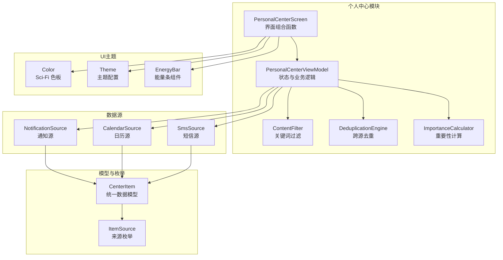
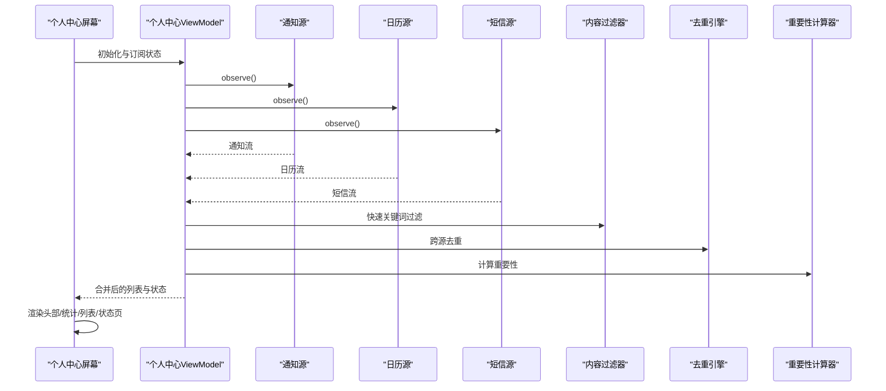
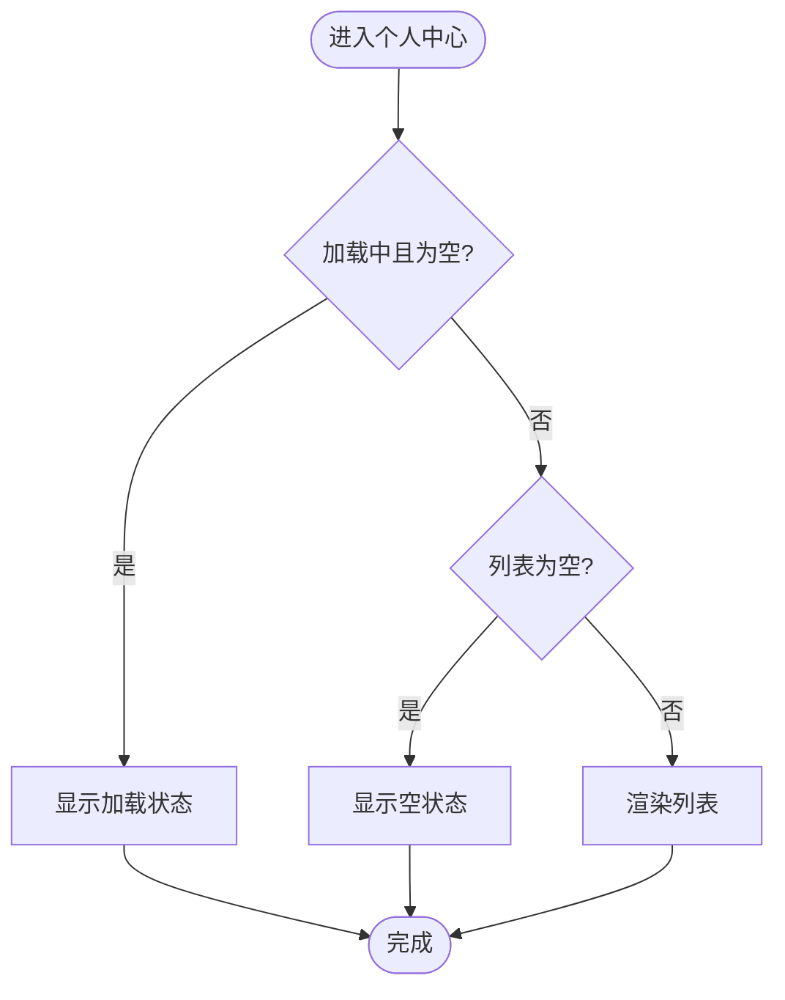
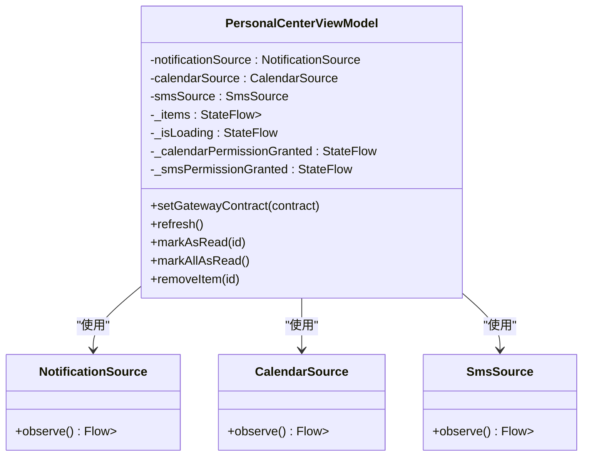
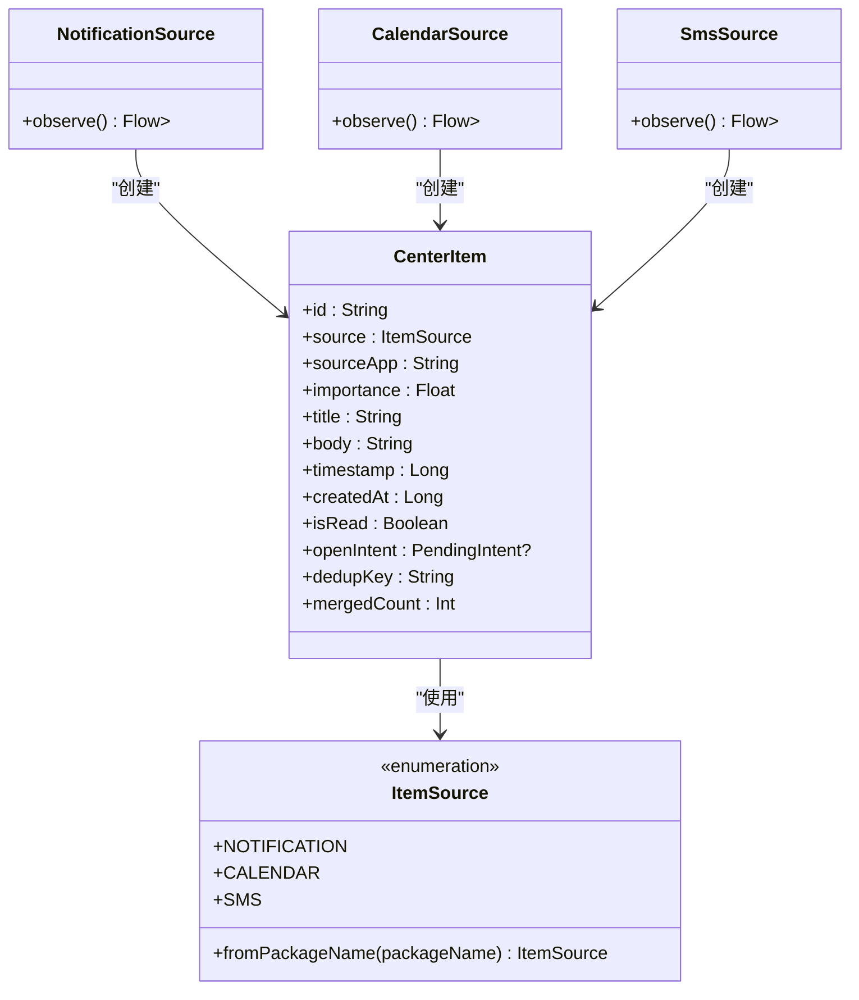
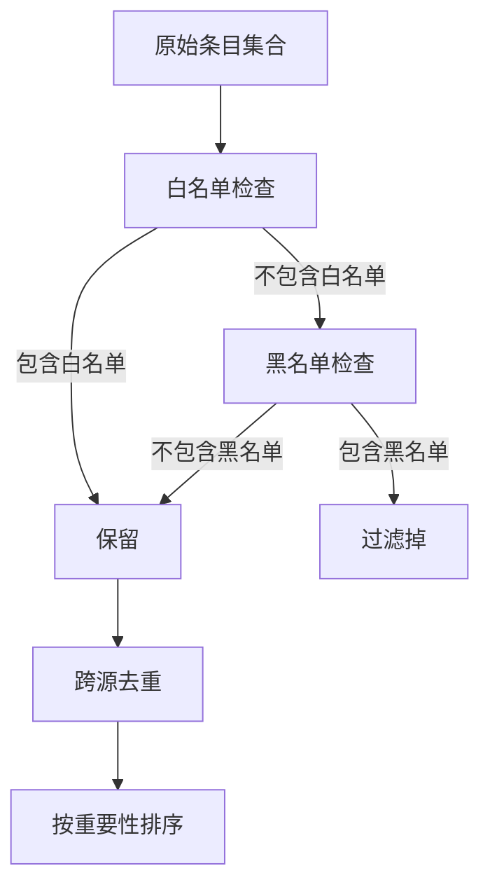
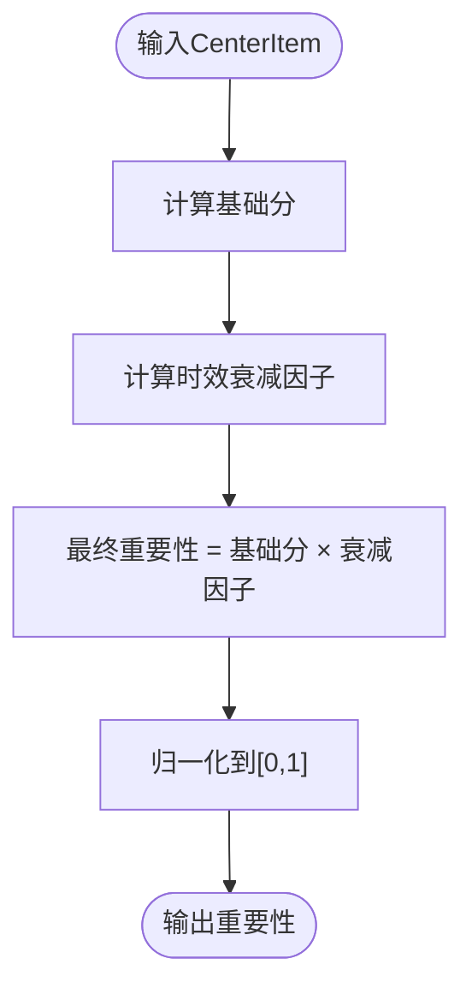
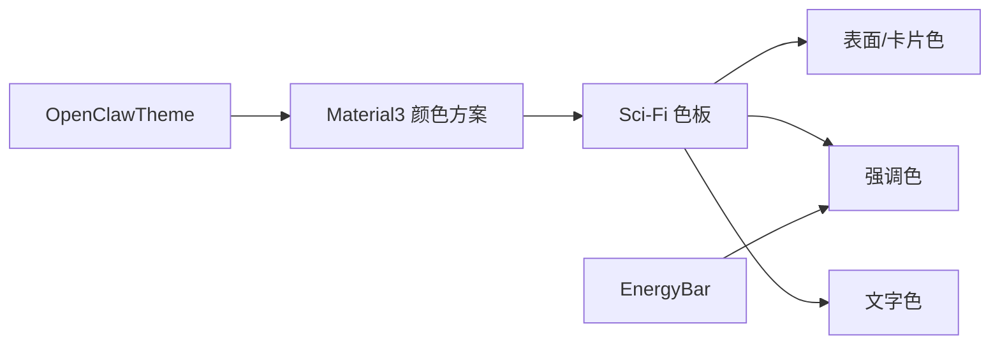
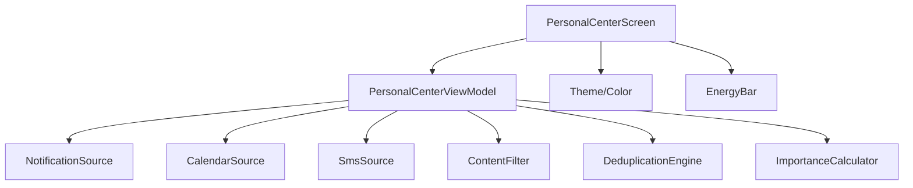

# 个人中心界面设计

<cite>
**本文档引用的文件**
- [PersonalCenterScreen.kt](file://app/src/main/java/ai/openclaw/android/personalcenter/PersonalCenterScreen.kt)
- [PersonalCenterViewModel.kt](file://app/src/main/java/ai/openclaw/android/personalcenter/PersonalCenterViewModel.kt)
- [CenterItem.kt](file://app/src/main/java/ai/openclaw/android/personalcenter/models/CenterItem.kt)
- [ItemSource.kt](file://app/src/main/java/ai/openclaw/android/personalcenter/sources/ItemSource.kt)
- [CalendarSource.kt](file://app/src/main/java/ai/openclaw/android/personalcenter/sources/CalendarSource.kt)
- [NotificationSource.kt](file://app/src/main/java/ai/openclaw/android/personalcenter/sources/NotificationSource.kt)
- [SmsSource.kt](file://app/src/main/java/ai/openclaw/android/personalcenter/sources/SmsSource.kt)
- [ContentFilter.kt](file://app/src/main/java/ai/openclaw/android/personalcenter/ContentFilter.kt)
- [DeduplicationEngine.kt](file://app/src/main/java/ai/openclaw/android/personalcenter/DeduplicationEngine.kt)
- [ImportanceCalculator.kt](file://app/src/main/java/ai/openclaw/android/personalcenter/ImportanceCalculator.kt)
- [Color.kt](file://app/src/main/java/ai/openclaw/android/ui/theme/Color.kt)
- [Theme.kt](file://app/src/main/java/ai/openclaw/android/ui/theme/Theme.kt)
- [EnergyBar.kt](file://app/src/main/java/ai/openclaw/android/ui/components/EnergyBar.kt)
</cite>

## 更新摘要
**所做更改**
- 添加了 Kotlin 2.3.0 兼容性修复的详细说明
- 更新了 @file:OptIn 注解和实验性API使用的章节
- 新增了编译兼容性和代码质量改进的相关内容
- 完善了技术债务管理和版本适配的指导原则

## 目录
1. [简介](#简介)
2. [项目结构](#项目结构)
3. [核心组件](#核心组件)
4. [架构总览](#架构总览)
5. [详细组件分析](#详细组件分析)
6. [依赖关系分析](#依赖关系分析)
7. [性能考虑](#性能考虑)
8. [故障排除指南](#故障排除指南)
9. [结论](#结论)
10. [附录](#附录)

## 简介
本文件系统化梳理个人中心界面的设计与实现，覆盖UI架构、组件设计、布局与响应式实现、用户交互流程与体验优化、数据绑定与状态管理、性能优化与渲染效率、主题与定制化、无障碍支持、动画与过渡效果，以及测试与用户体验评估方法。目标是帮助开发者与产品人员全面理解个人中心的实现方式，并为后续迭代提供清晰的参考。

**更新** 本次更新重点关注 Kotlin 2.3.0 兼容性修复，确保代码在最新 Kotlin 版本下的正确编译和运行。

## 项目结构
个人中心位于应用模块的个人中心包下，采用"屏幕 + ViewModel + 数据源 + 过滤与去重 + 重要性计算"的分层组织。UI层以Jetpack Compose构建，数据层通过Flow驱动，业务规则集中在ViewModel与工具类中，主题与样式在独立的UI主题模块中定义。

**图表来源**
- [PersonalCenterScreen.kt:1-500](file://app/src/main/java/ai/openclaw/android/personalcenter/PersonalCenterScreen.kt#L1-L500)
- [PersonalCenterViewModel.kt:1-279](file://app/src/main/java/ai/openclaw/android/personalcenter/PersonalCenterViewModel.kt#L1-L279)
- [CenterItem.kt:1-24](file://app/src/main/java/ai/openclaw/android/personalcenter/models/CenterItem.kt#L1-L24)
- [ItemSource.kt:1-28](file://app/src/main/java/ai/openclaw/android/personalcenter/sources/ItemSource.kt#L1-L28)
- [NotificationSource.kt:1-74](file://app/src/main/java/ai/openclaw/android/personalcenter/sources/NotificationSource.kt#L1-L74)
- [CalendarSource.kt:1-130](file://app/src/main/java/ai/openclaw/android/personalcenter/sources/CalendarSource.kt#L1-L130)
- [SmsSource.kt:1-137](file://app/src/main/java/ai/openclaw/android/personalcenter/sources/SmsSource.kt#L1-L137)
- [ContentFilter.kt:1-76](file://app/src/main/java/ai/openclaw/android/personalcenter/ContentFilter.kt#L1-L76)
- [DeduplicationEngine.kt:1-88](file://app/src/main/java/ai/openclaw/android/personalcenter/DeduplicationEngine.kt#L1-L88)
- [ImportanceCalculator.kt:1-110](file://app/src/main/java/ai/openclaw/android/personalcenter/ImportanceCalculator.kt#L1-L110)
- [Color.kt:1-62](file://app/src/main/java/ai/openclaw/android/ui/theme/Color.kt#L1-L62)
- [Theme.kt:1-87](file://app/src/main/java/ai/openclaw/android/ui/theme/Theme.kt#L1-L87)
- [EnergyBar.kt:1-51](file://app/src/main/java/ai/openclaw/android/ui/components/EnergyBar.kt#L1-L51)

**章节来源**
- [PersonalCenterScreen.kt:1-500](file://app/src/main/java/ai/openclaw/android/personalcenter/PersonalCenterScreen.kt#L1-L500)
- [PersonalCenterViewModel.kt:1-279](file://app/src/main/java/ai/openclaw/android/personalcenter/PersonalCenterViewModel.kt#L1-L279)

## 核心组件
- 个人中心屏幕：负责UI布局、状态展示、用户交互与动画呈现。
- 个人中心ViewModel：聚合三源数据、执行过滤与去重、计算重要性、管理加载与权限状态。
- 数据模型与来源：统一数据模型CenterItem与三种数据源（通知、日历、短信）。
- 过滤与去重：关键词快速过滤与跨源去重合并。
- 重要性计算：基于来源与时效的综合评分。
- 主题与样式：Sci-Fi风格暗色主题与配套UI组件。

**章节来源**
- [PersonalCenterScreen.kt:44-111](file://app/src/main/java/ai/openclaw/android/personalcenter/PersonalCenterScreen.kt#L44-L111)
- [PersonalCenterViewModel.kt:25-71](file://app/src/main/java/ai/openclaw/android/personalcenter/PersonalCenterViewModel.kt#L25-L71)
- [CenterItem.kt:10-23](file://app/src/main/java/ai/openclaw/android/personalcenter/models/CenterItem.kt#L10-L23)
- [ItemSource.kt:10-27](file://app/src/main/java/ai/openclaw/android/personalcenter/sources/ItemSource.kt#L10-L27)

## 架构总览
个人中心采用MVVM架构，UI层通过Compose声明式渲染，数据层以Flow为核心，ViewModel负责业务编排与状态管理。数据从三个数据源汇聚，经过过滤、去重、重要性计算后统一展示。

**图表来源**
- [PersonalCenterScreen.kt:44-111](file://app/src/main/java/ai/openclaw/android/personalcenter/PersonalCenterScreen.kt#L44-L111)
- [PersonalCenterViewModel.kt:138-206](file://app/src/main/java/ai/openclaw/android/personalcenter/PersonalCenterViewModel.kt#L138-L206)
- [NotificationSource.kt:26-45](file://app/src/main/java/ai/openclaw/android/personalcenter/sources/NotificationSource.kt#L26-L45)
- [CalendarSource.kt:25-128](file://app/src/main/java/ai/openclaw/android/personalcenter/sources/CalendarSource.kt#L25-L128)
- [SmsSource.kt:26-116](file://app/src/main/java/ai/openclaw/android/personalcenter/sources/SmsSource.kt#L26-L116)
- [ContentFilter.kt:60-75](file://app/src/main/java/ai/openclaw/android/personalcenter/ContentFilter.kt#L60-L75)
- [DeduplicationEngine.kt:35-55](file://app/src/main/java/ai/openclaw/android/personalcenter/DeduplicationEngine.kt#L35-L55)
- [ImportanceCalculator.kt:70-74](file://app/src/main/java/ai/openclaw/android/personalcenter/ImportanceCalculator.kt#L70-L74)

## 详细组件分析

### 个人中心屏幕（PersonalCenterScreen）
- 布局结构：顶部标题栏、统计卡片行、信息列表（LazyColumn）、加载与空状态。
- 状态绑定：通过collectAsState订阅ViewModel的items、isLoading、权限状态。
- 交互流程：刷新、全部已读、单项标记已读、删除、打开Intent。
- 动画与过渡：卡片进入/退出使用淡入淡出与垂直滑入滑出；未读条目左侧绘制重要性色条；长按显示菜单。
- 响应式设计：使用权重布局与间距常量化，适配不同屏幕尺寸。
- **Kotlin 2.3.0 兼容性**：使用 @file:OptIn(ExperimentalFoundationApi::class) 和 @OptIn(ExperimentalMaterial3Api::class) 注解确保实验性API的正确使用。

**图表来源**
- [PersonalCenterScreen.kt:88-110](file://app/src/main/java/ai/openclaw/android/personalcenter/PersonalCenterScreen.kt#L88-L110)
- [PersonalCenterScreen.kt:454-497](file://app/src/main/java/ai/openclaw/android/personalcenter/PersonalCenterScreen.kt#L454-L497)

**章节来源**
- [PersonalCenterScreen.kt:1-14](file://app/src/main/java/ai/openclaw/android/personalcenter/PersonalCenterScreen.kt#L1-L14)
- [PersonalCenterScreen.kt:44-111](file://app/src/main/java/ai/openclaw/android/personalcenter/PersonalCenterScreen.kt#L44-L111)
- [PersonalCenterScreen.kt:116-166](file://app/src/main/java/ai/openclaw/android/personalcenter/PersonalCenterScreen.kt#L116-L166)
- [PersonalCenterScreen.kt:171-211](file://app/src/main/java/ai/openclaw/android/personalcenter/PersonalCenterScreen.kt#L171-L211)
- [PersonalCenterScreen.kt:259-297](file://app/src/main/java/ai/openclaw/android/personalcenter/PersonalCenterScreen.kt#L259-L297)
- [PersonalCenterScreen.kt:302-449](file://app/src/main/java/ai/openclaw/android/personalcenter/PersonalCenterScreen.kt#L302-L449)

### 个人中心ViewModel（PersonalCenterViewModel）
- 职责：聚合三源数据、内容过滤、跨源去重、重要性排序、定时兜底刷新、手动刷新、标记已读/全部已读、删除条目。
- 状态管理：使用StateFlow暴露items、isLoading、权限状态；内部MutableStateFlow维护状态。
- LLM评估：通过GatewayContract注入LLM评估器，批量评估并返回重要性映射。
- 错误处理：各源Flow使用catch处理异常并回退；超时与错误记录日志。
- 生命周期：在onCleared中取消周期任务，释放资源。

**图表来源**
- [PersonalCenterViewModel.kt:25-71](file://app/src/main/java/ai/openclaw/android/personalcenter/PersonalCenterViewModel.kt#L25-L71)
- [NotificationSource.kt:22-45](file://app/src/main/java/ai/openclaw/android/personalcenter/sources/NotificationSource.kt#L22-L45)
- [CalendarSource.kt:21-128](file://app/src/main/java/ai/openclaw/android/personalcenter/sources/CalendarSource.kt#L21-L128)
- [SmsSource.kt:22-116](file://app/src/main/java/ai/openclaw/android/personalcenter/sources/SmsSource.kt#L22-L116)

**章节来源**
- [PersonalCenterViewModel.kt:25-71](file://app/src/main/java/ai/openclaw/android/personalcenter/PersonalCenterViewModel.kt#L25-L71)
- [PersonalCenterViewModel.kt:138-206](file://app/src/main/java/ai/openclaw/android/personalcenter/PersonalCenterViewModel.kt#L138-L206)
- [PersonalCenterViewModel.kt:227-262](file://app/src/main/java/ai/openclaw/android/personalcenter/PersonalCenterViewModel.kt#L227-L262)

### 数据模型与来源
- 统一数据模型CenterItem：包含唯一ID、来源、来源应用名、重要性、标题、正文、时间戳、创建时间、是否已读、打开Intent、去重键、合并数量等字段。
- 来源枚举ItemSource：定义NOTIFICATION、CALENDAR、SMS三种来源及默认图标与标签。
- 通知源：基于SmartNotificationListener收集通知，计算重要性并生成打开Intent。
- 日历源：通过ContentResolver查询日历事件，计算重要性并生成打开Intent。
- 短信源：通过ContentResolver查询短信，解析发送者名称，计算重要性并生成打开Intent。

**图表来源**
- [CenterItem.kt:10-23](file://app/src/main/java/ai/openclaw/android/personalcenter/models/CenterItem.kt#L10-L23)
- [ItemSource.kt:10-27](file://app/src/main/java/ai/openclaw/android/personalcenter/sources/ItemSource.kt#L10-L27)
- [NotificationSource.kt:26-45](file://app/src/main/java/ai/openclaw/android/personalcenter/sources/NotificationSource.kt#L26-L45)
- [CalendarSource.kt:25-128](file://app/src/main/java/ai/openclaw/android/personalcenter/sources/CalendarSource.kt#L25-L128)
- [SmsSource.kt:26-116](file://app/src/main/java/ai/openclaw/android/personalcenter/sources/SmsSource.kt#L26-L116)

**章节来源**
- [CenterItem.kt:10-23](file://app/src/main/java/ai/openclaw/android/personalcenter/models/CenterItem.kt#L10-L23)
- [ItemSource.kt:10-27](file://app/src/main/java/ai/openclaw/android/personalcenter/sources/ItemSource.kt#L10-L27)
- [NotificationSource.kt:26-45](file://app/src/main/java/ai/openclaw/android/personalcenter/sources/NotificationSource.kt#L26-L45)
- [CalendarSource.kt:25-128](file://app/src/main/java/ai/openclaw/android/personalcenter/sources/CalendarSource.kt#L25-L128)
- [SmsSource.kt:26-116](file://app/src/main/java/ai/openclaw/android/personalcenter/sources/SmsSource.kt#L26-L116)

### 内容过滤与去重
- 内容过滤器：基于黑白名单关键词快速过滤噪音内容，白名单优先放行，黑名单直接过滤。
- 跨源去重：以30分钟时间窗口与关键词指纹生成去重键，相同键的条目合并，保留最高重要性为主条目，累加合并数量。

**图表来源**
- [ContentFilter.kt:60-75](file://app/src/main/java/ai/openclaw/android/personalcenter/ContentFilter.kt#L60-L75)
- [DeduplicationEngine.kt:35-55](file://app/src/main/java/ai/openclaw/android/personalcenter/DeduplicationEngine.kt#L35-L55)

**章节来源**
- [ContentFilter.kt:60-75](file://app/src/main/java/ai/openclaw/android/personalcenter/ContentFilter.kt#L60-L75)
- [DeduplicationEngine.kt:18-55](file://app/src/main/java/ai/openclaw/android/personalcenter/DeduplicationEngine.kt#L18-L55)

### 重要性计算
- 基础分：根据来源（通知、日历、短信）与关键词匹配确定基础分。
- 时效衰减：基于事件时间与当前时间的小时差计算衰减因子。
- 最终得分：基础分与衰减因子相乘并归一化至[0,1]。

**图表来源**
- [ImportanceCalculator.kt:70-74](file://app/src/main/java/ai/openclaw/android/personalcenter/ImportanceCalculator.kt#L70-L74)
- [ImportanceCalculator.kt:55-66](file://app/src/main/java/ai/openclaw/android/personalcenter/ImportanceCalculator.kt#L55-L66)

**章节来源**
- [ImportanceCalculator.kt:14-74](file://app/src/main/java/ai/openclaw/android/personalcenter/ImportanceCalculator.kt#L14-L74)

### 主题与样式
- Sci-Fi主题：深海蓝与青色霓虹的暗色主题，提供高对比度的文字颜色与强调色。
- 主题配置：通过OpenClawTheme设置Material3颜色方案与状态栏颜色。
- UI组件：EnergyBar提供横向渐变能量条动画，适用于焦点状态指示。

**图表来源**
- [Theme.kt:66-86](file://app/src/main/java/ai/openclaw/android/ui/theme/Theme.kt#L66-L86)
- [Color.kt:7-40](file://app/src/main/java/ai/openclaw/android/ui/theme/Color.kt#L7-L40)
- [EnergyBar.kt:20-50](file://app/src/main/java/ai/openclaw/android/ui/components/EnergyBar.kt#L20-L50)

**章节来源**
- [Theme.kt:16-49](file://app/src/main/java/ai/openclaw/android/ui/theme/Theme.kt#L16-L49)
- [Color.kt:7-40](file://app/src/main/java/ai/openclaw/android/ui/theme/Color.kt#L7-L40)
- [EnergyBar.kt:20-50](file://app/src/main/java/ai/openclaw/android/ui/components/EnergyBar.kt#L20-L50)

### Kotlin 2.3.0 兼容性修复
**新增** 为确保与 Kotlin 2.3.0 的兼容性，代码进行了以下关键修复：

- **文件级注解**：在文件顶部添加 `@file:OptIn(ExperimentalFoundationApi::class)` 注解，确保实验性 Foundation API 的正确使用
- **组合函数注解**：在关键 Composable 函数上使用 `@OptIn(ExperimentalMaterial3Api::class)` 和 `@OptIn(ExperimentalFoundationApi::class)` 注解
- **重复导入清理**：移除了重复的 `ExperimentalFoundationApi` 导入语句，保持代码整洁
- **编译兼容性**：通过显式注解声明确保在 Kotlin 2.3.0 环境下的正确编译

这些修复确保了个人中心界面在最新 Kotlin 版本下的稳定运行，同时保持了与现有功能的完全兼容。

**章节来源**
- [PersonalCenterScreen.kt:1](file://app/src/main/java/ai/openclaw/android/personalcenter/PersonalCenterScreen.kt#L1)
- [PersonalCenterScreen.kt:46](file://app/src/main/java/ai/openclaw/android/personalcenter/PersonalCenterScreen.kt#L46)
- [PersonalCenterScreen.kt:261](file://app/src/main/java/ai/openclaw/android/personalcenter/PersonalCenterScreen.kt#L261)
- [PersonalCenterScreen.kt:304](file://app/src/main/java/ai/openclaw/android/personalcenter/PersonalCenterScreen.kt#L304)

## 依赖关系分析
- 屏幕依赖ViewModel提供的状态与回调。
- ViewModel依赖三个数据源与过滤/去重/重要性计算工具。
- 数据源依赖系统ContentResolver或通知监听器，生成CenterItem并计算重要性。
- UI主题与组件为屏幕提供视觉表现与动画支持。

**图表来源**
- [PersonalCenterScreen.kt:44-111](file://app/src/main/java/ai/openclaw/android/personalcenter/PersonalCenterScreen.kt#L44-L111)
- [PersonalCenterViewModel.kt:138-206](file://app/src/main/java/ai/openclaw/android/personalcenter/PersonalCenterViewModel.kt#L138-L206)

**章节来源**
- [PersonalCenterScreen.kt:44-111](file://app/src/main/java/ai/openclaw/android/personalcenter/PersonalCenterScreen.kt#L44-L111)
- [PersonalCenterViewModel.kt:138-206](file://app/src/main/java/ai/openclaw/android/personalcenter/PersonalCenterViewModel.kt#L138-L206)

## 性能考虑
- 流式数据与懒加载：使用LazyColumn与Flow，避免一次性渲染大量节点。
- 状态最小化：ViewModel仅暴露必要状态，UI通过collectAsState订阅，减少重组范围。
- 去重与过滤：先关键词过滤再LLM评估，降低LLM调用频率与成本。
- 动画与绘制：使用fadeIn/slideIn与drawBehind绘制细线，避免复杂阴影与过度重绘。
- 权限与异常：对权限缺失与查询异常进行捕获与降级，保证UI稳定性。
- 周期刷新：60秒兜底刷新，结合ContentObserver实时推送，平衡新鲜度与性能。
- **编译优化**：通过 Kotlin 2.3.0 兼容性修复，确保编译时优化和运行时性能。

[本节为通用性能建议，无需特定文件引用]

## 故障排除指南
- 通知/日历/短信权限缺失：日历与短信源在SecurityException时返回空列表并设置权限状态为false；UI据此显示授权提示。
- PendingIntent异常：打开Intent时可能出现CanceledException，已捕获并记录日志。
- LLM评估失败：超时或错误时回退到关键词过滤结果，保证功能可用。
- 数据源异常：各源Flow使用catch处理异常，避免崩溃传播到UI。
- **Kotlin 2.3.0 编译问题**：通过 @file:OptIn 注解和实验性API注解解决编译兼容性问题。

**章节来源**
- [CalendarSource.kt:101-107](file://app/src/main/java/ai/openclaw/android/personalcenter/sources/CalendarSource.kt#L101-L107)
- [SmsSource.kt:91-97](file://app/src/main/java/ai/openclaw/android/personalcenter/sources/SmsSource.kt#L91-L97)
- [PersonalCenterScreen.kt:99-106](file://app/src/main/java/ai/openclaw/android/personalcenter/PersonalCenterScreen.kt#L99-L106)
- [PersonalCenterViewModel.kt:166-176](file://app/src/main/java/ai/openclaw/android/personalcenter/PersonalCenterViewModel.kt#L166-L176)

## 结论
个人中心界面以Compose实现，采用MVVM与Flow驱动的数据流，具备完善的过滤、去重与重要性计算能力。UI层通过动画与主题强化视觉体验，同时在权限与异常处理上提供了稳健的降级策略。整体设计兼顾了可维护性、可扩展性与用户体验。

**更新** 通过 Kotlin 2.3.0 兼容性修复，确保了代码在最新开发环境下的稳定性和可维护性，为未来的版本升级奠定了坚实基础。

[本节为总结性内容，无需特定文件引用]

## 附录

### 布局与响应式设计要点
- 使用权重布局与固定间距，适配不同屏幕尺寸。
- 列表采用LazyColumn，按需渲染可见项。
- 顶部标题栏与统计卡片采用Row权重分配，保持视觉平衡。

**章节来源**
- [PersonalCenterScreen.kt:181-211](file://app/src/main/java/ai/openclaw/android/personalcenter/PersonalCenterScreen.kt#L181-L211)
- [PersonalCenterScreen.kt:270-297](file://app/src/main/java/ai/openclaw/android/personalcenter/PersonalCenterScreen.kt#L270-L297)

### 用户交互流程与体验优化
- 未读状态高亮：未读条目左侧绘制重要性色条，增强视觉引导。
- 长按菜单：支持标记已读与删除，满足常见操作需求。
- 全部已读：一键清空未读状态，提升效率。
- 刷新与空状态：提供明确的加载与空状态反馈。

**章节来源**
- [PersonalCenterScreen.kt:334-342](file://app/src/main/java/ai/openclaw/android/personalcenter/PersonalCenterScreen.kt#L334-L342)
- [PersonalCenterScreen.kt:429-446](file://app/src/main/java/ai/openclaw/android/personalcenter/PersonalCenterScreen.kt#L429-L446)
- [PersonalCenterScreen.kt:155-159](file://app/src/main/java/ai/openclaw/android/personalcenter/PersonalCenterScreen.kt#L155-L159)
- [PersonalCenterScreen.kt:454-497](file://app/src/main/java/ai/openclaw/android/personalcenter/PersonalCenterScreen.kt#L454-L497)

### 数据绑定与状态管理机制
- ViewModel使用StateFlow暴露items、isLoading、权限状态。
- UI通过collectAsState订阅，自动响应状态变化。
- 手动操作（标记已读、删除、刷新）通过ViewModel方法更新状态。

**章节来源**
- [PersonalCenterScreen.kt:50-54](file://app/src/main/java/ai/openclaw/android/personalcenter/PersonalCenterScreen.kt#L50-L54)
- [PersonalCenterViewModel.kt:36-48](file://app/src/main/java/ai/openclaw/android/personalcenter/PersonalCenterViewModel.kt#L36-L48)
- [PersonalCenterViewModel.kt:238-256](file://app/src/main/java/ai/openclaw/android/personalcenter/PersonalCenterViewModel.kt#L238-L256)

### 界面定制与主题适配
- Sci-Fi主题色板：提供暗色与亮色两种方案，支持动态切换。
- 组件样式：Card、Text、Icon等使用主题色，保持一致性。
- 能量条组件：可复用的横向渐变动画组件，便于扩展。

**章节来源**
- [Theme.kt:16-49](file://app/src/main/java/ai/openclaw/android/ui/theme/Theme.kt#L16-L49)
- [Color.kt:7-40](file://app/src/main/java/ai/openclaw/android/ui/theme/Color.kt#L7-L40)
- [EnergyBar.kt:20-50](file://app/src/main/java/ai/openclaw/android/ui/components/EnergyBar.kt#L20-L50)

### 无障碍设计与可访问性支持
- 图标与文本提供contentDescription，确保可读性。
- 高对比度颜色方案，保障弱视用户的可读性。
- 点击区域与间距合理，便于触控操作。

**章节来源**
- [PersonalCenterScreen.kt:160-162](file://app/src/main/java/ai/openclaw/android/personalcenter/PersonalCenterScreen.kt#L160-L162)
- [PersonalCenterScreen.kt:380-384](file://app/src/main/java/ai/openclaw/android/personalcenter/PersonalCenterScreen.kt#L380-L384)
- [Color.kt:23-26](file://app/src/main/java/ai/openclaw/android/ui/theme/Color.kt#L23-L26)

### 界面动画与过渡效果
- 条目进入：fadeIn + slideInVertically，平滑展示新内容。
- 条目退出：fadeOut + slideOutVertically，自然移除。
- 未读指示：FiberManualRecord小圆点，配合重要性色条。
- 能量条：横向渐变动画，聚焦状态指示。

**章节来源**
- [PersonalCenterScreen.kt:325-329](file://app/src/main/java/ai/openclaw/android/personalcenter/PersonalCenterScreen.kt#L325-L329)
- [PersonalCenterScreen.kt:379-385](file://app/src/main/java/ai/openclaw/android/personalcenter/PersonalCenterScreen.kt#L379-L385)
- [EnergyBar.kt:26-30](file://app/src/main/java/ai/openclaw/android/ui/components/EnergyBar.kt#L26-L30)

### 界面测试与用户体验评估
- 单元测试：ViewModel、过滤器、去重引擎、重要性计算均有对应测试文件。
- UI测试：屏幕组件存在对应的测试类，可用于界面行为验证。
- 用户体验评估：可通过加载耗时、未读清除效率、Intent打开成功率等指标评估。

**章节来源**
- [PersonalCenterViewModel.kt:258-262](file://app/src/main/java/ai/openclaw/android/personalcenter/PersonalCenterViewModel.kt#L258-L262)
- [ContentFilter.kt:60-75](file://app/src/main/java/ai/openclaw/android/personalcenter/ContentFilter.kt#L60-L75)
- [DeduplicationEngine.kt:35-55](file://app/src/main/java/ai/openclaw/android/personalcenter/DeduplicationEngine.kt#L35-L55)
- [ImportanceCalculator.kt:70-74](file://app/src/main/java/ai/openclaw/android/personalcenter/ImportanceCalculator.kt#L70-L74)

### 技术债务与版本管理
**新增** 为应对 Kotlin 版本升级带来的兼容性挑战，建立了以下管理策略：

- **编译兼容性**：通过 @file:OptIn 注解明确声明实验性API使用，避免编译警告
- **代码质量**：定期清理重复导入，保持代码整洁度
- **版本适配**：建立版本升级检查清单，确保新特性正确集成
- **向后兼容**：在引入实验性功能时保持向后兼容性

这些措施确保了个人中心界面在技术演进过程中的稳定性和可维护性。

**章节来源**
- [PersonalCenterScreen.kt:1](file://app/src/main/java/ai/openclaw/android/personalcenter/PersonalCenterScreen.kt#L1)
- [PersonalCenterScreen.kt:13](file://app/src/main/java/ai/openclaw/android/personalcenter/PersonalCenterScreen.kt#L13)