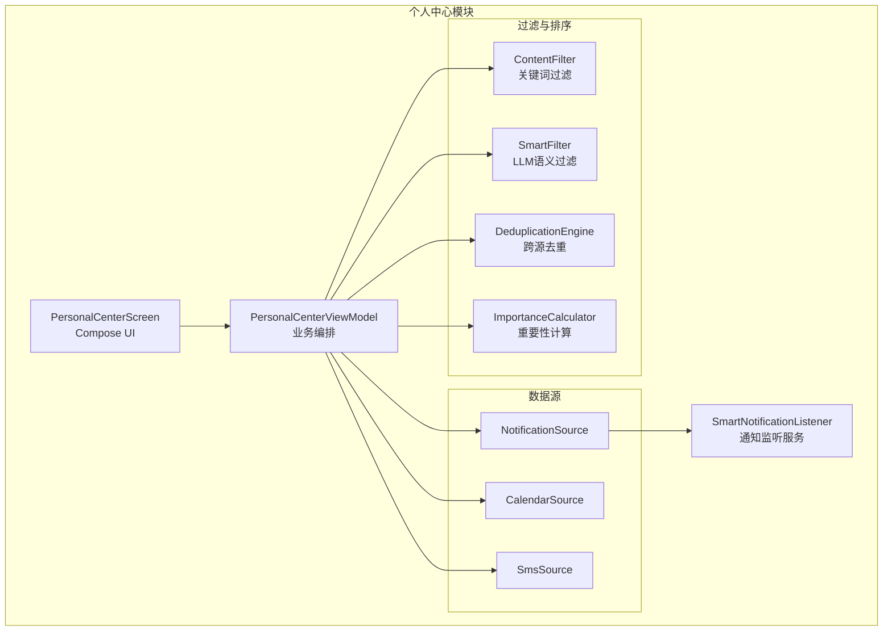
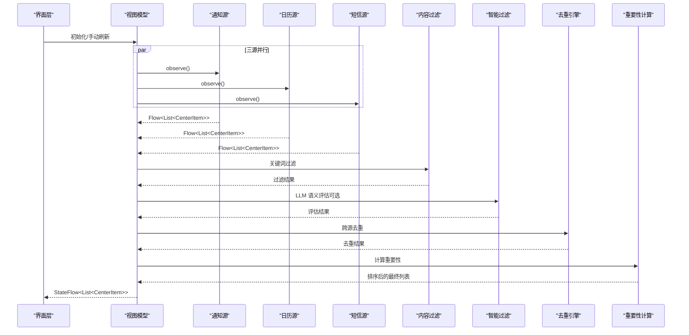
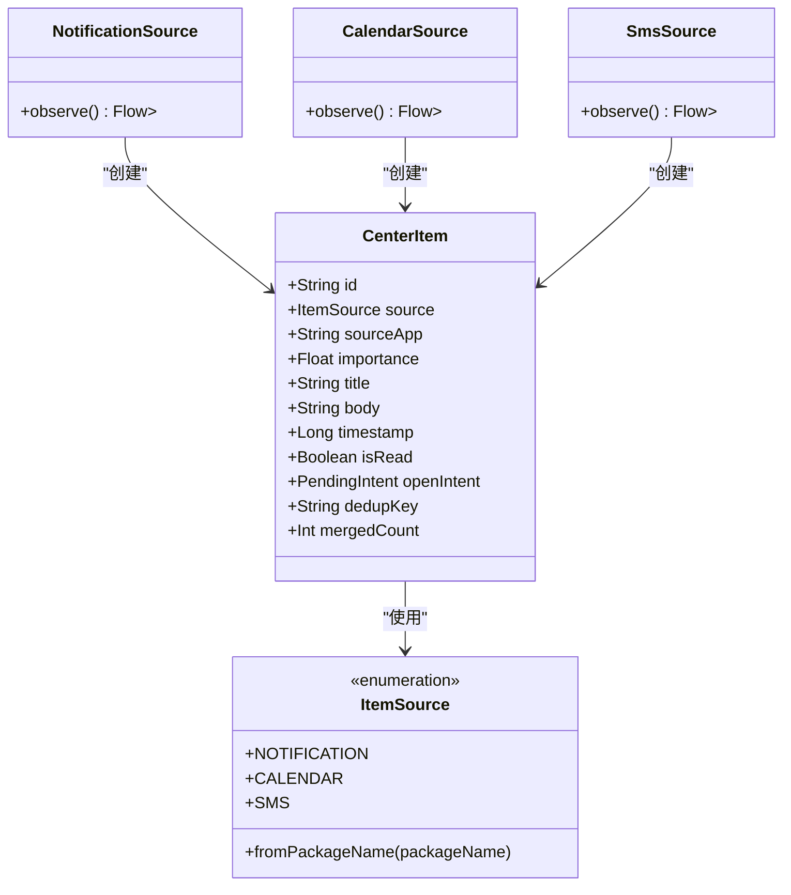
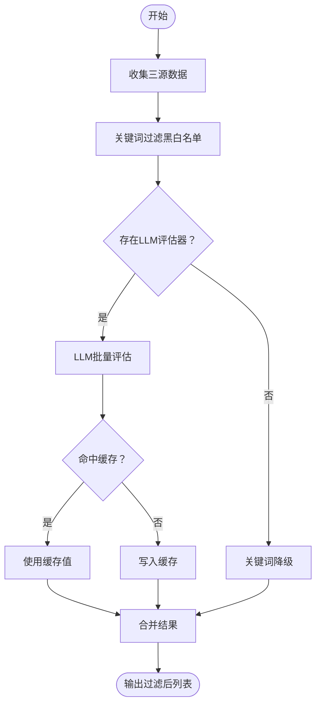
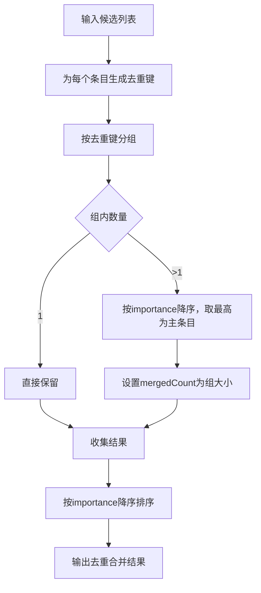
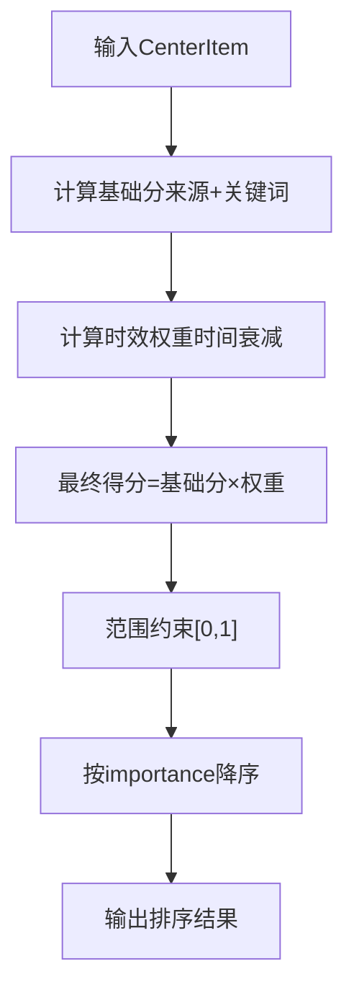
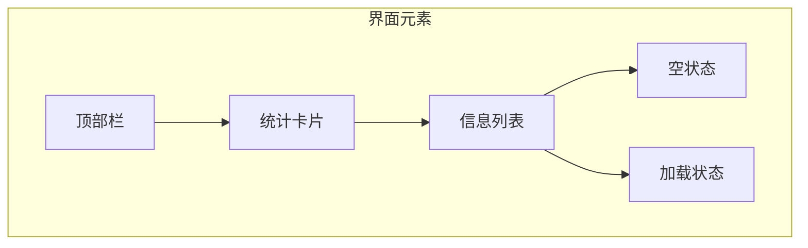
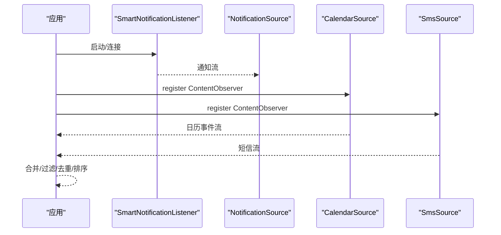
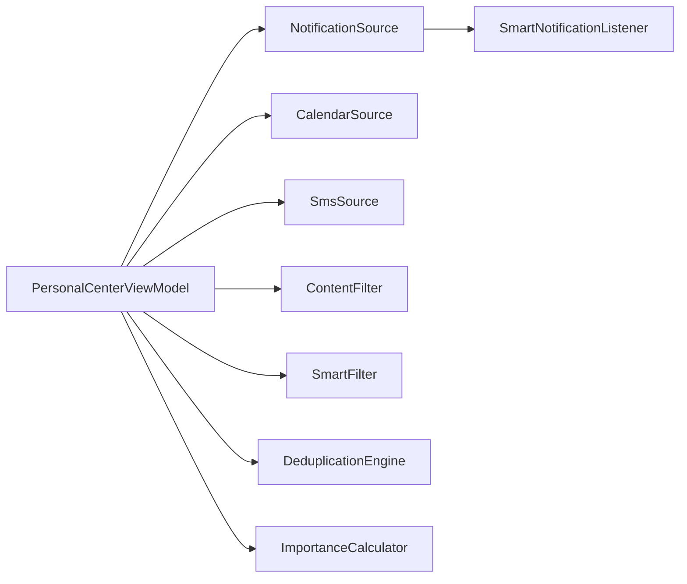

# 个人中心系统

<cite>
**本文档引用的文件**
- [PersonalCenterScreen.kt](file://app/src/main/java/ai/openclaw/android/personalcenter/PersonalCenterScreen.kt)
- [PersonalCenterViewModel.kt](file://app/src/main/java/ai/openclaw/android/personalcenter/PersonalCenterViewModel.kt)
- [ContentFilter.kt](file://app/src/main/java/ai/openclaw/android/personalcenter/ContentFilter.kt)
- [DeduplicationEngine.kt](file://app/src/main/java/ai/openclaw/android/personalcenter/DeduplicationEngine.kt)
- [ImportanceCalculator.kt](file://app/src/main/java/ai/openclaw/android/personalcenter/ImportanceCalculator.kt)
- [SmartFilter.kt](file://app/src/main/java/ai/openclaw/android/personalcenter/SmartFilter.kt)
- [CenterItem.kt](file://app/src/main/java/ai/openclaw/android/personalcenter/models/CenterItem.kt)
- [ItemSource.kt](file://app/src/main/java/ai/openclaw/android/personalcenter/sources/ItemSource.kt)
- [NotificationSource.kt](file://app/src/main/java/ai/openclaw/android/personalcenter/sources/NotificationSource.kt)
- [CalendarSource.kt](file://app/src/main/java/ai/openclaw/android/personalcenter/sources/CalendarSource.kt)
- [SmsSource.kt](file://app/src/main/java/ai/openclaw/android/personalcenter/sources/SmsSource.kt)
- [SmartNotificationListener.kt](file://app/src/main/java/ai/openclaw/android/notification/SmartNotificationListener.kt)
- [Color.kt](file://app/src/main/java/ai/openclaw/android/ui/theme/Color.kt)
- [Theme.kt](file://app/src/main/java/ai/openclaw/android/ui/theme/Theme.kt)
- [ModifierExt.kt](file://app/src/main/java/ai/openclaw/android/ui/theme/ModifierExt.kt)
</cite>

## 目录
1. [简介](#简介)
2. [项目结构](#项目结构)
3. [核心组件](#核心组件)
4. [架构总览](#架构总览)
5. [详细组件分析](#详细组件分析)
6. [依赖关系分析](#依赖关系分析)
7. [性能考虑](#性能考虑)
8. [故障排除指南](#故障排除指南)
9. [结论](#结论)
10. [附录](#附录)

## 简介
个人中心系统是一个统一的信息聚合与展示平台，负责从通知、日历、短信三大来源采集数据，通过内容过滤、跨源去重、重要性计算与智能排序，最终以统一的数据模型呈现给用户。系统采用响应式架构，基于 Kotlin Flow 实时订阅数据源变化，并通过 Compose UI 提供流畅的交互体验。同时，系统支持 LLM 语义评估与缓存降级策略，确保在复杂场景下的稳定性与性能。

## 项目结构
个人中心模块位于 app 模块下，采用按功能域划分的组织方式：
- personalcenter：个人中心业务域，包含界面、视图模型、数据源、过滤与排序等核心逻辑
- personalcenter/models：统一数据模型 CenterItem
- personalcenter/sources：三大数据源的实现
- notification：通知监听服务（SmartNotificationListener）
- ui/theme：Sci-Fi 主题与修饰符

**图表来源**
- [PersonalCenterScreen.kt:46-111](file://app/src/main/java/ai/openclaw/android/personalcenter/PersonalCenterScreen.kt#L46-L111)
- [PersonalCenterViewModel.kt:25-71](file://app/src/main/java/ai/openclaw/android/personalcenter/PersonalCenterViewModel.kt#L25-L71)
- [NotificationSource.kt:22-45](file://app/src/main/java/ai/openclaw/android/personalcenter/sources/NotificationSource.kt#L22-L45)
- [CalendarSource.kt:21-129](file://app/src/main/java/ai/openclaw/android/personalcenter/sources/CalendarSource.kt#L21-L129)
- [SmsSource.kt:22-116](file://app/src/main/java/ai/openclaw/android/personalcenter/sources/SmsSource.kt#L22-L116)
- [ContentFilter.kt:9-76](file://app/src/main/java/ai/openclaw/android/personalcenter/ContentFilter.kt#L9-L76)
- [SmartFilter.kt:15-152](file://app/src/main/java/ai/openclaw/android/personalcenter/SmartFilter.kt#L15-L152)
- [DeduplicationEngine.kt:12-88](file://app/src/main/java/ai/openclaw/android/personalcenter/DeduplicationEngine.kt#L12-L88)
- [ImportanceCalculator.kt:10-110](file://app/src/main/java/ai/openclaw/android/personalcenter/ImportanceCalculator.kt#L10-L110)
- [SmartNotificationListener.kt:19-135](file://app/src/main/java/ai/openclaw/android/notification/SmartNotificationListener.kt#L19-L135)

**章节来源**
- [PersonalCenterScreen.kt:1-498](file://app/src/main/java/ai/openclaw/android/personalcenter/PersonalCenterScreen.kt#L1-L498)
- [PersonalCenterViewModel.kt:1-279](file://app/src/main/java/ai/openclaw/android/personalcenter/PersonalCenterViewModel.kt#L1-L279)

## 核心组件
- 统一数据模型 CenterItem：承载来源、标题、正文、时间戳、重要性、打开意图等字段，支持跨源合并与展示
- 三大数据源：NotificationSource、CalendarSource、SmsSource，分别封装通知监听、日历查询、短信查询，并通过 Flow 输出标准化数据
- 内容过滤层：ContentFilter（关键词黑白名单）、SmartFilter（LLM 语义评估 + 缓存降级）
- 去重引擎：DeduplicationEngine（时间桶 + 关键词指纹），合并跨源重复事件
- 重要性计算：ImportanceCalculator（基础分 + 时效衰减），统一打分体系
- 视图模型：PersonalCenterViewModel 负责合并、过滤、去重、排序与状态管理
- 界面层：PersonalCenterScreen 提供头部统计、统计卡片、列表渲染与交互

**章节来源**
- [CenterItem.kt:10-24](file://app/src/main/java/ai/openclaw/android/personalcenter/models/CenterItem.kt#L10-L24)
- [ItemSource.kt:10-27](file://app/src/main/java/ai/openclaw/android/personalcenter/sources/ItemSource.kt#L10-L27)
- [ContentFilter.kt:9-76](file://app/src/main/java/ai/openclaw/android/personalcenter/ContentFilter.kt#L9-L76)
- [SmartFilter.kt:15-152](file://app/src/main/java/ai/openclaw/android/personalcenter/SmartFilter.kt#L15-L152)
- [DeduplicationEngine.kt:12-88](file://app/src/main/java/ai/openclaw/android/personalcenter/DeduplicationEngine.kt#L12-L88)
- [ImportanceCalculator.kt:10-110](file://app/src/main/java/ai/openclaw/android/personalcenter/ImportanceCalculator.kt#L10-L110)
- [PersonalCenterViewModel.kt:25-71](file://app/src/main/java/ai/openclaw/android/personalcenter/PersonalCenterViewModel.kt#L25-L71)
- [PersonalCenterScreen.kt:46-111](file://app/src/main/java/ai/openclaw/android/personalcenter/PersonalCenterScreen.kt#L46-L111)

## 架构总览
个人中心采用 MVVM + 响应式流的架构：
- 数据源通过 Flow 持续产出标准化 CenterItem 列表
- ViewModel 使用 combine 合并三源数据，依次执行：关键词过滤 → LLM 语义过滤 → 去重 → 最低阈值过滤 → 排序
- UI 通过 StateFlow 订阅 items、isLoading、权限状态，实现自动刷新与状态反馈

**图表来源**
- [PersonalCenterViewModel.kt:138-206](file://app/src/main/java/ai/openclaw/android/personalcenter/PersonalCenterViewModel.kt#L138-L206)
- [ContentFilter.kt:60-75](file://app/src/main/java/ai/openclaw/android/personalcenter/ContentFilter.kt#L60-L75)
- [SmartFilter.kt:63-108](file://app/src/main/java/ai/openclaw/android/personalcenter/SmartFilter.kt#L63-L108)
- [DeduplicationEngine.kt:35-55](file://app/src/main/java/ai/openclaw/android/personalcenter/DeduplicationEngine.kt#L35-L55)
- [ImportanceCalculator.kt:70-74](file://app/src/main/java/ai/openclaw/android/personalcenter/ImportanceCalculator.kt#L70-L74)

## 详细组件分析

### 数据模型与来源
- CenterItem：统一承载通知、日历、短信的结构化信息，支持 openIntent 跳转、合并计数、去重键等
- ItemSource：枚举三类来源及默认图标/标签，支持根据包名推断来源
- 通知源：包装 SmartNotificationListener，将系统通知转换为 CenterItem，并计算重要性
- 日历源：查询日历事件，构造 CenterItem，支持 PendingIntent 打开事件详情
- 短信源：查询短信收件箱，解析发送者名称，构造 CenterItem，支持打开对话

**图表来源**
- [CenterItem.kt:10-24](file://app/src/main/java/ai/openclaw/android/personalcenter/models/CenterItem.kt#L10-L24)
- [ItemSource.kt:10-27](file://app/src/main/java/ai/openclaw/android/personalcenter/sources/ItemSource.kt#L10-L27)
- [NotificationSource.kt:22-45](file://app/src/main/java/ai/openclaw/android/personalcenter/sources/NotificationSource.kt#L22-L45)
- [CalendarSource.kt:21-129](file://app/src/main/java/ai/openclaw/android/personalcenter/sources/CalendarSource.kt#L21-L129)
- [SmsSource.kt:22-116](file://app/src/main/java/ai/openclaw/android/personalcenter/sources/SmsSource.kt#L22-L116)

**章节来源**
- [CenterItem.kt:10-24](file://app/src/main/java/ai/openclaw/android/personalcenter/models/CenterItem.kt#L10-L24)
- [ItemSource.kt:10-27](file://app/src/main/java/ai/openclaw/android/personalcenter/sources/ItemSource.kt#L10-L27)
- [NotificationSource.kt:22-74](file://app/src/main/java/ai/openclaw/android/personalcenter/sources/NotificationSource.kt#L22-L74)
- [CalendarSource.kt:21-130](file://app/src/main/java/ai/openclaw/android/personalcenter/sources/CalendarSource.kt#L21-L130)
- [SmsSource.kt:22-137](file://app/src/main/java/ai/openclaw/android/personalcenter/sources/SmsSource.kt#L22-L137)

### 内容过滤机制
- 关键词过滤（ContentFilter）：基于中文/英文黑白名单快速剔除广告、营销、系统噪音；白名单优先放行
- 智能过滤（SmartFilter）：通过 LLM 对候选内容进行语义评估，支持缓存（1小时 TTL）与降级策略（关键词模式）

**图表来源**
- [PersonalCenterViewModel.kt:162-177](file://app/src/main/java/ai/openclaw/android/personalcenter/PersonalCenterViewModel.kt#L162-L177)
- [ContentFilter.kt:60-75](file://app/src/main/java/ai/openclaw/android/personalcenter/ContentFilter.kt#L60-L75)
- [SmartFilter.kt:63-108](file://app/src/main/java/ai/openclaw/android/personalcenter/SmartFilter.kt#L63-L108)

**章节来源**
- [ContentFilter.kt:9-76](file://app/src/main/java/ai/openclaw/android/personalcenter/ContentFilter.kt#L9-L76)
- [SmartFilter.kt:15-152](file://app/src/main/java/ai/openclaw/android/personalcenter/SmartFilter.kt#L15-L152)
- [PersonalCenterViewModel.kt:162-177](file://app/src/main/java/ai/openclaw/android/personalcenter/PersonalCenterViewModel.kt#L162-L177)

### 跨源去重与合并
- 去重键生成：以 30 分钟时间桶 + 关键词指纹（MD5 截断 12 位）组成唯一键
- 合并策略：相同去重键的条目合并，保留 importance 最高的为主条目，累加 mergedCount
- 降序排序：按 importance 降序输出

**图表来源**
- [DeduplicationEngine.kt:18-55](file://app/src/main/java/ai/openclaw/android/personalcenter/DeduplicationEngine.kt#L18-L55)

**章节来源**
- [DeduplicationEngine.kt:12-88](file://app/src/main/java/ai/openclaw/android/personalcenter/DeduplicationEngine.kt#L12-L88)

### 重要性计算与智能排序
- 基础分：根据来源与关键词判定（通知/日历/短信）
- 时效衰减：基于时间差计算权重（1小时内最高，之后逐步衰减）
- 最终得分：基础分 × 时效权重，范围约束在 0~1
- 排序：按 importance 降序

**图表来源**
- [ImportanceCalculator.kt:70-74](file://app/src/main/java/ai/openclaw/android/personalcenter/ImportanceCalculator.kt#L70-L74)
- [PersonalCenterViewModel.kt:189-194](file://app/src/main/java/ai/openclaw/android/personalcenter/PersonalCenterViewModel.kt#L189-L194)

**章节来源**
- [ImportanceCalculator.kt:10-110](file://app/src/main/java/ai/openclaw/android/personalcenter/ImportanceCalculator.kt#L10-L110)
- [PersonalCenterViewModel.kt:189-194](file://app/src/main/java/ai/openclaw/android/personalcenter/PersonalCenterViewModel.kt#L189-L194)

### 界面设计与用户体验
- 主题：Sci-Fi 暗色主题，强调青色霓虹与深海蓝基底，提供高对比度文本与装饰效果
- 顶部栏：显示未读数与刷新/全部已读操作，未读时突出主容器颜色
- 统计卡片：通知/日程/短信数量与权限状态，权限缺失时支持一键引导授权
- 列表：LazyColumn 渲染，支持动画进入/滑动，未读条目前绘制重要性色条
- 交互：点击标记已读并打开 Intent，长按菜单支持“标记已读/删除”
- 状态：加载中/空状态友好提示

**图表来源**
- [PersonalCenterScreen.kt:116-166](file://app/src/main/java/ai/openclaw/android/personalcenter/PersonalCenterScreen.kt#L116-L166)
- [PersonalCenterScreen.kt:171-211](file://app/src/main/java/ai/openclaw/android/personalcenter/PersonalCenterScreen.kt#L171-L211)
- [PersonalCenterScreen.kt:259-297](file://app/src/main/java/ai/openclaw/android/personalcenter/PersonalCenterScreen.kt#L259-L297)
- [PersonalCenterScreen.kt:454-497](file://app/src/main/java/ai/openclaw/android/personalcenter/PersonalCenterScreen.kt#L454-L497)

**章节来源**
- [PersonalCenterScreen.kt:46-498](file://app/src/main/java/ai/openclaw/android/personalcenter/PersonalCenterScreen.kt#L46-L498)
- [Color.kt:7-40](file://app/src/main/java/ai/openclaw/android/ui/theme/Color.kt#L7-L40)
- [Theme.kt:16-49](file://app/src/main/java/ai/openclaw/android/ui/theme/Theme.kt#L16-L49)
- [ModifierExt.kt:18-84](file://app/src/main/java/ai/openclaw/android/ui/theme/ModifierExt.kt#L18-L84)

### 数据源集成与同步机制
- 通知源：复用 SmartNotificationListener，启动时主动拉取系统通知，后续通过 onNotificationPosted/onNotificationRemoved 实时更新
- 日历源：基于 ContentObserver 监听日历事件变化，查询过去1天至未来7天的事件
- 短信源：基于 ContentObserver 监听短信收件箱变化，查询最近7天的短信
- 权限管理：日历/短信权限缺失时，UI 显示未授权状态并引导授权

**图表来源**
- [SmartNotificationListener.kt:137-292](file://app/src/main/java/ai/openclaw/android/notification/SmartNotificationListener.kt#L137-L292)
- [NotificationSource.kt:26-45](file://app/src/main/java/ai/openclaw/android/personalcenter/sources/NotificationSource.kt#L26-L45)
- [CalendarSource.kt:110-128](file://app/src/main/java/ai/openclaw/android/personalcenter/sources/CalendarSource.kt#L110-L128)
- [SmsSource.kt:100-116](file://app/src/main/java/ai/openclaw/android/personalcenter/sources/SmsSource.kt#L100-L116)

**章节来源**
- [SmartNotificationListener.kt:19-432](file://app/src/main/java/ai/openclaw/android/notification/SmartNotificationListener.kt#L19-L432)
- [NotificationSource.kt:22-74](file://app/src/main/java/ai/openclaw/android/personalcenter/sources/NotificationSource.kt#L22-L74)
- [CalendarSource.kt:21-130](file://app/src/main/java/ai/openclaw/android/personalcenter/sources/CalendarSource.kt#L21-L130)
- [SmsSource.kt:22-137](file://app/src/main/java/ai/openclaw/android/personalcenter/sources/SmsSource.kt#L22-L137)

### 性能优化与缓存策略
- LLM 缓存：SmartFilter 使用并发哈希表缓存评估结果，键包含来源、标题与正文片段哈希，TTL 1 小时
- 关键词降级：LLM 失败或超时（15 秒）时回退关键词模式，保证稳定性
- 去重缓存：去重键生成与关键词提取均具备确定性，减少重复计算
- UI 流式渲染：LazyColumn + 动画入场，避免一次性渲染大量节点
- 权限与兜底：权限缺失时及时反馈，ContentObserver 与周期刷新结合，降低漏通知风险

**章节来源**
- [SmartFilter.kt:18-150](file://app/src/main/java/ai/openclaw/android/personalcenter/SmartFilter.kt#L18-L150)
- [PersonalCenterViewModel.kt:170-176](file://app/src/main/java/ai/openclaw/android/personalcenter/PersonalCenterViewModel.kt#L170-L176)

### 使用示例与配置指导
- 启用通知监听：在系统设置中授予通知监听权限，SmartNotificationListener 将自动连接并开始采集
- 授权日历/短信：当统计卡片显示未授权时，点击卡片引导至系统设置授权
- 手动刷新：点击顶部栏刷新按钮，触发短暂加载状态
- 标记已读/删除：点击条目打开，长按菜单支持标记已读与删除
- LLM 评估器注入：Activity 在创建 ViewModel 后调用 setGatewayContract 注入 LLM 评估器，启用语义过滤

**章节来源**
- [PersonalCenterScreen.kt:77-84](file://app/src/main/java/ai/openclaw/android/personalcenter/PersonalCenterScreen.kt#L77-L84)
- [PersonalCenterViewModel.kt:60-66](file://app/src/main/java/ai/openclaw/android/personalcenter/PersonalCenterViewModel.kt#L60-L66)

### 扩展性与定制化
- 新增数据源：实现 observe() 返回 Flow<List<CenterItem>>，在 ViewModel 中 combine 并接入过滤/去重/排序链路
- 自定义过滤规则：扩展 ContentFilter 或 SmartFilter 的关键词库与阈值
- 重要性打分：调整 ImportanceCalculator 的基础分与时效权重函数，适配不同业务场景
- UI 定制：通过 Sci-Fi 主题色板与修饰符扩展界面风格，保持一致性

**章节来源**
- [PersonalCenterViewModel.kt:138-206](file://app/src/main/java/ai/openclaw/android/personalcenter/PersonalCenterViewModel.kt#L138-L206)
- [ImportanceCalculator.kt:14-74](file://app/src/main/java/ai/openclaw/android/personalcenter/ImportanceCalculator.kt#L14-L74)
- [Color.kt:7-40](file://app/src/main/java/ai/openclaw/android/ui/theme/Color.kt#L7-L40)

## 依赖关系分析
- 低耦合：数据源通过 Flow 解耦，ViewModel 仅依赖抽象接口
- 高内聚：过滤、去重、排序集中在个人中心域内，职责清晰
- 外部依赖：SmartNotificationListener 提供系统通知能力；日历/短信 ContentProvider 提供系统数据

**图表来源**
- [PersonalCenterViewModel.kt:31-33](file://app/src/main/java/ai/openclaw/android/personalcenter/PersonalCenterViewModel.kt#L31-L33)
- [NotificationSource.kt:22-45](file://app/src/main/java/ai/openclaw/android/personalcenter/sources/NotificationSource.kt#L22-L45)
- [CalendarSource.kt:21-129](file://app/src/main/java/ai/openclaw/android/personalcenter/sources/CalendarSource.kt#L21-L129)
- [SmsSource.kt:22-116](file://app/src/main/java/ai/openclaw/android/personalcenter/sources/SmsSource.kt#L22-L116)
- [SmartNotificationListener.kt:19-135](file://app/src/main/java/ai/openclaw/android/notification/SmartNotificationListener.kt#L19-L135)

**章节来源**
- [PersonalCenterViewModel.kt:25-71](file://app/src/main/java/ai/openclaw/android/personalcenter/PersonalCenterViewModel.kt#L25-L71)

## 性能考虑
- 流式处理：使用 Kotlin Flow 与协程，避免阻塞主线程
- 批量评估：LLM 评估采用批量输入，减少调用次数
- 缓存命中：LLM 缓存与关键词降级降低重复计算与网络请求
- UI 优化：LazyColumn + 动画过渡，提升滚动体验
- 权限与异常：对权限缺失与异常进行降级处理，保证稳定性

[本节为通用性能建议，无需特定文件引用]

## 故障排除指南
- 通知未显示：检查通知监听权限是否授予；若未连接，SmartNotificationListener 会回退到内存 StateFlow
- 日历/短信无数据：确认权限已授予；权限缺失时 UI 会显示未授权状态
- LLM 评估失败：系统自动降级为关键词模式；可在 setGatewayContract 注入可用的评估器
- 去重异常：检查去重键生成逻辑与关键词提取，确保输入文本清洗一致

**章节来源**
- [SmartNotificationListener.kt:157-182](file://app/src/main/java/ai/openclaw/android/notification/SmartNotificationListener.kt#L157-L182)
- [PersonalCenterViewModel.kt:146-155](file://app/src/main/java/ai/openclaw/android/personalcenter/PersonalCenterViewModel.kt#L146-L155)
- [SmartFilter.kt:87-96](file://app/src/main/java/ai/openclaw/android/personalcenter/SmartFilter.kt#L87-L96)

## 结论
个人中心系统通过清晰的分层架构与响应式数据流，实现了从多源数据到统一信息流的高效转换。内容过滤、跨源去重与重要性计算共同保障了信息质量与相关性；UI 层采用 Sci-Fi 主题与流畅动画，提升了用户体验。系统具备良好的扩展性与定制化能力，便于在复杂场景中持续演进。

[本节为总结性内容，无需特定文件引用]

## 附录
- 主题与修饰符：Sci-Fi 色板、发光与磨砂效果修饰符，统一界面风格
- 数据模型：CenterItem 字段说明与使用场景
- 来源枚举：ItemSource 的三类来源与默认图标/标签

**章节来源**
- [Color.kt:7-40](file://app/src/main/java/ai/openclaw/android/ui/theme/Color.kt#L7-L40)
- [Theme.kt:66-86](file://app/src/main/java/ai/openclaw/android/ui/theme/Theme.kt#L66-L86)
- [ModifierExt.kt:18-84](file://app/src/main/java/ai/openclaw/android/ui/theme/ModifierExt.kt#L18-L84)
- [CenterItem.kt:10-24](file://app/src/main/java/ai/openclaw/android/personalcenter/models/CenterItem.kt#L10-L24)
- [ItemSource.kt:10-27](file://app/src/main/java/ai/openclaw/android/personalcenter/sources/ItemSource.kt#L10-L27)