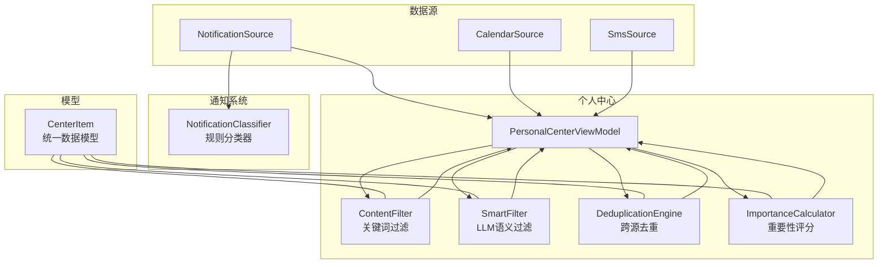
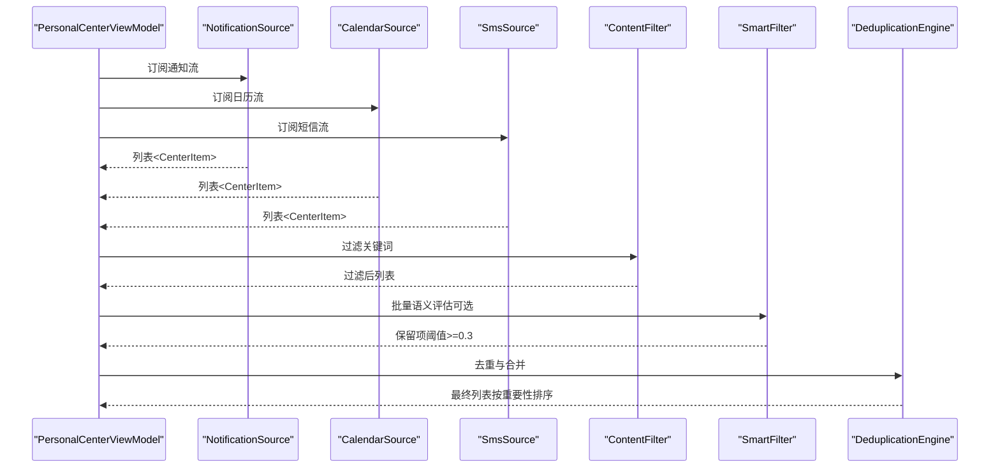
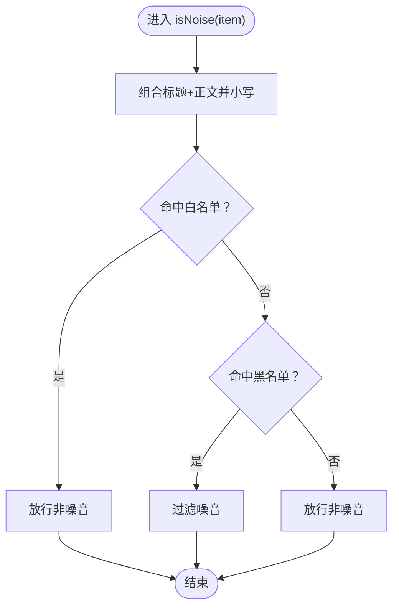
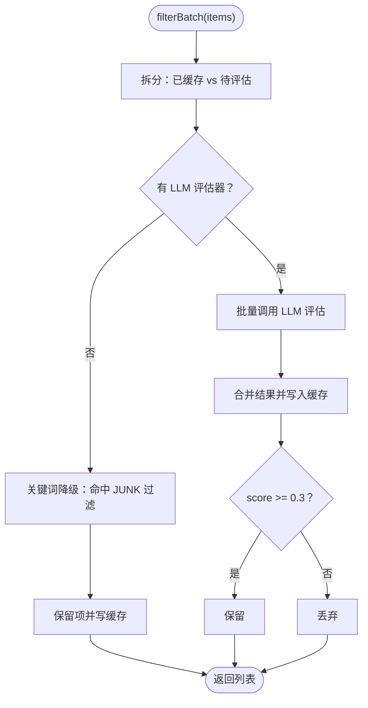
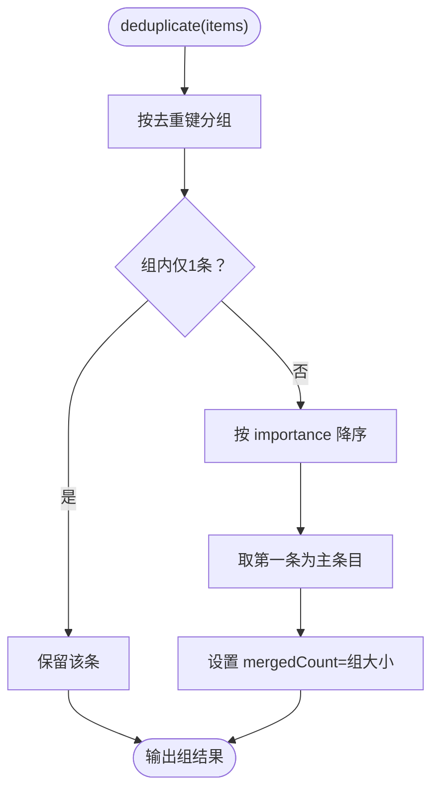
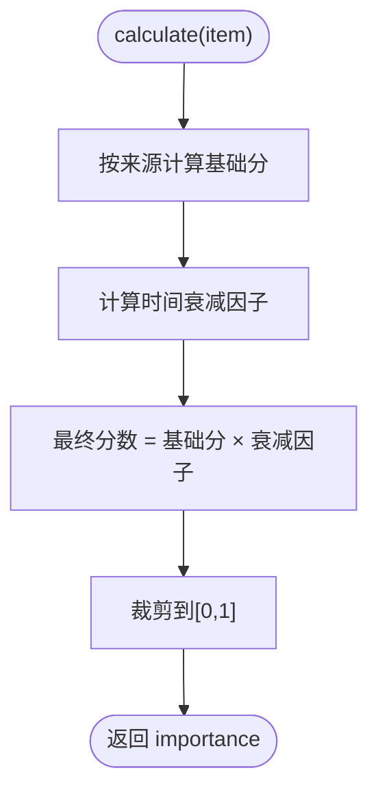
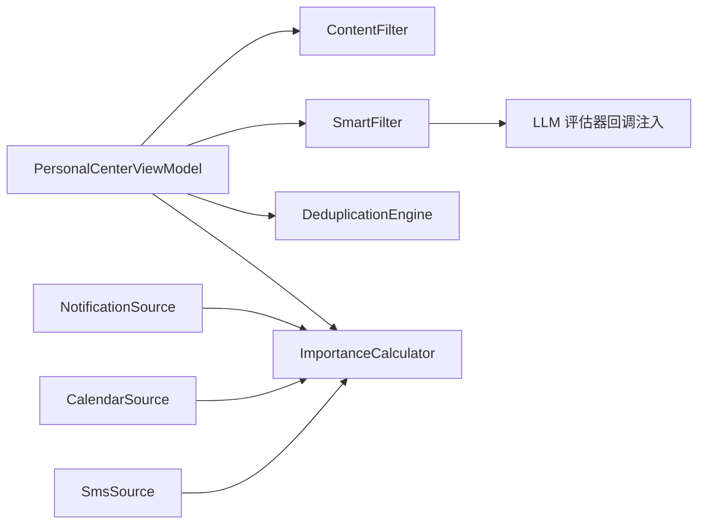

# 内容过滤机制

<cite>
**本文引用的文件**
- [ContentFilter.kt](file://app/src/main/java/ai/openclaw/android/personalcenter/ContentFilter.kt)
- [SmartFilter.kt](file://app/src/main/java/ai/openclaw/android/personalcenter/SmartFilter.kt)
- [DeduplicationEngine.kt](file://app/src/main/java/ai/openclaw/android/personalcenter/DeduplicationEngine.kt)
- [PersonalCenterViewModel.kt](file://app/src/main/java/ai/openclaw/android/personalcenter/PersonalCenterViewModel.kt)
- [CenterItem.kt](file://app/src/main/java/ai/openclaw/android/personalcenter/models/CenterItem.kt)
- [NotificationSource.kt](file://app/src/main/java/ai/openclaw/android/personalcenter/sources/NotificationSource.kt)
- [CalendarSource.kt](file://app/src/main/java/ai/openclaw/android/personalcenter/sources/CalendarSource.kt)
- [SmsSource.kt](file://app/src/main/java/ai/openclaw/android/personalcenter/sources/SmsSource.kt)
- [ImportanceCalculator.kt](file://app/src/main/java/ai/openclaw/android/personalcenter/ImportanceCalculator.kt)
- [NotificationClassifier.kt](file://app/src/main/java/ai/openclaw/android/notification/NotificationClassifier.kt)
- [README.md（通知分类模型）](file://app/src/main/assets/models/README.md)
</cite>

## 目录
1. [简介](#简介)
2. [项目结构](#项目结构)
3. [核心组件](#核心组件)
4. [架构总览](#架构总览)
5. [详细组件分析](#详细组件分析)
6. [依赖关系分析](#依赖关系分析)
7. [性能与缓存](#性能与缓存)
8. [故障排查指南](#故障排查指南)
9. [结论](#结论)
10. [附录](#附录)

## 简介
本文件系统性阐述“内容过滤机制”的设计与实现，覆盖以下方面：
- 核心算法与规则：关键词黑白名单、语义过滤（LLM）、跨源去重、重要性评分与时间衰减。
- 过滤器配置与自定义规则：如何扩展关键词库、调整阈值、注入 LLM 评估器。
- 不同类型内容的过滤策略与优先级：通知、日历、短信三源的差异化处理。
- 过滤结果的数据结构与输出格式：统一模型 CenterItem 及其字段语义。
- 性能优化与缓存：并发缓存、批量评估、超时降级、关键词快速路径。
- 实际使用示例与最佳实践：在个人中心页面中的调用链路与建议。
- 扩展性与插件化：回调注入、规则库模块化、ML 模型可替换。

## 项目结构
内容过滤相关代码主要位于 personalcenter 子模块，并与通知分类器、数据源、重要性计算等模块协同工作。

图示来源
- [PersonalCenterViewModel.kt:138-186](file://app/src/main/java/ai/openclaw/android/personalcenter/PersonalCenterViewModel.kt#L138-L186)
- [ContentFilter.kt:1-76](file://app/src/main/java/ai/openclaw/android/personalcenter/ContentFilter.kt#L1-L76)
- [SmartFilter.kt:1-152](file://app/src/main/java/ai/openclaw/android/personalcenter/SmartFilter.kt#L1-L152)
- [DeduplicationEngine.kt:1-88](file://app/src/main/java/ai/openclaw/android/personalcenter/DeduplicationEngine.kt#L1-L88)
- [ImportanceCalculator.kt:1-110](file://app/src/main/java/ai/openclaw/android/personalcenter/ImportanceCalculator.kt#L1-L110)
- [NotificationSource.kt:1-74](file://app/src/main/java/ai/openclaw/android/personalcenter/sources/NotificationSource.kt#L1-L74)
- [CalendarSource.kt:1-130](file://app/src/main/java/ai/openclaw/android/personalcenter/sources/CalendarSource.kt#L1-L130)
- [SmsSource.kt:1-137](file://app/src/main/java/ai/openclaw/android/personalcenter/sources/SmsSource.kt#L1-L137)
- [NotificationClassifier.kt:1-476](file://app/src/main/java/ai/openclaw/android/notification/NotificationClassifier.kt#L1-L476)
- [CenterItem.kt:1-24](file://app/src/main/java/ai/openclaw/android/personalcenter/models/CenterItem.kt#L1-L24)

章节来源
- [PersonalCenterViewModel.kt:138-186](file://app/src/main/java/ai/openclaw/android/personalcenter/PersonalCenterViewModel.kt#L138-L186)
- [NotificationSource.kt:26-45](file://app/src/main/java/ai/openclaw/android/personalcenter/sources/NotificationSource.kt#L26-L45)
- [CalendarSource.kt:25-128](file://app/src/main/java/ai/openclaw/android/personalcenter/sources/CalendarSource.kt#L25-L128)
- [SmsSource.kt:26-116](file://app/src/main/java/ai/openclaw/android/personalcenter/sources/SmsSource.kt#L26-L116)

## 核心组件
- 关键词过滤 ContentFilter：基于黑白名单的快速过滤层，适合高吞吐场景。
- 语义过滤 SmartFilter：通过 LLM 评估内容价值，支持缓存与降级；关键词作为纯规则降级路径。
- 跨源去重 DeduplicationEngine：基于时间桶与关键词指纹的去重与合并。
- 重要性评分 ImportanceCalculator：按来源与时效对内容打分，作为排序依据。
- 数据模型 CenterItem：统一承载来源、标题、正文、时间戳、重要性、去重键等字段。
- 数据源 Sources：通知、日历、短信三源分别封装为 Flow，统一转换为 CenterItem。
- 通知分类器 NotificationClassifier：独立的通知规则分类器（与个人中心过滤互补）。

章节来源
- [ContentFilter.kt:1-76](file://app/src/main/java/ai/openclaw/android/personalcenter/ContentFilter.kt#L1-L76)
- [SmartFilter.kt:1-152](file://app/src/main/java/ai/openclaw/android/personalcenter/SmartFilter.kt#L1-L152)
- [DeduplicationEngine.kt:1-88](file://app/src/main/java/ai/openclaw/android/personalcenter/DeduplicationEngine.kt#L1-L88)
- [ImportanceCalculator.kt:1-110](file://app/src/main/java/ai/openclaw/android/personalcenter/ImportanceCalculator.kt#L1-L110)
- [CenterItem.kt:1-24](file://app/src/main/java/ai/openclaw/android/personalcenter/models/CenterItem.kt#L1-L24)
- [NotificationSource.kt:1-74](file://app/src/main/java/ai/openclaw/android/personalcenter/sources/NotificationSource.kt#L1-L74)
- [CalendarSource.kt:1-130](file://app/src/main/java/ai/openclaw/android/personalcenter/sources/CalendarSource.kt#L1-L130)
- [SmsSource.kt:1-137](file://app/src/main/java/ai/openclaw/android/personalcenter/sources/SmsSource.kt#L1-L137)
- [NotificationClassifier.kt:1-476](file://app/src/main/java/ai/openclaw/android/notification/NotificationClassifier.kt#L1-L476)

## 架构总览
个人中心的过滤流程分为三层：关键词快速过滤 → LLM 语义过滤（可选）→ 跨源去重与排序。同时，各数据源在产出阶段即完成基础重要性评分。

图示来源
- [PersonalCenterViewModel.kt:138-186](file://app/src/main/java/ai/openclaw/android/personalcenter/PersonalCenterViewModel.kt#L138-L186)
- [ContentFilter.kt:60-75](file://app/src/main/java/ai/openclaw/android/personalcenter/ContentFilter.kt#L60-L75)
- [SmartFilter.kt:63-108](file://app/src/main/java/ai/openclaw/android/personalcenter/SmartFilter.kt#L63-L108)
- [DeduplicationEngine.kt:35-55](file://app/src/main/java/ai/openclaw/android/personalcenter/DeduplicationEngine.kt#L35-L55)

## 详细组件分析

### 组件A：关键词过滤 ContentFilter
- 职责：对输入的 CenterItem 进行快速黑白名单判定，返回是否为噪音。
- 关键点：
  - 白名单优先：命中白名单直接放行。
  - 黑名单判定：命中黑名单直接过滤。
  - 默认放行：其余内容放行。
- 复杂度：O(k) 检索 k 为关键词集合大小；整体 O(n·k) 处理 n 个条目。
- 适用场景：高频、低延迟的预过滤。

图示来源
- [ContentFilter.kt:60-75](file://app/src/main/java/ai/openclaw/android/personalcenter/ContentFilter.kt#L60-L75)

章节来源
- [ContentFilter.kt:1-76](file://app/src/main/java/ai/openclaw/android/personalcenter/ContentFilter.kt#L1-L76)

### 组件B：语义过滤 SmartFilter（LLM 评估 + 缓存）
- 职责：对剩余条目进行 LLM 语义评估，支持缓存与降级。
- 关键点：
  - 缓存：以来源+标题+正文片段哈希为键，1小时 TTL；命中阈值≥0.3 保留。
  - 降级：无 LLM 或异常时，采用关键词模式（JUNK_KEYWORDS）快速判定，命中则过滤。
  - 批量评估：一次请求返回 Map<id, score>，便于缓存与筛选。
- 复杂度：缓存命中 O(1)，未命中取决于 LLM 调用耗时；整体批处理更高效。
- 适用场景：对噪音敏感、需要语义理解的场景。

图示来源
- [SmartFilter.kt:63-108](file://app/src/main/java/ai/openclaw/android/personalcenter/SmartFilter.kt#L63-L108)
- [SmartFilter.kt:126-146](file://app/src/main/java/ai/openclaw/android/personalcenter/SmartFilter.kt#L126-L146)

章节来源
- [SmartFilter.kt:1-152](file://app/src/main/java/ai/openclaw/android/personalcenter/SmartFilter.kt#L1-L152)

### 组件C：跨源去重 DeduplicationEngine
- 职责：合并同一事件在不同来源出现的情况，保留最高重要性条目并统计合并数量。
- 关键点：
  - 去重键：30 分钟时间桶 + 关键词指纹（MD5 截断）。
  - 合并策略：相同键聚合，取 importance 最高的为主条目，合并计数累加。
- 复杂度：O(n·log n) 排序主导；分组 O(n)；指纹提取 O(m)（m 为清洗后词数）。

图示来源
- [DeduplicationEngine.kt:35-55](file://app/src/main/java/ai/openclaw/android/personalcenter/DeduplicationEngine.kt#L35-L55)
- [DeduplicationEngine.kt:18-27](file://app/src/main/java/ai/openclaw/android/personalcenter/DeduplicationEngine.kt#L18-L27)

章节来源
- [DeduplicationEngine.kt:1-88](file://app/src/main/java/ai/openclaw/android/personalcenter/DeduplicationEngine.kt#L1-L88)

### 组件D：重要性评分 ImportanceCalculator
- 职责：为 CenterItem 计算基础分与时间衰减因子，最终 importance ∈ [0,1]。
- 关键点：
  - 通知：按紧急/重要/一般关键词赋初分。
  - 日历：按开始时间与当前时间差赋初分。
  - 短信：按验证码/银行/快递/支付等关键词赋初分。
  - 时间衰减：越新越重要，超过一周衰减至极低。
- 复杂度：O(1) 每条。

图示来源
- [ImportanceCalculator.kt:70-74](file://app/src/main/java/ai/openclaw/android/personalcenter/ImportanceCalculator.kt#L70-L74)
- [ImportanceCalculator.kt:55-66](file://app/src/main/java/ai/openclaw/android/personalcenter/ImportanceCalculator.kt#L55-L66)

章节来源
- [ImportanceCalculator.kt:1-110](file://app/src/main/java/ai/openclaw/android/personalcenter/ImportanceCalculator.kt#L1-L110)

### 组件E：数据模型 CenterItem
- 字段语义：唯一 id、来源、来源应用名、重要性、标题、正文、时间戳、创建时间、是否已读、打开意图、去重键、合并计数。
- 作用：统一三源数据结构，贯穿过滤、去重、排序与 UI 展示。

章节来源
- [CenterItem.kt:1-24](file://app/src/main/java/ai/openclaw/android/personalcenter/models/CenterItem.kt#L1-L24)

### 组件F：数据源 Sources
- 通知源：包装现有通知监听器，映射为 CenterItem 并计算 importance。
- 日历源：查询日程事件，构造 CenterItem 并计算 importance。
- 短信源：查询短信记录，解析发送者，构造 CenterItem 并计算 importance。
- 统一输出：Flow<List<CenterItem>>，供 ViewModel 聚合。

章节来源
- [NotificationSource.kt:26-45](file://app/src/main/java/ai/openclaw/android/personalcenter/sources/NotificationSource.kt#L26-L45)
- [CalendarSource.kt:25-128](file://app/src/main/java/ai/openclaw/android/personalcenter/sources/CalendarSource.kt#L25-L128)
- [SmsSource.kt:26-116](file://app/src/main/java/ai/openclaw/android/personalcenter/sources/SmsSource.kt#L26-L116)

### 组件G：通知分类器 NotificationClassifier（独立于个人中心）
- 职责：对单条通知进行规则分类（紧急/重要/一般/噪音），考虑包名优先级、关键词、时间上下文、ML 模型。
- 与个人中心的关系：二者互补，前者面向“个人中心统一视图”，后者面向“通知侧边栏/列表”展示。

章节来源
- [NotificationClassifier.kt:298-356](file://app/src/main/java/ai/openclaw/android/notification/NotificationClassifier.kt#L298-L356)
- [README.md（通知分类模型）:1-26](file://app/src/main/assets/models/README.md#L1-L26)

## 依赖关系分析
- PersonalCenterViewModel 依赖 ContentFilter、SmartFilter、DeduplicationEngine、ImportanceCalculator。
- 数据源（NotificationSource/CalendarSource/SmsSource）依赖 ImportanceCalculator 产出 importance。
- SmartFilter 依赖 GatewayContract 注入的 LLM 评估器，支持降级。
- NotificationClassifier 独立存在，与个人中心过滤互不耦合。

图示来源
- [PersonalCenterViewModel.kt:60-66](file://app/src/main/java/ai/openclaw/android/personalcenter/PersonalCenterViewModel.kt#L60-L66)
- [SmartFilter.kt:22-31](file://app/src/main/java/ai/openclaw/android/personalcenter/SmartFilter.kt#L22-L31)

章节来源
- [PersonalCenterViewModel.kt:1-163](file://app/src/main/java/ai/openclaw/android/personalcenter/PersonalCenterViewModel.kt#L1-L163)
- [SmartFilter.kt:1-152](file://app/src/main/java/ai/openclaw/android/personalcenter/SmartFilter.kt#L1-L152)

## 性能与缓存
- 缓存策略
  - SmartFilter：ConcurrentHashMap + 1小时 TTL；键包含来源、标题哈希与正文前 50 字符哈希，避免标题相同但内容不同的误判。
  - DeduplicationEngine：30 分钟时间桶 + MD5 截断指纹，降低冲突概率。
- 批处理与降级
  - SmartFilter 支持批量评估，减少往返开销；LLM 异常或超时自动降级为关键词模式。
  - withTimeout(15s) 保护，避免阻塞 UI。
- 关键词快速路径
  - ContentFilter 与 SmartFilter 的关键词库均采用集合查找，O(k) 复杂度。
- 并发与线程安全
  - SmartFilter 使用并发缓存容器；ViewModel 使用协程 Flow 组合多源数据。

章节来源
- [SmartFilter.kt:18-19](file://app/src/main/java/ai/openclaw/android/personalcenter/SmartFilter.kt#L18-L19)
- [SmartFilter.kt:126-146](file://app/src/main/java/ai/openclaw/android/personalcenter/SmartFilter.kt#L126-L146)
- [DeduplicationEngine.kt:18-27](file://app/src/main/java/ai/openclaw/android/personalcenter/DeduplicationEngine.kt#L18-L27)
- [PersonalCenterViewModel.kt:165-176](file://app/src/main/java/ai/openclaw/android/personalcenter/PersonalCenterViewModel.kt#L165-L176)

## 故障排查指南
- LLM 评估失败或超时
  - 现象：SmartFilter 抛出超时或异常，回退到关键词降级。
  - 处理：检查 LLM 评估器注入是否正确；适当增大超时或优化模型。
- 缓存命中率低
  - 现象：相同内容反复调用 LLM。
  - 处理：确认缓存键构建逻辑（标题+正文片段哈希）；确保 id 与正文稳定。
- 去重效果不佳
  - 现象：同一事件多次出现。
  - 处理：检查去重键生成逻辑与时间桶；必要时调整指纹提取策略。
- 权限问题导致数据源为空
  - 现象：日历/短信源返回空列表。
  - 处理：检查权限授予与异常捕获；ViewModel 已做降级处理。

章节来源
- [PersonalCenterViewModel.kt:140-155](file://app/src/main/java/ai/openclaw/android/personalcenter/PersonalCenterViewModel.kt#L140-L155)
- [PersonalCenterViewModel.kt:165-185](file://app/src/main/java/ai/openclaw/android/personalcenter/PersonalCenterViewModel.kt#L165-L185)
- [CalendarSource.kt:101-107](file://app/src/main/java/ai/openclaw/android/personalcenter/sources/CalendarSource.kt#L101-L107)
- [SmsSource.kt:91-97](file://app/src/main/java/ai/openclaw/android/personalcenter/sources/SmsSource.kt#L91-L97)

## 结论
本内容过滤机制通过“关键词快速过滤 + LLM 语义过滤 + 跨源去重”的分层设计，在保证性能的同时兼顾准确性与可扩展性。黑白名单与关键词库可灵活扩展；LLM 评估器通过回调注入，便于替换与降级；缓存与批处理进一步提升吞吐。结合 ImportanceCalculator 的时间衰减，最终输出高质量、有序的内容列表。

## 附录

### 过滤规则与配置选项
- ContentFilter
  - 白名单关键词集合：用于直接放行。
  - 黑名单关键词集合：用于过滤噪音。
- SmartFilter
  - 白名单关键词集合：即使命中关键词也不过滤。
  - 垃圾关键词集合：关键词降级时的过滤依据。
  - 评估阈值：≥0.3 保留。
  - 缓存 TTL：默认 1 小时。
- DeduplicationEngine
  - 去重键：30 分钟时间桶 + 关键词指纹（MD5 截断）。
- ImportanceCalculator
  - 通知/日历/短信的基础分与时间衰减因子。
- 通知分类器（独立）
  - 包名优先级、关键词库、时间上下文调整、ML 模型。

章节来源
- [ContentFilter.kt:13-47](file://app/src/main/java/ai/openclaw/android/personalcenter/ContentFilter.kt#L13-L47)
- [SmartFilter.kt:34-53](file://app/src/main/java/ai/openclaw/android/personalcenter/SmartFilter.kt#L34-L53)
- [SmartFilter.kt:18-19](file://app/src/main/java/ai/openclaw/android/personalcenter/SmartFilter.kt#L18-L19)
- [DeduplicationEngine.kt:18-27](file://app/src/main/java/ai/openclaw/android/personalcenter/DeduplicationEngine.kt#L18-L27)
- [ImportanceCalculator.kt:70-74](file://app/src/main/java/ai/openclaw/android/personalcenter/ImportanceCalculator.kt#L70-L74)
- [NotificationClassifier.kt:298-356](file://app/src/main/java/ai/openclaw/android/notification/NotificationClassifier.kt#L298-L356)

### 自定义规则与扩展建议
- 扩展关键词库
  - 在 ContentFilter/SmartFilter 的关键词集合中追加新词条；注意大小写忽略与语言覆盖。
- 调整阈值
  - 修改 SmartFilter 的评估阈值与降级策略；根据业务反馈迭代。
- 注入 LLM 评估器
  - 通过 ViewModel 的 setGatewayContract 注入 LLM 评估回调；确保 withTimeout 与异常处理。
- 去重策略
  - 调整时间桶长度与指纹提取规则；平衡去重精度与性能。
- 重要性评分
  - 针对特定业务场景调整关键词权重与时间衰减曲线。

章节来源
- [PersonalCenterViewModel.kt:60-66](file://app/src/main/java/ai/openclaw/android/personalcenter/PersonalCenterViewModel.kt#L60-L66)
- [SmartFilter.kt:63-108](file://app/src/main/java/ai/openclaw/android/personalcenter/SmartFilter.kt#L63-L108)
- [DeduplicationEngine.kt:35-55](file://app/src/main/java/ai/openclaw/android/personalcenter/DeduplicationEngine.kt#L35-L55)
- [ImportanceCalculator.kt:70-74](file://app/src/main/java/ai/openclaw/android/personalcenter/ImportanceCalculator.kt#L70-L74)

### 过滤结果的数据结构与输出格式
- 统一模型：CenterItem
  - 字段：id、source、sourceApp、importance、title、body、timestamp、createdAt、isRead、openIntent、dedupKey、mergedCount。
- 输出格式：List<CenterItem>，按 importance 降序排列；去重后保留主条目并标注合并数量。
- 与 UI 的衔接：ViewModel 的 items StateFlow 供 Compose/Activity 使用。

章节来源
- [CenterItem.kt:10-23](file://app/src/main/java/ai/openclaw/android/personalcenter/models/CenterItem.kt#L10-L23)
- [DeduplicationEngine.kt:45-54](file://app/src/main/java/ai/openclaw/android/personalcenter/DeduplicationEngine.kt#L45-L54)
- [PersonalCenterViewModel.kt:36-37](file://app/src/main/java/ai/openclaw/android/personalcenter/PersonalCenterViewModel.kt#L36-L37)

### 实际使用示例与最佳实践
- 示例：个人中心页面加载流程
  - 订阅三源数据流 → 关键词过滤 → LLM 语义过滤（可选）→ 去重 → 排序 → 输出给 UI。
- 最佳实践
  - 优先使用关键词快速过滤，再进行 LLM 评估，控制成本。
  - 为 LLM 评估设置超时与降级，避免阻塞主线程。
  - 合理设置去重键与时间桶，兼顾准确与性能。
  - 根据业务场景动态调整关键词库与阈值。

章节来源
- [PersonalCenterViewModel.kt:138-186](file://app/src/main/java/ai/openclaw/android/personalcenter/PersonalCenterViewModel.kt#L138-L186)

### 插件化与扩展性
- 回调注入：SmartFilter 的 LlmEvaluator 通过接口注入，避免硬编码依赖。
- 规则模块化：关键词库与阈值可集中管理，便于热更新或 A/B 实验。
- ML 模型可替换：通知分类器支持 TFLite 模型，无模型时自动走规则降级。
- 数据源扩展：新增数据源只需实现 Flow<List<CenterItem>> 并复用 ImportanceCalculator。

章节来源
- [SmartFilter.kt:22-31](file://app/src/main/java/ai/openclaw/android/personalcenter/SmartFilter.kt#L22-L31)
- [NotificationClassifier.kt:329-334](file://app/src/main/java/ai/openclaw/android/notification/NotificationClassifier.kt#L329-L334)
- [README.md（通知分类模型）:1-26](file://app/src/main/assets/models/README.md#L1-L26)