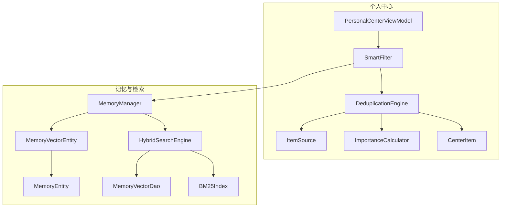
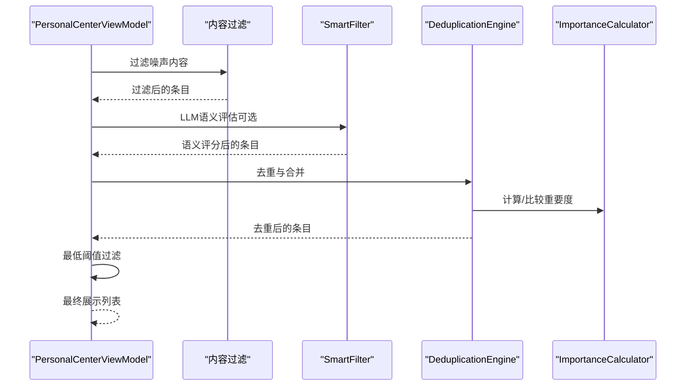
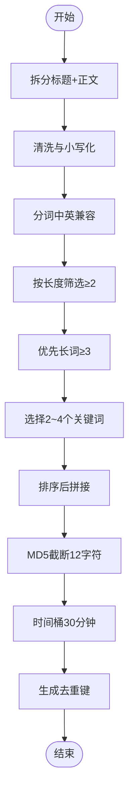
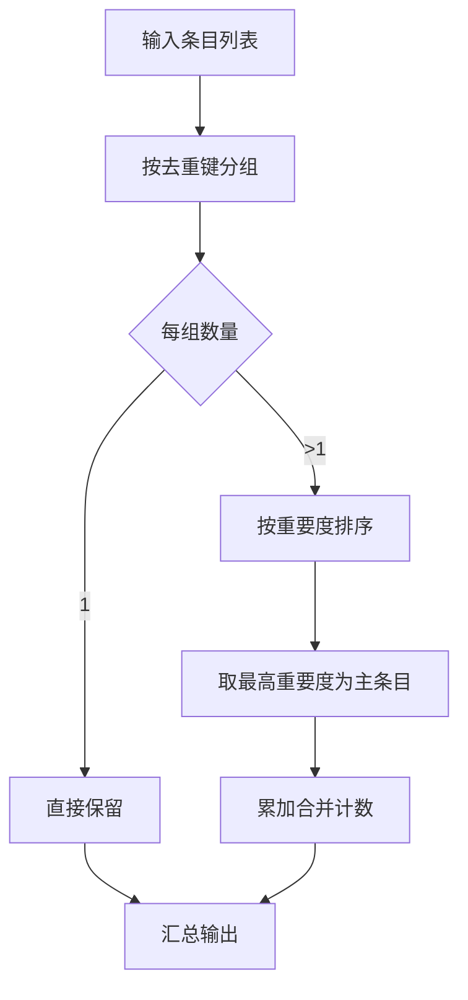
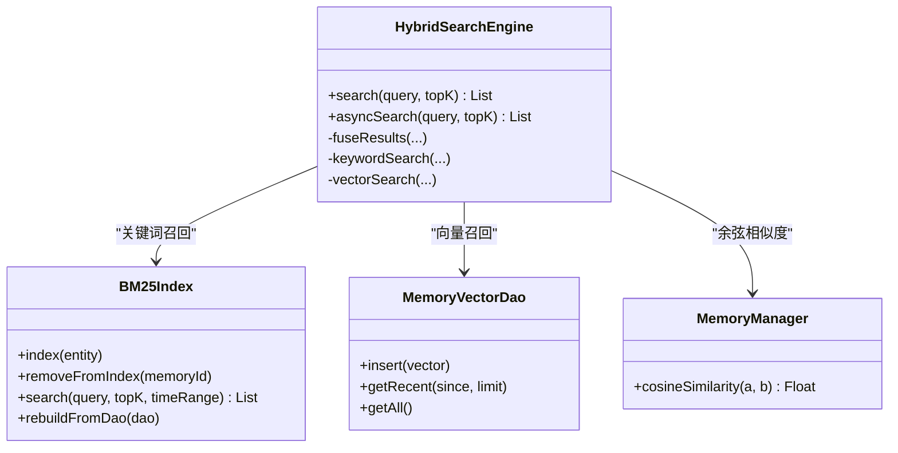
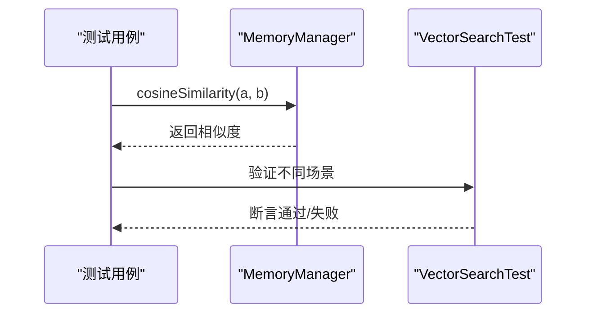
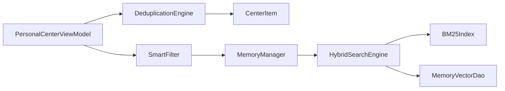

# 去重引擎

<cite>
**本文引用的文件**
- [DeduplicationEngine.kt](file://app/src/main/java/ai/openclaw/android/personalcenter/DeduplicationEngine.kt)
- [CenterItem.kt](file://app/src/main/java/ai/openclaw/android/personalcenter/models/CenterItem.kt)
- [PersonalCenterViewModel.kt](file://app/src/main/java/ai/openclaw/android/personalcenter/PersonalCenterViewModel.kt)
- [ItemSource.kt](file://app/src/main/java/ai/openclaw/android/personalcenter/sources/ItemSource.kt)
- [ImportanceCalculator.kt](file://app/src/main/java/ai/openclaw/android/personalcenter/ImportanceCalculator.kt)
- [SmartFilter.kt](file://app/src/main/java/ai/openclaw/android/personalcenter/SmartFilter.kt)
- [MemoryManager.kt](file://app/src/main/java/ai/openclaw/android/domain/memory/MemoryManager.kt)
- [HybridSearchEngine.kt](file://app/src/main/java/ai/openclaw/android/domain/memory/HybridSearchEngine.kt)
- [BM25Index.kt](file://app/src/main/java/ai/openclaw/android/data/local/BM25Index.kt)
- [MemoryEntity.kt](file://app/src/main/java/ai/openclaw/android/data/model/MemoryEntity.kt)
- [MemoryVectorEntity.kt](file://app/src/main/java/ai/openclaw/android/data/model/MemoryVectorEntity.kt)
- [MemoryVectorDao.kt](file://app/src/main/java/ai/openclaw/android/data/local/MemoryVectorDao.kt)
- [VectorSearchTest.kt](file://app/src/test/java/ai/openclaw/android/domain/memory/VectorSearchTest.kt)
</cite>

## 目录
1. [简介](#简介)
2. [项目结构](#项目结构)
3. [核心组件](#核心组件)
4. [架构总览](#架构总览)
5. [详细组件分析](#详细组件分析)
6. [依赖关系分析](#依赖关系分析)
7. [性能考量](#性能考量)
8. [故障排查指南](#故障排查指南)
9. [结论](#结论)
10. [附录](#附录)

## 简介
本技术文档围绕“去重引擎”的设计与实现展开，重点涵盖以下方面：
- 去重算法的设计原理与实现策略
- 重复内容检测机制与相似度计算方法
- 去重规则的配置与自定义选项
- 去重性能优化与大数据处理能力
- 去重结果的存储与索引机制
- 去重准确率评估与质量控制
- 使用示例与配置指导
- 算法扩展性与适应性改进

去重引擎在个人中心模块中承担跨源聚合任务：同一事件可能来自通知、日历、短信等多个来源，需要在进入最终展示前进行去重与合并，以减少冗余并提升用户体验。

## 项目结构
与去重引擎直接相关的关键文件与职责如下：
- DeduplicationEngine：跨源去重的核心算法与键生成
- CenterItem：统一的数据模型，承载去重所需字段
- PersonalCenterViewModel：工作流编排，串联内容过滤、智能过滤与去重
- ItemSource：信息来源枚举，用于基础分计算
- ImportanceCalculator：重要度评分，影响去重后主条目的选择
- SmartFilter：基于LLM的语义过滤层，为去重提供高质量输入
- MemoryManager / HybridSearchEngine / BM25Index：向量与关键词混合检索，支撑语义相似度计算
- MemoryEntity / MemoryVectorEntity / MemoryVectorDao：向量存储与检索基础设施
- VectorSearchTest：向量相似度与融合流程的测试用例

**图表来源**
- [PersonalCenterViewModel.kt:160-206](file://app/src/main/java/ai/openclaw/android/personalcenter/PersonalCenterViewModel.kt#L160-L206)
- [DeduplicationEngine.kt:12-55](file://app/src/main/java/ai/openclaw/android/personalcenter/DeduplicationEngine.kt#L12-L55)
- [CenterItem.kt:10-23](file://app/src/main/java/ai/openclaw/android/personalcenter/models/CenterItem.kt#L10-L23)
- [ItemSource.kt:10-26](file://app/src/main/java/ai/openclaw/android/personalcenter/sources/ItemSource.kt#L10-L26)
- [ImportanceCalculator.kt:10-74](file://app/src/main/java/ai/openclaw/android/personalcenter/ImportanceCalculator.kt#L10-L74)
- [SmartFilter.kt:15-31](file://app/src/main/java/ai/openclaw/android/personalcenter/SmartFilter.kt#L15-L31)
- [MemoryManager.kt:10-36](file://app/src/main/java/ai/openclaw/android/domain/memory/MemoryManager.kt#L10-L36)
- [HybridSearchEngine.kt:18-226](file://app/src/main/java/ai/openclaw/android/domain/memory/HybridSearchEngine.kt#L18-L226)
- [BM25Index.kt:14-202](file://app/src/main/java/ai/openclaw/android/data/local/BM25Index.kt#L14-L202)
- [MemoryEntity.kt:6-18](file://app/src/main/java/ai/openclaw/android/data/model/MemoryEntity.kt#L6-L18)
- [MemoryVectorEntity.kt:6-19](file://app/src/main/java/ai/openclaw/android/data/model/MemoryVectorEntity.kt#L6-L19)
- [MemoryVectorDao.kt:9-25](file://app/src/main/java/ai/openclaw/android/data/local/MemoryVectorDao.kt#L9-L25)

**章节来源**
- [PersonalCenterViewModel.kt:160-206](file://app/src/main/java/ai/openclaw/android/personalcenter/PersonalCenterViewModel.kt#L160-L206)
- [DeduplicationEngine.kt:12-55](file://app/src/main/java/ai/openclaw/android/personalcenter/DeduplicationEngine.kt#L12-L55)
- [CenterItem.kt:10-23](file://app/src/main/java/ai/openclaw/android/personalcenter/models/CenterItem.kt#L10-L23)
- [ItemSource.kt:10-26](file://app/src/main/java/ai/openclaw/android/personalcenter/sources/ItemSource.kt#L10-L26)
- [ImportanceCalculator.kt:10-74](file://app/src/main/java/ai/openclaw/android/personalcenter/ImportanceCalculator.kt#L10-L74)
- [SmartFilter.kt:15-31](file://app/src/main/java/ai/openclaw/android/personalcenter/SmartFilter.kt#L15-L31)
- [MemoryManager.kt:10-36](file://app/src/main/java/ai/openclaw/android/domain/memory/MemoryManager.kt#L10-L36)
- [HybridSearchEngine.kt:18-226](file://app/src/main/java/ai/openclaw/android/domain/memory/HybridSearchEngine.kt#L18-L226)
- [BM25Index.kt:14-202](file://app/src/main/java/ai/openclaw/android/data/local/BM25Index.kt#L14-L202)
- [MemoryEntity.kt:6-18](file://app/src/main/java/ai/openclaw/android/data/model/MemoryEntity.kt#L6-L18)
- [MemoryVectorEntity.kt:6-19](file://app/src/main/java/ai/openclaw/android/data/model/MemoryVectorEntity.kt#L6-L19)
- [MemoryVectorDao.kt:9-25](file://app/src/main/java/ai/openclaw/android/data/local/MemoryVectorDao.kt#L9-L25)

## 核心组件
- 去重引擎（DeduplicationEngine）
  - 生成去重键：时间桶（30分钟）+ 关键词指纹（MD5截断）
  - 去重与合并：按去重键分组，保留重要度最高的条目，累加合并计数
  - 关键词提取：清洗、分词、长度筛选，优先长词，保证中文与英文兼容
- 数据模型（CenterItem）
  - 统一承载来源、标题、正文、时间戳、重要度、去重键、合并计数等字段
- 重要度计算（ImportanceCalculator）
  - 基于来源类型与时效衰减因子，计算综合重要度，影响去重后主条目选择
- 智能过滤（SmartFilter）
  - LLM语义评估，带缓存与降级策略，为去重提供高质量输入
- 混合检索（HybridSearchEngine）
  - 结合BM25关键词与向量相似度，引入时间衰减，支持并发与缓存
- 向量管理（MemoryManager）
  - 生成/存储向量，提供余弦相似度计算
- 索引与DAO（BM25Index、MemoryVectorDao）
  - 内存BM25倒排索引与向量持久化DAO

**章节来源**
- [DeduplicationEngine.kt:12-86](file://app/src/main/java/ai/openclaw/android/personalcenter/DeduplicationEngine.kt#L12-L86)
- [CenterItem.kt:10-23](file://app/src/main/java/ai/openclaw/android/personalcenter/models/CenterItem.kt#L10-L23)
- [ImportanceCalculator.kt:10-74](file://app/src/main/java/ai/openclaw/android/personalcenter/ImportanceCalculator.kt#L10-L74)
- [SmartFilter.kt:15-31](file://app/src/main/java/ai/openclaw/android/personalcenter/SmartFilter.kt#L15-L31)
- [HybridSearchEngine.kt:18-226](file://app/src/main/java/ai/openclaw/android/domain/memory/HybridSearchEngine.kt#L18-L226)
- [MemoryManager.kt:10-116](file://app/src/main/java/ai/openclaw/android/domain/memory/MemoryManager.kt#L10-L116)
- [BM25Index.kt:14-202](file://app/src/main/java/ai/openclaw/android/data/local/BM25Index.kt#L14-L202)
- [MemoryVectorDao.kt:9-25](file://app/src/main/java/ai/openclaw/android/data/local/MemoryVectorDao.kt#L9-L25)

## 架构总览
去重引擎在个人中心工作流中的位置如下：

**图表来源**
- [PersonalCenterViewModel.kt:160-206](file://app/src/main/java/ai/openclaw/android/personalcenter/PersonalCenterViewModel.kt#L160-L206)
- [DeduplicationEngine.kt:35-55](file://app/src/main/java/ai/openclaw/android/personalcenter/DeduplicationEngine.kt#L35-L55)
- [ImportanceCalculator.kt:70-74](file://app/src/main/java/ai/openclaw/android/personalcenter/ImportanceCalculator.kt#L70-L74)
- [SmartFilter.kt:15-31](file://app/src/main/java/ai/openclaw/android/personalcenter/SmartFilter.kt#L15-L31)

## 详细组件分析

### 去重算法与键生成
- 时间窗口：将毫秒时间戳除以30分钟，得到时间桶，用于将相近时刻的事件归并
- 关键词提取：对标题+正文进行清洗、分词，优先保留2~4字符的词，中文采用词边界，英文按空白/标点切分
- MD5指纹：对排序后的关键词拼接后做MD5，取前12位作为指纹，降低冲突成本
- 去重键格式：`${timeBucket}:${fingerprint}`

**图表来源**
- [DeduplicationEngine.kt:18-27](file://app/src/main/java/ai/openclaw/android/personalcenter/DeduplicationEngine.kt#L18-L27)
- [DeduplicationEngine.kt:60-79](file://app/src/main/java/ai/openclaw/android/personalcenter/DeduplicationEngine.kt#L60-L79)

**章节来源**
- [DeduplicationEngine.kt:18-27](file://app/src/main/java/ai/openclaw/android/personalcenter/DeduplicationEngine.kt#L18-L27)
- [DeduplicationEngine.kt:60-79](file://app/src/main/java/ai/openclaw/android/personalcenter/DeduplicationEngine.kt#L60-L79)

### 去重与合并策略
- 分组：按去重键分组，若条目已有去重键则直接使用，否则现场生成
- 合并：同一组内保留重要度最高的条目作为主条目，并累加合并计数
- 排序：按重要度降序输出

**图表来源**
- [DeduplicationEngine.kt:35-55](file://app/src/main/java/ai/openclaw/android/personalcenter/DeduplicationEngine.kt#L35-L55)

**章节来源**
- [DeduplicationEngine.kt:35-55](file://app/src/main/java/ai/openclaw/android/personalcenter/DeduplicationEngine.kt#L35-L55)

### 重复内容检测机制
- 基于关键词指纹的结构化匹配：同一时间窗口内的相同关键词组合视为重复
- 兼容性：当关键词为空时返回空指纹，避免误判；同时允许外部提供去重键以覆盖默认生成
- 重要度主条目：在重复组内保留最具价值的条目，兼顾信息密度与用户感知

**章节来源**
- [DeduplicationEngine.kt:18-27](file://app/src/main/java/ai/openclaw/android/personalcenter/DeduplicationEngine.kt#L18-L27)
- [DeduplicationEngine.kt:40-54](file://app/src/main/java/ai/openclaw/android/personalcenter/DeduplicationEngine.kt#L40-L54)

### 相似度计算方法
- 向量相似度：采用余弦相似度，支持高维向量，具备尺度不变性
- 混合检索：结合BM25关键词分数与向量相似度，引入时间衰减，形成综合得分
- 缓存与并发：向量相似度查询结果缓存30秒，异步并发执行关键词与向量两条召回路径

**图表来源**
- [MemoryManager.kt:101-114](file://app/src/main/java/ai/openclaw/android/domain/memory/MemoryManager.kt#L101-L114)
- [HybridSearchEngine.kt:18-226](file://app/src/main/java/ai/openclaw/android/domain/memory/HybridSearchEngine.kt#L18-L226)
- [BM25Index.kt:14-202](file://app/src/main/java/ai/openclaw/android/data/local/BM25Index.kt#L14-L202)
- [MemoryVectorDao.kt:9-25](file://app/src/main/java/ai/openclaw/android/data/local/MemoryVectorDao.kt#L9-L25)

**章节来源**
- [MemoryManager.kt:101-114](file://app/src/main/java/ai/openclaw/android/domain/memory/MemoryManager.kt#L101-L114)
- [HybridSearchEngine.kt:137-170](file://app/src/main/java/ai/openclaw/android/domain/memory/HybridSearchEngine.kt#L137-L170)
- [BM25Index.kt:137-178](file://app/src/main/java/ai/openclaw/android/data/local/BM25Index.kt#L137-L178)

### 去重规则配置与自定义
- 时间窗口：当前固定为30分钟，可通过修改时间桶计算逻辑调整
- 关键词提取：可调整最小词长、优先策略与截取数量
- 去重键来源：支持外部显式提供去重键，覆盖默认生成
- 重要度阈值：去重后仍可设置最低重要度阈值，紧急内容可例外保留

**章节来源**
- [DeduplicationEngine.kt:18-27](file://app/src/main/java/ai/openclaw/android/personalcenter/DeduplicationEngine.kt#L18-L27)
- [DeduplicationEngine.kt:40-42](file://app/src/main/java/ai/openclaw/android/personalcenter/DeduplicationEngine.kt#L40-L42)
- [PersonalCenterViewModel.kt:189-194](file://app/src/main/java/ai/openclaw/android/personalcenter/PersonalCenterViewModel.kt#L189-L194)

### 去重结果的存储与索引
- 去重结果本身为内存态列表，不直接持久化；但后续流程可将去重后的条目写入数据库或索引
- 向量存储：MemoryVectorEntity与MemoryVectorDao负责向量的持久化与最近更新查询
- BM25索引：BM25Index维护倒排索引与平均文档长度，支持高效关键词召回

**章节来源**
- [MemoryVectorEntity.kt:6-19](file://app/src/main/java/ai/openclaw/android/data/model/MemoryVectorEntity.kt#L6-L19)
- [MemoryVectorDao.kt:9-25](file://app/src/main/java/ai/openclaw/android/data/local/MemoryVectorDao.kt#L9-L25)
- [BM25Index.kt:88-123](file://app/src/main/java/ai/openclaw/android/data/local/BM25Index.kt#L88-L123)

### 去重准确率评估与质量控制
- 向量相似度测试：验证尺度不变性、零向量处理、维度一致性与部分重叠场景
- 混合检索测试：验证阈值过滤与排序稳定性
- 去重流程集成：在个人中心工作流中捕获异常并回退到按重要度排序

**图表来源**
- [VectorSearchTest.kt:42-85](file://app/src/test/java/ai/openclaw/android/domain/memory/VectorSearchTest.kt#L42-L85)
- [VectorSearchTest.kt:212-244](file://app/src/test/java/ai/openclaw/android/domain/memory/VectorSearchTest.kt#L212-L244)

**章节来源**
- [VectorSearchTest.kt:42-85](file://app/src/test/java/ai/openclaw/android/domain/memory/VectorSearchTest.kt#L42-L85)
- [VectorSearchTest.kt:212-244](file://app/src/test/java/ai/openclaw/android/domain/memory/VectorSearchTest.kt#L212-L244)
- [PersonalCenterViewModel.kt:180-185](file://app/src/main/java/ai/openclaw/android/personalcenter/PersonalCenterViewModel.kt#L180-L185)

## 依赖关系分析
- DeduplicationEngine依赖CenterItem字段（时间戳、标题、正文、去重键、重要度）
- PersonalCenterViewModel编排内容过滤、SmartFilter与DeduplicationEngine
- SmartFilter依赖LLM回调接口与缓存，支持降级
- HybridSearchEngine依赖BM25Index与MemoryVectorDao，结合MemoryManager的相似度计算
- MemoryManager负责向量生成与存储，提供相似度工具方法

**图表来源**
- [DeduplicationEngine.kt:12-55](file://app/src/main/java/ai/openclaw/android/personalcenter/DeduplicationEngine.kt#L12-L55)
- [PersonalCenterViewModel.kt:160-206](file://app/src/main/java/ai/openclaw/android/personalcenter/PersonalCenterViewModel.kt#L160-L206)
- [SmartFilter.kt:15-31](file://app/src/main/java/ai/openclaw/android/personalcenter/SmartFilter.kt#L15-L31)
- [MemoryManager.kt:10-36](file://app/src/main/java/ai/openclaw/android/domain/memory/MemoryManager.kt#L10-L36)
- [HybridSearchEngine.kt:18-226](file://app/src/main/java/ai/openclaw/android/domain/memory/HybridSearchEngine.kt#L18-L226)
- [BM25Index.kt:14-202](file://app/src/main/java/ai/openclaw/android/data/local/BM25Index.kt#L14-L202)
- [MemoryVectorDao.kt:9-25](file://app/src/main/java/ai/openclaw/android/data/local/MemoryVectorDao.kt#L9-L25)

**章节来源**
- [DeduplicationEngine.kt:12-55](file://app/src/main/java/ai/openclaw/android/personalcenter/DeduplicationEngine.kt#L12-L55)
- [PersonalCenterViewModel.kt:160-206](file://app/src/main/java/ai/openclaw/android/personalcenter/PersonalCenterViewModel.kt#L160-L206)
- [SmartFilter.kt:15-31](file://app/src/main/java/ai/openclaw/android/personalcenter/SmartFilter.kt#L15-L31)
- [MemoryManager.kt:10-36](file://app/src/main/java/ai/openclaw/android/domain/memory/MemoryManager.kt#L10-L36)
- [HybridSearchEngine.kt:18-226](file://app/src/main/java/ai/openclaw/android/domain/memory/HybridSearchEngine.kt#L18-L226)
- [BM25Index.kt:14-202](file://app/src/main/java/ai/openclaw/android/data/local/BM25Index.kt#L14-L202)
- [MemoryVectorDao.kt:9-25](file://app/src/main/java/ai/openclaw/android/data/local/MemoryVectorDao.kt#L9-L25)

## 性能考量
- 时间窗口与分词：30分钟时间窗与关键词截取降低键冲突与哈希碰撞
- 哈希截断：MD5截断至12字符，平衡唯一性与存储/计算开销
- 并发与缓存：混合检索中向量相似度查询缓存30秒，关键词与向量路径并发执行
- 索引重建：BM25索引支持从DAO重建，适合批量更新后的一次性重算
- 向量维度：MemoryManager提供cosineSimilarity，支持高维向量计算

**章节来源**
- [DeduplicationEngine.kt:18-27](file://app/src/main/java/ai/openclaw/android/personalcenter/DeduplicationEngine.kt#L18-L27)
- [DeduplicationEngine.kt:81-86](file://app/src/main/java/ai/openclaw/android/personalcenter/DeduplicationEngine.kt#L81-L86)
- [HybridSearchEngine.kt:41-53](file://app/src/main/java/ai/openclaw/android/domain/memory/HybridSearchEngine.kt#L41-L53)
- [HybridSearchEngine.kt:202-219](file://app/src/main/java/ai/openclaw/android/domain/memory/HybridSearchEngine.kt#L202-L219)
- [BM25Index.kt:183-189](file://app/src/main/java/ai/openclaw/android/data/local/BM25Index.kt#L183-L189)
- [MemoryManager.kt:101-114](file://app/src/main/java/ai/openclaw/android/domain/memory/MemoryManager.kt#L101-L114)

## 故障排查指南
- 去重异常回退：去重过程异常时按重要度降序回退，避免中断UI展示
- LLM超时与错误：SmartFilter在超时或异常时自动降级，使用内容过滤结果继续流程
- 相似度异常：向量相似度测试覆盖零向量、维度不匹配等边界情况，便于定位问题

**章节来源**
- [PersonalCenterViewModel.kt:180-185](file://app/src/main/java/ai/openclaw/android/personalcenter/PersonalCenterViewModel.kt#L180-L185)
- [SmartFilter.kt:165-176](file://app/src/main/java/ai/openclaw/android/personalcenter/SmartFilter.kt#L165-L176)
- [VectorSearchTest.kt:58-65](file://app/src/test/java/ai/openclaw/android/domain/memory/VectorSearchTest.kt#L58-L65)

## 结论
该去重引擎以“时间桶 + 关键词指纹”为核心，结合重要度排序与合并计数，在跨源聚合场景下实现了高效且可解释的去重。配合智能过滤与混合检索，进一步提升了去重质量与用户体验。通过缓存、并发与索引重建等手段，满足了移动端大数据处理的性能需求。

## 附录

### 使用示例与配置指导
- 在个人中心工作流中，先进行内容过滤与智能过滤，再调用去重引擎进行合并
- 可根据业务需要调整时间窗口、关键词提取策略与重要度阈值
- 若存在稳定的外部去重键，可在条目层面直接提供，绕过默认键生成

**章节来源**
- [PersonalCenterViewModel.kt:160-206](file://app/src/main/java/ai/openclaw/android/personalcenter/PersonalCenterViewModel.kt#L160-L206)
- [DeduplicationEngine.kt:35-55](file://app/src/main/java/ai/openclaw/android/personalcenter/DeduplicationEngine.kt#L35-L55)
- [DeduplicationEngine.kt:40-42](file://app/src/main/java/ai/openclaw/android/personalcenter/DeduplicationEngine.kt#L40-L42)

### 扩展性与适应性改进
- 键生成策略：支持多键组合（如来源类型、标题长度等）增强区分度
- 相似度融合：在混合检索中引入更多信号（如来源权重、用户偏好）参与融合
- 动态阈值：根据数据分布动态调整相似度与关键词匹配阈值
- 多语言与领域适配：针对特定领域（如日程、通知）定制关键词与权重

**章节来源**
- [HybridSearchEngine.kt:24-35](file://app/src/main/java/ai/openclaw/android/domain/memory/HybridSearchEngine.kt#L24-L35)
- [BM25Index.kt:47-86](file://app/src/main/java/ai/openclaw/android/data/local/BM25Index.kt#L47-L86)