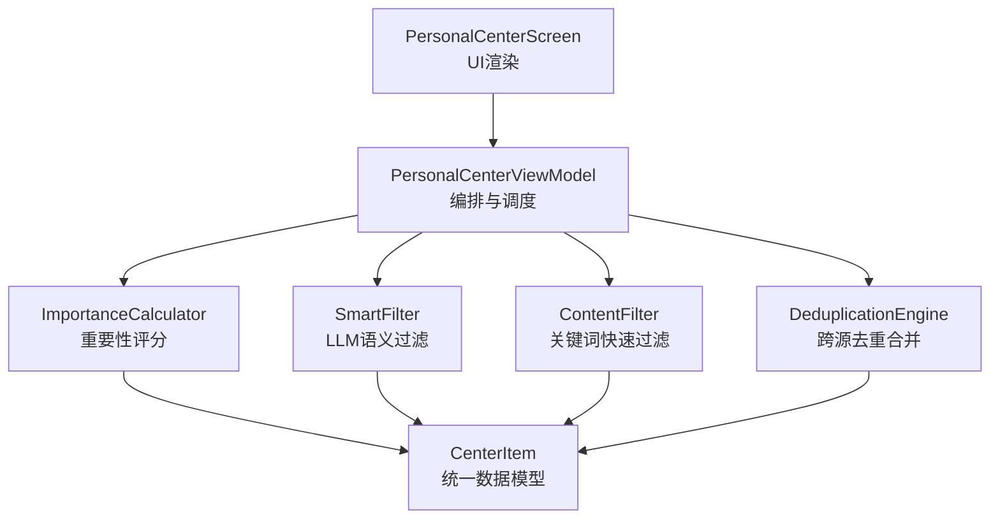
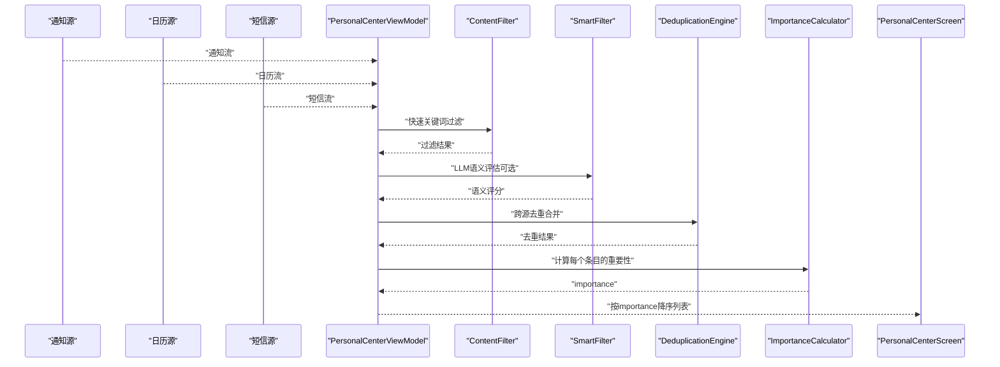
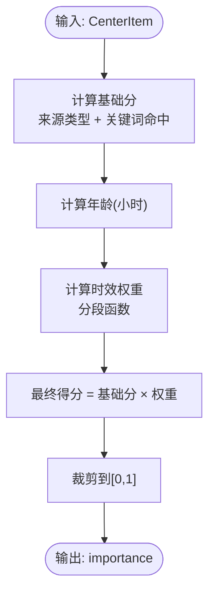
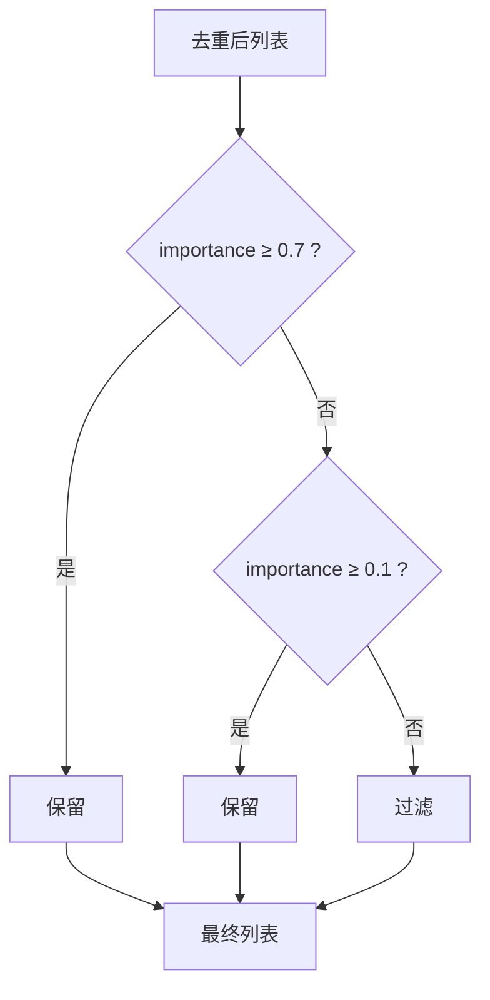
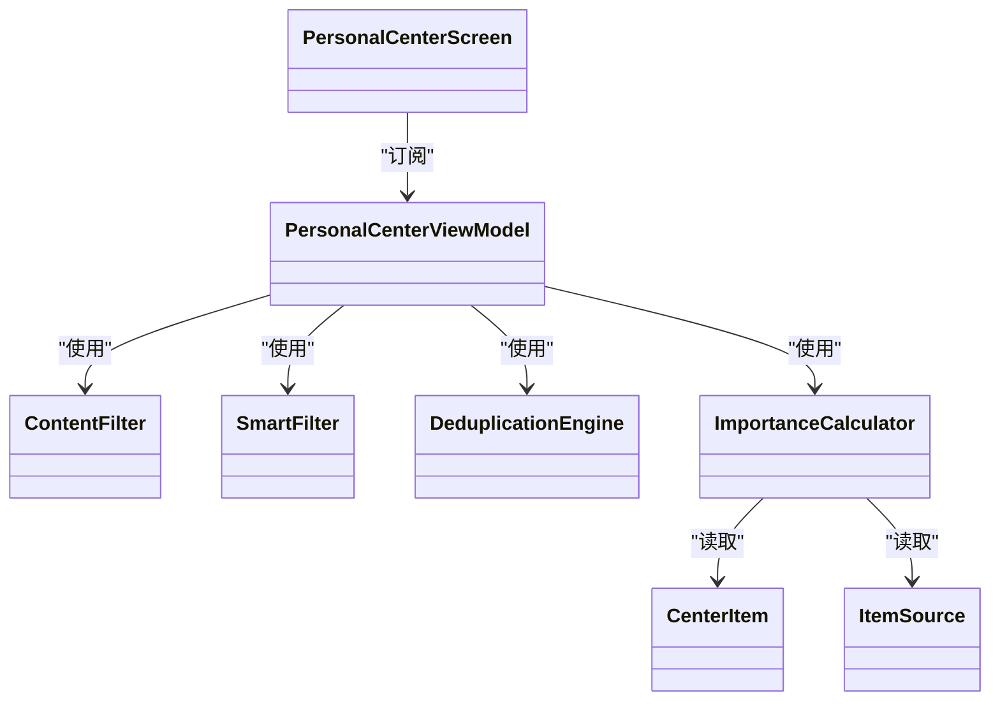

# 重要性计算算法

<cite>
**本文引用的文件**
- [ImportanceCalculator.kt](file://app/src/main/java/ai/openclaw/android/personalcenter/ImportanceCalculator.kt)
- [SmartFilter.kt](file://app/src/main/java/ai/openclaw/android/personalcenter/SmartFilter.kt)
- [PersonalCenterViewModel.kt](file://app/src/main/java/ai/openclaw/android/personalcenter/PersonalCenterViewModel.kt)
- [ContentFilter.kt](file://app/src/main/java/ai/openclaw/android/personalcenter/ContentFilter.kt)
- [DeduplicationEngine.kt](file://app/src/main/java/ai/openclaw/android/personalcenter/DeduplicationEngine.kt)
- [CenterItem.kt](file://app/src/main/java/ai/openclaw/android/personalcenter/models/CenterItem.kt)
- [ItemSource.kt](file://app/src/main/java/ai/openclaw/android/personalcenter/sources/ItemSource.kt)
- [PersonalCenterScreen.kt](file://app/src/main/java/ai/openclaw/android/personalcenter/PersonalCenterScreen.kt)
- [ConfigManager.kt](file://app/src/main/java/ai/openclaw/android/ConfigManager.kt)
</cite>

## 目录
1. [简介](#简介)
2. [项目结构](#项目结构)
3. [核心组件](#核心组件)
4. [架构总览](#架构总览)
5. [详细组件分析](#详细组件分析)
6. [依赖关系分析](#依赖关系分析)
7. [性能考量](#性能考量)
8. [故障排查指南](#故障排查指南)
9. [结论](#结论)
10. [附录](#附录)

## 简介
本文件面向“重要性计算算法”的全面技术文档，围绕个人中心的信息聚合与排序场景，系统阐述以下内容：
- 重要性评分模型的设计原理与计算公式
- 多维度权重分配机制与动态调整策略
- 时间衰减因子与用户行为权重的计算方法
- 智能排序算法与推荐策略
- 重要性阈值的设定与过滤机制
- 算法性能优化与实时计算能力
- 配置示例与调优指南
- 算法的可扩展性与自适应学习能力

该算法体系以“基础分 × 时效衰减”为核心，结合关键词过滤、跨源去重与阈值过滤，并在具备 LLM 能力时引入语义评估与缓存降级策略，形成端侧可运行、可扩展、可调优的信息价值评估流水线。

## 项目结构
个人中心模块围绕以下关键文件组织：
- 重要性计算：ImportanceCalculator.kt
- 内容过滤：ContentFilter.kt
- 智能过滤（LLM）：SmartFilter.kt
- 去重引擎：DeduplicationEngine.kt
- 数据模型：CenterItem.kt、ItemSource.kt
- 视图模型与流程编排：PersonalCenterViewModel.kt
- UI 展示：PersonalCenterScreen.kt
- 配置管理：ConfigManager.kt

图表来源
- [PersonalCenterViewModel.kt:138-206](file://app/src/main/java/ai/openclaw/android/personalcenter/PersonalCenterViewModel.kt#L138-L206)
- [ContentFilter.kt:60-75](file://app/src/main/java/ai/openclaw/android/personalcenter/ContentFilter.kt#L60-L75)
- [SmartFilter.kt:63-108](file://app/src/main/java/ai/openclaw/android/personalcenter/SmartFilter.kt#L63-L108)
- [DeduplicationEngine.kt:35-55](file://app/src/main/java/ai/openclaw/android/personalcenter/DeduplicationEngine.kt#L35-L55)
- [ImportanceCalculator.kt:70-74](file://app/src/main/java/ai/openclaw/android/personalcenter/ImportanceCalculator.kt#L70-L74)
- [CenterItem.kt:10-23](file://app/src/main/java/ai/openclaw/android/personalcenter/models/CenterItem.kt#L10-L23)
- [PersonalCenterScreen.kt:44-111](file://app/src/main/java/ai/openclaw/android/personalcenter/PersonalCenterScreen.kt#L44-L111)

章节来源
- [PersonalCenterViewModel.kt:138-206](file://app/src/main/java/ai/openclaw/android/personalcenter/PersonalCenterViewModel.kt#L138-L206)
- [PersonalCenterScreen.kt:44-111](file://app/src/main/java/ai/openclaw/android/personalcenter/PersonalCenterScreen.kt#L44-L111)

## 核心组件
- 重要性评分模型
  - 基础分：依据来源类型与文本关键词确定
  - 时效衰减：基于事件发生时间计算权重
  - 最终得分：基础分与时效权重相乘并裁剪至[0,1]
- 内容过滤层
  - 快速关键词黑白名单过滤，降低后续处理成本
- 智能过滤层（LLM）
  - 基于注入的 LLM 评估器进行语义分级
  - 结果缓存与降级策略，提升鲁棒性
- 去重引擎
  - 基于时间桶与关键词指纹的跨源去重与合并
- 排序与阈值过滤
  - 按 importance 降序排序
  - 设定阈值过滤与紧急内容保留策略

章节来源
- [ImportanceCalculator.kt:14-74](file://app/src/main/java/ai/openclaw/android/personalcenter/ImportanceCalculator.kt#L14-L74)
- [ContentFilter.kt:60-75](file://app/src/main/java/ai/openclaw/android/personalcenter/ContentFilter.kt#L60-L75)
- [SmartFilter.kt:63-108](file://app/src/main/java/ai/openclaw/android/personalcenter/SmartFilter.kt#L63-L108)
- [DeduplicationEngine.kt:35-55](file://app/src/main/java/ai/openclaw/android/personalcenter/DeduplicationEngine.kt#L35-L55)
- [PersonalCenterViewModel.kt:188-194](file://app/src/main/java/ai/openclaw/android/personalcenter/PersonalCenterViewModel.kt#L188-L194)

## 架构总览
下图展示了从数据源到最终 UI 展示的完整链路，重点标注了重要性计算与过滤的关键节点。

图表来源
- [PersonalCenterViewModel.kt:138-206](file://app/src/main/java/ai/openclaw/android/personalcenter/PersonalCenterViewModel.kt#L138-L206)
- [ContentFilter.kt:60-75](file://app/src/main/java/ai/openclaw/android/personalcenter/ContentFilter.kt#L60-L75)
- [SmartFilter.kt:63-108](file://app/src/main/java/ai/openclaw/android/personalcenter/SmartFilter.kt#L63-L108)
- [DeduplicationEngine.kt:35-55](file://app/src/main/java/ai/openclaw/android/personalcenter/DeduplicationEngine.kt#L35-L55)
- [ImportanceCalculator.kt:70-74](file://app/src/main/java/ai/openclaw/android/personalcenter/ImportanceCalculator.kt#L70-L74)
- [PersonalCenterScreen.kt:260-297](file://app/src/main/java/ai/openclaw/android/personalcenter/PersonalCenterScreen.kt#L260-L297)

## 详细组件分析

### 重要性评分模型与计算公式
- 设计原则
  - 基于来源类型与文本关键词的“基础分”
  - 基于事件时间的“时效衰减”
  - 最终得分在[0,1]区间内，便于 UI 与策略统一
- 计算步骤
  1) 计算基础分：根据来源类型与关键词命中情况确定
  2) 计算时效权重：基于事件发生到现在的时间间隔
  3) 最终得分：基础分 × 时效权重，并裁剪到[0,1]
- 关键词库
  - 紧急关键词：电话、来电、紧急、验证码等
  - 重要关键词：邮件、日历、会议、支付等
  - 短信重要关键词：验证码、银行、账户、快递等

图表来源
- [ImportanceCalculator.kt:14-74](file://app/src/main/java/ai/openclaw/android/personalcenter/ImportanceCalculator.kt#L14-L74)

章节来源
- [ImportanceCalculator.kt:14-74](file://app/src/main/java/ai/openclaw/android/personalcenter/ImportanceCalculator.kt#L14-L74)

### 多维度权重分配机制与动态调整策略
- 来源类型权重
  - 通知：基于关键词命中紧急/重要等级
  - 日历：基于“距离现在的时间”分档
  - 短信：基于关键词命中紧急/重要等级
- 时效衰减策略
  - 新内容权重高；随时间推移逐步衰减
  - 采用分段线性/阶梯式衰减，兼顾平滑与敏感度
- 动态调整建议
  - 可引入用户行为反馈（点击率、忽略率）对关键词权重进行在线调整
  - 可基于时段/地点等上下文对权重进行动态修正

章节来源
- [ImportanceCalculator.kt:20-48](file://app/src/main/java/ai/openclaw/android/personalcenter/ImportanceCalculator.kt#L20-L48)
- [ImportanceCalculator.kt:55-66](file://app/src/main/java/ai/openclaw/android/personalcenter/ImportanceCalculator.kt#L55-L66)

### 时间衰减因子与用户行为权重
- 时间衰减因子
  - 以“小时”为单位计算年龄，分段映射到不同权重
  - 适用于所有来源，统一衰减曲线
- 用户行为权重
  - 当前实现未直接使用用户行为权重
  - 建议引入：点击率、忽略率、停留时长等指标，对关键词权重或阈值进行动态调节

章节来源
- [ImportanceCalculator.kt:55-66](file://app/src/main/java/ai/openclaw/android/personalcenter/ImportanceCalculator.kt#L55-L66)

### 智能排序算法与推荐策略
- 排序策略
  - 以 importance 降序排序，确保高价值内容优先展示
- 推荐策略
  - 紧急内容阈值保留：importance ≥ 0.7 的内容即使较低分也保留
  - 低分过滤：importance < 0.1 的内容直接过滤
  - 中间分值：结合 LLM 语义评分进一步筛选

图表来源
- [PersonalCenterViewModel.kt:188-194](file://app/src/main/java/ai/openclaw/android/personalcenter/PersonalCenterViewModel.kt#L188-L194)

章节来源
- [PersonalCenterViewModel.kt:188-194](file://app/src/main/java/ai/openclaw/android/personalcenter/PersonalCenterViewModel.kt#L188-L194)

### 重要性阈值设定与过滤机制
- 阈值设定
  - 高价值阈值：≥ 0.7，紧急保留
  - 低价值阈值：< 0.1，直接过滤
  - 中间值：结合 LLM 与关键词综合判定
- 过滤机制
  - 关键词快速过滤：ContentFilter
  - LLM 语义过滤：SmartFilter
  - 去重合并：DeduplicationEngine
  - 最终阈值过滤：PersonalCenterViewModel

章节来源
- [PersonalCenterViewModel.kt:162-194](file://app/src/main/java/ai/openclaw/android/personalcenter/PersonalCenterViewModel.kt#L162-L194)
- [ContentFilter.kt:60-75](file://app/src/main/java/ai/openclaw/android/personalcenter/ContentFilter.kt#L60-L75)
- [SmartFilter.kt:63-108](file://app/src/main/java/ai/openclaw/android/personalcenter/SmartFilter.kt#L63-L108)
- [DeduplicationEngine.kt:35-55](file://app/src/main/java/ai/openclaw/android/personalcenter/DeduplicationEngine.kt#L35-L55)

### 算法性能优化与实时计算能力
- 性能优化点
  - 快速关键词过滤：在进入 LLM 前大幅减少待评估样本
  - LLM 缓存：基于标题/正文片段的键值缓存，避免重复请求
  - 去重指纹：关键词提取与 MD5 截断，降低比较成本
  - 分段阈值：在 ViewModel 中一次性完成过滤与排序
- 实时计算能力
  - Flow 驱动的数据源（通知、日历、短信）实时推送
  - 每分钟兜底刷新，确保漏报补偿
  - UI 基于 StateFlow 自动响应

章节来源
- [PersonalCenterViewModel.kt:138-222](file://app/src/main/java/ai/openclaw/android/personalcenter/PersonalCenterViewModel.kt#L138-L222)
- [SmartFilter.kt:126-146](file://app/src/main/java/ai/openclaw/android/personalcenter/SmartFilter.kt#L126-L146)
- [DeduplicationEngine.kt:18-27](file://app/src/main/java/ai/openclaw/android/personalcenter/DeduplicationEngine.kt#L18-L27)

### 配置示例与调优指南
- LLM 集成配置
  - 通过 GatewayContract 注入 LLM 评估器，支持超时与降级
  - Prompt 与阈值可在 ViewModel 中按需调整
- 关键词库调优
  - 紧急/重要关键词可根据业务场景迭代
  - 建议建立 A/B 测试，对比不同关键词组合的效果
- 阈值与权重调优
  - 高价值阈值（0.7）与低价值阈值（0.1）可根据召回/精度目标微调
  - 时效衰减分段参数可按用户活跃度调整
- 缓存与降级
  - LLM 缓存 TTL（默认 1 小时）可根据稳定性与新鲜度需求调整
  - 降级策略：LLM 失败时退回关键词模式，保障可用性

章节来源
- [PersonalCenterViewModel.kt:60-66](file://app/src/main/java/ai/openclaw/android/personalcenter/PersonalCenterViewModel.kt#L60-L66)
- [PersonalCenterViewModel.kt:76-133](file://app/src/main/java/ai/openclaw/android/personalcenter/PersonalCenterViewModel.kt#L76-L133)
- [SmartFilter.kt:18-19](file://app/src/main/java/ai/openclaw/android/personalcenter/SmartFilter.kt#L18-L19)
- [SmartFilter.kt:79-96](file://app/src/main/java/ai/openclaw/android/personalcenter/SmartFilter.kt#L79-L96)
- [ImportanceCalculator.kt:78-108](file://app/src/main/java/ai/openclaw/android/personalcenter/ImportanceCalculator.kt#L78-L108)

### 可扩展性与自适应学习能力
- 可扩展性
  - 新来源：通过 ItemSource 扩展，新增来源的基础分计算
  - 新阈值：在 ViewModel 中增加新的过滤规则
  - 新策略：可插入更多评估器（如多模态、向量相似度）
- 自适应学习
  - 引入用户反馈（点击/忽略/打开）对关键词权重与阈值进行在线更新
  - 基于时段/地点/应用的上下文权重自适应
  - LLM 评估结果缓存与热词学习，持续优化 Prompt 与阈值

章节来源
- [ItemSource.kt:10-26](file://app/src/main/java/ai/openclaw/android/personalcenter/sources/ItemSource.kt#L10-L26)
- [PersonalCenterViewModel.kt:188-194](file://app/src/main/java/ai/openclaw/android/personalcenter/PersonalCenterViewModel.kt#L188-L194)

## 依赖关系分析
- 组件耦合
  - PersonalCenterViewModel 是编排核心，依赖 ContentFilter、SmartFilter、DeduplicationEngine、ImportanceCalculator
  - ImportanceCalculator 依赖 CenterItem 与 ItemSource
  - SmartFilter 依赖 GatewayContract（通过注入方式解耦）
- 外部依赖
  - LLM 评估器通过 GatewayContract 注入，避免强耦合
  - UI 通过 StateFlow 订阅 ViewModel 输出，实现响应式更新

图表来源
- [PersonalCenterViewModel.kt:138-206](file://app/src/main/java/ai/openclaw/android/personalcenter/PersonalCenterViewModel.kt#L138-L206)
- [ImportanceCalculator.kt:14-18](file://app/src/main/java/ai/openclaw/android/personalcenter/ImportanceCalculator.kt#L14-L18)
- [CenterItem.kt:10-23](file://app/src/main/java/ai/openclaw/android/personalcenter/models/CenterItem.kt#L10-L23)
- [ItemSource.kt:10-26](file://app/src/main/java/ai/openclaw/android/personalcenter/sources/ItemSource.kt#L10-L26)
- [PersonalCenterScreen.kt:44-111](file://app/src/main/java/ai/openclaw/android/personalcenter/PersonalCenterScreen.kt#L44-L111)

章节来源
- [PersonalCenterViewModel.kt:138-206](file://app/src/main/java/ai/openclaw/android/personalcenter/PersonalCenterViewModel.kt#L138-L206)
- [ImportanceCalculator.kt:14-18](file://app/src/main/java/ai/openclaw/android/personalcenter/ImportanceCalculator.kt#L14-L18)

## 性能考量
- 时间复杂度
  - 关键词过滤：O(k)，k 为关键词集合大小
  - 去重指纹：O(n log n)（分组与排序），指纹生成 O(m)，m 为关键词数量
  - LLM 评估：O(b)，b 为批量大小
- 空间复杂度
  - LLM 缓存：O(p)，p 为缓存条目数
  - 去重哈希：O(n)
- 优化建议
  - 缓存键包含正文片段哈希，避免相同标题不同内容的误命中
  - 去重指纹截断 MD5，平衡唯一性与长度
  - 批量 LLM 评估，减少往返开销

章节来源
- [SmartFilter.kt:126-146](file://app/src/main/java/ai/openclaw/android/personalcenter/SmartFilter.kt#L126-L146)
- [DeduplicationEngine.kt:18-27](file://app/src/main/java/ai/openclaw/android/personalcenter/DeduplicationEngine.kt#L18-L27)
- [DeduplicationEngine.kt:81-86](file://app/src/main/java/ai/openclaw/android/personalcenter/DeduplicationEngine.kt#L81-L86)

## 故障排查指南
- LLM 评估失败
  - 现象：SmartFilter 抛出异常或超时
  - 处理：自动降级为关键词模式；检查 GatewayContract 可用性与网络
- 去重异常
  - 现象：去重过程抛出异常
  - 处理：回退到按 importance 排序的列表，记录错误日志
- 权限问题
  - 现象：日历/短信源不可用
  - 处理：ViewModel 设置权限状态，UI 引导用户授权
- 性能问题
  - 现象：列表加载缓慢
  - 处理：检查关键词库规模、LLM 缓存命中率、批量大小

章节来源
- [SmartFilter.kt:79-96](file://app/src/main/java/ai/openclaw/android/personalcenter/SmartFilter.kt#L79-L96)
- [PersonalCenterViewModel.kt:180-185](file://app/src/main/java/ai/openclaw/android/personalcenter/PersonalCenterViewModel.kt#L180-L185)
- [PersonalCenterViewModel.kt:146-155](file://app/src/main/java/ai/openclaw/android/personalcenter/PersonalCenterViewModel.kt#L146-L155)

## 结论
该重要性计算算法以“基础分 + 时效衰减”为核心，配合关键词过滤、LLM 语义评估与跨源去重，构建了端侧可运行、可扩展、可调优的信息价值评估流水线。通过阈值过滤与紧急内容保留策略，兼顾召回与精度；通过缓存与降级机制，保障稳定性与实时性。未来可在用户行为反馈、上下文感知与自适应学习方面进一步增强。

## 附录
- 数据模型字段说明
  - importance：最终重要性分数，用于排序与过滤
  - timestamp：事件发生时间，用于时效衰减
  - dedupKey：去重键，支持外部指定
  - mergedCount：合并条目数量
- 配置项参考
  - LLM 模型名称、提供商、基础地址等可通过配置管理读取与设置

章节来源
- [CenterItem.kt:10-23](file://app/src/main/java/ai/openclaw/android/personalcenter/models/CenterItem.kt#L10-L23)
- [ConfigManager.kt:54-86](file://app/src/main/java/ai/openclaw/android/ConfigManager.kt#L54-L86)