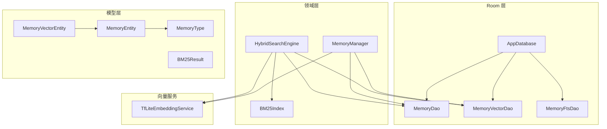
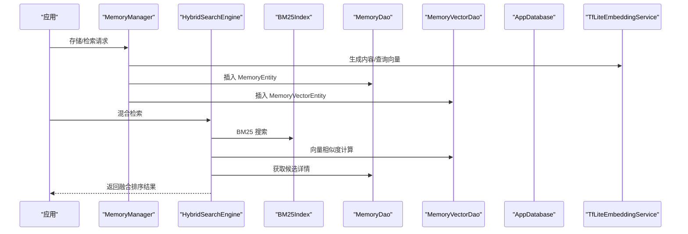
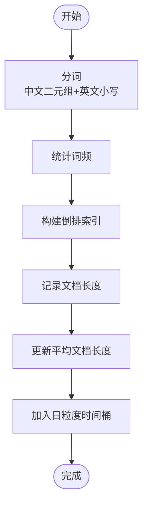
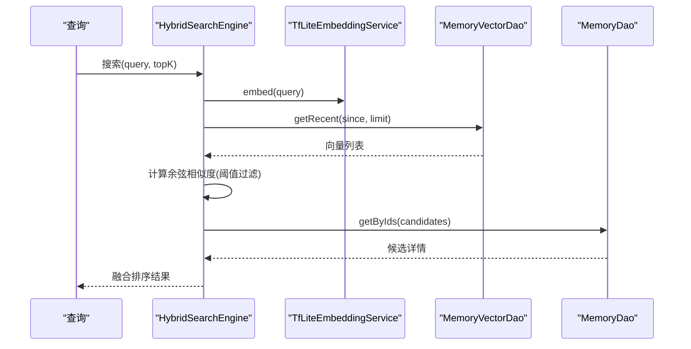
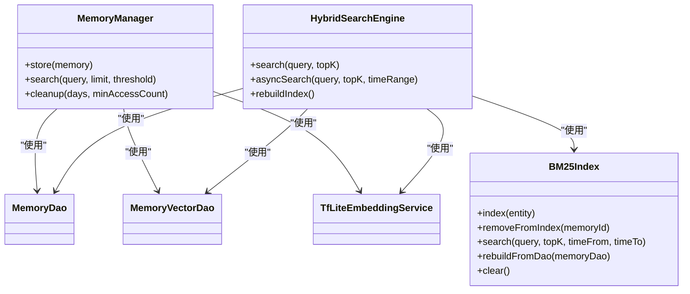
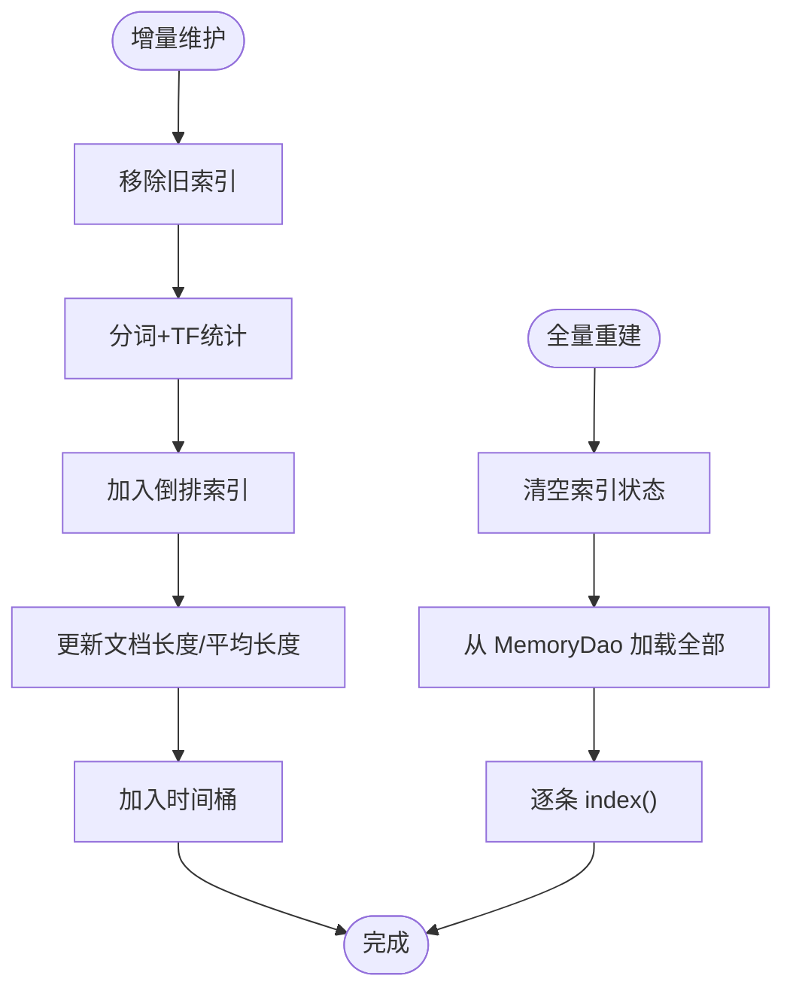

# 内存存储优化

<cite>
**本文引用的文件**
- [MemoryDao.kt](file://app/src/main/java/ai/openclaw/android/data/local/MemoryDao.kt)
- [MemoryVectorDao.kt](file://app/src/main/java/ai/openclaw/android/data/local/MemoryVectorDao.kt)
- [BM25Index.kt](file://app/src/main/java/ai/openclaw/android/data/local/BM25Index.kt)
- [MemoryFtsDao.kt](file://app/src/main/java/ai/openclaw/android/data/local/MemoryFtsDao.kt)
- [AppDatabase.kt](file://app/src/main/java/ai/openclaw/android/data/local/AppDatabase.kt)
- [MemoryEntity.kt](file://app/src/main/java/ai/openclaw/android/data/model/MemoryEntity.kt)
- [MemoryVectorEntity.kt](file://app/src/main/java/ai/openclaw/android/data/model/MemoryVectorEntity.kt)
- [MemoryType.kt](file://app/src/main/java/ai/openclaw/android/data/model/MemoryType.kt)
- [BM25Result.kt](file://app/src/main/java/ai/openclaw/android/data/model/BM25Result.kt)
- [HybridSearchEngine.kt](file://app/src/main/java/ai/openclaw/android/domain/memory/HybridSearchEngine.kt)
- [MemoryManager.kt](file://app/src/main/java/ai/openclaw/android/domain/memory/MemoryManager.kt)
- [Converters.kt](file://app/src/main/java/ai/openclaw/android/data/local/Converters.kt)
- [TfLiteEmbeddingService.kt](file://app/src/main/java/ai/openclaw/android/ml/TfLiteEmbeddingService.kt)
</cite>

## 目录
1. [简介](#简介)
2. [项目结构](#项目结构)
3. [核心组件](#核心组件)
4. [架构总览](#架构总览)
5. [详细组件分析](#详细组件分析)
6. [依赖关系分析](#依赖关系分析)
7. [性能考量](#性能考量)
8. [故障排查指南](#故障排查指南)
9. [结论](#结论)
10. [附录](#附录)

## 简介
本文件面向“内存存储优化”主题，系统化梳理项目中内存数据模型、全文检索索引、向量检索与融合搜索、存储压缩与去重、性能监控与瓶颈分析、存储迁移与版本兼容、容量规划与扩容策略等关键内容。目标是帮助开发者在不深入源码细节的前提下，快速理解并高效使用与扩展该内存存储体系。

## 项目结构
围绕内存存储与检索的关键模块分布如下：
- 数据模型层：定义内存实体、向量实体、类型枚举与结果模型
- Room 数据访问层：定义 DAO 接口与数据库构建、迁移与加密
- 搜索引擎层：混合检索（BM25 关键词 + 向量相似 + 时间衰减）与缓存
- 向量服务层：基于 TensorFlow Lite 的嵌入服务
- 工具与转换器：类型转换、数组序列化等

图表来源
- [AppDatabase.kt:25-41](file://app/src/main/java/ai/openclaw/android/data/local/AppDatabase.kt#L25-L41)
- [MemoryDao.kt:11-48](file://app/src/main/java/ai/openclaw/android/data/local/MemoryDao.kt#L11-L48)
- [MemoryVectorDao.kt:9-25](file://app/src/main/java/ai/openclaw/android/data/local/MemoryVectorDao.kt#L9-L25)
- [MemoryFtsDao.kt:8-12](file://app/src/main/java/ai/openclaw/android/data/local/MemoryFtsDao.kt#L8-L12)
- [MemoryManager.kt:10-36](file://app/src/main/java/ai/openclaw/android/domain/memory/MemoryManager.kt#L10-L36)
- [HybridSearchEngine.kt:18-35](file://app/src/main/java/ai/openclaw/android/domain/memory/HybridSearchEngine.kt#L18-L35)
- [BM25Index.kt:14-42](file://app/src/main/java/ai/openclaw/android/data/local/BM25Index.kt#L14-L42)
- [MemoryEntity.kt:6-18](file://app/src/main/java/ai/openclaw/android/data/model/MemoryEntity.kt#L6-L18)
- [MemoryVectorEntity.kt:6-19](file://app/src/main/java/ai/openclaw/android/data/model/MemoryVectorEntity.kt#L6-L19)
- [MemoryType.kt:3-5](file://app/src/main/java/ai/openclaw/android/data/model/MemoryType.kt#L3-L5)
- [BM25Result.kt:3-6](file://app/src/main/java/ai/openclaw/android/data/model/BM25Result.kt#L3-L6)
- [TfLiteEmbeddingService.kt:13-21](file://app/src/main/java/ai/openclaw/android/ml/TfLiteEmbeddingService.kt#L13-L21)

章节来源
- [AppDatabase.kt:25-41](file://app/src/main/java/ai/openclaw/android/data/local/AppDatabase.kt#L25-L41)
- [MemoryDao.kt:11-48](file://app/src/main/java/ai/openclaw/android/data/local/MemoryDao.kt#L11-L48)
- [MemoryVectorDao.kt:9-25](file://app/src/main/java/ai/openclaw/android/data/local/MemoryVectorDao.kt#L9-L25)
- [MemoryFtsDao.kt:8-12](file://app/src/main/java/ai/openclaw/android/data/local/MemoryFtsDao.kt#L8-L12)
- [MemoryManager.kt:10-36](file://app/src/main/java/ai/openclaw/android/domain/memory/MemoryManager.kt#L10-L36)
- [HybridSearchEngine.kt:18-35](file://app/src/main/java/ai/openclaw/android/domain/memory/HybridSearchEngine.kt#L18-L35)
- [BM25Index.kt:14-42](file://app/src/main/java/ai/openclaw/android/data/local/BM25Index.kt#L14-L42)
- [MemoryEntity.kt:6-18](file://app/src/main/java/ai/openclaw/android/data/model/MemoryEntity.kt#L6-L18)
- [MemoryVectorEntity.kt:6-19](file://app/src/main/java/ai/openclaw/android/data/model/MemoryVectorEntity.kt#L6-L19)
- [MemoryType.kt:3-5](file://app/src/main/java/ai/openclaw/android/data/model/MemoryType.kt#L3-L5)
- [BM25Result.kt:3-6](file://app/src/main/java/ai/openclaw/android/data/model/BM25Result.kt#L3-L6)
- [TfLiteEmbeddingService.kt:13-21](file://app/src/main/java/ai/openclaw/android/ml/TfLiteEmbeddingService.kt#L13-L21)

## 核心组件
- 数据模型与字段设计
  - MemoryEntity：主表记录，包含自增主键、内容、类型、优先级、来源、标签列表、创建时间、最近访问时间、访问计数、版本号。标签列表通过 TypeConverter 序列化存储，便于全文检索与过滤。
  - MemoryVectorEntity：向量表记录，以 memoryId 为主键，存储浮点向量与更新时间；覆盖 equals/hashCode 基于 memoryId 与向量内容，用于去重与缓存命中判断。
  - MemoryType：内存类型枚举，区分偏好、事实、决策、任务、项目等。
  - BM25Result：检索结果载体，包含 memoryId 与分数。
- DAO 层优化
  - MemoryDao：提供按 id、批量 id、类型、高优先级、最近修改、最近访问、统计、访问更新、过期清理等查询；支持 REPLACE 冲突策略插入，保证幂等写入。
  - MemoryVectorDao：按 memoryId 查询、最近更新范围查询、全量查询、删除指定 memoryId 的向量。
  - MemoryFtsDao：提供原生 SQL 查询接口，配合 FTS5 虚拟表进行全文检索。
- 搜索引擎与索引
  - BM25Index：纯 Kotlin 实现的倒排索引，支持中文（二元组）+ 英文分词、词频统计、IDF 计算、平均文档长度动态维护、日粒度时间桶加速、LRU 查询缓存。
  - HybridSearchEngine：融合 BM25 关键词、向量余弦相似度与时间衰减，权重可调，支持并发执行与缓存向量结果。
- 数据库与迁移
  - AppDatabase：Room 数据库，启用 SQLCipher 加密，版本 6；初始化时创建 FTS5 虚拟表 memory_fts；定义多版本迁移脚本，确保向前兼容。
  - Converters：自定义类型转换器，支持 MemoryType、List<String>、FloatArray 等复杂类型的持久化。
- 向量服务
  - TfLiteEmbeddingService：加载本地模型与词表，提供文本嵌入与批处理能力，维度固定，状态安全检查。

章节来源
- [MemoryEntity.kt:6-18](file://app/src/main/java/ai/openclaw/android/data/model/MemoryEntity.kt#L6-L18)
- [MemoryVectorEntity.kt:6-19](file://app/src/main/java/ai/openclaw/android/data/model/MemoryVectorEntity.kt#L6-L19)
- [MemoryType.kt:3-5](file://app/src/main/java/ai/openclaw/android/data/model/MemoryType.kt#L3-L5)
- [BM25Result.kt:3-6](file://app/src/main/java/ai/openclaw/android/data/model/BM25Result.kt#L3-L6)
- [MemoryDao.kt:11-48](file://app/src/main/java/ai/openclaw/android/data/local/MemoryDao.kt#L11-L48)
- [MemoryVectorDao.kt:9-25](file://app/src/main/java/ai/openclaw/android/data/local/MemoryVectorDao.kt#L9-L25)
- [MemoryFtsDao.kt:8-12](file://app/src/main/java/ai/openclaw/android/data/local/MemoryFtsDao.kt#L8-L12)
- [BM25Index.kt:14-42](file://app/src/main/java/ai/openclaw/android/data/local/BM25Index.kt#L14-L42)
- [HybridSearchEngine.kt:18-35](file://app/src/main/java/ai/openclaw/android/domain/memory/HybridSearchEngine.kt#L18-L35)
- [AppDatabase.kt:25-41](file://app/src/main/java/ai/openclaw/android/data/local/AppDatabase.kt#L25-L41)
- [Converters.kt:10-65](file://app/src/main/java/ai/openclaw/android/data/local/Converters.kt#L10-L65)
- [TfLiteEmbeddingService.kt:13-21](file://app/src/main/java/ai/openclaw/android/ml/TfLiteEmbeddingService.kt#L13-L21)

## 架构总览
下图展示从应用到数据库、向量服务与搜索引擎的整体交互路径，以及索引与缓存的关键位置。

图表来源
- [MemoryManager.kt:16-36](file://app/src/main/java/ai/openclaw/android/domain/memory/MemoryManager.kt#L16-L36)
- [HybridSearchEngine.kt:137-225](file://app/src/main/java/ai/openclaw/android/domain/memory/HybridSearchEngine.kt#L137-L225)
- [BM25Index.kt:140-178](file://app/src/main/java/ai/openclaw/android/data/local/BM25Index.kt#L140-L178)
- [MemoryDao.kt:13-41](file://app/src/main/java/ai/openclaw/android/data/local/MemoryDao.kt#L13-L41)
- [MemoryVectorDao.kt:11-24](file://app/src/main/java/ai/openclaw/android/data/local/MemoryVectorDao.kt#L11-L24)
- [AppDatabase.kt:25-41](file://app/src/main/java/ai/openclaw/android/data/local/AppDatabase.kt#L25-L41)
- [TfLiteEmbeddingService.kt:50-69](file://app/src/main/java/ai/openclaw/android/ml/TfLiteEmbeddingService.kt#L50-L69)

## 详细组件分析

### 数据模型与字段含义
- MemoryEntity 字段
  - id：自增主键，唯一标识一条记忆
  - content：记忆正文，用于全文检索与向量嵌入
  - memoryType：记忆类型，支持按类型筛选
  - priority：优先级，影响排序与召回
  - source：来源标识，便于溯源与过滤
  - tags：标签列表，序列化后存储，支持关键词与分类
  - createdAt/lastAccessedAt：时间戳，用于时间范围过滤与时间衰减
  - accessCount：访问计数，辅助过期清理策略
  - version：版本号，用于迁移与兼容性控制
- MemoryVectorEntity 字段
  - memoryId：与 MemoryEntity.id 对应，作为外键约束
  - vector：浮点向量，维度由嵌入服务决定
  - updatedAt：向量更新时间，用于近期向量检索与缓存
- 设计原则
  - 一文一向量：memoryId 作为向量表主键，避免重复向量
  - 可回溯：content 与 tags 保留原文，便于二次加工或调试
  - 可扩展：tags 与 source 支持未来扩展过滤与聚合

章节来源
- [MemoryEntity.kt:6-18](file://app/src/main/java/ai/openclaw/android/data/model/MemoryEntity.kt#L6-L18)
- [MemoryVectorEntity.kt:6-19](file://app/src/main/java/ai/openclaw/android/data/model/MemoryVectorEntity.kt#L6-L19)
- [MemoryType.kt:3-5](file://app/src/main/java/ai/openclaw/android/data/model/MemoryType.kt#L3-L5)
- [Converters.kt:31-50](file://app/src/main/java/ai/openclaw/android/data/local/Converters.kt#L31-L50)

### MemoryDao 与 MemoryVectorDao 的数据库操作优化
- MemoryDao
  - 批量查询：支持按 id 列表一次性获取，减少往返次数
  - 类型与优先级：按类型与优先级排序，满足高价值内容优先展示
  - 最近修改与最近访问：支持时间窗口过滤与排序，便于增量同步与热点管理
  - 访问追踪：更新最近访问时间与访问计数，辅助去重与清理策略
  - 过期清理：基于阈值与最小访问次数筛选冷数据，成对删除记忆与向量
- MemoryVectorDao
  - 单条查询：按 memoryId 快速定位向量
  - 近期向量：限定时间窗口与数量上限，降低相似度计算成本
  - 清理：按 memoryId 删除向量，保证与记忆表一致性

章节来源
- [MemoryDao.kt:16-44](file://app/src/main/java/ai/openclaw/android/data/local/MemoryDao.kt#L16-L44)
- [MemoryVectorDao.kt:14-24](file://app/src/main/java/ai/openclaw/android/data/local/MemoryVectorDao.kt#L14-L24)

### 全文搜索索引的建立与维护策略
- 索引结构
  - 倒排索引：以词项为键，存储 Posting（memoryId, 词频），支持 O(1) 词项检索
  - 文档长度映射：记录每篇文档的词数，用于 BM25 归一化
  - 平均文档长度：O(1) 更新，避免每次查询重新计算
  - 日粒度时间桶：按天聚合文档 ID，加速时间范围过滤
  - 查询缓存：LRU 缓存分词结果，减少重复分词开销
- 维护策略
  - 增量维护：新增/删除记忆时，先移除旧索引再重建，保持一致性
  - 全量重建：启动或批量导入后，从 MemoryDao 全量重建索引
  - 清理：clear() 重置状态，释放内存

图表来源
- [BM25Index.kt:47-86](file://app/src/main/java/ai/openclaw/android/data/local/BM25Index.kt#L47-L86)
- [BM25Index.kt:91-112](file://app/src/main/java/ai/openclaw/android/data/local/BM25Index.kt#L91-L112)
- [BM25Index.kt:183-189](file://app/src/main/java/ai/openclaw/android/data/local/BM25Index.kt#L183-L189)

章节来源
- [BM25Index.kt:14-42](file://app/src/main/java/ai/openclaw/android/data/local/BM25Index.kt#L14-L42)
- [BM25Index.kt:117-135](file://app/src/main/java/ai/openclaw/android/data/local/BM25Index.kt#L117-L135)
- [BM25Index.kt:183-189](file://app/src/main/java/ai/openclaw/android/data/local/BM25Index.kt#L183-L189)

### 向量存储的索引结构与查询优化
- 索引结构
  - 向量表：以 memoryId 为主键，存储向量与更新时间
  - 近期窗口：默认最近 90 天，限制相似度计算范围
  - 向量缓存：查询向量结果缓存 30 秒，避免重复计算
- 查询优化
  - 余弦相似度：逐向量计算，阈值过滤（默认 0.1）
  - 并发执行：BM25 与向量路径并行，提升整体吞吐
  - 融合评分：关键词归一化得分 × 权重 + 向量相似度 × 权重 + 时间衰减 × 权重

图表来源
- [HybridSearchEngine.kt:172-219](file://app/src/main/java/ai/openclaw/android/domain/memory/HybridSearchEngine.kt#L172-L219)
- [HybridSearchEngine.kt:148-170](file://app/src/main/java/ai/openclaw/android/domain/memory/HybridSearchEngine.kt#L148-L170)
- [MemoryVectorDao.kt:17-18](file://app/src/main/java/ai/openclaw/android/data/local/MemoryVectorDao.kt#L17-L18)
- [MemoryDao.kt:19-20](file://app/src/main/java/ai/openclaw/android/data/local/MemoryDao.kt#L19-L20)

章节来源
- [MemoryVectorEntity.kt:6-11](file://app/src/main/java/ai/openclaw/android/data/model/MemoryVectorEntity.kt#L6-L11)
- [HybridSearchEngine.kt:148-170](file://app/src/main/java/ai/openclaw/android/domain/memory/HybridSearchEngine.kt#L148-L170)
- [MemoryManager.kt:101-114](file://app/src/main/java/ai/openclaw/android/domain/memory/MemoryManager.kt#L101-L114)

### 存储空间的压缩技术与数据去重机制
- 压缩技术
  - 列式存储：FloatArray 通过 TypeConverter 序列化为逗号分隔字符串，节省 Room 行存储冗余
  - 分词缓存：BM25Index 使用 LruCache 缓存分词结果，降低重复分词成本
- 去重机制
  - 向量去重：MemoryVectorEntity.equals/hashCode 基于 memoryId 与向量内容，避免重复向量入库
  - 记忆去重：MemoryDao 使用 REPLACE 冲突策略，相同主键替换，保证幂等
  - 过期清理：根据最近访问时间与访问计数筛选冷数据，定期删除

章节来源
- [Converters.kt:45-50](file://app/src/main/java/ai/openclaw/android/data/local/Converters.kt#L45-L50)
- [MemoryVectorEntity.kt:12-19](file://app/src/main/java/ai/openclaw/android/data/model/MemoryVectorEntity.kt#L12-L19)
- [MemoryDao.kt:13](file://app/src/main/java/ai/openclaw/android/data/local/MemoryDao.kt#L13)
- [MemoryDao.kt:43-44](file://app/src/main/java/ai/openclaw/android/data/local/MemoryDao.kt#L43-L44)

### 数据库性能监控与瓶颈分析方法
- 性能指标建议
  - 索引大小：BM25Index.size 反映倒排规模
  - 查询耗时：HybridSearchEngine 记录日志，包含关键词/向量候选数量与合并结果数
  - 向量缓存命中：VectorCacheEntry(timestamp) 与 TTL 控制缓存生命周期
  - 数据库 I/O：统计 MemoryDao/MemoryVectorDao 的查询次数与返回行数
- 瓶颈定位
  - BM25：分词与倒排扫描；可通过扩大 topK 倍数与时间桶过滤优化
  - 向量：相似度计算；可通过近期窗口、阈值与缓存策略降低计算量
  - 数据库：批量读取与 REPLACE 冲突；可结合事务与批量操作减少锁竞争

章节来源
- [BM25Index.kt:201](file://app/src/main/java/ai/openclaw/android/data/local/BM25Index.kt#L201)
- [HybridSearchEngine.kt:182-184](file://app/src/main/java/ai/openclaw/android/domain/memory/HybridSearchEngine.kt#L182-L184)
- [HybridSearchEngine.kt:41-53](file://app/src/main/java/ai/openclaw/android/domain/memory/HybridSearchEngine.kt#L41-L53)

### 存储迁移与版本升级的兼容性处理
- 版本与迁移
  - 当前版本：6；历史迁移包括添加 version 字段、动态技能表、触发规则与日志表
  - 迁移策略：显式迁移脚本，避免 Room Schema 验证失败；降级时允许破坏性迁移
- 兼容性要点
  - 新增列：默认值设置，确保已有数据可读
  - 新表：创建时包含必要索引，保证查询性能
  - FTS5：数据库打开回调中创建虚拟表，确保全文检索可用

章节来源
- [AppDatabase.kt:58-130](file://app/src/main/java/ai/openclaw/android/data/local/AppDatabase.kt#L58-L130)
- [AppDatabase.kt:146-152](file://app/src/main/java/ai/openclaw/android/data/local/AppDatabase.kt#L146-L152)

### 存储容量规划与扩容策略
- 容量规划
  - 记忆上限：MemoryManager 中定义最大记忆数与最小保留数，防止无限增长
  - 近期窗口：向量检索默认 90 天，平衡召回与性能
- 扩容策略
  - 索引重建：全量重建 BM25Index，适用于大规模导入或格式变更
  - 分片与分区：按时间桶与类型分区，提升过滤效率
  - 缓存调优：调整向量缓存 TTL 与查询缓存容量，平衡内存与命中率

章节来源
- [MemoryManager.kt:97-99](file://app/src/main/java/ai/openclaw/android/domain/memory/MemoryManager.kt#L97-L99)
- [HybridSearchEngine.kt:34](file://app/src/main/java/ai/openclaw/android/domain/memory/HybridSearchEngine.kt#L34)
- [BM25Index.kt:35](file://app/src/main/java/ai/openclaw/android/data/local/BM25Index.kt#L35)

## 依赖关系分析
- 组件耦合
  - MemoryManager 依赖 MemoryDao、MemoryVectorDao、EmbeddingService，负责存储与基础检索
  - HybridSearchEngine 依赖 BM25Index、MemoryDao、MemoryVectorDao、EmbeddingService，负责混合检索
  - AppDatabase 提供 DAO 注入与迁移，是数据层基础设施
- 外部依赖
  - SQLCipher：数据库加密
  - Room：ORM 与迁移
  - TensorFlow Lite：本地嵌入推理

图表来源
- [MemoryManager.kt:10-36](file://app/src/main/java/ai/openclaw/android/domain/memory/MemoryManager.kt#L10-L36)
- [HybridSearchEngine.kt:18-35](file://app/src/main/java/ai/openclaw/android/domain/memory/HybridSearchEngine.kt#L18-L35)
- [BM25Index.kt:14-42](file://app/src/main/java/ai/openclaw/android/data/local/BM25Index.kt#L14-L42)
- [MemoryDao.kt:11-48](file://app/src/main/java/ai/openclaw/android/data/local/MemoryDao.kt#L11-L48)
- [MemoryVectorDao.kt:9-25](file://app/src/main/java/ai/openclaw/android/data/local/MemoryVectorDao.kt#L9-L25)
- [TfLiteEmbeddingService.kt:13-21](file://app/src/main/java/ai/openclaw/android/ml/TfLiteEmbeddingService.kt#L13-L21)

章节来源
- [MemoryManager.kt:10-36](file://app/src/main/java/ai/openclaw/android/domain/memory/MemoryManager.kt#L10-L36)
- [HybridSearchEngine.kt:18-35](file://app/src/main/java/ai/openclaw/android/domain/memory/HybridSearchEngine.kt#L18-L35)
- [BM25Index.kt:14-42](file://app/src/main/java/ai/openclaw/android/data/local/BM25Index.kt#L14-L42)
- [MemoryDao.kt:11-48](file://app/src/main/java/ai/openclaw/android/data/local/MemoryDao.kt#L11-L48)
- [MemoryVectorDao.kt:9-25](file://app/src/main/java/ai/openclaw/android/data/local/MemoryVectorDao.kt#L9-L25)
- [TfLiteEmbeddingService.kt:13-21](file://app/src/main/java/ai/openclaw/android/ml/TfLiteEmbeddingService.kt#L13-L21)

## 性能考量
- 索引与查询
  - BM25：利用时间桶与查询缓存降低扫描范围；分词缓存减少重复计算
  - 向量：限制近期窗口与相似度阈值，结合缓存减少重复计算
- 数据库
  - 批量读取与 REPLACE 冲突；合理使用事务与批量操作
  - FTS5 虚拟表适合全文检索，但需注意建表时机与索引维护
- 向量服务
  - 初始化成本高，尽量复用；推理线程池与 I/O 线程分离
- 内存与缓存
  - LruCache 与 LinkedHashMap 缓存策略，注意容量与淘汰策略

[本节为通用性能指导，无需列出具体文件来源]

## 故障排查指南
- 向量服务未初始化
  - 现象：调用 embed 抛出未初始化异常
  - 处理：确保初始化成功后再调用 embed；检查模型与词表资源是否存在
- 检索结果为空
  - 现象：BM25 或向量搜索无结果
  - 处理：确认索引是否已重建；检查查询是否为空；核对时间窗口与阈值设置
- 数据库版本不匹配
  - 现象：Room 报错或 Schema 不一致
  - 处理：检查迁移脚本是否完整；必要时启用破坏性迁移策略
- 性能异常
  - 现象：检索耗时上升
  - 处理：查看日志统计；评估缓存命中率；调整近期窗口与阈值

章节来源
- [TfLiteEmbeddingService.kt:50-69](file://app/src/main/java/ai/openclaw/android/ml/TfLiteEmbeddingService.kt#L50-L69)
- [HybridSearchEngine.kt:182-184](file://app/src/main/java/ai/openclaw/android/domain/memory/HybridSearchEngine.kt#L182-L184)
- [AppDatabase.kt:58-130](file://app/src/main/java/ai/openclaw/android/data/local/AppDatabase.kt#L58-L130)

## 结论
本内存存储体系通过“结构化数据 + 倒排索引 + 向量相似 + 时间衰减”的混合检索方案，在移动端实现了高效、可扩展的记忆检索。DAO 层的批量与条件查询、索引层的时间桶与缓存、向量层的窗口与阈值控制，共同构成了完整的性能优化闭环。配合数据库迁移与加密、类型转换器与 FTS5 虚拟表，系统在功能完整性与运行效率之间取得了良好平衡。

[本节为总结性内容，无需列出具体文件来源]

## 附录
- 关键流程图：BM25 增量维护与全量重建
- 关键流程图：混合检索与缓存

图表来源
- [BM25Index.kt:91-112](file://app/src/main/java/ai/openclaw/android/data/local/BM25Index.kt#L91-L112)
- [BM25Index.kt:117-135](file://app/src/main/java/ai/openclaw/android/data/local/BM25Index.kt#L117-L135)
- [BM25Index.kt:183-189](file://app/src/main/java/ai/openclaw/android/data/local/BM25Index.kt#L183-L189)