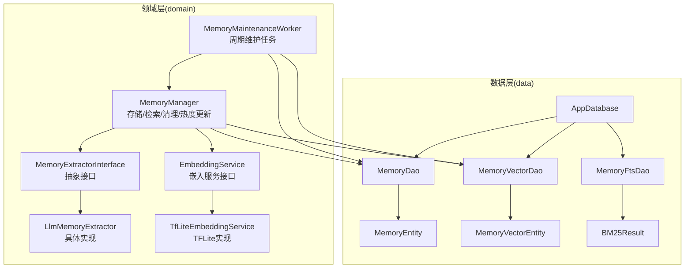
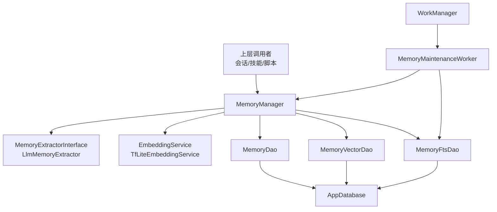
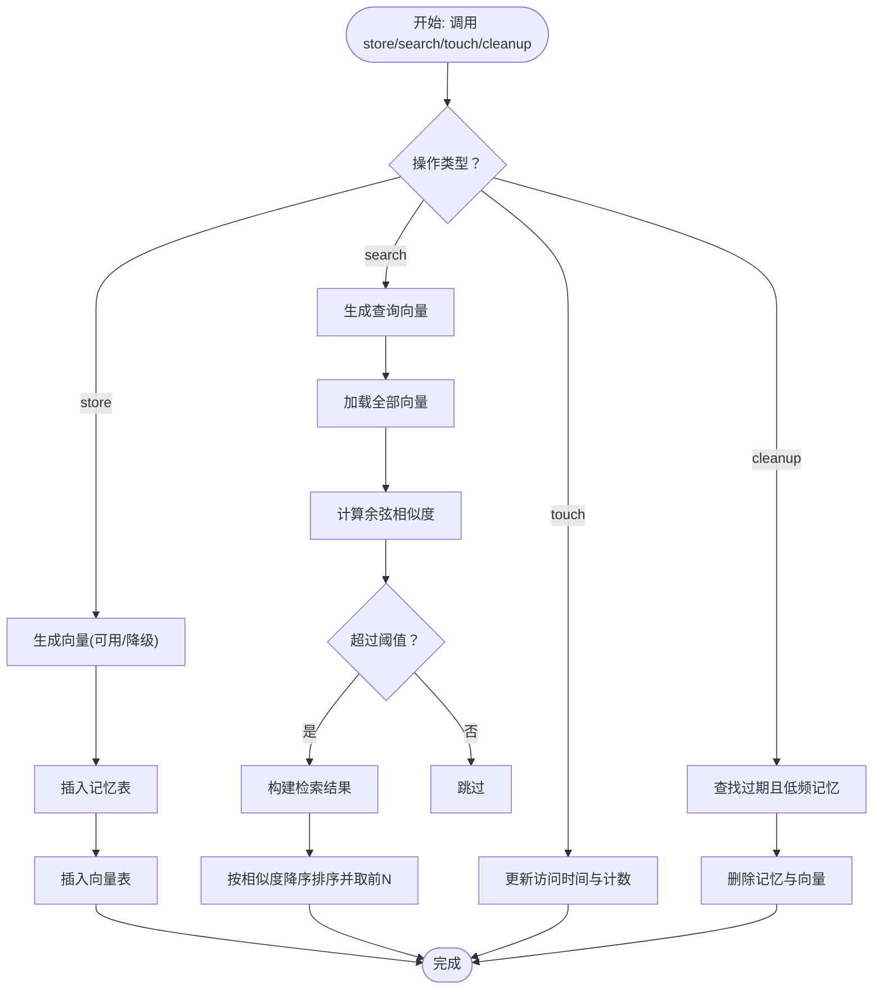
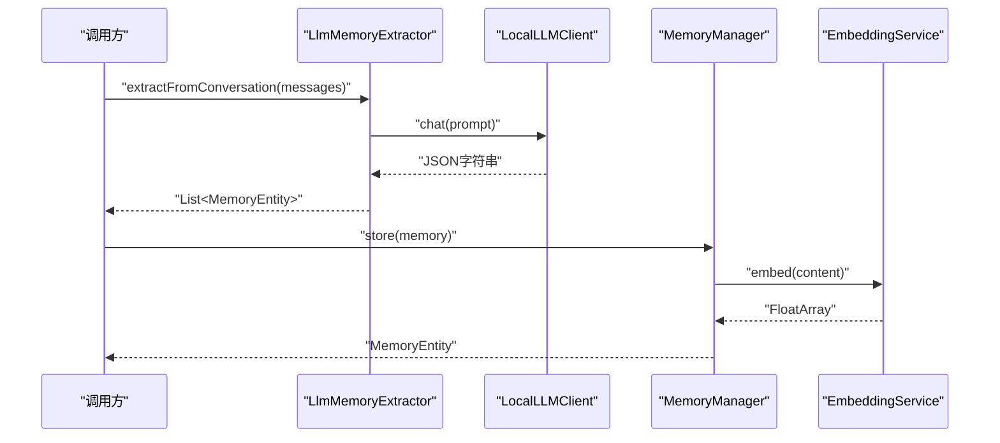
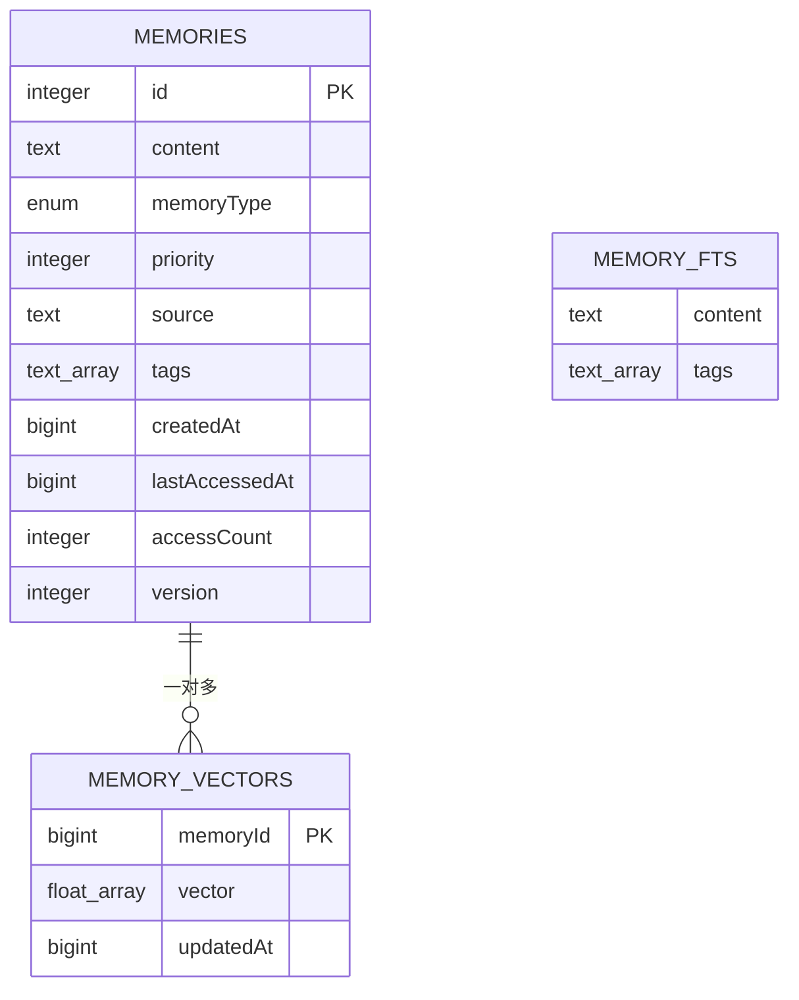
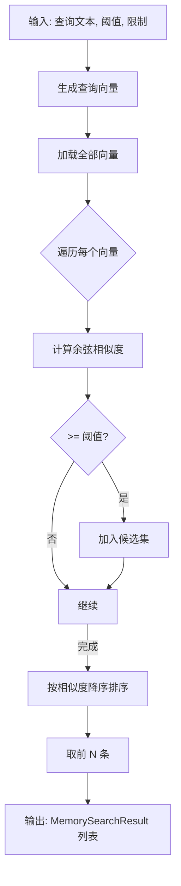
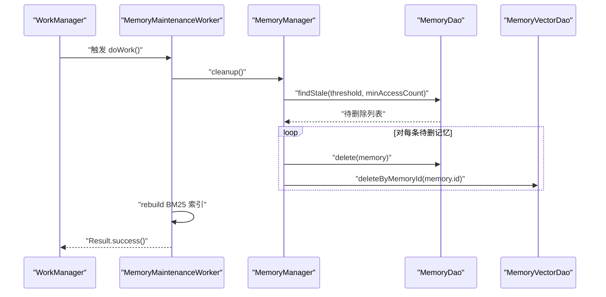
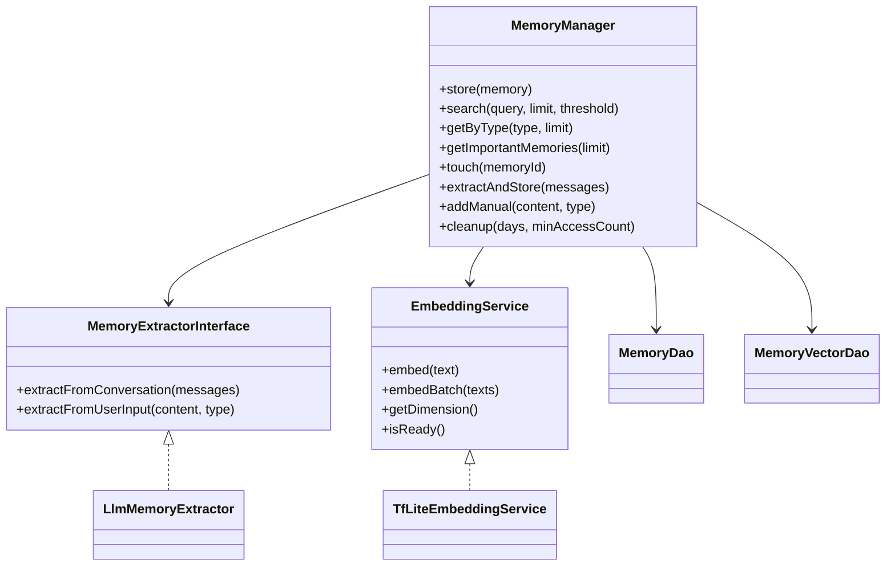

# 内存管理器

<cite>
**本文引用的文件**
- [MemoryManager.kt](file://app/src/main/java/ai/openclaw/android/domain/memory/MemoryManager.kt)
- [MemoryExtractor.kt](file://app/src/main/java/ai/openclaw/android/domain/memory/MemoryExtractor.kt)
- [MemoryExtractorInterface.kt](file://app/src/main/java/ai/openclaw/android/domain/memory/MemoryExtractorInterface.kt)
- [EmbeddingService.kt](file://app/src/main/java/ai/openclaw/android/domain/memory/EmbeddingService.kt)
- [TfLiteEmbeddingService.kt](file://app/src/main/java/ai/openclaw/android/ml/TfLiteEmbeddingService.kt)
- [MemoryDao.kt](file://app/src/main/java/ai/openclaw/android/data/local/MemoryDao.kt)
- [MemoryVectorDao.kt](file://app/src/main/java/ai/openclaw/android/data/local/MemoryVectorDao.kt)
- [MemoryFtsDao.kt](file://app/src/main/java/ai/openclaw/android/data/local/MemoryFtsDao.kt)
- [AppDatabase.kt](file://app/src/main/java/ai/openclaw/android/data/local/AppDatabase.kt)
- [MemoryEntity.kt](file://app/src/main/java/ai/openclaw/android/data/model/MemoryEntity.kt)
- [MemoryVectorEntity.kt](file://app/src/main/java/ai/openclaw/android/data/model/MemoryVectorEntity.kt)
- [BM25Result.kt](file://app/src/main/java/ai/openclaw/android/data/model/BM25Result.kt)
- [MemoryMaintenanceWorker.kt](file://app/src/main/java/ai/openclaw/android/domain/memory/MemoryMaintenanceWorker.kt)
</cite>

## 目录
1. [简介](#简介)
2. [项目结构](#项目结构)
3. [核心组件](#核心组件)
4. [架构总览](#架构总览)
5. [详细组件分析](#详细组件分析)
6. [依赖关系分析](#依赖关系分析)
7. [性能考量](#性能考量)
8. [故障排查指南](#故障排查指南)
9. [结论](#结论)
10. [附录](#附录)

## 简介
本技术文档围绕内存管理器（MemoryManager）展开，系统性阐述其在应用中的职责边界、数据流转过程与生命周期管理。重点覆盖以下方面：
- 记忆提取与嵌入向量生成的完整流程
- 向量与文本的持久化存储策略
- 内存检索的查询处理与结果排序算法
- 内存清理机制与垃圾回收策略
- 访问统计与热度计算
- 性能监控指标与优化建议
- 扩展接口与自定义实现指南

## 项目结构
与内存管理相关的关键模块分布于 domain、data、ml 三层，配合 Room 数据库与 WorkManager 维护周期任务。

图表来源
- [MemoryManager.kt:10-116](file://app/src/main/java/ai/openclaw/android/domain/memory/MemoryManager.kt#L10-L116)
- [MemoryExtractor.kt:16-99](file://app/src/main/java/ai/openclaw/android/domain/memory/MemoryExtractor.kt#L16-L99)
- [MemoryExtractorInterface.kt:7-11](file://app/src/main/java/ai/openclaw/android/domain/memory/MemoryExtractorInterface.kt#L7-L11)
- [EmbeddingService.kt:3-8](file://app/src/main/java/ai/openclaw/android/domain/memory/EmbeddingService.kt#L3-L8)
- [TfLiteEmbeddingService.kt:13-97](file://app/src/main/java/ai/openclaw/android/ml/TfLiteEmbeddingService.kt#L13-L97)
- [MemoryMaintenanceWorker.kt:16-70](file://app/src/main/java/ai/openclaw/android/domain/memory/MemoryMaintenanceWorker.kt#L16-L70)
- [MemoryDao.kt:12-48](file://app/src/main/java/ai/openclaw/android/data/local/MemoryDao.kt#L12-L48)
- [MemoryVectorDao.kt:9-25](file://app/src/main/java/ai/openclaw/android/data/local/MemoryVectorDao.kt#L9-L25)
- [MemoryFtsDao.kt:8-12](file://app/src/main/java/ai/openclaw/android/data/local/MemoryFtsDao.kt#L8-L12)
- [AppDatabase.kt:25-41](file://app/src/main/java/ai/openclaw/android/data/local/AppDatabase.kt#L25-L41)

章节来源
- [MemoryManager.kt:10-116](file://app/src/main/java/ai/openclaw/android/domain/memory/MemoryManager.kt#L10-L116)
- [AppDatabase.kt:25-41](file://app/src/main/java/ai/openclaw/android/data/local/AppDatabase.kt#L25-L41)

## 核心组件
- MemoryManager：负责记忆的存储、检索、按类型与优先级获取、热度触达更新、手动/自动提取与存储、以及基于时间与访问次数的清理。
- MemoryExtractorInterface 与 LlmMemoryExtractor：从对话或用户输入中抽取记忆，构造 MemoryEntity 并进行分类与打标。
- EmbeddingService 与 TfLiteEmbeddingService：提供文本嵌入能力，支持批量与单条嵌入，具备维度与就绪状态查询。
- 数据访问层：MemoryDao、MemoryVectorDao、MemoryFtsDao；Room 数据库 AppDatabase 负责实体映射与迁移。
- MemoryMaintenanceWorker：周期性执行清理、重建 BM25 索引与阈值检查。

章节来源
- [MemoryManager.kt:10-116](file://app/src/main/java/ai/openclaw/android/domain/memory/MemoryManager.kt#L10-L116)
- [MemoryExtractorInterface.kt:7-11](file://app/src/main/java/ai/openclaw/android/domain/memory/MemoryExtractorInterface.kt#L7-L11)
- [MemoryExtractor.kt:16-99](file://app/src/main/java/ai/openclaw/android/domain/memory/MemoryExtractor.kt#L16-L99)
- [EmbeddingService.kt:3-8](file://app/src/main/java/ai/openclaw/android/domain/memory/EmbeddingService.kt#L3-L8)
- [TfLiteEmbeddingService.kt:13-97](file://app/src/main/java/ai/openclaw/android/ml/TfLiteEmbeddingService.kt#L13-L97)
- [MemoryDao.kt:12-48](file://app/src/main/java/ai/openclaw/android/data/local/MemoryDao.kt#L12-L48)
- [MemoryVectorDao.kt:9-25](file://app/src/main/java/ai/openclaw/android/data/local/MemoryVectorDao.kt#L9-L25)
- [MemoryFtsDao.kt:8-12](file://app/src/main/java/ai/openclaw/android/data/local/MemoryFtsDao.kt#L8-L12)
- [AppDatabase.kt:25-41](file://app/src/main/java/ai/openclaw/android/data/local/AppDatabase.kt#L25-L41)
- [MemoryMaintenanceWorker.kt:16-70](file://app/src/main/java/ai/openclaw/android/domain/memory/MemoryMaintenanceWorker.kt#L16-L70)

## 架构总览
内存管理器采用“领域服务 + 数据访问 + 嵌入服务 + 周期维护”的分层架构，通过 Room 持久化记忆与向量，并以 WorkManager 定期维护系统健康。

图表来源
- [MemoryManager.kt:10-116](file://app/src/main/java/ai/openclaw/android/domain/memory/MemoryManager.kt#L10-L116)
- [MemoryExtractor.kt:16-99](file://app/src/main/java/ai/openclaw/android/domain/memory/MemoryExtractor.kt#L16-L99)
- [EmbeddingService.kt:3-8](file://app/src/main/java/ai/openclaw/android/domain/memory/EmbeddingService.kt#L3-L8)
- [TfLiteEmbeddingService.kt:13-97](file://app/src/main/java/ai/openclaw/android/ml/TfLiteEmbeddingService.kt#L13-L97)
- [MemoryDao.kt:12-48](file://app/src/main/java/ai/openclaw/android/data/local/MemoryDao.kt#L12-L48)
- [MemoryVectorDao.kt:9-25](file://app/src/main/java/ai/openclaw/android/data/local/MemoryVectorDao.kt#L9-L25)
- [MemoryFtsDao.kt:8-12](file://app/src/main/java/ai/openclaw/android/data/local/MemoryFtsDao.kt#L8-L12)
- [AppDatabase.kt:25-41](file://app/src/main/java/ai/openclaw/android/data/local/AppDatabase.kt#L25-L41)
- [MemoryMaintenanceWorker.kt:16-70](file://app/src/main/java/ai/openclaw/android/domain/memory/MemoryMaintenanceWorker.kt#L16-L70)

## 详细组件分析

### MemoryManager：核心职责与数据流
- 存储流程
  - 若嵌入服务可用则对内容生成向量；否则使用降级策略生成伪向量。
  - 先写入记忆表，再写入向量表，保证一致性。
- 检索流程
  - 查询时同样生成查询向量（可用/降级）。
  - 暴力遍历所有向量，计算余弦相似度，过滤阈值后按相似度降序取前 N。
- 获取与热度
  - 支持按类型与高优先级获取；每次访问通过 touch 更新时间戳与计数。
- 清理策略
  - 基于最后访问时间与最小访问次数筛选过期记忆，删除对应记录与向量。
- 扩展点
  - 支持手动添加与批量提取存储；内部常量定义最大记忆数量与最小保留数量。

图表来源
- [MemoryManager.kt:16-95](file://app/src/main/java/ai/openclaw/android/domain/memory/MemoryManager.kt#L16-L95)

章节来源
- [MemoryManager.kt:10-116](file://app/src/main/java/ai/openclaw/android/domain/memory/MemoryManager.kt#L10-L116)

### 记忆提取与嵌入服务
- 提取器
  - 从最近对话片段抽取记忆，解析 JSON 结构，构造 MemoryEntity（含类型、优先级、标签等）。
  - 用户输入可直接构造记忆实体，自动分类与打标。
- 嵌入服务
  - 接口定义 embed/embedBatch/getDimension/isReady。
  - TFLite 实现封装模型加载、分词器、推理与释放资源。

图表来源
- [MemoryExtractor.kt:18-34](file://app/src/main/java/ai/openclaw/android/domain/memory/MemoryExtractor.kt#L18-L34)
- [MemoryManager.kt:16-36](file://app/src/main/java/ai/openclaw/android/domain/memory/MemoryManager.kt#L16-L36)
- [EmbeddingService.kt:3-8](file://app/src/main/java/ai/openclaw/android/domain/memory/EmbeddingService.kt#L3-L8)
- [TfLiteEmbeddingService.kt:50-69](file://app/src/main/java/ai/openclaw/android/ml/TfLiteEmbeddingService.kt#L50-L69)

章节来源
- [MemoryExtractor.kt:16-99](file://app/src/main/java/ai/openclaw/android/domain/memory/MemoryExtractor.kt#L16-L99)
- [EmbeddingService.kt:3-8](file://app/src/main/java/ai/openclaw/android/domain/memory/EmbeddingService.kt#L3-L8)
- [TfLiteEmbeddingService.kt:13-97](file://app/src/main/java/ai/openclaw/android/ml/TfLiteEmbeddingService.kt#L13-L97)

### 数据模型与持久化
- 记忆实体：包含主键、内容、类型、优先级、来源、标签、创建/访问时间、访问计数、版本号。
- 向量实体：以记忆 ID 为主键，保存向量数组与更新时间。
- 数据库：Room 管理实体映射与迁移，开启 SQLCipher 加密；初始化时创建 FTS 虚拟表用于全文检索。

图表来源
- [MemoryEntity.kt:6-18](file://app/src/main/java/ai/openclaw/android/data/model/MemoryEntity.kt#L6-L18)
- [MemoryVectorEntity.kt:6-18](file://app/src/main/java/ai/openclaw/android/data/model/MemoryVectorEntity.kt#L6-L18)
- [AppDatabase.kt:149-151](file://app/src/main/java/ai/openclaw/android/data/local/AppDatabase.kt#L149-L151)

章节来源
- [MemoryEntity.kt:6-18](file://app/src/main/java/ai/openclaw/android/data/model/MemoryEntity.kt#L6-L18)
- [MemoryVectorEntity.kt:6-18](file://app/src/main/java/ai/openclaw/android/data/model/MemoryVectorEntity.kt#L6-L18)
- [AppDatabase.kt:25-41](file://app/src/main/java/ai/openclaw/android/data/local/AppDatabase.kt#L25-L41)

### 检索与排序算法
- 查询向量生成：同存储逻辑，可用/降级。
- 暴力搜索：加载全部向量，逐个计算余弦相似度，过滤阈值后排序取前 N。
- 复杂度：O(N) 向量扫描与相似度计算，整体 O(N)。

图表来源
- [MemoryManager.kt:38-61](file://app/src/main/java/ai/openclaw/android/domain/memory/MemoryManager.kt#L38-L61)
- [MemoryManager.kt:101-114](file://app/src/main/java/ai/openclaw/android/domain/memory/MemoryManager.kt#L101-L114)

章节来源
- [MemoryManager.kt:38-61](file://app/src/main/java/ai/openclaw/android/domain/memory/MemoryManager.kt#L38-L61)
- [MemoryManager.kt:101-114](file://app/src/main/java/ai/openclaw/android/domain/memory/MemoryManager.kt#L101-L114)

### 清理机制与垃圾回收
- 清理条件：最后访问时间早于阈值且访问次数小于最小访问次数。
- 删除顺序：先删记忆，再删对应向量，避免脏数据。
- 周期维护：WorkManager 定时执行清理、重建 BM25 索引与阈值检查。

图表来源
- [MemoryMaintenanceWorker.kt:25-67](file://app/src/main/java/ai/openclaw/android/domain/memory/MemoryMaintenanceWorker.kt#L25-L67)
- [MemoryManager.kt:87-95](file://app/src/main/java/ai/openclaw/android/domain/memory/MemoryManager.kt#L87-L95)
- [MemoryDao.kt:43-44](file://app/src/main/java/ai/openclaw/android/data/local/MemoryDao.kt#L43-L44)
- [MemoryVectorDao.kt:20-21](file://app/src/main/java/ai/openclaw/android/data/local/MemoryVectorDao.kt#L20-L21)

章节来源
- [MemoryMaintenanceWorker.kt:16-70](file://app/src/main/java/ai/openclaw/android/domain/memory/MemoryMaintenanceWorker.kt#L16-L70)
- [MemoryManager.kt:87-95](file://app/src/main/java/ai/openclaw/android/domain/memory/MemoryManager.kt#L87-L95)
- [MemoryDao.kt:43-44](file://app/src/main/java/ai/openclaw/android/data/local/MemoryDao.kt#L43-L44)
- [MemoryVectorDao.kt:20-21](file://app/src/main/java/ai/openclaw/android/data/local/MemoryVectorDao.kt#L20-L21)

### 访问统计与热度计算
- 热度字段：accessCount（访问计数）、lastAccessedAt（最后访问时间）。
- 触达更新：touch 接口将时间戳更新为当前时间，并递增访问计数。
- 获取方式：高优先级与按类型查询均利用数据库排序与限制。

章节来源
- [MemoryDao.kt:40-41](file://app/src/main/java/ai/openclaw/android/data/local/MemoryDao.kt#L40-L41)
- [MemoryManager.kt:71-73](file://app/src/main/java/ai/openclaw/android/domain/memory/MemoryManager.kt#L71-L73)
- [MemoryDao.kt:22-26](file://app/src/main/java/ai/openclaw/android/data/local/MemoryDao.kt#L22-L26)

### 扩展接口与自定义实现指南
- 自定义提取器
  - 实现 MemoryExtractorInterface，提供从对话与用户输入中抽取记忆的能力。
  - 可替换为规则引擎、正则匹配或云端 LLM。
- 自定义嵌入服务
  - 实现 EmbeddingService，支持不同模型与批处理策略。
  - 注意维度与就绪状态的一致性。
- 自定义清理策略
  - 在 MemoryManager.cleanup 中调整阈值与筛选条件，或引入更复杂的“遗忘曲线”。
- 自定义检索
  - 替换暴力搜索为 ANN 或向量索引（如 FAISS），以提升大规模场景性能。

章节来源
- [MemoryExtractorInterface.kt:7-11](file://app/src/main/java/ai/openclaw/android/domain/memory/MemoryExtractorInterface.kt#L7-L11)
- [EmbeddingService.kt:3-8](file://app/src/main/java/ai/openclaw/android/domain/memory/EmbeddingService.kt#L3-L8)
- [MemoryManager.kt:87-95](file://app/src/main/java/ai/openclaw/android/domain/memory/MemoryManager.kt#L87-L95)

## 依赖关系分析
- 耦合与内聚
  - MemoryManager 对数据访问层与嵌入服务存在直接依赖，内聚度较高但耦合度也较明显。
  - 提取器与嵌入服务通过接口解耦，便于替换。
- 外部依赖
  - Room/SQLCipher 提供加密持久化；WorkManager 提供后台维护。
  - TFLite 模型与分词资源由资产文件提供。

图表来源
- [MemoryManager.kt:10-116](file://app/src/main/java/ai/openclaw/android/domain/memory/MemoryManager.kt#L10-L116)
- [MemoryExtractorInterface.kt:7-11](file://app/src/main/java/ai/openclaw/android/domain/memory/MemoryExtractorInterface.kt#L7-L11)
- [MemoryExtractor.kt:16-99](file://app/src/main/java/ai/openclaw/android/domain/memory/MemoryExtractor.kt#L16-L99)
- [EmbeddingService.kt:3-8](file://app/src/main/java/ai/openclaw/android/domain/memory/EmbeddingService.kt#L3-L8)
- [TfLiteEmbeddingService.kt:13-97](file://app/src/main/java/ai/openclaw/android/ml/TfLiteEmbeddingService.kt#L13-L97)

章节来源
- [MemoryManager.kt:10-116](file://app/src/main/java/ai/openclaw/android/domain/memory/MemoryManager.kt#L10-L116)
- [MemoryExtractorInterface.kt:7-11](file://app/src/main/java/ai/openclaw/android/domain/memory/MemoryExtractorInterface.kt#L7-L11)
- [EmbeddingService.kt:3-8](file://app/src/main/java/ai/openclaw/android/domain/memory/EmbeddingService.kt#L3-L8)

## 性能考量
- 检索复杂度
  - 当前实现为 O(N) 暴力搜索，适合中小规模数据；大规模场景建议引入向量索引（如 IVFFlat/FlatIP）与 ANN。
- 嵌入成本
  - 单次嵌入涉及分词与模型推理，建议批量处理与缓存热点文本向量。
- 存储与IO
  - 向量与文本分离存储，减少读放大；定期清理过期数据降低 IO 压力。
- 线程与调度
  - 嵌入与数据库操作在 IO 线程执行；WorkManager 的周期任务避免主线程阻塞。
- 监控指标建议
  - 向量生成耗时、检索响应时间、命中率、清理数量、存储占用、访问频率分布、模型初始化成功率。

[本节为通用性能指导，不直接分析具体文件]

## 故障排查指南
- 嵌入服务未初始化
  - 现象：调用 embed 抛出未初始化异常。
  - 处理：确保在使用前调用 initialize 并检查 isReady。
- 模型/分词资源缺失
  - 现象：初始化失败或返回空向量。
  - 处理：确认资产文件存在且路径正确。
- 检索结果为空
  - 现象：相似度低于阈值或无向量。
  - 处理：提高阈值、检查向量是否正确写入、确认内容已嵌入。
- 清理误删
  - 现象：频繁清理导致重要记忆丢失。
  - 处理：调整 days 与 minAccessCount 参数，或引入优先级/标签保护策略。
- WorkManager 失败重试
  - 现象：维护任务失败后重试。
  - 处理：查看日志，修复异常后重试成功。

章节来源
- [TfLiteEmbeddingService.kt:27-48](file://app/src/main/java/ai/openclaw/android/ml/TfLiteEmbeddingService.kt#L27-L48)
- [TfLiteEmbeddingService.kt:50-73](file://app/src/main/java/ai/openclaw/android/ml/TfLiteEmbeddingService.kt#L50-L73)
- [MemoryMaintenanceWorker.kt:64-67](file://app/src/main/java/ai/openclaw/android/domain/memory/MemoryMaintenanceWorker.kt#L64-L67)

## 结论
MemoryManager 以简洁的领域服务模式实现了记忆的全生命周期管理：从提取、嵌入、存储到检索、清理与热度统计。当前实现强调易用与可替换性，适合原型与中小规模应用。对于生产环境与大规模场景，建议引入向量索引、批量嵌入与更精细的清理策略，并完善性能监控与可观测性。

[本节为总结性内容，不直接分析具体文件]

## 附录
- 关键常量
  - 最大记忆数量：用于存储阈值控制
  - 最小保留数量：防止过度清理
- 数据库初始化
  - Room 创建虚拟表 memory_fts，支持后续全文检索扩展

章节来源
- [MemoryManager.kt:97-100](file://app/src/main/java/ai/openclaw/android/domain/memory/MemoryManager.kt#L97-L100)
- [AppDatabase.kt:149-151](file://app/src/main/java/ai/openclaw/android/data/local/AppDatabase.kt#L149-L151)