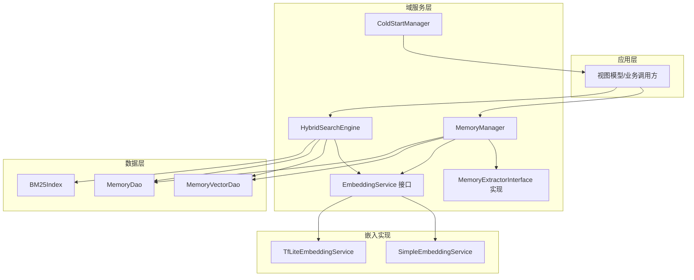
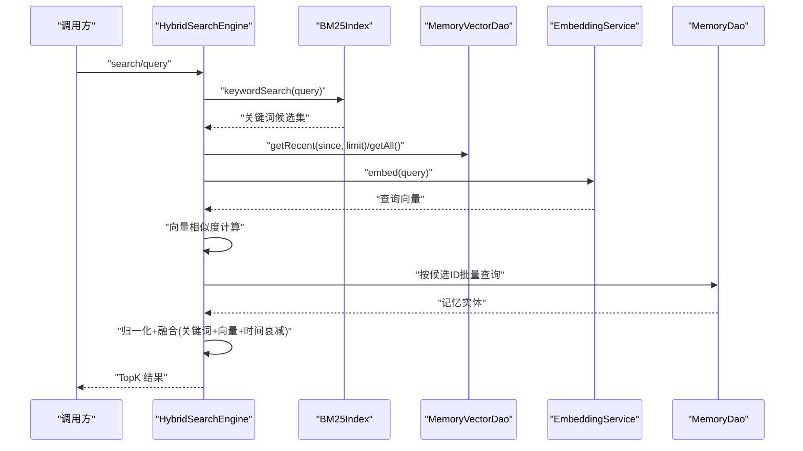
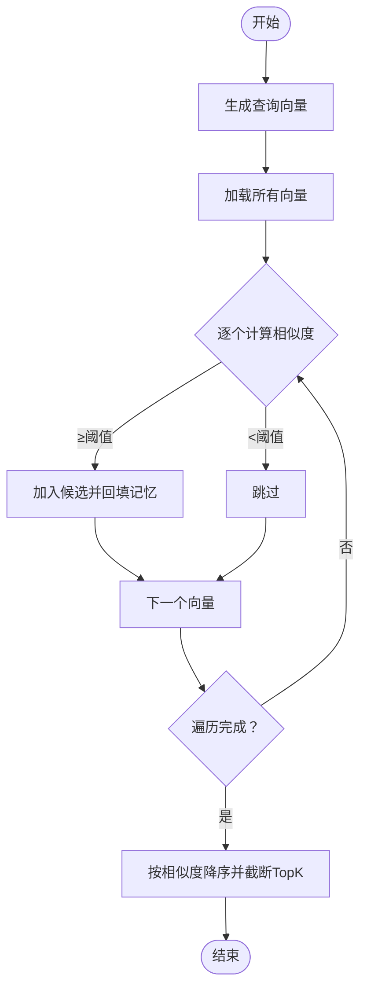
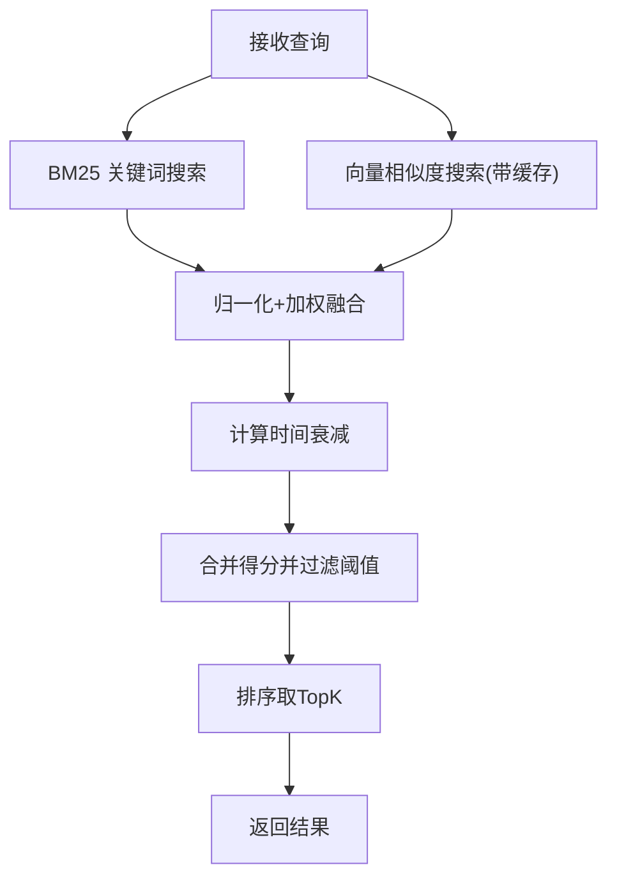
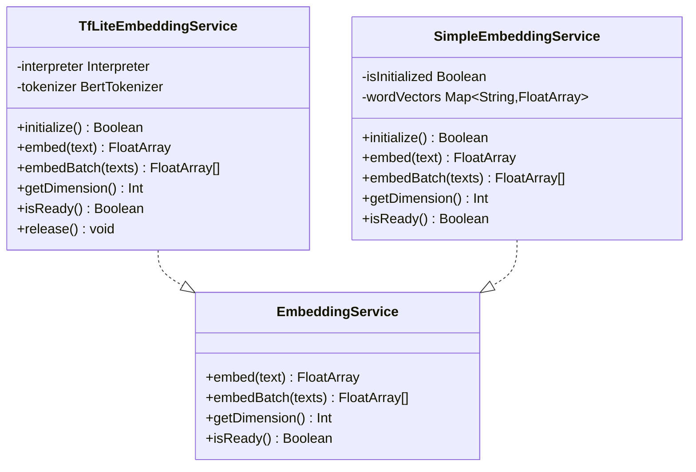
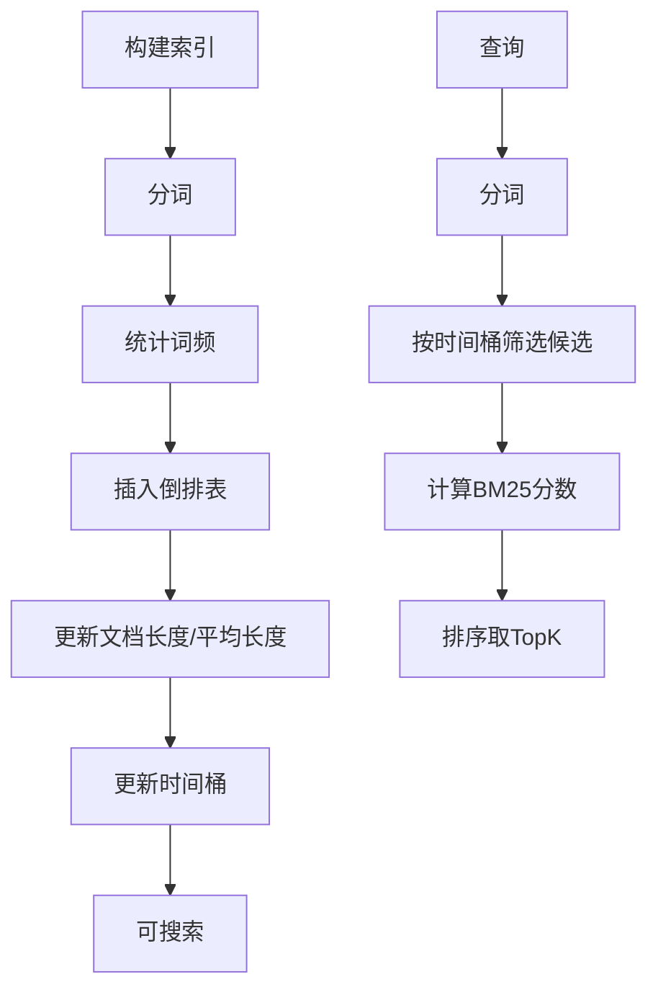
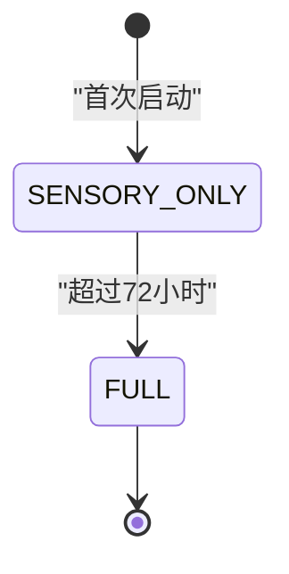
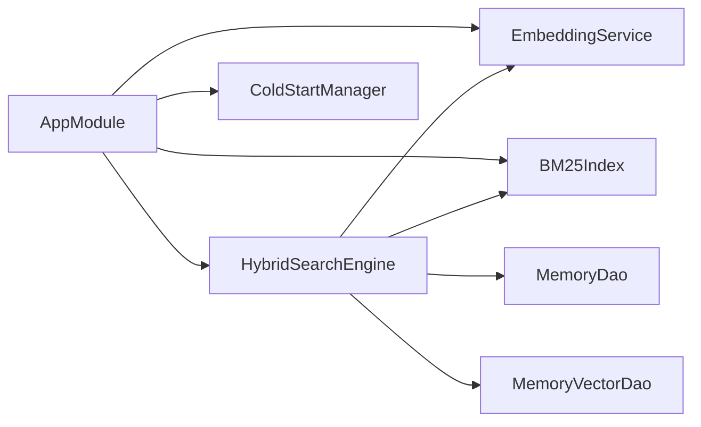

# 内存系统

<cite>
**本文引用的文件**
- [MemoryManager.kt](file://app/src/main/java/ai/openclaw/android/domain/memory/MemoryManager.kt)
- [HybridSearchEngine.kt](file://app/src/main/java/ai/openclaw/android/domain/memory/HybridSearchEngine.kt)
- [EmbeddingService.kt](file://app/src/main/java/ai/openclaw/android/domain/memory/EmbeddingService.kt)
- [TfLiteEmbeddingService.kt](file://app/src/main/java/ai/openclaw/android/ml/TfLiteEmbeddingService.kt)
- [SimpleEmbeddingService.kt](file://app/src/main/java/ai/openclaw/android/ml/SimpleEmbeddingService.kt)
- [ColdStartManager.kt](file://app/src/main/java/ai/openclaw/android/domain/memory/ColdStartManager.kt)
- [BM25Index.kt](file://app/src/main/java/ai/openclaw/android/data/local/BM25Index.kt)
- [MemoryDao.kt](file://app/src/main/java/ai/openclaw/android/data/local/MemoryDao.kt)
- [MemoryVectorDao.kt](file://app/src/main/java/ai/openclaw/android/data/local/MemoryVectorDao.kt)
- [MemoryEntity.kt](file://app/src/main/java/ai/openclaw/android/data/model/MemoryEntity.kt)
- [MemoryType.kt](file://app/src/main/java/ai/openclaw/android/data/model/MemoryType.kt)
- [AppModule.kt](file://app/src/main/java/ai/openclaw/android/di/AppModule.kt)
- [MemoryExtractor.kt](file://app/src/main/java/ai/openclaw/android/domain/memory/MemoryExtractor.kt)
- [MemoryExtractorInterface.kt](file://app/src/main/java/ai/openclaw/android/domain/memory/MemoryExtractorInterface.kt)
- [MemorySearchResult.kt](file://app/src/main/java/ai/openclaw/android/domain/memory/MemorySearchResult.kt)
- [VectorSearchTest.kt](file://app/src/test/java/ai/openclaw/android/domain/memory/VectorSearchTest.kt)
</cite>

## 目录
1. [简介](#简介)
2. [项目结构](#项目结构)
3. [核心组件](#核心组件)
4. [架构总览](#架构总览)
5. [详细组件分析](#详细组件分析)
6. [依赖关系分析](#依赖关系分析)
7. [性能考量](#性能考量)
8. [故障排查指南](#故障排查指南)
9. [结论](#结论)
10. [附录](#附录)

## 简介
本文件面向“内存系统”的技术文档，聚焦混合检索引擎的实现与优化，涵盖以下要点：
- 混合检索：BM25 全文关键词检索、向量语义相似度、时间衰减三者融合
- MemoryManager 的数据存储、索引管理与检索优化
- EmbeddingService 的嵌入向量生成与相似度计算
- ColdStartManager 的冷启动策略与渐进激活机制
- 性能调优、缓存策略、存储优化
- 使用示例、监控指标与扩展性/定制化能力

## 项目结构
内存系统主要由三层构成：
- 数据层：Room DAO 与实体模型，负责持久化与查询
- 域服务层：MemoryManager、HybridSearchEngine、EmbeddingService 接口及其实现、ColdStartManager
- 检索与索引：BM25 内存倒排索引、向量缓存与并发搜索

图表来源
- [AppModule.kt:45-53](file://app/src/main/java/ai/openclaw/android/di/AppModule.kt#L45-L53)
- [HybridSearchEngine.kt:18-23](file://app/src/main/java/ai/openclaw/android/domain/memory/HybridSearchEngine.kt#L18-L23)
- [MemoryManager.kt:10-15](file://app/src/main/java/ai/openclaw/android/domain/memory/MemoryManager.kt#L10-L15)
- [BM25Index.kt:14-42](file://app/src/main/java/ai/openclaw/android/data/local/BM25Index.kt#L14-L42)
- [MemoryDao.kt:12-48](file://app/src/main/java/ai/openclaw/android/data/local/MemoryDao.kt#L12-L48)
- [MemoryVectorDao.kt:9-25](file://app/src/main/java/ai/openclaw/android/data/local/MemoryVectorDao.kt#L9-L25)
- [TfLiteEmbeddingService.kt:13-25](file://app/src/main/java/ai/openclaw/android/ml/TfLiteEmbeddingService.kt#L13-L25)
- [SimpleEmbeddingService.kt:19-27](file://app/src/main/java/ai/openclaw/android/ml/SimpleEmbeddingService.kt#L19-L27)

章节来源
- [AppModule.kt:24-79](file://app/src/main/java/ai/openclaw/android/di/AppModule.kt#L24-L79)
- [MemoryEntity.kt:6-18](file://app/src/main/java/ai/openclaw/android/data/model/MemoryEntity.kt#L6-L18)
- [MemoryType.kt:3-5](file://app/src/main/java/ai/openclaw/android/data/model/MemoryType.kt#L3-L5)

## 核心组件
- MemoryManager：负责记忆的存储、检索、清理与访问更新；在有向量服务时生成向量并持久化，否则使用降级向量；提供余弦相似度排序与阈值过滤
- HybridSearchEngine：混合检索引擎，融合 BM25 关键词分数、向量相似度与时间衰减，支持同步/异步两种执行模式，并内置向量结果缓存
- EmbeddingService 及其实现：统一的嵌入接口，提供批量/单条嵌入、维度与就绪状态；TfLiteEmbeddingService 使用本地模型，SimpleEmbeddingService 提供基于哈希的降级方案
- BM25Index：纯 Kotlin 实现的内存倒排索引，支持中英混合分词、IDF/TF 归一化、时间桶过滤与重建
- ColdStartManager：冷启动控制，前 72 小时采用轻量模式，之后启用完整功能
- MemoryExtractor：从对话或用户输入中抽取记忆，作为 MemoryManager 的上游

章节来源
- [MemoryManager.kt:10-116](file://app/src/main/java/ai/openclaw/android/domain/memory/MemoryManager.kt#L10-L116)
- [HybridSearchEngine.kt:18-227](file://app/src/main/java/ai/openclaw/android/domain/memory/HybridSearchEngine.kt#L18-L227)
- [EmbeddingService.kt:3-8](file://app/src/main/java/ai/openclaw/android/domain/memory/EmbeddingService.kt#L3-L8)
- [TfLiteEmbeddingService.kt:13-97](file://app/src/main/java/ai/openclaw/android/ml/TfLiteEmbeddingService.kt#L13-L97)
- [SimpleEmbeddingService.kt:19-107](file://app/src/main/java/ai/openclaw/android/ml/SimpleEmbeddingService.kt#L19-L107)
- [BM25Index.kt:14-203](file://app/src/main/java/ai/openclaw/android/data/local/BM25Index.kt#L14-L203)
- [ColdStartManager.kt:14-61](file://app/src/main/java/ai/openclaw/android/domain/memory/ColdStartManager.kt#L14-L61)
- [MemoryExtractor.kt:16-99](file://app/src/main/java/ai/openclaw/android/domain/memory/MemoryExtractor.kt#L16-L99)

## 架构总览
混合检索的整体流程如下：

图表来源
- [HybridSearchEngine.kt:137-220](file://app/src/main/java/ai/openclaw/android/domain/memory/HybridSearchEngine.kt#L137-L220)
- [BM25Index.kt:140-178](file://app/src/main/java/ai/openclaw/android/data/local/BM25Index.kt#L140-L178)
- [MemoryVectorDao.kt:17-24](file://app/src/main/java/ai/openclaw/android/data/local/MemoryVectorDao.kt#L17-L24)
- [MemoryDao.kt:19-20](file://app/src/main/java/ai/openclaw/android/data/local/MemoryDao.kt#L19-L20)

## 详细组件分析

### MemoryManager：存储、检索与维护
- 存储流程：若嵌入服务可用则生成向量，否则使用降级向量；分别写入记忆表与向量表
- 检索流程：生成查询向量，暴力遍历向量表计算余弦相似度，按阈值过滤与排序，再回填记忆实体
- 访问更新：每次命中会更新最近访问时间与计数
- 清理策略：基于访问时间与访问次数的“陈旧”清理，删除对应的记忆与向量记录
- 重要记忆：支持按优先级与类型筛选

图表来源
- [MemoryManager.kt:38-61](file://app/src/main/java/ai/openclaw/android/domain/memory/MemoryManager.kt#L38-L61)

章节来源
- [MemoryManager.kt:16-95](file://app/src/main/java/ai/openclaw/android/domain/memory/MemoryManager.kt#L16-L95)
- [MemorySearchResult.kt:5-8](file://app/src/main/java/ai/openclaw/android/domain/memory/MemorySearchResult.kt#L5-L8)

### HybridSearchEngine：BM25 + 向量 + 时间衰减融合
- 融合权重：关键词 35%、向量 55%、时间衰减 10%，最小合并分数阈值 0.3
- 时间衰减：以指数函数随天数衰减，半衰期 30 天
- 向量缓存：查询向量结果缓存 30 秒，减少重复计算
- 并发搜索：BM25 与向量路径并行执行，提升响应速度
- 重建索引：支持从 DAO 重建 BM25 倒排索引

图表来源
- [HybridSearchEngine.kt:82-135](file://app/src/main/java/ai/openclaw/android/domain/memory/HybridSearchEngine.kt#L82-L135)
- [HybridSearchEngine.kt:172-220](file://app/src/main/java/ai/openclaw/android/domain/memory/HybridSearchEngine.kt#L172-L220)

章节来源
- [HybridSearchEngine.kt:18-35](file://app/src/main/java/ai/openclaw/android/domain/memory/HybridSearchEngine.kt#L18-L35)
- [HybridSearchEngine.kt:147-170](file://app/src/main/java/ai/openclaw/android/domain/memory/HybridSearchEngine.kt#L147-L170)

### EmbeddingService：嵌入生成与相似度
- 接口职责：提供 embed/embedBatch、维度与就绪状态
- TfLite 实现：加载本地模型与词表，支持批处理，推理在 IO 协程调度
- Simple 实现：基于哈希的降级方案，适合无模型场景，性能 O(n)，质量次于神经嵌入
- 相似度：MemoryManager 内置余弦相似度计算，用于向量检索

图表来源
- [EmbeddingService.kt:3-8](file://app/src/main/java/ai/openclaw/android/domain/memory/EmbeddingService.kt#L3-L8)
- [TfLiteEmbeddingService.kt:13-97](file://app/src/main/java/ai/openclaw/android/ml/TfLiteEmbeddingService.kt#L13-L97)
- [SimpleEmbeddingService.kt:19-107](file://app/src/main/java/ai/openclaw/android/ml/SimpleEmbeddingService.kt#L19-L107)

章节来源
- [TfLiteEmbeddingService.kt:27-48](file://app/src/main/java/ai/openclaw/android/ml/TfLiteEmbeddingService.kt#L27-L48)
- [SimpleEmbeddingService.kt:31-41](file://app/src/main/java/ai/openclaw/android/ml/SimpleEmbeddingService.kt#L31-L41)
- [MemoryManager.kt:101-114](file://app/src/main/java/ai/openclaw/android/domain/memory/MemoryManager.kt#L101-L114)

### BM25Index：全文检索索引
- 分词策略：中文字符大二元组 + 英文小写单词
- 倒排结构：Term -> Posting(文档ID, 词频)，文档长度映射，平均文档长度
- 时间过滤：按天粒度的时间桶快速筛选候选集合
- 重建：从 DAO 批量重建索引，后台线程执行

图表来源
- [BM25Index.kt:47-86](file://app/src/main/java/ai/openclaw/android/data/local/BM25Index.kt#L47-L86)
- [BM25Index.kt:91-112](file://app/src/main/java/ai/openclaw/android/data/local/BM25Index.kt#L91-L112)
- [BM25Index.kt:140-178](file://app/src/main/java/ai/openclaw/android/data/local/BM25Index.kt#L140-L178)
- [BM25Index.kt:183-189](file://app/src/main/java/ai/openclaw/android/data/local/BM25Index.kt#L183-L189)

章节来源
- [BM25Index.kt:14-42](file://app/src/main/java/ai/openclaw/android/data/local/BM25Index.kt#L14-L42)
- [BM25Index.kt:179-202](file://app/src/main/java/ai/openclaw/android/data/local/BM25Index.kt#L179-L202)

### ColdStartManager：冷启动与渐进激活
- 模式：SENSORY_ONLY（前 72 小时）与 FULL（之后）
- 机制：首次启动记录时间戳，根据已过小时数切换模式；提供剩余小时数查询
- 价值：降低初期资源占用，保障稳定体验

图表来源
- [ColdStartManager.kt:16-30](file://app/src/main/java/ai/openclaw/android/domain/memory/ColdStartManager.kt#L16-L30)
- [ColdStartManager.kt:44-59](file://app/src/main/java/ai/openclaw/android/domain/memory/ColdStartManager.kt#L44-L59)

章节来源
- [ColdStartManager.kt:36-60](file://app/src/main/java/ai/openclaw/android/domain/memory/ColdStartManager.kt#L36-L60)

### 数据模型与DAO
- MemoryEntity：记忆实体，含内容、类型、优先级、标签、时间戳等
- MemoryType：记忆类型枚举
- MemoryDao/MemoryVectorDao：提供插入、查询、删除、统计、时间范围查询等
- BM25Index 与 DAO 的配合：通过重建索引将持久化数据纳入内存索引

章节来源
- [MemoryEntity.kt:6-18](file://app/src/main/java/ai/openclaw/android/data/model/MemoryEntity.kt#L6-L18)
- [MemoryType.kt:3-5](file://app/src/main/java/ai/openclaw/android/data/model/MemoryType.kt#L3-L5)
- [MemoryDao.kt:12-48](file://app/src/main/java/ai/openclaw/android/data/local/MemoryDao.kt#L12-L48)
- [MemoryVectorDao.kt:9-25](file://app/src/main/java/ai/openclaw/android/data/local/MemoryVectorDao.kt#L9-L25)
- [BM25Index.kt:183-189](file://app/src/main/java/ai/openclaw/android/data/local/BM25Index.kt#L183-L189)

### 记忆抽取与存储
- MemoryExtractor：从对话抽取记忆（JSON 解析），从用户输入推断类型与优先级
- MemoryManager.extractAndStore/addManual：调用抽取器后批量/单条存储

章节来源
- [MemoryExtractor.kt:16-99](file://app/src/main/java/ai/openclaw/android/domain/memory/MemoryExtractor.kt#L16-L99)
- [MemoryManager.kt:75-85](file://app/src/main/java/ai/openclaw/android/domain/memory/MemoryManager.kt#L75-L85)
- [MemoryExtractorInterface.kt:7-10](file://app/src/main/java/ai/openclaw/android/domain/memory/MemoryExtractorInterface.kt#L7-L10)

## 依赖关系分析
- DI 模块集中装配：EmbeddingService、BM25Index、HybridSearchEngine、ColdStartManager 等单例
- 搜索链路耦合点：HybridSearchEngine 同时依赖 BM25Index、MemoryDao、MemoryVectorDao、EmbeddingService
- 冷启动影响：ColdStartManager 控制模式，间接影响是否进行向量与 BM25 操作

图表来源
- [AppModule.kt:37-53](file://app/src/main/java/ai/openclaw/android/di/AppModule.kt#L37-L53)

章节来源
- [AppModule.kt:24-79](file://app/src/main/java/ai/openclaw/android/di/AppModule.kt#L24-L79)

## 性能考量
- 向量检索
  - 当前为暴力遍历，复杂度 O(N×D)，N 为向量数量，D 为维度
  - 建议：引入近似最近邻库（如 FAISS/ANNoy）以降低到 O(log N) 或 O(N^0.x)
  - 缓存：HybridSearchEngine 已内置向量结果缓存 30 秒，减少重复计算
- BM25
  - 倒排索引与 LRU 查询缓存，时间范围过滤通过天级桶加速
  - 建议：对高热度查询增加更细粒度缓存，或预热热点词汇
- 并发
  - HybridSearchEngine 的异步搜索使用默认调度器并行两路，显著降低端到端延迟
- 冷启动
  - 前 72 小时禁用向量与 BM25，仅保留基础检索，降低首帧延迟
- 存储
  - 向量与记忆分离存储，便于独立清理与重建
  - 定期清理陈旧记忆，避免无限增长

章节来源
- [HybridSearchEngine.kt:147-170](file://app/src/main/java/ai/openclaw/android/domain/memory/HybridSearchEngine.kt#L147-L170)
- [HybridSearchEngine.kt:202-219](file://app/src/main/java/ai/openclaw/android/domain/memory/HybridSearchEngine.kt#L202-L219)
- [BM25Index.kt:35-42](file://app/src/main/java/ai/openclaw/android/data/local/BM25Index.kt#L35-L42)
- [BM25Index.kt:146-157](file://app/src/main/java/ai/openclaw/android/data/local/BM25Index.kt#L146-L157)
- [MemoryManager.kt:87-95](file://app/src/main/java/ai/openclaw/android/domain/memory/MemoryManager.kt#L87-L95)

## 故障排查指南
- 向量维度不匹配
  - 现象：余弦相似度抛出维度不一致异常
  - 处理：确保查询文本与存储向量来自同一 EmbeddingService 实例
- 嵌入服务未初始化
  - 现象：调用 embed 抛出未初始化异常
  - 处理：先调用 initialize，确认 isReady 返回 true
- 搜索结果为空
  - 可能原因：BM25 无候选、向量缓存未命中、阈值过高、无向量数据
  - 处理：降低阈值、检查向量是否成功写入、触发索引重建
- 冷启动模式
  - 现象：某些功能未生效
  - 处理：确认已过 72 小时或手动切换模式

章节来源
- [MemoryManager.kt:101-114](file://app/src/main/java/ai/openclaw/android/domain/memory/MemoryManager.kt#L101-L114)
- [TfLiteEmbeddingService.kt:50-53](file://app/src/main/java/ai/openclaw/android/ml/TfLiteEmbeddingService.kt#L50-L53)
- [HybridSearchEngine.kt:172-185](file://app/src/main/java/ai/openclaw/android/domain/memory/HybridSearchEngine.kt#L172-L185)
- [ColdStartManager.kt:44-59](file://app/src/main/java/ai/openclaw/android/domain/memory/ColdStartManager.kt#L44-L59)

## 结论
该内存系统通过“BM25 + 向量 + 时间衰减”的混合检索，在保证召回质量的同时兼顾性能与资源消耗。MemoryManager 与 HybridSearchEngine 分别承担存储与检索的核心职责，BM25Index 提供高效的关键词检索，EmbeddingService 支持可插拔的向量生成策略，ColdStartManager 则在初期阶段提供渐进激活。未来可在向量检索上引入近邻索引、扩大缓存粒度与范围，并进一步完善监控与可观测性。

## 附录

### 使用示例（路径指引）
- 初始化嵌入服务并等待就绪
  - [TfLiteEmbeddingService.initialize:27-48](file://app/src/main/java/ai/openclaw/android/ml/TfLiteEmbeddingService.kt#L27-L48)
  - [SimpleEmbeddingService.initialize:31-41](file://app/src/main/java/ai/openclaw/android/ml/SimpleEmbeddingService.kt#L31-L41)
- 存储记忆并抽取
  - [MemoryManager.store:16-36](file://app/src/main/java/ai/openclaw/android/domain/memory/MemoryManager.kt#L16-L36)
  - [MemoryManager.extractAndStore:75-79](file://app/src/main/java/ai/openclaw/android/domain/memory/MemoryManager.kt#L75-L79)
- 检索记忆
  - [HybridSearchEngine.search:173-185](file://app/src/main/java/ai/openclaw/android/domain/memory/HybridSearchEngine.kt#L173-L185)
  - [HybridSearchEngine.asyncSearch:203-219](file://app/src/main/java/ai/openclaw/android/domain/memory/HybridSearchEngine.kt#L203-L219)
  - [MemoryManager.search:38-61](file://app/src/main/java/ai/openclaw/android/domain/memory/MemoryManager.kt#L38-L61)
- 清理陈旧记忆
  - [MemoryManager.cleanup:87-95](file://app/src/main/java/ai/openclaw/android/domain/memory/MemoryManager.kt#L87-L95)
- 重建 BM25 索引
  - [HybridSearchEngine.rebuildIndex:221-225](file://app/src/main/java/ai/openclaw/android/domain/memory/HybridSearchEngine.kt#L221-L225)

### 监控指标建议
- 检索指标
  - 关键词候选数、向量候选数、合并后命中数、TopK 输出数
  - 关键词分数分布、向量分数分布、时间衰减分布
  - 融合后得分阈值命中率
- 性能指标
  - 关键词搜索耗时、向量搜索耗时、融合耗时、总耗时
  - 向量缓存命中率、缓存大小、缓存 TTL 生效情况
- 资源指标
  - 向量表大小、记忆表大小、索引大小、内存占用
  - 嵌入服务初始化耗时、就绪状态变化
- 可观测性
  - 日志：搜索请求摘要、候选规模、缓存命中、错误信息
  - APM：端到端 RT、错误率、P95/P99

### 扩展性与定制化
- 自定义 EmbeddingService
  - 实现接口并在 DI 中替换，默认通过工厂创建
  - [EmbeddingService 接口:3-8](file://app/src/main/java/ai/openclaw/android/domain/memory/EmbeddingService.kt#L3-L8)
  - [DI 注册位置:37-40](file://app/src/main/java/ai/openclaw/android/di/AppModule.kt#L37-L40)
- 自定义分词与 BM25 参数
  - 修改 BM25Index.tokenize 与 k1/b 参数
  - [BM25Index.tokenize:47-86](file://app/src/main/java/ai/openclaw/android/data/local/BM25Index.kt#L47-L86)
  - [BM25Index 构造参数:14-17](file://app/src/main/java/ai/openclaw/android/data/local/BM25Index.kt#L14-L17)
- 自定义融合策略
  - 调整权重与阈值，或替换为学习排序方法
  - [融合逻辑:82-135](file://app/src/main/java/ai/openclaw/android/domain/memory/HybridSearchEngine.kt#L82-L135)
- 冷启动策略
  - 调整模式切换阈值与模式行为
  - [模式切换:44-59](file://app/src/main/java/ai/openclaw/android/domain/memory/ColdStartManager.kt#L44-L59)

章节来源
- [AppModule.kt:37-40](file://app/src/main/java/ai/openclaw/android/di/AppModule.kt#L37-L40)
- [BM25Index.kt:14-17](file://app/src/main/java/ai/openclaw/android/data/local/BM25Index.kt#L14-L17)
- [HybridSearchEngine.kt:24-35](file://app/src/main/java/ai/openclaw/android/domain/memory/HybridSearchEngine.kt#L24-L35)
- [ColdStartManager.kt:27-29](file://app/src/main/java/ai/openclaw/android/domain/memory/ColdStartManager.kt#L27-L29)