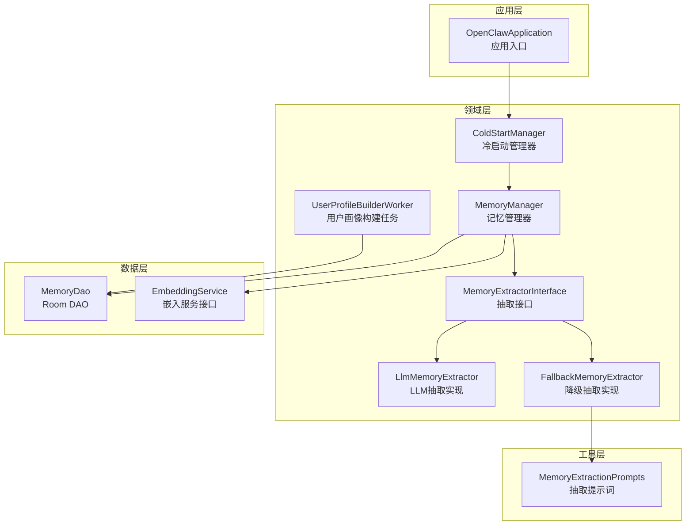
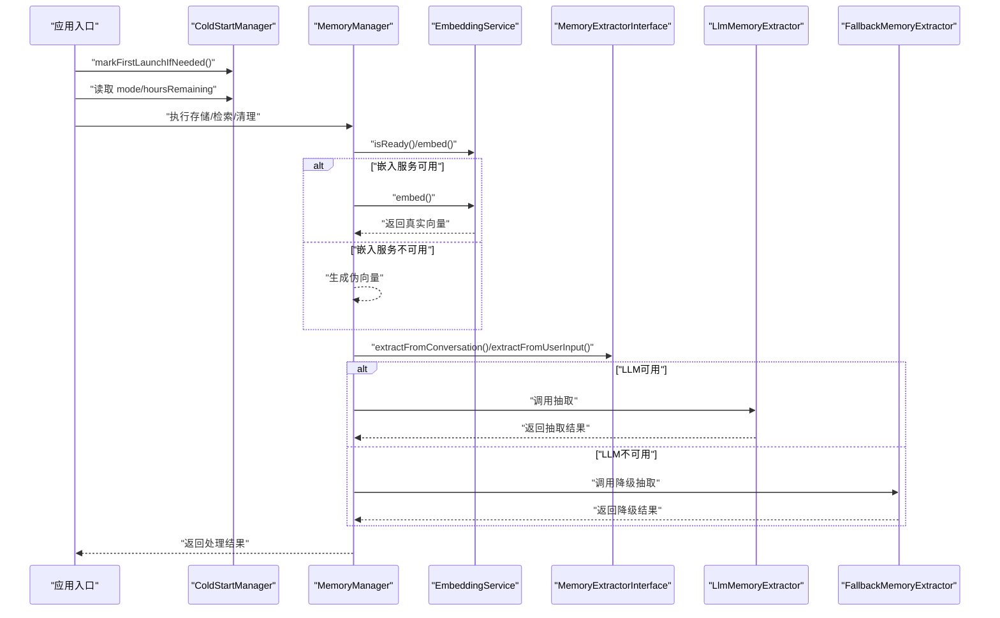
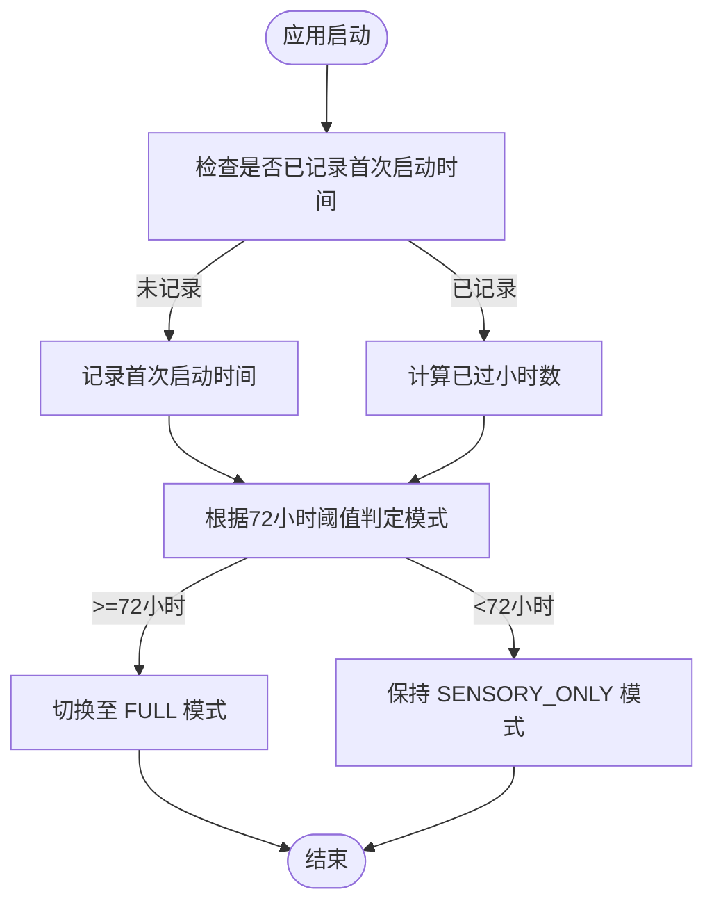
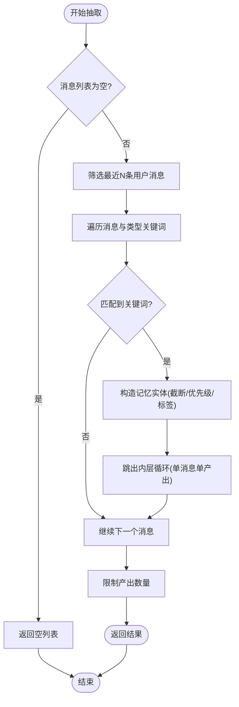
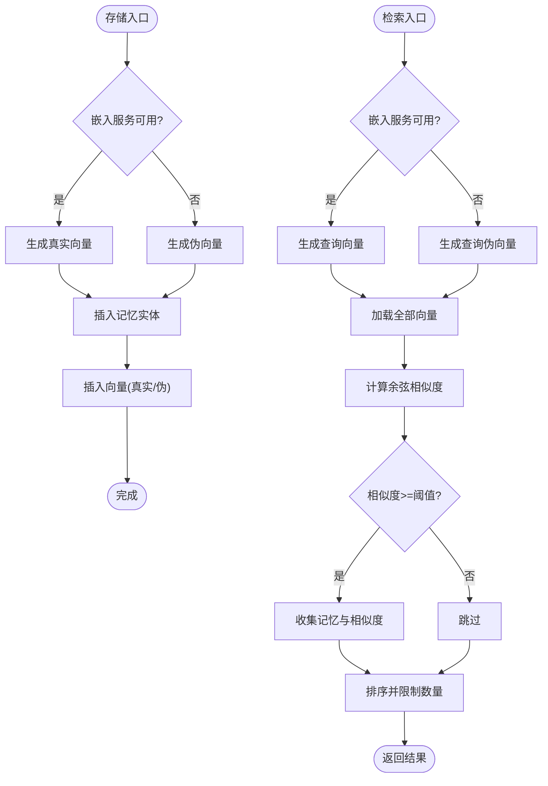
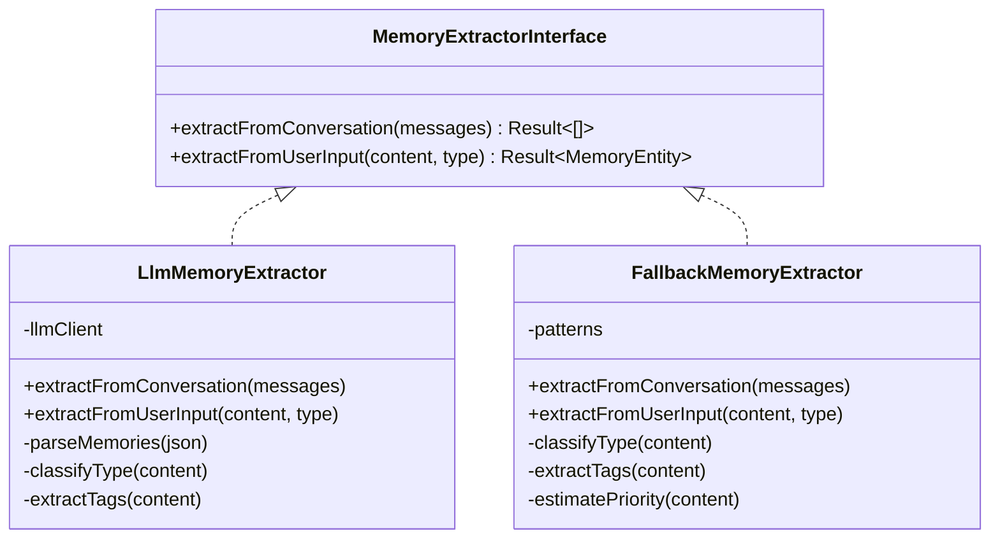
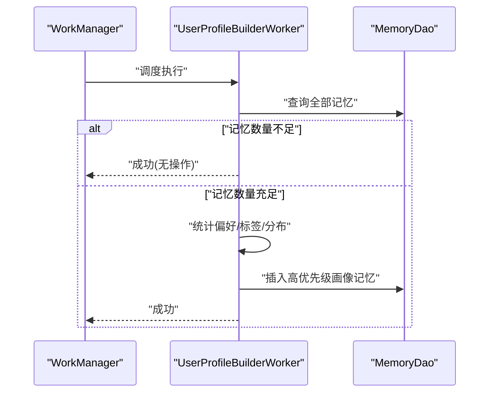
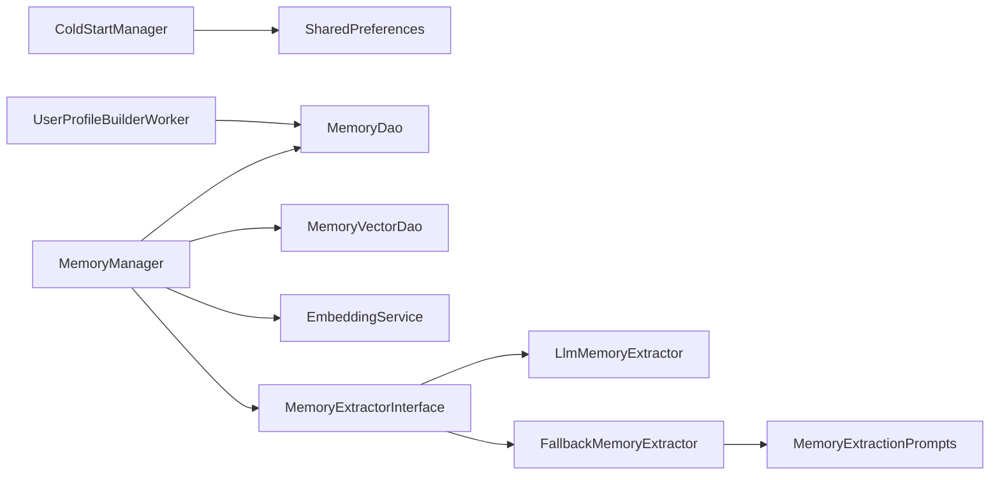

# 冷启动管理

<cite>
**本文引用的文件**
- [ColdStartManager.kt](file://app/src/main/java/ai/openclaw/android/domain/memory/ColdStartManager.kt)
- [FallbackMemoryExtractor.kt](file://app/src/main/java/ai/openclaw/android/domain/memory/FallbackMemoryExtractor.kt)
- [MemoryExtractor.kt](file://app/src/main/java/ai/openclaw/android/domain/memory/MemoryExtractor.kt)
- [MemoryExtractorInterface.kt](file://app/src/main/java/ai/openclaw/android/domain/memory/MemoryExtractorInterface.kt)
- [MemoryManager.kt](file://app/src/main/java/ai/openclaw/android/domain/memory/MemoryManager.kt)
- [EmbeddingService.kt](file://app/src/main/java/ai/openclaw/android/domain/memory/EmbeddingService.kt)
- [MemoryType.kt](file://app/src/main/java/ai/openclaw/android/data/model/MemoryType.kt)
- [MemoryExtractionPrompts.kt](file://app/src/main/java/ai/openclaw/android/util/MemoryExtractionPrompts.kt)
- [UserProfileBuilderWorker.kt](file://app/src/main/java/ai/openclaw/android/domain/memory/UserProfileBuilderWorker.kt)
- [OpenClawApplication.kt](file://app/src/main/java/ai/openclaw/android/OpenClawApplication.kt)
- [MemoryDao.kt](file://app/src/main/java/ai/openclaw/android/data/local/MemoryDao.kt)
</cite>

## 目录
1. [引言](#引言)
2. [项目结构](#项目结构)
3. [核心组件](#核心组件)
4. [架构总览](#架构总览)
5. [详细组件分析](#详细组件分析)
6. [依赖关系分析](#依赖关系分析)
7. [性能考量](#性能考量)
8. [故障排查指南](#故障排查指南)
9. [结论](#结论)
10. [附录](#附录)

## 引言
本技术文档聚焦于内存系统“冷启动”阶段的管理与优化，围绕以下目标展开：
- 解释冷启动问题在内存系统中的表现与影响
- 深入说明 ColdStartManager 的渐进激活策略与启发式算法
- 阐述 FallbackMemoryExtractor 的降级提取机制与质量保证
- 解释冷启动阶段的性能监控与效果评估
- 给出冷启动优化的时间窗口设置与阈值调整建议
- 提供冷启动管理的配置参数与调优建议
- 说明从冷启动完成到正常模式的平滑过渡机制

## 项目结构
本项目采用按领域划分的模块化组织方式，冷启动管理相关代码主要位于 domain/memory 包中，并与数据层（Room）、嵌入服务（EmbeddingService）以及工具类（MemoryExtractionPrompts）协同工作。

**图表来源**
- [OpenClawApplication.kt:1-19](file://app/src/main/java/ai/openclaw/android/OpenClawApplication.kt#L1-L19)
- [ColdStartManager.kt:1-61](file://app/src/main/java/ai/openclaw/android/domain/memory/ColdStartManager.kt#L1-L61)
- [MemoryManager.kt:1-116](file://app/src/main/java/ai/openclaw/android/domain/memory/MemoryManager.kt#L1-L116)
- [MemoryExtractorInterface.kt:1-11](file://app/src/main/java/ai/openclaw/android/domain/memory/MemoryExtractorInterface.kt#L1-L11)
- [MemoryExtractor.kt:1-99](file://app/src/main/java/ai/openclaw/android/domain/memory/MemoryExtractor.kt#L1-L99)
- [FallbackMemoryExtractor.kt:1-83](file://app/src/main/java/ai/openclaw/android/domain/memory/FallbackMemoryExtractor.kt#L1-L83)
- [EmbeddingService.kt:1-8](file://app/src/main/java/ai/openclaw/android/domain/memory/EmbeddingService.kt#L1-L8)
- [MemoryDao.kt:1-35](file://app/src/main/java/ai/openclaw/android/data/local/MemoryDao.kt#L1-L35)
- [MemoryExtractionPrompts.kt:1-28](file://app/src/main/java/ai/openclaw/android/util/MemoryExtractionPrompts.kt#L1-L28)
- [UserProfileBuilderWorker.kt:1-99](file://app/src/main/java/ai/openclaw/android/domain/memory/UserProfileBuilderWorker.kt#L1-L99)

**章节来源**
- [OpenClawApplication.kt:1-19](file://app/src/main/java/ai/openclaw/android/OpenClawApplication.kt#L1-L19)
- [ColdStartManager.kt:1-61](file://app/src/main/java/ai/openclaw/android/domain/memory/ColdStartManager.kt#L1-L61)
- [MemoryManager.kt:1-116](file://app/src/main/java/ai/openclaw/android/domain/memory/MemoryManager.kt#L1-L116)
- [MemoryExtractorInterface.kt:1-11](file://app/src/main/java/ai/openclaw/android/domain/memory/MemoryExtractorInterface.kt#L1-L11)
- [MemoryExtractor.kt:1-99](file://app/src/main/java/ai/openclaw/android/domain/memory/MemoryExtractor.kt#L1-L99)
- [FallbackMemoryExtractor.kt:1-83](file://app/src/main/java/ai/openclaw/android/domain/memory/FallbackMemoryExtractor.kt#L1-L83)
- [EmbeddingService.kt:1-8](file://app/src/main/java/ai/openclaw/android/domain/memory/EmbeddingService.kt#L1-L8)
- [MemoryDao.kt:1-35](file://app/src/main/java/ai/openclaw/android/data/local/MemoryDao.kt#L1-L35)
- [MemoryExtractionPrompts.kt:1-28](file://app/src/main/java/ai/openclaw/android/util/MemoryExtractionPrompts.kt#L1-L28)
- [UserProfileBuilderWorker.kt:1-99](file://app/src/main/java/ai/openclaw/android/domain/memory/UserProfileBuilderWorker.kt#L1-L99)

## 核心组件
- ColdStartManager：基于首次启动时间戳的冷启动状态机，控制内存系统在前72小时内的轻量化模式与全功能模式切换。
- MemoryManager：统一的记忆存储、检索与清理入口，内置嵌入服务可用性检测与降级向量生成逻辑。
- MemoryExtractorInterface 及其实现：定义记忆抽取接口，包含 LLM 抽取与降级抽取两种实现。
- FallbackMemoryExtractor：在嵌入服务不可用或冷启动期间，基于关键词规则进行快速抽取与质量估计。
- EmbeddingService：嵌入服务接口，提供 isReady() 判断与维度查询。
- MemoryType：记忆类型枚举，用于区分偏好、事实、决策、任务、项目等。
- MemoryExtractionPrompts：抽取提示词模板，指导 LLM 抽取行为。
- UserProfileBuilderWorker：周期性构建用户画像，作为冷启动后系统成熟度的信号之一。

**章节来源**
- [ColdStartManager.kt:1-61](file://app/src/main/java/ai/openclaw/android/domain/memory/ColdStartManager.kt#L1-L61)
- [MemoryManager.kt:1-116](file://app/src/main/java/ai/openclaw/android/domain/memory/MemoryManager.kt#L1-L116)
- [MemoryExtractorInterface.kt:1-11](file://app/src/main/java/ai/openclaw/android/domain/memory/MemoryExtractorInterface.kt#L1-L11)
- [MemoryExtractor.kt:1-99](file://app/src/main/java/ai/openclaw/android/domain/memory/MemoryExtractor.kt#L1-L99)
- [FallbackMemoryExtractor.kt:1-83](file://app/src/main/java/ai/openclaw/android/domain/memory/FallbackMemoryExtractor.kt#L1-L83)
- [EmbeddingService.kt:1-8](file://app/src/main/java/ai/openclaw/android/domain/memory/EmbeddingService.kt#L1-L8)
- [MemoryType.kt:1-5](file://app/src/main/java/ai/openclaw/android/data/model/MemoryType.kt#L1-L5)
- [MemoryExtractionPrompts.kt:1-28](file://app/src/main/java/ai/openclaw/android/util/MemoryExtractionPrompts.kt#L1-L28)
- [UserProfileBuilderWorker.kt:1-99](file://app/src/main/java/ai/openclaw/android/domain/memory/UserProfileBuilderWorker.kt#L1-L99)

## 架构总览
冷启动管理通过 ColdStartManager 在应用首次启动时记录时间戳，并在后续运行中根据已过时间判断当前模式（SENSORY_ONLY 或 FULL）。MemoryManager 在嵌入服务不可用时自动降级，使用基于内容哈希的伪向量替代真实嵌入，确保检索与存储流程不中断。抽取阶段由 MemoryExtractorInterface 抽象，优先使用 LlmMemoryExtractor，当 LLM 不可用时回退至 FallbackMemoryExtractor。UserProfileBuilderWorker 周期性构建用户画像，作为系统成熟度指标，辅助冷启动后的平滑过渡。

**图表来源**
- [OpenClawApplication.kt:1-19](file://app/src/main/java/ai/openclaw/android/OpenClawApplication.kt#L1-L19)
- [ColdStartManager.kt:1-61](file://app/src/main/java/ai/openclaw/android/domain/memory/ColdStartManager.kt#L1-L61)
- [MemoryManager.kt:1-116](file://app/src/main/java/ai/openclaw/android/domain/memory/MemoryManager.kt#L1-L116)
- [EmbeddingService.kt:1-8](file://app/src/main/java/ai/openclaw/android/domain/memory/EmbeddingService.kt#L1-L8)
- [MemoryExtractorInterface.kt:1-11](file://app/src/main/java/ai/openclaw/android/domain/memory/MemoryExtractorInterface.kt#L1-L11)
- [MemoryExtractor.kt:1-99](file://app/src/main/java/ai/openclaw/android/domain/memory/MemoryExtractor.kt#L1-L99)
- [FallbackMemoryExtractor.kt:1-83](file://app/src/main/java/ai/openclaw/android/domain/memory/FallbackMemoryExtractor.kt#L1-L83)

## 详细组件分析

### ColdStartManager 渐进激活策略与启发式算法
- 时间窗口：以首次启动时间为基准，前72小时为 SENSORY_ONLY 模式；超过72小时进入 FULL 模式。
- 启发式判定：通过 SharedPreferences 记录首次启动时间戳；若无记录则视为成熟态（FULL）。
- 进度反馈：提供剩余小时数属性，便于 UI 或日志展示。
- 应用入口：建议在 Application.onCreate 中调用标记方法，确保仅初始化一次。

**图表来源**
- [ColdStartManager.kt:35-60](file://app/src/main/java/ai/openclaw/android/domain/memory/ColdStartManager.kt#L35-L60)

**章节来源**
- [ColdStartManager.kt:1-61](file://app/src/main/java/ai/openclaw/android/domain/memory/ColdStartManager.kt#L1-L61)

### FallbackMemoryExtractor 降级提取机制与质量保证
- 降级策略：在对话抽取时，仅取最近若干条用户消息，按预设关键词集合匹配记忆类型；每条消息最多产出一条记忆。
- 类型分类：基于关键词集合进行启发式分类，覆盖偏好、事实、任务、决策、项目等类型。
- 质量估计：根据内容中的“重要/必须/紧急”等关键词估算优先级；默认优先级低于 LLM 抽取。
- 标签提取：从内容中识别“项目/工作/个人”等标签，便于后续检索与聚合。
- 输入抽取：支持手动输入的记忆抽取，可指定类型或自动分类，优先级与标签同上。

**图表来源**
- [FallbackMemoryExtractor.kt:17-42](file://app/src/main/java/ai/openclaw/android/domain/memory/FallbackMemoryExtractor.kt#L17-L42)

**章节来源**
- [FallbackMemoryExtractor.kt:1-83](file://app/src/main/java/ai/openclaw/android/domain/memory/FallbackMemoryExtractor.kt#L1-L83)
- [MemoryType.kt:1-5](file://app/src/main/java/ai/openclaw/android/data/model/MemoryType.kt#L1-L5)

### MemoryManager 嵌入降级与检索流程
- 嵌入降级：当嵌入服务不可用时，MemoryManager 使用内容哈希与索引组合生成伪向量，保证向量维度一致与存储检索可用。
- 存储流程：先写入记忆实体，再写入向量；若嵌入服务不可用，则写入伪向量。
- 检索流程：生成查询向量（可用时为真实嵌入，否则为伪向量），暴力扫描所有向量并计算余弦相似度，按阈值过滤与排序。
- 清理策略：按时间阈值与访问次数清理陈旧记忆及其向量，避免存储膨胀。

**图表来源**
- [MemoryManager.kt:16-61](file://app/src/main/java/ai/openclaw/android/domain/memory/MemoryManager.kt#L16-L61)
- [EmbeddingService.kt:1-8](file://app/src/main/java/ai/openclaw/android/domain/memory/EmbeddingService.kt#L1-L8)

**章节来源**
- [MemoryManager.kt:1-116](file://app/src/main/java/ai/openclaw/android/domain/memory/MemoryManager.kt#L1-L116)
- [EmbeddingService.kt:1-8](file://app/src/main/java/ai/openclaw/android/domain/memory/EmbeddingService.kt#L1-L8)

### 抽取接口与实现：LLM 与降级对比
- 接口契约：统一定义对话抽取与用户输入抽取两个方法，返回安全封装的结果类型。
- LLM 实现：基于本地 LLM 客户端，拼接提示词与最近对话，解析 JSON 输出为记忆实体；具备类型分类与标签提取能力。
- 降级实现：关键词驱动的启发式抽取，无需外部模型，适合冷启动与资源受限场景。

**图表来源**
- [MemoryExtractorInterface.kt:1-11](file://app/src/main/java/ai/openclaw/android/domain/memory/MemoryExtractorInterface.kt#L1-L11)
- [MemoryExtractor.kt:1-99](file://app/src/main/java/ai/openclaw/android/domain/memory/MemoryExtractor.kt#L1-L99)
- [FallbackMemoryExtractor.kt:1-83](file://app/src/main/java/ai/openclaw/android/domain/memory/FallbackMemoryExtractor.kt#L1-L83)

**章节来源**
- [MemoryExtractorInterface.kt:1-11](file://app/src/main/java/ai/openclaw/android/domain/memory/MemoryExtractorInterface.kt#L1-L11)
- [MemoryExtractor.kt:1-99](file://app/src/main/java/ai/openclaw/android/domain/memory/MemoryExtractor.kt#L1-L99)
- [FallbackMemoryExtractor.kt:1-83](file://app/src/main/java/ai/openclaw/android/domain/memory/FallbackMemoryExtractor.kt#L1-L83)
- [MemoryExtractionPrompts.kt:1-28](file://app/src/main/java/ai/openclaw/android/util/MemoryExtractionPrompts.kt#L1-L28)

### 用户画像构建与冷启动过渡
- 触发条件：当记忆总量达到一定阈值（如≥5）时，周期性任务会构建用户画像，汇总偏好、标签频率与类型分布。
- 结果存储：以高优先级的事实记忆形式保存，打上特定标签，便于后续检索与展示。
- 过渡信号：用户画像的成功构建可作为冷启动阶段完成的信号之一，辅助系统从轻量化模式向全功能模式过渡。

**图表来源**
- [UserProfileBuilderWorker.kt:30-97](file://app/src/main/java/ai/openclaw/android/domain/memory/UserProfileBuilderWorker.kt#L30-L97)
- [MemoryDao.kt:1-35](file://app/src/main/java/ai/openclaw/android/data/local/MemoryDao.kt#L1-L35)

**章节来源**
- [UserProfileBuilderWorker.kt:1-99](file://app/src/main/java/ai/openclaw/android/domain/memory/UserProfileBuilderWorker.kt#L1-L99)
- [MemoryDao.kt:1-35](file://app/src/main/java/ai/openclaw/android/data/local/MemoryDao.kt#L1-L35)

## 依赖关系分析
- ColdStartManager 依赖 SharedPreferences 与日志系统，提供模式与剩余时间查询。
- MemoryManager 依赖 MemoryDao、MemoryVectorDao、EmbeddingService 与 MemoryExtractorInterface，承担存储、检索与清理职责。
- MemoryExtractorInterface 的实现依赖提示词模板与本地 LLM 客户端（在 LlmMemoryExtractor 中体现）。
- FallbackMemoryExtractor 独立于外部模型，仅依赖消息与类型定义。
- UserProfileBuilderWorker 依赖数据库与日志系统，定期产出高质量事实记忆。

**图表来源**
- [ColdStartManager.kt:32-33](file://app/src/main/java/ai/openclaw/android/domain/memory/ColdStartManager.kt#L32-L33)
- [MemoryManager.kt:10-15](file://app/src/main/java/ai/openclaw/android/domain/memory/MemoryManager.kt#L10-L15)
- [MemoryExtractorInterface.kt:1-11](file://app/src/main/java/ai/openclaw/android/domain/memory/MemoryExtractorInterface.kt#L1-L11)
- [MemoryExtractor.kt:1-16](file://app/src/main/java/ai/openclaw/android/domain/memory/MemoryExtractor.kt#L1-L16)
- [FallbackMemoryExtractor.kt:1-15](file://app/src/main/java/ai/openclaw/android/domain/memory/FallbackMemoryExtractor.kt#L1-L15)
- [MemoryExtractionPrompts.kt:1-28](file://app/src/main/java/ai/openclaw/android/util/MemoryExtractionPrompts.kt#L1-L28)
- [UserProfileBuilderWorker.kt:33-34](file://app/src/main/java/ai/openclaw/android/domain/memory/UserProfileBuilderWorker.kt#L33-L34)

**章节来源**
- [ColdStartManager.kt:1-61](file://app/src/main/java/ai/openclaw/android/domain/memory/ColdStartManager.kt#L1-L61)
- [MemoryManager.kt:1-116](file://app/src/main/java/ai/openclaw/android/domain/memory/MemoryManager.kt#L1-L116)
- [MemoryExtractorInterface.kt:1-11](file://app/src/main/java/ai/openclaw/android/domain/memory/MemoryExtractorInterface.kt#L1-L11)
- [MemoryExtractor.kt:1-99](file://app/src/main/java/ai/openclaw/android/domain/memory/MemoryExtractor.kt#L1-L99)
- [FallbackMemoryExtractor.kt:1-83](file://app/src/main/java/ai/openclaw/android/domain/memory/FallbackMemoryExtractor.kt#L1-L83)
- [MemoryExtractionPrompts.kt:1-28](file://app/src/main/java/ai/openclaw/android/util/MemoryExtractionPrompts.kt#L1-L28)
- [UserProfileBuilderWorker.kt:1-99](file://app/src/main/java/ai/openclaw/android/domain/memory/UserProfileBuilderWorker.kt#L1-L99)

## 性能考量
- 冷启动期间的资源占用控制：通过 SENSORY_ONLY 模式限制昂贵的向量运算与复杂检索，降低 CPU/GPU 与内存压力。
- 嵌入降级策略：在嵌入服务不可用时生成伪向量，避免检索阻塞；伪向量的维度与内容哈希相关，保证一致性但不提供语义相似性。
- 检索复杂度：当前实现为暴力扫描所有向量并计算余弦相似度，时间复杂度与向量总数线性相关；建议在系统成熟后引入索引或近似最近邻方案。
- 清理策略：定期清理陈旧记忆与向量，防止存储膨胀；阈值与访问次数可结合业务需求调整。
- 用户画像构建：作为后台任务执行，避免影响前台交互；当记忆数量不足时提前退出，减少无效开销。

[本节为通用性能讨论，不直接分析具体文件]

## 故障排查指南
- 冷启动模式异常
  - 现象：始终处于 FULL 或始终处于 SENSORY_ONLY。
  - 排查：确认首次启动时间戳是否正确写入；检查 SharedPreferences 名称与键值；验证系统时间是否被修改。
  - 参考路径：[ColdStartManager.kt:35-60](file://app/src/main/java/ai/openclaw/android/domain/memory/ColdStartManager.kt#L35-L60)
- 嵌入服务不可用导致检索失败
  - 现象：检索结果为空或异常。
  - 排查：确认嵌入服务 isReady 返回值；检查维度一致性；验证伪向量生成逻辑。
  - 参考路径：[MemoryManager.kt:16-61](file://app/src/main/java/ai/openclaw/android/domain/memory/MemoryManager.kt#L16-L61)
- 抽取质量偏低
  - 现象：降级抽取产出数量少或类型不准。
  - 排查：扩展关键词集合；优化优先级估计与标签提取规则；必要时启用 LLM 抽取。
  - 参考路径：[FallbackMemoryExtractor.kt:9-15](file://app/src/main/java/ai/openclaw/android/domain/memory/FallbackMemoryExtractor.kt#L9-L15)
- 用户画像未生成
  - 现象：长期无用户画像记忆。
  - 排查：确认记忆总量阈值；检查 WorkManager 调度；查看日志错误。
  - 参考路径：[UserProfileBuilderWorker.kt:37-40](file://app/src/main/java/ai/openclaw/android/domain/memory/UserProfileBuilderWorker.kt#L37-L40)

**章节来源**
- [ColdStartManager.kt:35-60](file://app/src/main/java/ai/openclaw/android/domain/memory/ColdStartManager.kt#L35-L60)
- [MemoryManager.kt:16-61](file://app/src/main/java/ai/openclaw/android/domain/memory/MemoryManager.kt#L16-L61)
- [FallbackMemoryExtractor.kt:1-83](file://app/src/main/java/ai/openclaw/android/domain/memory/FallbackMemoryExtractor.kt#L1-L83)
- [UserProfileBuilderWorker.kt:30-97](file://app/src/main/java/ai/openclaw/android/domain/memory/UserProfileBuilderWorker.kt#L30-L97)

## 结论
冷启动管理通过时间窗口与模式切换，在系统初期严格控制资源消耗，同时保留关键记忆类型与基础检索能力。MemoryManager 的嵌入降级与 MemoryExtractor 的双轨制（LLM/降级）确保了在不同条件下的一致性与可用性。用户画像构建进一步验证系统成熟度，为从冷启动到全功能模式的平滑过渡提供依据。建议在系统稳定后逐步放宽阈值、引入更高效的检索与索引策略，并持续优化抽取规则与提示词模板。

[本节为总结性内容，不直接分析具体文件]

## 附录

### 冷启动优化的时间窗口与阈值建议
- 时间窗口
  - 冷启动时长：建议以72小时为基准，结合设备性能与用户活跃度微调。
  - 进度展示：利用剩余小时数属性在 UI 中显示倒计时，提升透明度。
- 检索阈值
  - 相似度阈值：在冷启动期间可适当降低阈值以提高召回，系统成熟后逐步收紧。
  - 产出上限：限制每次抽取与检索的产出数量，避免过度负载。
- 清理策略
  - 存储上限：设定最大记忆数量与最小保留数量，平衡性能与召回。
  - 清理周期：定期清理低价值陈旧记忆，建议结合 WorkManager 异步执行。

[本节为通用建议，不直接分析具体文件]

### 配置参数与调优建议
- 冷启动参数
  - 首次启动时间戳：持久化存储，仅在应用初始化时写入一次。
  - 模式切换阈值：72小时为默认值，可根据业务目标调整。
- 抽取参数
  - 关键词集合：针对不同记忆类型维护可扩展的关键词库。
  - 优先级估计：结合业务语义与用户反馈动态调整。
  - 标签提取：统一标签体系，便于检索与聚合。
- 检索参数
  - 查询向量生成：在嵌入服务可用时使用真实向量，否则使用伪向量。
  - 相似度阈值与排序：根据召回率与准确率权衡调整。
- 清理参数
  - 时间阈值与访问次数：结合用户行为特征与设备容量设定。

[本节为通用建议，不直接分析具体文件]